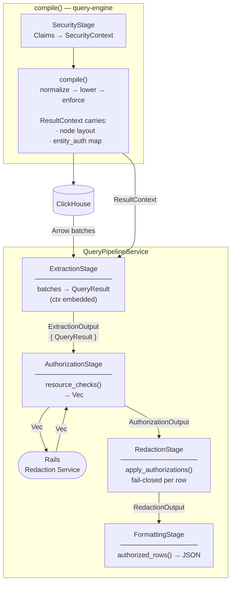
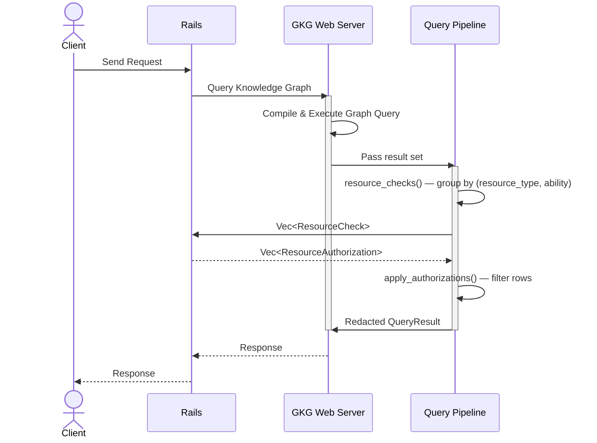
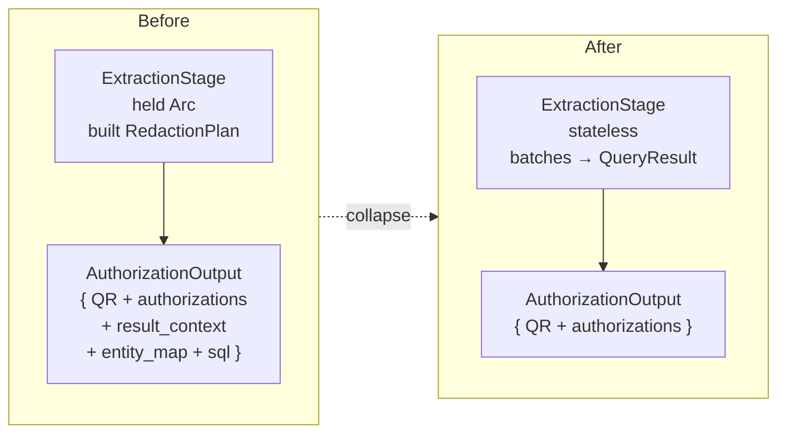

# Mermaid Diagrams

Generate Mermaid diagrams that are accurate to the code or diff being described. Default to `flowchart TD` for pipelines and architecture. Use `sequenceDiagram` for request/response flows between services.

Always pair a diagram with a short readout — one paragraph per major component.

## Choosing diagram type

| Situation | Type |
|---|---|
| Pipeline stages, data flow within a service | `flowchart TD` |
| Request/response between services (client → server → DB) | `sequenceDiagram` |
| Before/after a refactor or MR | Two `flowchart TD` blocks side by side |
| File/module structure | `flowchart TD` with `subgraph` per layer |

## Flowchart conventions

- Use `subgraph` to group related stages (e.g. by service, by crate, by layer).
- Show data types on edges when they add information: `-->|"ExtractionOutput\n{ QueryResult }"|`.
- Use `\n` inside node labels for multi-line content.
- Use `["..."]` for rectangular nodes (stages), `(["..."])` for actors/external systems, `[("...")]` for databases.
- Keep node labels to: name + separator line + key responsibilities only. Omit obvious implementation details.
- Direction: `TD` (top-down) for pipelines, `LR` (left-right) for before/after comparisons.

## Before/after pairs

When documenting a refactor or MR, always produce both diagrams in the same file with a `## Before` / `## After` heading. Add a table summarising what was deleted, collapsed, or kept.

## Examples

### Pipeline flowchart

### Sequence diagram (cross-service request flow)

### Before/after refactor

## Readout format

After each diagram, write one paragraph per major component:

**ComponentName** — What it does, what it takes as input, what it produces, any notable constraints or design decisions.

Keep each paragraph to 2–4 sentences. Do not restate what is already visible in the diagram node label.

## Anti-patterns

- Don't use `graph` — use `flowchart` instead (stricter syntax, better rendering).
- Don't put full struct definitions in node labels — show only the fields relevant to the diagram's argument.
- Don't use `-->` for synchronous calls in sequence diagrams — use `->>`.
- Don't skip the readout — diagrams without prose leave readers inferring intent.
