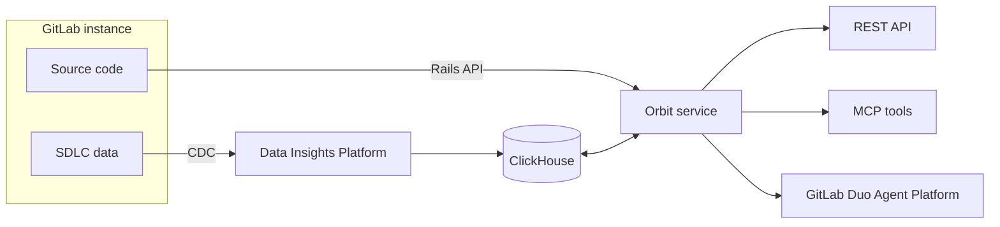

<!-- markdownlint-disable MD041 -->
<div align="center">


# GitLab Orbit

**Software lifecycle context graph for AI agents**

[](https://gitlab.com/gitlab-org/orbit/knowledge-graph/-/pipelines)
[](https://gitlab.com/gitlab-org/orbit/knowledge-graph/-/releases)
[](https://gitlab.com/gitlab-org/orbit/gkg-helm-charts)
[](LICENSE.md)
[](https://gitlab.com/gitlab-community/gitlab-org/orbit/knowledge-graph)

[Docs](https://docs.gitlab.com/orbit/) · [Quickstart](#quickstart) · [Orbit Local](docs/source/local/getting-started.md) · [Orbit Remote](docs/source/remote/getting-started.md) · [AI coding agents](docs/source/ai_coding_agents.md)

</div>

Index your GitLab SDLC and source code as one property graph, then query it from the GitLab UI, a CLI, MCP, or REST. Orbit ships in two shapes: **Orbit Local**, a single-binary CLI that builds a code-only graph from any repository on your machine, and **Orbit Remote**, the hosted graph that spans a top-level GitLab.com group.

> Pre-GA. The Query DSL and ontology may change. Orbit Remote is gated by the `knowledge_graph` feature flag and must be enabled on a top-level group.

## Two ways to run Orbit

### Orbit Local

Orbit Local runs on your machine. The `orbit` CLI parses a local repository, extracts definitions and cross-file references, and writes a code-only property graph to a single DuckDB file. No GitLab account is required at query time. The install step downloads a release artifact over HTTPS.

What it indexes: directories, files, function and class definitions, and cross-file import references. Same 11 languages as Orbit Remote. Multiple repositories share one database at `~/.orbit/graph.duckdb`, each scoped by repository and branch.

| Access method | Use for | Billing |
|---|---|---|
| [`orbit` CLI](docs/source/local/access/cli.md) | Index, query, and inspect the local graph today | None |
| [`glab orbit local`](docs/source/local/access/glab.md) (planned) | Drive Orbit Local through `glab` | None |
| [MCP](docs/source/local/access/mcp.md) (planned) | Expose the local graph to AI coding agents | None |

Start with [Orbit Local getting started](docs/source/local/getting-started.md).

### Orbit Remote

Enable Orbit on a top-level GitLab.com group. Orbit indexes your SDLC and source code into a managed property graph.

What it indexes: SDLC objects (including groups, projects, users, notes, merge requests, pipelines, jobs, work items, milestones, labels, vulnerabilities, findings) and source code on the default branch across Ruby, Java, Kotlin, Python, TypeScript, JavaScript, Rust, Go, C#, C, and C++.

| Access method | Use for | Billing |
|---|---|---|
| [GitLab Duo Agent Platform](docs/source/remote/access/duo.md) | Natural-language questions in the GitLab UI | Zero-rated |
| [MCP](docs/source/remote/access/mcp.md) | Claude Code, Codex, Cursor, opencode, Gemini CLI | GitLab Credits |
| [`glab orbit remote`](docs/source/remote/access/glab.md) | Typed CLI subcommands for scripts and discovery | GitLab Credits |
| [REST API](docs/source/remote/access/api.md) | Pipelines, custom tooling, scripts | GitLab Credits |

Start with [Orbit Remote getting started](docs/source/remote/getting-started.md).



## Quickstart

### Quickstart: Orbit Local

```shell
# Install (macOS, Linux glibc, Linux musl; --libc musl forces the static build)
curl -fsSL "https://gitlab.com/gitlab-org/orbit/knowledge-graph/-/raw/main/install.sh" | bash

# Index the current repository, then query it
orbit index .
orbit sql 'SELECT count(*) FROM gl_definition'
```

### Quickstart: Orbit Remote

```shell
# Requires glab 1.94+, authenticated (glab auth login), with Orbit enabled on your group.
# See docs/source/remote/getting-started.md. Replace your-group/ with your top-level group path.
glab orbit remote schema

echo '{"query":{"query_type":"traversal","node":{"id":"p","entity":"Project","filters":{"full_path":{"op":"starts_with","value":"your-group/"}}},"limit":5}}' \
  | glab orbit remote query -
```

The [cookbook](docs/source/remote/cookbook.md) has blast-radius, dependency, pipeline-health, and vulnerability recipes.

## Features

| Capability | Orbit Local | Orbit Remote |
|---|---|---|
| Scope | Code only | SDLC and code |
| Query interface | Raw DuckDB SQL | Query DSL compiled to ClickHouse SQL |
| GitLab authorization | Filesystem permissions only | Enforced per query |
| Runs offline | Yes (after install) | No |

Orbit Local exposes raw SQL, so traversals are expressed as joins. Orbit Remote supports hop-bounded (max 3) traversals, neighbors, and path finding.

## Architecture

Orbit is a single Rust binary backed by ClickHouse (Remote) or DuckDB (Local), driven by a YAML ontology. The server serves results over HTTP and gRPC, with MCP and REST surfaces layered on top. See the [design documents](docs/design-documents/) and the [data model](docs/design-documents/data_model.md) for the full picture.

## Documentation

| User docs | Developer docs |
|---|---|
| [Orbit overview](docs/source/_index.md) | [Local development](docs/dev/local-development.md) |
| [AI coding agents](docs/source/ai_coding_agents.md) | [Domain glossary (CONTEXT.md)](CONTEXT.md) |
| [Remote: how it works](docs/source/remote/how-it-works.md) · [indexing](docs/source/remote/indexing.md) · [schema](docs/source/remote/schema.md) · [cookbook](docs/source/remote/cookbook.md) · [Query DSL](docs/source/remote/queries/query-language.md) | [Design documents](docs/design-documents/) |
| [Local: how it works](docs/source/local/how-it-works.md) · [indexing](docs/source/local/indexing.md) · [schema](docs/source/local/schema.md) · [`orbit` CLI](docs/source/local/access/cli.md) | [Adding a language](docs/dev/adding-a-language.md) |
| [MCP tool reference](docs/source/queries/mcp_tools.md) | [E2E testing](docs/dev/e2e-testing.md) |
| [Configuration](docs/source/configure.md) | [Indexer crate guide](crates/indexer/AGENTS.md) |
| [Troubleshooting](docs/source/orbit_troubleshooting.md) | [Runbooks](docs/dev/runbooks/) |

The published site is [`docs.gitlab.com/orbit`](https://docs.gitlab.com/orbit/).

## Development

<details>
<summary>Build, test, and run from source</summary>

All tasks run through [mise](https://mise.jdx.dev/).

```shell
mise build            # Build the workspace
mise test:fast        # Unit + fast integration tests
mise test:integration # Full integration suite (requires Docker)
mise lint:code        # Clippy with warnings as errors
mise lint:code:fix    # Apply clippy fixes
mise server:start     # Run gkg-server locally
```

The product name is Orbit. The binary and config still use the engineering name GKG (binary `gkg-server`, config prefixes `GKG_*`, metrics).

- [Local development guide](docs/dev/local-development.md)
- [E2E testing harness](docs/dev/e2e-testing.md)
- [Adding a new language](docs/dev/adding-a-language.md)
- [Indexer crate guide](crates/indexer/AGENTS.md)
- [Operational runbooks](docs/dev/runbooks/)
- [Server configuration runbook](docs/dev/runbooks/server_configuration.md)
- Contributing: open an issue or MR using the templates under [`.gitlab/`](.gitlab/).

</details>

## Project and operations

<details>
<summary>Epics, related repositories, infrastructure, contacts, and SOX boundary</summary>

### Epic landscape

- [Primary GA epic (#19744)](https://gitlab.com/groups/gitlab-org/-/work_items/19744)
- [L4: Introduce GitLab Orbit (#773)](https://gitlab.com/groups/gitlab-operating-model/-/work_items/773)
- [GKG on Dedicated (#915, confidential)](https://gitlab.com/gitlab-com/gl-infra/gitlab-dedicated)
- [First Iteration, predecessor (#17514, closed)](https://gitlab.com/groups/gitlab-org/-/work_items/17514)
- Workstream epics: [Product (#20884)](https://gitlab.com/groups/gitlab-org/-/work_items/20884) · [Core Development (#20357)](https://gitlab.com/groups/gitlab-org/-/work_items/20357) · [Security (#20248)](https://gitlab.com/groups/gitlab-org/-/work_items/20248) · [Infra/Delivery (#36)](https://gitlab.com/groups/gitlab-org/rust/-/work_items/36) · [Architecture & Discovery (#20885)](https://gitlab.com/groups/gitlab-org/-/work_items/20885)
- Cross-functional: [Infra support (#1804)](https://gitlab.com/groups/gitlab-com/gl-infra/-/work_items/1804) · [DataSec support (#407)](https://gitlab.com/groups/gitlab-com/gl-security/-/work_items/407) · [DE&M data product (#86)](https://gitlab.com/groups/gitlab-operating-model/-/work_items/86) · [Monetization (#79)](https://gitlab.com/groups/gitlab-operating-model/-/work_items/79)
- [PREP readiness review !64](https://gitlab.com/gitlab-org/architecture/readiness/-/merge_requests/64)
- [Issues labeled `knowledge graph`](https://gitlab.com/gitlab-org/orbit/knowledge-graph/-/issues/?label_name%5B%5D=knowledge+graph)

### Related repositories

| Repository | Role |
|---|---|
| [`orbit/knowledge-graph`](https://gitlab.com/gitlab-org/orbit/knowledge-graph) | This repo. Server, indexer, CLI. |
| [`orbit/gkg-helm-charts`](https://gitlab.com/gitlab-org/orbit/gkg-helm-charts) | Official Helm chart. |
| [`orbit/gkg-e2e-harness`](https://gitlab.com/gitlab-org/orbit/gkg-e2e-harness) | GKE bootstrap for end-to-end tests. |
| [`orbit/documentation/orbit-artifacts`](https://gitlab.com/gitlab-org/orbit/documentation/orbit-artifacts) | Offsite transcripts and session notes. |
| [`analytics-section/siphon`](https://gitlab.com/gitlab-org/analytics-section/siphon) | External CDC pipeline that feeds the datalake. |
| [`analytics-section/platform-insights/siphon-helm-charts`](https://gitlab.com/gitlab-org/analytics-section/platform-insights/siphon-helm-charts) | Production Siphon Helm chart. |
| [`gitlab-org/gitlab`](https://gitlab.com/gitlab-org/gitlab) | Rails monolith. Owns authorization and serves source code over the internal API. |
| [`gitlab-org/rust/build-images`](https://gitlab.com/gitlab-org/rust/build-images) | CI builder images. |

### Infrastructure

- Helmfiles: [Siphon](https://gitlab.com/gitlab-com/gl-infra/k8s-workloads/gitlab-helmfiles/-/tree/master/releases/siphon) · [NATS](https://gitlab.com/gitlab-com/gl-infra/k8s-workloads/gitlab-helmfiles/-/tree/master/releases/nats) · [Data Insights Platform](https://gitlab.com/gitlab-com/gl-infra/k8s-workloads/gitlab-helmfiles/-/tree/master/releases/data-insights-platform)
- ClickHouse Cloud Terraform: gstg and gprd `clickhouse-cloud.tf` files under [`config-mgmt`](https://ops.gitlab.net/gitlab-com/gl-infra/config-mgmt) (`environments/gstg/` and `environments/gprd/`)
- [Architecture readiness](https://gitlab.com/gitlab-org/architecture/readiness)
- [Data Insights Platform infra module](https://gitlab.com/gitlab-org/analytics-section/platform-insights/data-insights-platform-infra)

### Pipeline operations

- [SDLC indexing runbook](docs/dev/runbooks/sdlc_indexing.md)
- [Code indexing runbook](docs/dev/runbooks/code_indexing.md)
- [Server configuration runbook](docs/dev/runbooks/server_configuration.md)
- [All runbooks](docs/dev/runbooks/)

### Billing and SOX

Billing emission is on the SOX audit boundary. Before touching billing code, read [SOX billing boundary](docs/dev/sox-billing-boundary.md).

- [`crates/gkg-billing/`](crates/gkg-billing/): Snowplow billing-event emission and CDot quota enforcement.
- [`crates/gkg-server/src/billing_adapter.rs`](crates/gkg-server/src/billing_adapter.rs): the single `Claims` to `BillingInputs` conversion point.

### People

| Role | DRI |
|---|---|
| Engineering lead | [@michaelangeloio](https://gitlab.com/michaelangeloio) |
| Product Manager | [@mcorren](https://gitlab.com/mcorren) |
| TPM | [@lyle](https://gitlab.com/lyle) |
| Siphon and DIP architecture | [@ahegyi](https://gitlab.com/ahegyi) |

### Cross-functional partners

| Name | Area |
|---|---|
| Nitin Singhal ([@nitinsinghal74](https://gitlab.com/nitinsinghal74)) | ELT lead |
| Stephanie Jackson | Infrastructure, SRE, PREP |
| Ankit Bhatnagar ([@ankitbhatnagar](https://gitlab.com/ankitbhatnagar)) | NATS, DIP |
| Gus Gray ([`@ggray-gitlab`](https://gitlab.com/ggray-gitlab)) | Security, AuthZ design |
| Jason Plum ([@WarheadsSE](https://gitlab.com/WarheadsSE)) | Delivery, Self-Managed, Dedicated |
| Brian Greene ([@bgreene1](https://gitlab.com/bgreene1)) | Ontology standards |
| Dennis Tang ([@dennis](https://gitlab.com/dennis)) | Analytics stage, ClickHouse operations |
| Nick Leonard ([@nickleonard](https://gitlab.com/nickleonard)) | Design |
| Jerome Ng ([@jeromezng](https://gitlab.com/jeromezng)) | Usage billing system architect |

GitLab stage: Analytics. Group: Knowledge Graph.

</details>

## Maintainers and contributors

Orbit was founded by:

- [@michaelangeloio](https://gitlab.com/michaelangeloio) (Angelo Rivera). Overall engineering lead.
- [@michaelusa](https://gitlab.com/michaelusa) (Michael Usachenko). Code graph and query engine.
- [@jgdoyon1](https://gitlab.com/jgdoyon1) (Jean-Gabriel Doyon). ETL engine and the overall indexing engine.
- [@bohdanpk](https://gitlab.com/bohdanpk) (Bohdan Parkhomchuk). Infrastructure, web server, and security.

Orbit has received contributions from 75+ GitLab team members. See the [contributors graph](https://gitlab.com/gitlab-org/orbit/knowledge-graph/-/graphs/main) for the live list.

## License

GitLab Enterprise Edition (EE) License. See [LICENSE.md](LICENSE.md).
