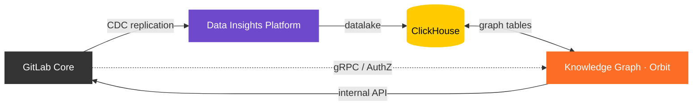

# Orbit - the GitLab Knowledge Graph

This document is the single source of truth for the GitLab Knowledge Graph (Orbit) project.

## Project Overview

The GitLab Knowledge Graph (GKG), product name **Orbit**, is a backend service that builds a property graph from GitLab instance data (SDLC metadata + code structure) and exposes it through a JSON-based Cypher-like DSL compiled to ClickHouse SQL. It provides a unified context API for AI systems (via MCP) and human users, and queryable APIs for data products.

**GA Target**: .com end of April 2026 | Dedicated/SM Q2 FY27

**Deployment**: Cloud native only (Kubernetes/Helm). No Omnibus packaging for the initial iteration.

**Program Landing Page**: [internal handbook](https://internal.gitlab.com/handbook/engineering/r-and-d-pmo/programs/knowledge-graph-ga/) ([source](https://gitlab.com/gitlab-com/content-sites/internal-handbook/blob/main/content/handbook/engineering/r-and-d-pmo/programs/knowledge-graph-ga/_index.md))

---

## 1. Project Architecture

The architecture is documented in the [design documents](docs/design-documents/) and implemented in the [knowledge-graph repository](https://gitlab.com/gitlab-org/orbit/knowledge-graph).

- **GitLab Core** -- PostgreSQL (OLTP) and Rails (application server). The source of all SDLC and code data. Handles authentication and authorization for graph queries. Rails proxies repository archive downloads for code indexing.
- **Data Insights Platform** -- Siphon (CDC) streams PostgreSQL logical replication events through NATS JetStream into ClickHouse.
- **ClickHouse** -- Columnar database serving two logical databases on one instance: the datalake (raw CDC rows from Siphon) and the graph database (indexed property graph tables).
- **Knowledge Graph (Orbit)** -- Rust service that transforms datalake rows into a property graph, parses code via the Rails internal API, and serves graph queries over gRPC. Single binary running as indexer, webserver, scheduler, and health-check.

| Resource | Location |
|---|---|
| Design documents | [`docs/design-documents/`](docs/design-documents/) |
| Crate source | [`crates/`](https://gitlab.com/gitlab-org/orbit/knowledge-graph/-/tree/main/crates) |
| Ontology definitions | [`config/ontology/`](https://gitlab.com/gitlab-org/orbit/knowledge-graph/-/tree/main/config/ontology) |
| Dev documentation | [`docs/`](https://gitlab.com/gitlab-org/orbit/knowledge-graph/-/tree/main/docs) |

> Note: [gitlab-org/rust/knowledge-graph](https://gitlab.com/gitlab-org/rust/knowledge-graph) is the old repository for the local client-side knowledge graph, which will be archived. The code graph was taken from that repo and moved into `orbit/knowledge-graph`.

## 2. Epic Tracker

### Primary Epic

[GitLab Knowledge Graph as a Service - GA (#19744)](https://gitlab.com/groups/gitlab-org/-/work_items/19744)

**Blocks**: [L4: Introduce GitLab Orbit (#773)](https://gitlab.com/groups/gitlab-operating-model/-/work_items/773)

### Workstreams

| Workstream | Epic | Lead(s) | Description |
|---|---|---|---|
| Product | [#20884](https://gitlab.com/groups/gitlab-org/-/work_items/20884) | Meg Corren, Angelo Rivera, Mark Unthank | GTM strategy, pricing, legal review, design |
| Core Development | [#20357](https://gitlab.com/groups/gitlab-org/-/work_items/20357) | Angelo Rivera, J-G Doyon, M. Usachenko, Bohdan | Indexing, query engine, web server, Rails integration, ontology |
| Security | [#20248](https://gitlab.com/groups/gitlab-org/-/work_items/20248) | Gus Gray, Angelo Rivera | AuthZ model, threat modeling, AppSec review, penetration testing |
| Infra / Delivery / PREP | [#36](https://gitlab.com/groups/gitlab-org/rust/-/work_items/36) | Stephanie Jackson, Jason Plum | Production readiness ([PREP MR !64](https://gitlab.com/gitlab-org/architecture/readiness/-/merge_requests/64)), Siphon deployment ([epic #16](https://gitlab.com/groups/gitlab-org/analytics-section/-/work_items/16)), observability, self-managed strategy |
| Architecture & Discovery | [#20885](https://gitlab.com/groups/gitlab-org/-/work_items/20885) | Angelo Rivera, GKG team | DB selection, design doc, executive brief, POC demo |

### Related Epics

| Epic | Namespace | Relationship |
|---|---|---|
| [#1804](https://gitlab.com/groups/gitlab-com/gl-infra/-/work_items/1804) | gl-infra | Infrastructure Support for KG |
| [#407](https://gitlab.com/groups/gitlab-com/gl-security/-/work_items/407) | gl-security | DataSec Support to Orbit |
| [#86](https://gitlab.com/groups/gitlab-operating-model/-/work_items/86) | operating-model | DE&M Data Product GKG |
| [#79](https://gitlab.com/groups/gitlab-operating-model/-/work_items/79) | operating-model | Monetization - Usage-Based Billing |
| [#915](https://gitlab.com/gitlab-com/gl-infra/gitlab-dedicated) | gitlab-dedicated | GKG on Dedicated (confidential) |
| [#17514](https://gitlab.com/groups/gitlab-org/-/work_items/17514) | gitlab-org | First Iteration (closed, predecessor) |

### Related Issues

Filtered by `knowledge graph` label:

- [gitlab-org/orbit/knowledge-graph](https://gitlab.com/gitlab-org/orbit/knowledge-graph/-/issues/?label_name%5B%5D=knowledge+graph)
- [gitlab-org group](https://gitlab.com/groups/gitlab-org/-/issues/?label_name%5B%5D=knowledge+graph)
- [gitlab-operating-model group](https://gitlab.com/groups/gitlab-operating-model/-/work_items/?label_name%5B%5D=knowledge+graph)

---

## 3. Repositories

### Orbit

| Repository | Purpose |
|---|---|
| [gitlab-org/orbit/knowledge-graph](https://gitlab.com/gitlab-org/orbit/knowledge-graph) | Main GKG service -- 19 Rust crates covering parsing, indexing, query compilation, serving, testing, and infrastructure. Single `gkg-server` binary runs in 4 modes (webserver, indexer, scheduler, health-check). |
| [gitlab-org/orbit/build-images](https://gitlab.com/gitlab-org/orbit/build-images) | CI builder images (Rust toolchain, pre-compiled tools, sccache) used by the knowledge-graph pipeline |
| [gitlab-org/orbit/gkg-helm-charts](https://gitlab.com/gitlab-org/orbit/gkg-helm-charts) | Official production Helm chart for GKG (v1.0.0, application chart, uses [common-ci-tasks](https://gitlab.com/gitlab-com/gl-infra/common-ci-tasks) patterns) |
| [gitlab-org/orbit/gkg-e2e-harness](https://gitlab.com/gitlab-org/orbit/gkg-e2e-harness) | GKE cluster bootstrap for e2e tests (cert-manager, GitLab Agent config) |
| [gitlab-org/orbit/documentation/orbit-artifacts](https://gitlab.com/gitlab-org/orbit/documentation/orbit-artifacts) | Offsite transcripts and session notes (Feb 3-5, 2026) |

### Analytics (Siphon)

| Repository | Purpose |
|---|---|
| [gitlab-org/analytics-section/siphon](https://gitlab.com/gitlab-org/analytics-section/siphon) | CDC pipeline (Go): PostgreSQL logical replication -> NATS -> ClickHouse. Helm chart at `helm/siphon/` (v0.0.1, standalone). |
| [gitlab-org/analytics-section/platform-insights/siphon-helm-charts](https://gitlab.com/gitlab-org/analytics-section/platform-insights/siphon-helm-charts) | Production Siphon Helm chart (v1.0.1), deployed via gitlab-helmfiles on ops.gitlab.net |

### Related GitLab Projects

| Repository | Purpose |
|---|---|
| [gitlab-org/gitlab](https://gitlab.com/gitlab-org/gitlab) | Rails integration: AuthZ redaction exchange, feature flags, MCP endpoint (`/api/v4/mcp-orbit`), internal API for code archive downloads |
| [gitlab-org/gitlab-zoekt-indexer](https://gitlab.com/gitlab-org/gitlab-zoekt-indexer) | Zoekt code search indexer (historical context: early KG integration MRs in CNG attempted embedding KG via Zoekt FFI) |

### Infrastructure (ops.gitlab.net)

These repositories on [ops.gitlab.net](https://ops.gitlab.net) manage the Kubernetes infrastructure and deployment configs for the GitLab production and staging environments. GKG/Siphon staging infrastructure is configured here.

| Repository | Purpose |
|---|---|
| [gitlab-com/gl-infra/config-mgmt](https://ops.gitlab.net/gitlab-com/gl-infra/config-mgmt) | Terraform modules for GKE clusters, Vault integration, Private Service Connect (PSC) networking for Patroni connectivity, and CI runner signing (KMS HSM via OIDC). Contains 8+ MRs for Siphon PSC setup (Jan-Feb 2026). |
| [gitlab-com/gl-infra/k8s-workloads/gitlab-helmfiles](https://gitlab.com/gitlab-com/gl-infra/k8s-workloads/gitlab-helmfiles) | Monorepo for Helm release configuration across all GitLab.com services (except the GitLab Helm Chart itself). Managed by Helmfile. Contains Siphon ([`releases/siphon/`](https://gitlab.com/gitlab-com/gl-infra/k8s-workloads/gitlab-helmfiles/-/tree/master/releases/siphon)), NATS ([`releases/nats/`](https://gitlab.com/gitlab-com/gl-infra/k8s-workloads/gitlab-helmfiles/-/tree/master/releases/nats)), and DIP ([`releases/data-insights-platform/`](https://gitlab.com/gitlab-com/gl-infra/k8s-workloads/gitlab-helmfiles/-/tree/master/releases/data-insights-platform)) release configs. [Push-mirrored to ops.gitlab.net](https://ops.gitlab.net/gitlab-com/gl-infra/k8s-workloads/gitlab-helmfiles) for CI/CD deployments and gitlab.com outage resilience. |
| [gitlab-com/gl-infra/k8s-workloads/gitlab-com](https://ops.gitlab.net/gitlab-com/gl-infra/k8s-workloads/gitlab-com) | Main gitlab.com Kubernetes workloads (no GKG content currently) |
| [gitlab-com/gl-infra/chef-repo](https://ops.gitlab.net/gitlab-com/gl-infra/chef-repo) | Chef node configuration (no GKG/Siphon content found) |

### Documentation

| Location | Purpose |
|---|---|
| [Readiness (current)](https://gitlab.com/gitlab-org/architecture/readiness) | New official PREP readiness process. GKG assessment [MR !64](https://gitlab.com/gitlab-org/architecture/readiness/-/merge_requests/64). |
| [GKG design documents](docs/design-documents/) | Architectural design documents for GKG |
| [Data Insights Platform design doc](https://gitlab.com/gitlab-com/content-sites/handbook/blob/main/content/handbook/engineering/architecture/design-documents/data_insights_platform) | DIP design document (Siphon's parent platform) |
| [Internal program page](https://internal.gitlab.com/handbook/engineering/r-and-d-pmo/programs/knowledge-graph-ga/) | R&D PMO program landing page ([source](https://gitlab.com/gitlab-com/content-sites/internal-handbook/blob/main/content/handbook/engineering/r-and-d-pmo/programs/knowledge-graph-ga/_index.md)) |
| [orbit-artifacts](https://gitlab.com/gitlab-org/orbit/documentation/orbit-artifacts) | Offsite transcripts and summary (Feb 3-5, 2026): architecture, indexing, query engine, infra, DIP, deployment, billing |
| [Readiness reviews (old)](https://gitlab.com/gitlab-com/gl-infra/readiness) | Legacy readiness repo. Siphon review [MR !231](https://gitlab.com/gitlab-com/gl-infra/readiness/-/merge_requests/231) (open, 78 comments), NATS review [MR !240](https://gitlab.com/gitlab-com/gl-infra/readiness/-/merge_requests/240) (merged). |
| Server configuration | [docs/dev/runbooks/server_configuration.md](https://gitlab.com/gitlab-org/orbit/knowledge-graph/-/blob/main/docs/dev/runbooks/server_configuration.md) -- config loading, env vars, tuning, Helm chart mapping |
| Operational runbooks | [docs/dev/runbooks/](https://gitlab.com/gitlab-org/orbit/knowledge-graph/-/tree/main/docs/dev/runbooks) -- indexing pipelines, configuration, troubleshooting |
| Local GDK-connected development | [docs/dev/local-development.md](https://gitlab.com/gitlab-org/orbit/knowledge-graph/-/blob/main/docs/dev/local-development.md) -- `mise run dev` to launch the full local stack against an existing GDK |
| E2E testing harness | [docs/dev/e2e-testing.md](https://gitlab.com/gitlab-org/orbit/knowledge-graph/-/blob/main/docs/dev/e2e-testing.md) -- full-stack e2e tests on GKE (GitLab + Siphon + GKG), runs in CI on MRs |
| [Design Specs (Figma)](https://www.figma.com/design/GOrqDStp1E1SE0Ms7lVbXF/--588317--Orbit-GA-Designs?t=SLZ2CosGuBAzjC6r-0) | UI/UX design specs and visual references for Orbit GA features |

---

## 4. Helm Charts

| Chart | Repository | Purpose |
|---|---|---|
| GKG (official) | [gitlab-org/orbit/gkg-helm-charts](https://gitlab.com/gitlab-org/orbit/gkg-helm-charts) | Production Helm chart for GKG (v1.0.0, application chart). |
| Siphon (standalone) | [`siphon/helm/siphon/`](https://gitlab.com/gitlab-org/analytics-section/siphon/-/tree/main/helm/siphon) | Minimal standalone chart (v0.0.1). Superseded by the GKG dev chart for GKG deployments. |
| Siphon (production) | [siphon-helm-charts](https://gitlab.com/gitlab-org/analytics-section/platform-insights/siphon-helm-charts) | v1.0.1, deployed via [gitlab-helmfiles](https://ops.gitlab.net/gitlab-com/gl-infra/k8s-workloads/gitlab-helmfiles) on ops.gitlab.net |

---

## 5. Infrastructure

### Sandbox (Development)

| Resource | Details |
|---|---|
| GCP Project | `gl-knowledgegraph-prj-f2eec59d` |
| GKE Cluster | `knowledge-graph-test` (us-central1) |
| ClickHouse VM | `vm-clickhouse` (n4-standard-16) |
| GitLab VM | `vm-gitlab-omnibus` (n4-standard-8, includes Gitaly + PostgreSQL) |
| Domain | `gitlab.gkg.dev` |
| Secrets | GCP Secret Manager -> External Secrets Operator |

See the [server configuration runbook](https://gitlab.com/gitlab-org/orbit/knowledge-graph/-/blob/main/docs/dev/runbooks/server_configuration.md) for full config reference.

### Staging (gitlab-helmfiles managed)

Staging is deployed to the `analytics-eventsdot-stg` environment. All configs live in [gitlab-helmfiles](https://gitlab.com/gitlab-com/gl-infra/k8s-workloads/gitlab-helmfiles):

| Resource | Config |
|---|---|
| Staging environment | [`bases/environments/analytics-eventsdot-stg.yaml`](https://gitlab.com/gitlab-com/gl-infra/k8s-workloads/gitlab-helmfiles/-/blob/master/bases/environments/analytics-eventsdot-stg.yaml) |
| Siphon helmfile | [`releases/siphon/helmfile.yaml.gotmpl`](https://gitlab.com/gitlab-com/gl-infra/k8s-workloads/gitlab-helmfiles/-/blob/master/releases/siphon/helmfile.yaml.gotmpl) |
| Siphon staging values | [`releases/siphon/analytics-eventsdot-stg.yaml.gotmpl`](https://gitlab.com/gitlab-com/gl-infra/k8s-workloads/gitlab-helmfiles/-/blob/master/releases/siphon/analytics-eventsdot-stg.yaml.gotmpl) |
| Siphon staging secrets | [`releases/siphon/values-secrets/analytics-eventsdot-stg.yaml.gotmpl`](https://gitlab.com/gitlab-com/gl-infra/k8s-workloads/gitlab-helmfiles/-/blob/master/releases/siphon/values-secrets/analytics-eventsdot-stg.yaml.gotmpl) |
| NATS staging values | [`releases/nats/analytics-eventsdot-stg.yaml.gotmpl`](https://gitlab.com/gitlab-com/gl-infra/k8s-workloads/gitlab-helmfiles/-/blob/master/releases/nats/analytics-eventsdot-stg.yaml.gotmpl) |
| NATS base + network policy | [`releases/nats/values.yaml.gotmpl`](https://gitlab.com/gitlab-com/gl-infra/k8s-workloads/gitlab-helmfiles/-/blob/master/releases/nats/values.yaml.gotmpl) |
| NATS production values | [`releases/nats/analytics-eventsdot-prod.yaml.gotmpl`](https://gitlab.com/gitlab-com/gl-infra/k8s-workloads/gitlab-helmfiles/-/blob/master/releases/nats/analytics-eventsdot-prod.yaml.gotmpl) |
| Vault secrets | ESO pulls PostgreSQL credentials from `{cluster}/siphon/postgresql` |
| PSC | Primary + replica connections to gstg Patroni via Backend Service + ILB + PSC (managed in [config-mgmt](https://ops.gitlab.net/gitlab-com/gl-infra/config-mgmt)) |

### Siphon Staging

Siphon is the CDC pipeline that feeds GKG. Its staging deployment is tracked across several issues and epics:

| Reference | Purpose |
|---|---|
| [epic #16](https://gitlab.com/groups/gitlab-org/analytics-section/-/work_items/16) | Producer-only Siphon deployment to staging |
| [siphon#174](https://gitlab.com/gitlab-org/analytics-section/siphon/-/work_items/174) | Patroni connectivity (PSC networking, firewall rules) |
| [siphon#175](https://gitlab.com/gitlab-org/analytics-section/siphon/-/issues/175) | Staging validation test plan |
| [#586](https://gitlab.com/gitlab-org/database-team/team-tasks/-/issues/586) | DBRE counterpart request for staging support |
| [#28386](https://gitlab.com/gitlab-com/gl-infra/production-engineering/-/work_items/28386) | Production engineering SRE/DBRE support (DRI: Alex Hanselka) |
| [readiness#120](https://gitlab.com/gitlab-com/gl-infra/readiness/-/issues/120) | Siphon readiness review issue |
| [readiness !231](https://gitlab.com/gitlab-com/gl-infra/readiness/-/merge_requests/231) | Siphon readiness review MR |
| [readiness !240](https://gitlab.com/gitlab-com/gl-infra/readiness/-/merge_requests/240) | NATS readiness review MR (merged) |

### Terraform / IaC

All Terraform lives in [config-mgmt](https://ops.gitlab.net/gitlab-com/gl-infra/config-mgmt) on ops.gitlab.net, managed via Atlantis. No dedicated GKG Terraform project exists -- the sandbox is managed via Helm charts and GCP console.

#### Environments

| Environment | Path | Manages |
|---|---|---|
| `siphon-staging` | [`environments/siphon-staging/`](https://ops.gitlab.net/gitlab-com/gl-infra/config-mgmt/-/tree/main/environments/siphon-staging) | Dedicated GKE cluster (`data-stg-siphon-5b03df32`, us-east1), VPC, Cloud NAT, Vault |
| `analytics-eventsdot-stg` | [`environments/analytics-eventsdot-stg/`](https://ops.gitlab.net/gitlab-com/gl-infra/config-mgmt/-/tree/main/environments/analytics-eventsdot-stg) | GKE cluster with `siphon-pool` (tainted), PSC to Patroni primary/replica, ArgoCD, logging |
| `analytics-eventsdot-prod` | [`environments/analytics-eventsdot-prod/`](https://ops.gitlab.net/gitlab-com/gl-infra/config-mgmt/-/tree/main/environments/analytics-eventsdot-prod) | Production GKE cluster, Vault, ArgoCD (no siphon pool yet) |
| `ci-runners-signing` | [`environments/ci-runners-signing/`](https://ops.gitlab.net/gitlab-com/gl-infra/config-mgmt/-/tree/main/environments/ci-runners-signing) | KMS HSM code signing for knowledge-graph binaries via OIDC (project 69095239) |
| `vault-production` | [`environments/vault-production/`](https://ops.gitlab.net/gitlab-com/gl-infra/config-mgmt/-/tree/main/environments/vault-production) | K8s auth roles for Siphon across all clusters, secrets policies for `analytics_siphon` group |
| `gstg` | [`environments/gstg/clickhouse-cloud.tf`](https://ops.gitlab.net/gitlab-com/gl-infra/config-mgmt/-/blob/main/environments/gstg/clickhouse-cloud.tf) | ClickHouse Cloud staging: PSC, firewall rules, private DNS |
| `gprd` | [`environments/gprd/clickhouse-cloud.tf`](https://ops.gitlab.net/gitlab-com/gl-infra/config-mgmt/-/blob/main/environments/gprd/clickhouse-cloud.tf) | ClickHouse Cloud production: PSC, firewall rules, private DNS |

#### Shared Modules

| Module | Source | Purpose |
|---|---|---|
| DIP infra | [data-insights-platform-infra](https://gitlab.com/gitlab-org/analytics-section/platform-insights/data-insights-platform-infra) | Base GKE/VPC Terraform module used by both eventsdot environments |
| GKE | [`ops.gitlab.net/gitlab-com/gke/google`](https://ops.gitlab.net/gitlab-com/gl-infra/terraform-modules/google/gke) v16.13.0 | GKE cluster provisioning ([mirror](https://gitlab.com/gitlab-com/gl-infra/terraform-modules/google/gke)) |
| GCP OIDC | `ops.gitlab.net/gitlab-com/gcp-oidc/google` v3.4.0 | OIDC federation between GitLab CI and GCP (used for CI signing) |
| ArgoCD bootstrap | `gitlab.com/gitlab-com/gke-argocd-bootstrap/google` v1.5.0 | ArgoCD setup on GKE clusters |

### Container Images

| Image | Registry |
|---|---|
| GKG Server | [`gitlab-org/orbit/knowledge-graph/gkg`](https://gitlab.com/gitlab-org/orbit/knowledge-graph/container_registry) |
| Siphon | [`gitlab-org/analytics-section/siphon`](https://gitlab.com/gitlab-org/analytics-section/siphon/container_registry) |
| Rust Builder | [`gitlab-org/orbit/build-images/rust-builder`](https://gitlab.com/gitlab-org/orbit/build-images/container_registry) |

---

## 6. Usage Billing

Billing infrastructure for GKG is **not yet implemented**. It will leverage the existing consumption-based billing system (CustomersDot, Snowplow, ClickHouse) used by AI Gateway and other services.

Architecture and implementation details are **TODO** -- to be filled out as this workstream progresses.

### References

| Reference | Purpose |
|---|---|
| [#79](https://gitlab.com/groups/gitlab-operating-model/-/work_items/79) | Monetization - Usage-Based Billing epic |
| [Offsite billing session](https://gitlab.com/gitlab-org/orbit/documentation/orbit-artifacts) | Day 2 Session 4: credit-based model, blocking vs non-blocking, SOX, namespace billing, storage considerations |
| [Usage billing system doc](https://docs.google.com/document/u/0/d/1uJXz4PaRysMPS6yAo8V9W_gOFp4qb27a-q0VYGz1-04/edit) | GitLab Usage Billing System design document |
| [Pricing multipliers](https://gitlab.com/gitlab-org/customers-gitlab-com/-/blob/main/config/billing/pricing_multipliers.yml) | SKU definitions and credit multipliers in CustomersDot |
| [Usage billing runbook](https://runbooks.gitlab.com/customersdot/usage-billing/#diagram) | CDot billing system architecture and operational runbook |
| [SOX ITGC controls](https://docs.google.com/spreadsheets/d/1BGTZAriUYIubEJcVHoYqmXm7FLoqQcNiPJkylZidkeY/edit?gid=121873557#gid=121873557) | SOX audit requirements for billing code paths |
| [Credits dashboard](https://docs.gitlab.com/subscriptions/gitlab_credits/#gitlab-credits-dashboard) | End-user credits dashboard documentation |

### Contacts

Jerome Ng (@jeromezng, usage billing system architect).

---

## 7. Runbooks & Observability

**TODO** -- this section will cover production runbooks, alerting, and observability metrics.

### Runbooks

| Runbook | Location |
|---|---|
| SDLC indexing | [`docs/dev/runbooks/sdlc_indexing.md`](https://gitlab.com/gitlab-org/orbit/knowledge-graph/-/blob/main/docs/dev/runbooks/sdlc_indexing.md) |
| Code indexing | [`docs/dev/runbooks/code_indexing.md`](https://gitlab.com/gitlab-org/orbit/knowledge-graph/-/blob/main/docs/dev/runbooks/code_indexing.md) |
| Server configuration | [`docs/dev/runbooks/server_configuration.md`](https://gitlab.com/gitlab-org/orbit/knowledge-graph/-/blob/main/docs/dev/runbooks/server_configuration.md) |
| Production runbook | TODO |

### Observability

| Component | Status |
|---|---|
| Grafana dashboards (dev) | TODO |
| Production Grafana dashboards | TODO |
| Alerting rules | TODO |
| SLIs / SLOs | TODO -- to be defined as part of [PREP](https://gitlab.com/gitlab-org/architecture/readiness/-/merge_requests/64) |
| Metrics | TODO -- gRPC latency, indexing throughput, query latency, redaction exchange timing, ClickHouse query performance |

---

## 8. People

| Person | Role |
|---|---|
| Nitin Singhal (@nitinsinghal74) | ELT Lead |
| Angelo Rivera (@michaelangeloio) | GKG Lead |
| Meg Corren (@mcorren) | Product Manager |
| Jean-Gabriel Doyon (@jgdoyon1) | SDLC Indexing, Code Indexing, Schema Management |
| Michael Usachenko (@michaelusa) | Graph Query Engine / Compiler |
| Bohdan Parkhomchuk (@bohdanpk) | CI/CD, Deployment, Helm Charts |
| Stephanie Jackson (@stejacks-gitlab) | Infrastructure / SRE, PREP |
| Lyle Kozloff (@lyle) | TPM |
| Adam Hegyi (@ahegyi) | Siphon / DIP Architecture |
| Ankit Bhatnagar (@ankitbhatnagar) | NATS, DIP |
| Arun Sori (@arun.sori) | Siphon Connectivity DRI |
| Alex Hanselka (@ahanselka) | Production Engineering DRI |
| Gus Gray (@ggray-gitlab) | Security, AuthZ Design |
| Jason Plum (@WarheadsSE) | Delivery, SM/Dedicated |
| Brian Greene (@bgreene1) | Ontology Standards |
| Dennis Tang (@dennis) | Analytics Stage, ClickHouse Operations |
| Mark Unthank (@munthank) | Design |
