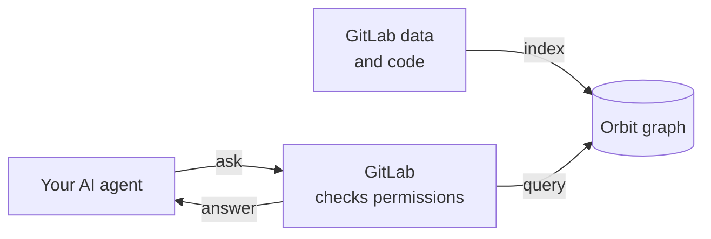

<!-- markdownlint-disable MD041 -->
<div align="center">


# GitLab Orbit

**Software lifecycle context graph for AI agents**

[](https://gitlab.com/gitlab-org/orbit/knowledge-graph/-/pipelines)
[](https://gitlab.com/gitlab-org/orbit/knowledge-graph/-/releases)
[](https://gitlab.com/gitlab-org/orbit/orbit-helm-charts)
[](LICENSE.md)
[](https://gitlab.com/gitlab-community/gitlab-org/orbit/knowledge-graph)

[Docs](https://docs.gitlab.com/orbit/) · [Quickstart](#quickstart) · [Use cases](docs/source/remote/cookbook.md) · [CLI](docs/source/remote/access/glab.md) · [Contribute](#contribute)

</div>

**Ask your GitLab anything.**
GitLab Orbit is the context graph of your software lifecycle.
It connects your code, merge requests, pipelines, work items, and vulnerabilities in one graph that every AI agent can query.
Ask what breaks if a service changes, or which CI/CD jobs fail most.
Each answer shows only the data that your GitLab role lets you see.

> [!note]
> GitLab Orbit is in beta. The query language and the schema can change.
> The graph of your group needs GitLab Premium or Ultimate.

## Quickstart

Install the [GitLab CLI](https://docs.gitlab.com/cli/) (`glab`) 1.119 or later.
Then, in a Git repository, run:

```shell
glab auth login
glab orbit setup
```

`setup` downloads the GitLab Orbit CLI, connects the AI agents on your machine, and indexes the repository.
Open your agent in the repository, and ask it this question.

```plaintext
Using GitLab Orbit, what does this project do, and how is it structured?
```

To ask about merge requests, pipelines, and vulnerabilities, an Owner of your top-level group must
[turn on GitLab Orbit](docs/source/remote/getting-started.md#step-1-enable-gitlab-orbit) first.
For the full walkthrough with example output, see the [GitLab Orbit documentation](https://docs.gitlab.com/orbit/).

## Ways to use GitLab Orbit

| Surface | Use it to |
|---|---|
| [`glab orbit`](docs/source/remote/access/glab.md) | Search code, read definitions with their callers, and query the graph from a terminal. |
| [AI coding agents](docs/source/ai_coding_agents.md) | Give your coding agents the graph and the GitLab Orbit skill through `glab orbit setup`. |
| [MCP](docs/source/remote/access/mcp.md) | Connect any MCP client to the graph. |
| [GitLab Duo Agent Platform](docs/source/remote/access/duo.md) | Ask questions in the GitLab UI. |
| [REST API](docs/source/remote/access/api.md) | Query the graph from scripts, pipelines, and your own tools. |

For the query language, the schema, security, and troubleshooting, see the [GitLab Orbit documentation](https://docs.gitlab.com/orbit/).

## How it works


```mermaid
flowchart LR
  accTitle: How GitLab Orbit answers a question
  accDescr: GitLab Orbit indexes GitLab data and code into the Orbit graph. Your agent asks GitLab. GitLab checks your permissions, queries the graph, and returns only the data that you can read.
  source[GitLab data<br/>and code] -- index --> store[(Orbit graph)]
  agent[Your AI agent] -- ask --> rails[GitLab<br/>checks permissions]
  rails -- query --> store
  rails -- answer --> agent
```

1. **Index.** GitLab Orbit copies the data and the default-branch code of each top-level group into a graph in ClickHouse.
   It updates the graph when the data changes.
1. **Ask.** Your agent sends a question through `glab orbit`, MCP, the REST API, or GitLab Duo.
1. **Check.** GitLab checks your permissions, runs the query on the graph, and returns only the data that you can read.

`glab orbit` also indexes the repository on your machine, so code questions work offline.
For the components, see [how GitLab Orbit works](docs/source/remote/how-it-works.md) and the [design documents](docs/design-documents/).

## Contribute

Read [CONTRIBUTING.md](CONTRIBUTING.md) first. It has the setup, the `mise` tasks, good first issues, and the MR conventions.
Many tasks need no deep Rust knowledge, for example docs, ontology YAML, and test fixtures for a language.

| Guide | Use it to |
|---|---|
| [Local development](docs/dev/local-development.md) | Run the full stack with GDK, ClickHouse, and NATS. |
| [Testing strategy](docs/design-documents/testing.md) | Learn which tests a change needs. |
| [Adding a language](docs/dev/adding-a-language.md) | Add a parser for a new language. |
| [Design documents](docs/design-documents/) | Read the design of each area before you change it. |

GitLab Orbit also uses these public repositories:
[GitLab Rails](https://gitlab.com/gitlab-org/gitlab),
[Siphon](https://gitlab.com/gitlab-org/analytics-section/siphon),
the [Orbit Helm chart](https://gitlab.com/gitlab-org/orbit/orbit-helm-charts), and the
[end-to-end test harness](https://gitlab.com/gitlab-org/orbit/orbit-e2e-harness).

The product name is GitLab Orbit.
The old engineering name GKG stays in the `gkg-server` binary, metric names, environment variables, and NATS stream names.

To report a bug, open an issue with the [bug report template](https://gitlab.com/gitlab-org/orbit/knowledge-graph/-/issues/new?issuable_template=Bug_Report).
GitLab team members can find the roadmap, the team, runbooks, deployments, and dashboards in the [Orbit portal](https://gitlab-org.gitlab.io/orbit/portal/).

## Maintainers and contributors

These people founded GitLab Orbit:

- [@michaelangeloio](https://gitlab.com/michaelangeloio) (Angelo Rivera): engineering lead.
- [@michaelusa](https://gitlab.com/michaelusa) (Michael Usachenko): code graph and query engine.
- [@jgdoyon1](https://gitlab.com/jgdoyon1) (Jean-Gabriel Doyon): ETL engine and indexing.
- [@bohdanpk](https://gitlab.com/bohdanpk) (Bohdan Parkhomchuk): infrastructure, web server, and security.

See the [contributors graph](https://gitlab.com/gitlab-org/orbit/knowledge-graph/-/graphs/main) for everyone who contributes to GitLab Orbit.

## License

GitLab Enterprise Edition (EE) License. See [LICENSE.md](LICENSE.md).
