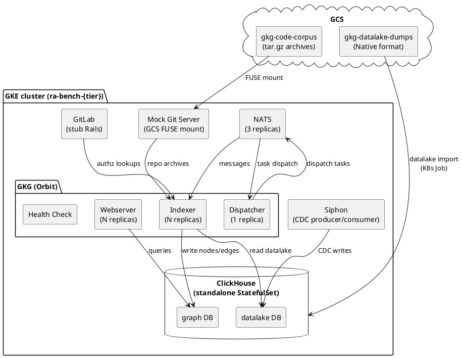

# RA Bench Harness

The bench harness answers one question: can a given hardware configuration run
Orbit and meet its SLOs under realistic load? It stands up a full Orbit stack
on a fresh GKE cluster, replays a real datalake dump through the indexing
pipeline, and measures whether query latency, message processing, and resource
usage stay within defined targets.

The simulation is as close to production as possible. The datalake dump comes
from a live GitLab.com export. The code corpus is 7,736 real `gitlab-org`
repository archives fetched from GitLab. The CDC pipeline (Siphon), the
ClickHouse schema, and the GKG binary are all the same versions that run in
production. The only fakes are a stub GitLab instance (for authorization
lookups) and a mock git server (serving archives from GCS instead of live
clones).

## Architecture



### Data flow

1. **Datalake import.** A K8s Job downloads a point-in-time dump of
   GitLab.com's Siphon tables from GCS and inserts them into the standalone
   ClickHouse's `datalake` database. Watermarks are spread across 24
   synthetic hours to simulate realistic CDC arrival.

2. **SDLC indexing.** The dispatcher reads watermarks from the datalake,
   dispatches indexing tasks via NATS, and the indexer transforms datalake
   rows into the property graph in the `gkg` database. This is the same
   pipeline that runs in production.

3. **Code indexing.** The indexer fetches repository archives from the mock
   git server (which serves them from a GCS FUSE mount), parses them with
   tree-sitter, and writes code graph nodes and edges to ClickHouse.

4. **SLO evaluation.** `slos.sh` queries Cloud Monitoring (GMP) for
   watermark lag and message throughput, ClickHouse's `system.query_log`
   for query latency, and kubectl for OOM kills. Results are compared
   against the tier's SLO targets.

### Tier system

Three tiers define the hardware and SLO targets. Edit `bench.yaml` to
select the active tier; everything else adapts automatically.

| Tier | Nodes | ClickHouse | Indexer | Webserver |
|------|-------|------------|---------|-----------|
| small | 3x `e2-standard-8` | 8 CPU, 32 GiB | 1 replica | 2 replicas |
| medium | 3x `e2-standard-16` | 8 CPU, 32 GiB | 2 replicas | 3 replicas |
| large | 5x `e2-standard-32` | 16 CPU, 64 GiB | 3 replicas | 4 replicas |

Full tier definitions (resource requests/limits, concurrency, SLO targets)
are in `bench/config/tiers.yaml`.

## Prerequisites

- `gcloud` CLI, authenticated with access to `gl-knowledgegraph-prj-f2eec59d`
- `terraform` >= 1.5 (installed via `mise`)
- `helm` 3
- `yq`
- `docker` with `buildx` (for the mock git server image)
- SSH key registered with gitlab.com (for fetching the code corpus)

## Quick start (from snapshot)

If a golden snapshot and code corpus already exist, a full run takes about
15 minutes. This is the common case after the initial setup.

```bash
# 1. Create the cluster (~15 min)
bash bench/scripts/infra.sh init
bash bench/scripts/infra.sh apply

# 2. Provision from snapshot (~5 min)
RUN_ID=bench1 RA_DATALAKE_SNAPSHOT=golden-core-2026-06-25-1115 \
  RA_SNAPSHOT_SOURCE_CTX=gke_gl-knowledgegraph-prj-f2eec59d_us-central1-a_ra-bench-smoke \
  bash bench/scripts/provision.sh

# 3. Deploy mock git server for code indexing (~2 min)
RUN_ID=bench1 bash bench/scripts/deploy-mock-git-server.sh

# 4. Wait for indexing, then check SLOs
RUN_ID=bench1 bash bench/scripts/slos.sh

# 5. Tear down when done
bash bench/scripts/infra.sh destroy
```

## First-time setup

### 1. Bootstrap the Terraform state bucket

Run once. Creates the GCS bucket that stores Terraform state.

```bash
cd bench/infra/bootstrap
terraform init && terraform apply
```

### 2. Create the cluster

```bash
bash bench/scripts/infra.sh init
bash bench/scripts/infra.sh apply
```

This creates:
- A GKE cluster named `ra-bench-{tier}` with node pools sized from `tiers.yaml`
- cert-manager with a self-signed root CA
- Prometheus operator CRDs for GMP pod monitoring
- GCS FUSE CSI driver for the mock git server
- kubectl credentials in your local kubeconfig

### 3. Provision the stack

```bash
RUN_ID=bench1 bash bench/scripts/provision.sh
```

This deploys:
- Standalone ClickHouse (PVC-backed StatefulSet)
- Full e2e stack via Helmfile: GitLab, PostgreSQL, Redis, NATS, Siphon, GKG
- Imports the datalake dump from GCS (~15 minutes)
- Resets dispatcher checkpoints and starts SDLC indexing
- Enables GMP metrics scraping

### 4. Create a golden snapshot

Once the import finishes, snapshot the ClickHouse PVC so future runs skip
the 15-minute import:

```bash
RUN_ID=bench1 DUMP_PREFIX=core-2026-06-25-1115 bash bench/scripts/snapshot-datalake.sh
```

### 5. Build the code corpus

Dump the project list from the datalake and fetch archives from gitlab.com:

```bash
RUN_ID=bench1 bash bench/scripts/dump-project-list.sh > projects.tsv
bash bench/scripts/fetch-code-corpus.sh projects.tsv
```

This streams `git archive` output via SSH directly to GCS. The full corpus
(7,736 repos) takes a few hours. Test with a subset first:

```bash
FETCH_MAX=50 bash bench/scripts/fetch-code-corpus.sh projects.tsv
```

### 6. Deploy the mock git server

```bash
RUN_ID=bench1 bash bench/scripts/deploy-mock-git-server.sh
```

This builds the mock server image, deploys it with a GCS FUSE mount to the
corpus bucket, upgrades the GKG Helm release to point the indexer at it,
resets code indexing checkpoints, and restarts the indexer.

### 7. Check SLOs

```bash
RUN_ID=bench1 bash bench/scripts/slos.sh
```

Produces a table of 4 SLOs (query p90, success rate, watermark lag, OOM
count) evaluated against the tier's targets from `tiers.yaml`.

## Cluster lifecycle

Each tier gets its own cluster. The full lifecycle is create, use, destroy.

```bash
bash bench/scripts/infra.sh apply                              # create
bash bench/scripts/infra.sh apply -var dedicated_ch_pool=true  # add CH pool
bash bench/scripts/infra.sh destroy                            # tear down
```

To switch tiers, edit the `tier` field in `bench.yaml` and re-run apply.
To run multiple clusters in parallel, override the cluster name:

```bash
bash bench/scripts/infra.sh apply -var cluster_name=ra-bench-small-2
```

## Cross-cluster snapshot restore

When provisioning a fresh cluster from a snapshot created on a different
cluster, pass the source kubectl context:

```bash
RUN_ID=bench2 RA_DATALAKE_SNAPSHOT=golden-core-2026-06-25-1115 \
  RA_SNAPSHOT_SOURCE_CTX=gke_gl-knowledgegraph-prj-f2eec59d_us-central1-a_ra-bench-smoke \
  bash bench/scripts/provision.sh
```

The script resolves the GCE disk snapshot handle from the source cluster and
creates the VolumeSnapshot objects on the target cluster. You can also pass
the handle directly with `RA_SNAPSHOT_HANDLE` to skip the lookup.

## Configuration

All config lives in two YAML files. Scripts and Terraform both read from them.

- `bench/config/bench.yaml` -- active tier, GCP project, region, bucket names,
  image tags, corpus settings
- `bench/config/tiers.yaml` -- per-tier node sizing, GKG component resources,
  concurrency limits, SLO targets

Env vars (`TIER`, `RUN_ID`) override YAML values when set.

## Infrastructure

```
bench/infra/
  bootstrap/main.tf   State bucket (local state, run once)
  main.tf             Providers, locals (reads bench.yaml + tiers.yaml)
  cluster.tf          GKE cluster, node pools, GCS FUSE, GMP
  network.tf          VPC, subnet, Cloud NAT
  iam.tf              Node SA, IAM grants, bucket read access
  bootstrap.tf        cert-manager (Helm), prometheus-operator CRDs (Helm)
  outputs.tf          kctx, cluster name, SA email, bucket names
  variables.tf        tier, cluster_name, dedicated_ch_pool
```

All GCP project, region, zone, and bucket values are read from `bench.yaml`.
The only hardcoded value is the backend block `backend "gcs" {}`, which
cannot use variables (Terraform limitation). The bucket name is passed at
init time by `infra.sh`.

## Scripts

| Script | Purpose |
|--------|---------|
| `infra.sh` | Terraform lifecycle: init, apply, plan, destroy, output |
| `provision.sh` | Deploy CH + e2e stack, import datalake, start indexing |
| `deploy-mock-git-server.sh` | Build/deploy mock, upgrade GKG for code indexing |
| `slos.sh` | Evaluate SLOs from Cloud Monitoring + CH query_log + kubectl |
| `dump-project-list.sh` | Export project IDs from the datalake to GCS |
| `fetch-code-corpus.sh` | Fetch repo archives from gitlab.com to GCS |
| `snapshot-datalake.sh` | VolumeSnapshot of a loaded ClickHouse PVC |
| `import-dump-job.sh` | Submit datalake import K8s Job |
| `render-tier.sh` | Generate GKG Helm values overlay from tiers.yaml |
| `validate.sh` | Post-provision readiness checks |

## Corpus management

```bash
# Retry only failed fetches with longer timeout
RETRY=fail ARCHIVE_TIMEOUT=300 bash bench/scripts/fetch-code-corpus.sh

# Retry failures and skips
RETRY=fail,skip bash bench/scripts/fetch-code-corpus.sh

# Re-fetch everything
RETRY=all bash bench/scripts/fetch-code-corpus.sh
```

The fetch script downloads `projects.tsv` from GCS automatically if no file
is provided.

## Known issues

- ClickHouse system logs grow unbounded without TTLs. `provision.sh` sets
  1-day TTLs and truncates existing bloat on each run, but a long-running
  bench can still accumulate logs between provisions.
- The indexer needs a 12 GiB memory limit for the WorkItem extract (peaks
  at 7.4 GiB sorting 1M rows with description text). Set in `tiers.yaml`.
- Self-managed ClickHouse defaults `max_bytes_before_external_sort` to 0.
  The bench sets it to 8 GiB via a ConfigMap override to prevent OOM on
  wide-column sorts.
- The mock git server does not return commit SHAs, so `last_commit` in code
  indexing checkpoints stays empty. Code graph data is written correctly.
- GitLab license activation (`bootstrap-instance.sh`) fails on fresh
  clusters. This is non-fatal; the stub GitLab instance works without a
  license for authorization lookups.
