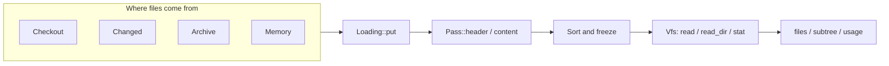

# Repository virtual filesystem

`orbit_utils::vfs` loads repository files into a read-only namespace.
Callers use the same API for a checkout, a tar.gz stream, or bytes already in memory.



## Start with bytes

```rust
use std::path::Path;
use orbit_utils::vfs::{Limits, Options, Vfs, sources::Memory};

let repo = Vfs::load(
    Memory(vec![("src/main.rs".into(), b"fn main() {}".to_vec())]),
    (), Limits::default(), Options::default(),
)?;
assert_eq!(&*repo.read(Path::new("src/main.rs"))?, b"fn main() {}");
assert_eq!(repo.read_dir(Path::new("/"))?, vec!["src"]);
# Ok::<(), Box<dyn std::error::Error>>(())
```

`()` keeps every regular file, with `()` as its tag.
Wrap the resulting store in `Arc` to share it among readers.
Loading is concurrent; freezing produces a sorted node vector used for lookups and directory ranges.

## Choose a source

| Source | Use case | Storage |
|---|---|---|
| `Memory(Vec<(String, Vec<u8>)>)` | Tests, generated files, small inputs | Owned, deduplicated bytes |
| `Checkout(&Path)` | Full local repository | Linked disk files |
| `Changed { root, paths }` | Explicit changed-file list | Linked disk files; no recursive walk |
| `Archive(reader)` | Gitaly-style tar.gz with one outer directory | Owned bytes; optional spill |
| Your own `Source` | Other transports or archive contracts | Whatever each `Put` supplies |

### Checkouts and changed paths

```rust,no_run
use std::path::Path;
use orbit_utils::vfs::{Limits, Options, Vfs, sources::{Checkout, Changed}};

let root = Path::new("/path/to/repository");
let repo = Vfs::load(Checkout(root), (), Limits::default(), Options::default())?;
let changes = Vfs::load(
    Changed { root, paths: vec!["src/lib.rs".into(), "Cargo.toml".into()] },
    (), Limits::default(), Options::default(),
)?;
# Ok::<(), Box<dyn std::error::Error>>(())
```

Checkout uses a parallel walker. It includes dotfiles and honors `.gitignore` and `.git/info/exclude`.
It ignores ripgrep `.ignore` rules, ancestor ignore files, and global Git ignore rules.
It excludes `.git` and does not walk through directory symlinks.

Changed accepts safe relative paths. Missing files and non-regular entries other than symlinks are skipped.
Other filesystem failures abort loading. Removed paths belong to the caller's change-set bookkeeping.
Only supplied paths enter the store; a link cannot resolve unless its target is present too.
Paths through host symlinked parent directories are refused, including links into the checkout.

Disk files remain linked rather than copied.
Header `Keep` defers content checks until the first read; header `Pending` reads during loading, then releases those bytes.
Therefore, the default `()` pass reads checkout files during loading.
Set `Keep` in a header pass to defer that read.

Checkouts are live, not snapshots. Deleted files return read errors; size changes are rejected.
Same-size edits can change later reads, while the first content decision remains cached.
Use a stable checkout or an owned source when indexing an immutable revision.

### Archives and bounded storage

```rust,no_run
use std::fs::File;
use orbit_utils::vfs::{Limits, Options, Vfs, sources::Archive};

let repo = Vfs::load(
    Archive(File::open("repository.tar.gz")?),
    (),
    Limits {
        files: Some(100_000), total_bytes: Some(2_000_000_000),
        file_bytes: Some(5_000_000), resident_bytes: Some(256_000_000),
        spilled_bytes: Some(2_000_000_000),
    },
    Options {
        scratch_dir: Some("/disk-backed/scratch".into()),
        compress_spill: true,
        ..Options::default()
    },
)?;
# Ok::<(), Box<dyn std::error::Error>>(())
```

Archive strips the first component, such as `project-main/`.
The first regular file or link selects the root; entries under a different root are skipped.
Absolute and traversal entry paths fail loading. Hard links become rooted virtual links; symlinks retain their targets.
Directories are inferred from file paths. Names beyond host filesystem limits work because entries are not extracted to host paths.

The stream is sequential. Rejected bodies are not retained, but Gzip must still decompress past them.
Empty input and truncation before the first entry produce `SourceError::Empty`. Other read failures abort loading.
Use a custom source for a fixed required root, different link rules, or stricter archive validation.

## Define file policy

```rust
use orbit_utils::vfs::{Decision, File, Pass};

#[derive(Clone, Copy, Default)]
enum Role { Source, #[default] Input }

struct Filter;
impl Pass for Filter {
    type Tag = Role;
    fn header(&self, file: &mut File<Role>) {
        if file.path.ends_with(".png") {
            file.decide(Decision::List("image"));
        } else if file.path.ends_with(".rs") {
            file.decide(Decision::Keep(Role::Source));
        }
    }
    fn content(&self, file: &mut File<Role>, bytes: &[u8]) {
        if bytes.contains(&0) {
            file.decide(Decision::List("binary"));
        }
    }
}
```

| Decision | Meaning during loading |
|---|---|
| `Pending` | Request content; after content, become `Keep(Tag::default())` |
| `Keep(tag)` | Retain content or link a disk file, with the caller's tag |
| `List(reason)` | Retain a node without readable content |
| `Drop(reason)` | Omit the node from the frozen inventory |

Passes are trusted, synchronous and infallible. They should change decisions, not paths or sizes.
They do not count resources or receive symlinks. The store lists links as `List("symlink")`.
Oversize files become `List("oversize")` before policy runs.

Compose passes with `first.then(second)`. Each stage runs in order; the second sees the first's decision and can override it.
Header `List` or `Drop` skips content processing and never invokes a lazy reader.

Linked files can be rejected after freezing. `decision()` and `stat` report that late decision.
A late `Drop` keeps its node and reads as `Unsupported`, because the frozen inventory cannot remove it.
Content `Pending` still settles to the default tag.

## Read and inspect

| Method | Result |
|---|---|
| `read(path)` | `Arc<[u8]>`; resident content is shared |
| `read_dir(path)` | Sorted, distinct direct child names |
| `stat(path)` | Canonical virtual path, kind, length, decision and optional link target |
| `files()` | Sorted borrowed file rows, including listed nodes |
| `subtree(dir)` | Borrowed descendants; invalid or missing paths yield no rows |
| `usage()` | File/content accounting |

`stat` follows links and reports the reached file's decision. Directories have no decision.
Its `link` field contains the target when the requested node itself is a symlink.
Dangling links return `NotFound`, including from `stat`; this differs from host `symlink_metadata`.

Read errors distinguish missing files (`NotFound`), directories (`IsADirectory`), and listed content (`Unsupported`).
Listing a file returns `NotADirectory`. Link loops stop after a bounded number of hops.
Concurrent first reads can wait for classification. Repeated disk or spilled reads can repeat I/O.

### Paths and symlinks

Virtual `/` means the repository root. `src/file` and `/src/file` identify the same node.
Paths normalize lexically: `src/../README` is valid, but climbing above the root returns `NotFound`.
This treatment of `..` differs from host traversal through symlinks.

Relative link targets resolve from the link's parent. Absolute targets refer to virtual `/`, never host `/`.
For example, `/etc/passwd` resolves only if the store contains an `etc/passwd` node.
No virtual lookup falls back to the host filesystem.

Disk-backed nodes use separate host paths. Linux uses `openat2(NO_SYMLINKS)`; macOS uses `O_NOFOLLOW_ANY`.
These refuse symlinks in any host component, including replacements after loading.
Linux requires kernel and syscall-policy support for `openat2`; there is no weaker fallback.
Windows code in `disk.rs` cross-compiles, but checkout and scratch still contain Unix-specific operations.

Non-UTF-8 names use lossy inventory keys while retaining real host paths for I/O.
Collisions count as duplicate paths. Sequential duplicates are last-wins; concurrent duplicate order depends on scheduling.

## Limits and options

| Limit | Exceeding it |
|---|---|
| `file_bytes` | List as oversize without producing the body |
| `total_bytes` | Fail with `SourceError::Cap` |
| `files` | Fail with `SourceError::Cap` |
| `resident_bytes` | Spill additional unique content |
| `spilled_bytes` | Fail before reserving scratch beyond the cap |

`None` means unlimited. Zero is a real limit; `resident_bytes: Some(0)` spills all nonempty content.
File count and total bytes include dropped offers and duplicate entries.
Resident and scratch budgets count unique blobs. They exclude metadata, source buffers, and returned read buffers.
Concurrent stores have separate budgets, so callers must account for concurrency when sizing memory.

SHA-256 identifies content before storage. Identical bytes share storage but remain separate file rows.
Scratch is one anonymous temporary file, closed when the store drops. Its configured directory must exist.
Use a disk-backed volume rather than tmpfs when spilling should reduce RAM use.
LZ4 compresses each spilled blob independently, only when it shrinks. Reads remain random-access.

`Usage.bytes` counts offered bytes; `Usage.files` counts final nodes.
`kept` sums current kept-node sizes. `resident` and `spilled` count allocated blob bytes.
`deduped_bytes` counts avoided duplicate writes; `duplicate_paths` counts overwritten entries.
Replacing a path can leave an unused blob allocated until drop, so these totals are not an accounting identity.

`Options.cancelled` accepts a `Send + Sync` predicate, such as `move || token.is_cancelled()`.
It is polled once per `put`. Cancellation stops at the next offered file, not during blocked reads or decompression.

## Implement a source

```rust
use orbit_utils::vfs::{Loading, Put, Source, SourceError, Tag};

struct Generated;
impl Source for Generated {
    fn fill<T: Tag>(self, into: &Loading<T>) -> Result<(), SourceError> {
        into.put("generated.txt", Put::Lazy {
            size: 5,
            read: Box::new(|| Ok(b"hello".to_vec())),
        })
    }
}
```

`Put` accepts owned bytes, a synchronous one-shot reader, a disk path with its size, or a virtual link target.
A source can call `put` concurrently. It must propagate worker failures and wait for workers before returning.
The store verifies produced content length against the declared size.
Custom sources are trusted to select host paths and enforce their transport or archive contracts.

## YAML contract suite

```shell
mise exec -- cargo test -p orbit-utils --test vfs
```

Related scenarios are stacked in six YAML suites in `crates/utils/tests/vfs/cases/`.
Each file becomes a named test. Each scenario has its own inline fixtures and named assertions.
Fixture paths define the tree. Parent directories follow from those paths; empty content still creates a file.
Each scenario loads a fresh VFS for each source. Its named tests run in order against that VFS.
The runner calls only public VFS methods. Most scenarios run identical assertions against several sources.
Rust tests cover malformed archives, failing readers, scheduling, invalid filename bytes, permissions, and host symlink replacement.

```yaml
- name: Paths define a tree even when files are empty
  sources: [memory, lazy, checkout, changed, archive]
  fixtures:
    - path: src/lib/empty.rs
      content: ""
  tests:
    - name: Parent directories exist
      assert:
        - {op: read_dir, path: /, expect: {ok: [src]}}
        - {op: read_dir, path: src, expect: {ok: [lib]}}
    - name: The empty file is readable
      assert:
        - {op: read, path: src/lib/empty.rs, expect: {ok: ""}}
        - {op: usage, expect: {files: 1, bytes: 0}}

- name: Another fixture set has its own content
  sources: [memory, lazy, checkout, changed, archive]
  fixtures:
    - path: src/main.rs
      content: |-
        fn main() {}
  tests:
    - name: Reads use this fixture set
      assert:
        - {op: read, path: src/main.rs, expect: {ok: "fn main() {}"}}
        - {op: read_dir, path: src, expect: {ok: [main.rs]}}
```

### Grammar

Unknown fields and malformed variants fail deserialization. Scenarios require a load-error expectation or named tests with assertions.
Empty fixture sets are valid; an empty scenario list is not. Failures report the scenario name, source, test, and assertion.

| Field | Meaning |
|---|---|
| `name` | Description of the scenario's behavior |
| `sources` | Nonempty list: `memory`, `lazy`, `checkout`, `changed`, `archive` |
| `fixtures` | Inline files with `path` and `content`; paths imply directories |
| `rules` | Ordered header/content decisions, split across a real `Pass::then` chain |
| `limits` | The five VFS limits; omitted fields are unlimited |
| `options` | `compress_spill`, `scratch: default/existing/missing`, `cancel_after` |
| `load_error` | Exact source error expectation; excludes post-load tests |
| `tests` | Named tests, each with an ordered `assert` list |
| `changed` | Explicit path list for the changed source |

Fixtures contain raw text. Use YAML block strings for multiline files and quoted escapes for bytes such as `"\0"`.
Use `content: ""` for empty files; omitted content also defaults to empty.
YAML anchors can share content across files and read assertions.
Fixtures remain ordered so memory, lazy, and archive scenarios can test duplicate paths.
A `link` target replaces content for checkout, changed, and archive sources.
Host fixture paths are checked before writes. Archive corruption and reader faults belong in the Rust source tests.

Rules require `phase: header/content` and `decision`.
Optional `suffix` matches names; `contains` matches bytes during content processing only.
Decisions use `{kind: pending}`, `{kind: keep, value: source/input}`, or `{kind: list/drop, value: reason}`.
Policy reasons are `binary`, `excluded`, `log`, or `content`.

Operations are `read`, `read_dir`, `stat`, `files`, `subtree`, and `usage`.
Checkout and changed scenarios also support `write` with inline `content`, and `remove`, for post-load changes.
Read and stat expectations contain exactly one of `ok` or `error`.
Inventory assertions compare complete sorted rows: path, size, and decision.
Usage assertions compare specified fields; `spilled_below` checks compression without depending on exact encoder output.
I/O errors use Rust names such as `NotFound`. Load errors also accept `empty`, `cancelled`, and `cap:<metric>`.

### Coverage map

| Contract | Scenarios or native tests |
|---|---|
| Filesystem verbs, empty files, paths, links and inventory | `filesystem.yaml` |
| Policy, pass ordering and late decisions | `policy.yaml` |
| Resource caps and cancellation | `limits.yaml`; native overflow test |
| Dedup, replacement, spill and compression | `storage.yaml` |
| Git rules, changed paths and live checkout changes | `checkout.yaml` |
| Archive format and traversal | `archive.yaml`; `tests/vfs/archive.rs` |
| Lazy-reader invocation and failures | Native tests in `tests/vfs/native.rs` |
| OS races, concurrent reads/writes, host escape | Native tests in `tests/vfs/native.rs` |

Add new behavior as a scenario first. Extend the typed grammar only when existing operations cannot express the public contract.
