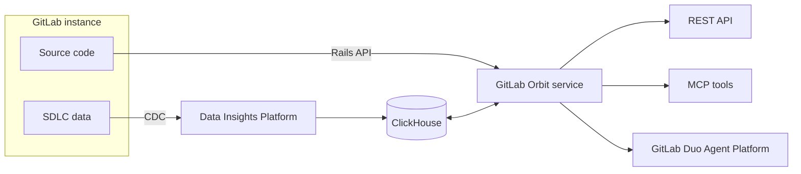
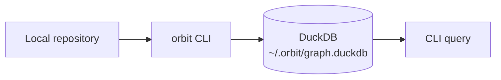



- Édition : GitLab Premium, GitLab Ultimate
- Offre : GitLab.com, GitLab Self-Managed
- Statut : version bêta





- [Introduite](https://gitlab.com/gitlab-org/gitlab/-/work_items/583676) dans GitLab 18.10 [avec un feature flag](https://docs.gitlab.com/administration/feature_flags/) nommé `knowledge_graph`. Désactivé par défaut. Cette fonctionnalité est une [version expérimentale](https://docs.gitlab.com/policy/development_stages_support/#experiment).
- [Passage](https://gitlab.com/gitlab-org/gitlab/-/work_items/583676) en [version bêta](https://docs.gitlab.com/policy/development_stages_support/#beta) dans GitLab 19.1.
- [Introduit](https://gitlab.com/groups/gitlab-org/-/epics/22739) pour GitLab Self-Managed dans GitLab 19.2.2.



> [!flag]
Un feature flag contrôle la disponibilité de cette fonctionnalité. Pour plus d'informations, consultez l'historique. Cette fonctionnalité est disponible pour être testée, mais elle n'est pas prête pour une utilisation en production.

GitLab Orbit indexe votre instance GitLab et expose l'intégralité de votre SDLC sous la forme d'un graphe de propriétés interrogeable. Activez-le sur un groupe et GitLab Orbit cartographie tout : les projets, les utilisateurs, les merge requests, les pipelines, les éléments de travail, les résultats de sécurité et le code source lui-même, puis construit un graphe de propriétés décrivant leurs relations.

Interrogez le graphe pour répondre à des questions auxquelles votre instance ne peut pas répondre directement :

- Qu'est-ce qui se casse si je modifie ce service ?
- Quelles merge requests ont touché ce fichier au cours des 90 derniers jours ?
- Qui a effectué le plus de revues de code dans ce groupe ?
- Où se trouvent les vulnérabilités critiques ouvertes, et quels pipelines les ont introduites ?
- Quels projets dépendent de cette bibliothèque ?

GitLab Orbit est un système analytique conçu pour fournir une vue SDLC à un instant donné, et non pour des cas d'usage en temps réel ou transactionnels. Les résultats reflètent l'état de vos données au dernier cycle d'indexation.

Pour une démonstration interactive, consultez [GitLab Orbit](https://click-through-demo-generator-v-2-d63870.gitlab.io/demos/orbit-v2/).
<!-- Demo published on 2026-06-30 -->

## GitLab Orbit Remote {#gitlab-orbit-remote}

Sur GitLab.com, GitLab Orbit Remote s'exécute en tant que service distinct sur l'infrastructure GitLab. Activez-le sur un groupe principal et il indexe automatiquement l'intégralité de votre SDLC et de votre code — groupes, projets, utilisateurs, merge requests, pipelines, vulnérabilités et code source — dans un graphe ClickHouse géré.

GitLab Orbit Remote s'exécute en tant que service distinct et partage une charge minimale avec votre instance GitLab.

[Premiers pas avec GitLab Orbit Remote](remote/getting-started.md)

## GitLab Orbit Local {#gitlab-orbit-local}

GitLab Orbit Local s'exécute entièrement sur votre machine. L'interface de ligne de commande GitLab Orbit (`orbit`) analyse un dépôt local, extrait les définitions et les références inter-fichiers, et écrit le graphe dans un fichier DuckDB local. Aucune instance GitLab ni connexion réseau n'est requise.

GitLab Orbit Local indexe uniquement le code. Les données SDLC — merge requests, pipelines, éléments de travail — nécessitent GitLab Orbit Remote.

[Premiers pas avec GitLab Orbit Local](local/getting-started.md)

## GitLab Orbit sur GitLab Self-Managed {#gitlab-orbit-on-gitlab-self-managed}

Sur GitLab Self-Managed, vous exécutez GitLab Orbit sur un cluster Kubernetes à côté de votre instance. Le déploiement inclut également le pipeline de données qui alimente le graphe : réplication logique PostgreSQL, Siphon, NATS et ClickHouse. Le graphe et les surfaces de requête correspondent à GitLab.com.

[Premiers pas avec GitLab Orbit sur GitLab Self-Managed](self-managed/getting-started.md)

## Ce que GitLab Orbit indexe {#what-gitlab-orbit-indexes}

GitLab Orbit indexe deux catégories de données :

- Les objets SDLC de votre instance GitLab : groupes, projets, utilisateurs, merge requests, pipelines, jobs, éléments de travail, jalons, labels et résultats de sécurité.

- Le code source de vos dépôts : fichiers, répertoires, définitions de fonctions et de classes, et références d'import inter-fichiers. Le code est indexé uniquement depuis la branche par défaut.

GitLab Orbit indexe le code en Ruby, Java, Kotlin, Python, TypeScript, JavaScript, Rust, Go, C#, C, C++ et PHP.

[Couverture d'indexation complète](remote/indexing.md) \| [Référence du schéma](remote/schema.md)

## Premiers pas {#get-started}

- [Activer GitLab Orbit Remote et exécuter votre première requête](remote/getting-started.md)
- [Créer un graphe de code local avec GitLab Orbit Local](local/getting-started.md)
- [Installer GitLab Orbit sur GitLab Self-Managed](self-managed/getting-started.md)
- [Configurer des agents de codage IA avec le skill GitLab Orbit](ai_coding_agents.md)
