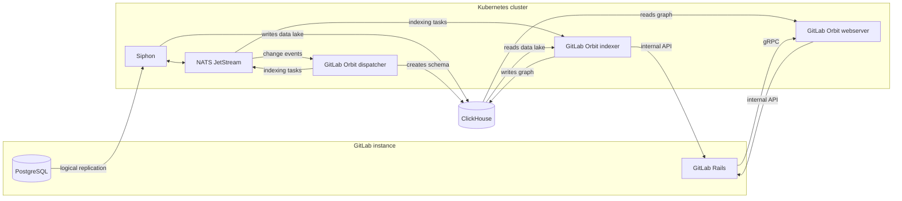



- Édition : GitLab Premium, GitLab Ultimate
- Offre : GitLab Self-Managed
- Statut : version bêta





- [Introduit](https://gitlab.com/groups/gitlab-org/-/epics/22739) dans GitLab 19.2.2.



> [!note]
GitLab Orbit sur GitLab Self-Managed est en [version bêta](https://docs.gitlab.com/policy/development_stages_support/#beta). Cette fonctionnalité est disponible pour être testée, mais elle n'est pas prête pour une utilisation en production.

Sur GitLab.com, GitLab Orbit s'exécute sur l'infrastructure GitLab. Sur GitLab Self-Managed, vous exécutez GitLab Orbit à côté de votre instance.

Un déploiement GitLab Orbit comprend deux parties :

- Un pipeline de données qui copie la base de données GitLab dans ClickHouse.
- GitLab Orbit, qui transforme cette copie en un graphe interrogeable.

Le pipeline de données ne dépend pas de GitLab Orbit, vous pouvez donc vérifier le pipeline avant d'installer GitLab Orbit.

GitLab Orbit est distribué uniquement sous la forme d'un chart Helm pour Kubernetes. Le package Linux ne l'inclut pas. Installez le chart sur le cluster qui exécute GitLab, ou sur un cluster distinct à côté de votre instance.

Étant donné que GitLab Orbit sur GitLab Self-Managed est en version bêta, contactez votre équipe de compte avant de planifier un déploiement afin de confirmer les limitations actuelles.

## Architecture {#architecture}

| Composant | Fonction |
|-----------|----------|
| Siphon | Copie les lignes de PostgreSQL dans le lac de données ClickHouse, via NATS. |
| Dispatcher | Surveille le même flux NATS, détient le schéma du graphe et publie les tâches d'indexation dans NATS. |
| Indexer | Récupère les tâches d'indexation depuis NATS, lit le lac de données, récupère le code source via l'API interne de GitLab et écrit le graphe de propriétés. |
| Webserver | Répond aux requêtes du graphe et récupère le contenu des fichiers via l'API interne lorsqu'une requête le nécessite. |

GitLab accède au webserver via gRPC.

## Dans cette section {#in-this-section}

| Page | Description |
|------|-------------|
| [Commencer](getting-started.md) | Prérequis, ordre d'installation et valeurs de configuration partagées |
| [Configurer la réplication des données](data-replication.md) | Réplication logique PostgreSQL et Siphon |
| [Configurer GitLab Orbit](orbit-setup.md) | La base de données ClickHouse et les identités, la connexion GitLab, le chart GitLab Orbit et l'indexation des groupes |

## Limitations connues {#known-limitations}

GitLab Orbit ne s'exécute pas sur un site secondaire GitLab Geo. Aucune build conforme à la norme FIPS n'est disponible.

La redondance et la récupération pour GitLab Orbit ne sont pas documentées. GitLab Orbit ne détient aucune donnée propre ; ainsi, si vous perdez la base de données du graphe, vous pouvez la reconstruire en effectuant une nouvelle indexation.

Pour le support applicable pendant la version bêta, consultez [version bêta](https://docs.gitlab.com/policy/development_stages_support/#beta) et la [Statement of Support](https://about.gitlab.com/support/statement-of-support/).
