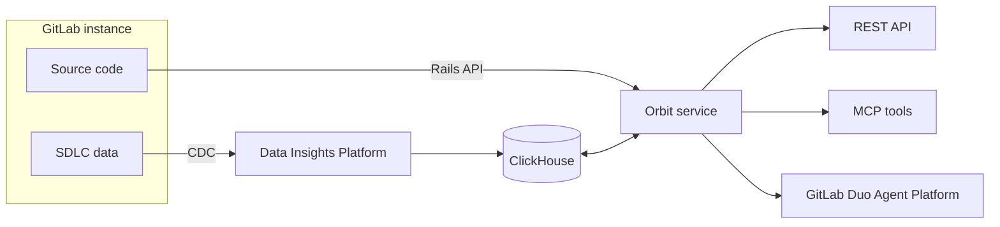
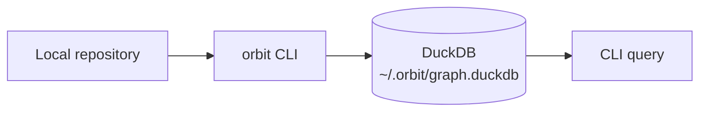



- プラン: Premium、Ultimate
- 提供形態: GitLab.com
- ステータス: ベータ





- `knowledge_graph`という名前の[機能フラグ](https://docs.gitlab.com/administration/feature_flags/)を使用して、GitLab 18.10で[導入](https://gitlab.com/gitlab-org/gitlab/-/work_items/583676)されました。デフォルトでは無効です。この機能は[実験的機能](https://docs.gitlab.com/policy/development_stages_support/#experiment)です。
- GitLab 19.1で[ベータ](https://docs.gitlab.com/policy/development_stages_support/#beta)に[変更](https://gitlab.com/gitlab-org/gitlab/-/work_items/583676)されました。



> [!flag]
> この機能の利用可否は機能フラグによって制御されています。
> 詳細については、履歴を参照してください。
> この機能はテスト目的で利用可能ですが、本番環境での使用には対応していません。

Orbitはお使いのGitLabインスタンスをインデックス作成し、SDLC全体をクエリ可能なナレッジグラフとして公開します。
グループで有効にすると、Orbitはプロジェクト、ユーザー、マージリクエスト、パイプライン、
作業アイテム、セキュリティの検出結果、ソースコード自体をすべてマップし、それらの関係性を示すプロパティグラフを構築します。

グラフをクエリすることで、インスタンスだけでは直接回答できない質問に答えられます。

- このサービスを変更すると何が壊れるか？
- 過去90日間でこのファイルに変更を加えたマージリクエストはどれか？
- このグループで最もコードレビューを行ったのは誰か？
- 未解決のクリティカルな脆弱性はどこにあり、どのパイプラインが原因か？
- このライブラリに依存しているプロジェクトはどれか？

*Orbitはある時点でのSDLCインサイトを目的とした分析システムであり、リアルタイムやトランザクション処理のユースケースには対応していません。結果は最後のインデックスサイクル時点のデータの状態を反映しています。*

## Orbit Remote {#orbit-remote}

GitLab.comでは、Orbit RemoteはGitLabインフラストラクチャ上で独立したサービスとして動作します。トップレベルグループで有効にすると、グループ、プロジェクト、ユーザー、マージリクエスト、パイプライン、脆弱性、ソースコードなど、SDLC全体とコードを自動的にインデックス作成し、マネージドClickHouseグラフに格納します。

Orbit Remoteは独立したサービスとして動作し、GitLabインスタンスへの負荷を最小限に抑えます。

[Orbit Remoteを使ってみる](remote/getting-started.md)

## Orbit Local {#orbit-local}

Orbit Localはお使いのマシン上で完全に動作します。Orbit CLI（`orbit`）はローカルリポジトリを解析し、定義とクロスファイル参照を抽出して、グラフをローカルのDuckDBファイルに書き込みます。GitLabインスタンスやネットワーク接続は不要です。

Orbit Localはコードのみをインデックス作成します。マージリクエスト、パイプライン、作業アイテムなどのSDLCデータにはOrbit Remoteが必要です。

[Orbit Localを使ってみる](local/getting-started.md)

## Orbitがインデックス作成する対象 {#what-orbit-indexes}

Orbitは2つのカテゴリのデータをインデックス作成します。

- GitLabインスタンスのSDLCオブジェクト: グループ、プロジェクト、ユーザー、マージリクエスト、パイプライン、ジョブ、作業アイテム、マイルストーン、ラベル、セキュリティの検出結果。

- リポジトリのソースコード: ファイル、ディレクトリ、関数とクラスの定義、クロスファイルのインポート参照。コードはデフォルトブランチのみからインデックス作成されます。

OrbitはRuby、Java、Kotlin、Python、TypeScript、JavaScript、Rust、Go、C#、C、C++、PHPのコードをインデックス作成します。

[インデックス作成の対象範囲](remote/indexing.md) | [スキーマリファレンス](remote/schema.md)

## はじめに {#get-started}

- [Orbit Remoteを有効にして最初のクエリを実行する](remote/getting-started.md)
- [Orbit Localでローカルコードグラフを構築する](local/getting-started.md)
- [Orbitスキルを使用してAIコーディングエージェントをセットアップする](ai_coding_agents.md)
