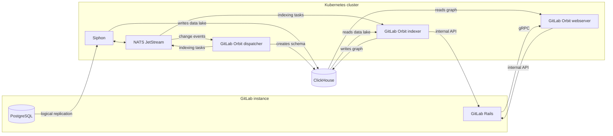



- プラン: Premium、Ultimate
- 提供形態: GitLab Self-Managed
- ステータス: ベータ版





- GitLab 19.2.2で[導入](https://gitlab.com/groups/gitlab-org/-/epics/22739)されました。



> [!note]
> GitLab Self-ManagedにおけるGitLab Orbitは
> [ベータ版](https://docs.gitlab.com/policy/development_stages_support/#beta)です。
> この機能はテスト目的で利用可能ですが、本番環境での使用には対応していません。

GitLab.comでは、GitLab OrbitはGitLabのインフラストラクチャ上で動作します。
GitLab Self-Managedでは、GitLab Orbitをインスタンスの隣で実行します。

GitLab Orbitのデプロイは2つの部分で構成されます。

- GitLabデータベースをClickHouseにコピーするデータパイプライン。
- そのコピーをクエリ可能なグラフに変換するGitLab Orbit。

データパイプラインはGitLab Orbitに依存しないため、GitLab Orbitをインストールする前にパイプラインを検証できます。

GitLab OrbitはKubernetes向けのHelmチャートとしてのみ配布されています。Linuxパッケージには含まれていません。
GitLabを実行しているクラスター、またはインスタンスの隣にある別のクラスターにチャートをインストールしてください。

GitLab Self-ManagedにおけるGitLab Orbitはベータ版であるため、デプロイを計画する前に担当のアカウントチームに連絡して現在の制限事項を確認してください。

## アーキテクチャ {#architecture}

| コンポーネント | 機能 |
|-----------|----------|
| Siphon | NATSを経由してPostgreSQLからClickHouseデータレイクに行をコピーします。 |
| Dispatcher | 同じNATSストリームを監視し、グラフスキーマを管理し、インデックス作成タスクをNATSに発行します。 |
| Indexer | NATSからインデックス作成タスクを受け取り、データレイクを読み取り、GitLab内部APIを経由してソースコードをフェッチし、プロパティグラフを書き込みます。 |
| Webserver | グラフからのクエリに応答し、クエリで必要な場合は内部APIを経由してファイルコンテンツをフェッチします。 |

GitLabはgRPCを経由してWebserverにアクセスします。

## このセクションの内容 {#in-this-section}

| ページ | 説明 |
|------|-------------|
| [はじめに](getting-started.md) | 前提条件、インストール順序、および共通設定値 |
| [データレプリケーションのセットアップ](data-replication.md) | PostgreSQL論理レプリケーションとSiphon |
| [GitLab Orbitのセットアップ](orbit-setup.md) | ClickHouseデータベースとID、GitLab接続、GitLab Orbitチャートおよびグループのインデックス作成 |

## 既知の制限事項 {#known-limitations}

GitLab OrbitはGitLab GeoのセカンダリサイトでFIPSに準拠したビルドは利用できません。

GitLab Orbitの冗長性とリカバリーについてはドキュメント化されていません。GitLab Orbitは独自のデータを保持しないため、グラフデータベースが失われた場合は、再度インデックス作成を行うことで再構築できます。

ベータ版期間中に適用されるサポートについては、
[ベータ版](https://docs.gitlab.com/policy/development_stages_support/#beta)および
[サポートに関する声明](https://about.gitlab.com/support/statement-of-support/)を参照してください。
