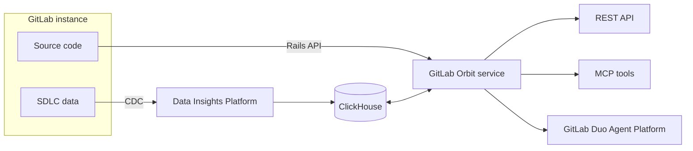
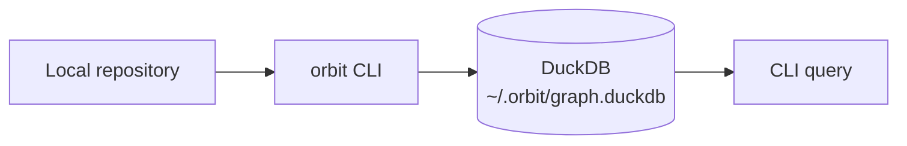



- 티어: Premium, Ultimate
- 제공 서비스: GitLab.com, GitLab Self-Managed
- 상태:  베타





- [GitLab 18.10에서 도입됨](https://gitlab.com/gitlab-org/gitlab/-/work_items/583676) [기능 플래그](https://docs.gitlab.com/administration/feature_flags/)로 이름이 `knowledge_graph`입니다. 기본적으로 비활성화되었습니다. 이 기능은 [실험](https://docs.gitlab.com/policy/development_stages_support/#experiment)입니다.
- GitLab 19.1에서 [베타](https://gitlab.com/gitlab-org/gitlab/-/work_items/583676)로 [변경](https://docs.gitlab.com/policy/development_stages_support/#beta)되었습니다.
- GitLab 19.2.2에서 [도입](https://gitlab.com/groups/gitlab-org/-/epics/22739)되었습니다 (GitLab Self-Managed).



> [!flag]
이 기능의 사용 가능 여부는 기능 플래그에 의해 제어됩니다. 자세한 내용은 이력을 참조하세요. 이 기능은 테스트 가능하지만 프로덕션 사용은 준비되지 않았습니다.

GitLab Orbit은 GitLab 인스턴스를 인덱싱하고 전체 SDLC를 쿼리 가능한 속성 그래프로 노출합니다. 그룹에서 활성화하면 GitLab Orbit은 모든 것을 매핑합니다: 프로젝트, 사용자, 머지 리퀘스트, 파이프라인, 작업 항목, 보안 발견, 소스 코드 자체, 그런 다음 이들이 어떻게 서로 관련되어 있는지의 속성 그래프를 빌드합니다.

그래프를 쿼리하여 인스턴스가 직접 답할 수 없는 질문에 답하세요:

- 이 서비스를 변경하면 무엇이 깨지나요?
- 지난 90일 동안 어느 머지 리퀘스트가 이 파일을 건드렸나요?
- 이 그룹에서 누가 가장 많은 코드를 검토했나요?
- 열린 중요한 취약점이 어디에 있으며, 어느 파이프라인이 이를 도입했나요?
- 어느 프로젝트가 이 라이브러리에 종속되어 있나요?

GitLab Orbit은 실시간 또는 트랜잭션 사용 사례가 아닌 특정 시점의 SDLC 인사이트를 위해 설계된 분석 시스템입니다. 결과는 마지막 인덱스 주기 기준으로 데이터의 상태를 반영합니다.

클릭 스루 데모는 [GitLab Orbit](https://click-through-demo-generator-v-2-d63870.gitlab.io/demos/orbit-v2/)을 참조하세요.
<!-- Demo published on 2026-06-30 -->

## GitLab Orbit Remote {#gitlab-orbit-remote}

GitLab.com에서 GitLab Orbit Remote는 GitLab 인프라에서 별도의 서비스로 실행됩니다. 최상위 그룹에서 활성화하면 전체 SDLC 및 코드(그룹, 프로젝트, 사용자, 머지 리퀘스트, 파이프라인, 취약점 및 소스 코드)를 관리되는 ClickHouse 그래프로 자동으로 인덱싱합니다.

GitLab Orbit Remote는 별도의 서비스로 실행되며 GitLab 인스턴스와 최소한의 부하를 공유합니다.

[GitLab Orbit Remote 시작하기](remote/getting-started.md)

## GitLab Orbit Local {#gitlab-orbit-local}

GitLab Orbit Local은 전적으로 사용자의 머신에서 실행됩니다. GitLab Orbit CLI (`orbit`)는 로컬 리포지토리를 구문 분석하고, 정의 및 파일 간 참조를 추출하고, 그래프를 로컬 DuckDB 파일에 씁니다. GitLab 인스턴스 또는 네트워크 연결이 필요하지 않습니다.

GitLab Orbit Local은 코드만 인덱싱합니다. SDLC 데이터(머지 리퀘스트, 파이프라인, 작업 항목)는 GitLab Orbit Remote가 필요합니다.

[GitLab Orbit Local 시작하기](local/getting-started.md)

## GitLab Self-Managed의 GitLab Orbit {#gitlab-orbit-on-gitlab-self-managed}

GitLab Self-Managed에서 인스턴스 옆의 Kubernetes 클러스터에서 GitLab Orbit을 실행합니다. 배포에는 그래프를 제공하는 데이터 파이프라인도 포함됩니다: PostgreSQL 논리적 복제, Siphon, NATS 및 ClickHouse. 그래프와 쿼리 인터페이스는 GitLab.com과 일치합니다.

[GitLab Self-Managed에서 GitLab Orbit 시작하기](self-managed/getting-started.md)

## GitLab Orbit이 인덱싱하는 항목 {#what-gitlab-orbit-indexes}

GitLab Orbit은 두 가지 데이터 카테고리를 인덱싱합니다:

- GitLab 인스턴스의 SDLC 객체: 그룹, 프로젝트, 사용자, 머지 리퀘스트, 파이프라인, 작업, 작업 항목, 마일스톤, 레이블 및 보안 발견.

- 리포지토리의 소스 코드: 파일, 디렉토리, 함수 및 클래스 정의, 그리고 파일 간 가져오기 참조. 코드는 기본 브랜치에서만 인덱싱됩니다.

GitLab Orbit은 Ruby, Java, Kotlin, Python, TypeScript, JavaScript, Rust, Go, C#, C, C++ 및 PHP의 코드를 인덱싱합니다.

[전체 인덱싱 범위](remote/indexing.md) \| [스키마 참조](remote/schema.md)

## 시작하기 {#get-started}

- [GitLab Orbit Remote 활성화 및 첫 번째 쿼리 실행](remote/getting-started.md)
- [GitLab Orbit Local로 로컬 코드 그래프 빌드](local/getting-started.md)
- [GitLab Self-Managed에 GitLab Orbit 설치](self-managed/getting-started.md)
- [GitLab Orbit 스킬로 AI 코딩 에이전트 설정](ai_coding_agents.md)
