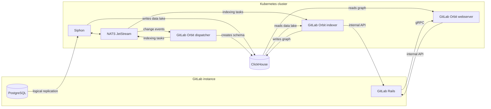



- 티어: Premium, Ultimate
- 제공 서비스: GitLab Self-Managed
- 상태:  베타





- [GitLab 19.2.2에서 도입](https://gitlab.com/groups/gitlab-org/-/epics/22739)되었습니다.



> [!note]
GitLab Self-Managed의 GitLab Orbit은 [베타](https://docs.gitlab.com/policy/development_stages_support/#beta) 단계입니다. 이 기능은 테스트 가능하지만 프로덕션 사용은 준비되지 않았습니다.

GitLab.com에서는 GitLab Orbit이 GitLab 인프라에서 실행됩니다. GitLab Self-Managed에서는 인스턴스 다음에 GitLab Orbit을 실행합니다.

GitLab Orbit 배포에는 두 부분이 있습니다:

- GitLab 데이터베이스를 ClickHouse로 복사하는 파이프라인입니다.
- 해당 사본을 쿼리 가능한 그래프로 변환하는 GitLab Orbit입니다.

데이터 파이프라인은 GitLab Orbit에 의존하지 않으므로 GitLab Orbit을 설치하기 전에 파이프라인을 확인할 수 있습니다.

GitLab Orbit은 Kubernetes용 Helm 차트로만 배포됩니다. Linux 패키지에는 포함되지 않습니다. GitLab을 실행하는 클러스터에 차트를 설치하거나 인스턴스 다음의 별도 클러스터에 설치합니다.

GitLab Self-Managed에서의 GitLab Orbit이 베타 상태이므로 배포를 계획하기 전에 계정 팀에 문의하여 현재 제한 사항을 확인합니다.

## 아키텍처 {#architecture}

| 구성 요소 | 함수 |
|-----------|----------|
| Siphon | PostgreSQL의 행을 NATS를 통해 ClickHouse 데이터 레이크로 복사합니다. |
| Dispatcher | 동일한 NATS 스트림을 감시하고 그래프 스키마를 소유하며 인덱싱 작업을 NATS로 다시 게시합니다. |
| Indexer | NATS에서 인덱싱 작업을 받고 데이터 레이크를 읽으며 GitLab 내부 API를 통해 소스 코드를 가져오고 속성 그래프를 작성합니다. |
| Webserver | 그래프의 쿼리에 응답하고 쿼리에 필요할 때 내부 API를 통해 파일 내용을 가져옵니다. |

GitLab은 gRPC를 통해 웹 서버에 도달합니다.

## 이 섹션에서 {#in-this-section}

| 페이지 | 설명 |
|------|-------------|
| [시작하기](getting-started.md) | 필수 요건, 설치 순서 및 공유 구성 값 |
| [데이터 복제 설정](data-replication.md) | PostgreSQL 논리적 복제 및 Siphon |
| [GitLab Orbit 설정](orbit-setup.md) | ClickHouse 데이터베이스 및 ID, GitLab 연결, GitLab Orbit 차트 및 그룹 인덱싱 |

## 알려진 제한 사항 {#known-limitations}

GitLab Orbit은 GitLab Geo 보조 사이트에서 실행되지 않습니다. FIPS 준수 빌드를 사용할 수 없습니다.

GitLab Orbit의 중복성 및 복구는 문서화되지 않았습니다. GitLab Orbit은 자체 데이터를 보유하지 않으므로 그래프 데이터베이스를 잃으면 다시 인덱싱하여 재구축할 수 있습니다.

베타 중에 적용되는 지원에 대해서는 [베타](https://docs.gitlab.com/policy/development_stages_support/#beta)와 [Support Statement](https://about.gitlab.com/support/statement-of-support/)를 참조하세요.
