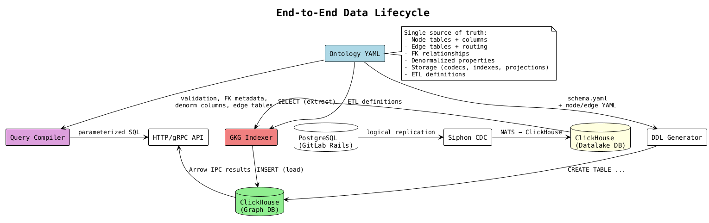
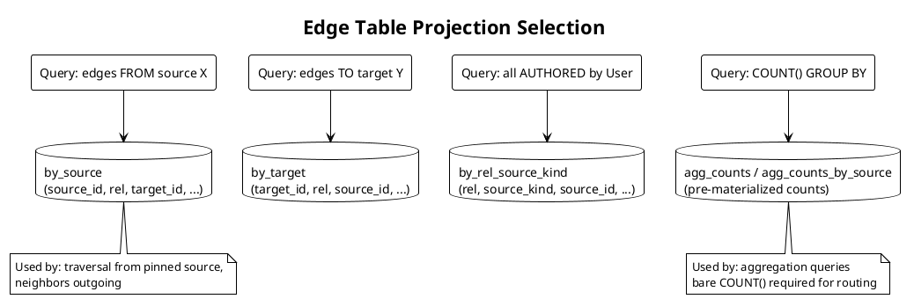
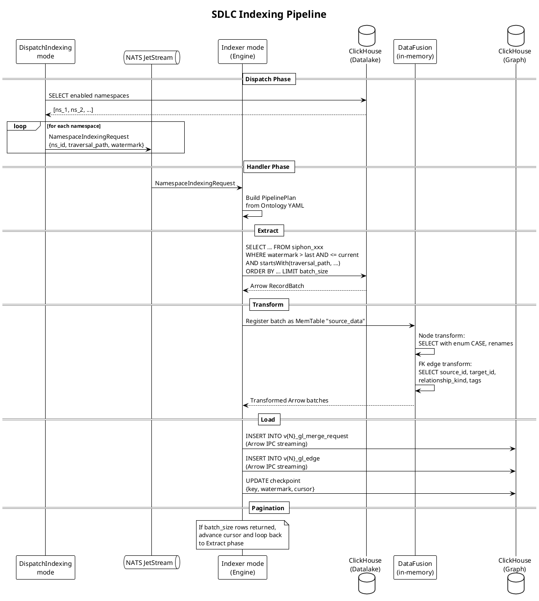
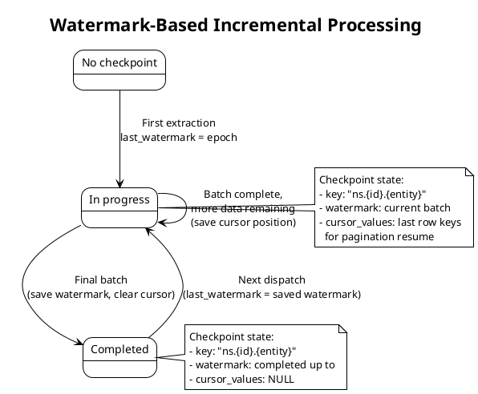
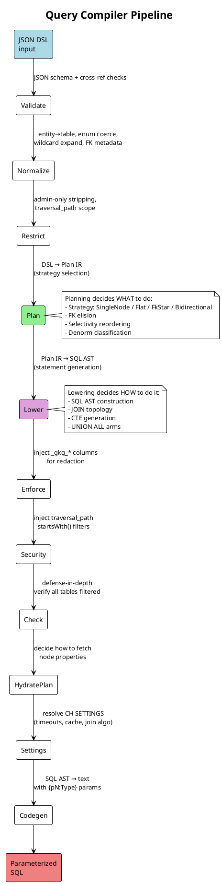
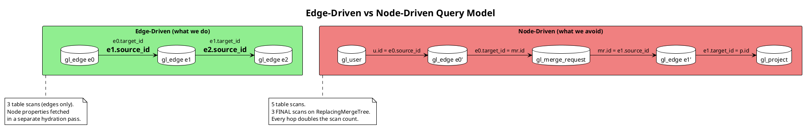
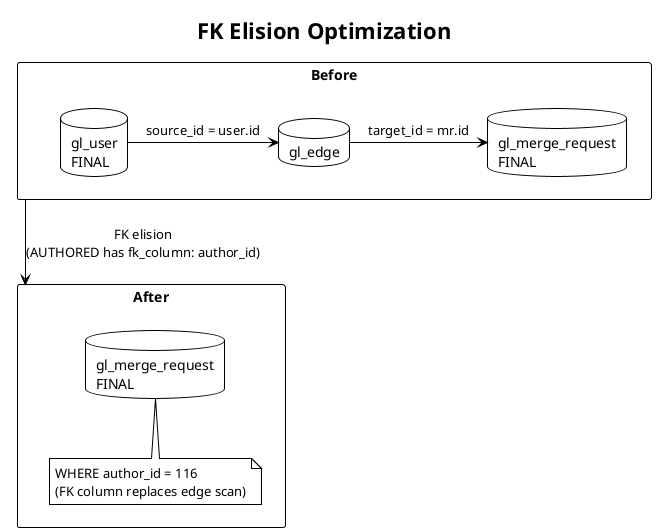
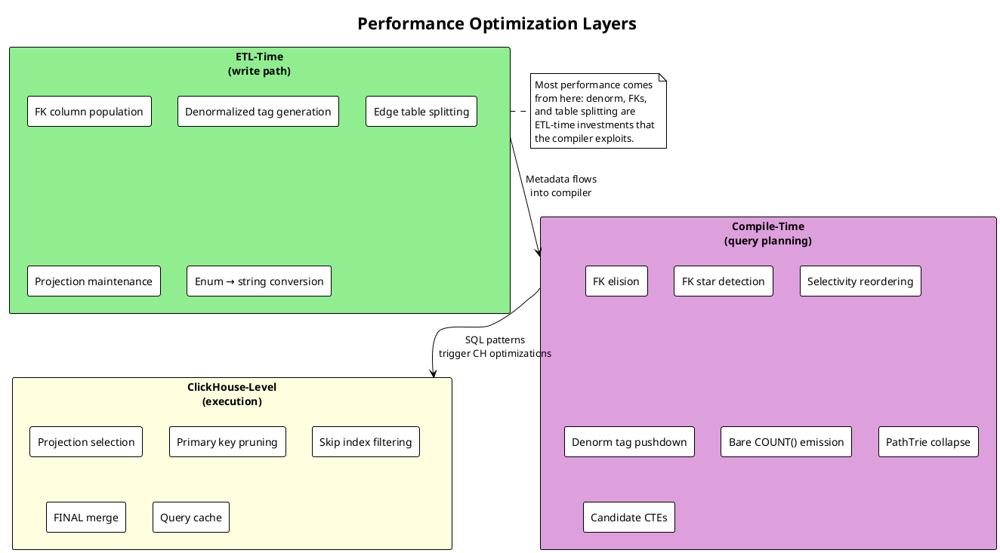

# GitLab Knowledge Graph: ClickHouse System Walkthrough

An engineering walkthrough of how the GitLab Knowledge Graph (GKG) uses ClickHouse
as both a datalake and a property graph engine. Covers the ontology-driven data model,
the ETL indexing pipeline, the query compiler, and the performance optimizations that
make graph queries fast on columnar storage.

## Table of contents

- [System overview](#system-overview)
- [The ontology: everything starts here](#the-ontology-everything-starts-here)
- [ClickHouse DDL: from YAML to tables](#clickhouse-ddl-from-yaml-to-tables)
- [ETL: the indexing pipeline](#etl-the-indexing-pipeline)
- [The query compiler pipeline](#the-query-compiler-pipeline)
  - [The edge-driven execution model](#the-edge-driven-execution-model)
- [SQL codegen: what we actually emit](#sql-codegen-what-we-actually-emit)
- [Performance optimizations](#performance-optimizations)
- [Appendix: projection catalog](#appendix-projection-catalog)

---

## System overview

GKG is a single Rust binary that runs in four modes: Webserver (serves queries),
Indexer (consumes CDC events and writes graph tables), DispatchIndexing (schedules
indexing work), and HealthCheck (K8s probes).

Data flows through three systems:

```text
┌──────────┐    logical     ┌────────┐    NATS     ┌────────────────┐
│PostgreSQL│───replication──▶│ Siphon │───JetStream▶│   ClickHouse   │
│ (GitLab) │                │ (CDC)  │             │   (Datalake)   │
└──────────┘                └────────┘             └───────┬────────┘
                                                          │ ETL
                                                          ▼
                                                   ┌────────────────┐
                                              ┌───▶│   ClickHouse   │◀──── GKG Query
                                              │    │    (Graph)     │      Compiler
                                              │    └────────────────┘
                                              │
                                         GKG Indexer
```

The key architectural choices:

1. **ClickHouse serves double duty.** The datalake database holds raw Siphon CDC
   replicas of PostgreSQL tables. The graph database holds the indexed property graph.
   Same ClickHouse cluster, two logical databases.

2. **The ontology YAML drives everything.** DDL generation, ETL queries, query
   compilation, authorization, and graph visualization all derive from the same
   set of YAML files. There is one source of truth for the data model.

3. **Read-only from GitLab's perspective.** GKG only writes to its own graph tables.
   It never writes back to PostgreSQL. Authorization is delegated to Rails via gRPC.

4. **Queries are edge-driven.** The base query for traversals, aggregations,
   neighbors, and path-finding is built from edge-to-edge joins. Node tables are
   lazy: they only enter the base query when their properties are needed in GROUP BY
   / ORDER BY, or when a filter targets a non-denormalized property. Node properties
   for the result set are fetched in a separate hydration pass after the edge query
   returns IDs.

5. **Performance comes from ETL, not from query tricks.** The indexer does the heavy
   lifting: foreign key denormalization onto edges, tag-based property replication,
   physical table splitting by domain. The query compiler then uses these pre-computed
   structures to avoid expensive runtime joins and scans. The edge-driven model
   works because the ETL pipeline puts enough information on edge rows (denormalized
   tags, entity kinds) that most filters and joins can resolve without touching node
   tables.

### End-to-end lifecycle



---

## The ontology: everything starts here

The ontology lives in `config/ontology/` and consists of:

| File | Purpose |
|------|---------|
| `schema.yaml` | Global settings, edge table definitions, denormalization config, ETL defaults |
| `nodes/<domain>/<entity>.yaml` | One file per node type (properties, ETL, storage) |
| `edges/<relationship>.yaml` | One file per relationship type (variants, FK columns, ETL) |

At build time and at runtime, the Rust `ontology` crate loads and validates all YAML
against `config/schemas/ontology.schema.json`, then produces an `Ontology` struct that
the indexer and compiler both consume.

### Node YAML anatomy

Every node YAML declares three things: the logical schema (properties), the physical
schema (storage), and the extraction logic (ETL). Here is a representative example:

```yaml
# config/ontology/nodes/code_review/merge_request.yaml (simplified)
node_type: MergeRequest
domain: code_review
destination_table: gl_merge_request
default_columns: [id, title, state, created_at]

redaction:
  resource_type: merge_request
  id_column: id
  ability: read_merge_request

properties:
  id:
    type: int64
    source: id
    nullable: false
  title:
    type: string
    source: title
  state:
    type: enum
    source: state_id
    values:       # int → string mapping (applied during ETL)
      1: opened
      2: closed
      3: merged
      4: locked
  author_id:
    type: int64
    source: author_id
    filterable: false   # users filter via AUTHORED edge, not this column
  project_id:
    type: int64
    source: target_project_id

storage:
  primary_key: [traversal_path, id]
  columns:
    - {name: id, type: "Int64", codec: ["Delta(8)", "LZ4"]}
    - {name: title, type: "Nullable(String)", codec: ["ZSTD(3)"]}
    - {name: state, type: "LowCardinality(String)", codec: ["LZ4"]}
    - {name: author_id, type: "Nullable(Int64)", codec: ["Delta(8)", "LZ4"]}
    - {name: project_id, type: "Nullable(Int64)", codec: ["Delta(8)", "LZ4"]}
    - {name: traversal_path, type: "String", default: "'0/'", codec: ["ZSTD(1)"]}
  indexes:
    - {name: idx_id, column: id, type: "bloom_filter(0.01)", granularity: 1}
    - {name: idx_title, column: title, type: "text(tokenizer = splitByNonAlpha)", granularity: 1}
    - {name: idx_title_ngram, column: title, type: "ngrambf_v1(3, 512, 2, 0)", granularity: 1}
  projections:
    - {type: reorder, name: by_id, order_by: [id]}
    - {type: lightweight, name: by_project_id, order_by: [project_id]}
    - {type: lightweight, name: by_author_id, order_by: [author_id]}

etl:
  type: query
  scope: namespaced
  select: >-
    mr.id AS id, mr.title AS title, mr.state_id AS state_id,
    mr.author_id AS author_id, mr.target_project_id AS project_id,
    tp.traversal_path AS traversal_path
  from: >-
    siphon_merge_requests mr
    INNER JOIN project_namespace_traversal_paths tp ON mr.target_project_id = tp.id
  watermark: mr._siphon_replicated_at
  deleted: mr._siphon_deleted
  edges:
    author_id:
      to: User
      as: AUTHORED
      direction: incoming    # User is source, MR is target
    target_project_id:
      to: Project
      as: IN_PROJECT
      direction: outgoing    # MR is source, Project is target
```

Three things to note:

1. **`storage` is the DDL contract.** Each column has an explicit ClickHouse type and
   codec. There is no auto-derivation from property types. The loader validates that
   every non-virtual property has a matching storage column and vice versa.

2. **`etl.edges` declares FK-based relationships.** The indexer generates edge rows
   from these FK columns during node extraction. The query compiler also uses this
   metadata to skip edge table scans when possible (FK elision).

3. **Enum values are mapped during ETL.** The source column `state_id` stores integers
   (1, 2, 3, 4). The indexer generates a `CASE WHEN` expression to convert to string
   labels. ClickHouse stores the result as `LowCardinality(String)`.

### Edge YAML anatomy

Edges come in two flavors: FK-derived (no separate source table) and standalone
(has its own source table in the datalake).

```yaml
# config/ontology/edges/authored.yaml -- FK-derived
description: Authorship relationship
variants:
  - from_node: {type: User, id: id}
    to_node: {type: MergeRequest, id: id}
    fk_column: author_id      # ← this is the key field

  - from_node: {type: User, id: id}
    to_node: {type: Pipeline, id: id}
    fk_column: user_id
```

```yaml
# config/ontology/edges/has_label.yaml -- standalone with own ETL
description: Entity has a label applied
table: gl_edge                 # explicit routing (default would also be gl_edge)
variants:
  - from_node: {type: WorkItem, id: id}
    to_node: {type: Label, id: id}
  - from_node: {type: MergeRequest, id: id}
    to_node: {type: Label, id: id}

etl:
  - scope: namespaced
    source: siphon_label_links
    order_by: [traversal_path, target_id, id]
    from:
      id: target_id
      type_column: target_type
      type_mapping:
        Issue: WorkItem
      enrich: [state_id, work_item_type_id]  # LEFT JOIN to get denorm columns
    to:
      id: label_id
      type: Label
```

The `fk_column` field is what makes the performance story work. When the compiler
sees that a relationship like AUTHORED has an FK column (`author_id` on
`gl_merge_request`), it can join the node tables directly instead of scanning the
edge table. More on this in [Performance optimizations](#performance-optimizations).

### Edge table routing

The system splits edges across three physical ClickHouse tables by domain:

| Table | Domain | Relationship types |
|-------|--------|--------------------|
| `gl_edge` | SDLC (default) | AUTHORED, IN_PROJECT, MEMBER_OF, CONTAINS, HAS_NOTE, HAS_LABEL, etc. (~40 types) |
| `gl_code_edge` | Source code | DEFINES, IMPORTS, CALLS, EXTENDS, ON_BRANCH, HAS_FILE (~6 types) |
| `gl_ci_edge` | CI/CD | IN_PIPELINE, HAS_JOB, HAS_STAGE, RUNS_ON, DEPLOYED_TO, etc. (~17 types) |

All three share the same column schema but have independent projections tuned for
their access patterns. The `table:` field in an edge YAML controls routing; omitting
it defaults to `gl_edge`.

Why split? A `DEFINES` query scanning `gl_code_edge` reads a fraction of the data
that the same scan over a monolithic `gl_edge` would. Each table also has its own
aggregate projections, so `COUNT()` queries for code relationships hit pre-materialized
aggregates without touching SDLC edge rows.

### Denormalized properties on edges

The `denormalization` section in `schema.yaml` lists node properties that get copied
onto edge rows as array-encoded tags. This is the single highest-impact performance
feature.

```yaml
# config/ontology/schema.yaml (excerpt)
denormalization:
  - {node: MergeRequest, property: state}
  - {node: MergeRequest, property: merge_status}
  - {node: MergeRequest, property: draft}
  - {node: Pipeline, property: status}
  - {node: Pipeline, property: source}
  - {node: Vulnerability, property: severity}
  - {node: WorkItem, property: work_item_type, as: wi_type}
  # ... ~60+ entries total
```

The loader automatically maps these to edge columns. For each entry, if the node
appears as the source of an edge variant, the property goes into `source_tags`. If it
appears as the target, it goes into `target_tags`.

**Storage format:** `Array(LowCardinality(String))` with values like
`["state:merged", "draft:false"]`. Indexed with `TYPE text(tokenizer = 'array')`.

**Query-time usage:** Instead of joining `gl_merge_request` just to filter by `state`,
the compiler can filter directly on the edge table:

```sql
-- Without denormalization: requires a FINAL scan of gl_merge_request
WHERE e0.target_id IN (
  SELECT mr.id FROM gl_merge_request FINAL AS mr
  WHERE mr.state = 'merged' AND mr._deleted = false
)

-- With denormalization: filter on edge column, no node table scan
WHERE has(e0.target_tags, 'state:merged')
```

---

## ClickHouse DDL: from YAML to tables

All DDL is auto-generated from the ontology YAML (`mise schema:generate:ddl`).
The generated file is `config/graph.sql`. Nobody edits it by hand.

### Node table template

Every node table follows this pattern:

```sql
CREATE TABLE IF NOT EXISTS gl_merge_request (
    -- Columns from storage.columns (order preserved)
    id Int64 CODEC(Delta(8), LZ4),
    title Nullable(String) CODEC(ZSTD(3)),
    state LowCardinality(String) DEFAULT '' CODEC(LZ4),
    author_id Nullable(Int64) CODEC(Delta(8), LZ4),
    project_id Nullable(Int64) CODEC(Delta(8), LZ4),
    traversal_path String DEFAULT '0/' CODEC(ZSTD(1)),
    -- ... more columns ...

    -- System columns (auto-added)
    _version DateTime64(6, 'UTC') DEFAULT now64(6) CODEC(ZSTD(1)),
    _deleted Bool DEFAULT false,

    -- Skip indexes from storage.indexes
    INDEX idx_id id TYPE bloom_filter(0.01) GRANULARITY 1,
    INDEX idx_title title TYPE text(tokenizer = splitByNonAlpha) GRANULARITY 1,
    INDEX idx_title_ngram title TYPE ngrambf_v1(3, 512, 2, 0) GRANULARITY 1,

    -- Projections from storage.projections
    PROJECTION by_id (SELECT * ORDER BY id),
    PROJECTION by_project_id (SELECT _part_offset ORDER BY project_id),
    PROJECTION by_author_id (SELECT _part_offset ORDER BY author_id),
    PROJECTION tp_count (
        SELECT traversal_path, uniq(id) GROUP BY traversal_path
    )
) ENGINE = ReplacingMergeTree(_version, _deleted)
ORDER BY (traversal_path, id)
PRIMARY KEY (traversal_path, id)
SETTINGS
    index_granularity = 2048,
    deduplicate_merge_projection_mode = 'rebuild',
    allow_experimental_replacing_merge_with_cleanup = 1,
    add_minmax_index_for_temporal_columns = 1,
    auto_statistics_types = 'minmax, uniq, countmin';
```

Key design choices:

- **`ReplacingMergeTree(_version, _deleted)`** handles upserts and soft deletes.
  The `_version` column (microsecond timestamp) determines which row wins during
  merge. The `_deleted` flag marks rows for removal during cleanup merges.

- **`ORDER BY (traversal_path, id)`** puts the namespace path first. This means
  `startsWith(traversal_path, '123/456/')` is a primary key prefix scan. Since
  every query carries a security filter on `traversal_path`, this is the default
  access pattern.

- **`PRIMARY KEY` is a prefix of `ORDER BY`.** For node tables they are identical.
  For edge tables, `PRIMARY KEY` is `(traversal_path, source_id, relationship_kind)`
  while `ORDER BY` extends to `(..., target_id, source_kind, target_kind)`. The
  shorter PRIMARY KEY reduces memory for the primary index while the full ORDER BY
  ensures dedup correctness.

- **Three projection types:**
  - *Reorder*: full row copies in a different sort order (e.g., `by_id` for point lookups)
  - *Lightweight*: just `_part_offset` + key columns (e.g., `by_project_id`). Acts as
    a secondary index without duplicating full rows. Requires
    `allow_part_offset_column_in_projections = 1`.
  - *Aggregate*: pre-materialized aggregates (e.g., `tp_count` for namespace cardinality)

### Edge table DDL

All three edge tables share this structure:

```sql
CREATE TABLE IF NOT EXISTS gl_edge (
    traversal_path String DEFAULT '0/' CODEC(ZSTD(1)),
    source_id Int64 CODEC(Delta(8), LZ4),
    source_kind LowCardinality(String) CODEC(LZ4),
    relationship_kind LowCardinality(String) CODEC(LZ4),
    target_id Int64 CODEC(Delta(8), LZ4),
    target_kind LowCardinality(String) CODEC(LZ4),
    -- Auto-added by the denormalization system
    source_tags Array(LowCardinality(String)) CODEC(LZ4),
    target_tags Array(LowCardinality(String)) CODEC(LZ4),
    _version DateTime64(6, 'UTC') DEFAULT now64(6) CODEC(ZSTD(1)),
    _deleted Bool DEFAULT false,

    INDEX idx_relationship relationship_kind TYPE set(50) GRANULARITY 2,
    INDEX source_tags_idx source_tags TYPE text(tokenizer = 'array') GRANULARITY 64,
    INDEX target_tags_idx target_tags TYPE text(tokenizer = 'array') GRANULARITY 64,

    -- 4 reorder projections for different access patterns
    PROJECTION by_source (
        SELECT * ORDER BY (source_id, relationship_kind, target_id,
                           traversal_path, source_kind, target_kind)),
    PROJECTION by_target (
        SELECT * ORDER BY (target_id, relationship_kind, source_id,
                           traversal_path, source_kind, target_kind)),
    PROJECTION by_rel_source_kind (
        SELECT * ORDER BY (relationship_kind, source_kind, source_id,
                           target_id, traversal_path, target_kind)),
    PROJECTION by_rel_target_kind (
        SELECT * ORDER BY (relationship_kind, target_kind, target_id,
                           source_id, traversal_path, source_kind)),

    -- Aggregate projections for COUNT() queries
    PROJECTION agg_counts (
        SELECT relationship_kind, source_kind, target_id, traversal_path, count()
        GROUP BY relationship_kind, source_kind, target_id, traversal_path),
    PROJECTION agg_counts_by_source (
        SELECT relationship_kind, target_kind, source_id, traversal_path, count()
        GROUP BY relationship_kind, target_kind, source_id, traversal_path)
) ENGINE = ReplacingMergeTree(_version, _deleted)
ORDER BY (traversal_path, source_id, relationship_kind, target_id,
          source_kind, target_kind)
PRIMARY KEY (traversal_path, source_id, relationship_kind)
SETTINGS
    index_granularity = 1024,
    deduplicate_merge_projection_mode = 'rebuild',
    allow_experimental_replacing_merge_with_cleanup = 1,
    auto_statistics_types = 'minmax, uniq, countmin';
```

The projection catalog is designed around the four basic edge access patterns:



### Global entities: no traversal_path

Two entity types (User, Runner) are globally visible. They have no `traversal_path`
column and their tables are `ORDER BY (id)`:

```sql
-- gl_user: global entity
ORDER BY (id)
PRIMARY KEY (id)
-- No traversal_path column, no security filter
```

The compiler knows to skip security filters for these tables via
`skip_security_filter_for_entities: [User, Runner]` in `schema.yaml`.

---

## ETL: the indexing pipeline

### Data flow



### How the ontology drives ETL

The indexer does not contain hardcoded SQL for each entity. Instead, at startup it
reads every node and edge YAML with an `etl:` section and lowers it into a
`PipelinePlan` containing SQL templates. This is done by `from_ontology()` → `lower()`.

Two ETL types exist:

**Table ETL** (simple single-table extraction):

```yaml
etl:
  type: table
  scope: global          # or namespaced
  source: siphon_users
```

Produces:
```sql
SELECT id, username, email, name, ...
       _siphon_replicated_at AS _version,
       _siphon_deleted AS _deleted
FROM siphon_users
WHERE _siphon_replicated_at > {last_watermark:String}
  AND _siphon_replicated_at <= {watermark:String}
ORDER BY id
LIMIT 1000000
```

**Query ETL** (multi-table extraction with JOINs):

```yaml
etl:
  type: query
  scope: namespaced
  select: >-
    project.id AS id, project.name AS name,
    tp.traversal_path AS traversal_path
  from: >-
    siphon_projects project
    INNER JOIN project_namespace_traversal_paths tp
      ON project.id = tp.id
  watermark: project._siphon_replicated_at
  deleted: project._siphon_deleted
  traversal_path_filter: "startsWith(tp.traversal_path, {traversal_path:String})"
```

Produces:
```sql
SELECT project.id AS id, project.name AS name,
       tp.traversal_path AS traversal_path,
       project._siphon_replicated_at AS _version,
       project._siphon_deleted AS _deleted
FROM siphon_projects project
  INNER JOIN project_namespace_traversal_paths tp ON project.id = tp.id
WHERE project._siphon_replicated_at > {last_watermark:String}
  AND project._siphon_replicated_at <= {watermark:String}
  AND startsWith(tp.traversal_path, {traversal_path:String})
ORDER BY traversal_path, id
LIMIT 1000000
```

### FK edge generation

When the indexer extracts a node batch, it also derives edge rows from FK columns
declared in the node's `etl.edges`. This happens in the DataFusion transform phase
using the same `source_data` MemTable.

Given a MergeRequest with `edges.author_id: {to: User, as: AUTHORED, direction: incoming}`:

```sql
-- Transform SQL run by DataFusion against the in-memory batch
SELECT
    traversal_path,
    author_id AS source_id,         -- FK column becomes source_id
    'User' AS source_kind,
    'AUTHORED' AS relationship_kind,
    id AS target_id,                -- node's own ID becomes target_id
    'MergeRequest' AS target_kind,
    _version,
    _deleted,
    -- Denormalized tags (auto-derived from schema.yaml denormalization config)
    make_array(
        concat('state:', CAST(state AS VARCHAR)),
        concat('private_profile:', CAST(private_profile AS VARCHAR)),
        concat('is_admin:', CAST(is_admin AS VARCHAR))
    ) AS source_tags,
    make_array(
        concat('state:', CAST(state AS VARCHAR)),
        concat('merge_status:', CAST(merge_status AS VARCHAR)),
        concat('draft:', CAST(draft AS VARCHAR))
    ) AS target_tags
FROM source_data
WHERE author_id IS NOT NULL
```

The `direction` field controls which end of the edge the FK populates:

| Direction | This node is... | FK column maps to... |
|-----------|----------------|---------------------|
| `incoming` | target | `source_id` |
| `outgoing` | source | `target_id` |

The tags are generated automatically from the `denormalization` config. For int-enum
properties, the CASE expression runs during tag generation too:

```sql
CASE WHEN state_id IS NULL THEN 'state:null'
     ELSE concat('state:',
       CASE WHEN state_id = 1 THEN 'opened'
            WHEN state_id = 2 THEN 'closed'
            WHEN state_id = 3 THEN 'merged'
            WHEN state_id = 4 THEN 'locked'
            ELSE CAST(state_id AS VARCHAR)
       END)
END
```

### Standalone edge ETL (join tables)

Some relationships come from dedicated join tables (e.g., `siphon_label_links`,
`siphon_issue_assignees`). These have their own extraction query with an enrichment
pattern to pull denorm properties:

```sql
-- Extract from join table
WITH _batch AS (
    SELECT user_id, issue_id, traversal_path,
           _siphon_replicated_at AS _version, _siphon_deleted AS _deleted
    FROM siphon_issue_assignees
    WHERE _siphon_replicated_at > {last_watermark:String}
      AND _siphon_replicated_at <= {watermark:String}
      AND startsWith(traversal_path, {traversal_path:String})
    ORDER BY traversal_path, issue_id, user_id
    LIMIT 1000000
),
-- Enrich: LEFT JOIN to node table for denorm properties
_e0 AS (
    SELECT project.id AS id,
           argMax(state_id, project._siphon_replicated_at) AS state_id,
           argMax(work_item_type_id, project._siphon_replicated_at) AS work_item_type_id
    FROM siphon_issues project
    WHERE project._siphon_deleted = false
      AND project.id IN (SELECT DISTINCT issue_id FROM _batch)
    GROUP BY project.id
)
SELECT _batch.user_id AS source_id, 'User' AS source_kind,
       'ASSIGNED' AS relationship_kind,
       _batch.issue_id AS target_id, 'WorkItem' AS target_kind,
       _batch.traversal_path, _batch._version, _batch._deleted,
       make_array(...) AS source_tags,
       make_array(
           concat('state:', CAST(_e0.state_id AS VARCHAR)),
           concat('wi_type:', CAST(_e0.work_item_type_id AS VARCHAR))
       ) AS target_tags
FROM _batch
LEFT JOIN _e0 ON _batch.issue_id = _e0.id
```

The `argMax(col, watermark) GROUP BY id` pattern deduplicates CDC rows from Siphon.
The `IN (SELECT DISTINCT fk FROM _batch)` does point lookups instead of full scans.

### Watermarks and checkpointing



Extraction uses the watermark window:
```sql
WHERE _siphon_replicated_at > {last_watermark:String}   -- exclusive lower bound
  AND _siphon_replicated_at <= {watermark:String}        -- inclusive upper bound
```

Pagination within a batch uses DNF (disjunctive normal form) cursor expressions:
```sql
-- For sort keys [traversal_path, id] with cursor ['1/2/', '42']:
AND ((traversal_path > '1/2/')
  OR (traversal_path = '1/2/' AND id > 42))
```

### Schema versioning

Table names are version-prefixed: version 7 → `v7_gl_merge_request`. On schema
version bump, the indexer creates a full set of new tables, runs a parallel
migration, and retires the old version once all namespaces have been re-indexed.

```
v6_gl_edge (active) → v7_gl_edge (migrating) → v7_gl_edge (active), v6_gl_edge (retired)
```

---

## The query compiler pipeline

The compiler transforms a JSON DSL query into parameterized ClickHouse SQL. It runs
as a sequence of pure functions ("phases") on a shared context struct.



### Planning: deciding what to do

The planner reads the normalized input and produces a `Plan` struct. The plan captures
the strategy (how to execute) and per-node metadata (selectivity, filters, hydration
needs). This is where the major structural optimizations happen.

**Strategy selection:**

```
              ┌──────────────────────────────────────────────┐
              │              Input Query                     │
              └────────────────────┬─────────────────────────┘
                                   │
                          ┌────────▼────────┐
                          │ 0 relationships? │
                          └──┬───────────┬──┘
                           Yes           No
                            │             │
                    ┌───────▼──────┐ ┌────▼──────────────┐
                    │ SingleNode   │ │ Build hop chain    │
                    │ (table scan) │ │ + FK metadata      │
                    └──────────────┘ └────┬──────────────┘
                                          │
                                  ┌───────▼──────────┐
                                  │ elide_fk_hops()  │
                                  │ (remove FK hops  │
                                  │  where target is │
                                  │  pinned)         │
                                  └───────┬──────────┘
                                          │
                                  ┌───────▼──────────┐
                                  │ reorder_by_      │
                                  │ selectivity()    │
                                  └───────┬──────────┘
                                          │
                                  ┌───────▼──────────┐
                                  │ All remaining     │
                                  │ hops have FKs on  │──Yes──▶ FkStar
                                  │ same center node? │
                                  └───────┬──────────┘
                                          │ No
                                  ┌───────▼──────────┐
                                  │      Flat        │
                                  │ (edge chain)     │
                                  └──────────────────┘
```

**Selectivity classification** (determines reordering priority):

| Level | Meaning | Example |
|-------|---------|---------|
| Pinned | `node_ids: [1, 2, 3]` | `{type: User, node_ids: [116]}` |
| IdRange | Bounded ID range | `{id: {gte: 100, lt: 200}}` |
| Filtered | Property filters | `{state: {eq: "merged"}}` |
| AuthScoped | Only traversal_path | No explicit filters |
| Open | No constraints at all | Global scan |

### Lowering: deciding how to do it

The lowerer takes the Plan and generates a SQL AST. The SQL AST is a typed tree that
maps directly to ClickHouse SQL constructs (SELECT, FROM, JOIN, WHERE, CTE, UNION ALL).

The key dispatch:

```rust
// Strategy dispatch for the edge chain
match self.strategy {
    Strategy::SingleNode   => single_node::emit(self),
    Strategy::FkStar { .. } => fk_star::emit(self, center),
    Strategy::Flat          => flat_chain::emit(self),
    Strategy::Bidirectional { .. } => flat_chain::emit(self),  // with meeting point
}

// Query type dispatch
match &plan.body {
    PlanBody::Traversal      => traversal::emit(plan),
    PlanBody::Aggregation    => aggregation::emit(plan),
    PlanBody::Neighbors      => neighbors::emit(plan),
    PlanBody::PathFinding(pf) => pathfinding::emit(plan, pf),
    PlanBody::Hydration(ns)  => hydration::emit(plan, ns),
}
```

### The edge-driven execution model

This is the most important thing to understand about how the compiler generates SQL.
The lowerer's module-level comment says it directly: *"edge-chain-first, nodes are lazy."*

The base query for traversals, aggregations, neighbors, and path-finding is built
from **edge-to-edge joins**. Node tables are not in the primary FROM clause. The edge
table carries enough information (source/target IDs, entity kinds, relationship type,
denormalized tags) that most queries can execute entirely on edge data.



**A 2-hop traversal generates this base SQL:**

```sql
-- Edge-to-edge join. Zero node tables in FROM.
SELECT e0.source_id, e0.target_id, e0.relationship_kind AS e0_type,
       e1.source_id, e1.target_id, e1.relationship_kind AS e1_type,
       -- _gkg_* columns for downstream redaction + hydration
       e0.source_id AS _gkg_u_id, 'User' AS _gkg_u_type,
       e0.target_id AS _gkg_mr_id, 'MergeRequest' AS _gkg_mr_type,
       e1.target_id AS _gkg_p_id, 'Project' AS _gkg_p_type
FROM gl_edge AS e0
  INNER JOIN gl_edge AS e1
    ON e0.target_id = e1.source_id
WHERE e0.relationship_kind = 'AUTHORED'
  AND e0.source_kind = 'User'
  AND e0.target_kind = 'MergeRequest'
  AND e1.relationship_kind = 'IN_PROJECT'
  AND e1.source_kind = 'MergeRequest'
  AND e1.target_kind = 'Project'
  AND e0.source_id = 116          -- pinned User
  AND e0._deleted = false
  AND e1._deleted = false
  AND startsWith(e0.traversal_path, '1/100/')  -- security
  AND startsWith(e1.traversal_path, '1/100/')  -- security
LIMIT 30
```

Node properties (usernames, MR titles, project names) come from a **separate
hydration query** that runs after the base query returns IDs. This is a two-pass
execution model: edges first, properties second.

**Why this matters for ClickHouse:**

- Edge tables are small relative to node tables (6 columns vs 20-40 columns per row).
  The edge scan reads less data per granule.
- Edge-to-edge joins avoid `FINAL` scans on `ReplacingMergeTree` node tables.
  `FINAL` is expensive because it merges parts at read time.
- The edge table's projections (`by_source`, `by_target`, `by_rel_source_kind`) are
  purpose-built for the join patterns the compiler emits.
- Adding a hop to the query adds one edge table scan (cheap), not two scans
  (edge + node, one of which is a FINAL merge).

#### When node tables enter the base query

Node tables are only pulled into the base query (as opposed to hydration) in three
specific situations. The planner assigns each node a `HydrationStrategy` that
controls this:

**`HydrationStrategy::Skip`** (most common): The node table is never touched in the
base query. The edge table carries IDs, kinds, and denormalized tag filters. This is
the default when a node has no non-denormalized filters and its properties are not
needed in GROUP BY / ORDER BY.

**`HydrationStrategy::FilterOnly`**: The node has filters on properties that are NOT
denormalized onto edges (e.g., `source_branch`). The planner creates a `_filter_*`
CTE that scans the node table for matching IDs, then feeds those IDs into the edge
query via `IN (SELECT id FROM ...)`. The node table scan is a satellite that feeds
the edge-driven query, not the other way around.

```sql
-- FilterOnly: node table scan feeds INTO the edge query
WITH _filter_mr AS (
    SELECT mr.id FROM gl_merge_request AS mr FINAL
    WHERE mr.source_branch = {p0:String} AND mr._deleted = false
)
SELECT ...
FROM gl_edge AS e0
WHERE e0.target_id IN (SELECT id FROM _filter_mr)     -- IDs from CTE
  AND has(e0.target_tags, 'state:merged')              -- denorm filter stays on edge
  AND e0._deleted = false
```

**`HydrationStrategy::Join`**: The node's properties are needed in the SQL itself
(GROUP BY on a node property, ORDER BY on a node property, or an aggregation function
targeting a node property like `SUM(mr.lines_changed)`). The node table is JOINed
inline as a latest-row subquery.

```sql
-- Join: node table appears in FROM because GROUP BY needs mr.state
SELECT mr.state AS group_key, COUNT() AS total
FROM gl_edge AS e0
  INNER JOIN (
    SELECT * FROM gl_merge_request AS mr FINAL
    WHERE mr._deleted = false
  ) AS mr ON mr.id = e0.target_id
WHERE e0.source_id = 1
  AND e0.relationship_kind = 'AUTHORED'
GROUP BY mr.state
```

#### Edge-driven model across query types

| Query type | Base query structure | Node tables in base query? |
|-----------|---------------------|---------------------------|
| Traversal | `e0 JOIN e1 JOIN e2 ...` | Only for FilterOnly/Join nodes |
| Aggregation | `e0 JOIN e1 ... GROUP BY` | Join nodes for GROUP BY properties |
| Neighbors | `e0 WHERE source_id IN (...)` (± UNION ALL for bidirectional) | Only when center has non-denorm filters |
| Path-finding | Forward/backward CTEs: `e1 JOIN e2 JOIN e3 ...` per depth arm | Only for anchor CTEs (`_nf_start`, `_nf_end`) |
| FK Star | **Exception**: node-to-node FK joins, zero edge scans | Yes (that is the whole point) |
| Single-node | Node table scan (no edges) | Yes (single table) |

FK Star is the deliberate exception: when the ontology declares FK columns and all
hops share a center node, the compiler bypasses the edge table entirely and builds a
star-schema join on node tables. This is faster than edge-to-edge when the FK columns
have lightweight projections (`by_project_id`, `by_author_id`, etc.).

#### The hydration pass

After the base query returns, a separate compiled query fetches node properties. The
server collects entity IDs from the base results (from the `_gkg_*_id` columns
injected by the Enforce phase), then compiles and executes a hydration query:

```sql
-- Hydration query: fetch properties for discovered entities
SELECT hydrate.id AS hydrate_id,
       'MergeRequest' AS hydrate_entity_type,
       toJSONString(map(
           'title', toString(hydrate.title),
           'state', toString(hydrate.state)
       )) AS hydrate_props
FROM (
    SELECT * FROM gl_merge_request AS hydrate FINAL
    WHERE hydrate.id IN (42, 87, 123)                      -- collected IDs
      AND startsWith(hydrate.traversal_path, '1/100/')     -- TP narrowing
) AS hydrate
WHERE hydrate._deleted = false
UNION ALL
SELECT hydrate.id AS hydrate_id,
       'User' AS hydrate_entity_type,
       toJSONString(map('username', toString(hydrate.username))) AS hydrate_props
FROM (
    SELECT * FROM gl_user AS hydrate FINAL
    WHERE hydrate.id IN (116)
) AS hydrate
WHERE hydrate._deleted = false
```

The hydration query narrows by traversal_path when available, which leverages the
primary key for granule pruning. Properties are then merged back into the base result
rows before formatting.

Two hydration modes exist:

- **Static** (traversal): entity types are known at compile time from the DSL input.
  One scan per declared node.
- **Dynamic** (path-finding, neighbors): entity types are discovered at runtime from
  edge columns (`source_kind`, `target_kind`). Column specs for every ontology entity
  type are pre-resolved at compile time.

### Security injection

After lowering, the security pass walks the entire AST and injects authorization
filters on every `gl_*` table alias. The filter uses `startsWith(alias.traversal_path, path)`
where `path` comes from the user's JWT claims.

Multi-path users get a two-layer filter:

```sql
-- Coarse: primary key prefix scan using lowest common prefix
WHERE startsWith(p.traversal_path, '1/')
  -- Fine: exact path membership check
  AND arrayExists(
    _gkg_path -> startsWith(p.traversal_path, _gkg_path),
    ['1/100/', '1/200/', '1/300/']
  )
```

The `PathTrie` optimization collapses redundant paths. If a user has access to
`1/100/` and `1/100/200/`, the child is subsumed and only `1/100/` is emitted.

---

## SQL codegen: what we actually emit

Here are the concrete SQL patterns the compiler generates for each query type.

### Single-node search

DSL input:
```json
{
  "nodes": [{"id": "mr", "type": "MergeRequest",
             "filters": {"state": {"eq": "merged"}}}],
  "limit": 20
}
```

Generated SQL:
```sql
SELECT mr.id AS mr_id, mr.title AS mr_title, mr.state AS mr_state,
       mr.id AS _gkg_mr_id, 'MergeRequest' AS _gkg_mr_type
FROM (
    SELECT * FROM gl_merge_request AS mr FINAL
    WHERE mr._deleted = false
      AND mr.state = {p0:String}                      -- 'merged'
) AS mr
WHERE startsWith(mr.traversal_path, {p1:String})      -- security
ORDER BY mr.id ASC
LIMIT 20
```

### Flat edge chain traversal

DSL input:
```json
{
  "nodes": [
    {"id": "u", "type": "User", "node_ids": [116]},
    {"id": "mr", "type": "MergeRequest"}
  ],
  "relationships": [
    {"from": "u", "to": "mr", "type": "AUTHORED"}
  ],
  "limit": 30
}
```

Generated SQL (after FK elision, since AUTHORED has `fk_column: author_id`):
```sql
-- FK elision converts User[116] --AUTHORED--> MR
-- into a filter on gl_merge_request.author_id
SELECT mr.id AS mr_id, mr.title AS mr_title,
       'AUTHORED' AS e0_type,
       mr.id AS _gkg_mr_id, 'MergeRequest' AS _gkg_mr_type
FROM (
    SELECT * FROM gl_merge_request AS mr FINAL
    WHERE mr._deleted = false
      AND mr.author_id = {p0:Int64}                   -- 116
) AS mr
WHERE startsWith(mr.traversal_path, {p1:String})
LIMIT 30
```

Without FK elision (e.g., HAS_LABEL which has no FK column):

```sql
SELECT e0.source_id AS e0_src, e0.target_id AS e0_tgt,
       e0.relationship_kind AS e0_type,
       e0.source_id AS _gkg_wi_id, 'WorkItem' AS _gkg_wi_type,
       e0.target_id AS _gkg_l_id, 'Label' AS _gkg_l_type
FROM gl_edge AS e0
WHERE e0._deleted = false
  AND e0.relationship_kind = {p0:String}              -- 'HAS_LABEL'
  AND e0.source_kind = {p1:String}                    -- 'WorkItem'
  AND e0.target_kind = {p2:String}                    -- 'Label'
  AND e0.source_id IN ({p3:Int64}, {p4:Int64})        -- pinned WorkItem IDs
  AND startsWith(e0.traversal_path, {p5:String})      -- security
LIMIT 30
```

### FK star (multi-hop, zero edge scans)

DSL input:
```json
{
  "nodes": [
    {"id": "mr", "type": "MergeRequest", "filters": {"state": {"eq": "merged"}}},
    {"id": "u", "type": "User"},
    {"id": "p", "type": "Project"}
  ],
  "relationships": [
    {"from": "u", "to": "mr", "type": "AUTHORED"},
    {"from": "mr", "to": "p", "type": "IN_PROJECT"}
  ]
}
```

Generated SQL (MergeRequest is center, both hops have FK columns):
```sql
SELECT mr.title AS mr_title, mr.state AS mr_state,
       'AUTHORED' AS e0_type, 'IN_PROJECT' AS e1_type,
       mr.id AS _gkg_mr_id, 'MergeRequest' AS _gkg_mr_type,
       mr.author_id AS _gkg_u_id, 'User' AS _gkg_u_type,
       mr.project_id AS _gkg_p_id, 'Project' AS _gkg_p_type
FROM (
    SELECT * FROM gl_merge_request AS mr FINAL
    WHERE mr._deleted = false
      AND mr.state = {p0:String}                      -- 'merged'
) AS mr
  INNER JOIN (
    SELECT * FROM gl_user AS u FINAL
    WHERE u._deleted = false
  ) AS u ON mr.author_id = u.id
  INNER JOIN (
    SELECT * FROM gl_project AS p FINAL
    WHERE p._deleted = false
  ) AS p ON mr.project_id = p.id
WHERE startsWith(mr.traversal_path, {p1:String})      -- security on center
LIMIT 30
-- ZERO gl_edge scans. All joins via FK columns on gl_merge_request.
```

### Aggregation with denorm pushdown

DSL input:
```json
{
  "nodes": [
    {"id": "p", "type": "Project", "node_ids": [1]},
    {"id": "mr", "type": "MergeRequest"}
  ],
  "relationships": [
    {"from": "mr", "to": "p", "type": "IN_PROJECT"}
  ],
  "aggregations": [
    {"target": "mr", "function": "count", "alias": "total"}
  ],
  "group_by": [{"node": "mr", "property": "state"}]
}
```

Generated SQL:
```sql
SELECT e0.target_tags AS _dt0,   -- contains 'state:...' for grouping
       COUNT() AS total,          -- bare COUNT() for projection routing
       e0.target_id AS _gkg_p_id, 'Project' AS _gkg_p_type
FROM gl_edge AS e0
WHERE e0._deleted = false
  AND e0.relationship_kind = {p0:String}              -- 'IN_PROJECT'
  AND e0.target_id = {p1:Int64}                       -- project ID 1
  AND e0.source_kind = {p2:String}                    -- 'MergeRequest'
  AND e0.target_kind = {p3:String}                    -- 'Project'
  AND startsWith(e0.traversal_path, {p4:String})      -- security
GROUP BY e0.target_tags
ORDER BY total DESC
LIMIT 100
```

Note: the `state` group-by is extracted from `target_tags` in post-processing. The
query scans only `gl_edge`, never touches `gl_merge_request`.

### Path finding (bidirectional BFS)

```sql
WITH
  _nf_start AS (
    SELECT id FROM gl_user AS u FINAL
    WHERE u.username = {p0:String} AND u._deleted = false
    LIMIT 500                                         -- anchor cap
  ),
  forward AS (
    -- depth 1
    SELECT e1.source_id AS anchor_id, e1.target_id AS end_id,
           1 AS depth, e1.relationship_kind AS hop1_rel
    FROM gl_edge AS e1
    WHERE e1.source_id IN (SELECT id FROM _nf_start)
      AND e1.source_kind = {p1:String}
      AND startsWith(e1.traversal_path, {p2:String})  -- security
    UNION ALL
    -- depth 2
    SELECT e1.source_id AS anchor_id, e2.target_id AS end_id,
           2 AS depth, ...
    FROM gl_edge AS e1
      INNER JOIN gl_edge AS e2 ON e1.target_id = e2.source_id
    WHERE e1.source_id IN (SELECT id FROM _nf_start) ...
  ),
  backward AS ( ... ),                                -- mirror structure
SELECT f.anchor_id, f.end_id, f.depth + b.depth AS total_depth, ...
FROM forward AS f
  INNER JOIN backward AS b ON f.end_id = b.end_id    -- meeting point
ORDER BY total_depth ASC
LIMIT 20
```

---

## Performance optimizations

This section catalogs every performance optimization, ordered by impact. The theme
is consistent: **most performance comes from ETL-time work (denormalization, FK
columns, table splitting) that lets the compiler avoid expensive runtime operations.**

### 1. FK elision: eliminating edge table scans

**When it fires:** A relationship hop has an `fk_column` declared in the edge YAML,
and the far-end node is pinned to specific IDs.

**What it does:** Removes the hop entirely. The pinned IDs become a WHERE filter on
the FK column of the near-end node's table.



**Before:**
```sql
SELECT ...
FROM gl_edge AS e0
  INNER JOIN (SELECT * FROM gl_user AS u FINAL WHERE u.id = 116) AS u
    ON e0.source_id = u.id
  INNER JOIN (SELECT * FROM gl_merge_request AS mr FINAL ...) AS mr
    ON e0.target_id = mr.id
WHERE e0.relationship_kind = 'AUTHORED'
-- 3 table scans: gl_user, gl_edge, gl_merge_request
```

**After:**
```sql
SELECT ...
FROM (SELECT * FROM gl_merge_request AS mr FINAL
      WHERE mr.author_id = 116 AND mr._deleted = false) AS mr
-- 1 table scan. gl_edge eliminated. gl_user eliminated (IDs are literals).
```

### 2. FK star: zero edge scans for multi-hop queries

**When it fires:** All remaining hops (after FK elision) have FK columns on the
same center node.

**What it does:** Converts the entire edge chain into a star-schema join using
FK columns on node tables. No edge table is touched.

**Before:** 3 edge table scans for User→MR→Project.

**After:**
```sql
-- MergeRequest is center. author_id → User, project_id → Project.
FROM (SELECT * FROM gl_merge_request AS mr FINAL ...) AS mr
  INNER JOIN gl_user AS u ON mr.author_id = u.id
  INNER JOIN gl_project AS p ON mr.project_id = p.id
-- 3 node table scans, 0 edge table scans.
```

### 3. Denormalized tag pushdown

**When it fires:** A filter targets a property listed in `schema.yaml`'s
`denormalization` section, and the filter operator is `eq` or `in`.

**What it does:** Replaces a `_filter_*` CTE (which requires a FINAL scan of the
node table) with a `has()` / `hasAny()` call on the edge table's tag column.

**Before:**
```sql
WITH _filter_mr AS (
    SELECT mr.id FROM gl_merge_request AS mr FINAL    -- expensive FINAL scan
    WHERE mr.state = 'merged' AND mr._deleted = false
)
SELECT ...
FROM gl_edge AS e0
WHERE e0.target_id IN (SELECT id FROM _filter_mr)    -- subquery join
```

**After:**
```sql
SELECT ...
FROM gl_edge AS e0
WHERE has(e0.target_tags, 'state:merged')             -- array lookup, no FINAL scan
```

For `IN` filters:
```sql
WHERE hasAny(e0.target_tags, ['state:merged', 'state:opened'])
```

### 4. Selectivity-based chain reordering

**When it fires:** The last node in the edge chain is more selective than the first.

**What it does:** Reverses the entire chain so the most selective node drives
the initial scan.

**Before:** Open(User) → AUTHORED → Pinned(MR[1,2,3])
```sql
-- Starts from unfiltered User, scans billions of AUTHORED edges
FROM gl_edge AS e0
WHERE e0.source_kind = 'User' ...
```

**After:** Pinned(MR[1,2,3]) → AUTHORED(reversed) → User
```sql
-- Starts from 3 specific MRs, scans tiny slice of edges
FROM gl_edge AS e0
WHERE e0.source_id IN (1, 2, 3) AND e0.source_kind = 'MergeRequest' ...
-- Hits by_source projection. Orders of magnitude fewer rows.
```

### 5. Edge table routing

**When it fires:** Every query that touches edges.

**What it does:** Routes each relationship type to its domain-specific table,
reducing the scan scope.

A `DEFINES` query scans only `gl_code_edge` (code relationships) instead of
the much larger `gl_edge` (all SDLC relationships). At production scale this can
be a 10x or greater difference in table size.

### 6. Bare COUNT() for aggregate projection routing

**When it fires:** Aggregation queries with `function: "count"` and no explicit
property.

**What it does:** Emits `COUNT()` with zero arguments instead of `COUNT(e0.source_id)`.
ClickHouse can only route to pre-materialized aggregate projections when the
`count()` expression in the query matches the `count()` in the projection definition.

**Before** (broken projection routing):
```sql
SELECT COUNT(e0.source_id) AS total     -- requires reading source_id values
FROM gl_code_edge AS e0
WHERE e0.relationship_kind = 'DEFINES' ...
GROUP BY e0.target_id
-- Full edge table scan. Cannot use agg_counts_by_source projection.
```

**After** (correct projection routing):
```sql
SELECT COUNT() AS total                 -- matches projection's count() expression
FROM gl_code_edge AS e0
WHERE e0.relationship_kind = 'DEFINES' ...
GROUP BY e0.target_id
-- Reads from agg_counts_by_source: pre-materialized counts.
-- Seconds → milliseconds on production data.
```

### 7. PathTrie for security filter collapse

**When it fires:** Users with access to multiple namespaces (common for admins
and cross-org contributors).

**What it does:** Collapses redundant traversal paths using a segment-level trie.
Parent paths subsume children (`1/100/` subsumes `1/100/200/`). Produces a
two-layer filter: LCP prefix for primary key pruning + arrayExists for exact
membership.

**Before** (38 paths, naive):
```sql
WHERE startsWith(tp, '1/10/100/')
   OR startsWith(tp, '1/10/101/')
   OR startsWith(tp, '1/10/102/')
   -- ... 35 more OR branches
```

**After** (PathTrie + LCP):
```sql
WHERE startsWith(tp, '1/')                              -- LCP: PK prefix scan
  AND arrayExists(
    _gkg_path -> startsWith(tp, _gkg_path),
    ['1/10/', '1/200/', '1/201/']                       -- collapsed to 3 paths
  )
```

### 8. Candidate CTEs (pre-FINAL filtering)

**When it fires:** FK star queries where satellite nodes have selective filters.

**What it does:** Creates a `_candidate_<alias>` CTE that runs without `FINAL`
(fast, may over-select) to get candidate IDs, then uses those IDs to narrow the
expensive `FINAL` scan.

```sql
WITH _candidate_p AS (
    SELECT DISTINCT p.id
    FROM gl_project AS p                                -- no FINAL: fast scan
    WHERE p.visibility_level = 'public' AND p._deleted = false
)
SELECT ...
FROM (
    SELECT * FROM gl_merge_request AS mr FINAL
    WHERE mr.project_id IN (SELECT id FROM _candidate_p) -- narrowed FINAL
      AND mr._deleted = false
) AS mr
```

This is safe because the FINAL scan re-applies predicates after dedup, so any stale
rows from the candidate scan are filtered out.

### 9. Kind literals for projection routing

**When it fires:** Variable-length traversals (UNION ALL arms for each depth).

**What it does:** Emits `source_kind` and `target_kind` as string literals
(e.g., `e1.source_kind = 'Group'`) rather than parameterized values. This allows
ClickHouse to match against the `by_rel_source_kind` / `by_rel_target_kind`
projections for granule pruning at scan time.

```sql
-- Each UNION ALL arm carries static kind literals
-- depth 1
SELECT e1.target_id, 1 AS depth
FROM gl_edge AS e1
WHERE e1.source_id = 1
  AND e1.source_kind = 'Group'                          -- static literal
  AND e1.relationship_kind = 'CONTAINS'
  AND e1.target_kind = 'Project'                        -- static literal
UNION ALL
-- depth 2
SELECT e2.target_id, 2 AS depth
FROM gl_edge AS e1
  INNER JOIN gl_edge AS e2 ON e1.target_id = e2.source_id
WHERE e1.source_id = 1
  AND e1.source_kind = 'Group' ...
```

### 10. Additional optimizations

| Optimization | Description |
|-------------|-------------|
| **Materialized CTEs** | Multi-reference CTEs get `AS MATERIALIZED` to prevent ClickHouse from re-executing them. Single-reference CTEs stay inlined for predicate pushdown. |
| **Join order algorithm** | When 3+ hops exist, `join_order_algorithm = "dpsize"` enables ClickHouse's dynamic programming join reordering. |
| **Query cache for pagination** | Cursor-based pagination enables `use_query_cache = true` so subsequent pages hit the cached result. |
| **Node table pruning** | In aggregation queries, nodes not referenced in GROUP BY, ORDER BY, or aggregation targets are not joined at all. |
| **UNION ALL LIMIT wrapping** | When ORDER BY/LIMIT follow UNION ALL, the compiler wraps in `SELECT * FROM (...)` so the clause applies to the combined result, not just the last arm. |
| **Hydration narrowing** | Base query extracts `traversal_path` values from results. Hydration queries inject these as `startsWith(traversal_path, tp)` to prune granules via primary key. |
| **Path anchor LIMIT** | Path-finding anchor CTEs are capped at 500 rows to prevent unbounded frontier expansion. |

### Optimization impact summary



---

## Appendix: projection catalog

### Edge table projections

All three edge tables (`gl_edge`, `gl_code_edge`, `gl_ci_edge`) share the reorder
projections. Aggregate projections differ slightly.

#### Reorder projections (full row copies in alternate sort order)

| Projection | ORDER BY | Access pattern |
|-----------|----------|----------------|
| `by_source` | `source_id, relationship_kind, target_id, traversal_path, ...` | "All edges from source X" (neighbors outgoing, pinned source traversal) |
| `by_target` | `target_id, relationship_kind, source_id, traversal_path, ...` | "All edges to target Y" (neighbors incoming, pinned target traversal) |
| `by_rel_source_kind` | `relationship_kind, source_kind, source_id, target_id, ...` | "All AUTHORED edges from User type" (kind-constrained scans) |
| `by_rel_target_kind` | `relationship_kind, target_kind, target_id, source_id, ...` | "All IN_PROJECT edges to Project type" (kind-constrained scans) |

#### Aggregate projections (pre-materialized counts)

| Projection | Table(s) | GROUP BY | Use case |
|-----------|----------|----------|----------|
| `agg_counts` | `gl_edge` | `relationship_kind, source_kind, target_id, traversal_path` | Count by target (e.g., MRs per project) |
| `agg_counts_by_source` | all three | `relationship_kind, target_kind, source_id, traversal_path` | Count by source (e.g., definitions per file) |
| `agg_counts_by_target` | `gl_code_edge`, `gl_ci_edge` | `relationship_kind, source_kind, target_id, traversal_path` | Count by target for code/CI domains |
| `node_edge_counts` | `gl_edge` | `traversal_path, source_kind, target_kind, relationship_kind` | Org-wide cardinality statistics |

### Node table projections (common patterns)

| Projection | Type | Purpose |
|-----------|------|---------|
| `by_id` | reorder | Point lookups by entity ID |
| `by_project_id` | lightweight | FK lookups from edges |
| `by_author_id` | lightweight | FK lookups for AUTHORED edges |
| `by_pipeline_id` | lightweight | FK lookups for pipeline relationships |
| `tp_count` | aggregate | Namespace cardinality (how many entities per traversal_path) |

### Node table index patterns

| Index type | Example | Purpose |
|-----------|---------|---------|
| `bloom_filter(0.01)` | `idx_id` on `id` | Point lookup acceleration for ID joins |
| `text(tokenizer = splitByNonAlpha)` | `idx_title` | Full-text word search (`token_match` operator) |
| `ngrambf_v1(3, 512, 2, 0)` | `idx_title_ngram` | Substring search (`contains`, `starts_with`) |
| `text(tokenizer = splitByString(['/']))` | `idx_file_path` | Path-aware search for file paths |
| `text(tokenizer = 'array')` | `source_tags_idx` | Array-element search for denorm tags |
| `set(N)` | `idx_status` | Low-cardinality enum column filtering |
| `minmax` | `idx_archived` | Boolean column filtering |

### ClickHouse engine settings

Applied to all tables:

| Setting | Value | Purpose |
|---------|-------|---------|
| `deduplicate_merge_projection_mode` | `'rebuild'` | Rebuild projections during merge (required for consistency) |
| `allow_experimental_replacing_merge_with_cleanup` | `1` | Enable `_deleted` flag support in ReplacingMergeTree |
| `allow_part_offset_column_in_projections` | `1` | Enable lightweight projections (node tables only) |
| `add_minmax_index_for_temporal_columns` | `1` | Auto-add minmax indexes for DateTime columns |
| `auto_statistics_types` | `'minmax, uniq, countmin'` | Auto column statistics for query optimizer |
| `index_granularity` | `2048` (nodes) / `1024` (edges) | Granule size tuning |
