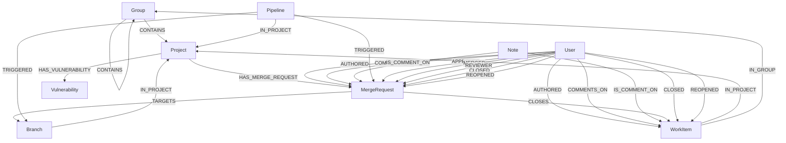
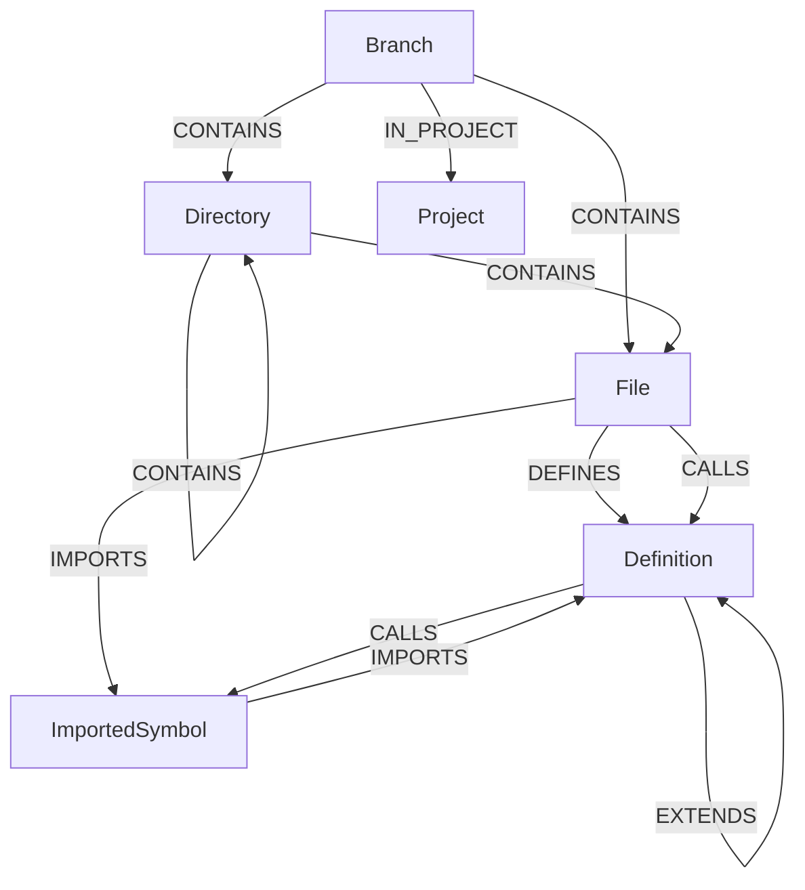

# Data model

## Overview

The GitLab Knowledge Graph is composed of two primary sub-graphs that share a common schema foundation: the **Namespace (SDLC) Graph** and the **Code Graph**. This document details the data model for each, covering the nodes and relationships that constitute them.

The data model is designed to be intuitive and to mirror the mental model that developers and users have of the GitLab platform. By representing entities as nodes and their interactions as relationships, we can perform complex queries that would be difficult or inefficient with a traditional relational database.

The data model follows a [Property Graph](https://neo4j.com/blog/knowledge-graph/rdf-vs-property-graphs-knowledge-graphs/?utm_source=GSearch&utm_medium=PaidSearch&utm_campaign=CTEMEA_CRSearch_SREMEACentralDACH_Non-Brand_DSA&utm_content=PCCoreDB_SCCoreBrand_Misc&utm_term=&gad_source=1&gad_campaignid=20769286946&gclid=Cj0KCQjwo63HBhCKARIsAHOHV_VWAmKJQ19f0_UwVxL8wmIizWjsWahHddHN7Xs--Ao9FFd-wYQkBbMaApmGEALw_wcB) approach over an RDF approach, as GitLab data has strongly defined relationships between entities.

> We can enable custom node and relationship expansion in the future by following the Property Graph approach and building the correct schema management capabilities.

## Data Storage Location

The Knowledge Graph data is stored in ClickHouse graph tables that are separate from the raw replicated data lake tables.

- The implemented graph schema is defined in `config/graph.sql`.
- The implemented ontology metadata and ETL mappings are defined under `config/ontology/`.
- In deployed environments, operators can place the graph tables in a dedicated ClickHouse database or instance. The repository supports either a separate graph database or co-location within a broader ClickHouse deployment, depending on operational requirements.

## Concepts to Know

- **Unified ontology and shared graph primitives**: Both the Code Graph and the SDLC Graph use the same ontology-driven entity and relationship model defined in `config/ontology/` and the same ClickHouse graph schema in `config/graph.sql`. Edges are stored in ontology-configured edge tables (defaulting to `gl_edge`); each edge YAML can set a `table:` field to route specific relationship types to dedicated tables. This allows linking between the two graphs (e.g., a `Project` node from the SDLC graph can be linked to a `Branch`, `File`, or `Definition` from the Code Graph).
- **Entity as Node**: Every entity in the GitLab ecosystem (e.g., Project, Issue, File, Function Definition) is represented as a node.
- **Interaction as Edge**: Relationships between these entities (e.g., a User `COMMENTS_ON` an Issue, a `File` `CONTAINS` a `Definition`) are represented as directed edges.

---

## The Namespace Graph Data Model

The Namespace Graph represents the software development lifecycle (SDLC) entities and their interactions within GitLab. It models how users, projects, issues, merge requests, and CI/CD components relate to one another.

### Implemented Node Types

| Node Type             | Description                                                                                             | Key Properties                                                              |
| --------------------- | ------------------------------------------------------------------------------------------------------- | --------------------------------------------------------------------------- |
| `Group`               | Represents a GitLab group namespace.                                                                    | `id`, `name`, `full_path`, `visibility_level`                                 |
| `Project`             | Represents a GitLab project/repository.                                                                 | `id`, `name`, `full_path`, `namespace_id`                                   |
| `MergeRequest`        | Represents a GitLab merge request.                                                                      | `id`, `iid`, `title`, `state`, `source_branch`, `target_branch`, `project_id`, `merged_commit_sha`, `squash_commit_sha`, denormalized `metric_*` snapshot columns |
| `Pipeline`            | Represents a CI/CD pipeline.                                                                            | `id`, `status`, `source`, `project_id`, `user_id`                             |
| `Deployment`          | Represents a deployment of a commit to a CI/CD environment.                                             | `id`, `iid`, `project_id`, `status`, `ref`, `sha`                             |
| `Environment`         | Represents a CI/CD deployment target (production, staging, review app, etc.).                           | `id`, `project_id`, `name`, `slug`, `state`, `tier`, `environment_type`       |
| `Vulnerability`       | Represents a security vulnerability finding.                                                            | `id`, `title`, `severity`, `state`, `project_id`                              |
| `User`                | Represents a GitLab user.                                                                               | `id`, `username`, `name`                                                    |
| `Note`                | Represents a comment or annotation on a GitLab object (issue, merge request, commit, vulnerability, etc.). | `id`, `note`, `noteable_type`, `noteable_id`, `author_id`                 |
| `WorkItem`            | Represents a GitLab work item (issue, task, epic, objective, etc.).                                     | `id`, `iid`, `title`, `state`, `project_id`, `author_id`                      |
| `Milestone`           | Represents a milestone attached to projects or work items.                                              | `id`, `iid`, `title`, `state`, `due_date`                                    |
| `Label`               | Represents a label applied to work items.                                                               | `id`, `title`, `color`                                                        |
| `Branch`              | Represents a Git branch.                                                                                | `id`, `name`, `project_id`, `is_default`                                    |
| `MergeRequestDiff`    | Represents a merge request diff version.                                                                | `id`, `merge_request_id`, `project_id`, `state`, `diff_type`, `files_count`, `real_size`, `stored_externally` |
| `MergeRequestDiffFile`| Represents a file inside a merge request diff.                                                          | `id`, `merge_request_id`, `merge_request_diff_id`, `new_path`, `old_path`, `generated`, `a_mode`, `b_mode` |
| `Stage`               | Represents a CI stage.                                                                                  | `id`, `name`, `status`, `position`                                            |
| `Job`                 | Represents a CI job (`Ci::Build` or `Ci::Bridge`).                                                      | `id`, `name`, `status`, `ref`, `allow_failure`, `type`, `runner_id`, `timeout`, `timeout_source`, `exit_code`, `scheduling_type`, `auto_canceled_by_id` |
| `JobMetadata`         | Per-job runtime metadata sourced from `siphon_p_ci_builds_metadata`.                                    | `id`, `build_id`, `interruptible`, `timeout`, `timeout_source`, `exit_code`, `expanded_environment_name` |
| `Runner`              | Represents a CI/CD runner (`Ci::Runner`). Global node, no `traversal_path` on the node table.            | `id`, `runner_type`, `name`, `active`, `locked`, `access_level`               |
| `Finding`             | Represents a security finding.                                                                          | `id`, `uuid`, `name`, `severity`                                              |
| `SecurityScan`        | Represents a security scan run.                                                                         | `id`, `scan_type`, `status`, `latest`                                         |
| `VulnerabilityOccurrence` | Represents a concrete vulnerability occurrence.                                                   | `id`, `uuid`, `report_type`, `severity`, `location`                           |
| `VulnerabilityScanner` | Represents the scanner that produced vulnerability data.                                               | `id`, `external_id`, `name`, `vendor`                                         |
| `VulnerabilityIdentifier` | Represents a vulnerability identifier such as CVE or GHSA.                                         | `id`, `external_type`, `external_id`, `name`                                  |

### Relationship Visualization

### Implemented Relationship Types

| Relationship                        | From Node      | To Node        | Description                                                                                             |
| ----------------------------------- | -------------- | -------------- | ------------------------------------------------------------------------------------------------------- |
| `CONTAINS`                          | `Group`        | `Group`, `Project` | A group contains a subgroup or project.                                                            |
| `HAS_MERGE_REQUEST`                 | `Project`      | `MergeRequest` | A project has a merge request.                                                                          |
| `HAS_VULNERABILITY`                 | `Project`      | `Vulnerability`| A project has a vulnerability finding.                                                                  |
| `IN_PROJECT`                        | `Branch`, `WorkItem`, `Pipeline`, `Stage`, `Job`, `Vulnerability`, `Finding`, `VulnerabilityIdentifier`, `Milestone`, `Label`, `SecurityScan`, `Deployment`, `Environment`, `MergeRequestDiff`, `Note`, `MergeRequest` | `Project` | An entity belongs to a project. (FK on each node.)                                                  |
| `IN_GROUP`                          | `WorkItem`     | `Group`        | A work item belongs to a group scope.                                                                   |
| `AUTHORED`                          | `User`         | `WorkItem`, `MergeRequest` | A user authored an entity.                                                                |
| `COMMENTS_ON`                       | `User`         | `MergeRequest`, `WorkItem` | A user commented on an entity (via a `Note`).                                            |
| `IS_COMMENT_ON`                     | `Note`         | `MergeRequest`, `WorkItem` | A note is a comment on a specific entity.                                                |
| `TARGETS`                           | `MergeRequest` | `Branch`       | A merge request targets a specific branch.                                                              |
| `CLOSES`                            | `MergeRequest` | `WorkItem`     | A merge request closes a work item.                                                                     |
| `TRIGGERED`                         | `Pipeline`     | `MergeRequest`, `Branch` | A pipeline was triggered for a merge request or a branch push.                                  |
| `CLOSED`                            | `User`         | `WorkItem`, `MergeRequest` | A user closed a work item or merge request. Sourced from the `closed_by_id`/`metric_latest_closed_by_id` FK columns on the node tables, and supplemented by `system_note_metadata` entries with `action = 'closed'` (see Stage 1 lifecycle edges, kg#499). |
| `MERGED`                            | `User`         | `MergeRequest` | A user merged a merge request. Sourced from `merge_user_id` FK on the MergeRequest node and from `system_note_metadata` entries with `action = 'merged'` (see Stage 1 lifecycle edges, kg#499). |
| `REOPENED`                          | `User`         | `WorkItem`, `MergeRequest` | A user reopened a work item or merge request. Sourced from `system_note_metadata` entries with `action = 'reopened'` via the `siphon_system_note_metadata` Siphon table (requires Analytics team to enable replication; see kg#499). |
| `APPROVED`                          | `User`         | `MergeRequest` | A user approved a merge request.                                                                        |
| `REVIEWER`                          | `User`         | `MergeRequest` | A user is a reviewer of a merge request.                                                                |
| `CONFIRMED_BY`                      | `User`         | `Vulnerability`| A user confirmed a vulnerability.                                                                       |
| `DISMISSED_BY`                      | `User`         | `Vulnerability`| A user dismissed a vulnerability.                                                                       |
| `RESOLVED_BY`                       | `User`         | `Vulnerability`| A user resolved a vulnerability.                                                                        |
| `HAS_JOB`                           | `Stage`, `Pipeline` | `Job`     | A stage contains jobs (canonical Pipeline → Stage → Job traversal); also exposed directly as Pipeline → Job for the natural CI mental model. |
| `HAS_METADATA`                      | `Job`          | `JobMetadata`  | Job has runtime metadata (interruptible, effective timeout, expanded environment) sourced from `siphon_p_ci_builds_metadata`. |
| `IN_PIPELINE`                       | `Job`, `SecurityScan` | `Pipeline` | A job or security scan belongs to a pipeline (one-hop replacement for `Pipeline → Stage → Job`).   |
| `HAS_STAGE`                         | `Pipeline`     | `Stage`        | A pipeline contains stages.                                                                             |
| `AUTO_CANCELED_BY`                  | `Pipeline`, `Job` | `Pipeline`, `Job` | Entity was auto-canceled when a newer entity of the same kind superseded it.                       |
| `CHILD_OF`                          | `Pipeline`     | `Pipeline`     | A pipeline is a downstream child of a parent pipeline (sourced from `ci_sources_pipelines`).            |
| `TRIGGERS_PIPELINE`                 | `Job`          | `Pipeline`     | A bridge job (`type='Ci::Bridge'`) triggered the downstream pipeline.                                   |
| `TRIGGERED_BY_PIPELINE`             | `Job`          | `Pipeline`     | A job runs in a child pipeline whose parent is the upstream pipeline (sourced from `upstream_pipeline_id` on builds). |
| `RUNS_ON`                           | `Job`          | `Runner`       | The runner that executed the job.                                                                       |
| `RUNS_FOR_GROUP`                    | `Runner`       | `Group`        | A group runner is registered against a group.                                                           |
| `RUNS_FOR_PROJECT`                  | `Runner`       | `Project`      | A project runner is registered against a project.                                                       |
| `HAS_NOTE`                          | `MergeRequest`, `WorkItem` | `Note` | An entity has notes attached.                                                          |
| `HAS_LABEL`                         | `WorkItem`     | `Label`        | A work item has labels.                                                                                 |
| `IN_MILESTONE`                      | `WorkItem`     | `Milestone`    | A work item belongs to a milestone.                                                                     |
| `HAS_DIFF`                          | `MergeRequest` | `MergeRequestDiff` | A merge request has diff versions.                                                                 |
| `HAS_LATEST_DIFF`                   | `MergeRequest` | `MergeRequestDiff` | A merge request's most recent diff snapshot (from `latest_merge_request_diff_id`).                 |
| `HAS_FILE`                          | `MergeRequestDiff` | `MergeRequestDiffFile` | A diff version contains files.                                                             |
| `SOURCE_PROJECT`                    | `MergeRequest` | `Project`      | Source project for the merge request (differs from target project for fork-based MRs).                  |
| `HAS_HEAD_PIPELINE`                 | `MergeRequest` | `Pipeline`     | The pipeline running against the tip of the source branch.                                              |
| `UPDATED_BY`                        | `User`         | `MergeRequest` | User who most recently updated the merge request.                                                       |
| `LAST_EDITED_BY`                    | `User`         | `MergeRequest` | User who most recently edited the merge request's content (title/description).                         |
| `HAS_FINDING`                       | `SecurityScan` | `Finding`      | A security scan produced findings.                                                                      |
| `HAS_IDENTIFIER`                    | `Vulnerability`| `VulnerabilityIdentifier` | A vulnerability is associated with identifiers.                                               |
| `DETECTED_IN`                       | `Vulnerability`| `VulnerabilityOccurrence` | A vulnerability is detected in an occurrence.                                                  |
| `DETECTED_BY`                       | `Finding`, `VulnerabilityOccurrence` | `VulnerabilityScanner` | Security data is associated with a scanner.                              |
| `DEPLOYED_BY`                       | `User`         | `Deployment`   | User who triggered the deployment.                                                                      |
| `DEPLOYED_TO`                       | `MergeRequest` | `Deployment`   | Merge request was included in a deployment.                                                             |
| `IN_ENVIRONMENT`                    | `Deployment`   | `Environment`  | Deployment targets a specific environment.                                                              |
| `CREATED_FOR_MR`                    | `Environment`  | `MergeRequest` | Environment was first created by a merge request pipeline.                                              |

---

## The Code Graph Data Model

The Code Graph represents the structure and relationships within the source code of a repository. It models the file system hierarchy, code definitions, and the call graph.

### Node Types

| Node Type             | Description                                                                                             | Key Properties                                                              |
| --------------------- | ------------------------------------------------------------------------------------------------------- | --------------------------------------------------------------------------- |
| `Branch`              | Root of the code file tree for a specific branch.                                                       | `id`, `name`, `project_id`, `is_default`                                    |
| `Directory`           | Represents a directory within a repository.                                                             | `relative_path`, `absolute_path`, `repository_name`                         |
| `File`                | Represents a file within a repository.                                                                  | `relative_path`, `absolute_path`, `language`, `repository_name`             |
| `Definition`          | A code definition such as a class, function, method, or module.                                         | `fqn`, `name`, `definition_type`, `file_path`, `start_line`, `end_line`, `branch`, `commit_sha`, virtual `content` |
| `ImportedSymbol`      | An imported symbol or module reference within a file.                                                   | `import_path`, `import_type`, `identifier_name`, `identifier_alias`, `file_path` |

### Relationship Visualization

### Relationship Types

| Relationship | From Node | To Node | Description |
| --- | --- | --- | --- |
| `CONTAINS`   | `Branch`, `Directory` | `Directory`, `File` | A branch or directory lexically contains a directory or file. |
| `IN_PROJECT` | `Branch`              | `Project`           | A branch belongs to a project (links the Code Graph to the Namespace Graph). |
| `ON_BRANCH`  | `Directory`, `File`, `Definition`, `ImportedSymbol` | `Branch` | Snapshots a code-graph node to a specific branch and commit. |
| `DEFINES`    | `File`, `Definition`  | `Definition`        | File-level definition or lexical nesting between two definitions (e.g. a class containing methods). Inheritance is `EXTENDS`; call sites are `CALLS`. |
| `IMPORTS`    | `File`, `ImportedSymbol` | `ImportedSymbol`, `Definition` | Module-system import edges. Covers `File → ImportedSymbol` for the import statement itself, and `ImportedSymbol → Definition` resolution (JS/TS today). |
| `CALLS`      | `File`, `Definition`  | `Definition`, `ImportedSymbol` | Function or method invocation. Variants: `Definition → Definition` (resolved call), `File → Definition` (top-level call outside any definition), and `Definition → ImportedSymbol` (call whose target is still an unresolved import). |
| `EXTENDS`    | `Definition`          | `Definition`        | Supertype declaration. Covers class extension, interface implementation, and struct embedding (Go). |

---

## Cross-Graph Relationships

The `Project` and `Branch` nodes bridge the SDLC and Code graphs. A `Project` exists in the SDLC graph, while a `Branch` belongs to that project via `IN_PROJECT` and contains the root-level `Directory` and `File` nodes via `CONTAINS`. Cross-graph queries can traverse shared project, branch, and review entities even when edges live in different physical tables, because the compiler emits `UNION ALL` across all relevant edge tables for wildcard and multi-table relationship queries.
