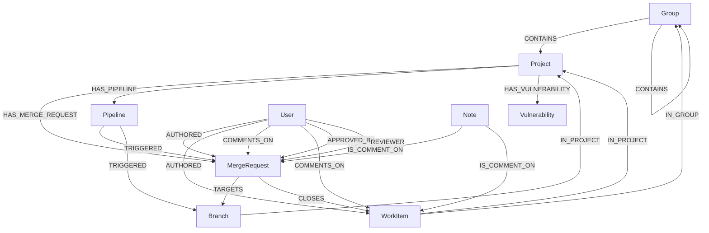
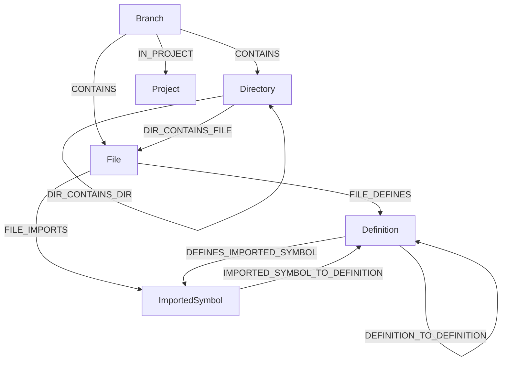

# Data model

## Overview

The GitLab Knowledge Graph is composed of two primary sub-graphs that share a common schema foundation: the **Namespace (SDLC) Graph** and the **Code Graph**. This document details the data model for each, covering the nodes and relationships that constitute them.

The data model is designed to be intuitive and to mirror the mental model that developers and users have of the GitLab platform. By representing entities as nodes and their interactions as relationships, we can perform complex queries that would be difficult or inefficient with a traditional relational database.

The data model follows a [Property Graph](https://neo4j.com/blog/knowledge-graph/rdf-vs-property-graphs-knowledge-graphs/?utm_source=GSearch&utm_medium=PaidSearch&utm_campaign=CTEMEA_CRSearch_SREMEACentralDACH_Non-Brand_DSA&utm_content=PCCoreDB_SCCoreBrand_Misc&utm_term=&gad_source=1&gad_campaignid=20769286946&gclid=Cj0KCQjwo63HBhCKARIsAHOHV_VWAmKJQ19f0_UwVxL8wmIizWjsWahHddHN7Xs--Ao9FFd-wYQkBbMaApmGEALw_wcB) approach over an RDF approach, as GitLab data has strongly defined relationships between entities.

> We can enable custom node and relationship expansion in the future by following the Property Graph approach and building the correct schema management capabilities.

## Data Storage Location

The Knowledge Graph data is stored in ClickHouse graph tables that are separate from the raw replicated data lake tables.

- The implemented graph schema is defined in `config/graph.sql`.
- The implemented ontology metadata and ETL mappings are defined under `config/ontology/`.
- In deployed environments, operators can place the graph tables in a dedicated ClickHouse database or instance. The repository supports either a separate graph database or co-location within a broader ClickHouse deployment, depending on operational requirements.

## Concepts to Know

- **Unified ontology and shared graph primitives**: Both the Code Graph and the SDLC Graph use the same ontology-driven entity and relationship model defined in `config/ontology/`, the same shared edge table (`gl_edge`), and the same ClickHouse graph schema in `config/graph.sql`. This allows linking between the two graphs (e.g., a `Project` node from the SDLC graph can be linked to a `Branch`, `File`, or `Definition` from the Code Graph).
- **Entity as Node**: Every entity in the GitLab ecosystem (e.g., Project, Issue, File, Function Definition) is represented as a node.
- **Interaction as Edge**: Relationships between these entities (e.g., a User `COMMENTS_ON` an Issue, a `File` `CONTAINS` a `Definition`) are represented as directed edges.

---

## The Namespace Graph Data Model

The Namespace Graph represents the software development lifecycle (SDLC) entities and their interactions within GitLab. It models how users, projects, issues, merge requests, and CI/CD components relate to one another.

### Implemented Node Types

| Node Type             | Description                                                                                             | Key Properties                                                              |
| --------------------- | ------------------------------------------------------------------------------------------------------- | --------------------------------------------------------------------------- |
| `Group`               | Represents a GitLab group namespace.                                                                    | `id`, `name`, `full_path`, `visibility_level`                                 |
| `Project`             | Represents a GitLab project/repository.                                                                 | `id`, `name`, `full_path`, `namespace_id`                                   |
| `MergeRequest`        | Represents a GitLab merge request.                                                                      | `id`, `iid`, `title`, `state`, `source_branch`, `target_branch`, `project_id` |
| `Pipeline`            | Represents a CI/CD pipeline.                                                                            | `id`, `status`, `source`, `project_id`, `user_id`                             |
| `Vulnerability`       | Represents a security vulnerability finding.                                                            | `id`, `title`, `severity`, `state`, `project_id`                              |
| `User`                | Represents a GitLab user.                                                                               | `id`, `username`, `name`                                                    |
| `Note`                | Represents a comment or annotation on a GitLab object (issue, merge request, commit, vulnerability, etc.). | `id`, `note`, `noteable_type`, `noteable_id`, `author_id`                 |
| `WorkItem`            | Represents a GitLab work item (issue, task, epic, objective, etc.).                                     | `id`, `iid`, `title`, `state`, `project_id`, `author_id`                      |
| `Milestone`           | Represents a milestone attached to projects or work items.                                              | `id`, `iid`, `title`, `state`, `due_date`                                    |
| `Label`               | Represents a label applied to work items.                                                               | `id`, `title`, `color`                                                        |
| `Branch`              | Represents a Git branch.                                                                                | `id`, `name`, `project_id`, `is_default`                                    |
| `MergeRequestDiff`    | Represents a merge request diff version.                                                                | `id`, `merge_request_id`, `state`, `files_count`                              |
| `MergeRequestDiffFile`| Represents a file inside a merge request diff.                                                          | `id`, `merge_request_id`, `merge_request_diff_id`, `new_path`, `old_path`     |
| `Stage`               | Represents a CI stage.                                                                                  | `id`, `name`, `status`, `position`                                            |
| `Job`                 | Represents a CI job.                                                                                    | `id`, `name`, `status`, `ref`, `allow_failure`                                |
| `Finding`             | Represents a security finding.                                                                          | `id`, `uuid`, `name`, `severity`                                              |
| `SecurityScan`        | Represents a security scan run.                                                                         | `id`, `scan_type`, `status`, `latest`                                         |
| `VulnerabilityOccurrence` | Represents a concrete vulnerability occurrence.                                                   | `id`, `uuid`, `report_type`, `severity`, `location`                           |
| `VulnerabilityScanner` | Represents the scanner that produced vulnerability data.                                               | `id`, `external_id`, `name`, `vendor`                                         |
| `VulnerabilityIdentifier` | Represents a vulnerability identifier such as CVE or GHSA.                                         | `id`, `external_type`, `external_id`, `name`                                  |

### Relationship Visualization

### Implemented Relationship Types

| Relationship                        | From Node      | To Node        | Description                                                                                             |
| ----------------------------------- | -------------- | -------------- | ------------------------------------------------------------------------------------------------------- |
| `CONTAINS`                          | `Group`        | `Group`, `Project` | A group contains a subgroup or project.                                                            |
| `HAS_MERGE_REQUEST`                 | `Project`      | `MergeRequest` | A project has a merge request.                                                                          |
| `HAS_PIPELINE`                      | `Project`      | `Pipeline`     | A project has a CI/CD pipeline.                                                                         |
| `HAS_VULNERABILITY`                 | `Project`      | `Vulnerability`| A project has a vulnerability finding.                                                                  |
| `IN_PROJECT`                        | `Branch`, `WorkItem` | `Project` | An entity belongs to a project.                                                                     |
| `IN_GROUP`                          | `WorkItem`     | `Group`        | A work item belongs to a group scope.                                                                   |
| `AUTHORED`                          | `User`         | `WorkItem`, `MergeRequest` | A user authored an entity.                                                                |
| `COMMENTS_ON`                       | `User`         | `MergeRequest`, `WorkItem` | A user commented on an entity (via a `Note`).                                            |
| `IS_COMMENT_ON`                     | `Note`         | `MergeRequest`, `WorkItem` | A note is a comment on a specific entity.                                                |
| `TARGETS`                           | `MergeRequest` | `Branch`       | A merge request targets a specific branch.                                                              |
| `CLOSES`                            | `MergeRequest` | `WorkItem`     | A merge request closes a work item.                                                                     |
| `TRIGGERED`                         | `Pipeline`     | `MergeRequest`, `Branch` | A pipeline was triggered for a merge request or a branch push.                                  |
| `CLOSED_BY`                         | `User`         | `WorkItem`     | A user closed a work item.                                                                              |
| `APPROVED_BY`                       | `User`         | `MergeRequest` | A user approved a merge request.                                                                        |
| `REVIEWER`                          | `User`         | `MergeRequest` | A user is a reviewer of a merge request.                                                                |
| `HAS_JOB`                           | `Pipeline`     | `Job`          | A pipeline contains jobs.                                                                               |
| `HAS_STAGE`                         | `Pipeline`     | `Stage`        | A pipeline contains stages.                                                                             |
| `HAS_NOTE`                          | `MergeRequest`, `WorkItem` | `Note` | An entity has notes attached.                                                          |
| `HAS_LABEL`                         | `WorkItem`     | `Label`        | A work item has labels.                                                                                 |
| `IN_MILESTONE`                      | `WorkItem`     | `Milestone`    | A work item belongs to a milestone.                                                                     |
| `HAS_DIFF`                          | `MergeRequest` | `MergeRequestDiff` | A merge request has diff versions.                                                                 |
| `HAS_FILE`                          | `MergeRequestDiff` | `MergeRequestDiffFile` | A diff version contains files.                                                             |
| `HAS_FINDING`                       | `SecurityScan` | `Finding`      | A security scan produced findings.                                                                      |
| `HAS_IDENTIFIER`                    | `Vulnerability`| `VulnerabilityIdentifier` | A vulnerability is associated with identifiers.                                               |
| `DETECTED_IN`                       | `Vulnerability`| `VulnerabilityOccurrence` | A vulnerability is detected in an occurrence.                                                  |
| `DETECTED_BY`                       | `Finding`, `VulnerabilityOccurrence` | `VulnerabilityScanner` | Security data is associated with a scanner.                              |

---

## The Code Graph Data Model

The Code Graph represents the structure and relationships within the source code of a repository. It models the file system hierarchy, code definitions, and the call graph.

### Node Types

| Node Type             | Description                                                                                             | Key Properties                                                              |
| --------------------- | ------------------------------------------------------------------------------------------------------- | --------------------------------------------------------------------------- |
| `Branch`              | Root of the code file tree for a specific branch.                                                       | `id`, `name`, `project_id`, `is_default`                                    |
| `Directory`           | Represents a directory within a repository.                                                             | `relative_path`, `absolute_path`, `repository_name`                         |
| `File`                | Represents a file within a repository.                                                                  | `relative_path`, `absolute_path`, `language`, `repository_name`             |
| `Definition`          | Represents a code definition (e.g., class, function, method, module).                                   | `fully_qualified_name`, `display_name`, `definition_type`, `file_path`      |
| `ImportedSymbol`      | Represents an imported symbol or module within a file.                                                  | `symbol_name`, `source_module`, `file_path`                                 |

### Relationship Visualization

### Relationship Types

| Relationship                        | From Node      | To Node        | Description                                                                                             |
| ----------------------------------- | -------------- | -------------- | ------------------------------------------------------------------------------------------------------- |
| `CONTAINS`                          | `Branch`       | `Directory`, `File` | A branch contains root-level directories and files.                                                |
| `IN_PROJECT`                        | `Branch`       | `Project`      | A branch belongs to a project (links the Code Graph to the Namespace Graph).                            |
| `DIR_CONTAINS_DIR`                  | `Directory`    | `Directory`    | A directory contains another directory.                                                                 |
| `DIR_CONTAINS_FILE`                 | `Directory`    | `File`         | A directory contains a file.                                                                            |
| `FILE_DEFINES`                      | `File`         | `Definition`   | A file contains a code definition.                                                                      |
| `FILE_IMPORTS`                      | `File`         | `ImportedSymbol`| A file imports a symbol.                                                                                |
| `DEFINITION_TO_DEFINITION`          | `Definition`   | `Definition`   | Represents a call graph edge (e.g., a function calls another function, a class inherits from another).    |
| `DEFINES_IMPORTED_SYMBOL`           | `Definition`   | `ImportedSymbol`| A definition (e.g., an exported function) is the source of an imported symbol.                          |
| `IMPORTED_SYMBOL_TO_DEFINITION`     | `ImportedSymbol`| `Definition`   | An imported symbol resolves to a specific definition.                                                   |

---

## Cross-Graph Relationships

The `Project` and `Branch` nodes bridge the SDLC and Code graphs. A `Project` exists in the SDLC graph, while a `Branch` belongs to that project via `IN_PROJECT` and contains the root-level `Directory` and `File` nodes via `CONTAINS`. Because the current schema stores both SDLC and code relationships in the same `gl_edge` table, cross-graph queries can traverse shared project, branch, and review entities without switching storage systems.
