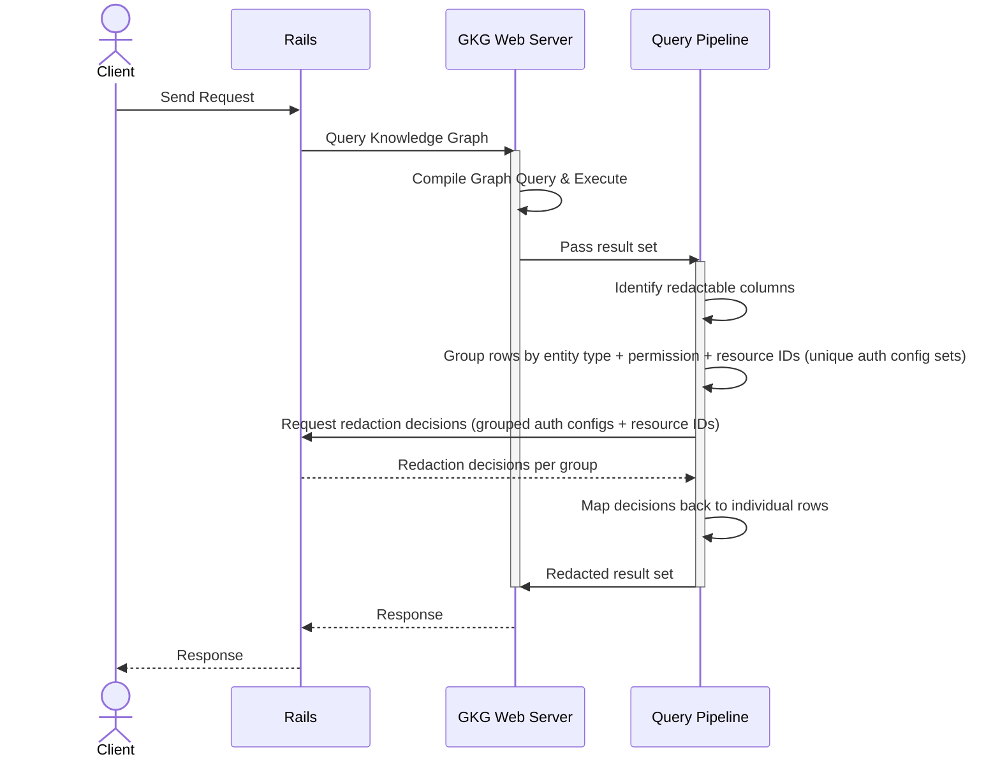

## Status

Accepted

## Date

2026-02-19

## Context

GKG is a Rust service that queries ClickHouse. Rails owns all authorization decisions via `Ability.allowed?`. Neither can do the other's job, but they need to collaborate mid-request: GKG runs the query, then asks Rails to check permissions on the results before returning them.

The problem is that GKG needs to call *back* to Rails during query execution. Standard request-response protocols can't express this without a second connection from GKG to Rails, creating a circular dependency.

## Decision

Use gRPC with bidirectional streaming for the RPC that requires redaction (`ExecuteQuery`), and standard unary RPCs for the three that do not (`ListTools`, `GetGraphSchema`, `GetClusterHealth`).

### Service definition

From `gkg.proto` (package `gkg.v1`). The original 5-RPC design included `ExecuteTool` and `GetOntology`; these were consolidated into `ExecuteQuery` (with `ResponseFormat`) and `GetGraphSchema` respectively. See [ADR 003](003_api_design.md) for the rationale.

```protobuf
service KnowledgeGraphService {
  rpc ListTools(ListToolsRequest) returns (ListToolsResponse);
  rpc ExecuteQuery(stream ExecuteQueryMessage) returns (stream ExecuteQueryMessage);
  rpc GetGraphSchema(GetGraphSchemaRequest) returns (GetGraphSchemaResponse);
  rpc GetClusterHealth(GetClusterHealthRequest) returns (GetClusterHealthResponse);
  rpc GetGraphStats(GetGraphStatsRequest) returns (GetGraphStatsResponse);
  rpc GetNamespaceIndexingProgress(GetNamespaceIndexingProgressRequest) returns (GetNamespaceIndexingProgressResponse);
}
```

| RPC | Pattern | Purpose |
|-----|---------|---------|
| `ListTools` | Unary | Return available tool definitions with JSON schemas |
| `ExecuteQuery` | Bidi streaming | Execute a graph query with mid-stream redaction exchange |
| `GetGraphSchema` | Unary | Return the graph schema with optional node expansion |
| `GetClusterHealth` | Unary | Return cluster health for the Orbit dashboard |
| `GetGraphStats` | Unary | Return entity counts per domain scoped by traversal path |
| `GetNamespaceIndexingProgress` | Unary | Return per-entity indexing progress for a namespace |

### The bidirectional streaming redaction exchange

The `ExecuteQuery` bidi RPC follows a four-step message sequence:

1. Client sends `ExecuteQueryRequest`
2. Server sends `RedactionRequired` -- a list of `ResourceToAuthorize` messages, each containing a `resource_type`, `ability`, and batch of `ids` that need authorization
3. Client sends `RedactionResponse` -- a map of `resource_id -> authorized (bool)` per resource type
4. Server sends `ExecuteQueryResult`, with unauthorized rows already filtered



### Row-level authorization mapping

The `ResourceToAuthorize` grouping works at the row level. After GKG executes a ClickHouse query, it scans the result set for columns prefixed with `_gkg_p_` (permission metadata injected during indexing). Rows are grouped by `(resource_type, ability)` to minimize round-trips to Rails:

```plaintext
-- SQL result (Arrow batches) --
row 0: { _gkg_p_id: 1, _gkg_p_type: "Project", name: "foo" }
row 1: { _gkg_p_id: 5, _gkg_p_type: "Project", name: "bar" }

-- from_batches() → QueryResult --
rows = [
  QueryResultRow { columns: { _gkg_p_id: 1, _gkg_p_type: "Project", ... }, authorized: true },
  QueryResultRow { columns: { _gkg_p_id: 5, _gkg_p_type: "Project", ... }, authorized: true },
]
ctx.entity_auth = { "Project" → { resource_type: "projects", ability: "read" } }

-- resource_checks() --
ids = {}
  row 0 → node_ref(p) = NodeRef { id: 1, entity_type: "Project" }
          auth = { resource_type: "projects", ability: "read" }
          ids[("projects", "read")].insert(1)   → { ("projects","read"): {1} }
  row 1 → node_ref(p) = NodeRef { id: 5, entity_type: "Project" }
          ids[("projects", "read")].insert(5)   → { ("projects","read"): {1, 5} }

→ ResourceToAuthorize { resource_type: "projects", ability: "read", ids: [1, 5] }

-- AuthorizationStage → redaction service --
request:  { resource_type: "projects", ability: "read", ids: [1, 5] }
response: ResourceAuthorization { resource_type: "projects", authorized: { 1: true, 5: false } }

-- apply_authorizations() --
  row 0 → node_ref(p) = NodeRef { id: 1, entity_type: "Project" }
          is_authorized? → authorized.get(1) = true  ✓  row stays
  row 1 → node_ref(p) = NodeRef { id: 5, entity_type: "Project" }
          is_authorized? → authorized.get(5) = false ✗  row.set_unauthorized()

→ rows = [
    QueryResultRow { ..., authorized: true  },   ← returned to caller
    QueryResultRow { ..., authorized: false },   ← filtered out
  ]
```

### Message types

The bidi stream uses a `oneof` envelope that carries all four message phases:

```protobuf
message ExecuteQueryMessage {
  oneof content {
    ExecuteQueryRequest request = 1;
    RedactionExchange redaction = 2;
    ExecuteQueryResult result = 3;
    ExecuteQueryError error = 4;
  }
}

message RedactionExchange {
  oneof content {
    RedactionRequired required = 1;
    RedactionResponse response = 2;
  }
}
```

## Why bidirectional streaming

Three alternatives were considered and rejected for the redaction exchange:

REST callback (GKG calls a Rails HTTP endpoint mid-request): This creates a circular service dependency. Rails calls GKG, GKG calls Rails back over a separate HTTP connection. This doubles the connection surface, complicates load balancer configuration, and means GKG needs its own HTTP client and separate auth credentials for the callback path. The callback can timeout independently of the original request.

Unary gRPC (separate RPC for each phase): Rails would need to call `StartQuery`, poll for `GetRedactionRequest`, send `SubmitRedactionResponse`, then poll for `GetResult`. This adds latency from polling intervals, requires server-side state management for in-flight queries, and turns a single logical operation into four separate RPCs with their own failure modes.

Server streaming (GKG streams results to Rails): This only solves the server-to-client direction. Rails still cannot send redaction responses back to GKG within the same stream.

Bidirectional streaming lets both sides send messages on the same connection. The exchange happens in a single RPC with a single timeout. No polling or callback infrastructure needed.

Without bidi streaming, a redaction-capable query requires two separate connections -- one from the client through Rails to GKG, and a second from GKG back to Rails for authorization checks. With bidi streaming, the entire exchange runs over a single connection. This halves the connection overhead and eliminates the latency from establishing the callback connection under load.

## Why gRPC over REST

`gkg.proto` is the contract. Rails generates a Ruby client gem from it; GKG implements the server in Rust with `tonic`. Schema mismatches are caught at compile time, not at runtime.

HTTP/2 multiplexing is built into gRPC. The bidi streaming pattern described above has no clean equivalent in REST or GraphQL.

Protobuf encoding is smaller and faster to parse than JSON, which matters when serializing batches of resource IDs and authorization results.

GitLab already runs several gRPC services in production: Gitaly (Git storage), Praefect (Gitaly cluster proxy), and Duo Workflow (AI workflow execution). The operational patterns for channel management, error handling, monitoring, and deployment are already in place.

### Following the Gitaly pattern

The Rails-GKG integration copies the patterns Gitaly established.

A `gkg-proto` gem will be published to the GitLab gem registry, generated from `gkg.proto`. Rails consumes this gem for client stubs, the same way it consumes `gitaly-proto`.

Rails will maintain a gRPC channel pool to GKG, configured via `gitlab.yml` with the GKG service address. Connection settings (keepalive, max message size, timeouts) follow Gitaly's configuration model.

gRPC status codes map to application errors: `UNAVAILABLE` triggers retry with backoff, `PERMISSION_DENIED` maps to a 403, `DEADLINE_EXCEEDED` maps to a 504. The error handling middleware mirrors Gitaly's.

Request logging, tracing (via LabKit), and metrics collection use gRPC interceptors, same as Gitaly.

## Security

### Authentication: JWT + mTLS

Service-to-service authentication uses two layers, matching the model described in the [security design document](../security.md):

- JWT tokens carry user context (`user_id`, `organization_id`, `traversal_ids`) and are signed with a shared secret (HS256). Tokens expire after 5 minutes.
- mTLS provides transport-layer identity verification via Kubernetes service mesh or manual TLS configuration with cert-manager.

JWT is passed as gRPC metadata (equivalent to HTTP headers) on every RPC call.

### Authorization boundary

GKG never makes authorization decisions. It executes queries, extracts resource IDs from results, and sends them to Rails for `Ability.allowed?` checks. Rails is the single source of truth for permissions. GKG only filters rows based on the boolean responses it receives.

### DoS vectors

The bidi streaming RPCs introduce specific denial-of-service risks:

- A query returning millions of rows would generate a massive `RedactionRequired` message. The existing 1000-row query limit in the GKG query engine prevents this.
- A slow or unresponsive client holds the gRPC stream open on the server. Per-RPC deadlines should be configured (not yet implemented -- see "Known gaps" above) to bound the wait.
- An attacker opening many bidi streams without sending messages. gRPC's `MAX_CONCURRENT_STREAMS` setting and Kubernetes resource limits are the current controls, but explicit server-side stream limits should be added.

### Certificate management

TLS certificates for mTLS are managed through one of:

- Kubernetes service mesh (Istio/Linkerd), which handles automatic cert rotation with no application-level configuration
- cert-manager, for automatic provisioning and renewal from a cluster-internal CA
- Manual configuration for self-managed deployments, following the same certificate setup as Gitaly

## Postgres load risk from Layer 3 checks

Every `Ability.allowed?` call in Rails hits Postgres to evaluate DeclarativePolicy rules. A query returning 1000 rows across 5 resource types could trigger 1000 permission checks, each potentially loading the resource from Postgres and evaluating multiple policy conditions.

### Mitigations

The `ResourceToAuthorize` message groups IDs by `(resource_type, ability)`, and GKG enforces a maximum of 100 resource IDs per check. For a 1000-row result with mixed types, this means at most 10 batched checks rather than 1000 individual ones.

The GKG query engine already enforces a 1000-row limit per query, which caps the upper bound of permission checks per request.

The authorization endpoint should use `Ability.allowed?` with batch loading (preloading resources and their policy dependencies) rather than N+1 individual checks. The existing `SearchService#redact_unauthorized_results` pattern provides the template.

The Auth Architecture team is building [GLAZ](https://gitlab.com/gitlab-org/architecture/auth-architecture/design-doc/-/merge_requests/74), a custom Zanzibar-like authorization service in Rust. GLAZ will handle relationship-based, role-based, and attribute-based access control with its own graph traversal engine backed by PostgreSQL/YugabyteDB. Once GLAZ is available, Layer 3 redaction checks can be routed to it over gRPC instead of hitting Postgres through DeclarativePolicy. The bidi streaming protocol does not need to change -- only the Rails-side handler that evaluates `RedactionResponse` would swap from `Ability.allowed?` to a GLAZ client call. Until then, the batch limits and row caps keep the load bounded.

## Puma thread implications

Each KG query blocks a Puma thread for the full duration of the bidi stream -- from the initial request through ClickHouse execution, the redaction exchange (including `Ability.allowed?` DB lookups), and the final result. The Rails gRPC client uses a synchronous `Queue` + `Enumerator` pattern; there is no async or non-blocking handling.

This is still better than the REST callback alternative. With a REST callback, the original Puma thread blocks waiting for GKG's response while a *second* Puma thread handles the authorization callback from GKG. That means two threads consumed per query. With bidi streaming, the redaction exchange happens on the same thread that initiated the request -- one thread total.

The blocking behavior is the same as any synchronous external service call in Rails (Gitaly, Elasticsearch, Zoekt). The mitigations are the same too: enforce request deadlines, keep query result sets small (the 1000-row limit bounds redaction work), and monitor thread pool saturation.

### Known gaps

Neither the Rails client nor the GKG server currently configures explicit timeouts or deadlines on bidi streams. The Rails client does not pass a `deadline:` parameter to stub calls, and the GKG server does not wrap stream handlers with `tokio::time::timeout()`. A stalled client or server can hold a stream open indefinitely, bounded only by TCP keepalive. This needs to be addressed before production rollout.

There is no idempotency handling. Requests carry no idempotency key, and there is no deduplication or replay detection. If a request fails mid-stream, the client retries from scratch. Since KG queries are read-only, this is safe but wasteful -- a failed query that already ran against ClickHouse will re-execute the same work.

There is no limit on concurrent bidi streams on the GKG server. Each stream spawns an independent tokio task with no cap. A burst of requests could spawn thousands of tasks, each running a ClickHouse query. gRPC's `MAX_CONCURRENT_STREAMS` setting and Kubernetes resource limits are the only controls.

## Alternatives considered

| Alternative | Why rejected |
|---|---|
| REST callbacks | Circular dependency between services. GKG needs its own HTTP client and credentials. Doubles failure surface. |
| Shared database | GKG reading from Postgres would couple it to the Rails schema and bypass the CDC pipeline. Violates the boundary between OLTP and OLAP. |
| Pre-computed authorization cache | Caching `Ability.allowed?` results requires invalidating on every permission change (role updates, confidentiality toggles, SAML changes). The invalidation problem is as hard as the original authorization problem. |
| Message queue (NATS/Kafka) | The redaction exchange is synchronous -- GKG cannot proceed until it has authorization results. A queue adds infrastructure complexity for a request-response pattern that gRPC handles directly. |
| HTTP/2 SSE | Server-Sent Events are unidirectional (server to client only). The redaction exchange requires both directions within a single request. |

## Consequences

Rails will need the `grpc` gem and the `gkg-proto` generated client. This follows the Gitaly pattern and uses the same gem infrastructure.

Changes to `gkg.proto` require regenerating the proto gem, publishing it, and updating Rails. Backwards-compatible changes (adding fields, adding RPCs) do not require lockstep deploys. Breaking changes (removing fields, changing types) require the standard proto deprecation workflow.

Bidi streaming RPCs are harder to inspect than unary calls. Standard HTTP debugging tools do not work. Teams will need gRPC-aware tooling (grpcurl, Bloom RPC, or custom logging interceptors) for debugging.

If Rails is down or slow, GKG cannot complete any query that requires Layer 3 checks. This is intentional -- the alternative (skipping redaction) would be a security violation.

## References

- [Proto definition: `gkg.proto`](../../../crates/gkg-server/proto/gkg.proto)
- [Security design document](../security.md)
- [MR !273: gRPC service implementation](https://gitlab.com/gitlab-org/rust/knowledge-graph/-/merge_requests/273)
- [Gitaly client in Rails](https://gitlab.com/gitlab-org/gitlab/-/tree/master/lib/gitlab/gitaly_client)
- [Gitaly proto definitions](https://gitlab.com/gitlab-org/gitaly/-/tree/master/proto)
- [ADR 003: API Design — Unified REST + GraphQL](003_api_design.md)
