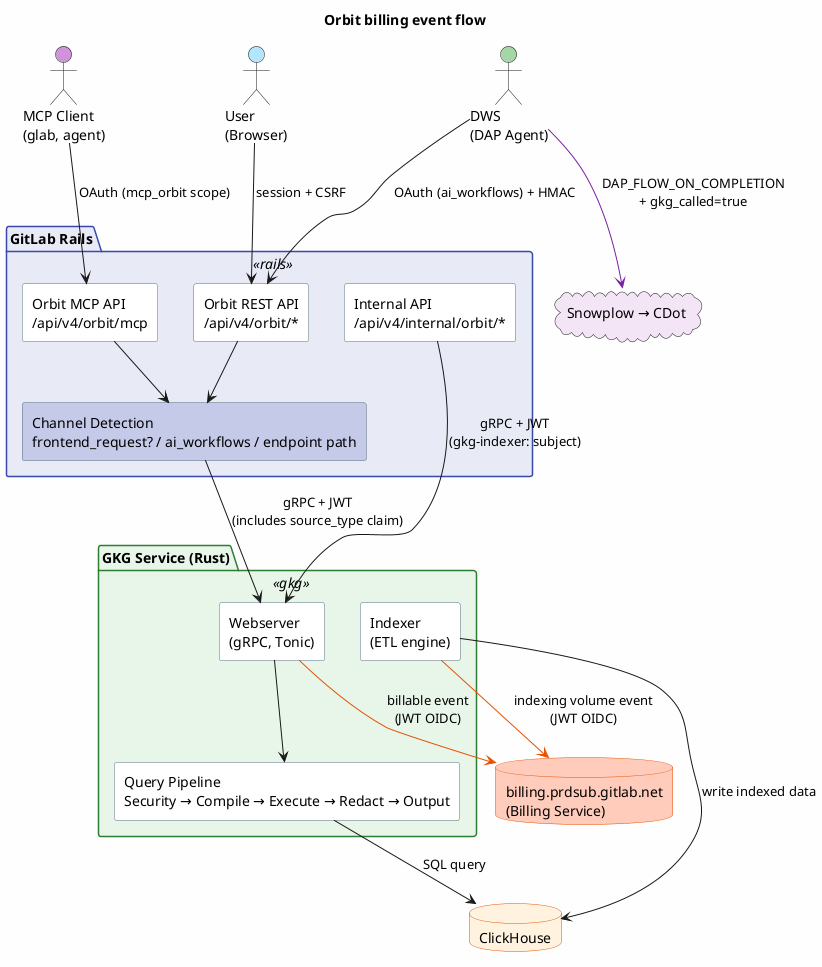
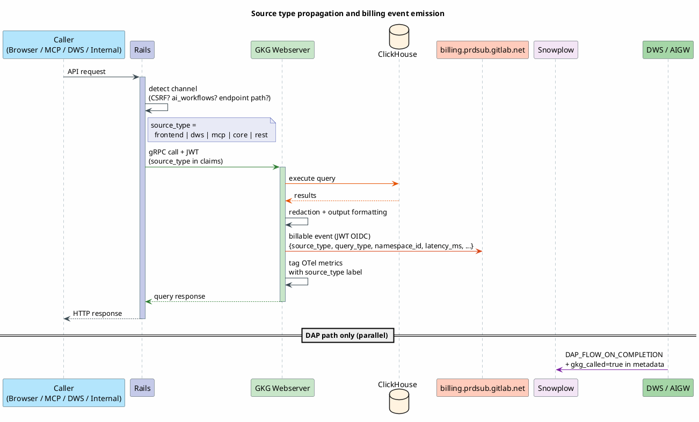
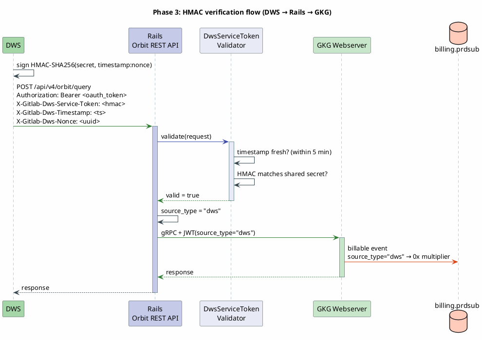
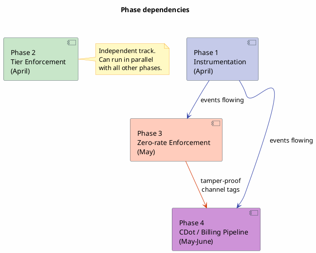

# ADR 007: Orbit monetization engineering

**Date:** 2026-03-26
**Author:** @michaelangeloio
**Status:** Draft
**Epic:** [gitlab-org&21198](https://gitlab.com/groups/gitlab-org/-/epics/21198)
**Parent Epic:** [GKG Core Development Workstream &20357](https://gitlab.com/groups/gitlab-org/-/epics/20357)
**Related:**
- [ADR 006: Orbit + DAP integration](orbit-dap-integration-spec.md)
- [Orbit usage billing spec](orbit-usage-billing-spec.md)
- [Zero-rating meeting notes (2026-03-11)](https://docs.google.com/document/d/1JbzhTtlF4rDMhmIjNkmDwLQyLovRmDlaGprw5yc-rOw)
- [GA Launch Super Document](https://docs.google.com/document/d/1UD5E_53bMfX6IYRVu41KGZ7NGh-wObXrOA0EizI_d0U)

---

## 1. Context

Orbit has four consumption channels with different billing models per deployment type:

| Channel | .com / Dedicated (GitLab-hosted) | Self-managed / customer-hosted |
|---------|----------------------------------|-------------------------------|
| **DAP (DWS)** | Zero-rated (bundled with Duo seat) | Included* |
| **Frontend (Dashboard)** | Included in license | Included in license |
| **Core (Internal)** | N/A (infrastructure) | N/A (infrastructure) |
| **External (MCP, glab CLI)** | Metered per-query via Credits | Included* |

> **Note:** Pricing model for self-managed and customer-hosted Dedicated is subject to change. Phase 1 instrumentation covers all deployments so the billing pipeline can be extended if needed.

---

## 2. Decision

Split monetization into four phases. Phases 1 and 2 run in parallel from the start. Phase 3 depends on Phase 1. Phase 4 depends on both.

1. **Instrumentation** (April): propagate source type from Rails to GKG via JWT claims, wire GKG webserver and indexer to emit billable events to the billing service via JWT OIDC, tag OTel metrics. No AIGW work.
2. **Tier enforcement** (April, parallel): gate all Orbit endpoints behind `licensed_feature_available?(:orbit)` for Premium/Ultimate.
3. **Zero-rate enforcement** (May): HMAC shared secret between DWS and Rails to tamper-proof the channel tag on .com and GitLab-hosted Dedicated.
4. **CDot billing pipeline** (May-June): flat-rate multiplier pricing in CDot, credits dashboard, `gkg_called` metadata on AIGW DAP events.

Rails does not emit billing events. It acts as a proxy. Billing events are emitted by the services that execute the work (GKG webserver, GKG indexer, AIGW/DWS).

### Alternatives considered

**Emit billing events from Rails instead of GKG.** Rejected because Rails is a proxy. The GKG webserver has the actual execution data (latency, result count before redaction, cache hits) that Rails doesn't see. Emitting from GKG also aligns with the billing service connection pattern being built for other Rust/Go services.

**Suppress billing events for zero-rated channels instead of using multipliers.** Rejected per the zero-rating meeting. Fulfillment requires every access to emit an event. Zero-rating is a CDot-side multiplier, not event suppression.

**Use `ai_workflows` OAuth scope alone for zero-rate enforcement.** Insufficient. A user can extract the token from browser dev tools (valid 2 hours) and call the API directly. Good enough for Phase 1 analytics, but Phase 3 adds HMAC for tamper-proof billing.

**Use correlation IDs to zero-rate GKG billing events.** Rejected for billing purposes. The idea was to link the DAP billing event and the GKG billing event by correlation ID so CDot could suppress the GKG charge when it sees a matching DAP event. At the [zero-rating meeting](https://docs.google.com/document/d/1JbzhTtlF4rDMhmIjNkmDwLQyLovRmDlaGprw5yc-rOw), Fulfillment confirmed: *"We don't support that currently. We have a CorrelationId field but we use it for logging/tracing purposes only."* Each billing event must stand alone with its own `source_type` to determine its multiplier. Correlation IDs are still propagated end-to-end for observability and tracing (Rails → GKG via gRPC metadata, as they are today), just not used for billing decisions.

**Do quota checks in Rails instead of GKG.** Considered since Rails already has CDot subscription data via `ServiceAccessToken`. Rejected because GKG already connects to the billing service for event emission (orbit/kg#307), so it can query quota from the same endpoint. Doing the check in GKG keeps the billing logic co-located with the service that executes queries and avoids adding latency to the Rails proxy layer. This also matches AIGW's pattern where the executing service (not the proxy) owns quota enforcement.

**Use Cloud Connector IJWTs for GKG auth.** Not needed for the Rails→GKG gRPC connection (co-located, HS256 shared secret is fine). Cloud Connector is designed for SM/Dedicated instances reaching GitLab-operated cloud services over the internet. GKG runs alongside the GitLab instance, not as a centralized cloud service. However, for GA, registering `orbit_query` as a [unit primitive](https://docs.gitlab.com/ee/development/cloud_connector/architecture.html) in `gitlab-cloud-connector` is the right path if Orbit becomes a separately purchasable add-on. This would let CDot control Orbit access via subscription status and is additive to the current approach.

---

## 3. Architecture overview



## 4. Consumption matrix

Four channels, each with different auth and billing per deployment type:

| Channel | Request path | Auth | .com / Dedicated (GitLab-hosted) | Dedicated (customer-hosted) | Self-managed |
|---------|-------------|------|----------------------------------|----------------------------|--------------|
| **DAP (DWS)** | User → Rails → DWS → Rails → GKG | OAuth (`ai_workflows` scope) + HMAC service token | Zero-rated (bundled with Duo seat) | Included (seat-based) | Included (GB-based fee) |
| **Frontend (Dashboard)** | User → Rails → GKG (gRPC) | User JWT (HS256) | Included in license | Included in license | Included in license |
| **Core (Internal)** | Rails service → GKG | System JWT (HS256) | N/A (infrastructure) | N/A (infrastructure) | N/A (infrastructure) |
| **External (MCP, glab CLI)** | Agent → Rails OAuth → GKG | OAuth + User JWT | Metered per-query via Credits | Metered per-query via Credits | Included (GB-based fee) |

On .com and GitLab-hosted Dedicated, DAP usage is zero-rated while MCP/CLI usage is charged. The HMAC service token (Phase 3) prevents users from spoofing DAP origin to get free queries. On self-managed and customer-hosted Dedicated there is no per-query billing today, so the distinction is analytics-only.

**Note on self-managed and customer-hosted Dedicated pricing:** The billing model for these deployments (currently seat-based and GB-based respectively) is subject to change. The instrumentation in Phase 1 captures usage data on all deployments regardless of billing model, so if pricing changes later the data pipeline is already in place.

### Billing event emission points

Rails does **not** emit billing events. It acts as a proxy only. Billing events are emitted from the services that actually execute the work:

| Emitter | What it captures | Transport | Notes |
|---------|-----------------|-----------|-------|
| **GKG webserver** (Rust) | Every query execution: source type, query type, namespace, latency, result count, redaction stats | Billable event to `billing.prdsub.gitlab.net` via JWT OIDC ([orbit/kg#307](https://gitlab.com/gitlab-org/orbit/knowledge-graph/-/issues/307)) | Source of truth for per-query billing. Receives `source_type` from Rails via JWT claims. Uses `labkit-rs` to mint JWT tokens for each billing request. |
| **GKG indexer** (Rust) | Indexing volume: entities indexed, bytes written, namespace | Same billing service endpoint | Drives GB-based pricing on self-managed. Existing `EngineMetrics` already tracks `destination_rows_written` and `destination_bytes_written`. |
| **AIGW/DWS** (Python) | DAP-originated GKG calls. Adds `gkg_called = true/false` to existing `DAP_FLOW_ON_COMPLETION` billable event metadata. | Snowplow `BillingEventsClient` (`iglu:com.gitlab/billable_usage/jsonschema/1-0-1`) | Does not create a new event type. Augments the `billing_metadata` dict in `GitLabWorkflow._track_workflow_completion()` at `duo_workflow_service/checkpointer/gitlab_workflow.py`. |

### Billing service connection (orbit/kg#307)

GKG connects to the billing service at `billing.prdsub.gitlab.net` using JWT OIDC tokens minted by `labkit-rs`. This is the same pattern being implemented for other Rust/Go services. See the [labkit-go proof of concept](https://gitlab.com/gitlab-org/analytics-section/platform-insights/core/-/work_items/98#note_3108588468) and the [server-side validation MR](https://gitlab.com/gitlab-org/analytics-section/platform-insights/core/-/merge_requests/106).

The billing service has two auth paths:
1. JWT OIDC: client mints a JWT per request, server validates. Required for GKG since we don't have static egress IPs.
2. IP allowlist: no auth, blocked by IP. Not viable for GKG without static egress.

### Source type propagation

Rails determines the caller channel and passes it to GKG via JWT claims. GKG uses this to tag both its billing events and its OTel metrics:



### JWT claims change

`source_type` is propagated exclusively via JWT claims — it is **not** added to the gRPC proto message body. This is intentional: the JWT is signed by Rails with the shared HS256 secret, so GKG can trust the value. An unsigned proto field in the request body would carry no trust guarantee and could be spoofed by any caller.

```rust
// In crates/gkg-server/src/auth/claims.rs
pub struct Claims {
    // ... existing fields ...
    pub source_type: Option<SourceType>,
}
```

Rails sets `source_type` when constructing the JWT before calling GKG. GKG reads it from the validated token and uses it for:
1. Billing events: included in the billable event payload sent to `billing.prdsub.gitlab.net`
2. OTel metrics: added as a `KeyValue` label on all `gkg.query.pipeline.*` metrics via the `OTelPipelineObserver`

---

## 5. Phase 1: Instrumentation (minimal viable data collection)

**Goal:** Propagate caller source type from Rails through gRPC to GKG. Wire up the GKG webserver and indexer to emit billable events to the billing service via JWT OIDC. Tag all existing OTel metrics with source type. No AIGW work in this phase.

**Depends on:** Nothing (can start immediately)
**Blocks:** Phase 3 (zero-rating), Phase 4 (CDot billing pipeline)
**Owner:** GKG team (@michaelangeloio, @bohdanpk, with @nbelokolodov for Rust Snowplow SDK)

### 1.1 Four instrumentation layers

| Layer | Service | What it does | Billing-relevant? |
|-------|---------|-------------|-------------------|
| A. Source type propagation | Rails → GKG | Rails detects caller channel via OAuth scope and passes `source_type` to GKG in JWT claims. | Prerequisite. GKG needs this to tag billing events. |
| B. GKG billable events | GKG webserver + indexer | Emits billable events to `billing.prdsub.gitlab.net` via JWT OIDC. Includes source type, query type, namespace, latency, result count. | Yes, billing source of truth. |
| C. GKG OTel metrics | GKG webserver + indexer | Tags existing pipeline metrics (`gkg.query.pipeline.*`) and indexer metrics (`gkg.indexer.*`) with `source_type` label. | Operational only, for Grafana dashboards. |
| D. Pre-execution quota check | GKG webserver | Checks namespace quota against billing service before executing a query. Cached per namespace. Returns gRPC `RESOURCE_EXHAUSTED` if quota is met. | Yes, enforces credit limits for metered channels (MCP, REST). |

### 1.2 Layer A: Source type propagation (Rails → GKG)

Rails detects the caller channel and passes it to GKG via JWT claims so GKG can tag its own events.

**Channel detection (stopgap, no HMAC yet):**

The monolith already has the primitives to distinguish all four channels. Each signal comes from a different layer of the auth stack:

| Channel | How Rails detects it | Signal | Code location |
|---------|---------------------|--------|---------------|
| **Frontend** | CSRF token matches session | `Gitlab::RackAttack::Request#frontend_request?` checks `HTTP_X_CSRF_TOKEN` against `session[:_csrf_token]` via `Gitlab::RequestForgeryProtection.verified?`. If the API request has a valid CSRF token, it came from the browser. | `lib/gitlab/rack_attack/request.rb:285-292` |
| **MCP** | Request hit the MCP endpoint | The MCP path (`/api/v4/orbit/mcp`) is a separate Grape class (`API::Orbit::Mcp`) with `allow_access_with_scope :mcp_orbit`. If we're in the MCP handler, it's MCP by definition. No scope check needed at the channel detection layer. | `ee/lib/api/orbit/mcp.rb` |
| **DWS/DAP** | OAuth token has `ai_workflows` scope | `doorkeeper_token&.scopes&.include?('ai_workflows')`. This scope is exclusive to DWS-issued tokens (only created by `CreateOauthAccessTokenService`, `CreateCompositeOauthAccessTokenService`, `OnboardingService`). Users cannot create PATs with it. Note: this detection path will likely change in the future (Phase 3 adds HMAC for tamper-proofing). | `lib/api/concerns/ai_workflows_access.rb` |
| **Core** | JWT with `gkg-indexer:` subject prefix | Internal API (`/api/v4/internal/orbit/`) authenticates via `Gitlab-Orbit-Api-Request` header with `expected_sub_prefix: 'gkg-indexer:'`. Separate endpoint class entirely. | `ee/lib/api/internal/orbit.rb:14-21` |
| **REST (external)** | PAT/OAuth without `ai_workflows`, no CSRF | Fallthrough: not frontend (no CSRF), not DWS (no `ai_workflows`), not MCP (different endpoint). Authenticated via PAT or standard OAuth token. | Default case |

```ruby
# In ee/lib/api/orbit/data.rb, channel detection for the REST endpoints:
def caller_channel
  if frontend_request?
    'frontend'
  elsif doorkeeper_token&.scopes&.include?('ai_workflows')
    'dws'
  else
    'rest'
  end
end

# frontend_request? leverages the existing RackAttack pattern:
def frontend_request?
  return false unless env.include?('HTTP_X_CSRF_TOKEN') && session.include?(:_csrf_token)

  Gitlab::RequestForgeryProtection.verified?(env.merge('REQUEST_METHOD' => 'POST'))
end
```

MCP and Core don't need `caller_channel` in their endpoints because the channel is implicit in the endpoint class itself. The MCP handler always sets `source_type = 'mcp'` and the internal API always sets `source_type = 'core'` when constructing the JWT for GKG.

```plantuml
@startuml
skinparam backgroundColor #FEFEFE
skinparam ActivityBackgroundColor #FFFFFF
skinparam ActivityBorderColor #546E7A
skinparam ActivityDiamondBackgroundColor #E8EAF6
skinparam ActivityDiamondBorderColor #3949AB

title Channel detection logic (Phase 1)

start

if (Which endpoint class?) then (Orbit::Mcp)
  :source_type = "mcp"; <<#CE93D8>>
  stop
elseif (Internal::Orbit) then
  :source_type = "core"; <<#B0BEC5>>
  stop
else (Orbit::Data)
endif

if (frontend_request?\nCSRF token matches session?) then (yes)
  :source_type = "frontend"; <<#B3E5FC>>
elseif (doorkeeper_token has\nai_workflows scope?) then (yes)
  :source_type = "dws"; <<#A5D6A7>>
else (no)
  :source_type = "rest"; <<#FFE0B2>>
endif

:set claims[:source_type] in JWT; <<#E8EAF6>>
:call GKG via gRPC; <<#C8E6C9>>
stop

@enduml
```

**On `ai_workflows` scope.** This is good enough for Phase 1 analytics. A user could extract the token from browser dev tools (valid 2 hours) and call the API directly, but this is negligible for usage data. The scope detection will likely not be the long-term path; Phase 3 adds HMAC verification for tamper-proof channel tagging.

**JWT construction.** Each endpoint class sets `source_type` when building the JWT for the GrpcClient:

```ruby
# In the GrpcClient, when constructing JWT claims:
claims[:source_type] = caller_channel  # "frontend", "dws", "mcp", "core", "rest"
```

### 1.3 Layer B: GKG billable event emission

GKG emits billable events directly to the billing service at `billing.prdsub.gitlab.net`. This requires implementing JWT OIDC token minting in `labkit-rs` ([orbit/kg#307](https://gitlab.com/gitlab-org/orbit/knowledge-graph/-/issues/307)).

**Webserver events.** Emitted after each successful query execution, from the `finish()` path of the `OTelPipelineObserver` at `crates/gkg-server/src/pipeline/metrics.rs`:

| Field | Source | Example |
|-------|--------|---------|
| `source_type` | JWT claims (from Rails) | `dws`, `mcp`, `frontend`, `core` |
| `query_type` | Pipeline context | `traversal`, `search`, `aggregation` |
| `namespace_id` | JWT claims (`organization_id`) | `9970` |
| `user_id` | JWT claims | `12345` |
| `result_count` | Pipeline result | `42` |
| `latency_ms` | Pipeline timing | `180` |
| `redacted_count` | Redaction stage | `3` |
| `response_format` | Request params | `raw`, `llm` |

**Indexer events.** Emitted per indexing batch, from the existing `EngineMetrics` at `crates/indexer/src/metrics.rs`:

| Field | Source | Example |
|-------|--------|---------|
| `namespace_id` | Indexing context | `9970` |
| `rows_written` | `destination_rows_written` | `1500` |
| `bytes_written` | `destination_bytes_written` | `2048000` |
| `entity_type` | Indexing pipeline | `merge_request`, `issue` |

**Auth:** JWT OIDC, not IP allowlist (GKG doesn't have static egress). Reference implementations:
- [labkit-go PoC](https://gitlab.com/gitlab-org/analytics-section/platform-insights/core/-/work_items/98#note_3108588468)
- [Server-side validation MR](https://gitlab.com/gitlab-org/analytics-section/platform-insights/core/-/merge_requests/106)

### 1.4 Layer C: OTel metrics tagging

Add `source_type` as a `KeyValue` label on all existing pipeline metrics via the `OTelPipelineObserver`:

```rust
// In OTelPipelineObserver, add source_type to the base attributes:
let base_attrs = vec![
    KeyValue::new("query_type", query_type.to_string()),
    KeyValue::new("source_type", claims.source_type.unwrap_or("unknown")),
];
```

This lets us query Prometheus/Grafana for metrics like `gkg.query.pipeline.duration{source_type="dws"}` vs `{source_type="mcp"}` without depending on the billing pipeline.

### 1.5 Layer D: Pre-execution quota check

Before executing a query, the GKG webserver checks whether the namespace has remaining quota by calling the billing service. The result is cached per namespace to avoid a round-trip on every request.

```rust
// In the gRPC service handler, before entering the query pipeline:
let quota = quota_cache.check(claims.organization_id).await;
if quota.exceeded {
    return Err(tonic::Status::resource_exhausted(
        format!("Namespace {} has reached its Orbit query quota", claims.organization_id)
    ));
}
```

**Cache behavior.** The billing service response includes a cache TTL (similar to AIGW's `UsageQuotaClient` pattern, which reads `Cache-Control: max-age` from CDot). GKG caches the quota status per `namespace_id` for that duration. On cache miss or expiry, GKG makes a request to `billing.prdsub.gitlab.net` using the same JWT OIDC connection from Layer B.

**Fail-open vs fail-closed.** If the billing service is unreachable, the query proceeds (fail-open). This matches AIGW's behavior. A billing service outage should not block query execution.

**Which channels are checked.** Only `mcp` and `rest` source types are quota-checked (these are the charged channels). `dws`, `frontend`, and `core` are zero-rated or included, so they skip the quota check entirely.

```rust
// Skip quota check for zero-rated/included channels
let needs_quota_check = matches!(
    claims.source_type,
    Some(SourceType::Mcp) | Some(SourceType::Rest)
);
```

### 1.6 JWT claims change

`source_type` is carried exclusively in the JWT claims — the gRPC proto (`gkg.proto`) is **not** modified. Adding `source_type` to the proto request body would create an unsigned, untrusted field that any caller could set to any value, enabling spoofing. The JWT is signed by Rails with the shared HS256 secret, so GKG can trust the claim.

Add `source_type` to the JWT claims struct in `crates/gkg-server/src/auth/claims.rs`:

```rust
pub struct Claims {
    // ... existing fields ...
    pub source_type: Option<SourceType>,
}
```

`SourceType` is a Rust enum defined in the GKG codebase (not generated from proto). Rails sets the `source_type` claim when constructing the JWT before calling GKG. GKG reads it from the validated token.

### 1.7 Validation

- **Billing events:** Confirm events arrive at `billing.prdsub.gitlab.net` from staging GKG deployment. Verify all source types produce events.
- **OTel metrics:** Query Prometheus for `gkg_query_pipeline_duration_bucket` with `source_type` label and confirm breakdown by channel.
- **Quota check:** Verify that a namespace at quota receives gRPC `RESOURCE_EXHAUSTED` for MCP/REST queries, while DWS/frontend/core queries still succeed.

---

## 6. Phase 2: Tier enforcement (parallel to Phase 1)

**Goal:** Gate all Orbit endpoints behind `licensed_feature_available?(:orbit)` so only Premium and Ultimate customers can access Orbit features. The `:knowledge_graph` feature flag remains as a kill switch alongside tier enforcement.

**Depends on:** Nothing (can start immediately, parallel to Phase 1)
**Blocks:** Nothing (independent track)
**Owner:** GKG team (@michaelangeloio)
**Issue:** [orbit/knowledge-graph#221](https://gitlab.com/gitlab-org/orbit/knowledge-graph/-/issues/221)

### 2.1 Current state

- `:orbit` was added to `PREMIUM_FEATURES` in MR !224832
- The `:knowledge_graph` feature flag gates access at the code level
- `licensed_feature_available?(:orbit)` is **not yet checked** on any Orbit endpoint
- The MCP endpoint checks `licensed_feature_available?(:orbit)` (confirmed in the MCP branch), but REST/GraphQL endpoints do not

### 2.2 Endpoints requiring tier checks

| Endpoint | Current Auth | Add Tier Check |
|----------|-------------|----------------|
| `POST /api/v4/orbit/query` | Feature flag + user auth | `licensed_feature_available?(:orbit)` on user's root namespace |
| `GET /api/v4/orbit/schema` | Feature flag + user auth | Same |
| `GET /api/v4/orbit/tools` | Feature flag + user auth | Same |
| `POST /api/v4/orbit/mcp` | Feature flag + user auth + `mcp_orbit` scope | Already has it |
| `GET /api/v4/orbit/health` | Feature flag + user auth | Same (or exempt, health checks are admin-only) |
| GraphQL `orbitUpdate` mutation | Feature flag + admin auth | Same |
| Admin namespace pages | Feature flag + admin auth | Same |

### 2.3 Implementation pattern

Use the existing `check_feature_availability!` pattern from EE APIs:

```ruby
# In ee/lib/api/orbit/data.rb, before_action or at top of each endpoint:
before do
  not_found! unless Feature.enabled?(:knowledge_graph, current_user)

  namespace = current_user_root_namespace
  forbidden! unless namespace&.licensed_feature_available?(:orbit)
end
```

For the GraphQL mutation, add a `ready?` check:

```ruby
def ready?(**args)
  raise_resource_not_available_error! unless
    namespace.licensed_feature_available?(:orbit)

  super
end
```

### 2.4 Rate limiting per tier (follow-up)

Not now. If Premium and Ultimate need different query limits later, add rate limiting via `Gitlab::ApplicationRateLimiter`. Needs a product decision on tier-specific limits first.

### 2.5 Self-managed tier enforcement

On self-managed, the license check works the same way. `licensed_feature_available?(:orbit)` checks the instance license. If the instance has a Premium or Ultimate license, Orbit is available. No per-query billing applies (SM uses GB-based platform fee).

### 2.6 Deliverables

| Issue | Deliverable | Status |
|-------|-------------|--------|
| orbit/kg#221 | Add `licensed_feature_available?(:orbit)` to all 9 endpoints | Not started |
| (follow-up) | Rate limiting per tier | Future |

---

## 7. Phase 3: Zero-rate enforcement

**Goal:** Zero-rate DAP (DWS) Orbit queries on .com and GitLab-hosted Dedicated while charging MCP/CLI queries. OAuth scope alone is not tamper-proof (see [billing spec section 4.3](orbit-usage-billing-spec.md#43-why-not-just-use-the-ai_workflows-scope)), so this phase adds HMAC verification.

**Depends on:** Phase 1 (instrumentation must be in place to emit events)
**Blocks:** Phase 4 (CDot needs the channel tag to apply the multiplier)
**Owner:** GKG team (Rails side) + AF team (DWS side) + Infra (secret provisioning)

### 3.1 Scope

This phase only applies to **.com** and **GitLab-hosted Dedicated** where per-query Credits billing is active. On self-managed and customer-hosted Dedicated, there is no per-query billing, so zero-rating is irrelevant.

### 3.2 HMAC service token

DWS includes an HMAC-SHA256 signature in headers when calling Orbit endpoints. The shared secret is only available to DWS (env var) and Rails (secret file). Users never see it, so they can't forge it.

**Headers:**
```
X-Gitlab-Dws-Service-Token: <HMAC-SHA256(secret, timestamp:nonce)>
X-Gitlab-Dws-Timestamp: <unix_epoch>
X-Gitlab-Dws-Nonce: <uuid>
```

**Validation rules:**
1. Timestamp within 5 minutes of server time
2. Nonce not previously seen (replay protection, optional for MVP, use Redis SET with TTL)
3. HMAC signature matches the shared secret

If valid -> `channel = 'dws'` (zero-rated). If absent/invalid -> request still proceeds, tagged as the appropriate non-DWS channel.

### 3.3 DwsServiceTokenValidator

```ruby
# ee/lib/analytics/knowledge_graph/dws_service_token_validator.rb
module Analytics
  module KnowledgeGraph
    class DwsServiceTokenValidator
      TIMESTAMP_TOLERANCE = 5.minutes
      NONCE_TTL = 10.minutes

      def initialize(request)
        @token = request.headers['X-Gitlab-Dws-Service-Token']
        @timestamp = request.headers['X-Gitlab-Dws-Timestamp']
        @nonce = request.headers['X-Gitlab-Dws-Nonce']
      end

      def valid?
        return false unless @token.present? && @timestamp.present? && @nonce.present?
        return false unless timestamp_fresh?
        return false unless hmac_matches?

        true
      end

      private

      def timestamp_fresh?
        Time.at(@timestamp.to_i).between?(
          TIMESTAMP_TOLERANCE.ago,
          TIMESTAMP_TOLERANCE.from_now
        )
      end

      def hmac_matches?
        expected = OpenSSL::HMAC.hexdigest(
          'SHA256',
          secret,
          "#{@timestamp}:#{@nonce}"
        )

        ActiveSupport::SecurityUtils.secure_compare(expected, @token)
      end

      def secret
        Base64.decode64(
          File.read(secret_file_path).strip
        )
      end

      def secret_file_path
        Gitlab.config.orbit.dws_service_secret_file
      end
    end
  end
end
```

### 3.4 Updated channel detection (replaces Phase 1 stopgap)

```ruby
# In ee/lib/api/orbit/data.rb (REST endpoints only):
def caller_channel
  if Analytics::KnowledgeGraph::DwsServiceTokenValidator.new(request).valid?
    'dws'
  elsif frontend_request?
    'frontend'
  else
    'rest'
  end
end
```

The HMAC check takes priority. A valid HMAC proves the request actually came from DWS, not just that the token was issued for DWS. The `frontend_request?` CSRF check (same as Phase 1) identifies browser-originated requests. Everything else is external REST (PAT, standard OAuth).



### 3.5 DWS-side HMAC injection

In `duo_workflow_service/tools/orbit.py`, add HMAC headers to all Orbit API calls:

```python
import hmac, hashlib, time, uuid, base64, os

def _orbit_service_headers():
    secret = base64.b64decode(os.environ["DWS_ORBIT_SERVICE_SECRET"])
    timestamp = str(int(time.time()))
    nonce = str(uuid.uuid4())
    signature = hmac.new(secret, f"{timestamp}:{nonce}".encode(), hashlib.sha256).hexdigest()
    return {
        "X-Gitlab-Dws-Service-Token": signature,
        "X-Gitlab-Dws-Timestamp": timestamp,
        "X-Gitlab-Dws-Nonce": nonce,
    }
```

### 3.6 Secret provisioning

| Deployment | DWS side | Rails side |
|------------|----------|------------|
| .com | Runway env var: `DWS_ORBIT_SERVICE_SECRET` | Runway secret file: `.gitlab_orbit_dws_secret` |
| Dedicated (GitLab-hosted) | Per-tenant secret via Switchboard | Per-tenant secret via Switchboard |
| Self-managed | N/A | N/A |
| Dedicated (customer-hosted) | N/A | N/A |

Each GitLab-hosted Dedicated tenant gets a unique secret to prevent cross-tenant spoofing.

### 3.7 Rails config

Add to `config/initializers/1_settings.rb`:

```ruby
Settings.orbit['dws_service_secret_file'] ||= Rails.root.join('.gitlab_orbit_dws_secret')
```

### 3.8 Deliverables

| Issue | Deliverable | Owner |
|-------|-------------|-------|
| #593190 | `DwsServiceTokenValidator` + updated channel detection | GKG |
| (new) | HMAC header injection in DWS Orbit tools | GKG + AF |
| (new) | Secret provisioning on .com (Runway) | Infra |
| (new) | Secret provisioning on Dedicated (Switchboard) | Infra |

---

## 8. Phase 4: CDot / usage billing pipeline

**Goal:** Wire GKG billable events (Phase 1) into CDot so MCP usage is charged via Credits and DAP usage is zero-rated. Add `gkg_called` metadata to AIGW's DAP events for analytics. Split between Fulfillment (CDot pricing/dashboard) and AF (AIGW metadata).

**Depends on:** Phase 1 (GKG events must be flowing to billing service), Phase 3 (source type must be tamper-proof)
**Owner:** Fulfillment for CDot, AF/DWS team for AIGW, GKG for coordination

### 4.1 Billing event structure

The billable events emitted by the GKG webserver (Phase 1) arrive at `billing.prdsub.gitlab.net` via JWT OIDC. CDot processes them as follows:

| Event field | CDot use |
|-------------|----------|
| `source_type` | Determines multiplier: `dws` → 0x (zero-rated), `mcp` → 1x (charged), `frontend`/`core` → ignored |
| `namespace_id` | Billing attribution on .com |
| `instance_id` | Billing attribution on Dedicated |
| `query_type` | Analytics only (not used for pricing in Phase 4) |

### 4.2 Flat-rate multiplier pricing

Per the zero-rating meeting, GKG follows the **flat-rate pricing** pattern (reference: SAST flows, gitlab-org/gitlab#592304):

- Each GKG billable event with `source_type = 'mcp'` is charged
- A flat credit multiplier is applied per event (e.g., 1 credit per query)
- Events with `source_type = 'dws'` get a 0x multiplier (zero-rated)
- Events with `source_type = 'frontend'` or `'core'` are not processed for billing

**Open question:** Credit cost per Orbit query? Product/Pricing decision, informed by Phase 1 data. Infrastructure doesn't depend on the specific number.

### 4.3 Credits dashboard

Update the credits usage dashboard to display GKG/Orbit events as a separate line item. Users should see:
- Total Orbit queries this billing period
- Breakdown by channel (MCP = charged, DAP = zero-rated)
- Credit spend attributed to Orbit

### 4.4 Two-sided events (DAP + Orbit interaction)

Per the zero-rating meeting, a DAP workflow that calls GKG produces two independent billing events:

**1. GKG-side event** (from GKG webserver → billing service): The billable event from Phase 1 with `source_type = 'dws'`. Zero-rated (0x multiplier). This is the per-query metering event.

**2. DAP-side event** (from AIGW/DWS → Snowplow): The existing `DAP_FLOW_ON_COMPLETION` (`duo_agent_platform_workflow_completion`) billable event gets a new `gkg_called` field in its metadata dict. This event remains billable for DAP usage; the field is analytics-only (understanding what % of DAP sessions use Orbit).

The change is in `duo_workflow_service/checkpointer/gitlab_workflow.py` at `_track_workflow_completion()`, where `billing_metadata` is constructed:

```python
billing_metadata = {
    "workflow_id": self._workflow_id,
    "feature_qualified_name": ...,
    "execution_environment": "duo_agent_platform",
    "llm_operations": get_llm_operations(),
    "gkg_called": True,  # set when any Orbit tool was invoked during the workflow
}
```

The flag is set by tracking whether the workflow invoked any Orbit tool, using a `ContextVar` (same pattern as `get_llm_operations()` in `lib/context/llm_operations.py`). `BillingEventsClient` at `lib/billing_events/client.py` sends it via Snowplow `StructuredEvent` with `iglu:com.gitlab/billable_usage/jsonschema/1-0-1` context.

The two events are independent. No correlation ID linking needed.

### 4.5 Pricing multiplier registration

CDot needs a new pricing entry for GKG billable events with multiplier logic that checks `source_type`:
- `dws` → 0x (zero-rated)
- `mcp` → 1x (charged)
- `frontend` / `core` → not billed

---

## 9. Consequences

### 9.1 Phase dependencies



Phases 1 and 2 can start immediately and run in parallel.
Phase 3 depends on Phase 1 (events must exist before we worry about tagging accuracy).
Phase 4 depends on Phase 1 (events must flow) and Phase 3 (channel must be trustworthy for billing).

### 9.2 Deployment-specific impact

| Deployment | Phase 1 (Instrumentation) | Phase 2 (Tier Gating) | Phase 3 (Zero-rate) | Phase 4 (CDot) |
|------------|--------------------------|----------------------|--------------------|--------------------|
| **.com** | Yes | Yes | Yes | Yes (Credits) |
| **Dedicated (GitLab-hosted)** | Yes | Yes | Yes (per-tenant secret) | Yes (Credits) |
| **Dedicated (customer-hosted)** | Yes (analytics only) | Yes | No (seat-based pricing)* | No* |
| **Self-managed** | Yes (analytics only) | Yes | No (GB-based fee)* | No* |

> **Note:** Pricing model for self-managed and customer-hosted Dedicated is subject to change. Phase 1 instrumentation covers all deployments so the billing pipeline can be extended if needed.

### 9.3 Timeline

| Phase | Target | Parallel? |
|-------|--------|-----------|
| Phase 1: Instrumentation | April 2026 | Yes (start now) |
| Phase 2: Tier enforcement | April 2026 | Yes (start now) |
| Phase 3: Zero-rate enforcement | May 2026 | After Phase 1 |
| Phase 4: CDot billing pipeline | May-June 2026 | After Phase 1 + 3 |

---

## 10. SOX compliance

GKG billing code falls under SOX ITGC controls. The existing [SOX ITGC controls spreadsheet](https://docs.google.com/spreadsheets/d/1BGTZAriUYIubEJcVHoYqmXm7FLoqQcNiPJkylZidkeY/edit?gid=121873557#gid=121873557) covers AI Gateway, Data Insights Platform, ClickHouse, and GCP infrastructure. GKG billing code will need to be scoped into one or more of these control sets.

### Applicable ITGC controls

The controls that apply to GKG billing code fall into three categories:

**Access to Programs and Data (LA.1-LA.5).** CODEOWNERS on billing-related files, quarterly user access review of who can merge to those paths, SSO enforcement. The scoping question is whether to cover the entire GKG project or limit to CODEOWNERS entries on billing code paths. The limited approach (CODEOWNERS only) is preferred since it avoids pulling the entire GKG repo into SOX scope.

**Program Changes (PC.1-PC.3).** CODEOWNER approval required before merging billing code. Monthly audit log review to verify separation of duties (MR creator != approver) was enforced. Access to deploy to production limited to appropriate personnel.

**Computer Operations (CO.1-CO.2).** Access to modify billing-related CI jobs restricted. Job monitoring in place with documented issue resolution.

### GKG Sox compliance checklist

1. **Isolate billing code.** The billing event emission code in the GKG webserver and indexer should live in a clearly separated module (e.g., `crates/gkg-server/src/billing/`). This makes CODEOWNERS scoping practical and keeps the SOX audit surface small.
2. **Set up CODEOWNERS.** Add CODEOWNERS entries for the billing module that require approval from designated billing code owners. Satisfies PC.2 (change approval) and LA.4 (privileged access).

---

## 11. Notes

1. **Credit cost per Orbit query.** What flat-rate multiplier for MCP queries? Needs Phase 1 data.
2. **Separate unit primitive.** Should Orbit get its own CloudConnector unit primitive (`ORBIT_QUERY`) separate from DAP? Phase 2 decision per the billing spec.
3. **Rate limits per tier.** Should Premium and Ultimate have different query rate limits? Product decision.
4. **Self-managed / customer-hosted Dedicated pricing.** The billing model for these deployments is subject to change. If SM or customer-hosted Dedicated moves to usage-based pricing, the HMAC approach needs adaptation. Not a current requirement, but Phase 1 instrumentation already captures usage data on all deployments to support this if needed.
