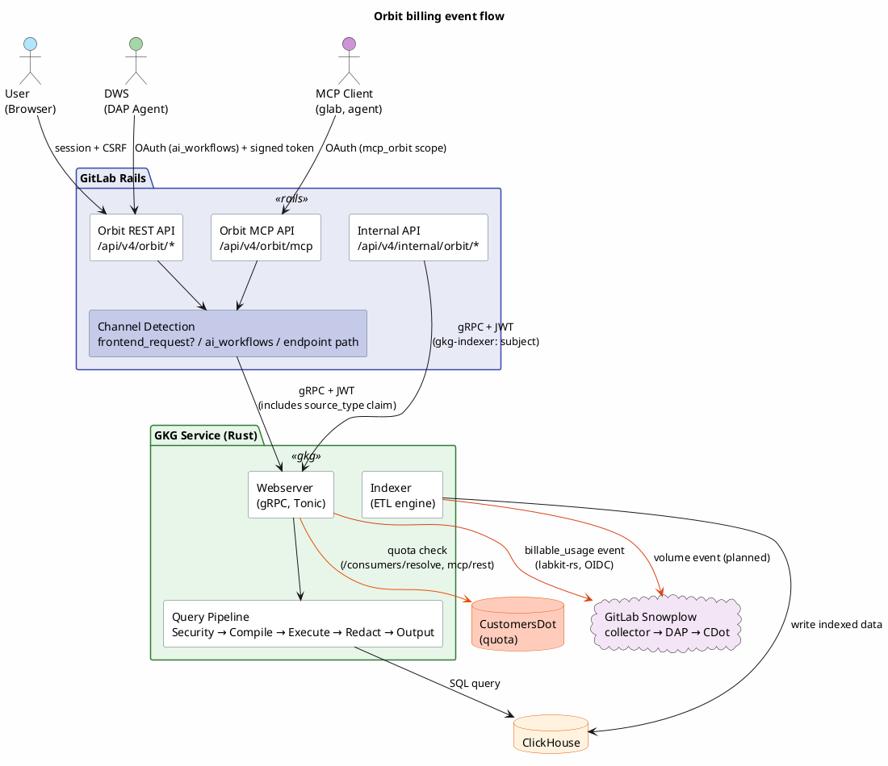
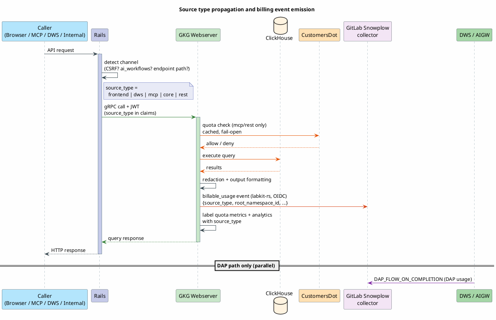
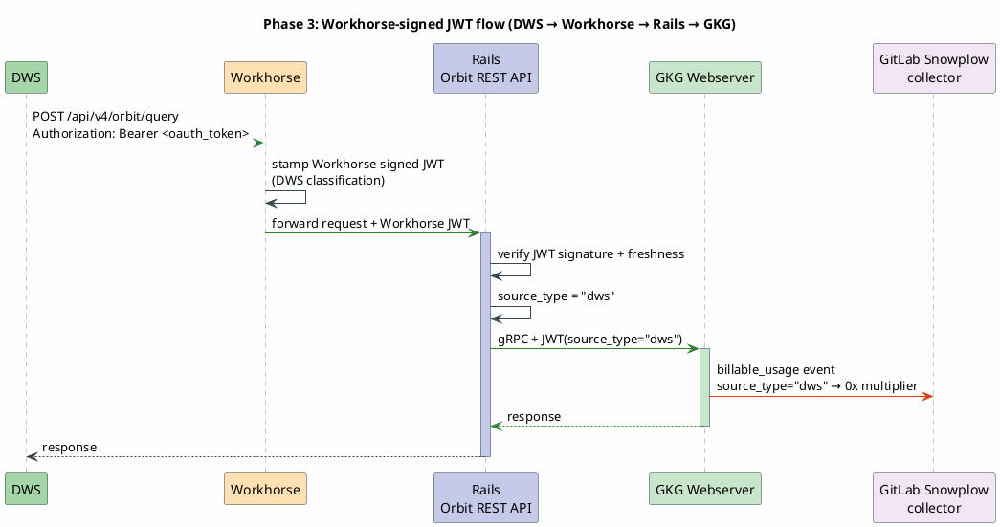
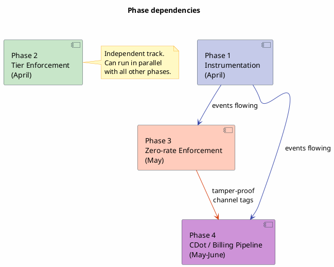

# ADR 007: Orbit monetization engineering

**Date:** 2026-03-26
**Last updated:** 2026-06-26
**Author:** `@michaelangeloio`, `@snachnolkar`
**Status:** Draft
**Epic:** [GKG Monetization Engineering (&21198)](https://gitlab.com/groups/gitlab-org/-/epics/21198)
**Parent Epic:** [GKG Core Development Workstream &20357](https://gitlab.com/groups/gitlab-org/-/epics/20357)
**Related:**

- [ADR 006: Orbit + DAP integration (MR !709)](https://gitlab.com/gitlab-org/orbit/knowledge-graph/-/merge_requests/709)
- [GKG Instrumentation for Usage Billing epic &20762](https://gitlab.com/groups/gitlab-org/-/epics/20762)
- [Zero-rating meeting notes (2026-03-11)](https://docs.google.com/document/d/1JbzhTtlF4rDMhmIjNkmDwLQyLovRmDlaGprw5yc-rOw)
- [GA Launch Super Document](https://docs.google.com/document/d/1UD5E_53bMfX6IYRVu41KGZ7NGh-wObXrOA0EizI_d0U)

---

## 1. Context

Orbit has four consumption channels with different billing models per deployment type:

| Channel | .com / Dedicated (GitLab-hosted) | Self-managed / customer-hosted |
|---------|----------------------------------|-------------------------------|
| **DAP (DWS)** | Zero-rated (bundled with Duo seat) | Included* |
| **Frontend (Dashboard)** | Included in license | Included in license |
| **Core (Internal)** | N/A (infrastructure) | N/A (infrastructure) |
| **External (MCP, glab CLI)** | Metered per-query via Credits | Included* |

> **Note:** Pricing model for self-managed and customer-hosted Dedicated is subject to change. Phase 1 instrumentation covers all deployments so the billing pipeline can be extended if needed.

---

## 2. Decision

Split monetization into four phases. Phases 1 and 2 run in parallel from the start. Phase 3 depends on Phase 1. Phase 4 depends on both.

1. **Instrumentation** (April): propagate source type from Rails to GKG via JWT claims, wire the GKG webserver to emit billable events via `labkit-rs` (OIDC-authenticated Snowplow), and add a pre-execution CustomersDot quota check. No AIGW work.
2. **Tier enforcement** (April, parallel): gate all Orbit endpoints behind `licensed_feature_available?(:orbit)` for Premium/Ultimate.
3. **Zero-rate enforcement** (May): a signed service token (Workhorse-signed JWT) on DWS calls to tamper-proof the channel tag on .com and GitLab-hosted Dedicated.
4. **CDot billing pipeline** (May to June): flat-rate multiplier pricing in CDot and a credits dashboard. Zero-rating is applied by the `source_type` multiplier on the GKG event, so no separate DAP-side flag is needed.

Rails does not emit billing events. It acts as a proxy. Billing events are emitted by the service that executes the work: the GKG webserver emits the per-query billable event, and the indexer emits volume events where GB-based pricing applies.

### Alternatives considered

**Emit billing events from Rails instead of GKG.** Rejected because Rails is a proxy. The GKG webserver has the actual execution data (latency, result count before redaction, cache hits) that Rails doesn't see. Emitting from GKG also aligns with the billing service connection pattern being built for other Rust/Go services.

**Suppress billing events for zero-rated channels instead of using multipliers.** Rejected per the zero-rating meeting. Fulfillment requires every access to emit an event. Zero-rating is a CDot-side multiplier, not event suppression.

**Use `ai_workflows` OAuth scope alone for zero-rate enforcement.** Insufficient. A user can extract the token from browser dev tools (valid 2 hours) and call the API directly. Good enough for Phase 1 analytics, but Phase 3 adds a signed service token for tamper-proof billing.

**Use correlation IDs to zero-rate GKG billing events.** Rejected for billing purposes. The idea was to link the DAP billing event and the GKG billing event by correlation ID so CDot could suppress the GKG charge when it sees a matching DAP event. At the [zero-rating meeting](https://docs.google.com/document/d/1JbzhTtlF4rDMhmIjNkmDwLQyLovRmDlaGprw5yc-rOw), Fulfillment confirmed: *"We don't support that currently. We have a CorrelationId field but we use it for logging/tracing purposes only."* Each billing event must stand alone with its own `source_type` to determine its multiplier. Correlation IDs are still propagated end-to-end for observability and tracing (Rails → GKG via gRPC metadata, as they are today), just not used for billing decisions.

**Do quota checks in Rails instead of GKG.** Considered since Rails already has CDot subscription data via `ServiceAccessToken`. Rejected because GKG already owns billable-event emission and integrates with CustomersDot, so it can run the quota check itself. Doing the check in GKG keeps the billing logic co-located with the service that executes queries and avoids adding latency to the Rails proxy layer. This also matches AIGW's pattern where the executing service (not the proxy) owns quota enforcement.

**Use Cloud Connector IJWTs for GKG auth.** Not needed for the Rails→GKG gRPC connection (co-located, HS256 shared secret is fine). Cloud Connector is designed for SM/Dedicated instances reaching GitLab-operated cloud services over the internet. GKG runs alongside the GitLab instance, not as a centralized cloud service. However, for GA, registering `orbit_query` as a [unit primitive](https://docs.gitlab.com/ee/development/cloud_connector/architecture.html) in `gitlab-cloud-connector` is the right path if Orbit becomes a separately purchasable add-on. This would let CDot control Orbit access via subscription status and is additive to the current approach.

---

## 3. Architecture overview



## 4. Consumption matrix

Four channels, each with different auth and billing per deployment type:

| Channel | Request path | Auth | .com / Dedicated (GitLab-hosted) | Dedicated (customer-hosted) | Self-managed |
|---------|-------------|------|----------------------------------|----------------------------|--------------|
| **DAP (DWS)** | User → Rails → DWS → Rails → GKG | OAuth (`ai_workflows` scope) + signed service token (Phase 3) | Zero-rated (bundled with Duo seat) | Included (seat-based) | Included (GB-based fee) |
| **Frontend (Dashboard)** | User → Rails → GKG (gRPC) | User JWT (HS256) | Included in license | Included in license | Included in license |
| **Core (Internal)** | Rails service → GKG | System JWT (HS256) | N/A (infrastructure) | N/A (infrastructure) | N/A (infrastructure) |
| **External (MCP, glab CLI)** | Agent → Rails OAuth → GKG | OAuth + User JWT | Metered per-query via Credits | Metered per-query via Credits | Included (GB-based fee) |

On .com and GitLab-hosted Dedicated, DAP usage is zero-rated while MCP/CLI usage is charged. The signed service token (Phase 3) prevents users from spoofing DAP origin to get free queries. On self-managed and customer-hosted Dedicated there is no per-query billing today, so the distinction is analytics-only.

**Note on self-managed and customer-hosted Dedicated pricing:** The billing model for these deployments (currently seat-based and GB-based respectively) is subject to change. The instrumentation in Phase 1 captures usage data on all deployments regardless of billing model, so if pricing changes later the data pipeline is already in place.

### Billing event emission points

Rails does **not** emit billing events. It acts as a proxy only. Billing events are emitted from the services that actually execute the work:

| Emitter | What it captures | Transport | Notes |
|---------|-----------------|-----------|-------|
| **GKG webserver** (Rust) | Every query execution: source type, query type, namespace, execution metrics | Snowplow `billable_usage` event via `labkit-rs`, OIDC-authenticated ([orbit/kg#307](https://gitlab.com/gitlab-org/orbit/knowledge-graph/-/issues/307)) | Source of truth for per-query billing. Receives `source_type` from Rails via JWT claims. The `gkg-billing` crate builds and emits the event; the single `Claims` to `BillingInputs` conversion lives at `crates/gkg-server/src/billing_adapter.rs`. |
| **GKG indexer** (Rust) | Indexing volume: entities indexed, bytes written, namespace | Same `labkit-rs` Snowplow path (planned) | Drives GB-based pricing on self-managed. `EngineMetrics` already tracks `destination_rows_written` and `destination_bytes_written`. |
| **AIGW/DWS** (Python) | DAP usage, independent of Orbit | Snowplow `BillingEventsClient` (`iglu:com.gitlab/billable_usage/jsonschema/1-0-2`) | Emits the existing `DAP_FLOW_ON_COMPLETION` event as usual. It does not annotate GKG calls. GKG-from-DAP metering is the `source_type = 'dws'` GKG event, zero-rated by multiplier. |

### Billing event transport (orbit/kg#307)

GKG emits billable events as Snowplow structured events through `labkit-rs` (the `labkit_events` tracker). The tracker authenticates to the GitLab Snowplow collector with OIDC tokens minted from the workload identity, so no static egress IP allowlist is required. Each event carries the `iglu:com.gitlab/billable_usage/jsonschema/1-0-2` self-describing context. Downstream, the Data Insights Platform ingests the events and CustomersDot's hourly mediation processes them. The OIDC support in `labkit-rs` is tracked in [orbit/kg#307](https://gitlab.com/gitlab-org/orbit/knowledge-graph/-/issues/307).

For the equivalent OIDC pattern in Go, see the [labkit-go proof of concept](https://gitlab.com/gitlab-org/analytics-section/platform-insights/core/-/work_items/98#note_3108588468) and the [server-side validation MR](https://gitlab.com/gitlab-org/analytics-section/platform-insights/core/-/merge_requests/106).

The collector path is OIDC-authenticated rather than IP-allowlisted because GKG has no static egress IPs.

### Source type propagation

Rails determines the caller channel and passes it to GKG via JWT claims. GKG uses this to tag its billing events, gate its quota check, and label its quota metrics and analytics context:



### JWT claims change

`source_type` is propagated exclusively via JWT claims and is **not** added to the gRPC proto message body. This is intentional: the JWT is signed by Rails with the shared HS256 secret, so GKG can trust the value. An unsigned proto field in the request body would carry no trust guarantee and could be spoofed by any caller.

```rust
// In crates/gkg-server/src/auth/claims.rs
pub struct Claims {
    // ... existing fields ...
    pub source_type: SourceType,        // required claim; tokens without it are rejected
    pub root_namespace_id: Option<i64>, // governing namespace for billing attribution
}

pub enum SourceType {
    Frontend, Dws, Mcp, Core, Rest, CodeIntelligence,
}
```

Rails sets `source_type` when constructing the JWT before calling GKG. GKG reads it from the validated token and uses it for:

1. Billing events: carried on the `billable_usage` event (as `feature_qualified_name = orbit_{source_type}`) sent to the Snowplow collector
2. Quota: only `mcp` and `rest` are metered; other channels bypass the check
3. Metrics and analytics: labels the `gkg.billing.quota.*` metrics and the `orbit_query` analytics context

---

## 5. Phase 1: Instrumentation (minimal viable data collection)

**Goal:** Propagate caller source type from Rails through gRPC to GKG. Wire up the GKG webserver to emit billable events via `labkit-rs` (OIDC-authenticated Snowplow). Add a pre-execution CustomersDot quota check, and label the billing and quota metrics with source type. No AIGW work in this phase.

**Depends on:** Nothing (can start immediately)
**Blocks:** Phase 3 (zero-rating), Phase 4 (CDot billing pipeline)
**Owner:** GKG team (@michaelangeloio, @bohdanpk, with @nbelokolodov for Rust Snowplow SDK)

### 1.1 Four instrumentation layers

| Layer | Service | What it does | Billing-relevant? |
|-------|---------|-------------|-------------------|
| A. Source type propagation | Rails → GKG | Rails detects caller channel via OAuth scope and passes `source_type` to GKG in JWT claims. | Prerequisite. GKG needs this to tag billing events. |
| B. GKG billable events | GKG webserver | Emits Snowplow `billable_usage` events via `labkit-rs` (OIDC). Carries source type, namespace, and execution metadata. | Yes, billing source of truth. |
| C. source_type on metrics | GKG webserver | Labels the billing and quota metric families (`gkg.billing.*`) and the `orbit_query` analytics context with `source_type`. | Operational, for Grafana dashboards. |
| D. Pre-execution quota check | GKG webserver | Checks namespace quota against CustomersDot before executing a query. Cached per namespace. Returns gRPC `RESOURCE_EXHAUSTED` when credits are exhausted. | Yes, enforces credit limits for metered channels (MCP, REST). |

### 1.2 Layer A: Source type propagation (Rails → GKG)

Rails detects the caller channel and passes it to GKG via JWT claims so GKG can tag its own events.

**Channel detection (Phase 1, scope-based):**

The monolith already has the primitives to distinguish all four channels. Each signal comes from a different layer of the auth stack:

| Channel | How Rails detects it | Signal | Code location |
|---------|---------------------|--------|---------------|
| **Frontend** | CSRF token matches session | `Gitlab::RackAttack::Request#frontend_request?` checks `HTTP_X_CSRF_TOKEN` against `session[:_csrf_token]` via `Gitlab::RequestForgeryProtection.verified?`. If the API request has a valid CSRF token, it came from the browser. | `lib/gitlab/rack_attack/request.rb:285-292` |
| **MCP** | Request hit the MCP endpoint | The MCP path (`/api/v4/orbit/mcp`) is a separate Grape class (`API::Orbit::Mcp`) with `allow_access_with_scope :mcp_orbit`. If we're in the MCP handler, it's MCP by definition. No scope check needed at the channel detection layer. | `ee/lib/api/orbit/mcp.rb` |
| **DWS/DAP** | OAuth token has `ai_workflows` scope | `doorkeeper_token&.scopes&.include?('ai_workflows')`. This scope is exclusive to DWS-issued tokens (only created by `CreateOauthAccessTokenService`, `CreateCompositeOauthAccessTokenService`, `OnboardingService`). Users cannot create PATs with it. Note: this detection path will likely change in the future (Phase 3 adds a signed service token for tamper-proofing). | `lib/api/concerns/ai_workflows_access.rb` |
| **Core** | JWT with `gkg-indexer:` subject prefix | Internal API (`/api/v4/internal/orbit/`) authenticates via `Gitlab-Orbit-Api-Request` header with `expected_sub_prefix: 'gkg-indexer:'`. Separate endpoint class entirely. | `ee/lib/api/internal/orbit.rb:14-21` |
| **REST (external)** | PAT/OAuth without `ai_workflows`, no CSRF | Fallthrough: not frontend (no CSRF), not DWS (no `ai_workflows`), not MCP (different endpoint). Authenticated via PAT or standard OAuth token. | Default case |

```ruby
# In ee/lib/api/orbit/data.rb, channel detection for the REST endpoints:
def caller_channel
  if frontend_request?
    'frontend'
  elsif doorkeeper_token&.scopes&.include?('ai_workflows')
    'dws'
  else
    'rest'
  end
end

# frontend_request? leverages the existing RackAttack pattern:
def frontend_request?
  return false unless env.include?('HTTP_X_CSRF_TOKEN') && session.include?(:_csrf_token)

  Gitlab::RequestForgeryProtection.verified?(env.merge('REQUEST_METHOD' => 'POST'))
end
```

MCP and Core don't need `caller_channel` in their endpoints because the channel is implicit in the endpoint class itself. The MCP handler always sets `source_type = 'mcp'` and the internal API always sets `source_type = 'core'` when constructing the JWT for GKG.

```plantuml
@startuml
skinparam backgroundColor #FEFEFE
skinparam ActivityBackgroundColor #FFFFFF
skinparam ActivityBorderColor #546E7A
skinparam ActivityDiamondBackgroundColor #E8EAF6
skinparam ActivityDiamondBorderColor #3949AB

title Channel detection logic (Phase 1)

start

if (Which endpoint class?) then (Orbit::Mcp)
  :source_type = "mcp"; <<#CE93D8>>
  stop
elseif (Internal::Orbit) then
  :source_type = "core"; <<#B0BEC5>>
  stop
else (Orbit::Data)
endif

if (frontend_request?\nCSRF token matches session?) then (yes)
  :source_type = "frontend"; <<#B3E5FC>>
elseif (doorkeeper_token has\nai_workflows scope?) then (yes)
  :source_type = "dws"; <<#A5D6A7>>
else (no)
  :source_type = "rest"; <<#FFE0B2>>
endif

:set claims[:source_type] in JWT; <<#E8EAF6>>
:call GKG via gRPC; <<#C8E6C9>>
stop

@enduml
```

**On `ai_workflows` scope.** This is good enough for Phase 1 analytics. A user could extract the token from browser dev tools (valid 2 hours) and call the API directly, but this is negligible for usage data. The scope detection will likely not be the long-term path; Phase 3 adds signed-token verification for tamper-proof channel tagging.

**JWT construction.** Each endpoint class sets `source_type` when building the JWT for the GrpcClient:

```ruby
# In the GrpcClient, when constructing JWT claims:
claims[:source_type] = caller_channel  # "frontend", "dws", "mcp", "core", "rest"
```

### 1.3 Billing attribution: namespace selection

GKG queries have no per-request namespace context. Every query scopes across all top-level namespaces the user can access, so the JWT's `root_namespace_id` claim cannot be inferred from the request body and must be resolved by Rails before the call.

**Decision.** Introduce a per-user preference `knowledge_graph_governing_namespace_id`. Do not reuse `duo_default_namespace_id`.

**Alternatives considered:**

- *Generalize `duo_default_namespace_id`.* Rejected. Duo's setting carries governance semantics (tool policies, AI controls) that GKG doesn't inherit.
- *Infer per-request namespace.* Rejected. Architecturally infeasible: every GKG query is global across all of the user's top-level namespaces by design.

**Candidate logic.** Namespaces where the user is a member AND the namespace has a Premium or Ultimate plan.

**Block-on-null behavior.** MCP and REST queries return a structured error pointing the user to the setting when `knowledge_graph_governing_namespace_id` is null and the user has more than one eligible namespace. Auto-set silently when exactly one candidate exists.

**UX surface.** User Preferences (`/-/profile/preferences`), placed alongside the Duo default namespace selector. Visible only when the user has more than one eligible Orbit namespace.

**JWT wiring.** Rails resolves `knowledge_graph_governing_namespace_id` server-side per request and sets `claims.root_namespace_id` before calling GKG. GKG continues to consume only the signed JWT claim, with no untrusted body field.

**Accepted trade-off.** All GKG events bill to the governing namespace even when the user queries content owned by other namespaces.

See [orbit/knowledge-graph#471](https://gitlab.com/gitlab-org/orbit/knowledge-graph/-/work_items/471) for the full discussion.

### 1.4 Layer B: GKG billable event emission

GKG emits billable events as Snowplow `billable_usage` events through `labkit-rs`, authenticated with OIDC ([orbit/kg#307](https://gitlab.com/gitlab-org/orbit/knowledge-graph/-/issues/307)).

**Webserver events.** Emitted after each successful query execution by the `BillingObserver` in the `gkg-billing` crate. The single `Claims` to `BillingInputs` conversion is the SOX seam at `crates/gkg-server/src/billing_adapter.rs`. The event carries:

| Field | Source | Notes |
|-------|--------|-------|
| `realm` | JWT claims | `saas` or `self_managed` |
| `user_id` / `global_user_id` | JWT claims | caller identity |
| `root_namespace_id` | JWT claims (governing namespace) | billing attribution on SaaS |
| `organization_id` | JWT claims | attribution |
| `instance_id` / `unique_instance_id` | JWT claims | attribution on self-managed and Dedicated |
| `feature_qualified_name` | derived from `source_type` | `orbit_{source_type}`, for example `orbit_mcp` |
| `unit_of_measure`, `quantity` | constant | `request`, `1.0` per query |
| `metadata` | pipeline context | `query_type` plus execution metrics (compile and execute ms, rows) |

**Indexer events (planned for GB-based deployments).** Emitted per indexing batch from the existing `EngineMetrics` at `crates/indexer/src/metrics.rs`:

| Field | Source | Example |
|-------|--------|---------|
| `namespace_id` | Indexing context | `9970` |
| `rows_written` | `destination_rows_written` | `1500` |
| `bytes_written` | `destination_bytes_written` | `2048000` |
| `entity_type` | Indexing pipeline | `merge_request`, `issue` |

**Auth:** OIDC-authenticated Snowplow collector, not IP allowlist (GKG doesn't have static egress). Reference implementations of the OIDC pattern:

- [labkit-go PoC](https://gitlab.com/gitlab-org/analytics-section/platform-insights/core/-/work_items/98#note_3108588468)
- [Server-side validation MR](https://gitlab.com/gitlab-org/analytics-section/platform-insights/core/-/merge_requests/106)

### 1.5 Layer C: source_type on metrics and analytics

`source_type` is attached where channel breakdown matters for billing and operations: the quota metric families and the `orbit_query` analytics context.

```rust
// crates/gkg-billing/src/quota/metrics.rs: source_type labels the quota decision counters
KeyValue::new("source_type", inputs.source_type.clone());
```

This lets Grafana break quota decisions and billing volume down by channel, for example `gkg.billing.quota.decisions{source_type="mcp"}`, without depending on the downstream CDot pipeline. The core query pipeline latency metrics stay labeled by `query_type`.

### 1.6 Layer D: Pre-execution quota check

Before executing a query, the GKG webserver checks whether the namespace has remaining quota by calling CustomersDot. The result is cached per namespace to avoid a round-trip on every request. The check runs in the gRPC handler before the query pipeline.

```rust
// In the gRPC service handler, before entering the query pipeline:
self.quota.check(&QuotaCheckInputs::from(&claims)).await?;
// A denied check returns tonic::Status::resource_exhausted("GitLab credits exhausted")
```

**Cache behavior.** GKG queries CustomersDot at `/api/v1/consumers/resolve` with the CDot admin credentials, then caches the decision in a `moka` cache. The TTL comes from CDot's `Cache-Control: max-age` header (default one hour), with a small jitter so entries do not expire fleet-wide in lockstep. Both allow and deny decisions are cached; fail-open results are not.

**Fail-open vs fail-closed.** If CustomersDot is unreachable or returns an unexpected status, the query proceeds (fail-open). A billing-service outage should not block query execution.

**Which channels are checked.** Only `mcp` and `rest` source types are quota-checked (these are the charged channels). `dws`, `frontend`, and `core` are zero-rated or included, so they skip the quota check entirely.

```rust
// Skip quota check for zero-rated/included channels
let needs_quota_check = matches!(
    claims.source_type,
    SourceType::Mcp | SourceType::Rest
);
```

### 1.7 JWT claims change

`source_type` is carried exclusively in the JWT claims, and the gRPC proto (`gkg.proto`) is **not** modified. Adding `source_type` to the proto request body would create an unsigned, untrusted field that any caller could set to any value, enabling spoofing. The JWT is signed by Rails with the shared HS256 secret, so GKG can trust the claim.

`source_type` is a required field on the JWT claims struct in `crates/gkg-server/src/auth/claims.rs`:

```rust
pub struct Claims {
    // ... existing fields ...
    pub source_type: SourceType, // required; an unknown string deserializes to Rest
}
```

`SourceType` is a Rust enum defined in the GKG codebase (not generated from proto), with variants `Frontend`, `Dws`, `Mcp`, `Core`, `Rest`, and `CodeIntelligence`. Rails sets the `source_type` claim when constructing the JWT before calling GKG. GKG reads it from the validated token.

### 1.8 Validation

- **Billing events:** Confirm events arrive at the Snowplow collector from the staging GKG deployment. Verify all source types produce events. Pipeline health can be observed via the `gkg.billing.events.*` counter family: `emitted` and `delivered` should rise with query traffic while `dropped`, `rejected`, and `delivery_failed` stay at zero.
- **Metrics:** Query Prometheus for `gkg.billing.quota.decisions` broken down by `source_type` and confirm the breakdown by channel.
- **Quota check:** Verify that a namespace at quota receives gRPC `RESOURCE_EXHAUSTED` for MCP/REST queries, while DWS/frontend/core queries still succeed.

---

## 6. Phase 2: Tier enforcement (parallel to Phase 1)

**Goal:** Gate all Orbit endpoints behind `licensed_feature_available?(:orbit)` so only Premium and Ultimate customers can access Orbit features. The `:knowledge_graph` feature flag remains as a kill switch alongside tier enforcement.

**Depends on:** Nothing (can start immediately, parallel to Phase 1)
**Blocks:** Nothing (independent track)
**Owner:** GKG team (@michaelangeloio)
**Issue:** [orbit/knowledge-graph#221](https://gitlab.com/gitlab-org/orbit/knowledge-graph/-/issues/221)

### 2.1 Design

- `:orbit` is a Premium feature in `ee/app/models/gitlab_subscriptions/features.rb` (`PREMIUM_FEATURES`).
- The `:knowledge_graph` feature flag gates access at the code level and stays as a kill switch alongside the tier gate.
- Orbit endpoints enforce the tier gate through `Analytics::KnowledgeGraph::OrbitLicense.available_for?`, which checks `licensed_feature_available?(:orbit)` per top-level namespace on SaaS and the instance license on self-managed.

### 2.2 Endpoints requiring tier checks

| Endpoint | Current Auth | Add Tier Check |
|----------|-------------|----------------|
| `POST /api/v4/orbit/query` | Feature flag + user auth | `licensed_feature_available?(:orbit)` on user's root namespace |
| `GET /api/v4/orbit/schema` | Feature flag + user auth | Same |
| `GET /api/v4/orbit/tools` | Feature flag + user auth | Same |
| `POST /api/v4/orbit/mcp` | Feature flag + user auth + `mcp_orbit` scope | Already has it |
| `GET /api/v4/orbit/health` | Feature flag + user auth | Same (or exempt, health checks are admin-only) |
| GraphQL `orbitUpdate` mutation | Feature flag + admin auth | Same |
| Admin namespace pages | Feature flag + admin auth | Same |

### 2.3 Implementation pattern

Use the existing `check_feature_availability!` pattern from EE APIs:

```ruby
# In ee/lib/api/orbit/data.rb, before_action or at top of each endpoint:
before do
  not_found! unless Feature.enabled?(:knowledge_graph, current_user)

  namespace = current_user_root_namespace
  forbidden! unless namespace&.licensed_feature_available?(:orbit)
end
```

For the GraphQL mutation, add a `ready?` check:

```ruby
def ready?(**args)
  raise_resource_not_available_error! unless
    namespace.licensed_feature_available?(:orbit)

  super
end
```

### 2.4 Rate limiting per tier (follow-up)

Not now. If Premium and Ultimate need different query limits later, add rate limiting via `Gitlab::ApplicationRateLimiter`. Needs a product decision on tier-specific limits first.

### 2.5 Self-managed tier enforcement

On self-managed, the license check works the same way. `licensed_feature_available?(:orbit)` checks the instance license. If the instance has a Premium or Ultimate license, Orbit is available. No per-query billing applies (SM uses GB-based platform fee).

### 2.6 Deliverables

| Issue | Deliverable | Status |
|-------|-------------|--------|
| [orbit/kg#221](https://gitlab.com/gitlab-org/orbit/knowledge-graph/-/issues/221) | Gate Orbit endpoints behind `licensed_feature_available?(:orbit)` | In place via `OrbitLicense.available_for?` |
| (follow-up) | Rate limiting per tier | Future |

---

## 7. Phase 3: Zero-rate enforcement

**Goal:** Zero-rate DAP (DWS) Orbit queries on .com and GitLab-hosted Dedicated while charging MCP/CLI queries. The Phase 1 `ai_workflows` OAuth scope is not tamper-proof (a user can extract the token and call the API directly), so this phase adds a signed service token that only the platform can mint.

**Depends on:** Phase 1 (instrumentation must be in place to emit events)
**Blocks:** Phase 4 (CDot needs the channel tag to apply the multiplier)
**Owner:** GKG team (Rails side) + AF team (DWS side)
**Issue:** [orbit/knowledge-graph#501](https://gitlab.com/gitlab-org/orbit/knowledge-graph/-/issues/501)

### 3.1 Scope

This phase only applies to **.com** and **GitLab-hosted Dedicated** where per-query Credits billing is active. On self-managed and customer-hosted Dedicated, there is no per-query billing, so zero-rating is irrelevant.

### 3.2 Workhorse-signed service token

DuoWorkflow (DWS) calls to Orbit endpoints route through Workhorse. Workhorse stamps a short-lived JWT, signed with the Workhorse-to-Rails shared secret, onto those requests. Rails validates the JWT to confirm the request genuinely came from a DWS workflow rather than a user replaying a token. The secret lives only in Workhorse and Rails, so users cannot forge it.

This reuses the existing Workhorse request-signing path in GitLab rather than provisioning a new shared secret. Workhorse already signs internal requests to Rails, so the same trust boundary carries the DWS classification.

- Stamp the JWT on DWS Orbit calls: [monolith MR !242241](https://gitlab.com/gitlab-org/gitlab/-/merge_requests/242241)
- Validate the JWT to classify the request: [monolith MR !242242](https://gitlab.com/gitlab-org/gitlab/-/merge_requests/242242)

### 3.3 Validating the token

Rails verifies the Workhorse JWT on the Orbit REST endpoints:

1. The signature matches the Workhorse-to-Rails secret.
2. The token is fresh (short expiry).
3. The claims mark the request as DWS-originated.

If valid, the request is classified as `dws` (zero-rated). If absent or invalid, the request still proceeds and is tagged as the appropriate non-DWS channel (`frontend` or `rest`).

### 3.4 Updated channel detection (replaces Phase 1 stopgap)

```ruby
# In ee/lib/api/orbit/data.rb (REST endpoints only):
def caller_channel
  if workhorse_dws_request?   # validated Workhorse-signed JWT
    'dws'
  elsif frontend_request?
    'frontend'
  else
    'rest'
  end
end
```

The Workhorse JWT check takes priority. A valid token proves the request actually came through the DWS path, not just that an `ai_workflows` token was issued. The `frontend_request?` CSRF check (same as Phase 1) identifies browser-originated requests. Everything else is external REST (PAT, standard OAuth).



### 3.5 DWS-side stamping

Workhorse adds the signed token to DuoWorkflow Orbit calls, so DWS itself does not manage a secret ([monolith MR !242241](https://gitlab.com/gitlab-org/gitlab/-/merge_requests/242241)). This keeps the secret out of the DWS application and reuses the Workhorse signing path.

### 3.6 Secret provisioning

The Workhorse-to-Rails secret already exists in every deployment that runs Workhorse, so Phase 3 introduces no new per-tenant secrets:

| Deployment | Secret |
|------------|--------|
| .com | Existing Workhorse-to-Rails secret |
| Dedicated (GitLab-hosted) | Existing per-tenant Workhorse secret |
| Self-managed | N/A (no per-query billing) |
| Dedicated (customer-hosted) | N/A (no per-query billing) |

### 3.7 Open questions

- Whether the Workhorse JWT covers every DWS entry point to Orbit, or whether some DAP flows reach Orbit by a path Workhorse does not sign.
- Token freshness and replay window relative to long-running DAP workflows.

See [orbit/knowledge-graph#501](https://gitlab.com/gitlab-org/orbit/knowledge-graph/-/issues/501) for the current design discussion.

### 3.8 Deliverables

| Issue / MR | Deliverable | Owner |
|-------|-------------|-------|
| [monolith MR !242241](https://gitlab.com/gitlab-org/gitlab/-/merge_requests/242241) | Stamp Workhorse-signed JWT on DWS Orbit calls | GKG + AF |
| [monolith MR !242242](https://gitlab.com/gitlab-org/gitlab/-/merge_requests/242242) | Validate Workhorse JWT and classify DWS requests | GKG |
| [orbit/kg#501](https://gitlab.com/gitlab-org/orbit/knowledge-graph/-/issues/501) | Tamper-proof DWS channel detection (tracking) | GKG |

---

## 8. Phase 4: CDot / usage billing pipeline

**Goal:** Wire GKG billable events (Phase 1) into CDot so MCP usage is charged via Credits and DAP usage is zero-rated. Split between Fulfillment (CDot pricing and dashboard) and GKG (event coordination).

**Depends on:** Phase 1 (GKG events must be flowing), Phase 3 (source type must be tamper-proof)
**Owner:** Fulfillment for CDot, GKG for coordination

### 4.1 Billing event structure

The billable events emitted by the GKG webserver (Phase 1) flow through Snowplow to the Data Insights Platform, and CDot's mediation processes them as follows:

| Event field | CDot use |
|-------------|----------|
| `source_type` | Determines multiplier: `dws` → 0x (zero-rated), `mcp` → 1x (charged), `frontend`/`core` → ignored |
| `root_namespace_id` | Billing attribution on .com (see [Section 1.3](#13-billing-attribution-namespace-selection) for how Rails resolves this) |
| `instance_id` | Billing attribution on Dedicated |
| `query_type` | Analytics only (not used for pricing in Phase 4) |

### 4.2 Flat-rate multiplier pricing

Per the zero-rating meeting, GKG follows the **flat-rate pricing** pattern (reference: SAST flows, [issue #592304](https://gitlab.com/gitlab-org/gitlab/-/issues/592304)). The CDot pricing entry is tracked in [issue #593193](https://gitlab.com/gitlab-org/gitlab/-/issues/593193):

- Each GKG billable event with `source_type = 'mcp'` is charged
- A flat credit multiplier is applied per event (e.g., 1 credit per query)
- Events with `source_type = 'dws'` get a 0x multiplier (zero-rated)
- Events with `source_type = 'frontend'` or `'core'` are not processed for billing

**Open question:** Credit cost per Orbit query? Product/Pricing decision, informed by Phase 1 data. Infrastructure doesn't depend on the specific number.

### 4.3 Credits dashboard

Update the credits usage dashboard to display GKG/Orbit events as a separate line item ([issue #593194](https://gitlab.com/gitlab-org/gitlab/-/issues/593194)). Users should see:

- Total Orbit queries this billing period
- Breakdown by channel (MCP = charged, DAP = zero-rated)
- Credit spend attributed to Orbit

### 4.4 Zero-rating the DAP path

A DAP workflow that calls GKG is zero-rated by the multiplier, not by suppressing or annotating events. GKG emits its own per-query `billable_usage` event tagged `source_type = 'dws'`, and CDot applies a 0x multiplier to it. The DAP completion event (`DAP_FLOW_ON_COMPLETION`) remains the billable event for DAP usage itself and is unaffected.

There is no `gkg_called` flag and no correlation-ID linking between the two events. Each event stands alone with its own `source_type`, which is what determines its multiplier. The earlier two-sided design that annotated the DAP event with `gkg_called` was dropped in favor of this.

### 4.5 Pricing multiplier registration

CDot needs a new pricing entry for GKG billable events with multiplier logic that checks `source_type`:

- `dws` → 0x (zero-rated)
- `mcp` → 1x (charged)
- `frontend` / `core` → not billed

---

## 9. Consequences

### 9.1 Phase dependencies



Phases 1 and 2 can start immediately and run in parallel.
Phase 3 depends on Phase 1 (events must exist before we worry about tagging accuracy).
Phase 4 depends on Phase 1 (events must flow) and Phase 3 (channel must be trustworthy for billing).

### 9.2 Deployment-specific impact

| Deployment | Phase 1 (Instrumentation) | Phase 2 (Tier Gating) | Phase 3 (Zero-rate) | Phase 4 (CDot) |
|------------|--------------------------|----------------------|--------------------|--------------------|
| **.com** | Yes | Yes | Yes | Yes (Credits) |
| **Dedicated (GitLab-hosted)** | Yes | Yes | Yes (per-tenant secret) | Yes (Credits) |
| **Dedicated (customer-hosted)** | Yes (analytics only) | Yes | No (seat-based pricing)* | No* |
| **Self-managed** | Yes (analytics only) | Yes | No (GB-based fee)* | No* |

> **Note:** Pricing model for self-managed and customer-hosted Dedicated is subject to change. Phase 1 instrumentation covers all deployments so the billing pipeline can be extended if needed.

### 9.3 Timeline

| Phase | Target | Parallel? |
|-------|--------|-----------|
| Phase 1: Instrumentation | April 2026 | Yes (start now) |
| Phase 2: Tier enforcement | April 2026 | Yes (start now) |
| Phase 3: Zero-rate enforcement | May 2026 | After Phase 1 |
| Phase 4: CDot billing pipeline | May-June 2026 | After Phase 1 + 3 |

---

## 10. SOX compliance

GKG billing code falls under SOX ITGC controls. The existing [SOX ITGC controls spreadsheet](https://docs.google.com/spreadsheets/d/1BGTZAriUYIubEJcVHoYqmXm7FLoqQcNiPJkylZidkeY/edit?gid=121873557#gid=121873557) covers AI Gateway, Data Insights Platform, ClickHouse, and GCP infrastructure. GKG billing code will need to be scoped into one or more of these control sets.

### Applicable ITGC controls

The controls that apply to GKG billing code fall into three categories:

**Access to Programs and Data (LA.1-LA.5).** CODEOWNERS on billing-related files, quarterly user access review of who can merge to those paths, SSO enforcement. The scoping question is whether to cover the entire GKG project or limit to CODEOWNERS entries on billing code paths. The limited approach (CODEOWNERS only) is preferred since it avoids pulling the entire GKG repo into SOX scope.

**Program Changes (PC.1-PC.3).** CODEOWNER approval required before merging billing code. Monthly audit log review to verify separation of duties (MR creator != approver) was enforced. Access to deploy to production limited to appropriate personnel.

**Computer Operations (CO.1-CO.2).** Access to modify billing-related CI jobs restricted. Job monitoring in place with documented issue resolution.

### GKG SOX compliance checklist

1. **Isolate billing code.** Billing event emission lives in a dedicated crate, `crates/gkg-billing/`, with a single `Claims` to `BillingInputs` conversion seam at `crates/gkg-server/src/billing_adapter.rs`. The authoring rules for this boundary are in `docs/dev/sox-billing-boundary.md`. This keeps CODEOWNERS scoping practical and the SOX audit surface small.
2. **Set up CODEOWNERS.** `.gitlab/CODEOWNERS` requires approval from designated billing code owners on the billing crate and the adapter seam. Satisfies PC.2 (change approval) and LA.4 (privileged access).
3. **Finalize SOX scope.** The detailed control scoping is tracked in [orbit/knowledge-graph#507](https://gitlab.com/gitlab-org/orbit/knowledge-graph/-/issues/507) and ADR 013.

---

## 11. Notes

1. **Credit cost per Orbit query.** What flat-rate multiplier for MCP queries? Needs Phase 1 data.
2. **Separate unit primitive.** Should Orbit get its own CloudConnector unit primitive (`ORBIT_QUERY`) separate from DAP? Phase 2 decision per the billing spec.
3. **Rate limits per tier.** Should Premium and Ultimate have different query rate limits? Product decision.
4. **Self-managed / customer-hosted Dedicated pricing.** The billing model for these deployments is subject to change. If SM or customer-hosted Dedicated moves to usage-based pricing, the signed-token approach needs adaptation. Not a current requirement, but Phase 1 instrumentation already captures usage data on all deployments to support this if needed.
