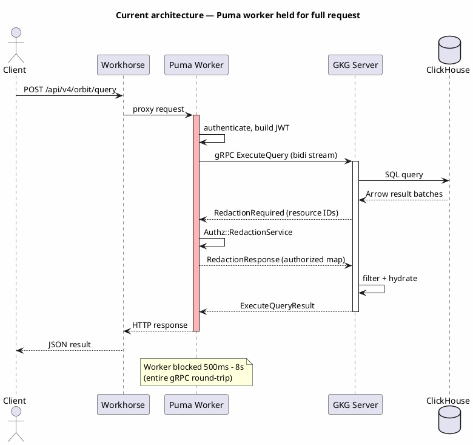
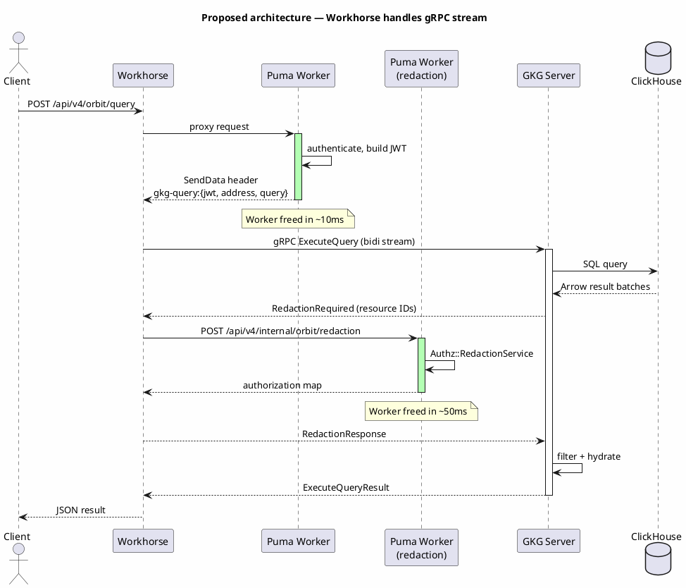
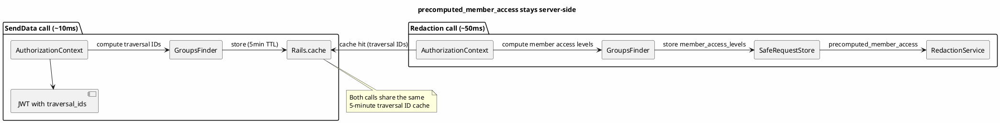

## Status

Proposed

## Date

2026-03-29

## Context

Every GKG graph query holds a Rails Puma worker for the full duration of a bidirectional gRPC stream. The request flow today looks like this:

1. The client sends `POST /api/v4/orbit/query` (or `POST /api/v4/orbit/mcp` with a `query_graph` tool call).
2. Workhorse proxies the request to Rails.
3. A Puma worker picks it up, authenticates the user, builds a JWT, and opens a bidirectional gRPC stream to the GKG Rust server.
4. GKG compiles a ClickHouse query, executes it, and sends a `RedactionRequired` message back through the stream — a batch of resource IDs that need permission checks.
5. Rails loads each resource, runs `Ability.allowed?` through `Authz::RedactionService`, and sends a `RedactionResponse` back.
6. GKG filters the results, hydrates node properties, and returns the final `ExecuteQueryResult`.
7. The Puma worker writes the response and is finally released.

The entire round-trip — query compilation, ClickHouse execution, redaction exchange, hydration — keeps the Puma worker blocked. Median latency for basic graph queries sits around 500 ms. Larger queries (1000-row scans with redaction) reach 7–8 seconds. During load testing on staging at 1K requests per second, Puma saturation hit 70%. At 150 RPS, three failure modes appeared: gRPC deadline exceeded (503), nginx bad gateway (502), and ClickHouse OOM (400).

Puma workers are finite. Each one is a thread that cannot serve other requests while blocked on a gRPC stream. More GKG query traffic, especially from AI agent clients hitting the MCP endpoint, means more threads stuck waiting on ClickHouse and redaction round-trips.



### The MCP endpoint has the same problem

The MCP endpoint (`POST /api/v4/orbit/mcp`) handles JSON-RPC calls. When a client invokes `tools/call` with the `query_graph` tool, the handler calls `GrpcClient.execute_query` — the same bidirectional stream, the same Puma blocking. MCP uses OAuth authentication with the `mcp_orbit` scope instead of standard GitLab auth, but the gRPC layer is identical. AI agent clients will call `query_graph` repeatedly, so MCP will generate more sustained gRPC streaming load than the REST endpoint.

## Decision

Move GKG query orchestration from Rails to Workhorse using the SendData/Injecter pattern. Rails still owns authentication, feature flags, and JWT construction. Workhorse takes over the long-lived gRPC stream and calls back to Rails only for short redaction checks.

### How SendData works

This is the standard Workhorse mechanism for offloading expensive I/O from Puma. It works like this:

1. A request arrives at Workhorse, which proxies it to Rails.
2. Rails handles authentication and business logic, then sets the `Gitlab-Workhorse-Send-Data` response header with a prefix and base64-encoded parameters.
3. Workhorse intercepts the header, cancels the Rails response body, and runs the operation itself using the parameters Rails provided.

The pattern is already used for Gitaly gRPC streams (`git-changed-paths:`, `git-list-blobs:`), file downloads (`send-url:`), and dependency proxying (`send-dependency:`). This decision adds a `gkg-query:` prefix.

### Proposed architecture



Puma workers handle two short calls instead of one long one. The first (~10 ms) authenticates the user and returns connection parameters. The second (~50 ms) runs authorization checks during the redaction exchange. The gRPC stream — the expensive part — lives entirely in Workhorse, a Go process that handles concurrent connections with goroutines instead of threads.

### The GKG injecter

A new `workhorse/internal/orbit/` package implements the `senddata.Injecter` interface. Most existing injecters just read from an external source (Gitaly, a URL). This one also needs to call back to Rails mid-stream for redaction. It holds a reference to `*api.API` (same pattern as the GOB and dependency proxy modules) to make signed internal requests.

The injecter's `Inject()` method:

1. Unpacks the SendData parameters (JWT, GKG server address, query DSL, format, user ID).
2. Opens a gRPC connection to the GKG server, using a connection cache keyed by address (same pattern as `workhorse/internal/gitaly/gitaly.go`).
3. Attaches the JWT as `Authorization: Bearer <token>` in gRPC metadata.
4. Opens a bidirectional `ExecuteQuery` stream and sends the initial `ExecuteQueryRequest`.
5. Reads stream messages in a loop:
   - `RedactionRequired`: calls the internal Rails redaction endpoint, sends the authorization result back as `RedactionResponse`.
   - `ExecuteQueryResult`: writes JSON to the HTTP response.
   - `ExecuteQueryError`: writes an error response.

### What Rails sends to Workhorse

The `Gitlab::Workhorse.send_gkg_query` method (added to `lib/gitlab/workhorse.rb`) builds the SendData header:

```ruby
{
  'GkgServer' => {
    'address' => Settings.knowledge_graph.grpc_endpoint,
    'jwt'     => JwtAuth.generate_token(user: user),
    'tls'     => GrpcClient.secure_channel?(address)
  },
  'Query'     => query_json,
  'Format'    => 'raw',       # or 'llm' for MCP
  'QueryType' => 'json',
  'UserId'    => user.id
}
```

The JWT is generated during this call — `AuthorizationContext` computes traversal IDs, compacts them via a trie to a maximum of 500 entries, and caches the result in `Rails.cache` for 5 minutes.

### Internal redaction endpoint

A new endpoint at `POST /api/v4/internal/orbit/redaction` handles the mid-stream authorization callback from Workhorse.

**Request:**

```json
{
  "user_id": 123,
  "resources": [
    { "resource_type": "project", "resource_ids": [1, 2, 3], "ability": "read_project" },
    { "resource_type": "merge_request", "resource_ids": [10, 20], "ability": "read_merge_request" }
  ]
}
```

**Response:**

```json
{
  "authorizations": [
    { "resource_type": "project", "authorized": { "1": true, "2": false, "3": true } },
    { "resource_type": "merge_request", "authorized": { "10": true, "20": true } }
  ]
}
```

This endpoint is authenticated via the Workhorse shared secret (`Gitlab-Workhorse-Api-Request` header). It loads the user, calls `Authz::RedactionService`, and returns the authorization map. The endpoint enforces the same limits the current in-process redaction uses: resource types are restricted to the set `Authz::RedactionService` supports, and the total number of resource IDs per request is bounded to prevent abuse.

### Handling `precomputed_member_access` at scale

The `precomputed_member_access` interface (a `Hash<namespace_id, access_level>` from the redaction preloading work) maps every namespace a user can access to their maximum access level. On large instances this hash can have millions of entries. It cannot be serialized across the Workhorse-to-Rails HTTP boundary.

Instead, the computation stays entirely within the Rails redaction request:



1. During the SendData call, `AuthorizationContext` computes traversal IDs and caches them in `Rails.cache` (5-minute TTL). The JWT embeds the compacted traversal IDs (max 500).
2. During the redaction call, `AuthorizationContext` hits the same cache. `GroupsFinder` runs and populates `member_access_levels` into `SafeRequestStore` as a side effect. `RedactionService` reads them via `precomputed_member_access`. All of this happens within one Rails request. Nothing is serialized over the wire.

Workhorse passes only `user_id` and resource IDs.

### What does not change

- **GKG Rust code**: the gRPC protocol is identical regardless of whether the client is Rails or Workhorse. JWT format, metadata keys, stream message types, and the redaction handshake remain unchanged.
- **Proto definition**: `gkg.proto` is compiled for Go and added to the Workhorse codebase. The proto itself does not change.
- **Unary RPCs**: `GetGraphSchema`, `ListTools`, and `GetClusterHealth` are fast unary calls that do not hold Puma workers for extended periods. They stay in Rails.
- **GKG query pipeline**: the SecurityStage → CompilationStage → ClickHouseExecutor → ExtractionStage → AuthorizationStage → RedactionStage → HydrationStage → OutputStage pipeline runs identically.

### Scope

| Endpoint | In scope | Reason |
|----------|----------|--------|
| `POST /api/v4/orbit/query` | Yes | Bidirectional streaming, main query path |
| `POST /api/v4/orbit/mcp` (`query_graph` tool) | Yes | Same streaming, AI agent traffic |
| `GET /api/v4/orbit/schema` | No | Unary RPC, sub-100ms |
| `GET /api/v4/orbit/tools` | No | Unary RPC, sub-100ms |
| `GET /api/v4/orbit/status` | No | Unary RPC, sub-100ms |

### Rollout

The existing `knowledge_graph` feature flag already gates all Orbit endpoints. The Workhorse path is enabled under the same flag — no additional feature flag is needed. When disabled, the existing synchronous Rails flow runs unchanged.

## Why not the alternatives

### Keep the synchronous Rails flow and optimize redaction further

The redaction preloading work reduced SQL queries from 348 to 5 for 100 projects. That is a real improvement, but redaction is still the primary bottleneck — it accounts for the majority of the end-to-end latency in large queries. Moving the stream to Workhorse does not make redaction faster. What it does is free the Puma thread while the slow parts run (ClickHouse execution, redaction exchange, hydration), so other Rails requests are not starved. Both optimizations are needed: faster redaction reduces total latency, Workhorse offloading reduces thread utilization.

### GOB-style proxy (Workhorse intercepts the route directly)

The GOB (GitLab Observability Backend) proxy pattern has Workhorse intercept the route before it reaches Rails, make an internal auth call, then proxy to the upstream service. This would work, but it requires a separate internal authorization endpoint and duplicates the feature flag and permission checks that already exist in the Rails API layer. SendData is simpler: the request still goes through Rails first, so auth, feature flags, and JWT construction happen in the existing code path. Workhorse only takes over for the gRPC I/O.

### Replicate authorization in GKG

Replicating the full Rails permission model (group hierarchies, custom roles, SAML, organization membership) in the Rust service would eliminate the redaction callback entirely. But that means rebuilding `DeclarativePolicy`, keeping permission data synchronized, and maintaining two authorization implementations. Two implementations means two places for authorization bugs to hide. GKG should not own authorization.

### Async job queue (Sidekiq) with polling

Instead of holding the HTTP connection, Rails could enqueue a Sidekiq job for the GKG query, return a job ID, and have the client poll for results. This eliminates Puma blocking but introduces polling latency, job queue contention, and a more complex client contract. The Workhorse approach keeps the request-response model that clients already use.

### Expose GKG directly (future consideration)

Longer term, it may make sense to expose the GKG query endpoint directly to clients without going through Workhorse or Rails at all. This would require GKG to handle its own authentication and authorization, which is out of scope for this ADR. The Workhorse approach is the right intermediate step — it removes the Puma bottleneck while keeping authorization in Rails.

## Consequences

**What improves:**

- Puma workers are freed in ~10 ms instead of 500 ms-8 s. On staging, this would have prevented the 70% saturation we saw at 1K RPS.
- GKG query volume can scale independently of Puma worker pool size.
- MCP clients (AI agents) can make frequent `query_graph` calls without starving other Rails endpoints.
- The approach reuses the same SendData pattern Workhorse already uses for Gitaly gRPC streams.
- The internal redaction endpoint makes the authorization contract explicit and testable in isolation.

**What gets harder:**

- Debugging now spans three processes (Workhorse to GKG, Workhorse to Rails) instead of two (Rails to GKG). Correlation IDs must propagate through all three legs.
- The GKG proto needs to be compiled for Go and kept in sync with the Rust source. Proto changes require updating both the Rust server and the Go client.
- The bidirectional stream handling is more complex than existing injecters (which use server-streaming or unary Gitaly RPCs). The mid-stream callback to Rails is new territory for Workhorse.
- The synchronous Rails code path should be removed once Workhorse acceleration is stable, to avoid maintaining two implementations long-term.

## References

- [gitlab-org/orbit/knowledge-graph#349](https://gitlab.com/gitlab-org/orbit/knowledge-graph/-/work_items/349) — Move GKG queries to Workhorse
- [ADR 001: gRPC communication protocol](001_grpc_communication.md) — The bidirectional streaming redaction exchange this ADR builds on
- `workhorse/internal/git/changedpaths.go` — Reference SendData injecter for Gitaly gRPC streams
- `workhorse/internal/gob/proxy.go` — Reference for Workhorse modules that call back to Rails
- `workhorse/internal/senddata/injecter.go` — The `Injecter` interface
- `app/services/authz/redaction_service.rb` — The authorization service called during redaction
- `ee/lib/analytics/knowledge_graph/authorization_context.rb` — Traversal ID computation and caching
