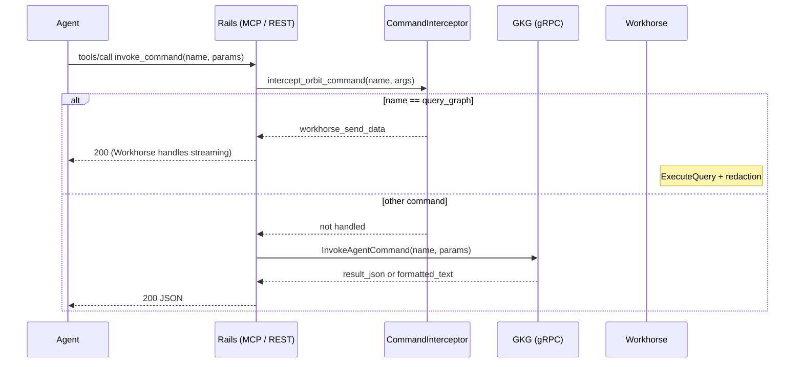

## Status

Accepted

## Date

2026-05-06

## Context

GKG already exposes an agent-facing surface in three places:

- gRPC: `KnowledgeGraphService` on the GKG server (`crates/gkg-server/proto/gkg.proto`).
- REST: `GET /api/v4/orbit/*` endpoints owned by Rails (proxy to GKG).
- MCP: `tools/list` and `tools/call` handled by Rails, fanning out to GKG.

The existing agent tools and structured endpoints were each exposed with hand-written descriptions and JSON Schema. This worked for the first agent integrations (GitLab Duo, Agentic Chat) but broke down once we tried to make the same surface usable by external coding agents (Claude Code, OpenCode, Codex):

- **Tool descriptions are truncated.** Claude Code truncates anything over ~2000 characters. The `query_graph` description embeds the full query DSL (`config/schemas/graph_query.schema.json`) so the LLM has any chance of writing a valid query, and that pushes us well over the limit. The grammar gets cut off mid-token and the agent immediately produces invalid queries.
- **Schema discovery is incomplete.** `get_graph_schema` returns node and edge metadata but does not include the descriptions on properties, so the LLM cannot tell that `definition_type` is a coarse category and that the language-specific fine-grained labels (e.g. `decorated_async_function`) live somewhere else. Agents hallucinate filter values like `definition_type = "function"` that do not exist.
- **No way to discover the response shape.** Coding agents that compose Python or shell pipelines on top of `query_graph` need the response JSON Schema and its semver to write iteration code. Today that schema lives in `config/schemas/query_response.json` and is not exposed by any RPC or REST endpoint.
- **Every new capability requires a Rails MR.** Rails owns the MCP tool catalog, the REST routes, and the gRPC client. Adding a new tool means changes in three repositories with three review queues. We have moved at one tool every few months, when we want to be moving multiple times per week as agents surface new usability bugs.
- **`query_graph` cannot move into the GKG executor.** `query_graph` goes through GitLab Workhorse for streaming and JWT-scoped redaction. It relies on Rails-only context that the GKG executor does not have.

The team converged on the [lazy-mcp pattern](https://gitlab.com/gitlab-org/ai/lazy-mcp) — a discovery and invocation tool pair that lets a single MCP entry point expose an arbitrary catalog of typed sub-commands. We already use lazy-mcp internally and trust the pattern. The decision is to apply the same pattern to GKG's agent surface, with one wrinkle: commands that need Rails context must still be intercepted by Rails before reaching the GKG executor.

## Decision

Adopt a two-tool MCP surface (`list_commands`, `invoke_command`) backed by a typed command registry in GKG. Rails intercepts the commands that depend on Rails-only behavior; everything else dispatches directly to GKG.

### Surface in each layer

The agent-facing surface collapses to two MCP tools and two REST endpoints. The structured query and schema tools become commands behind that surface. The structured REST endpoints (`/api/v4/orbit/query`, `/schema`, `/graph_status`, `/tools`) stay in place so the GitLab UI and existing programmatic consumers do not break.

| Layer | Surface |
|---|---|
| MCP `tools/list` | Returns only `list_commands` and `invoke_command` |
| MCP `tools/call` | Routes through `invoke_command` |
| REST (agent) | `GET /api/v4/orbit/agent/list_commands`, `POST /api/v4/orbit/agent/invoke_command` |
| REST (UI / programmatic) | `GET /api/v4/orbit/{query,schema,graph_status,tools,status}` (unchanged) |
| GKG gRPC | `ListAgentCommands`, `InvokeAgentCommand` (new); plus `GetQueryDsl`, `GetResponseFormat` (new), and the existing `ExecuteQuery`, `GetGraphSchema`, `GetGraphStatus`, `ListTools`, `GetClusterHealth` |

The new agent REST endpoints sit under `/orbit/agent/*` and are marked `hidden: true` in Grape. That namespace is the agent-only contract: GKG can change the command catalog at any time without breaking dashboards or hand-written API clients, because dashboards are expected to use the structured `/orbit/{query,schema,...}` endpoints.

### Command catalog

The command registry lives in the GKG server at `crates/gkg-server/src/tools/registry.rs` (`CommandRegistry`). Each command has a name, a short description, and a JSON Schema for its parameters — the same `ToolDefinition` shape we already use for MCP tools.

Initial catalog:

| Command | Where it executes | Why |
|---|---|---|
| `query_graph` | Rails interceptor builds `workhorse_send_data`; Workhorse calls GKG `ExecuteQuery` | Needs Workhorse streaming and the bidirectional redaction exchange |
| `get_graph_schema` | GKG executor (`InvokeAgentCommand`) | Pure ontology lookup, no Rails context required |
| `get_query_dsl` | GKG executor (`InvokeAgentCommand`) | Returns `config/schemas/graph_query.schema.json` and `config/QUERY_DSL_VERSION` (RAW) or a versioned TOON-condensed grammar (LLM) |
| `get_response_format` | GKG executor (`InvokeAgentCommand`) | Returns the response JSON Schema and its semver from `RAW_OUTPUT_FORMAT_VERSION` |

The two new commands (`get_query_dsl`, `get_response_format`) directly answer the discovery problems that motivated this ADR:

- `get_query_dsl` decouples the DSL grammar from the `query_graph` tool description. Agents that hit truncation can still fetch the full grammar on demand, along with `QUERY_DSL_VERSION`. Direct API consumers can use the `GetQueryDsl` RPC or a REST endpoint such as `GET /api/v4/orbit/dsl`; MCP agents use the command catalog and `InvokeAgentCommand`.
- `get_response_format` returns the JSON Schema for the formatter output plus the matching `RAW_OUTPUT_FORMAT_VERSION`. Coding agents that build Python iteration on top of `query_graph` get an authoritative shape they can pin against.

Both new commands accept a `format: raw | llm` parameter, mirroring `get_graph_schema`. RAW returns the verbatim JSON Schema; LLM returns a TOON-condensed form to save tokens.

### Command flow

Two control points keep this safe:

1. **Rails interceptor (`Analytics::Orbit::CommandInterceptor`).** Sits in front of the GKG dispatch. For `query_graph` it builds the Workhorse send-data. It returns an `InterceptResult { handled, result, workhorse_send_data }` so the caller can tell whether the command was consumed.
2. **GKG executor guard (`ExecutorError::InterceptedCommand`).** `ToolService::resolve_command` matches on `query_graph` and returns `InterceptedCommand`, which the gRPC handler maps to `FAILED_PRECONDITION`. If a misconfigured Rails ever forwards an intercepted command, GKG refuses rather than executing without the Rails context.

### `list_commands` and `invoke_command` shape

`list_commands` accepts an optional `command_names` array and returns a slice of the registry. `invoke_command` requires `command_name` and accepts a generic `parameters` object that GKG validates against the registered schema.

The MCP wrapper (`API::Orbit::McpHandlers::CallTool`) advertises either the legacy tool set or the new `list_commands`/`invoke_command` pair, controlled by a feature flag (see [Feature flag rollout](#feature-flag-rollout)). Agents discover the command catalog by calling `list_commands` once at the start of a session.

### Discovery and invocation contract for agents

The ai-assist Orbit agent prompt encodes the contract that agents are expected to follow ([!5446](https://gitlab.com/gitlab-org/modelops/applied-ml/code-suggestions/ai-assist/-/merge_requests/5446)):

1. Call `orbit_list_commands` once per session.
2. Before the first query, call `orbit_invoke_command` with `command_name=get_query_dsl` and `command_name=get_graph_schema`. Do not guess node, edge, or property names from GitLab API terminology.
3. Call `orbit_invoke_command` with `command_name=query_graph` for queries.
4. On a schema-violation error, re-fetch `get_graph_schema` with the relevant node expanded before retrying.

This is the same shape as lazy-mcp: a single discovery call followed by typed `invoke_command` calls. Agents keep one mental model regardless of whether the underlying command runs in GKG, Rails, or Workhorse.

### Why two tools, not one

A single "exploration" tool with an array of capability flags was considered. The team rejected it because:

- An array of opaque keys ("schema", "dsl", "status") does not type-check the parameters for each capability. Smaller models cannot reliably reason about which fields go with which key.
- `list_commands` plus `invoke_command` matches an existing pattern (lazy-mcp) the team already trusts and external agents already know how to consume.

### Why Rails still owns `query_graph`

A radical version of this proposal would push `query_graph` into `InvokeAgentCommand` as well, removing the interceptor entirely. We did not take that step because:

- `query_graph` runs through Workhorse for streaming and for the bidirectional redaction exchange with Rails. Moving it into the GKG executor would either lose streaming (buffering large result sets in Rails) or require a parallel Workhorse path that duplicates the existing one.
The two-layer dispatch (Rails interceptor first, GKG executor as fallback) preserves this contract while still letting every other command move at GKG's pace.

### REST mirroring

We considered three options for the REST surface:

1. **Keep REST fully structured.** Stable but every new command requires a new Rails endpoint and Rails MR.
2. **Make the structured REST endpoints dynamic.** Single entry point, fully driven by the GKG registry. Rejected because the GitLab UI and any community dashboards rely on stable schemas at `/orbit/{query,schema,graph_status}`.
3. **Mirror the MCP surface under `/orbit/agent/*` and keep the structured endpoints stable.** Chosen.

`/orbit/agent/list_commands` and `/orbit/agent/invoke_command` give agents the same dynamic catalog the MCP surface gives them, and `hidden: true` documents that this namespace is agent-only and free to evolve. The structured endpoints remain the contract for the UI and for hand-written clients.

### Three-MR coordination

The agent command surface ships as three coordinated MRs:

| Repository | MR | Scope |
|---|---|---|
| `gitlab-org/orbit/knowledge-graph` | [!1252](https://gitlab.com/gitlab-org/orbit/knowledge-graph/-/merge_requests/1252) | `ListAgentCommands`, `InvokeAgentCommand`, `GetQueryDsl`, `GetResponseFormat` RPCs; `CommandRegistry`; `ExecutorError::InterceptedCommand`; `ToolService::resolve_command` |
| `gitlab-org/gitlab` | [!234925](https://gitlab.com/gitlab-org/gitlab/-/merge_requests/234925) | MCP `list_commands` / `invoke_command` handlers; query command interception; `GET /orbit/agent/list_commands`, `POST /orbit/agent/invoke_command`; gRPC client methods |
| `gitlab-org/modelops/.../ai-assist` | [!5446](https://gitlab.com/gitlab-org/modelops/applied-ml/code-suggestions/ai-assist/-/merge_requests/5446) | Orbit agent toolset switches to `orbit_list_commands` / `orbit_invoke_command`; prompt rewritten around discovery-first flow |

Order of merge:

1. GKG first, so the gRPC contract exists.
2. Rails second, so the MCP and REST surface go live.
3. ai-assist last, so the agent prompt switches to the new surface only after Rails is shipping it.

The new MCP tool list (`list_commands`, `invoke_command`) lands in Rails atomically with the new gRPC client methods. Older Duo and Agentic Chat clients that talk to MCP keep working through the same `tools/call` endpoint — they just see a different tool list.

### Feature flag rollout

Rails gates the MCP tool list behind a feature flag (`orbit_mcp_command_tools`). The flag controls which tools `tools/list` returns:

| Flag state | MCP `tools/list` returns |
|---|---|
| Off (default) | Legacy tools: `query_graph`, `get_graph_schema` |
| On | New surface: `list_commands`, `invoke_command` |

The switch is atomic — an agent session sees one surface or the other, never both. Mixing legacy tools with the new command surface in the same session would confuse agents: they would see both `query_graph` as a top-level tool and as a command inside `invoke_command`, leading to unpredictable tool selection.

The structured REST endpoints (`/orbit/query`, `/schema`, `/graph_status`, `/tools`) and the new agent REST endpoints (`/orbit/agent/list_commands`, `/orbit/agent/invoke_command`) are always available regardless of flag state. The flag only affects MCP tool discovery.

Once the flag is fully rolled out and the new surface is stable, the legacy MCP tool registrations can be removed in a follow-up cleanup MR.

## Consequences

### What this enables

- **GKG-paced iteration.** New commands land with a single GKG MR. No Rails or ai-assist change is required as long as the command does not need Rails-side context.
- **Discovery for token-constrained agents.** Coding agents that truncate tool descriptions can still discover the full DSL and response shape via `get_query_dsl` and `get_response_format`.
- **Authoritative response shape.** External agents can pin against `RAW_OUTPUT_FORMAT_VERSION` and write iteration code that survives schema bumps.
- **One mental model.** Agents see the same `list_commands` / `invoke_command` flow regardless of whether the command runs in GKG, Rails, or Workhorse.

### What this requires

- **Three-repo coordination for the initial change.** The first rollout touches GKG, Rails, and ai-assist together. After that, the registry can grow in GKG alone.
- **GKG validates command parameters.** Because `invoke_command` accepts a generic JSON object, GKG must JSON-Schema-validate `parameters` against the registered command schema before executing. This shifts validation responsibility from Grape (which would have validated structured parameters per endpoint) into the GKG command executor.
- **Feature flag for clean switchover.** Rails uses `orbit_agent_command_surface` to swap the MCP tool list atomically between the legacy tools and the new `list_commands`/`invoke_command` pair. Both code paths must coexist until the flag is fully rolled out.
- **Two registries during transition.** The MR keeps `ToolRegistry` (the MCP `tools/list` source) and adds `CommandRegistry` (the lazy-mcp catalog). `ToolRegistry` is now restricted to `list_commands` and `invoke_command` plus the structured tools the existing UI still uses. We can collapse them in a follow-up once the legacy MCP tools are removed, but that is out of scope for this ADR.

### Trade-offs

- **REST agent surface is dynamic.** Hand-written clients that hit `/orbit/agent/invoke_command` are subject to schema changes without a Rails-side deprecation cycle. We accept this because the structured endpoints stay stable for non-agent consumers, and the `hidden: true` flag plus the `/agent/` prefix signal the contract.
- **Rails-intercepted commands stay opaque to GKG.** GKG cannot tell from the executor that `query_graph` ran successfully — Workhorse handles the response. Cross-cutting metrics (e.g. command-level latency histograms) need to be instrumented in Rails separately from the GKG-side metrics for the rest.
- **One extra round-trip for first-time discovery.** Agents pay one `list_commands` call per session before they can compose queries. The lazy-mcp pattern accepts this cost in exchange for fitting under MCP description budgets.

## Alternatives considered

### Single `get_graph_info` tool with capability flags

A single MCP tool that takes `{ include: ["schema", "dsl", "response_format"] }` and returns a top-level JSON object keyed by the requested capabilities. Considered and rejected during the design sync because:

- Smaller models cannot reliably map per-capability parameters (e.g. `expand_nodes` for schema, `format` for DSL) onto a flat union. Per-command JSON Schemas type-check far better.
- It does not handle `query_graph`, which needs its own parameter shape anyway. We would still end up with multiple top-level tools.

### Auto-expose every command as `/api/v4/orbit/<name>`

Auto-generate a REST endpoint per command, so REST and MCP stay one-to-one. Rejected because every new endpoint would need a fresh Rails route, Grape declaration, and would touch the API team's review queue. That defeats the goal of decoupling release cadence from Rails.

### Hypermedia / single self-describing entry point

A pure hypermedia-style API, where every response embeds links to next actions. Conceptually elegant but harder for current LLM agents to navigate compared to a flat command list with typed parameter schemas. We may revisit this as agent capabilities improve.

## References

- [GKG Tool Design Sync 2026-05-06 transcript](https://gitlab.com/gitlab-org/orbit/documentation/orbit-artifacts/-/blob/49763c824a0aebd5f390af3fb08fdf0df322fb2b/meetings/Other/GKG%20Tool%20Design%20Sync%202026-05-06.transcript.vtt)
- [GKG MR !1252: agent command RPCs and registry](https://gitlab.com/gitlab-org/orbit/knowledge-graph/-/merge_requests/1252)
- [Rails MR !234925: MCP/REST surface and command interceptor](https://gitlab.com/gitlab-org/gitlab/-/merge_requests/234925)
- [ai-assist MR !5446: agent prompt and command discovery](https://gitlab.com/gitlab-org/modelops/applied-ml/code-suggestions/ai-assist/-/merge_requests/5446)
- [lazy-mcp project](https://gitlab.com/gitlab-org/ai/lazy-mcp)
- [ADR 003: API design](003_api_design.md)
- [ADR 004: Unified response schema](004_unified_response_schema.md)
- [ADR 010: Graph status endpoint](010_graph_status_endpoint.md)
