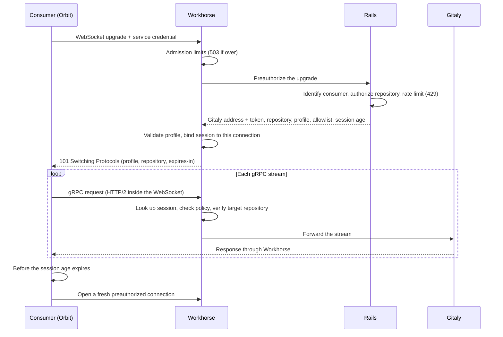

## Status

Proposed

## Date

2026-09-03

## Context

### The problem: one internal API per Gitaly RPC

Orbit reads repository content through Rails internal endpoints under
`/api/v4/internal/orbit/project/:id/`. Each endpoint fronts exactly one Gitaly
RPC: `repository/archive` wraps `GetArchive`, `repository/changed_paths` wraps
`FindChangedPaths`, `repository/list_blobs` wraps `ListBlobs`, and the
merge-request diff endpoints wrap the diff RPCs. Rails authorizes the request,
resolves which Gitaly storage holds the repository, and hands the call to
Workhorse through a `Gitlab-Workhorse-Send-Data` header. Workhorse performs the
RPC and streams the bytes back to Orbit.

Every new Gitaly RPC Orbit needs repeats the same four steps: a Rails endpoint,
a Workhorse senddata handler, an HTTP representation of the RPC's response, and
a matching client in `gitlab-client`. Each step lands in a different codebase
with its own review path, and the result is a bespoke HTTP shape that exists
only for Orbit. The pattern also holds a Puma worker for every read: an indexing
job that fetches ten archives makes ten authorized Rails requests.

### Why Orbit cannot call Gitaly directly

Orbit runs in its own Kubernetes cluster. Gitaly and Praefect are reachable only
inside the GitLab network, and the only GitLab component Orbit can reach is
Workhorse. Every read has to go through Workhorse; the question is only what
shape that path takes.

Native gRPC needs HTTP/2, and Workhorse's inbound listener does not speak it: it
is a plain HTTP/1.1 server behind a TLS-terminating edge, and no supported
topology carries HTTP/2 to it (Omnibus NGINX pins `proxy_http_version 1.1`, the
charts use `backend-protocol: HTTPS`). GitLab has routed around this before
rather than adding inbound HTTP/2: Duo Workflow bridges a bidirectional gRPC
stream over a WebSocket upgrade at `duo_workflows/ws`, and the language-server
executors moved from gRPC to WebSockets because customers who block HTTP/2 hit
gRPC failures ([gitlab-lsp#1219](https://gitlab.com/gitlab-org/editor-extensions/gitlab-lsp/-/issues/1219)).
A WebSocket tunnel is the established answer.

### What the POC established

The POC in [#1226](https://gitlab.com/gitlab-org/orbit/knowledge-graph/-/issues/1226)
tried several shapes (a framed HTTP route, a dedicated gRPC port, a reverse
tunnel over the existing Workhorse to Orbit connection) and landed on a
transparent proxy: Orbit keeps the generated Gitaly stubs, the gRPC connection
is tunneled inside a WebSocket, and Workhorse forwards any RPC without knowing
its schema, the way Praefect does. An unmodified Rust `tonic` client ran a real
code-indexing job over it against a GDK Workhorse, Praefect, and Gitaly: a
21 MB `GetArchive` with backpressure, concurrent streams, and code-graph rows in
ClickHouse at the end.

What the POC did not settle was authorization. It used a short-lived signed
grant that Orbit held and attached to each call. Review found three problems
with that model: the grant carried the Gitaly address and token, so the secret
the proxy exists to protect ended up in Orbit's hands anyway; it was a bearer
token with no caller binding and no revocation; and repository scope had to be
enforced by inspecting each request, which the POC initially got wrong (a grant
for one repository read another). This ADR is about the design that closes
those gaps.

### The pattern we do not want to copy

Other services avoid the per-RPC translation problem by having Rails hand them a
Gitaly address and token: Zoekt receives them in task payloads and KAS in its
`agent_info` response. Each consumer then dials Gitaly itself. That exposes
storage topology and credentials to every consumer, widens what a compromised
consumer can do to everything the token can reach, and couples the consumer to
Gitaly routing. Orbit lives in a separate cluster, which makes each of those
costs worse, so we rule this pattern out up front.

## Decision

Add one consumer-generic Gitaly proxy route to Workhorse, tunneling gRPC over a
WebSocket. Rails authorizes each connection before the upgrade and returns the
Gitaly coordinates plus a read-only policy. Workhorse keeps both in memory,
bound to that one connection, and enforces the policy on every gRPC stream. The
consumer speaks stock gRPC and never sees a Gitaly address or token.

### Who decides what

| Component | Decides | Never sees |
|---|---|---|
| Rails | Who the consumer is, whether it may read this repository, which profile applies, and how far to narrow it (RPC allowlist, session age, stream cap) | The proxied gRPC streams or repository bytes |
| Workhorse | Whether the named profile exists, whether each stream satisfies it, and mechanism-wide limits (connections, in-flight preauths, stream deadline) | Consumer-specific code; Rails policy arrives as data that can only narrow a profile |
| Consumer | Which transport mode to use, when to rotate connections, how to retry | Gitaly addresses, tokens, or storage routing |

Workhorse is deliberately policy-free. It knows how to enforce a profile, not
who is allowed to use one; that knowledge lives in Rails, next to the rest of
the authorization logic GitLab already has.

### A connection's lifecycle

1. **The consumer opens a WebSocket upgrade** to
   `GET /api/v4/internal/gitaly_proxy/project/:id/ws`, carrying its own
   service credential. For Orbit that is the Knowledge Graph JWT it already
   presents to Rails today. The project ID is in the path so Cells can route
   the request to the right cell.
2. **Workhorse applies its admission limits** (`max_connections`,
   `max_preauth_inflight`) and answers 503 with `Retry-After` before spending a
   Rails round trip if either is exceeded.
3. **Workhorse asks Rails to preauthorize the upgrade** through the existing
   `PreAuthorizeHandler`, the same path `duo_workflows/ws` uses. Workhorse
   forwards every header and trusts none of them.
4. **Rails decides.** It checks the mechanism kill switch, identifies the
   consumer by which registered credential header is present (exactly one, or
   401), applies a per-consumer rate limit, loads the project, and hands off to
   that consumer's authorizer. For Orbit the authorizer validates the JWT,
   checks the per-namespace rollout flag and that indexing is enabled for the
   project, runs the standard repository download check, and emits an audit
   event. On success Rails returns two things: the Gitaly connection details
   (address, token, call metadata, the same struct every senddata path uses
   today) and the policy (profile name, repository, allowed RPCs, session age,
   maximum concurrent streams).
5. **Workhorse binds the session.** It rejects an unknown or empty profile
   name with 502 before upgrading, registers a session keyed to this one
   connection, then completes the upgrade. Three response headers tell the
   consumer the profile, the repository it may read, and how long the session
   accepts new streams. The Gitaly address and token stay in Workhorse memory
   and never appear on the wire to the consumer.
6. **The consumer runs ordinary gRPC over the tunnel.** HTTP/2 rides inside the
   WebSocket, so generated stubs, streaming, status codes, and flow control all
   work unchanged. For every stream Workhorse looks up the session (a miss fails
   closed), checks the policy, peeks the first request frame to confirm the
   target repository matches the session's, and only then forwards the stream
   to Gitaly through its existing connection cache. Consumer-supplied gRPC
   metadata is dropped; only Rails' call metadata and a correlation ID go out.
7. **The consumer rotates.** Before the session age runs out it opens a fresh
   connection, which goes through steps 1 to 5 again. The old session stops
   accepting new streams and closes once its in-flight streams finish.

Because Rails answers Workhorse directly and nothing is serialized into a token
the consumer holds, there is no bearer artifact to replay, bind, or revoke, and
the Gitaly secret never leaves the GitLab deployment. Those two properties
are the whole reason for the change from the POC's grant model.

### The read-only policy

A **profile** is a named rule table compiled into Workhorse. Rails selects a
profile by name; it cannot define or loosen one. Rails can narrow the profile
per connection through the RPC allowlist and the stream cap. In v1 exactly one
profile exists, `readonly_repository`, and the design does not attempt to
specify what a second one would look like.

Two universal checks apply before any profile: the method must exist in the
Gitaly protobuf descriptors vendored into Workhorse, and it must not belong to
an excluded service. `readonly_repository` then requires, for each stream:

| Rule | Why |
|---|---|
| RPC is annotated `ACCESSOR` | Mutators are rejected even if Rails allowlists them; `CommitLanguages` is a mutator and a good example of why this cannot be left to the allowlist alone |
| RPC scope is `REPOSITORY` | Storage-scoped and server-scoped RPCs have no target repository to check against |
| Not client-streaming or bidirectional | Only the first frame is inspected; later frames could name another repository |
| No `additional_repository` field | The RPC must touch one repository |
| Exactly one `target_repository` field, and it equals the session's repository | Ambiguous targets are denied, matching Gitaly's own registry; the check covers the annotated field wherever it sits in the message |
| Quarantine directory fields are empty | Prevents reading from an object quarantine the consumer did not create |

Target-repository resolution walks the same protobuf annotation Gitaly and
Praefect use, so the proxy applies Gitaly's notion of "which repository is
this request about" rather than a hand-written field list. Gitaly maintainers
must confirm parity as part of the Workhorse core review.

Orbit's v1 allowlist is about 25 accessor RPCs across the Repository, Blob,
Commit, Diff, and Ref services. Streams keep the `gkg-indexer` client name, so
Gitaly's existing per-client limits and dashboards keep applying.

### Session lifetime

A session moves through three states: **active** (accepts new streams),
**draining** (in-flight streams finish, new ones are rejected with
`Unauthenticated: proxy: session_expired`), and **closed**. Four timers govern
it:

| Timer | Who sets it | Default | Workhorse clamp |
|---|---|---|---|
| Session age (active to draining) | Rails, per connection | 10 minutes for Orbit | 30 seconds to 1 hour |
| Stream deadline (per stream, from its start) | Workhorse config | 60 minutes | 1 minute to 4 hours |
| Idle timeout (no streams at all) | Workhorse config | 60 seconds | |
| Hard kill (safety net) | Derived | age + stream deadline + 30 seconds | |

The session age gates new streams only. It does not use grpc-go's
`MaxConnectionAge`, which force-closes the connection 30 seconds after GOAWAY
regardless of in-flight streams. With that behavior a `GetArchive` on a large
monorepo would be killed at the age boundary, the indexer would reconnect and
start from byte zero, and the largest repositories would never finish. Letting
in-flight streams run to their own deadline avoids the loop; the stream
deadline is the only thing that cuts a running read, and it is set well above
any archive we expect.

The trade-off is a revocation window. After Rails revokes access, a session
admitted just before revocation can still start streams until its age expires
(10 minutes) and each of those can run to its deadline (60 minutes): about 70
minutes worst case with Orbit's defaults. Independently of what Rails asks
for, Workhorse's clamps cap the window at two hours. Whether v1 needs an
immediate kill hook on top of this is [open question 1](#open-questions-for-the-team).

Turning off either feature flag stops new preauthorizations only; live sessions
finish under the same rules.

### Adding a consumer or an RPC

**A new consumer** registers one Rails authorizer class keyed by its own
credential header, plus an RPC allowlist and a rollout flag. The registry
refuses two authorizers on the same header and refuses shared secrets such as
the GitLab Shell header, so a consumer must have a credential nobody else
holds. No Workhorse, ingress, or Cells routing change is needed because the
route is the same for everyone. Zoekt and KAS are plausible future consumers
(both receive Gitaly credentials from Rails today); this ADR does not commit
either to adopting the proxy.

**A new RPC** for an existing consumer is a Rails allowlist change, provided the
method is already in the Gitaly descriptors vendored into Workhorse. If it is
not, the method is denied until Workhorse bumps its Gitaly module, which goes
through Workhorse maintainer review.

### Orbit as the first consumer

The indexer's archive download is the first read to move. It calls Gitaly's
`GetArchive` over the proxy instead of `repository/archive` over Rails; project
metadata still comes from Rails HTTP. A new `gitlab.gitaly_transport` setting
selects the mode:

| Mode | Behavior |
|---|---|
| `rails_http` (default) | Today's path, unchanged |
| `workhorse_ws_with_fallback` | Try the proxy; fall back to Rails when the proxy refuses to authorize or admit the connection |
| `workhorse_ws` | Proxy only |

Fallback happens only before any archive bytes have flowed: a preauth 403 or
404, an admission 503, or a policy the client does not recognize. Once a stream
has started, a cut is retried from zero over the proxy, up to three attempts
with jittered backoff, and never falls back to Rails. To make restart-from-zero
safe the archive is spooled to a temporary file before extraction, so partial
bytes from one attempt cannot reach the parser.

The client keeps one WebSocket per project session, rotates it shortly before
the session age expires, and retries a stream exactly once when the proxy
rejects it as stale. Query-time blob reads, a channel cache across projects,
and client-side admission control are deferred (see
[Non-goals and deferred work](#non-goals-and-deferred-work)).

### Feature flags

| Flag | Type | Default | Scope | Off means |
|---|---|---|---|---|
| `workhorse_gitaly_proxy` | ops | enabled | instance | Rails preauth returns 404 for every consumer; no new sessions anywhere |
| `orbit_gitaly_proxy` | rollout | disabled | root namespace | Rails preauth returns 404 for Orbit; with fallback mode on, the indexer uses Rails HTTP |

`workhorse_gitaly_proxy` is the mechanism kill switch
([rollout issue](https://gitlab.com/gitlab-org/gitlab/-/issues/627577));
`orbit_gitaly_proxy` gates the consumer per root namespace
([rollout issue](https://gitlab.com/gitlab-org/gitlab/-/issues/627576)). A
project also has to have Knowledge Graph indexing enabled for Orbit's
authorizer to say yes, which is the same gate the indexing task producer
already applies, so the proxy can never read a project the indexer would not
have been asked to index.

## Why not the alternatives

### Hand Orbit the Gitaly address and token

Rails could return the address and token to Orbit as it does for Zoekt and
KAS, and Orbit would dial Gitaly itself. It is the shortest data path, and it
does not work: Orbit's cluster cannot reach Gitaly. Even if it could, it would
put routable storage details and credentials in another cluster and make Orbit
responsible for storage routing and credential handling. The POC's signed-grant
model was a softer version of this and failed review for the same reason.

### Keep adding one Rails endpoint per RPC

The status quo. Rails authorization stays exactly where it is and nothing new
runs in Workhorse. The cost is the four-codebase dance for every RPC, an
Orbit-only HTTP dialect for each one, and one Puma request per read. The
indexer's next steps (blob reads at query time, more diff RPCs) would each add
another endpoint.

### A framed HTTP route instead of a WebSocket tunnel

The POC's first working transport: the caller POSTs a serialized request and
Workhorse streams back length-prefixed protobuf frames, generalizing the
framing `list_blobs` already uses. It needs no upgrade, but the consumer has to
hand-serialize every request and hand-parse every response instead of using
generated stubs, and it can only carry unary and server-streaming RPCs. The
tunnel gives stock gRPC ergonomics at the same edge cost.

### Add real inbound HTTP/2 to Workhorse

Native gRPC into Workhorse would make the tunnel unnecessary. It is a
coordinated edge change across Omnibus, the charts, GitLab.com, and Dedicated
that no consumer other than Orbit is asking for, and every service that needed
gRPC-shaped traffic into Workhorse so far chose a WebSocket instead. It should
be a separate platform decision if it ever comes up, not a side effect of this
one.

### Reverse tunnel over the existing Workhorse to Orbit connection

Workhorse already holds a gRPC connection to the Orbit webserver for queries
(ADR 008). Inverting it as a tunnel would avoid any new inbound route. It does
not fit the traffic: the indexer is a separate deployment that does not talk to
the webserver, so its reads would need a three-hop detour, and bulk archive
downloads would share one multiplexed connection with latency-sensitive query
lookups.

### A shared gRPC server with grpc-go connection aging

One `grpc.Server` per Workhorse process with standard `MaxConnectionAge` is
simpler than per-connection servers and a session state machine. Its grace
period terminates in-flight archives, which produces the restart loop described
under [Session lifetime](#session-lifetime).

## Open questions for the team

_Numbered list, each with a recommendation._

## Consequences

### What improves

_Placeholder._

### What gets harder

_Placeholder._

## Non-goals and deferred work

_Placeholder._

## Implementation plan

### Merge requests

_Leg / MR / depends-on table._

### Gates before staging

_Placeholder._

### Staging sizing

_Placeholder._

### Rollout

_Placeholder._

### Definition of done

_Placeholder._

## References

- [Implement Gitaly proxy in Workhorse](https://gitlab.com/gitlab-org/orbit/knowledge-graph/-/issues/1252)
- [POC: generic Gitaly proxy in Workhorse](https://gitlab.com/gitlab-org/orbit/knowledge-graph/-/issues/1226)
- [Workhorse proxy core](https://gitlab.com/gitlab-org/gitlab/-/merge_requests/253414)
- [Workhorse route, sessions, and director](https://gitlab.com/gitlab-org/gitlab/-/merge_requests/253431)
- [Rails preauthorization and authorizer](https://gitlab.com/gitlab-org/gitlab/-/merge_requests/253417)
- [Orbit client transport](https://gitlab.com/gitlab-org/orbit/knowledge-graph/-/merge_requests/2381)
- [Orbit indexer archive transport](https://gitlab.com/gitlab-org/orbit/knowledge-graph/-/merge_requests/2382)
