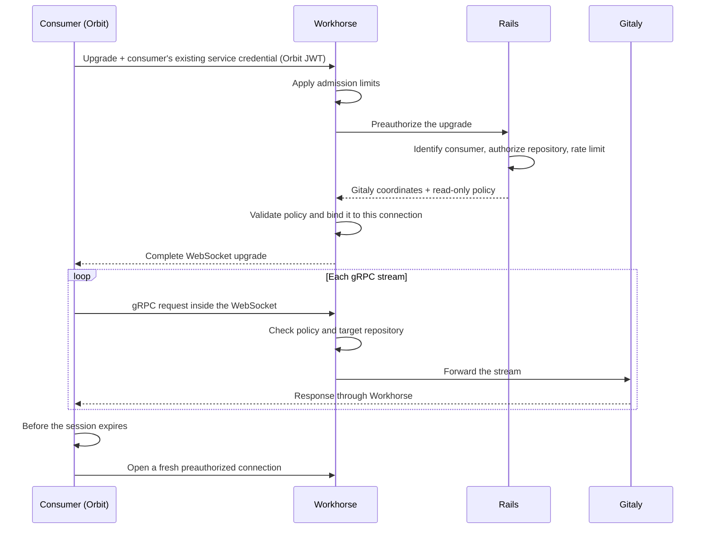

## Status

Proposed

## Date

2026-09-03

## Context

### The problem: one internal API per Gitaly RPC

Orbit reads repository content through Rails internal endpoints under
`/api/v4/internal/orbit/project/:id/`. Each endpoint fronts one Gitaly RPC. For
example, the archive endpoint wraps `GetArchive`, while other endpoints wrap
changed-path, blob, and merge-request diff RPCs. Rails authenticates and
authorizes the request, resolves the repository storage, and hands the call to
Workhorse. Workhorse performs the RPC and streams the bytes to Orbit.

Every new RPC requires a Rails endpoint, a Workhorse handler, an HTTP encoding
of the response, and a matching `gitlab-client` method. Four codebases and
review paths change to produce an endpoint with one caller. Every read is also
a full Rails request. That is acceptable for one archive per project, but once
we start reading individual blobs at query time it becomes one Puma request per
blob.

### Why Orbit cannot call Gitaly directly

Orbit runs in its own Kubernetes cluster. Gitaly and Praefect are reachable
only inside the GitLab network, while Orbit can reach Workhorse. Every read
therefore has to pass through Workhorse.

Native gRPC needs HTTP/2, which the Workhorse inbound listener does not support.
The listener receives HTTP/1.1 behind a TLS-terminating edge, and the supported
topologies do not carry HTTP/2 to it. GitLab has handled this constraint with
WebSockets before. Duo Workflow bridges a bidirectional gRPC stream over a
WebSocket, and the language-server executors moved from gRPC to WebSockets
because some customers block HTTP/2
([`gitlab-lsp#1219`](https://gitlab.com/gitlab-org/editor-extensions/gitlab-lsp/-/issues/1219)).

### What the POC established

The POC in [#1226](https://gitlab.com/gitlab-org/orbit/knowledge-graph/-/issues/1226)
compared a framed HTTP route, a dedicated gRPC port, and a reverse tunnel. It
settled on a transparent proxy: generated Gitaly stubs speak gRPC through a
WebSocket, and Workhorse forwards RPCs without knowing their schema, the way
Praefect does. An unmodified Rust `tonic` client completed a code-indexing job
through GDK Workhorse, Praefect, and Gitaly, including a 21 MB `GetArchive`,
backpressure, and concurrent streams.

## Decision

Add one consumer-generic Gitaly proxy route to Workhorse, with gRPC tunneled
over a WebSocket. Rails authorizes each connection and returns Gitaly
coordinates plus a read-only policy to Workhorse. Workhorse holds both in
memory for that connection and enforces the policy on each gRPC stream. The
consumer uses generated gRPC stubs and never sees a Gitaly address or token.

### Who decides what

| Component | Decides | Never sees |
|---|---|---|
| Rails | Consumer identity, repository access, policy selection, and limits | Proxied streams and repository bytes |
| Workhorse | Profile compilation, policy validity and enforcement, and proxy limits | Consumer-specific authorization code |
| Consumer | Transport mode, connection rotation, and retries | Gitaly addresses, tokens, and storage routing |

Workhorse does not select policies. It knows how to enforce one, not who may use
one. Rails owns that decision with the rest of the GitLab authorization logic.

### A connection's lifecycle

1. The consumer opens `/api/v4/internal/gitaly_proxy/project/:id/ws` with its
   existing service credential — for Orbit, the JWT it already uses against
   Rails. Workhorse applies admission limits and asks Rails to preauthorize the
   connection.
2. Rails identifies the consumer, authorizes the repository, and returns the
   Gitaly coordinates plus a named policy that it may narrow for this session.
3. Workhorse validates the policy, binds it and the Gitaly coordinates to the
   connection, then enforces the policy and repository scope on each stream.
4. Before the session expires, the consumer opens a newly preauthorized
   connection. The old connection stops accepting streams and closes after its
   in-flight streams finish.

Rails answers Workhorse directly, and nothing is serialized into a token held
by the consumer. There is nothing to replay or revoke, and the Gitaly secret
never leaves the GitLab deployment.

Each connection is scoped to one project because Rails resolves that project's
repository storage and returns Gitaly coordinates that Workhorse binds to the
connection. A group-scoped tunnel would have to re-resolve storage for every
stream and route across Gitaly nodes. A connection costs one Rails
preauthorization round trip, not a new Gitaly connection: Workhorse pools its
Gitaly client, so per-project connections do not multiply Gitaly-side
connections.

### The read-only policy

A profile is the rule set compiled into Workhorse; a policy is that profile as
selected and narrowed by Rails for one session. V1 has one profile,
`readonly_repository`, which
allows accessor RPCs scoped to the repository Rails authorized and rejects all
other calls. This includes mutators that Rails might allowlist by mistake, such
as `CommitLanguages`. Target-repository resolution uses the same protobuf
annotation as Gitaly and Praefect. Workhorse sets and enforces the Gitaly
`client_name` on every stream from the value Rails returned at preauthorization
and does not pass through consumer-supplied metadata. Gitaly's per-client
limits and dashboards therefore keep working.

### Session lifetime

A session has three states: **active**, when it accepts new streams;
**draining**, when existing streams may finish; and **closed**. Rails sets a
10-minute session age for Orbit. Workhorse gives each stream a 60-minute
deadline.

We do not use grpc-go connection aging because its grace period terminates
in-flight archives. The indexer would restart each cut archive from byte zero,
so the largest repositories could never finish. This design instead lets
in-flight streams run until their own deadline.

After Rails revokes access, a session admitted just before revocation may start
streams for 10 minutes, and those streams may run for 60 minutes. The worst
case is therefore about 70 minutes. Workhorse caps this window at two hours
regardless of the values Rails requests.

The [feature flag](#feature-flag) governs new preauthorizations.

### Capacity

`fetch_concurrency × indexer pods` is the upper bound on active archive proxy
connections, independent of repository count. Per indexer pod, archive fetches
are bounded by
[`engine.handlers.code-indexing-task.pipeline.fetch_concurrency`](../../../crates/orbit-server-config/src/engine.rs),
which defaults to 10; backfill and incremental indexing share that ceiling. As
of 2026-09 on GitLab.com, the code-indexer pool has four pods, giving about 40
concurrent archive-fetch slots. Within each connection, concurrency is also
bounded by the stream cap Rails returns at preauthorization.

Gitaly's `gitaly_service_client_requests_total` metric for
`client_name="gkg-indexer"` shows that `GetArchive` dominates, with 2.97 million
calls over seven days. `ListBlobs` has about 8,000 calls, and other RPCs are
noise.

| Window | p50 | p95 | p99 | Maximum |
|---|---:|---:|---:|---:|
| 7 days | 0.63 req/s | 2.07 req/s | - | 196 req/s |
| 30 days | 0.69 req/s | 1.66 req/s | 18.4 req/s | about 160 req/s |

The incremental steady state is about 0.7 requests per second and rarely rises
above about 2 requests per second. Backfills produce short bursts of about
160-200 requests per second.

Kibana data from `pubsub-gitaly-inf-gprd*` for `json.grpc.time_ms` over 24 hours
(about 81,000 `GetArchive` calls) shows a bimodal duration distribution: most
archives are small, with a long tail for large repositories.

| p50 | Average | p90 | p95 | p99 |
|---:|---:|---:|---:|---:|
| 0.11 s | 2.0 s | 3.4 s | 12.6 s | 36 s |

Incremental indexing therefore uses about one or two concurrent connections.
During a backfill, concurrency remains bounded by the configured cap, about 40
connections for the current pool, rather than growing with repository count.
The 0.11-second median makes backfills look inexpensive, but the 2.0-second
average and 36-second p99 mean that some slots remain occupied for tens of
seconds. The 60-minute stream deadline accommodates the largest repositories.

Rails sees a connection rate comparable to today's `GetArchive` rate: about 0.7
requests per second in steady state and bursts around 200 requests per second.
It serves inexpensive preauthorization calls instead of handling full archive
requests through Puma, and it leaves the archive data path.

These measurements are Gitaly-side RPC counts and durations. A proxy connection
is held slightly longer than its RPC for the upgrade and preauthorization, and
one connection may carry more than one RPC. Treating the connection rate as the
`GetArchive` rate is therefore an upper bound.

### Adding a consumer or an RPC

A new consumer adds a Rails authorizer for its own credential, an RPC allowlist,
and its own feature flag in that authorizer. The shared route needs no
Workhorse, Ingress, or Cells routing change. Zoekt and KAS are possible future
consumers, but this ADR does not implement these.

Adding an RPC for an existing consumer is a Rails allowlist change when the RPC
is already in the Gitaly descriptors vendored into Workhorse. Otherwise,
Workhorse must update its Gitaly module before the proxy can allow the method.

### Orbit as the first consumer

The indexer's archive download moves first. It calls Gitaly `GetArchive` over
the proxy, while project metadata continues to use Rails HTTP. The
`gitlab.gitaly_transport` setting selects the mode:

| Mode | Behavior |
|---|---|
| `rails_http` (default) | Today's path, unchanged |
| `workhorse_ws_with_fallback` | Try the proxy; fall back to Rails when the proxy refuses to authorize or admit the connection |
| `workhorse_ws` | Proxy only |

Fallback to Rails is allowed only before archive bytes begin to flow. If a
stream is cut, the download restarts from zero over the proxy and never switches
to Rails. Orbit spools the archive to a temporary file before extraction so
partial bytes do not reach the parser.

### Feature flag

| Flag | Type | Default | Actor | Off means |
|---|---|---|---|---|
| `gitaly_proxy` | rollout | disabled | project or root namespace | Rails refuses new preauthorizations; existing sessions drain |

The Rails preauthorization endpoint checks `gitaly_proxy` with the project or
its root namespace as the actor. Disabled, it is the kill switch: Rails refuses
new preauthorizations while existing sessions drain under the lifetime rules.
Enabling it for selected namespaces provides gradual rollout, and enabling it
globally is GA. The Orbit transport default, `rails_http`, remains configuration
rather than a feature flag. Rollout is tracked in
[rollout issue](https://gitlab.com/gitlab-org/gitlab/-/issues/627576).

Orbit also requires Knowledge Graph indexing to be enabled for the project, the
same gate the indexing task producer applies, so the proxy cannot read a
project the indexer would not have been asked to index.

## Why not the alternatives

### Hand Orbit the Gitaly address and token

Orbit cannot reach Gitaly from its cluster. This option would also expose
storage details and credentials in another cluster and make Orbit responsible
for routing and credential handling.

### Keep adding one Rails endpoint per RPC

This preserves the current authorization path. Each RPC would still require
changes across four codebases and create another single-caller endpoint, and
every read would stay a Rails request, which does not scale to per-blob reads.
Planned blob and diff reads would repeat that work.

### A framed HTTP route instead of a WebSocket tunnel

The POC proved that Workhorse can accept a serialized request and return
length-prefixed protobuf frames. Consumers would have to serialize requests and
parse responses themselves, and the route supports only unary and
server-streaming RPCs. A WebSocket tunnel preserves generated gRPC clients at
the same edge cost.

### Add real inbound HTTP/2 to Workhorse

Native gRPC would remove the tunnel. It requires a coordinated edge change
across every supported deployment topology for one consumer. We consider that a
separate platform decision.

## References

- [Implement Gitaly proxy in Workhorse](https://gitlab.com/gitlab-org/orbit/knowledge-graph/-/issues/1252)
- [POC: generic Gitaly proxy in Workhorse](https://gitlab.com/gitlab-org/orbit/knowledge-graph/-/issues/1226)
- [Workhorse proxy core](https://gitlab.com/gitlab-org/gitlab/-/merge_requests/253414)
- [Workhorse route, sessions, and director](https://gitlab.com/gitlab-org/gitlab/-/merge_requests/253431)
- [Rails preauthorization and authorizer](https://gitlab.com/gitlab-org/gitlab/-/merge_requests/253417)
- [Orbit client transport](https://gitlab.com/gitlab-org/orbit/knowledge-graph/-/merge_requests/2381)
- [Orbit indexer archive transport](https://gitlab.com/gitlab-org/orbit/knowledge-graph/-/merge_requests/2382)
