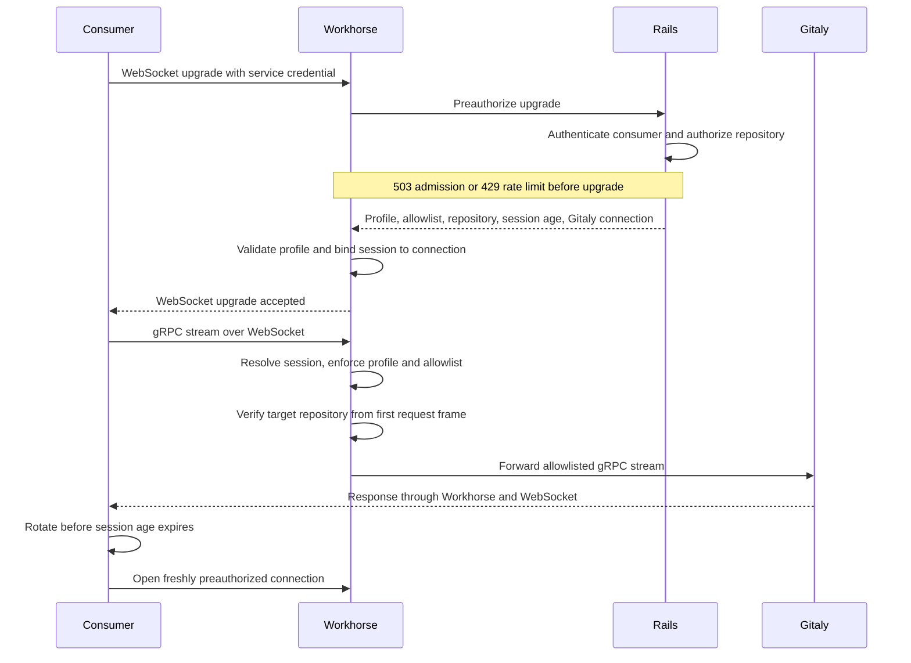

## Status

Proposed

## Date

2026-09-03

## Context

Orbit reads repository archives through a GitLab Rails internal endpoint using
senddata. Rails authorizes once per read in the request path, then Workhorse
streams the bytes from Gitaly. Each additional Gitaly RPC needs a bespoke Rails
endpoint, Workhorse senddata handler, and response translation. The proxy also
reduces Puma work from one request per read to one per connection session.

Other services avoid that translation by receiving Gitaly addresses and tokens
from Rails. Zoekt task payloads and the KAS `agent_info` response use this
pattern. It exposes storage topology and credentials to each consumer, expands
the effect of a compromised consumer, and couples the consumer to Gitaly
routing. We do not want to repeat that approach for Orbit.

## Decision

Add one consumer-generic Gitaly proxy route in Workhorse. Rails authorizes each
connection, Workhorse binds and enforces that policy on every gRPC stream, and
the consumer never receives Gitaly addresses or credentials.

| Component | Decides | Never sees |
|---|---|---|
| Rails | Consumer identity, repository authorization, profile selection, and the narrower RPC allowlist | Proxied gRPC streams and repository bytes |
| Workhorse | Whether the named profile exists, whether each stream satisfies its compiled rules, and mechanism-wide limits | Consumer-specific code; Rails policy arrives only as data that narrows the profile |
| Consumer | Transport mode, connection rotation, and bounded retry behavior | Gitaly addresses, credentials, or storage routing |

The v1 `readonly_repository` profile is Go code, not a rule set Rails can
express or loosen. It allows only accessor RPCs scoped to one target repository
and rejects unknown methods, additional repositories, client-streaming methods,
and target mismatches. The core is a single-destination port of Gitaly's
Apache-2.0 transparent proxy. Target extraction mirrors Gitaly's protobuf
annotation walk, including denial of ambiguous fields; Gitaly maintainers must
confirm parity. Workhorse drops consumer-supplied gRPC metadata and forwards
only Rails' allowlisted call metadata plus a sanitized correlation ID. Streams
keep the `gkg-indexer` client name, so Gitaly's existing per-client limits and
dashboards continue to apply.

Each admitted WebSocket owns one `grpc.Server`, the first gRPC server embedded
in Workhorse. The route MR measures about six goroutines and 126 KiB of heap per
idle session; 1,000 reconnects leave no resources behind. This avoids a race
between asynchronously queued final trailers and closing one connection, but
the per-connection server footprint is an explicit team decision below.

One credential-header to authorizer registration in Rails identifies each
consumer; the route does not name Orbit. A stolen instance-wide KG-JWT can use
25 accessor RPCs, wider than today's five bespoke read endpoints, but only
for projects under root namespaces with Orbit enabled and indexing eligible.
That project scope is narrower than today's archive endpoint.

Rails sets session age per connection, 10 minutes for Orbit, and Workhorse
clamps it to between 30 seconds and 1 hour. Age gates new streams; each admitted
stream has a Workhorse-configured 60-minute deadline, while the client rotates
proactively. grpc-go connection age is not used because it eventually closes
in-flight archives, which cannot resume. Policy defaults permit new streams for
10 minutes and each such stream for 60 minutes, a 70-minute revocation window.
Independent of Rails policy, Workhorse guarantees a two-hour ceiling with its
default one-hour age clamp and 60-minute stream deadline.

## Plan

The legs separate policy, transport, and the first consumer. These Draft MRs
do not go to maintainer review until this ADR is agreed.

| Leg | Draft MR | Depends on |
|---|---|---|
| Workhorse transparent proxy core and read-only invariants | [GitLab !253414](https://gitlab.com/gitlab-org/gitlab/-/merge_requests/253414) | ADR agreement, Gitaly maintainer review, and legal sign-off on the Apache-2.0 port |
| Workhorse route, connection sessions, stream director, and lifecycle | [GitLab !253431](https://gitlab.com/gitlab-org/gitlab/-/merge_requests/253431) | Workhorse core, contract fixture, and AppSec approval of the session registry |
| Rails preauthorization endpoint and consumer authorizer seam | [GitLab !253417](https://gitlab.com/gitlab-org/gitlab/-/merge_requests/253417) | Workhorse preauthorization contract and contract fixture |
| Orbit WebSocket-tunneled gRPC client transport | [knowledge-graph!2381](https://gitlab.com/gitlab-org/orbit/knowledge-graph/-/merge_requests/2381) | Workhorse wire contract and contract fixture |
| Orbit indexer archive service using Gitaly `GetArchive` | [knowledge-graph!2382](https://gitlab.com/gitlab-org/orbit/knowledge-graph/-/merge_requests/2382) | Orbit client transport |

Production/Delivery must first verify, in parallel with Workhorse core review,
that Orbit's production cluster can reach the new internal route through
GitLab.com Ingress and that WebSocket upgrades pass through it. A closed prefix
can require weeks of delivery work, so this gate must precede staging.

For Cells, Tenant Scale owns one HTTP Router `ProjectId` rule for the shared
route. Without it the catch-all can route to the wrong cell. The rule covers
every consumer and blocks Cells only, not the first GitLab.com rollout.

After the implementation legs agree on the byte-identical contract fixture,
GDK must exercise preauthorization, the tunnel, a real Gitaly archive, policy
denials, stream interruption, and fallback.

Staging then sizes connection admission, concurrent preauthorization, and the
Rails preauthorization rate limit. Benchmarks must cover normal archive load,
many projects opening sessions concurrently, and reconnect churn before those
limits are accepted.

Rollout starts in the fallback transport mode for selected root namespaces.
The instance-level `workhorse_gitaly_proxy` operations flag is the mechanism
kill switch, and `orbit_gitaly_proxy` enables the consumer per root namespace.
After fallback and restart metrics are stable, selected namespaces move to
proxy-only mode. Turning either flag off stops new preauthorizations; live
sessions can start streams until their age and finish them by their deadline.

V1 is done when legal sign-off is recorded, Gitaly has reviewed the core port,
AppSec has approved the registered-before-reachable, fail-closed session
registry, and the implementation and GDK gates pass. Production reachability
must be verified and the Cells Router rule filed. Staging must accept values for
`max_connections`, `max_preauth_inflight`, `max_concurrent_streams`, and the
Rails preauthorization threshold. One root namespace must complete the rollout
with monitoring and runbooks for denial spikes, preauthorization or reconnect
storms, draining sessions that do not close, and the kill switch.

## Scope of v1 and deferred work

V1 supports only the `readonly_repository` profile and Orbit is its only
consumer. Zoekt and KAS show that the authorizer seam has plausible future
consumers; this decision does not commit either service to adopting the proxy.

The indexer uses Gitaly `GetArchive`. Fallback uses Rails when the proxy fails
to authorize or admit the connection. A mid-stream failure retries from zero
over the proxy, never Rails, and the archive is spooled before extraction.

Client channel caching, client-side admission control, and query-time blob
reads are deferred beyond the indexer archive path. An immediate Redis-backed
revocation hook is deferred unless the team rejects the in-flight window below.
Per-consumer Workhorse limits are also deferred; they should be added only if
the Rails rate limit and Gitaly's consumer identity do not provide enough
isolation.

## Alternatives considered

### Give Orbit Gitaly connection details

Rails could return the Gitaly address and token to Orbit as it does for some
other services. This is the shortest data path, but it places routable storage
details and credentials in another cluster and makes Orbit responsible for
storage routing and credential handling.

### Add one Rails endpoint per RPC

This keeps the current senddata pattern and Rails authorization, but each new
RPC adds a Rails endpoint, Workhorse handler, and response translation. It also
keeps one Puma request per read instead of one per connection session.

### Use a shared server with grpc-go connection aging

A shared server with standard age and GOAWAY behavior is simpler than the
session lifecycle proposed here. Its grace period can terminate in-flight
archives and cause restart loops.

## Consequences

Adding an RPC normally needs a Rails allowlist change. If Workhorse's vendored
Gitaly descriptors do not know it, the RPC is denied until Orbit opens a module
bump for Workhorse maintainer review. Adding a consumer needs one Rails
authorizer registration, not a new proxy route or HTTP representation. A
follow-up should ask Gitaly to export its proxy package so the port can be
deleted.

Workhorse gains its first embedded gRPC server, one instance per admitted
connection, a session state machine, an approximately 110-line HTTP/2
frame-header parser pending the decision below, and a `[gitaly_proxy]` config
block. The invariant source is the vendored Gitaly descriptor registry. The two
Workhorse MRs total about 4,200 lines including tests. Rails receives one
preauthorization per connection, and Orbit spools archives locally.

## What we are asking the team to decide

Are the 70-minute policy window and two-hour Workhorse ceiling acceptable, or
must v1 include a Redis-backed hook that terminates sessions, including
in-flight streams? Workhorse already has a Redis key-watcher, so the hook is a
small, orthogonal change. AppSec and Gitaly should decide whether terminating a
read is required.

Should Workhorse preserve wire ordering between final HTTP/2 trailers and the
WebSocket close with the approximately 110-line, header-only parser that never
rewrites bytes? The alternative is `GracefulStop` with GOAWAY on age drain and
a client contract where the close code becomes best effort, as it is on
shutdown. We recommend GOAWAY to avoid maintaining an HTTP/2 parser in
Workhorse; [GitLab !253431](https://gitlab.com/gitlab-org/gitlab/-/merge_requests/253431)
will switch within the MR if the team agrees.

Is one `grpc.Server` per admitted connection, at the measured cost above,
acceptable to Workhorse?

Is a registry keyed by one credential header per consumer the right Rails seam,
or is one Rails endpoint per consumer preferable despite requiring matching
Workhorse and deployment routes? We recommend the registry because policy
remains in Rails and later consumers need no Workhorse route change. The swap
is small if the API maintainer prefers separate endpoints.

## References

- [Workhorse proxy core](https://gitlab.com/gitlab-org/gitlab/-/merge_requests/253414)
- [Workhorse route, sessions, and director](https://gitlab.com/gitlab-org/gitlab/-/merge_requests/253431)
- [Rails preauthorization and authorizer](https://gitlab.com/gitlab-org/gitlab/-/merge_requests/253417)
- [Orbit client transport](https://gitlab.com/gitlab-org/orbit/knowledge-graph/-/merge_requests/2381)
- [Orbit indexer archive transport](https://gitlab.com/gitlab-org/orbit/knowledge-graph/-/merge_requests/2382)
- [Implement Gitaly proxy in Workhorse](https://gitlab.com/gitlab-org/orbit/knowledge-graph/-/issues/1252)
