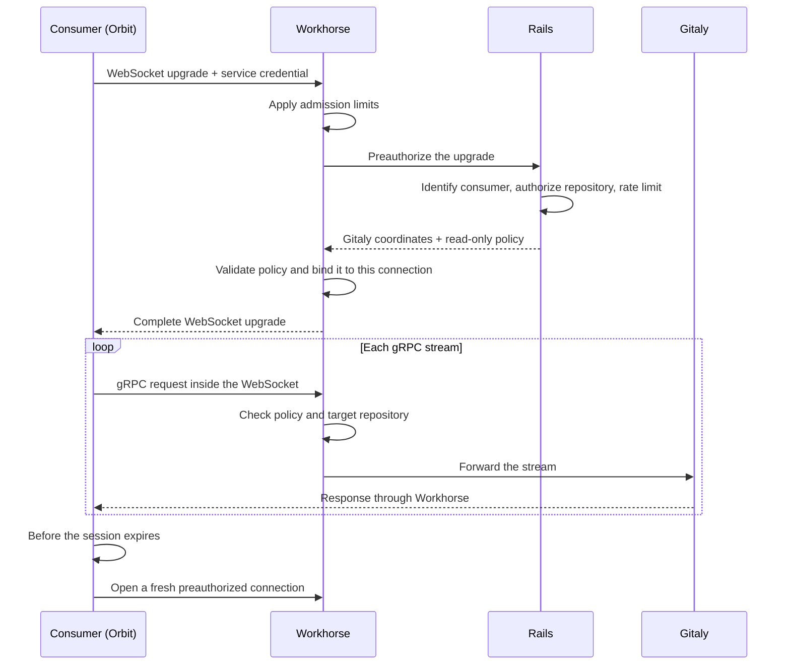

## Status

Proposed

## Date

2026-09-03

## Context

### The problem: one internal API per Gitaly RPC

Orbit reads repository content through Rails internal endpoints under
`/api/v4/internal/orbit/project/:id/`. Each endpoint fronts one Gitaly RPC. For
example, the archive endpoint wraps `GetArchive`, while other endpoints wrap
changed-path, blob, and merge-request diff RPCs. Rails authenticates and
authorizes the request, resolves the repository storage, and hands the call to
Workhorse. Workhorse performs the RPC and streams the bytes to Orbit.

Every new RPC requires a Rails endpoint, a Workhorse handler, an HTTP encoding
of the response, and a matching `gitlab-client` method. Four codebases and
review paths change to produce an endpoint with one caller. Every read is also
a full Rails request, so an indexing job that fetches ten archives goes through
Puma ten times. Rails is done once it writes the handoff header, so the cost is
per-request overhead, not a held worker.

### Why Orbit cannot call Gitaly directly

Orbit runs in its own Kubernetes cluster. Gitaly and Praefect are reachable
only inside the GitLab network, while Orbit can reach Workhorse. Every read
therefore has to pass through Workhorse.

Native gRPC needs HTTP/2, which the Workhorse inbound listener does not support.
The listener receives HTTP/1.1 behind a TLS-terminating edge, and the supported
topologies do not carry HTTP/2 to it. GitLab has handled this constraint with
WebSockets before. Duo Workflow bridges a bidirectional gRPC stream over a
WebSocket, and the language-server executors moved from gRPC to WebSockets
because some customers block HTTP/2
([gitlab-lsp#1219](https://gitlab.com/gitlab-org/editor-extensions/gitlab-lsp/-/issues/1219)).

### What the POC established

The POC in [#1226](https://gitlab.com/gitlab-org/orbit/knowledge-graph/-/issues/1226)
compared a framed HTTP route, a dedicated gRPC port, and a reverse tunnel. It
settled on a transparent proxy: generated Gitaly stubs speak gRPC through a
WebSocket, and Workhorse forwards RPCs without knowing their schema, the way
Praefect does. An
unmodified Rust `tonic` client completed a code-indexing job through GDK
Workhorse, Praefect, and Gitaly, including a 21 MB `GetArchive`, backpressure,
and concurrent streams.

The POC left authorization unresolved. Orbit held a signed grant containing
the Gitaly address and token, so the secret the proxy exists to protect ended
up in Orbit anyway. The grant was a bearer token with no caller binding or
revocation, and the first repository-scope check allowed a grant for one
repository to read another. This ADR replaces that grant model.

### The pattern we do not want to copy

Rails gives Zoekt and KAS a Gitaly address and token, then each consumer dials
Gitaly. This exposes storage topology and credentials, broadens the effect of a
compromised consumer, and couples consumers to Gitaly routing. Orbit is in a
separate cluster, so we rule out this pattern.

## Decision

Add one consumer-generic Gitaly proxy route to Workhorse, with gRPC tunneled
over a WebSocket. Rails authorizes each connection and returns Gitaly
coordinates plus a read-only policy to Workhorse. Workhorse holds both in
memory for that connection and enforces the policy on each gRPC stream. The
consumer uses generated gRPC stubs and never sees a Gitaly address or token.

### Who decides what

| Component | Decides | Never sees |
|---|---|---|
| Rails | Consumer identity, repository access, profile, and policy limits | Proxied streams and repository bytes |
| Workhorse | Profile validity, stream policy, and proxy limits | Consumer-specific authorization code |
| Consumer | Transport mode, connection rotation, and retries | Gitaly addresses, tokens, and storage routing |

Workhorse is deliberately policy-free. It knows how to enforce a profile, not
who may use one. Rails owns that decision with the rest of the GitLab
authorization logic.

### A connection's lifecycle

1. The consumer opens `/api/v4/internal/gitaly_proxy/project/:id/ws` with its
   service credential. Workhorse applies admission limits and asks Rails to
   preauthorize the connection.
2. Rails identifies the consumer, authorizes the repository, and returns the
   Gitaly coordinates plus a named policy that it may narrow for this session.
3. Workhorse validates the policy, binds it and the Gitaly coordinates to the
   connection, then enforces the policy and repository scope on each stream.
4. Before the session expires, the consumer opens a newly preauthorized
   connection. The old connection stops accepting streams and closes after its
   in-flight streams finish.

Rails answers Workhorse directly, and nothing is serialized into a token held
by the consumer. There is nothing to replay or revoke, and the Gitaly secret
never leaves the GitLab deployment.

### The read-only policy

A profile is a named rule set compiled into Workhorse. Rails selects one by
name and may only narrow it. V1 has one profile, `readonly_repository`, which
allows accessor RPCs scoped to the repository Rails authorized and rejects all
other calls. This includes mutators that Rails might allowlist by mistake, such
as `CommitLanguages`. Target-repository resolution uses the same protobuf
annotation as Gitaly and Praefect. Streams keep the consumer's Gitaly client
name, so Gitaly's per-client limits and dashboards keep working.

### Session lifetime

A session has three states: **active**, when it accepts new streams;
**draining**, when existing streams may finish; and **closed**. Rails sets a
10-minute session age for Orbit. Workhorse gives each stream a 60-minute
deadline and caps the revocation window at two hours regardless of the value
Rails requests.

We do not use grpc-go connection aging because its grace period terminates
in-flight archives. The indexer would restart each cut archive from byte zero,
so the largest repositories could never finish. This design instead lets
in-flight streams run until their own deadline.

After Rails revokes access, a session admitted just before revocation may start
streams for 10 minutes, and those streams may run for 60 minutes. The worst
case is therefore about 70 minutes. Whether v1 needs an immediate kill hook is
[open question 1](#open-questions-for-the-team).

Turning off either feature flag stops new preauthorizations. Existing sessions
continue under the same lifetime rules.

### Adding a consumer or an RPC

A new consumer adds a Rails authorizer for its own credential, an RPC allowlist,
and a rollout flag. The shared route needs no Workhorse, ingress, or Cells
routing change. Zoekt and KAS are possible future consumers, but this ADR does
not commit them to the proxy.

Adding an RPC for an existing consumer is a Rails allowlist change when the RPC
is already in the Gitaly descriptors vendored into Workhorse. Otherwise,
Workhorse must update its Gitaly module before the proxy can allow the method.

### Orbit as the first consumer

The indexer's archive download moves first. It calls Gitaly `GetArchive` over
the proxy, while project metadata continues to use Rails HTTP. The
`gitlab.gitaly_transport` setting selects the mode:

| Mode | Behavior |
|---|---|
| `rails_http` (default) | Today's path, unchanged |
| `workhorse_ws_with_fallback` | Try the proxy; fall back to Rails when the proxy refuses to authorize or admit the connection |
| `workhorse_ws` | Proxy only |

Fallback to Rails is allowed only before archive bytes begin to flow. If a
stream is cut, the download restarts from zero over the proxy and never switches
to Rails. Orbit spools the archive to a temporary file before extraction so
partial bytes do not reach the parser.

### Feature flags

| Flag | Type | Default | Scope | Off means |
|---|---|---|---|---|
| `workhorse_gitaly_proxy` | ops | enabled | instance | Rails refuses new sessions for every consumer |
| `orbit_gitaly_proxy` | rollout | disabled | root namespace | Rails refuses new Orbit sessions; fallback mode uses Rails HTTP |

`workhorse_gitaly_proxy` is the mechanism kill switch
([rollout issue](https://gitlab.com/gitlab-org/gitlab/-/issues/627577)), while
`orbit_gitaly_proxy` controls the Orbit rollout by root namespace
([rollout issue](https://gitlab.com/gitlab-org/gitlab/-/issues/627576)). Orbit
also requires Knowledge Graph indexing to be enabled for the project, the same
gate the indexing task producer applies, so the proxy cannot read a project the
indexer would not have been asked to index.

## Why not the alternatives

### Hand Orbit the Gitaly address and token

Orbit cannot reach Gitaly from its cluster. This option would also expose
storage details and credentials in another cluster and make Orbit responsible
for routing and credential handling. The POC grant had the same problem.

### Keep adding one Rails endpoint per RPC

This preserves the current authorization path. Each RPC would still require
changes across four codebases, create another single-caller endpoint, and add a
Rails request for every read. Planned blob and diff reads would repeat that
work.

### A framed HTTP route instead of a WebSocket tunnel

The POC proved that Workhorse can accept a serialized request and return
length-prefixed protobuf frames. Consumers would have to serialize requests and
parse responses themselves, and the route supports only unary and
server-streaming RPCs. A WebSocket tunnel preserves generated gRPC clients at
the same edge cost.

### Add real inbound HTTP/2 to Workhorse

Native gRPC would remove the tunnel. It requires a coordinated edge change
across every supported deployment topology for one consumer. We consider that a
separate platform decision.

### Reverse tunnel over the existing Workhorse to Orbit connection

Workhorse already connects to the Orbit webserver for queries, but the indexer
is a separate deployment and does not talk to the webserver. Repository reads
would take an extra hop, and archive downloads would share a connection with
query lookups.

### A shared gRPC server with grpc-go connection aging

A shared server would avoid per-connection servers and the session state
machine. Its connection-aging grace period terminates in-flight archives and
causes the restart loop described under [Session lifetime](#session-lifetime).

## Open questions for the team

_Numbered list, each with a recommendation._

## Consequences

### What improves

_Placeholder._

### What gets harder

_Placeholder._

## Non-goals and deferred work

_Placeholder._

## Implementation plan

### Merge requests

_Leg / MR / depends-on table._

### Gates before staging

_Placeholder._

### Staging sizing

_Placeholder._

### Rollout

_Placeholder._

### Definition of done

_Placeholder._

## References

- [Implement Gitaly proxy in Workhorse](https://gitlab.com/gitlab-org/orbit/knowledge-graph/-/issues/1252)
- [POC: generic Gitaly proxy in Workhorse](https://gitlab.com/gitlab-org/orbit/knowledge-graph/-/issues/1226)
- [Workhorse proxy core](https://gitlab.com/gitlab-org/gitlab/-/merge_requests/253414)
- [Workhorse route, sessions, and director](https://gitlab.com/gitlab-org/gitlab/-/merge_requests/253431)
- [Rails preauthorization and authorizer](https://gitlab.com/gitlab-org/gitlab/-/merge_requests/253417)
- [Orbit client transport](https://gitlab.com/gitlab-org/orbit/knowledge-graph/-/merge_requests/2381)
- [Orbit indexer archive transport](https://gitlab.com/gitlab-org/orbit/knowledge-graph/-/merge_requests/2382)
