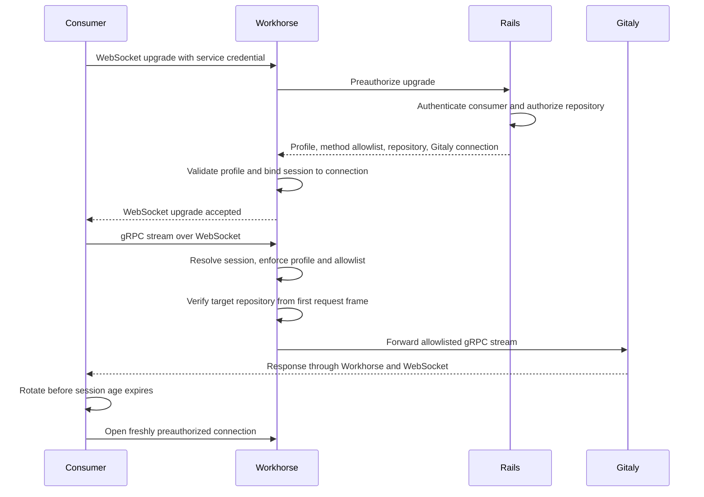

## Status

Proposed

## Date

2026-09-03

## Context

Orbit reads repository archives through a GitLab Rails internal endpoint. Rails
authorizes the request, then remains in the data path while Workhorse streams
the archive from Gitaly. Each additional Gitaly RPC needs another Rails and
Workhorse endpoint with its own request and response translation.

Other services avoid that translation by receiving Gitaly addresses and tokens
from Rails. Zoekt task payloads and the KAS `agent_info` response use this
pattern. It exposes storage topology and credentials to each consumer, expands
the effect of a compromised consumer, and couples the consumer to Gitaly
routing. We do not want to repeat that approach for Orbit.

## How it works

Add one consumer-generic Gitaly proxy route in Workhorse. Rails authorizes each
connection, Workhorse binds and enforces that policy on every gRPC stream, and
the consumer never receives Gitaly addresses or credentials.

| Component | Decides | Never sees |
|---|---|---|
| Rails | Consumer identity, repository authorization, profile selection, and the narrower RPC allowlist | Proxied gRPC streams and repository bytes |
| Workhorse | Whether the named profile exists, whether each stream satisfies its compiled rules, and mechanism-wide limits | Consumer-specific authorization logic or a caller-defined policy |
| Consumer | Transport mode, connection rotation, and bounded retry behavior | Gitaly addresses, credentials, or storage routing |

The v1 `readonly_repository` profile allows only accessor RPCs scoped to one
target repository. It rejects unknown methods, additional repositories,
client-streaming methods, and any request whose target does not match the
connection. The route does not name Orbit. One credential-header to authorizer
registration in Rails identifies each consumer and supplies a narrower
allowlist; Orbit is the first registration.

Connection age gates new streams only. An admitted stream may finish under a
separate deadline, while the client rotates proactively onto a freshly
preauthorized connection. grpc-go connection age is not used because its
GOAWAY grace eventually closes in-flight archives, which cannot resume and
would restart from zero. The accepted consequence is that a revoked caller may
finish an already-started read for roughly 70 minutes in the worst case with
the proposed defaults: up to 10 minutes of connection age plus a 60-minute
stream deadline.

## Plan

The implementation is split so that policy, transport, and the first consumer
can be reviewed independently. The Draft MRs are evidence that the design is
implementable; they do not go to maintainer review until this ADR is agreed.

| Leg | Draft MR | Depends on |
|---|---|---|
| Workhorse transparent proxy core and read-only invariants | [GitLab !253414](https://gitlab.com/gitlab-org/gitlab/-/merge_requests/253414) | ADR agreement |
| Workhorse route, connection sessions, stream director, and lifecycle | [GitLab !253431](https://gitlab.com/gitlab-org/gitlab/-/merge_requests/253431) | Workhorse core |
| Rails preauthorization endpoint and consumer authorizer seam | [GitLab !253417](https://gitlab.com/gitlab-org/gitlab/-/merge_requests/253417) | Workhorse preauthorization contract |
| Orbit WebSocket-tunneled gRPC client transport | [knowledge-graph!2381](https://gitlab.com/gitlab-org/orbit/knowledge-graph/-/merge_requests/2381) | Workhorse wire contract |
| Orbit indexer archive service using Gitaly `GetArchive` | [knowledge-graph!2382](https://gitlab.com/gitlab-org/orbit/knowledge-graph/-/merge_requests/2382) | Orbit client transport |

After the implementation legs agree on the contract, a GDK end-to-end run must
exercise Rails preauthorization, the Workhorse tunnel, a real Gitaly archive,
policy denials, stream interruption, and fallback behavior.

Before staging, we must verify that Orbit's production cluster can reach the
new internal route through GitLab.com Ingress and that WebSocket upgrades pass
through it. This topology check precedes staging because a closed prefix or an
unsupported upgrade blocks the transport regardless of application behavior.

Staging then sizes connection admission, concurrent preauthorization, and the
Rails preauthorization rate limit. Benchmarks must cover normal archive load,
many projects opening sessions concurrently, and reconnect churn before those
limits are accepted.

Rollout starts in the fallback transport mode for selected root namespaces.
The instance-level `workhorse_gitaly_proxy` operations flag is the mechanism
kill switch, and `orbit_gitaly_proxy` enables the consumer per root namespace.
After fallback and restart metrics are stable, selected namespaces move to
proxy-only mode. Turning either flag off stops new preauthorizations but does
not terminate an admitted stream.

V1 is done when the implementation legs have passed maintainer and security
review, GDK end-to-end is green, production route reachability is verified,
staging limits are measured, and at least one root namespace completes the
fallback-to-proxy-only rollout with runbooks and monitoring in place.

## Scope of v1 and deferred work

V1 supports only the `readonly_repository` profile and Orbit is its only
consumer. Zoekt and KAS show that the authorizer seam has plausible future
consumers; this decision does not commit either service to adopting the proxy.

The indexer uses Gitaly `GetArchive`. The existing Rails path remains the
default until rollout. In fallback mode it is used only when the proxy fails
before streaming starts. A mid-stream proxy failure retries from zero over the
proxy within a bounded budget and never switches to Rails. The archive is
spooled to a temporary file before extraction so attempts cannot be combined.

Client channel caching, client-side admission control, and query-time blob
reads are deferred beyond the indexer archive path. An immediate Redis-backed
revocation hook is deferred unless the team rejects the in-flight window below.
Per-consumer Workhorse limits are also deferred; they should be added only if
the Rails rate limit and Gitaly's consumer identity do not provide enough
isolation.

## Alternatives considered

### Give Orbit Gitaly connection details

Rails could return the Gitaly address and token to Orbit as it does for some
other services. This is the shortest data path, but it places routable storage
details and credentials in another cluster and makes Orbit responsible for
storage routing and credential handling.

### Add one Rails endpoint per RPC

This keeps the current archive pattern and preserves Rails authorization, but
each new RPC adds another endpoint and translation layer. Rails also remains in
the data path for every repository read.

### Use a shared-server gRPC proxy with grpc-go connection aging

A shared server with standard age and GOAWAY behavior is simpler than the
session lifecycle proposed here. Its grace period can terminate in-flight
archives, causing restart loops, and a shared server cannot drain one transport
through grpc-go's public API.

### Add consumer-specific routes

Separate routes make the consumer explicit in the path. They also require a
Workhorse route and deployment routing work for every consumer, while the
credential already selects and authenticates the Rails authorizer.

## Consequences

Adding an RPC normally needs a Rails allowlist change and, when its descriptors
are newer, a Workhorse Gitaly module bump. Adding a consumer needs one Rails
authorizer registration, not a new proxy route or HTTP representation.

The cost is a ported proxy package and session state machine in Workhorse, one
Rails preauthorization per connection, local spooling for Orbit archives, and
the Workhorse Gitaly module pin as an explicit coupling point.

## What we are asking the team to decide

Is the roughly 70-minute worst-case window for an already-started read
acceptable, or must the first version include a Redis-backed hook that lets
Rails force Workhorse to drain a session immediately?

Should Workhorse preserve wire ordering between final HTTP/2 trailers and the
WebSocket close by tracking HTTP/2 frame boundaries, or should it use GOAWAY
and change the client contract so the final close frame is best effort?

Can Orbit's production cluster reach the new internal route through GitLab.com
Ingress, and does that Ingress pass WebSocket upgrades on the route? This must
be verified before staging because Orbit currently reaches its existing
internal prefix, not this new shared prefix.

Is a registry keyed by one credential header per consumer the right Rails seam,
or is one Rails endpoint per consumer preferable despite requiring matching
Workhorse and deployment routes?

## References

- [Workhorse proxy core](https://gitlab.com/gitlab-org/gitlab/-/merge_requests/253414)
- [Workhorse route, sessions, and director](https://gitlab.com/gitlab-org/gitlab/-/merge_requests/253431)
- [Rails preauthorization and authorizer](https://gitlab.com/gitlab-org/gitlab/-/merge_requests/253417)
- [Orbit client transport](https://gitlab.com/gitlab-org/orbit/knowledge-graph/-/merge_requests/2381)
- [Orbit indexer archive transport](https://gitlab.com/gitlab-org/orbit/knowledge-graph/-/merge_requests/2382)
- [Gitaly direct access for Orbit](https://gitlab.com/gitlab-org/orbit/knowledge-graph/-/issues/1252)
