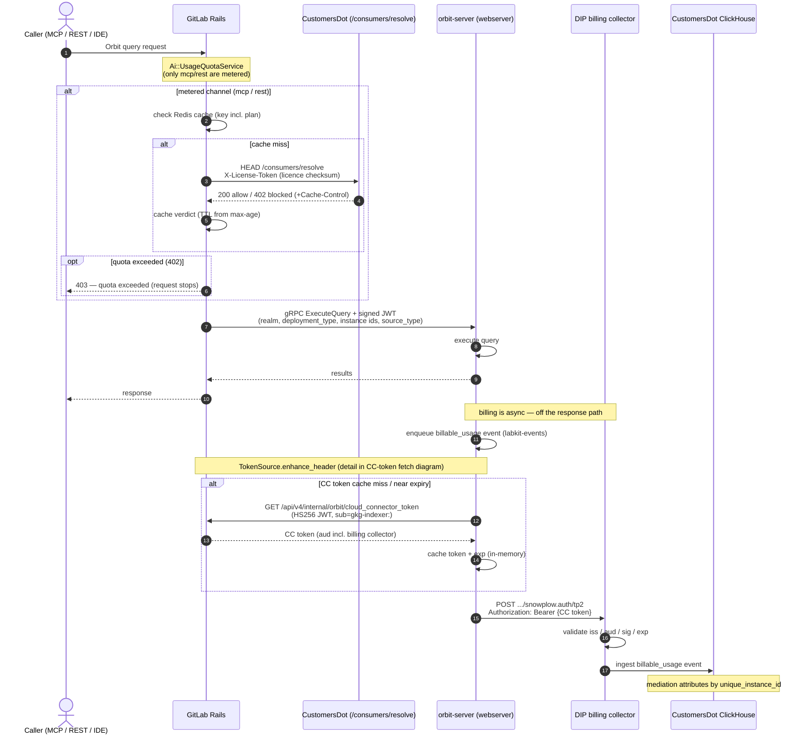
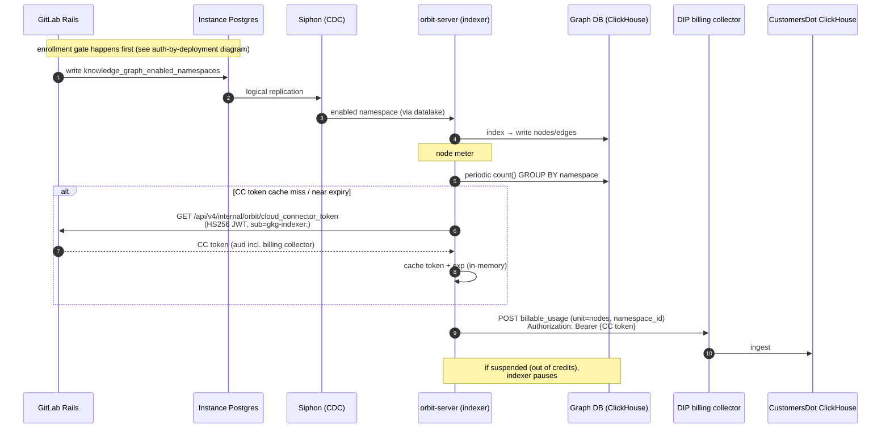
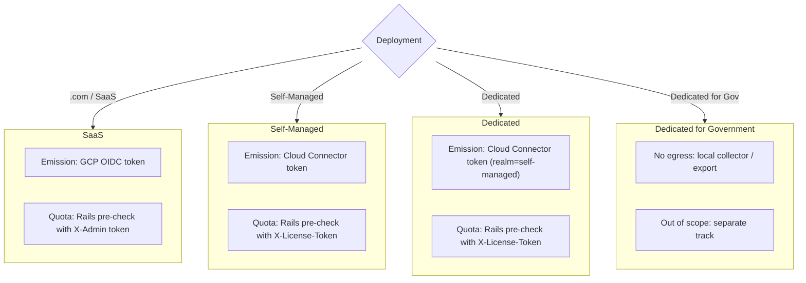

## Status

Proposed

## Date

2026-09-14

## Context

ADR 007 established how Orbit emits `billable_usage` events on GitLab.com: the `orbit-server` webserver (formerly `gkg-server`) emits Snowplow structured events via `labkit-rs`, authenticated with an OIDC token minted from a GCP workload identity, and a pre-execution quota check calls CustomersDot from inside `orbit-server`. That path works because `orbit-server` runs on GitLab.com's GCP infrastructure and can obtain a workload-identity OIDC token that the Data Insights Platform (DIP) billing collector trusts.

This ADR covers the deployments ADR 007 left open: **Self-Managed (SM)** and **Dedicated**. Two facts make them different:

- **SM runs entirely on customer infrastructure.** There is no GitLab-operated GCP workload identity to mint an OIDC token from. The credential ADR 007 relies on does not exist off-.com. (Epic: [Orbit on Self-Managed &22739](https://gitlab.com/groups/gitlab-org/-/work_items/22739).)
- **Dedicated is GitLab-operated, per-tenant.** Each tenant runs in its own isolated environment rather than on the shared .com fleet. (Epic: [Orbit on Dedicated &22740](https://gitlab.com/groups/gitlab-org/-/work_items/22740).)

### The usage-billing emission trust boundary

The platform usage-billing design (`gitlab-org/architecture/usage-billing/design-doc`, `design/instrumentation.md`) draws a trust boundary for who may emit billable events: **GitLab-operated components** (SaaS, Dedicated, and GitLab-run cloud services) may emit billable events directly, but **customer-operated Self-Managed instances may not** — a customer-controlled process is not a trustworthy emitter of billing data it could tamper with. This boundary is the central constraint shaping the decision below: on SM, the emitter runs on customer infrastructure, yet the event must still be authenticated by a credential the customer cannot forge or repurpose.

### Why the .com credential does not carry over

Today Orbit emits `billable_usage` (Iglu schema currently `1-0-2`, to be bumped to `1-0-3`) via `labkit-events`, authenticated with a GCP workload-identity OIDC token. That token is issued by GitLab.com's GCP infrastructure and is only obtainable there. Off-.com, `orbit-server` has no such identity, so it needs a different credential to authenticate to the DIP collector.

### The Cloud Connector token is the credential that works off-.com

The **Cloud Connector (CC) token** is the credential SM and Dedicated already use to reach GitLab-operated cloud services. It is minted by CustomersDot (CDot), carries `iss = customers.gitlab.com` root_url, its `aud` includes the billing collector, and it carries `gitlab_instance_uid`. Two pieces of precedent make this a proven path rather than a new invention:

- **Secrets Manager** already emits billable usage from a Rust service using a CC token: `Gitlab::BillingEvents::Client` with the EE `BillingAuthEmitter` CC-token override.
- **DIP added GitLab-as-OIDC-provider support** ([platform-insights/core#161](https://gitlab.com/gitlab-org/analytics-section/platform-insights/core/-/work_items/161)) so the collector accepts CC tokens as the OIDC credential; this has been staging-verified.

### Two meters, and the indexer has no request in flight

Orbit meters two things:

- **Query count** — emitted by the webserver, once per query execution.
- **Node / hops count** — emitted by the indexer, reflecting graph volume.

The indexer is triggered by Siphon CDC over NATS, not by a Rails request. There is no user JWT in flight when the indexer needs to emit, so the indexer cannot ride a query-time token. It must fetch its own credential.

## Decision

For Orbit on Self-Managed and Dedicated, **`orbit-server` emits `billable_usage` events itself**, directly to the DIP billing collector, authenticated with a Cloud Connector token. The pre-execution usage-quota / access-cutoff check is performed **in Rails**, not in `orbit-server`.

Precisely:

1. **`orbit-server` owns emission end-to-end.** Both the webserver (query meter) and the indexer (node/hops meter) build and POST the `billable_usage` event directly to the DIP collector. The `billable_usage` Iglu schema is bumped from `1-0-2` to `1-0-3`.

2. **CC token is fetched from a new Rails internal endpoint.** `orbit-server` calls `GET /api/v4/internal/orbit/cloud_connector_token` over the **existing HS256-authenticated internal-API channel** — the same channel the indexer already uses. Rails resolves the token via `CloudConnector::Tokens.cloud_connector_token` (backed by CDot, synced to the Rails DB as `ServiceAccessToken`) and returns it. The request is authenticated with a Rails-signed HS256 JWT carrying the `gkg-indexer:` subject prefix and the `Gitlab-Orbit-Api-Request` header, matching the internal-API auth model in `docs/design-documents/security.md`.

3. **In-memory cache, no DB.** `orbit-server` caches the CC token in memory keyed by expiry (`exp - 60s`, with jitter so caches across a fleet do not expire in lockstep). No database, no disk. The token never leaves process memory and is never persisted.

4. **Realm branches by deployment.** On SaaS, emission keeps the GCP OIDC token from ADR 007. On SM and Dedicated, emission uses the CC token. Because `CloudConnector.gitlab_realm` returns `self-managed` for Dedicated, the event carries `realm = self_managed` even on Dedicated; the two are distinguished by a separate `deployment_type` field, not by `realm`.

5. **Quota / access-cutoff moves to a Rails pre-check.** Rails is always in front of `orbit-server` (it signs the query JWT), so the usage-quota / access-cutoff check runs in Rails before forwarding — reusing `Ai::UsageQuotaService` with the licence checksum (`X-License-Token`) against CDot `/consumers/resolve`. A blocked verdict stops the request before it reaches `orbit-server`. **`orbit-server`'s existing CDot quota client is removed** — quota is no longer an `orbit-server` concern on any deployment.

6. **Emission is async and off the request path.** A billing failure never blocks a query response or an indexing batch. Auth failures on the POST are retriable — the token is re-fetched/refreshed per POST attempt with backoff (CustomersDot mints it; `orbit-server` only fetches and caches), and events are never dropped silently.

## Flow diagrams

Four diagrams describe the as-built-intent for SM and Dedicated: the query path (quota pre-check in Rails, emission from `orbit-server`), the indexer path (node meter with its own token fetch), the shared CC-token fetch-and-cache subroutine, and the auth-by-deployment summary.

Legend: the **customer-controlled** vs **GitLab-operated** boundary matters for SOX — the billable event is emitted from `orbit-server`, authenticated with a Cloud Connector token, and only GitLab-operated components sit downstream of the collector.

### Query path — quota pre-check (Rails) + billing emission (orbit-server)



### Indexer path — node-count meter (no Rails request in flight)



### CC-token fetch & cache (shared by webserver + indexer)

```mermaid
sequenceDiagram
autonumber
participant GKG as orbit-server (any mode)
participant Rails as GitLab Rails (internal/orbit)
participant CDotSync as CustomersDot (token source)
Note over GKG: implemented as a labkit-events TokenSource<br/>(enhance_header, invoked before each POST)
Note over Rails,CDotSync: CDot mints instance CC token,<br/>synced to Rails DB (ServiceAccessToken)
GKG->>GKG: cached token valid? (exp - 60s, +jitter)
alt cache miss / near expiry
GKG->>Rails: GET /api/v4/internal/orbit/cloud_connector_token<br/>(HS256 JWT, sub=gkg-indexer, Gitlab-Orbit-Api-Request)
Rails->>Rails: CloudConnector::Tokens.cloud_connector_token
Rails-->>GKG: CC token (JWT, aud incl. billing collector)
GKG->>GKG: cache token + exp (in-memory, no DB)
end
GKG->>GKG: inject Authorization: Bearer {CC token}
Note over GKG: on 401/403 or fetch failure, re-fetch/refresh token<br/>per POST attempt with backoff; never drop silently
```

### Auth by deployment type (who authenticates how)



## Why not the alternatives

### Emit via a Rails internal ingest endpoint (Rails emits on `orbit-server`'s behalf)

`orbit-server` would POST the event to a new Rails internal endpoint, and Rails would forward it to DIP using `Gitlab::BillingEvents::Client`. This keeps the CC token entirely in Rails (never exposed to `orbit-server` memory), closes cross-instance spoofing because Rails stamps the instance identity it already holds, and reuses the existing `Gitlab::BillingEvents::Client` emitter.

Not chosen because it adds an extra hop for every event and splits emission ownership: the indexer meter would still need a Rails round-trip for each batch, and the team chose to have `orbit-server` own emission end-to-end (both meters, including the indexer) rather than route billing through the Rails proxy. This remains a viable fallback if the CC-token-in-`orbit-server` exposure or the durability work proves too costly.

### GCP / AWS cloud-workload OIDC (the path Dedicated Hosted Runners use today)

Authenticate emission with a cloud-workload OIDC token whose org identity is allowlisted by DIP — the pattern Dedicated Hosted Runners use.

Not chosen as the general path because it works for a centralized GitLab-operated fleet with a single allowlistable cloud org identity, but Orbit's per-tenant Dedicated pods may run under EKS IRSA with no `org_id` claim, and such a token carries no tenant identity. Open question: if Dedicated tenant pods *do* have an allowlistable AWS identity that DIP can accept, Orbit-on-Dedicated could reuse this path and skip the CC token entirely — this needs verification with DIP and the Dedicated team.

### No metering on Self-Managed (license-tier only)

Charge SM purely by license tier and skip usage metering.

Rejected because pricing is intended to be consistent across deployment types; dropping metering on SM would break that consistency and forfeit the usage data the pipeline is being built to collect.

## Consequences

### Positive

- **Reuses a proven CC-token → DIP path.** Secrets Manager already emits billable usage from a Rust service with a CC token, and DIP already accepts CC tokens as an OIDC credential ([platform-insights/core#161](https://gitlab.com/gitlab-org/analytics-section/platform-insights/core/-/work_items/161), staging-verified). This is a composition of existing pieces, not a new trust mechanism.
- **A single emission path lives in the `orbit-billing` SOX crate.** Both meters and both credential branches (GCP OIDC for SaaS, CC token for SM/Dedicated) resolve to one emitter inside `crates/orbit-billing/`, keeping the SOX audit surface small (see `docs/dev/sox-billing-boundary.md`).
- **Works for both meters, including the indexer.** Because `orbit-server` fetches its own CC token over the internal-API channel, the CDC/NATS-triggered indexer — which has no Rails request in flight — can emit its node/hops meter without a user token.
- **Quota logic consolidates in Rails.** Removing `orbit-server`'s CDot quota client deletes a cross-service dependency and a source of latency and fail-open ambiguity from the query path; Rails already sits in front and holds the subscription context.

### Negative

- **The CC token is exposed to `orbit-server` memory.** It must be treated as a secret: redacted from logs and error output, held in-memory only (never persisted), and fetched over TLS/mTLS. This is a new secret in the `orbit-server` process that did not exist on the GCP-OIDC-only path.
- **The CC token is broad / over-privileged.** A general Cloud Connector token grants more than billing emission. We could pursue a **billing-scoped token** in the future (a Cloud Connector unit primitive scoped to billing emission) so the credential `orbit-server` holds is narrowed to exactly what it needs.

## Known limitations

- **CC-token attribution is not spoof-safe.** The DIP proxy does not validate the `instance_id` in the event payload to that in the cloud connector token claim. As a result a valid instance with cloud connector token could attribute usage to another instance. This is **platform-wide** (shared with Secrets Manager), not specific to Orbit. 
- **Requires an online cloud license.** This path depends on CDot minting a CC token, which requires the instance to reach `customers.gitlab.com`. Offline / air-gapped instances cannot use it; air-gapped deployments follow the separate local-collector / export track ([Orbit air-gapped &22758](https://gitlab.com/groups/gitlab-org/-/work_items/22758)).

## Open questions

1. **AWS identity on Dedicated (alternative B).** If Dedicated tenant pods have an allowlistable AWS identity DIP can accept, Orbit-on-Dedicated could use cloud-workload OIDC and skip the CC token. Verify with DIP and Dedicated.
2. **Attribution spoofing.** Raise the `unique_instance_id`-not-bound-to-token limitation with DIP as a platform-wide gap.
3. **Node meter shape.** The node/hops meter is modelled as a point-in-time. If pricing requires a continuous counter instead, the indexer emission changes.

## References

- [ADR 007: Orbit monetization engineering](https://gitlab.com/gitlab-org/orbit/knowledge-graph/-/blob/main/docs/design-documents/decisions/007_monetization_engineering.md)
- [Emission design issue (orbit/knowledge-graph#1229)](https://gitlab.com/gitlab-org/orbit/knowledge-graph/-/work_items/1229)
- [CDot billing decision issue (customers-gitlab-com#18649)](https://gitlab.com/gitlab-org/customers-gitlab-com/-/work_items/18649)
- [Orbit on Self-Managed epic (&22739)](https://gitlab.com/groups/gitlab-org/-/work_items/22739)
- [Orbit on Dedicated epic (&22740)](https://gitlab.com/groups/gitlab-org/-/work_items/22740)
- [Orbit air-gapped / local-collector track (&22758)](https://gitlab.com/groups/gitlab-org/-/work_items/22758)
- [DIP GitLab-as-OIDC-provider support (platform-insights/core#161)](https://gitlab.com/gitlab-org/analytics-section/platform-insights/core/-/work_items/161)
- [Usage-billing design doc (gitlab-org/architecture/usage-billing/design-doc)](https://gitlab.com/gitlab-org/architecture/usage-billing/design-doc)
- [Orbit-side quota pre-check issue (orbit/knowledge-graph#591)](https://gitlab.com/gitlab-org/orbit/knowledge-graph/-/work_items/591)
