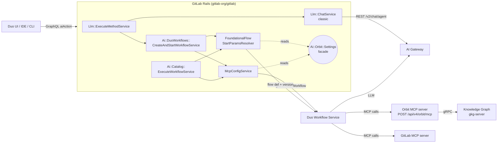

# Duo / Orbit prompt routing architecture

## Overview

This document describes how a user prompt is routed from a GitLab Duo surface
through GitLab Rails to the GitLab Duo Workflow Service (DWS) and the AI Gateway,
and where the Knowledge Graph (Orbit) attaches to that flow. It enumerates the
seven Duo / Orbit routing combinations the platform supports today — the
{Duo surface} × {Orbit on/off} cross product for chat, developer, and
foundational-agent surfaces, plus custom AI Catalog agents — and identifies
the precise Rails seams that decide whether an in-flight prompt sees Orbit
tooling.

The Knowledge Graph repository owns the service that backs the Orbit MCP tools
(`query_graph`, `get_graph_schema`, `list_commands`, `invoke_command`). The
routing decisions documented here, however, live in `gitlab-org/gitlab`. This
document is therefore a *consumer-side* description: it captures the invariants
the Knowledge Graph team relies on when reasoning about which prompts can reach
Orbit, which agents advertise our tools, and which feature flags gate the
overall surface.

**Scope**

In scope:

- The seven routing combinations across Duo Chat, Duo Developer, Foundational
  Agents (with Orbit on and off for each), and custom AI Catalog agents.
- The Rails gating facade (`Ai::Orbit::Settings`) and the two routing seams that
  decide whether Orbit tools reach DWS.
- The feature flags involved in turning Orbit on or off.

Out of scope:

- The internal implementation of `query_graph` and `get_graph_schema` (see
  [`decisions/011_agent_command_surface.md`](decisions/011_agent_command_surface.md)
  and [`querying/`](querying/)).
- The DWS-side flow definitions and agent prompts; those live in the `ai-assist`
  repository.
- Authorization for graph queries; see [`security.md`](security.md).

**Sources**

- Validated against `gitlab-org/gitlab` master on 2026-05-14, including the
  `developer/v1` Orbit branch landed in
  [MR !235544](https://gitlab.com/gitlab-org/gitlab/-/merge_requests/235544)
  (`6045aabbdb81`).
- Based on internal research notes and validated against the upstream
  implementation files cited throughout this document.

## Vocabulary

| Term | Meaning |
|---|---|
| **DWS** | GitLab Duo Workflow Service. Python service in the `ai-assist` repository that executes foundational flows and agents. Receives a gRPC start payload from Rails containing the flow ID, version, MCP server configuration, and auth. |
| **Flow** | A YAML definition in `ai-assist` describing agents, prompts, toolsets, and routers. Flows are baked into the DWS container at build time via `fetch-foundational-agents` / `fetch-foundational-flows`. |
| **Foundational agent** | An entry in `Ai::FoundationalChatAgentsDefinitions` whose `reference`/`version` pair (for example `duo_planner/v1`) names a flow shipped with DWS. Rails owns picker visibility; DWS owns execution. Several foundational agents are *also* AI Catalog items (linked via the entry's `global_catalog_id`), which gives them a second, parallel execution path through `Ai::Catalog::ExecuteWorkflowService`. See [Foundational agents are also AI Catalog items](#foundational-agents-are-also-ai-catalog-items). |
| **MCP** | Model Context Protocol. The transport used between DWS and external tool servers, including the Orbit MCP server at `/api/v4/orbit/mcp`. |
| **Toolset** | The list of tool names the LLM is told about in its system prompt. A tool must appear both in the MCP server config (reachable) and in the agent's toolset (advertised) before the model will use it. |
| **Orbit MCP server** | The `orbit:` entry in the `McpServers` payload produced by `Ai::DuoWorkflows::McpConfigService`. The payload Rails sends carries only `Headers`, `PreApprovedTools`, optional `Tools`, and `Trusted`; the URL the MCP client dials (`/api/v4/orbit/mcp`) is supplied by DWS's MCP client configuration based on the server name. Rails proxies tool calls from there to GKG. |

## Architecture at a glance

Every Duo prompt enters Rails through a GraphQL mutation, then takes one of two
paths to the model:

1. **Classic chat** — `Llm::ChatService` calls AI Gateway directly. This path
   never touches DWS, never calls `McpConfigService`, and therefore **never
   sees Orbit**. It is being retired in favor of agentic chat.
2. **Agentic / DAP path** — `Ai::DuoWorkflows::CreateAndStartWorkflowService`
   or `Ai::Catalog::ExecuteWorkflowService` calls `Ai::DuoWorkflows::McpConfigService`
   to assemble the `McpServers` payload and (for foundational flows)
   `Ai::DuoWorkflows::FoundationalFlowStartParamsResolver` to choose the flow
   definition and version. DWS receives the payload over gRPC and executes the
   flow.



Two facts fall out of this diagram and structure everything that follows:

- **Classic `Llm::ChatService` never calls `McpConfigService`.** Orbit cannot
  attach to classic chat regardless of the user's preferences. The Orbit
  routing surface starts at agentic chat and the DAP entry points.
- **`McpConfigService` and `FoundationalFlowStartParamsResolver` are the only
  two seams where Orbit attaches.** Everything else — picker filtering, tool
  approval, system-prompt content — is either pre-flight (the picker) or
  downstream of these two services (the DWS flow definitions, the model).

## Foundational agents are also AI Catalog items

A foundational agent and a custom AI Catalog agent are not two different *kinds
of object*. They are two different *provenance + execution-path* labels on the
same underlying `ai_catalog_items` row. Understanding this is necessary before
the seven combinations below make sense.

The source of truth is `ee/lib/ai/foundational_chat_agents_definitions.rb`. Each
entry has a `reference`, a `version`, and an optional `global_catalog_id`:

| `id` | `reference` | `version` | `global_catalog_id` | Name |
|---|---|---|---|---|
| 1 | `chat` | `""` | `nil` | GitLab Duo |
| 2 | `orbit_agent` | `v1` | `nil` | Orbit |
| 3 | `duo_planner` | `v1` | `348` | Planner |
| 4 | `security_analyst_agent` | `v1` | `356` | Security Analyst |
| 5 | `analytics_agent` | `v1` | `1003596` | Data Analyst |
| 6 | `ci_expert_agent` | `v1` | `1004583` | CI Expert |
| 7 | `duo_permissions_assistant` | `v1` | `nil` | Permissions Assistant |

When `global_catalog_id` is set, an AI Catalog item with that `id` exists and
is the authoring surface for the agent. The Planner (catalog ID `348`),
Security Analyst, Data Analyst, and CI Expert all have this dual nature. The
agent's prompts and toolset are edited in the AI Catalog UI at
`/explore/ai-catalog/agents/<global_catalog_id>/`, and the DWS image bakes a
copy of the same configuration at build time (`fetch-foundational-agents`
pulls catalog items by their `global_catalog_id` and writes flow YAML —
`duo_planner.yml`, `security_analyst_agent.yml`, and so on — into the image).

The classification predicates on `Ai::Catalog::Item` reflect this:

- `Item#foundational_chat_agent?` returns `true` when a
  `FoundationalChatAgent` row has `global_catalog_id == self.id`. Catalog
  item `348` is therefore a foundational chat agent.
- `Item#custom_agent?` is defined as `agent? && !foundational_chat_agent?`.
  Catalog item `348` is *not* a custom agent.

The practical consequence is that the same catalog item has **two execution
paths**:

| Path | Triggered by | Service | `workflow_definition` sent to DWS | What DWS loads |
|---|---|---|---|---|
| **Foundational path** | Duo Chat foundational agent picker | `Ai::DuoWorkflows::CreateAndStartWorkflowService` | the agent's `reference/version` (e.g. `duo_planner/v1`) | The flow YAML baked into the image (e.g. `duo_planner.yml`) |
| **Catalog path** | `/explore/ai-catalog/agents/<id>/` "Run" UI | `Ai::Catalog::ExecuteWorkflowService` | `ai_catalog_agent` (constant — see `determine_workflow_definition`) | The generic `ai_catalog_agent` flow, configured at runtime from the JSON Rails sends |

Both paths execute the same logical agent — same prompts, same intended
toolset — but they reach DWS through different code, with different workflow
definitions, and they hit different Orbit gates in `McpConfigService`
(`foundational_enabled?` vs. `custom_agents_enabled?`; see Seam A below).
Foundational agents that lack a `global_catalog_id` (GitLab Duo, the dedicated
Orbit agent, the Permissions Assistant) only have the foundational path.

This is why the catalog/custom distinction below is described as a
*provenance and execution-path split*, not a UI vs. backend split: both kinds
of agents are rows in `ai_catalog_items` and both are edited through the same
catalog UI. What differs is whether a `FoundationalChatAgent` entry points at
the catalog row, which workflow definition DWS receives, and whether DWS has
a pre-baked flow YAML on disk.

## The Orbit gating facade

All Orbit on/off decisions in Rails are funneled through a single module:
`Ai::Orbit::Settings` (`ee/app/models/ai/orbit/settings.rb`). Anything in the
codebase that wants to know "is Orbit available for this user, for this
workflow?" delegates here.

The facade exposes four predicates, one per Duo surface class:

```ruby
Ai::Orbit::Settings.agent_enabled?(user)         # orbit_agent/v1
Ai::Orbit::Settings.chat_enabled?(user)          # agentic chat (workflow_definition: 'chat')
Ai::Orbit::Settings.foundational_enabled?(user)  # other foundational agents and flows
Ai::Orbit::Settings.custom_agents_enabled?(user) # user-built AI Catalog agents
```

All four evaluate the same three layers in order:

1. **Platform-level kill switches.** Both feature flags must be on for *any*
   Orbit functionality to be available:
   - `:knowledge_graph` (`wip`) — gates the underlying graph service.
   - `:orbit_foundational_agent` (`gitlab_com_derisk`) — gates the foundational
     agent integration.

   If either is off for the user, all four predicates return `false`.
2. **Per-user preference flag.** `:orbit_user_preference` (`beta`).
   - **Flag off** (current default): every workflow gets Orbit tools whenever
     the platform is available. This is the pre-`!234196` legacy baseline.
   - **Flag on**: layer 3 governs.
3. **Per-user killswitch + four granular subsettings.** Persisted on
   `user.user_preference`:
   - `orbit_enabled` (boolean) — the master killswitch. If `false`, all four
     predicates return `false`.
   - `orbit_settings` (JSON) — per-surface checkboxes:
     - `orbit_agent_enabled` → `agent_enabled?`
     - `orbit_agentic_chat_enabled` → `chat_enabled?`
     - `orbit_other_foundational_agents_enabled` → `foundational_enabled?`
     - `orbit_custom_agents_enabled` → `custom_agents_enabled?`

   Each subsetting defaults to `true` when missing from the JSON, so a user who
   only sets `{ "enabled": true }` is opted into all four surfaces.

**GitLab team member carve-out (`:agent` only).** Before layer 3's killswitch
check, `subsetting_enabled?` short-circuits to `true` when all of the
following hold: the subsetting is `:agent`, the user is a GitLab team member
(`user.gitlab_team_member?`), and the user has never saved the preference form
(`preference.orbit_settings.key?('enabled')` is false). The standalone Orbit
agent is therefore on by default for team members until they explicitly save
their `/preferences`. This affects Seam A when the workflow is `orbit_agent/v1`
and Seam C (picker visibility) only; it does not extend to chat, foundational,
or custom-agent subsettings.

A convenience reader `Ai::Orbit::Settings.killswitch_on?(user)` reads only the
saved `orbit_enabled` boolean and ignores layers 1 and 2. It is used by the
preference UI to decide whether to render subsetting checkboxes as live or
greyed out. **It is *not* the same gate as the four `_enabled?` predicates** —
they wrap the same boolean plus the platform flags — and it has a separate
caller on the routing path that is the focus of
[Seam B](#seam-b-flow-version-override-foundational-flows).

## The two routing seams

### Seam A — MCP server injection

**File**: `ee/app/services/ai/duo_workflows/mcp_config_service.rb`.

`McpConfigService` produces the `McpServers:` map that DWS receives in its gRPC
start payload. It is called from three places:

- `Ai::DuoWorkflows::CreateAndStartWorkflowService` — agentic chat and the
  developer flow.
- `Ai::Catalog::ExecuteWorkflowService` — flows launched from the AI Catalog.
- `Api::Helpers::DuoWorkflowHelpers` — the public `/api/v4/ai/duo_workflows`
  endpoint and similar API surfaces.

This service is the *only* path by which the Orbit MCP server becomes reachable
from DWS.

#### Workflow → subsetting mapping

```ruby
def orbit_enabled_for_flow?
  if custom_agent?
    Ai::Orbit::Settings.custom_agents_enabled?(current_user)
  elsif orbit_agent?                  # workflow_definition.starts_with?('orbit_agent')
    Ai::Orbit::Settings.agent_enabled?(current_user)
  elsif agentic_chat?                 # workflow_definition == 'chat'
    Ai::Orbit::Settings.chat_enabled?(current_user)
  else
    Ai::Orbit::Settings.foundational_enabled?(current_user)
  end
end
```

Custom agents are checked first because they can run with any
`workflow_definition` (including `'chat'`); the user-built nature of the agent
takes precedence over the workflow category.

#### Tool sets sent to DWS

When the gate passes, the `orbit:` entry added to the payload is:

```ruby
{
  orbit: {
    Headers: { Authorization: "Bearer <gitlab_token>" },
    PreApprovedTools: tools,
    Tools: tools,        # only set for custom agents
    Trusted: true
  }
}
```

`tools` is computed by `orbit_tools_to_inject`:

- **Non-custom agents** (agentic chat, dedicated Orbit agent, foundational
  agents): the full `ORBIT_PREAPPROVED_TOOLS`, sourced from
  `API::Orbit::McpHandlers::ToolCatalog::TRUSTED_TOOL_NAMES`:
  `["query_graph", "get_graph_schema", "list_commands", "invoke_command"]`.
  The `Tools` field is **omitted**, so DWS lists every tool the server exposes.
- **Custom agents**: only the intersection of the catalog item's
  `def_mcp_tools` with `ORBIT_PREAPPROVED_TOOLS`. The `Tools` field is **set**
  so DWS surfaces only the selected subset.

When the gate returns `false`, the `orbit:` key is simply absent. DWS does not
know Orbit exists, the agent's tool list contains neither `query_graph` nor
`get_graph_schema`, and the prompt is constructed without any Orbit references.

#### Cross-cutting requirements

- The whole MCP path is gated by `Feature.enabled?(:mcp_client, current_user)`
  (`gitlab_com_derisk`). If `mcp_client` is off, `execute` returns `nil` before
  any other gate is evaluated, so no MCP servers are sent regardless of Orbit
  state.
- For custom agents, the further flag `:mcp_catalog_agent_tools` must be on for
  `agent_mcp_tools_enabled?` to return `true`. Without it, `custom_agent?` is
  false and the user's selection of Orbit tools on the catalog item has no
  effect on routing.
- `Feature.enabled?(:orbit_mcp_command_tools, user)` switches the *visible*
  Orbit tools surfaced by `API::Orbit::McpHandlers::ToolCatalog::visible_tool_names`
  between the legacy `[query_graph, get_graph_schema]` and the command-pair
  `[list_commands, invoke_command]`. It does not change `TRUSTED_TOOL_NAMES`,
  which is always all four; DWS receives all four in `PreApprovedTools`.

### Seam B — Flow version override (foundational flows)

**File**: `ee/lib/ai/duo_workflows/foundational_flow_start_params_resolver.rb`.

When a foundational flow starts, this resolver decides which DWS flow
configuration and flow version to load. Most flows go straight to their
default `foundational_flow_reference` and `flow_version`. The resolver
applies overrides for the `developer/v1` and `fix_pipeline/v1` flows.

```ruby
def self.resolve_with_overrides(flow, container, user)
  case flow.foundational_flow_reference
  when 'developer/v1'
    if Feature.enabled?(:duo_developer_orbit, user) && ::Ai::Orbit::Settings.killswitch_on?(user)
      return ['developer/v1', '2.0.0-orbit']
    end

    if Feature.enabled?(:duo_developer_next_unstable, container) ||
        Feature.enabled?(:duo_developer_next_unstable, container.root_ancestor)
      return ['developer_unstable/experimental', ::Ai::Catalog::FoundationalFlow::DEFAULT_FLOW_VERSION]
    end
  when 'fix_pipeline/v1'
    if Feature.enabled?(:fix_pipeline_next, container) ||
        Feature.enabled?(:fix_pipeline_next, container.root_ancestor)
      return ['fix_pipeline_next/v1', ::Ai::Catalog::FoundationalFlow::DEFAULT_FLOW_VERSION]
    end
  end

  [flow.foundational_flow_reference, flow.flow_version]
end
```

Two consequences of how this is shaped today:

1. **The Orbit branch is checked before `duo_developer_next_unstable`.** A user
   on the unstable flow flag will only end up on `developer_unstable/experimental`
   if Orbit is *not* selected for them; the Orbit variant takes priority.
2. **The Orbit gate here is not `foundational_enabled?`.** It is the
   conjunction `Feature.enabled?(:duo_developer_orbit, user) && Ai::Orbit::Settings.killswitch_on?(user)`.
   `duo_developer_orbit` (`gitlab_com_derisk`) is a separate de-risking flag
   used to roll out the `2.0.0-orbit` developer flow independently of the
   broader foundational-agent gate. `killswitch_on?` reads only the saved
   `orbit_enabled` boolean and bypasses the `orbit_user_preference` flag and
   the platform-availability flags.

   See [Implications](#implications-and-recommendations) for the consistency
   problem this creates with Seam A.

`fix_pipeline/v1` and the other foundational flows have no Orbit-specific
version yet. They reach Orbit through Seam A (MCP injection) only; the
system prompt and toolset they receive is the same with Orbit on or off.

### Seam C — Foundational agent picker (pre-flight)

**File**: `ee/app/graphql/resolvers/ai/foundational_chat_agents_resolver.rb`.

The dedicated Orbit foundational agent (`reference: 'orbit_agent'`, name
"Orbit", ID `2` in `Ai::FoundationalChatAgentsDefinitions`) is filtered out of
the picker when `Ai::Orbit::Settings.agent_enabled?(user)` is false. The user
simply does not see it as an option.

This is not routing of an in-flight prompt — it is pre-flight visibility — but
it is the third place Orbit settings change Duo's user experience. The picker
filter, the MCP injection, and the flow-version override are the three
observable effects of `Ai::Orbit::Settings`.

```mermaid
flowchart TD
    Settings((Ai::Orbit::Settings))
    Settings -->|chat_enabled?<br/>foundational_enabled?<br/>agent_enabled?<br/>custom_agents_enabled?| McpCfg[Seam A:<br/>McpConfigService]
    Settings -->|killswitch_on?<br/>+ duo_developer_orbit| Resolver[Seam B:<br/>FoundationalFlowStartParamsResolver]
    Settings -->|agent_enabled?| Picker[Seam C:<br/>FoundationalChatAgentsResolver]

    McpCfg -->|+/- orbit: server| DWS
    Resolver -->|developer/v1@2.0.0 vs 2.0.0-orbit| DWS
    Picker -->|+/- Orbit agent visible| UI[Duo agent picker UI]
```

## The seven combinations

Combinations 1–6 cover the {Duo surface} × {Orbit on/off} cross product for
chat, developer, and foundational-agent surfaces. Combination 7 covers the
*catalog execution path* (`Ai::Catalog::ExecuteWorkflowService`), which is
used by both true custom (user-built) catalog agents and by foundational
agents when they are launched from the catalog UI rather than from the Duo
Chat foundational agent picker (see
[Foundational agents are also AI Catalog items](#foundational-agents-are-also-ai-catalog-items)).
Combination 7 does not fit the {surface} × {Orbit on/off} cross product —
Orbit on/off for custom items is controlled by a separate subsetting and a
separate service entry point — but the routing plumbing is shared and the
surface is included here for completeness.

For each combination, the table below maps the surface, Rails entry, the
`workflow_definition` that lands at DWS, the Orbit gate (if any), and what
Orbit contributes.

| # | Combination | Rails entry | `workflow_definition` | Orbit gate (Settings) | What Orbit adds |
|---|---|---|---|---|---|
| 1 | Duo Chat — Orbit off | `aiAction(chat:)` → `Llm::ChatService` (classic) or DAP `chat` (agentic) | `chat` (agentic only) | n/a | Nothing |
| 2 | Duo Chat — Orbit on | same | `chat` | `chat_enabled?` | `orbit:` MCP server with `query_graph` + `get_graph_schema` (+ `list_commands` / `invoke_command`) |
| 3 | Duo Developer — Orbit off | `Ai::DuoWorkflows::CreateAndStartWorkflowService` | `software_development` (DWS-side ID for `developer/v1`) | n/a | Nothing |
| 4 | Duo Developer — Orbit on | same | `software_development` | Seam A: `foundational_enabled?` <br/> Seam B: `duo_developer_orbit` + `killswitch_on?` | Orbit MCP server *and* flow version pinned to `2.0.0-orbit` |
| 5 | Foundation agent — Orbit off | DAP agent picker → `CreateAndStartWorkflowService` | `analytics_agent/v1`, `security_analyst_agent/v1`, `ci_expert_agent/v1`, `duo_planner/v1`, `duo_permissions_assistant/v1` | n/a | Nothing |
| 6 | Foundation agent — Orbit on | same | same; plus `orbit_agent/v1` becomes visible | `foundational_enabled?` (general agents) or `agent_enabled?` (`orbit_agent`) | Orbit MCP server injected by `McpConfigService` |
| 7 | AI Catalog agent via catalog UI (custom *or* foundational agent launched from `/explore/ai-catalog/agents/<id>/`) | `Ai::Catalog::ExecuteWorkflowService` | `ai_catalog_agent` | Custom items: `custom_agents_enabled?` (gated additionally by `mcp_catalog_agent_tools`). Foundational items launched via this path: `foundational_enabled?` (catch-all). | Custom: `orbit:` MCP server with the *intersection* of the catalog item's selected MCP tools and `ORBIT_PREAPPROVED_TOOLS` (see Known gap below). Foundational-via-catalog: full `ORBIT_PREAPPROVED_TOOLS` like other foundational paths. |

### 1. Duo Chat — Orbit off

**Surface**: Duo Chat in any UI (web, IDE).

**Path**:

- *Classic chat* (`Llm::ChatService`): `aiAction(chat:)` →
  `Llm::ExecuteMethodService#execute` → `Llm::ChatService#execute` →
  `Llm::CompletionWorker` → `Llm::Completions::Chat` →
  `Gitlab::Duo::Chat::ReactExecutor` → AI Gateway `/v2/chat/agent`. The ReAct
  agent in AI Gateway builds the system prompt from its built-in chat tools
  (`issue_reader`, `epic_reader`, `gitlab_docs`, …) only. **`McpConfigService`
  is not on this path.** Orbit cannot attach here regardless of preferences.
- *Agentic chat* (`workflow_definition: 'chat'`): the same `aiAction` mutation
  with conversation type `DUO_CHAT` and the agentic-chat thread reaches DAP and
  DWS. `McpConfigService` runs and falls into the `agentic_chat?` branch, which
  delegates to `chat_enabled?(user)`. With Orbit off the gate returns `false`
  and the `orbit:` server is omitted. DWS sees only the `gitlab:` server.

**What the LLM sees**: the classic / agentic chat system prompt; tool list is
the static set of built-in chat tools plus the `gitlab:` MCP tools. No graph
tools.

### 2. Duo Chat — Orbit on ("Duo + Orbit only")

**Surface**: same.

**Path**: identical to (1) until `McpConfigService`. With `chat_enabled?`
returning `true`, the `orbit:` MCP server is added:

```ruby
{
  gitlab: { … built-in GitLab tools … },
  orbit:  {
    Headers: { Authorization: "Bearer …" },
    PreApprovedTools: %w[query_graph get_graph_schema list_commands invoke_command],
    Trusted: true
  }
}
```

DWS exposes those tools to the agentic chat agent. The LLM can choose to call
them when a question is best answered by a graph traversal (for example,
"which merge requests touched this file in the last 30 days?"). Responses
stream back through the agentic chat subscription.

Classic `Llm::ChatService` still does not call `McpConfigService`, so Orbit
tools are not surfaced in classic chat regardless of the preference. That path
is being deprecated in favor of agentic chat.

**What the LLM sees**: the agentic chat system prompt; tool list is the GitLab
built-ins plus the four Orbit tools.

### 3. Duo Developer — Orbit off

**Surface**: Automate → Sessions UI in the web app, or the IDE / CLI extension,
with the **Developer** foundational flow selected.

**Path**:

- `Ai::DuoWorkflows::CreateAndStartWorkflowService` (or `/api/v4/ai/duo_workflows`)
  is called with the `developer/v1` foundational flow reference and a goal.
- `FoundationalFlowStartParamsResolver.call('developer/v1', container, user: current_user)`:
  - `duo_developer_orbit` is off (or `killswitch_on?` is false) → no Orbit
    branch.
  - `duo_developer_next_unstable` is off → no experimental branch.
  - Returns `['developer/v1', '2.0.0']`.
- `McpConfigService` runs with `workflow_definition: 'software_development'`
  (DWS-side ID for `developer/v1`). The workflow does not match `custom_agent?`,
  `orbit_agent?`, or `agentic_chat?`, so the gate evaluates
  `foundational_enabled?(user)` → `false`. Orbit MCP server omitted.
- DWS loads `developer/v1@2.0.0`, executes the supervisor + executor agents on
  a runner job, returns results.

**What the LLM sees**: `developer/v1@2.0.0`'s system prompts and toolset
(GitLab read tools, Git tools, file-edit tools, run-commands). No graph tools.

### 4. Duo Developer — Orbit on

**Surface**: same.

**Path**: the Orbit-aware variant of (3).

- `FoundationalFlowStartParamsResolver`:
  - `Feature.enabled?(:duo_developer_orbit, user) && Ai::Orbit::Settings.killswitch_on?(user)` →
    returns `['developer/v1', '2.0.0-orbit']`. This is Seam B.
- `McpConfigService` falls into the catch-all `foundational_enabled?` branch
  (since `software_development` is neither `chat`, nor an `orbit_agent`, nor a
  custom agent). With Orbit on for foundational use, the `orbit:` server is
  injected. This is Seam A.
- DWS loads `developer/v1@2.0.0-orbit` and starts it with two MCP servers:
  `gitlab:` and `orbit:`.

**What the LLM sees**: the *Orbit-aware* `developer/v1@2.0.0-orbit` system
prompt, which is tuned to use graph tools for impact analysis, caller
discovery, and similar tasks. Tool list = the `2.0.0-orbit` toolset plus
`query_graph` and `get_graph_schema` (plus `list_commands` / `invoke_command`
on the same MCP server).

> **Note on the dual gate.** Seam A checks `foundational_enabled?(user)` and
> Seam B checks `duo_developer_orbit + killswitch_on?(user)`. These are
> different predicates: a user could in principle land on `2.0.0-orbit` while
> the MCP server is omitted, or vice versa. See [Implications](#implications-and-recommendations)
> for the consistency considerations this raises.

### 5. Foundation agent — Orbit off

**Surface**: Duo Chat panel with a foundational agent selected — GitLab Duo
(`chat`), Planner (`duo_planner/v1`), Security Analyst
(`security_analyst_agent/v1`, Ultimate-only), Data Analyst (`analytics_agent/v1`),
CI Expert (`ci_expert_agent/v1`), Permissions Assistant
(`duo_permissions_assistant/v1`). With Orbit off, Seam C hides the dedicated
Orbit agent from the picker.

**Path**:

- `aiAction(chat:)` with the selected agent → `CreateAndStartWorkflowService` →
  DAP → `McpConfigService` with `workflow_definition` equal to the agent's
  reference + version (e.g. `analytics_agent/v1`). The "GitLab Duo" default
  uses reference `chat`, which is the agentic-chat path above.
- `orbit_enabled_for_flow?` falls into the catch-all `foundational_enabled?`
  branch and returns `false`. Orbit MCP server omitted.
- DWS loads the agent's flow config, which is shipped in the DWS image. The
  Dockerfile pulls agent YAML from the AI Catalog at build time via
  `fetch-foundational-agents`, keyed by each agent's `global_catalog_id`
  (for example, `duo_planner.yml` is fetched from catalog item `348`).

> **Note: the picker path vs. the catalog-UI path.** This combination
> describes the *foundational* execution path — the one the Duo Chat
> foundational agent picker takes. The same agent (when it has a
> `global_catalog_id`, as Planner, Security Analyst, Data Analyst, and CI
> Expert do) can also be launched from `/explore/ai-catalog/agents/<id>/`,
> which goes through `Ai::Catalog::ExecuteWorkflowService` and sends
> `workflow_definition: 'ai_catalog_agent'` to DWS — that is combination 7
> below, not this one. The choice of seam, the choice of Orbit subsetting,
> and the choice of DWS flow YAML all depend on which surface invoked the
> agent.

**What the LLM sees**: the agent's curated system prompt and toolset (Data
Analyst has `run_glql_query` natively, Security Analyst has vulnerability
tools, and so on). No graph tools.

### 6. Foundation agent — Orbit on

**Surface**: same. Two sub-cases:

**6a. The dedicated Orbit foundational agent (`orbit_agent/v1`).**

- Picker visibility gated by `agent_enabled?` (Seam C). With Orbit on for the
  user, the agent appears.
- Routing same as 6b except `McpConfigService` matches `orbit_agent?` first and
  uses `Ai::Orbit::Settings.agent_enabled?(user)`. Gate passes → Orbit MCP
  server injected.
- The agent's flow config (`orbit_agent/v1`, shipped in DWS) already references
  `query_graph` and `get_graph_schema` in its system prompt — it is the
  "intelligence analyst with Knowledge Graph access" agent.

**6b. Any other foundational agent.**

- Picker always shows them; only the Orbit agent is filtered on the Orbit
  setting.
- `McpConfigService` uses the catch-all `foundational_enabled?(user)`. Gate
  passes → Orbit MCP server injected.
- The agent's existing flow config in DWS may or may not advertise graph
  tools. If it does (for example, the Data Analyst path being added in
  `gitlab-org/gitlab#598823`, with the prompt change living in `ai-assist`),
  the agent can call them. If it does not, DWS accepts the MCP server but the
  LLM never invokes the tools because they are not in the agent's `toolset:`.

**What the LLM sees**: for the Orbit agent, an Orbit-centric system prompt with
graph tools listed and tuned-for. For other foundational agents, the agent's
existing prompt; graph tools are only visible if the agent's flow YAML lists
them under `toolset:`.

### 7. AI Catalog agents via the catalog execution path (with and without Orbit)

This combination is the *catalog execution path* — anything launched through
`Ai::Catalog::ExecuteWorkflowService`. Two populations of catalog items end
up here:

1. **Custom (user-built) catalog agents.** Created in the AI Catalog UI by a
   user, with their own prompt and selected MCP tools. These items are
   `custom_agent?` (no `FoundationalChatAgent` row points at them).
2. **Foundational agents launched from the catalog UI** — when a user opens
   `/explore/ai-catalog/agents/<id>/` for the Planner (`348`), Security
   Analyst (`356`), Data Analyst (`1003596`), or CI Expert (`1004583`) and
   clicks "Run". The underlying item is `foundational_chat_agent?`
   (`custom_agent? == false`), but the launch surface is `ExecuteWorkflowService`,
   so the path through Rails is the same and DWS receives the same
   `workflow_definition: 'ai_catalog_agent'`.

In both populations, the Orbit subsetting that applies depends on whether
`McpConfigService#custom_agent?` returns true for the specific catalog item.
For a true custom agent, the gate is `custom_agents_enabled?`; for a
foundational agent launched from the catalog UI, `custom_agent?` is `false`
and the catch-all `foundational_enabled?` branch applies instead — even
though the workflow definition is `ai_catalog_agent`. The
[Workflow → subsetting mapping](#workflow-subsetting-mapping) in Seam A is
keyed off the catalog item's classification, not just the workflow
definition string.

This combination shares its plumbing with foundational agents but has its own
service entry point (`Ai::Catalog::ExecuteWorkflowService`), its own workflow
definition (`ai_catalog_agent`), and a custom-agent-specific known bug
documented below. They are grouped here as the seventh routing combination
rather than treated separately.

**Surface**: Duo Chat or the AI Catalog "Run" UI, with any catalog agent
selected (custom or foundational).

**Path**:

- `Ai::Catalog::ExecuteWorkflowService` resolves the catalog item version and
  passes its ID and the flow definition to `McpConfigService`.
- `McpConfigService#custom_agent?` evaluates as
  `ai_catalog_item_version_id.present? && agent_has_tools?`, where
  `agent_has_tools?` requires either built-in tool IDs or
  `agent_mcp_tools_enabled?` (which itself requires
  `:mcp_catalog_agent_tools` to be on and the agent to have MCP tools
  selected).
- For custom agents the Orbit gate is `custom_agents_enabled?(user)`. With
  Orbit off for custom agents, the `orbit:` key is absent and the agent runs
  without graph tools regardless of what the catalog item selected.
- If the user has selected `query_graph` or `get_graph_schema` on the catalog
  agent, those names land in the *intersection* `agent_orbit_tools`, which is
  what flows into both `Tools` and `PreApprovedTools` for the `orbit:` server.
  Other Orbit tools are excluded.

**The `.except(:orbit)` invariant.** `McpConfigService#execute` assembles its
output as `gitlab_mcp_server.merge(orbit_mcp_server).merge(ai_catalog_mcp_servers.except(:orbit))`.
The trailing `.except(:orbit)` ensures that a catalog item cannot register a
server named `orbit:` of its own — the only `orbit:` entry in the final
payload is the one produced by `McpConfigService#orbit_mcp_server`. The Orbit
MCP server is a Rails-owned identity, not a user-configurable one.

#### Known gap: custom-agent toolset assembly

`Ai::Catalog::DuoWorkflowPayloadBuilder::V1#agent_toolset` builds the per-step
`toolset` that the system prompt sees from `BuiltInTool` records only — it does
**not** read `version.def_mcp_tools`. Even when the Orbit MCP server is
correctly injected by Seam A, the system prompt the LLM sees does not list
`query_graph` and `get_graph_schema`. The model correctly reports "I don't
have a graph tool" because, from its point of view, it does not. The MCP
plumbing is fine; the catalog-agent toolset assembly is the bug.

This gap was identified during internal review; a fix lives outside this
repository in `gitlab-org/gitlab` and is tracked separately.

## Feature flag summary

| Flag | Type | Default | Effect on Orbit routing |
|---|---|---|---|
| `knowledge_graph` | `wip` | off | Master platform gate. Off → no Orbit anywhere. |
| `orbit_foundational_agent` | `gitlab_com_derisk` | off | Second master gate. Off → no Orbit anywhere. |
| `orbit_user_preference` | `beta` | off | When on, the user preference (killswitch + four subsettings) is consulted by `Ai::Orbit::Settings`. When off, every workflow gets Orbit whenever the platform flags are on. |
| `orbit_mcp_command_tools` | `gitlab_com_derisk` | varies | Switches `visible_tool_names` from `[query_graph, get_graph_schema]` to `[list_commands, invoke_command]`. `TRUSTED_TOOL_NAMES` (the four-tool set sent in `PreApprovedTools`) is unchanged. |
| `mcp_client` | `gitlab_com_derisk` | off | Required by `McpConfigService#execute`. If off, no MCP server (Orbit or otherwise) is sent to DWS. |
| `mcp_catalog_agent_tools` | `development` | off | Required for custom-agent MCP tool injection. Without it, `custom_agent?` is false and Orbit tool selection on catalog items is ignored. Rollout uses targeted actor enablement rather than a default flip. |
| `duo_developer_orbit` | `gitlab_com_derisk` | off | Gates the `developer/v1` → `2.0.0-orbit` override in Seam B. Combined with `Ai::Orbit::Settings.killswitch_on?`. |
| `duo_developer_next_unstable` | `wip` | off | Routes `developer/v1` to `developer_unstable/experimental`. Checked *after* the Orbit branch in Seam B, so the Orbit variant wins when both apply. Scoped to `container` / `container.root_ancestor` at the call site. |
| `fix_pipeline_next` | `experiment` | off | Routes `fix_pipeline/v1` to `fix_pipeline_next/v1`. Unrelated to Orbit. Scoped to `container` / `container.root_ancestor` at the call site. |

## Decision table — "is Orbit on for this prompt?"

Every row below is *additionally* gated by `Feature.enabled?(:mcp_client, user)`:
when `mcp_client` is off, `McpConfigService#execute` returns `nil` before any
Orbit (or GitLab MCP) server is assembled, so Seam A is short-circuited
regardless of the per-surface predicate. Seam B and Seam C are not gated by
`mcp_client`. The team-member carve-out described in
[the gating facade](#the-orbit-gating-facade) affects the `agent_enabled?` rows
specifically.

| Surface | Seam A (MCP injection) | Seam B (flow version) | Seam C (picker) |
|---|---|---|---|
| Agentic chat (`workflow_definition: 'chat'`) | `chat_enabled?` | n/a | n/a |
| Dedicated Orbit agent (`orbit_agent/v1`) | `agent_enabled?` | n/a | `agent_enabled?` |
| Duo Developer (`software_development` / `developer/v1`) | `foundational_enabled?` | `duo_developer_orbit` + `killswitch_on?` | n/a |
| Other foundational agents | `foundational_enabled?` | n/a (today) | n/a |
| Custom AI Catalog agent | `custom_agents_enabled?` | n/a | n/a |
| Other foundational flows | `foundational_enabled?` | n/a (today) | n/a |

`<predicate>_enabled?` predicates all evaluate the same three layers internally
(platform flags → `orbit_user_preference` → killswitch + per-surface
subsetting). They differ only in which subsetting key they read.

## Where to look in code

| Question | Where |
|---|---|
| Which subsettings exist? Which user preference fields back them? | `ee/app/models/ai/orbit/` |
| Which Orbit gate applies to which workflow? | `ee/app/services/ai/duo_workflows/mcp_config_service.rb` (`orbit_enabled_for_flow?`) |
| What tools land in the `orbit:` MCP server? | `ee/lib/api/orbit/mcp_handlers/` (`TRUSTED_TOOL_NAMES`, `visible_tool_names`) |
| What tools are picked for custom agents? | `ee/lib/ai/catalog/duo_workflow_payload_builder/`; `McpConfigService#agent_orbit_tools` |
| How is the developer flow version chosen? | `ee/lib/ai/duo_workflows/foundational_flow_start_params_resolver.rb` |
| Which foundational agents exist? | `ee/lib/ai/` (search for `FoundationalChatAgentsDefinitions`) |
| How is the Orbit agent hidden in the picker? | `ee/app/graphql/resolvers/ai/` (search for `FoundationalChatAgentsResolver`) |
| User preference shape | `ee/spec/models/user_preference_spec.rb` (`orbit_settings` examples) |
| Resolver callers (where Orbit branching gets evaluated) | `ee/app/services/ai/duo_workflows/`, `ee/app/services/ai/catalog/`, `ee/lib/api/helpers/` |

## Implications and recommendations

### 1. Seams A and B use different gates for the developer flow

Seam A gates the `orbit:` MCP server with `foundational_enabled?` (a
three-layer evaluation: platform flags → `orbit_user_preference` → killswitch
plus the `orbit_other_foundational_agents_enabled` subsetting). Seam B gates
the `2.0.0-orbit` flow variant with
`Feature.enabled?(:duo_developer_orbit, user) && killswitch_on?(user)` (a
different two-condition test that bypasses `orbit_user_preference` entirely
and uses a flag dedicated to de-risking this specific flow).

These two predicates can disagree. The two states that matter:

- `duo_developer_orbit` off, foundational gate on → MCP server injected, flow
  stays on `2.0.0`. The agent has Orbit tools available but its system prompt
  does not encourage their use. This is the expected state during the
  `duo_developer_orbit` rollout.
- `duo_developer_orbit` on, foundational gate off → flow flips to
  `2.0.0-orbit`, MCP server **omitted**. The agent's system prompt advertises
  graph tools that are not reachable. This is the failure mode flagged during
  the review of `!235544`.

The current shape is intentional: `duo_developer_orbit` exists so the
`2.0.0-orbit` variant can be rolled out independently of the broader Orbit
foundational gate. The Knowledge Graph team should treat the second failure
mode as a known risk to monitor: production runs that flip the flow but drop
the MCP server will show DWS errors trying to call `query_graph`. When
`duo_developer_orbit` is unflagged, the two gates should be consolidated to
`foundational_enabled?` (or its equivalent) so they cannot drift.

### 2. Foundational agent prompts do not advertise Orbit tools by default

Seam A injects the `orbit:` server for every foundational agent when
`foundational_enabled?` is `true`, but each agent's `toolset:` in `ai-assist`
must list the Orbit tools for the LLM to use them. Today only the dedicated
Orbit agent does. The Data Analyst is being updated under
`gitlab-org/gitlab#598823`; the others (Planner, Security Analyst, CI Expert,
Permissions Assistant) do not advertise graph tools at all.

For us, this means **the population of prompts that can actually call our
service is currently dominated by agentic chat, the Orbit agent, and the
`2.0.0-orbit` developer variant**, not by the long tail of foundational
agents. New foundational agents that should consume the graph require a
matching MR in `ai-assist`; without it the MCP injection is silently inert.

### 3. Custom catalog agents need the `def_mcp_tools` fix

Custom agents are wired into the routing today (Seam A handles them, the
preference subsetting exists, the user can pick `query_graph` from the catalog
UI), but the system prompt the LLM sees does not list MCP tools because
`Ai::Catalog::DuoWorkflowPayloadBuilder::V1#agent_toolset` ignores
`def_mcp_tools`. The Orbit plumbing assumes this is a transient bug; until it
is fixed the "custom agent + Orbit" combination is non-functional even when
all gates pass.

### 4. Flow-version branching is single-use

`FoundationalFlowStartParamsResolver` is the only place a foundational flow's
identity changes based on the Orbit setting. Adding Orbit-aware variants of
other flows (`fix_pipeline_next/v1`, future foundational flows) requires a
new branch in this resolver and a paired `*-orbit` flow definition in
`ai-assist`. The pattern is straightforward but the resolver currently encodes
each override as a hand-written `case` arm; if the list grows beyond a handful
of flows we should refactor to a table-driven override registry.

### 5. Classic chat is invisible to Orbit

`Llm::ChatService` never reaches `McpConfigService`, so anything still running
on classic chat is outside Orbit's surface area. As classic chat is retired in
favor of agentic chat, this caveat goes away. While the migration is in
progress, "Orbit usage by Duo Chat" metrics should be read as "agentic Duo
Chat usage" only.

## Open questions

1. **Should `duo_developer_orbit` be folded into `foundational_enabled?` once
   it is unflagged?** Keeping a separate flag indefinitely splits the gate
   into two predicates that can drift (see Implication 1). The simplest end
   state is for Seam B to call `foundational_enabled?` directly.
2. **Do other foundational flows need `*-orbit` variants?** A clear pattern
   exists for `developer/v1`. If `fix_pipeline/v1`, Security Analyst, or
   others would benefit from an Orbit-aware prompt, the same resolver branch
   plus a matching DWS flow definition is the established path.
3. **Should the foundational agent picker (Seam C) extend to other agents?**
   The Orbit agent is hidden today; we could imagine analogous filtering for
   agents that strictly require Orbit (none today). Tracking this separately
   from the per-surface enable gates would keep the picker logic local.
4. **Per-namespace overrides.** All four predicates evaluate per user. There
   is no per-namespace or per-organization opt-out yet. Adding one would mean
   threading a namespace through `Ai::Orbit::Settings` and updating both
   seams; out of scope for this document.

## References

- `Ai::Orbit::Settings` — `ee/app/models/ai/orbit/settings.rb`
- `Ai::DuoWorkflows::McpConfigService` — `ee/app/services/ai/duo_workflows/mcp_config_service.rb`
- `Ai::DuoWorkflows::FoundationalFlowStartParamsResolver` —
  `ee/lib/ai/duo_workflows/foundational_flow_start_params_resolver.rb`
- `Resolvers::Ai::FoundationalChatAgentsResolver` —
  `ee/app/graphql/resolvers/ai/foundational_chat_agents_resolver.rb`
- `API::Orbit::McpHandlers::ToolCatalog` —
  `ee/lib/api/orbit/mcp_handlers/tool_catalog.rb`
- `Ai::FoundationalChatAgentsDefinitions` —
  `ee/lib/ai/foundational_chat_agents_definitions.rb`
- ADR 011 — [`decisions/011_agent_command_surface.md`](decisions/011_agent_command_surface.md)
- Security model — [`security.md`](security.md)
- Source MRs in `gitlab-org/gitlab`:
  - [!234196](https://gitlab.com/gitlab-org/gitlab/-/merge_requests/234196) — Orbit settings facade
  - [!235544](https://gitlab.com/gitlab-org/gitlab/-/merge_requests/235544) — `developer/v1` Orbit variant
  - [!233843](https://gitlab.com/gitlab-org/gitlab/-/merge_requests/233843) — per-user preference UI
