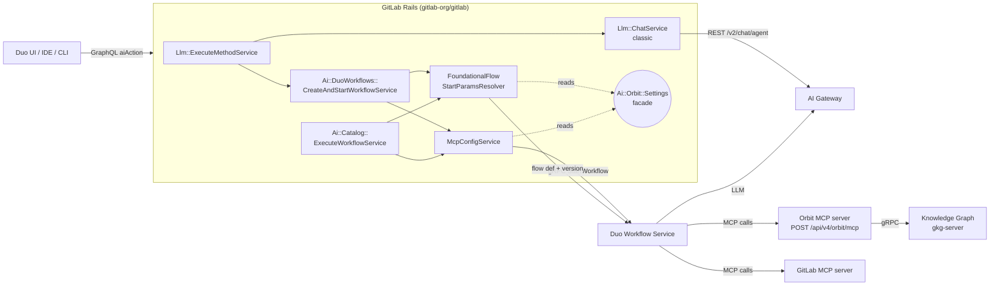

# Duo / Orbit prompt routing architecture

<!-- Validated against gitlab-org/gitlab master -->
<!-- SHA: ddb26ef47755adef4c2168c9aac92e2bc3d91794 -->
<!-- Date: 2026-05-18 -->

## Overview

This document describes how a user prompt is routed from a GitLab Duo surface
through GitLab Rails to the GitLab Duo Workflow Service (DWS) and the AI Gateway,
and where the Knowledge Graph (Orbit) attaches to that flow. It describes
the three independent routing *patterns* that decide whether an in-flight
prompt sees Orbit tooling — one per Rails seam — and shows how each pattern
behaves with Orbit on vs. off across the affected surfaces (Duo Chat, Duo
Developer, foundational agents, custom AI Catalog agents).

The Knowledge Graph repository owns the service that backs the Orbit MCP tools
(`query_graph`, `get_graph_schema`, `list_commands`, `invoke_command`). The
routing decisions documented here, however, live in `gitlab-org/gitlab`. This
document is therefore a *consumer-side* description: it captures the invariants
the Knowledge Graph team relies on when reasoning about which prompts can reach
Orbit, which agents advertise our tools, and which feature flags gate the
overall surface.

**Scope**

In scope:

- The three routing patterns (MCP server injection, flow-version override,
  agent picker filter) and how they behave with Orbit on/off across Duo
  Chat, Duo Developer, foundational agents, and custom AI Catalog agents.
- The Rails gating facade (`Ai::Orbit::Settings`) and the three routing
  seams that decide whether Orbit tools reach DWS.
- The feature flags involved in turning Orbit on or off.

Out of scope:

- The internal implementation of `query_graph` and `get_graph_schema` (see
  [ADR 011](decisions/011_agent_command_surface.md) and the
  [querying design docs](querying/)).
- The DWS-side flow definitions and agent prompts; those live in the `ai-assist`
  repository.
- Authorization for graph queries; see [Security](security.md).

### Related design documents

The Orbit MCP tools that this doc gates are themselves designed in:

- **[ADR 011 — Agent command surface](decisions/011_agent_command_surface.md)** —
  defines the two-tool MCP surface (`list_commands`, `invoke_command`) and the
  catalog of commands (`query_graph`, `get_graph_schema`, `get_query_dsl`,
  `get_response_format`) that this doc routes prompts to.
- **[ADR 003 — Orbit API design](decisions/003_api_design.md)** — the REST and
  GraphQL surface (`/api/v4/orbit/*`) that Rails exposes; Workhorse calls it on
  every `query_graph` invocation.
- **[ADR 004 — Unified response schema](decisions/004_unified_response_schema.md)** —
  the response shape DWS receives when it calls `query_graph`.
- **[ADR 008 — Workhorse query acceleration](decisions/008_workhorse_query_acceleration.md)** —
  why `query_graph` runs through Workhorse and not the GKG executor (the reason
  Rails still intercepts that command in the agent command surface).
- **[Querying overview](querying/README.md)** — the agent command discovery
  contract; this doc describes when prompts can reach those commands at all.
- **[Security](security.md)** — every Orbit tool call passes through Rails
  redaction; this doc is the upstream gate that decides if the tool call
  happens.

**Sources**

- Re-validated against `gitlab-org/gitlab` master at commit
  [`ddb26ef4`](https://gitlab.com/gitlab-org/gitlab/-/commit/ddb26ef4) on
  2026-05-18, which includes the new `code_review/*` exclusion in
  `McpConfigService` (commit `ddb26ef4`, "fix: Exclude Duo Code Review from
  Orbit foundational catch-all"). Previous validation point was
  `ee4b7d413100` on 2026-05-14; the `developer/v1` Orbit branch landed in
  [MR !235544](https://gitlab.com/gitlab-org/gitlab/-/merge_requests/235544)
  (`6045aabbdb81`).
- Based on internal research notes and validated against the upstream
  implementation files cited throughout this document.

## Vocabulary

| Term | Meaning |
|---|---|
| **DWS** | GitLab Duo Workflow Service. Python service in the `ai-assist` repository that executes foundational flows and agents. Receives a gRPC start payload from Rails containing the flow ID, version, MCP server configuration, and auth. |
| **Flow** | A YAML definition in `ai-assist` describing agents, prompts, toolsets, and routers. Flows are baked into the DWS container at build time via `fetch-foundational-agents` / `fetch-foundational-flows`. |
| **Foundational agent** | An entry in `Ai::FoundationalChatAgentsDefinitions` whose `reference`/`version` pair (for example `duo_planner/v1`) names a flow shipped with DWS. Rails owns picker visibility; DWS owns execution. Several foundational agents are *also* AI Catalog items (linked via the entry's `global_catalog_id`), which gives them a second, parallel execution path through `Ai::Catalog::ExecuteWorkflowService`. See [Foundational agents are also AI Catalog items](#foundational-agents-are-also-ai-catalog-items). |
| **MCP** | Model Context Protocol. The transport used between DWS and external tool servers, including the Orbit MCP server at `/api/v4/orbit/mcp`. |
| **Toolset** | The list of tool names the LLM is told about in its system prompt. A tool must appear both in the MCP server config (reachable) and in the agent's toolset (advertised) before the model will use it. |
| **Orbit MCP server** | The `orbit:` entry in the `McpServers` payload produced by `Ai::DuoWorkflows::McpConfigService`. The payload Rails sends carries only `Headers`, `PreApprovedTools`, optional `Tools`, and `Trusted`; the URL the MCP client dials (`/api/v4/orbit/mcp`) is supplied by DWS's MCP client configuration based on the server name. Rails proxies tool calls from there to GKG. |

## Architecture at a glance

Every Duo prompt enters Rails through a GraphQL mutation and then takes one of
two paths to the model.

- **Classic chat** never touches DWS, never asks Rails to assemble an MCP
  server list, and therefore **never sees Orbit**. It is the legacy path and is
  being retired in favor of agentic chat.
- **Agentic / DAP path** asks Rails to assemble an `McpServers` payload (which
  is where the Orbit MCP server is conditionally added) and, for some
  foundational flows, to override the flow version. DWS receives the payload
  over gRPC and executes the flow.

Two facts fall out of this and structure everything that follows.

- **Classic chat cannot reach Orbit.** Orbit attaches only on the agentic path.
- **There are exactly two places where Orbit attaches.** One adds (or omits) the
  Orbit MCP server in the payload sent to DWS; the other can swap the flow
  version to an Orbit-aware variant. Everything else — picker filtering, tool
  approval, system-prompt content — is either pre-flight (the picker) or
  downstream of these two places (the DWS flow definitions, the model).

A third place — the foundational agent picker — controls whether the
*dedicated* Orbit agent appears as a selectable option, but it is pre-flight
visibility, not in-flight routing.

<details>
<summary>Full diagram and Rails entry points</summary>

The two paths in concrete Rails terms:

1. **Classic chat** — `Llm::ChatService` calls AI Gateway directly. This path
   never touches DWS, never calls `McpConfigService`, and therefore **never
   sees Orbit**.
2. **Agentic / DAP path** — `Ai::DuoWorkflows::CreateAndStartWorkflowService`
   or `Ai::Catalog::ExecuteWorkflowService` calls `Ai::DuoWorkflows::McpConfigService`
   to assemble the `McpServers` payload and (for foundational flows)
   `Ai::DuoWorkflows::FoundationalFlowStartParamsResolver` to choose the flow
   definition and version. DWS receives the payload over gRPC and executes the
   flow.



The three seams that decide Orbit's involvement are `McpConfigService`
(adds/omits the `orbit:` server), `FoundationalFlowStartParamsResolver`
(picks the flow version, including Orbit-aware variants), and
`FoundationalChatAgentsResolver` (hides the dedicated Orbit agent from the
chat picker). They are described in
[The three routing seams](#the-three-routing-seams) below.

</details>

## Foundational agents are also AI Catalog items

A foundational agent and a custom AI Catalog agent are not two different
*kinds of object*. They are two different *provenance + execution-path* labels
on the same underlying catalog row. Once you accept that, the catalog-vs.-
picker split inside Pattern 1 below stops looking redundant.

In plain English: an agent like the Planner is both a "foundational agent"
(it ships with GitLab, it has a known reference like `duo_planner/v1`, the
Duo Chat agent picker can offer it) **and** a row in the AI Catalog at
`/explore/ai-catalog/agents/348/`. The catalog row is the editing surface for
the agent's prompt and toolset; the foundational reference is what the
DWS-side flow YAML is named after. Both views describe the same agent.

The practical consequence is that the same agent can be launched in two
different ways, and the two ways take **different code paths in Rails**:

- Through the Duo Chat foundational agent picker — Rails uses the
  *foundational* path and DWS loads the pre-baked flow YAML.
- Through the AI Catalog "Run" UI — Rails uses the *catalog* path and DWS
  loads the generic `ai_catalog_agent` flow, configured at runtime from JSON
  Rails sends.

These two paths hit different Orbit gates (see Seam A below), which is the
single most confusing part of the system. Foundational agents that do not
have a catalog row (`chat`, `orbit_agent`, `duo_permissions_assistant`) only
have the foundational path.

<details>
<summary>Definition source, classification predicates, and the path table</summary>

The source of truth is `ee/lib/ai/foundational_chat_agents_definitions.rb`.
Each entry has a `reference`, a `version`, and an optional `global_catalog_id`:

| `id` | `reference` | `version` | `global_catalog_id` | Name |
|---|---|---|---|---|
| 1 | `chat` | `""` | `nil` | GitLab Duo |
| 2 | `orbit_agent` | `v1` | `nil` | Orbit |
| 3 | `duo_planner` | `v1` | `348` | Planner |
| 4 | `security_analyst_agent` | `v1` | `356` | Security Analyst |
| 5 | `analytics_agent` | `v1` | `1003596` | Data Analyst |
| 6 | `ci_expert_agent` | `v1` | `1004583` | CI Expert |
| 7 | `duo_permissions_assistant` | `v1` | `nil` | Permissions Assistant |

When `global_catalog_id` is set, an AI Catalog item with that `id` exists and
is the authoring surface for the agent. The Planner (catalog ID `348`),
Security Analyst, Data Analyst, and CI Expert all have this dual nature. The
agent's prompts and toolset are edited in the AI Catalog UI at
`/explore/ai-catalog/agents/<global_catalog_id>/`, and the DWS image bakes a
copy of the same configuration at build time (`fetch-foundational-agents`
pulls catalog items by their `global_catalog_id` and writes flow YAML —
`duo_planner.yml`, `security_analyst_agent.yml`, and so on — into the image).

The classification predicates on `Ai::Catalog::Item` reflect this:

- `Item#foundational_chat_agent?` returns `true` when a
  `FoundationalChatAgent` row has `global_catalog_id == self.id`. Catalog
  item `348` is therefore a foundational chat agent.
- `Item#custom_agent?` is defined as `agent? && !foundational_chat_agent?`.
  Catalog item `348` is *not* a custom agent.

The practical consequence is that the same catalog item has **two execution
paths**:

| Path | Triggered by | Service | `workflow_definition` sent to DWS | What DWS loads |
|---|---|---|---|---|
| **Foundational path** | Duo Chat foundational agent picker | `Ai::DuoWorkflows::CreateAndStartWorkflowService` | the agent's `reference/version` (e.g. `duo_planner/v1`) | The flow YAML baked into the image (e.g. `duo_planner.yml`) |
| **Catalog path** | `/explore/ai-catalog/agents/<id>/` "Run" UI | `Ai::Catalog::ExecuteWorkflowService` | `ai_catalog_agent` (constant — see `determine_workflow_definition`) | The generic `ai_catalog_agent` flow, configured at runtime from the JSON Rails sends |

Both paths execute the same logical agent — same prompts, same intended
toolset — but they reach DWS through different code, with different workflow
definitions, and they hit different Orbit gates in `McpConfigService`
(`foundational_enabled?` vs. `custom_agents_enabled?`; see Seam A below).
Foundational agents that lack a `global_catalog_id` (GitLab Duo, the dedicated
Orbit agent, the Permissions Assistant) only have the foundational path.

This is why the catalog/custom distinction below is described as a
*provenance and execution-path split*, not a UI vs. backend split: both kinds
of agents are rows in `ai_catalog_items` and both are edited through the same
catalog UI. What differs is whether a `FoundationalChatAgent` entry points at
the catalog row, which workflow definition DWS receives, and whether DWS has
a pre-baked flow YAML on disk.

</details>

## The Orbit gating facade

Every Orbit on/off decision in Rails goes through a single module,
`Ai::Orbit::Settings`. Anywhere in the codebase that needs to know "is Orbit
available for this user, on this surface?" calls into this facade rather than
reading feature flags directly.

The facade exposes one predicate per Duo surface class: agentic chat, the
dedicated Orbit agent, "other" foundational agents, and user-built custom
catalog agents. All four predicates apply the same three-layer evaluation:

1. **Platform-level kill switches.** Two feature flags must both be on, or
   nothing else matters and every predicate returns `false`. These exist so
   the Knowledge Graph and the foundational-agent integration can be turned
   off at the platform level.
2. **Per-user preference flag.** If the per-user preference rollout flag is
   off, the platform falls back to the legacy behaviour: every workflow gets
   Orbit tools whenever the platform is available.
3. **Per-user killswitch and four granular subsettings.** A boolean on the
   user's preference (`orbit_enabled`) plus a small JSON object with four
   checkboxes (one per surface class). Defaults are permissive: a user who
   only sets `enabled: true` is opted into all four surfaces.

There is one carve-out: GitLab team members get the standalone Orbit agent on
by default until they explicitly save their `/preferences` form. This applies
only to the `agent` subsetting and only on Seams A and C (see below).

A separate helper, `killswitch_on?(user)`, reads only the saved
`orbit_enabled` boolean without applying the platform flags or the
preference-flag fallback. It is used by the preferences UI to decide whether
to render subsetting checkboxes as live or greyed out, and — importantly for
this document — it is the predicate that **Seam B** uses for the Orbit-aware
developer flow. The fact that Seams A and B use different predicates is the
source of the consistency gap discussed in
[Implications](#implications-and-recommendations).

<details>
<summary>Predicate names, feature flags, and per-subsetting mapping</summary>

`Ai::Orbit::Settings` lives at `ee/app/models/ai/orbit/settings.rb`. The four
predicates are:

```ruby
Ai::Orbit::Settings.agent_enabled?(user)         # orbit_agent/v1
Ai::Orbit::Settings.chat_enabled?(user)          # agentic chat (workflow_definition: 'chat')
Ai::Orbit::Settings.foundational_enabled?(user)  # other foundational agents and flows
Ai::Orbit::Settings.custom_agents_enabled?(user) # user-built AI Catalog agents
```

All four evaluate the same three layers in order:

1. **Platform-level kill switches.** Both feature flags must be on for *any*
   Orbit functionality to be available:
   - `:knowledge_graph` (`wip`) — gates the underlying graph service.
   - `:orbit_foundational_agent` (`gitlab_com_derisk`) — gates the foundational
     agent integration.

   If either is off for the user, all four predicates return `false`.
2. **Per-user preference flag.** `:orbit_user_preference` (`beta`).
   - **Flag off** (current default): every workflow gets Orbit tools whenever
     the platform is available. This is the pre-`!234196` legacy baseline.
   - **Flag on**: layer 3 governs.
3. **Per-user killswitch + four granular subsettings.** Persisted on
   `user.user_preference`:
   - `orbit_enabled` (boolean) — the master killswitch. If `false`, all four
     predicates return `false`.
   - `orbit_settings` (JSON) — per-surface checkboxes:
     - `orbit_agent_enabled` → `agent_enabled?`
     - `orbit_agentic_chat_enabled` → `chat_enabled?`
     - `orbit_other_foundational_agents_enabled` → `foundational_enabled?`
     - `orbit_custom_agents_enabled` → `custom_agents_enabled?`

   Each subsetting defaults to `true` when missing from the JSON, so a user who
   only sets `{ "enabled": true }` is opted into all four surfaces.

**GitLab team member carve-out (`:agent` only).** Before layer 3's killswitch
check, `subsetting_enabled?` short-circuits to `true` when all of the
following hold: the subsetting is `:agent`, the user is a GitLab team member
(`user.gitlab_team_member?`), and the user has never saved the preference form
(`preference.orbit_settings.key?('enabled')` is false). The standalone Orbit
agent is therefore on by default for team members until they explicitly save
their `/preferences`. This affects Seam A when the workflow is `orbit_agent/v1`
and Seam C (picker visibility) only; it does not extend to chat, foundational,
or custom-agent subsettings.

A convenience reader `Ai::Orbit::Settings.killswitch_on?(user)` reads only the
saved `orbit_enabled` boolean and ignores layers 1 and 2. It is used by the
preference UI to decide whether to render subsetting checkboxes as live or
greyed out. **It is *not* the same gate as the four `_enabled?` predicates** —
they wrap the same boolean plus the platform flags — and it has a separate
caller on the routing path that is the focus of
[Seam B](#seam-b--flow-version-override-foundational-flows).

</details>

## The three routing seams

### Seam A — MCP server injection

Seam A is the *only* path by which the Orbit MCP server becomes reachable
from DWS. It runs every time Rails is about to start a flow on the agentic
path: agentic chat, the developer flow, foundational agents launched through
the picker, and any catalog agent launched through the "Run" UI. The job is
to assemble the `McpServers:` payload sent to DWS.

For each call, Rails classifies the workflow into one of four buckets and
asks the matching `Ai::Orbit::Settings` predicate whether Orbit is allowed
for this user on this surface. If yes, the `orbit:` MCP server is added to
the payload; if no, the entry is simply absent and DWS does not know Orbit
exists for this run.

The four buckets are checked in this order: **custom agent → dedicated Orbit
agent → agentic chat → everything else (foundational catch-all)**. Custom
agents are checked first because they can run with any workflow definition
(including `'chat'`), and the user-built nature of the agent takes
precedence over the workflow category. There is also a small but recent
exclusion: workflows whose definition starts with `code_review/` are
explicitly excluded from the catch-all and never get Orbit injected
(introduced 2026-05-14 in [commit `ddb26ef4`](https://gitlab.com/gitlab-org/gitlab/-/commit/ddb26ef4)).
Duo Code Review is flat-rate; the exclusion holds until the code review flow
integrates Orbit deliberately and is benchmarked.

When the gate passes, the tools listed in the payload depend on whether the
agent is a true custom agent (intersection of the catalog's selected tools
and the Orbit pre-approved tool set, with the `Tools` field set so DWS
restricts the toolset) or anything else (full pre-approved tool set, with
the `Tools` field omitted so DWS lists every tool the server exposes).

The whole Seam A path is additionally gated by the `:mcp_client` feature
flag. If that flag is off, Rails sends *no* MCP servers (Orbit or otherwise)
to DWS, regardless of the per-surface predicate.

<details>
<summary>File, code, and bucket mapping</summary>

**File**: `ee/app/services/ai/duo_workflows/mcp_config_service.rb`.

`McpConfigService` produces the `McpServers:` map that DWS receives in its gRPC
start payload. It is called from three places:

- `Ai::DuoWorkflows::CreateAndStartWorkflowService` — agentic chat and the
  developer flow.
- `Ai::Catalog::ExecuteWorkflowService` — flows launched from the AI Catalog.
- `Api::Helpers::DuoWorkflowHelpers` — the public `/api/v4/ai/duo_workflows`
  endpoint and similar API surfaces.

This service is the *only* path by which the Orbit MCP server becomes reachable
from DWS.

#### Workflow → subsetting mapping

```ruby
def orbit_enabled_for_flow?
  if custom_agent?
    Ai::Orbit::Settings.custom_agents_enabled?(current_user)
  elsif orbit_agent?                  # workflow_definition.starts_with?('orbit_agent')
    Ai::Orbit::Settings.agent_enabled?(current_user)
  elsif agentic_chat?                 # workflow_definition == 'chat'
    Ai::Orbit::Settings.chat_enabled?(current_user)
  elsif code_review?                  # workflow_definition.starts_with?('code_review/')
    false                             # Duo Code Review is flat-rate;
                                      # exclude until it integrates Orbit deliberately
  else
    Ai::Orbit::Settings.foundational_enabled?(current_user)
  end
end
```

Custom agents are checked first because they can run with any
`workflow_definition` (including `'chat'`); the user-built nature of the agent
takes precedence over the workflow category. The `code_review?` branch was
introduced after the initial validation point of this doc; see the
**Sources** note in the [Overview](#overview) above.

#### Tool sets sent to DWS

When the gate passes, the `orbit:` entry added to the payload is:

```ruby
{
  orbit: {
    Headers: { Authorization: "Bearer <gitlab_token>" },
    PreApprovedTools: tools,
    Tools: tools,        # only set for custom agents
    Trusted: true
  }
}
```

`tools` is computed by `orbit_tools_to_inject`:

- **Non-custom agents** (agentic chat, dedicated Orbit agent, foundational
  agents): the full `ORBIT_PREAPPROVED_TOOLS`, sourced from
  `API::Orbit::McpHandlers::ToolCatalog::TRUSTED_TOOL_NAMES`:
  `["query_graph", "get_graph_schema", "list_commands", "invoke_command"]`.
  The `Tools` field is **omitted**, so DWS lists every tool the server exposes.
- **Custom agents**: only the intersection of the catalog item's
  `def_mcp_tools` with `ORBIT_PREAPPROVED_TOOLS`. The `Tools` field is **set**
  so DWS surfaces only the selected subset.

When the gate returns `false`, the `orbit:` key is simply absent. DWS does not
know Orbit exists, the agent's tool list contains neither `query_graph` nor
`get_graph_schema`, and the prompt is constructed without any Orbit references.

#### Cross-cutting requirements

- The whole MCP path is gated by `Feature.enabled?(:mcp_client, current_user)`
  (`gitlab_com_derisk`). If `mcp_client` is off, `execute` returns `nil` before
  any other gate is evaluated, so no MCP servers are sent regardless of Orbit
  state.
- For custom agents, the further flag `:mcp_catalog_agent_tools` must be on for
  `agent_mcp_tools_enabled?` to return `true`. Without it, `custom_agent?` is
  false and the user's selection of Orbit tools on the catalog item has no
  effect on routing.
- `Feature.enabled?(:orbit_mcp_command_tools, user)` switches the *visible*
  Orbit tools surfaced by `API::Orbit::McpHandlers::ToolCatalog::visible_tool_names`
  between the legacy `[query_graph, get_graph_schema]` and the command-pair
  `[list_commands, invoke_command]`. It does not change `TRUSTED_TOOL_NAMES`,
  which is always all four; DWS receives all four in `PreApprovedTools`. The
  command-pair surface itself is designed in
  [ADR 011 — Agent command surface](decisions/011_agent_command_surface.md).

</details>

### Seam B — Flow version override (foundational flows)

Seam B is a smaller, more specialised seam. When a foundational flow starts,
Rails picks the flow configuration and version that DWS should load. Most
foundational flows go straight to their default version. Two flows
(`developer/v1` and `fix_pipeline/v1`) have overrides: `developer/v1` can
flip to an Orbit-aware variant (`2.0.0-orbit`) whose system prompt is tuned
to use graph tools, and `fix_pipeline/v1` can flip to an unrelated
experimental variant.

Only `developer/v1` is Orbit-aware today. Other foundational flows reach
Orbit through Seam A (MCP injection) only; their system prompt and toolset
are the same with Orbit on or off.

Two things about this seam matter for the rest of the doc.

- **The Orbit branch is checked before the experimental "next" branch.**
  A developer-flow user who has both flags can only land on the experimental
  variant if Orbit is *not* selected for them; the Orbit variant wins.
- **The Orbit gate here is *not* `foundational_enabled?`.** It is a separate
  feature flag (`:duo_developer_orbit`) ANDed with the killswitch-only
  predicate `killswitch_on?`. This is the gap with Seam A: a user can in
  principle be inside one gate and outside the other, with awkward
  consequences. See [Implications](#implications-and-recommendations) for
  the failure modes this enables.

<details>
<summary>File, code, and rationale</summary>

**File**: `ee/lib/ai/duo_workflows/foundational_flow_start_params_resolver.rb`.

When a foundational flow starts, this resolver decides which DWS flow
configuration and flow version to load. Most flows go straight to their
default `foundational_flow_reference` and `flow_version`. The resolver
applies overrides for the `developer/v1` and `fix_pipeline/v1` flows.

```ruby
def self.resolve_with_overrides(flow, container, user)
  case flow.foundational_flow_reference
  when 'developer/v1'
    if Feature.enabled?(:duo_developer_orbit, user) && ::Ai::Orbit::Settings.killswitch_on?(user)
      return ['developer/v1', '2.0.0-orbit']
    end

    if Feature.enabled?(:duo_developer_next_unstable, container) ||
        Feature.enabled?(:duo_developer_next_unstable, container.root_ancestor)
      return ['developer_unstable/experimental', ::Ai::Catalog::FoundationalFlow::DEFAULT_FLOW_VERSION]
    end
  when 'fix_pipeline/v1'
    if Feature.enabled?(:fix_pipeline_next, container) ||
        Feature.enabled?(:fix_pipeline_next, container.root_ancestor)
      return ['fix_pipeline_next/v1', ::Ai::Catalog::FoundationalFlow::DEFAULT_FLOW_VERSION]
    end
  end

  [flow.foundational_flow_reference, flow.flow_version]
end
```

Two consequences of how this is shaped today:

1. **The Orbit branch is checked before `duo_developer_next_unstable`.** A user
   on the unstable flow flag will only end up on `developer_unstable/experimental`
   if Orbit is *not* selected for them; the Orbit variant takes priority.
2. **The Orbit gate here is not `foundational_enabled?`.** It is the
   conjunction `Feature.enabled?(:duo_developer_orbit, user) && Ai::Orbit::Settings.killswitch_on?(user)`.
   `duo_developer_orbit` (`gitlab_com_derisk`) is a separate de-risking flag
   used to roll out the `2.0.0-orbit` developer flow independently of the
   broader foundational-agent gate. `killswitch_on?` reads only the saved
   `orbit_enabled` boolean and bypasses the `orbit_user_preference` flag and
   the platform-availability flags.

   See [Implications](#implications-and-recommendations) for the consistency
   problem this creates with Seam A.

`fix_pipeline/v1` and the other foundational flows have no Orbit-specific
version yet. They reach Orbit through Seam A (MCP injection) only; the
system prompt and toolset they receive is the same with Orbit on or off.

</details>

### Seam C — Foundational agent picker (pre-flight)

Seam C is the third place `Ai::Orbit::Settings` changes Duo's user
experience. It hides the dedicated Orbit foundational agent from the
foundational agent picker when the user does not have the standalone agent
enabled. The user simply does not see "Orbit" as a selectable agent.

This is pre-flight visibility, not in-flight routing — there is no prompt to
route yet at this point — but it is grouped with the seams because, like
Seam A and Seam B, it is an observable consequence of the Orbit settings.

<details>
<summary>File, scope, and the third diagram</summary>

**File**: `ee/app/graphql/resolvers/ai/foundational_chat_agents_resolver.rb`.

The dedicated Orbit foundational agent (`reference: 'orbit_agent'`, name
"Orbit", ID `2` in `Ai::FoundationalChatAgentsDefinitions`) is filtered out of
the picker when `Ai::Orbit::Settings.agent_enabled?(user)` is false. The user
simply does not see it as an option.

This is not routing of an in-flight prompt — it is pre-flight visibility — but
it is the third place Orbit settings change Duo's user experience. The picker
filter, the MCP injection, and the flow-version override are the three
observable effects of `Ai::Orbit::Settings`.

```mermaid
flowchart TD
    Settings((Ai::Orbit::Settings))
    Settings -->|chat_enabled?<br/>foundational_enabled?<br/>agent_enabled?<br/>custom_agents_enabled?| McpCfg[Seam A:<br/>McpConfigService]
    Settings -->|killswitch_on?<br/>+ duo_developer_orbit| Resolver[Seam B:<br/>FoundationalFlowStartParamsResolver]
    Settings -->|agent_enabled?| Picker[Seam C:<br/>FoundationalChatAgentsResolver]

    McpCfg -->|+/- orbit: server| DWS
    Resolver -->|developer/v1@2.0.0 vs 2.0.0-orbit| DWS
    Picker -->|+/- Orbit agent visible| UI[Duo agent picker UI]
```

</details>

## Routing patterns

Instead of enumerating every `{surface} × {Orbit on/off}` cell (which
duplicates the seam description), this section describes the three routing
*patterns* the system supports. Each pattern corresponds to one seam, lists
which surfaces it applies to, and shows side-by-side what Orbit on vs. off
produces for the LLM (or the user) on those surfaces.

The three patterns are independent dials: a single prompt can be affected by
all three (developer flow with Orbit on), by one or two (agentic chat: only
Pattern 1), or by none (classic chat: outside every seam).

Two non-routing details are worth keeping in mind while reading the
patterns:

- The same agent can take two different code paths to DWS depending on the
  launch surface (Duo Chat picker vs. AI Catalog "Run" UI). See
  [Foundational agents are also AI Catalog items](#foundational-agents-are-also-ai-catalog-items)
  above. Within Pattern 1 below, that distinction picks which Seam A bucket
  the workflow falls into (`foundational_enabled?` for the picker path,
  `custom_agents_enabled?` for the catalog path on a custom item).
- Classic Duo Chat (`Llm::ChatService`) never reaches `McpConfigService`, so
  it is invisible to every pattern below. The Orbit toggle has no effect on
  classic chat; it is being deprecated in favor of agentic chat. The
  patterns below describe what happens once a prompt is on the agentic /
  DWS path.

### Pattern 1: MCP server injection (Seam A)

**What it does.** Decides whether the `orbit:` MCP server is added to the
payload Rails sends to DWS. With Orbit on, DWS receives an `orbit:` entry
and the LLM sees `query_graph`, `get_graph_schema`, `list_commands`, and
`invoke_command` as available tools. With Orbit off, the `orbit:` entry is
simply absent and the LLM has no way to know Orbit exists for this run.

**Where it applies.** Every workflow that reaches `McpConfigService`:
agentic chat, the developer flow, foundational agents launched through the
picker, the dedicated Orbit agent, and any catalog agent launched through
the "Run" UI. The pattern itself is universal; what differs across surfaces
is which `Ai::Orbit::Settings` predicate is consulted (see
[Seam A](#seam-a--mcp-server-injection) for the bucket logic and the
ordering rule).

**Surface comparison.** The table below shows what the LLM sees on each
surface with Orbit on vs. off. Every row is additionally gated by
`:mcp_client` — when that flag is off, *no* MCP server is sent regardless of
the per-surface predicate.

| Surface | `workflow_definition` | Seam A bucket / predicate | Orbit OFF | Orbit ON |
|---|---|---|---|---|
| Agentic Duo Chat | `chat` | `agentic_chat?` → `chat_enabled?` | `gitlab:` MCP server only; chat ReAct tools | `gitlab:` + `orbit:` MCP servers; chat ReAct tools + 4 Orbit tools |
| Duo Developer | `software_development` (DWS-side ID for `developer/v1`) | catch-all → `foundational_enabled?` | `gitlab:` MCP server only; developer toolset (GitLab read, Git, file-edit, run-commands) | `gitlab:` + `orbit:` MCP servers; developer toolset + Orbit tools. Combine with Pattern 2 for the Orbit-aware system prompt. |
| Dedicated Orbit agent | `orbit_agent/v1` | `orbit_agent?` → `agent_enabled?` | Agent hidden from picker by Pattern 3; never reaches Seam A | `gitlab:` + `orbit:` MCP servers; the Orbit agent's "intelligence analyst with KG access" system prompt already references the tools |
| Other foundational agents (Planner, Security Analyst, Data Analyst, CI Expert, Permissions Assistant) launched via the chat picker | `<agent_reference>/v1` (e.g. `analytics_agent/v1`) | catch-all → `foundational_enabled?` | `gitlab:` MCP server only; agent's curated toolset (e.g. Data Analyst has `run_glql_query` natively) | `gitlab:` + `orbit:` MCP servers. **Caveat:** the LLM only actually calls the Orbit tools when the agent's `toolset:` in its `ai-assist` flow YAML lists them; today only the Orbit agent itself does. The Data Analyst is in flight under [`gitlab-org/gitlab#598823`](https://gitlab.com/gitlab-org/gitlab/-/issues/598823). |
| Custom AI Catalog agent (catalog "Run" UI) | `ai_catalog_agent` | `custom_agent?` → `custom_agents_enabled?` | `gitlab:` MCP server only; whatever the catalog item selected, minus any Orbit tools | `gitlab:` + `orbit:` MCP servers with the `orbit:` toolset *intersected* with the catalog item's `def_mcp_tools` and `ORBIT_PREAPPROVED_TOOLS`. **Known gap:** the catalog payload builder ignores `def_mcp_tools`, so the LLM's `toolset` does not list the Orbit tools even though the server is reachable. See `<details>` below. |
| Foundational agent launched via the catalog UI (`/explore/ai-catalog/agents/<id>/` Run) | `ai_catalog_agent` | catch-all → `foundational_enabled?` (`custom_agent?` is false because a `FoundationalChatAgent` row points at the catalog item) | `gitlab:` MCP server only | `gitlab:` + `orbit:` MCP servers with the full `ORBIT_PREAPPROVED_TOOLS`. The toolset hits the same `ai-assist` advertisement caveat as the picker path. |
| Code review (`code_review/*`) | `code_review/<sub-flow>` | hard-coded `false` (since [`ddb26ef4`](https://gitlab.com/gitlab-org/gitlab/-/commit/ddb26ef4)) | `gitlab:` MCP server only | Same as OFF. The catch-all is bypassed; this carve-out holds until Duo Code Review integrates Orbit deliberately and is benchmarked. |
| Classic Duo Chat (`Llm::ChatService`) | n/a | `McpConfigService` not called | Built-in chat ReAct tools only | Same as OFF — pattern does not apply. |

<details>
<summary>Concrete <code>orbit:</code> payload, the tools selected for custom vs. non-custom agents, and the <code>.except(:orbit)</code> invariant</summary>

When the gate passes, the `orbit:` entry added to the payload is:

```ruby
{
  orbit: {
    Headers: { Authorization: "Bearer <gitlab_token>" },
    PreApprovedTools: tools,
    Tools: tools,        # only set for custom agents
    Trusted: true
  }
}
```

`tools` is computed by `McpConfigService#orbit_tools_to_inject`:

- **Non-custom agents** (agentic chat, dedicated Orbit agent, picker-launched
  foundational agents, foundational agents launched via the catalog UI): the
  full `ORBIT_PREAPPROVED_TOOLS`, sourced from
  `API::Orbit::McpHandlers::ToolCatalog::TRUSTED_TOOL_NAMES`:
  `["query_graph", "get_graph_schema", "list_commands", "invoke_command"]`.
  The `Tools` field is **omitted**, so DWS lists every tool the server
  exposes.
- **Custom agents**: only the intersection of the catalog item's
  `def_mcp_tools` with `ORBIT_PREAPPROVED_TOOLS`. The `Tools` field is
  **set** so DWS surfaces only the selected subset.

When the gate returns `false`, the `orbit:` key is simply absent. DWS does
not know Orbit exists, the agent's tool list contains neither `query_graph`
nor `get_graph_schema`, and the prompt is constructed without any Orbit
references.

**The `.except(:orbit)` invariant.** `McpConfigService#execute` assembles
its output as
`gitlab_mcp_server.merge(orbit_mcp_server).merge(ai_catalog_mcp_servers.except(:orbit))`.
The trailing `.except(:orbit)` ensures a catalog item cannot register a
server named `orbit:` of its own — the only `orbit:` entry in the final
payload is the one produced by `McpConfigService#orbit_mcp_server`. The
Orbit MCP server is a Rails-owned identity, not a user-configurable one.

**Known gap: custom-agent toolset assembly.**
`Ai::Catalog::DuoWorkflowPayloadBuilder::V1#agent_toolset` builds the
per-step `toolset` that the system prompt sees from `BuiltInTool` records
only — it does **not** read `version.def_mcp_tools`. Even when the Orbit
MCP server is correctly injected by Seam A, the system prompt the LLM sees
does not list `query_graph` and `get_graph_schema`. The model correctly
reports "I don't have a graph tool" because, from its point of view, it
does not. The MCP plumbing is fine; the catalog-agent toolset assembly is
the bug. The fix lives outside this repository in `gitlab-org/gitlab` and
is tracked separately.

**Cross-cutting requirements**:

- `Feature.enabled?(:mcp_client, current_user)` (`gitlab_com_derisk`). If
  off, `execute` returns `nil` before any other gate is evaluated and no
  MCP servers are sent, Orbit or otherwise.
- For custom agents, `:mcp_catalog_agent_tools` must be on for
  `agent_mcp_tools_enabled?` to return `true`. Without it, `custom_agent?`
  is false and the user's selection of Orbit tools on the catalog item has
  no effect on routing.
- `Feature.enabled?(:orbit_mcp_command_tools, user)` switches the *visible*
  Orbit tools surfaced by
  `API::Orbit::McpHandlers::ToolCatalog::visible_tool_names` between the
  legacy `[query_graph, get_graph_schema]` and the command-pair
  `[list_commands, invoke_command]`. It does not change
  `TRUSTED_TOOL_NAMES`, which is always all four; DWS receives all four in
  `PreApprovedTools`. The command-pair surface itself is designed in
  [ADR 011 — Agent command surface](decisions/011_agent_command_surface.md).

</details>

### Pattern 2: Flow version override (Seam B)

**What it does.** For the developer flow, swaps the DWS-side flow version
from the default `developer/v1@2.0.0` to the Orbit-aware variant
`developer/v1@2.0.0-orbit`. The variant has a different system prompt — one
tuned to use graph tools for impact analysis, caller discovery, and similar
tasks. The toolset listed by the prompt assumes the Orbit MCP server is
present (Pattern 1).

**Where it applies.** Only `developer/v1` today. `fix_pipeline/v1` has its
own (non-Orbit) override in the same resolver, but no `*-orbit` variant
exists. Every other foundational flow uses its default version regardless
of the Orbit setting; those flows reach Orbit through Pattern 1 only.

**Surface comparison.** The on/off behavior for the developer flow:

| Aspect | Orbit OFF (`duo_developer_orbit` off OR `killswitch_on?` false) | Orbit ON (`duo_developer_orbit` on AND `killswitch_on?` true) |
|---|---|---|
| Resolver returns | `['developer/v1', '2.0.0']` | `['developer/v1', '2.0.0-orbit']` |
| DWS loads | Default developer system prompt and toolset | Orbit-aware system prompt; toolset lists graph tools |
| What the LLM sees | Standard developer toolset (GitLab read, Git, file-edit, run-commands). No graph tools mentioned. | Same base toolset + `query_graph` and `get_graph_schema` advertised in the prompt. Whether they are *callable* depends on Pattern 1. |
| Interaction with `duo_developer_next_unstable` | The unstable flag can flip the flow to `developer_unstable/experimental`. | The Orbit branch is checked first, so the Orbit variant wins when both flags are on for the same user. |

**Dual-gate caveat.** Pattern 1 (for the developer flow) checks
`foundational_enabled?`, but Pattern 2 checks `duo_developer_orbit` AND
`killswitch_on?`. These are different predicates that can disagree, with
two notable states:

- *Pattern 1 fires, Pattern 2 does not:* The MCP server is injected, but
  the flow stays on `2.0.0`. The agent has Orbit tools available but its
  system prompt does not encourage their use. This is the expected state
  during the `duo_developer_orbit` rollout.
- *Pattern 2 fires, Pattern 1 does not:* The flow flips to `2.0.0-orbit`
  but the `orbit:` MCP server is omitted. The agent's system prompt
  advertises graph tools that are not reachable. This is the failure mode
  flagged during the review of `!235544`.

See [Implication 1](#1-seams-a-and-b-use-different-gates-for-the-developer-flow)
for the recommended consolidation.

<details>
<summary>Resolver code, version-selection order, and rationale for the separate flag</summary>

`Ai::DuoWorkflows::FoundationalFlowStartParamsResolver.resolve_with_overrides`
encodes the override:

```ruby
def self.resolve_with_overrides(flow, container, user)
  case flow.foundational_flow_reference
  when 'developer/v1'
    if Feature.enabled?(:duo_developer_orbit, user) && ::Ai::Orbit::Settings.killswitch_on?(user)
      return ['developer/v1', '2.0.0-orbit']
    end

    if Feature.enabled?(:duo_developer_next_unstable, container) ||
        Feature.enabled?(:duo_developer_next_unstable, container.root_ancestor)
      return ['developer_unstable/experimental', ::Ai::Catalog::FoundationalFlow::DEFAULT_FLOW_VERSION]
    end
  when 'fix_pipeline/v1'
    if Feature.enabled?(:fix_pipeline_next, container) ||
        Feature.enabled?(:fix_pipeline_next, container.root_ancestor)
      return ['fix_pipeline_next/v1', ::Ai::Catalog::FoundationalFlow::DEFAULT_FLOW_VERSION]
    end
  end

  [flow.foundational_flow_reference, flow.flow_version]
end
```

`duo_developer_orbit` (`gitlab_com_derisk`) is a separate de-risking flag
that exists so the `2.0.0-orbit` variant can be rolled out independently of
the broader Orbit foundational gate. `killswitch_on?` reads only the saved
`orbit_enabled` boolean and bypasses the `orbit_user_preference` flag and
the platform-availability flags.

`fix_pipeline/v1` and the other foundational flows have no Orbit-specific
version yet. They reach Orbit through Pattern 1 only; the system prompt and
toolset they receive is the same with Orbit on or off.

</details>

### Pattern 3: Foundational agent picker filter (Seam C)

**What it does.** Hides or shows the dedicated Orbit foundational agent in
the Duo Chat agent picker. This is pre-flight visibility, not in-flight
routing — there is no prompt to route yet at this point — but it is the
third observable effect of the Orbit settings.

**Where it applies.** Only the dedicated Orbit foundational agent
(`reference: 'orbit_agent'`, name "Orbit", ID `2` in
`Ai::FoundationalChatAgentsDefinitions`). All other foundational agents are
always visible regardless of the Orbit setting.

**Surface comparison.**

| Aspect | Orbit OFF (`agent_enabled?` false) | Orbit ON (`agent_enabled?` true) |
|---|---|---|
| Orbit agent visible in the chat agent picker | No — filtered out by `FoundationalChatAgentsResolver` | Yes — picker offers "Orbit" as a selectable agent |
| Other foundational agents (GitLab Duo, Planner, Data Analyst, …) | Visible | Visible |
| What happens when the agent is selected | n/a (not visible) | Pattern 1 fires with the `orbit_agent?` bucket → `agent_enabled?` (which is already true here, so the MCP server is injected) |

The picker is filtered by user, not by query parameter. A user who lacks
`agent_enabled?` cannot manually navigate to "select Orbit agent" — the
agent is removed from the GraphQL response that backs the picker. There is
no equivalent filtering on the AI Catalog UI side; a catalog agent's
visibility is controlled by catalog ACLs, not by the Orbit settings.

<details>
<summary>File and GraphQL resolver</summary>

**File**: `ee/app/graphql/resolvers/ai/foundational_chat_agents_resolver.rb`.

The resolver filters the list returned by
`Ai::FoundationalChatAgentsDefinitions::DEFINITIONS` by calling
`Ai::Orbit::Settings.agent_enabled?(user)` for the `orbit_agent` entry and
omitting it when the predicate is false. See the mermaid diagram inside
[Seam C](#seam-c--foundational-agent-picker-pre-flight) for the
`Ai::Orbit::Settings` → seam fan-out across all three seams / patterns.

</details>

## Feature flag summary

Nine feature flags collectively decide whether Orbit attaches to any given
prompt. The first two are platform-level kill switches: with either off, no
Orbit predicate can ever return `true`. The third decides whether the
per-user preference is consulted at all. The fourth switches which Orbit
tools are *advertised* in the MCP `tools/list` (legacy two-tool surface vs.
the new command-pair from [ADR 011](decisions/011_agent_command_surface.md)).
The remaining five gate specific surfaces: `:mcp_client` is required for any
MCP server to be sent at all, `:mcp_catalog_agent_tools` is required for
custom agents, `:duo_developer_orbit` gates the Seam B flow-version
override, and `:duo_developer_next_unstable` / `:fix_pipeline_next` route
specific flows to experimental variants.

<details>
<summary>Full flag table with types, defaults, and effects</summary>

| Flag | Type | Default | Effect on Orbit routing |
|---|---|---|---|
| `knowledge_graph` | `wip` | off | Master platform gate. Off → no Orbit anywhere. |
| `orbit_foundational_agent` | `gitlab_com_derisk` | off | Second master gate. Off → no Orbit anywhere. |
| `orbit_user_preference` | `beta` | off | When on, the user preference (killswitch + four subsettings) is consulted by `Ai::Orbit::Settings`. When off, every workflow gets Orbit whenever the platform flags are on. |
| `orbit_mcp_command_tools` | `gitlab_com_derisk` | varies | Switches `visible_tool_names` from `[query_graph, get_graph_schema]` to `[list_commands, invoke_command]`. `TRUSTED_TOOL_NAMES` (the four-tool set sent in `PreApprovedTools`) is unchanged. |
| `mcp_client` | `gitlab_com_derisk` | off | Required by `McpConfigService#execute`. If off, no MCP server (Orbit or otherwise) is sent to DWS. |
| `mcp_catalog_agent_tools` | `development` | off | Required for custom-agent MCP tool injection. Without it, `custom_agent?` is false and Orbit tool selection on catalog items is ignored. Rollout uses targeted actor enablement rather than a default flip. |
| `duo_developer_orbit` | `gitlab_com_derisk` | off | Gates the `developer/v1` → `2.0.0-orbit` override in Seam B. Combined with `Ai::Orbit::Settings.killswitch_on?`. |
| `duo_developer_next_unstable` | `wip` | off | Routes `developer/v1` to `developer_unstable/experimental`. Checked *after* the Orbit branch in Seam B, so the Orbit variant wins when both apply. Scoped to `container` / `container.root_ancestor` at the call site. |
| `fix_pipeline_next` | `experiment` | off | Routes `fix_pipeline/v1` to `fix_pipeline_next/v1`. Unrelated to Orbit. Scoped to `container` / `container.root_ancestor` at the call site. |

</details>

## Decision table — "is Orbit on for this prompt?"

Rather than reason through the three layers of `Ai::Orbit::Settings` every
time, the table below collapses "is Orbit on for this prompt?" into a
single row per surface, one column per routing pattern. Each Pattern 1
cell is *additionally* gated by `:mcp_client`: when `mcp_client` is off,
`McpConfigService#execute` returns `nil` before any Orbit (or GitLab MCP)
server is assembled, so Pattern 1 is short-circuited regardless of the
per-surface predicate. Pattern 2 and Pattern 3 are not gated by
`mcp_client`. The team-member carve-out described in
[the gating facade](#the-orbit-gating-facade) affects the `agent_enabled?`
rows specifically.

<details>
<summary>Decision table per surface</summary>

| Surface | Pattern 1 (MCP injection, Seam A) | Pattern 2 (flow version, Seam B) | Pattern 3 (picker, Seam C) |
|---|---|---|---|
| Agentic chat (`workflow_definition: 'chat'`) | `chat_enabled?` | n/a | n/a |
| Dedicated Orbit agent (`orbit_agent/v1`) | `agent_enabled?` | n/a | `agent_enabled?` |
| Duo Developer (`software_development` / `developer/v1`) | `foundational_enabled?` | `duo_developer_orbit` + `killswitch_on?` | n/a |
| Other foundational agents (picker path) | `foundational_enabled?` | n/a (today) | n/a |
| Custom AI Catalog agent (catalog path) | `custom_agents_enabled?` | n/a | n/a |
| Foundational agent launched via catalog UI | `foundational_enabled?` | n/a | n/a |
| Code review (`code_review/*`) | hard-coded `false` (since `ddb26ef4`) | n/a | n/a |
| Classic Duo Chat | path bypasses `McpConfigService` | n/a | n/a |

`<predicate>_enabled?` predicates all evaluate the same three layers
internally (platform flags → `orbit_user_preference` → killswitch +
per-surface subsetting). They differ only in which subsetting key they
read.

</details>

## Where to look in code

The seams and the facade are the only places that matter for "which prompts
reach Orbit?". The detailed file-by-file index below is provided so that
follow-up MRs have a single jump-to map.

<details>
<summary>Code reference table</summary>

| Question | Where |
|---|---|
| Which subsettings exist? Which user preference fields back them? | `ee/app/models/ai/orbit/` |
| Which Orbit gate applies to which workflow? | `ee/app/services/ai/duo_workflows/mcp_config_service.rb` (`orbit_enabled_for_flow?`) |
| What tools land in the `orbit:` MCP server? | `ee/lib/api/orbit/mcp_handlers/` (`TRUSTED_TOOL_NAMES`, `visible_tool_names`) |
| What tools are picked for custom agents? | `ee/lib/ai/catalog/duo_workflow_payload_builder/`; `McpConfigService#agent_orbit_tools` |
| How is the developer flow version chosen? | `ee/lib/ai/duo_workflows/foundational_flow_start_params_resolver.rb` |
| Which foundational agents exist? | `ee/lib/ai/` (search for `FoundationalChatAgentsDefinitions`) |
| How is the Orbit agent hidden in the picker? | `ee/app/graphql/resolvers/ai/` (search for `FoundationalChatAgentsResolver`) |
| User preference shape | `ee/spec/models/user_preference_spec.rb` (`orbit_settings` examples) |
| Resolver callers (where Orbit branching gets evaluated) | `ee/app/services/ai/duo_workflows/`, `ee/app/services/ai/catalog/`, `ee/lib/api/helpers/` |

</details>

## Implications and recommendations

Five observations follow from the structure above that the Knowledge Graph
team should keep in view. The first is the only one that is an active
correctness risk; the others are about prompt content, custom-agent
plumbing, future maintenance, and what Orbit can — and cannot — see in
classic chat.

### 1. Seams A and B use different gates for the developer flow

This is the consistency gap flagged during the review of !235544. Seam A
asks `foundational_enabled?` (a three-layer evaluation: platform flags →
`orbit_user_preference` → killswitch plus the
`orbit_other_foundational_agents_enabled` subsetting). Seam B asks a
different two-condition predicate (`:duo_developer_orbit` AND
`killswitch_on?`, which bypasses `orbit_user_preference` and the platform
flags entirely). The two predicates can disagree.

The current shape is intentional during the `duo_developer_orbit` rollout —
the de-risking flag exists so the `2.0.0-orbit` variant can be rolled
forward independently of the broader foundational gate. The failure mode to
watch is "Seam B fires while Seam A does not": the flow flips to
`2.0.0-orbit` (whose system prompt advertises graph tools) but the MCP
server is omitted, so the tools are not actually reachable. When
`duo_developer_orbit` is unflagged, Seam B should consolidate onto
`foundational_enabled?` so the two gates cannot drift.

<details>
<summary>State table and the specific failure mode</summary>

The two states that matter:

- `duo_developer_orbit` off, foundational gate on → MCP server injected, flow
  stays on `2.0.0`. The agent has Orbit tools available but its system prompt
  does not encourage their use. This is the expected state during the
  `duo_developer_orbit` rollout.
- `duo_developer_orbit` on, foundational gate off → flow flips to
  `2.0.0-orbit`, MCP server **omitted**. The agent's system prompt advertises
  graph tools that are not reachable. This is the failure mode flagged during
  the review of `!235544`.

The current shape is intentional: `duo_developer_orbit` exists so the
`2.0.0-orbit` variant can be rolled out independently of the broader Orbit
foundational gate. The Knowledge Graph team should treat the second failure
mode as a known risk to monitor: production runs that flip the flow but drop
the MCP server will show DWS errors trying to call `query_graph`. When
`duo_developer_orbit` is unflagged, the two gates should be consolidated to
`foundational_enabled?` (or its equivalent) so they cannot drift.

</details>

### 2. Foundational agent prompts do not advertise Orbit tools by default

Seam A injects the `orbit:` MCP server for *every* foundational agent when
`foundational_enabled?` is true, but each agent's `toolset:` in its
`ai-assist` flow YAML must explicitly list the Orbit tools for the LLM to
use them. Today only the dedicated Orbit agent does. The practical
consequence is that the population of prompts that can actually reach our
service is currently dominated by agentic chat, the Orbit agent, and the
`2.0.0-orbit` developer variant — not the long tail of foundational agents.
Onboarding a new foundational agent to Orbit always requires a matching MR
in `ai-assist`; without it the MCP injection is silently inert.

<details>
<summary>Specific in-flight agents and their status</summary>

The Data Analyst is being updated under
`gitlab-org/gitlab#598823`; the others (Planner, Security Analyst, CI Expert,
Permissions Assistant) do not advertise graph tools at all.

For us, this means **the population of prompts that can actually call our
service is currently dominated by agentic chat, the Orbit agent, and the
`2.0.0-orbit` developer variant**, not by the long tail of foundational
agents. New foundational agents that should consume the graph require a
matching MR in `ai-assist`; without it the MCP injection is silently inert.

</details>

### 3. Custom catalog agents need the `def_mcp_tools` fix

Custom agents are wired into the routing today (Seam A handles them, the
preference subsetting exists, the user can pick `query_graph` from the
catalog UI), but the system prompt the LLM sees does not list MCP tools
because the catalog-agent payload builder ignores `def_mcp_tools`. The Orbit
plumbing assumes this is a transient bug; until it is fixed the "custom
agent + Orbit" combination is non-functional even when all gates pass.

<details>
<summary>Code location and rationale</summary>

`Ai::Catalog::DuoWorkflowPayloadBuilder::V1#agent_toolset` builds the
per-step `toolset` that the system prompt sees from `BuiltInTool` records
only — it does not read `version.def_mcp_tools`. Even when the Orbit MCP
server is correctly injected by Seam A, the system prompt the LLM sees does
not list `query_graph` and `get_graph_schema`.

</details>

### 4. Flow-version branching is single-use

Seam B is currently the only place a foundational flow's identity changes
based on the Orbit setting. Adding Orbit-aware variants of other flows
requires a new branch in this resolver and a paired `*-orbit` flow
definition in `ai-assist`. The pattern is straightforward, but the
resolver currently encodes each override as a hand-written `case` arm.
If the list grows beyond a handful of flows, we should refactor to a
table-driven override registry.

### 5. Classic chat is invisible to Orbit

`Llm::ChatService` never reaches `McpConfigService`, so anything still
running on classic chat is outside Orbit's surface area. As classic chat
is retired in favor of agentic chat, this caveat goes away. While the
migration is in progress, "Orbit usage by Duo Chat" metrics should be
read as "agentic Duo Chat usage" only.

## Open questions

1. **Should `duo_developer_orbit` be folded into `foundational_enabled?` once
   it is unflagged?** Keeping a separate flag indefinitely splits the gate
   into two predicates that can drift (see Implication 1). The simplest end
   state is for Seam B to call `foundational_enabled?` directly.
2. **Do other foundational flows need `*-orbit` variants?** A clear pattern
   exists for `developer/v1`. If `fix_pipeline/v1`, Security Analyst, or
   others would benefit from an Orbit-aware prompt, the same resolver branch
   plus a matching DWS flow definition is the established path.
3. **Should the foundational agent picker (Seam C) extend to other agents?**
   The Orbit agent is hidden today; we could imagine analogous filtering for
   agents that strictly require Orbit (none today). Tracking this separately
   from the per-surface enable gates would keep the picker logic local.
4. **Per-namespace overrides.** All four predicates evaluate per user. There
   is no per-namespace or per-organization opt-out yet. Adding one would mean
   threading a namespace through `Ai::Orbit::Settings` and updating both
   seams; out of scope for this document.

## References

### Rails source files

- `Ai::Orbit::Settings` — `ee/app/models/ai/orbit/settings.rb`
- `Ai::DuoWorkflows::McpConfigService` — `ee/app/services/ai/duo_workflows/mcp_config_service.rb`
- `Ai::DuoWorkflows::FoundationalFlowStartParamsResolver` —
  `ee/lib/ai/duo_workflows/foundational_flow_start_params_resolver.rb`
- `Resolvers::Ai::FoundationalChatAgentsResolver` —
  `ee/app/graphql/resolvers/ai/foundational_chat_agents_resolver.rb`
- `API::Orbit::McpHandlers::ToolCatalog` —
  `ee/lib/api/orbit/mcp_handlers/tool_catalog.rb`
- `Ai::FoundationalChatAgentsDefinitions` —
  `ee/lib/ai/foundational_chat_agents_definitions.rb`

### Related design documents

- [ADR 003 — Orbit API design](decisions/003_api_design.md)
- [ADR 004 — Unified response schema](decisions/004_unified_response_schema.md)
- [ADR 008 — Workhorse query acceleration](decisions/008_workhorse_query_acceleration.md)
- [ADR 011 — Agent command surface](decisions/011_agent_command_surface.md)
- [Querying overview](querying/README.md)
- [Security](security.md)

### Source MRs in `gitlab-org/gitlab`

- [!234196](https://gitlab.com/gitlab-org/gitlab/-/merge_requests/234196) — Orbit settings facade
- [!235544](https://gitlab.com/gitlab-org/gitlab/-/merge_requests/235544) — `developer/v1` Orbit variant
- [!233843](https://gitlab.com/gitlab-org/gitlab/-/merge_requests/233843) — per-user preference UI
- Commit [`ddb26ef4`](https://gitlab.com/gitlab-org/gitlab/-/commit/ddb26ef4) — `code_review/*` exclusion in Seam A
