# Scaling code indexing on Git to commits and branches

This document supersedes the previous design document about [code indexing](./code_indexing.md) where we focus on indexing only the main branch. In this next iteration we are going to scale the system to support branches and commits.

The following describes how we are going to deal with data and indexing at that scale..


## Indexing going forward

### Commits
We're going to build a configurable system, which will allow us to index commits and branches back to a configurable time. By default this will be **1** to validate the system behaviour under load. Then as we operate in production, we might increase it to 1000 past commits per repository. That is TBD.

### Branches
To prevent waste, we're going to focus on indexing active branches. An active branches is one that has had a commit in the past 30 days. For example, GitLab monolith currently has 46,685 and only 3,586 (7.7%) of them have received a push in the past 30 days.

Numbers from the GitLab Monolith:
| window | active branches | share |
|---|---|---|
| ≤ 7 days | 979 | 2.1% |
| ≤ 30 days | 3,586 | 7.7% |
| ≤ 90 days | 9,195 | 19.7% |
| ≤ 180 days | 17,745 | 38.0% |
| ≤ 365 days | 36,794 | 78.8% |

## Architecture Overview

We're keeping core components from our system such as the ETL coordination, the dispatcher and NATS which all have shown to scale and be reliable. What is actually changing is how to we handle the multiplicative scale while keeping minimal operational load on GitLab and Gitaly.

As of September 3rd 2026, with around for ~1m enabled projects, we index around 1 requests per second. If we scale to all branches, this will represent an increase to ~4 per seconds which is a 4x increase. This increase is still reasonable in terms of file management, but the increase in nodes, as mentioned above, will blow up to possibily high hundreds of billions.

Alongside this expansion, we also want to prepare to field for bigger features on code. One of them is code search across commits and branches augmented by the code graph. These new capability will take time and resources which is prone to backpressure overtime. 

Because of this, while we are moving to S3, we will also take the time to prepare for the increase in indexing and processing by moving away from GetArchive (which takes minutes to download) for big repos by leveraging object storage for saving state. Having a saved state will allow us to only download the changed blobs between two commits which will further reduce operational load on Gitaly and increase our throughput.

Here's what the new system will look like:

```mermaid
graph LR
    Siphon["Siphon CDC"] --> ExtNATS["NATS JetStream<br/>(Siphon stream)"]
    ExtNATS --> Dispatcher["SiphonCodeIndexingTaskDispatcher<br/>(DispatchIndexing mode)"]
    ExtNATS --> Backfill["NamespaceCodeBackfillDispatcher<br/>(DispatchIndexing mode)"]
    Dispatcher --> IntNATS["NATS JetStream<br/>(GKG_INDEXER stream)"]
    Backfill --> IntNATS
    IntNATS --> Handler["CodeIndexingTaskHandler<br/>(Indexer mode)"]

    Handler --> StateCheck{"Saved tree state<br/>in S3?"}
    StateCheck -->|No: first index| GetArchive["Get archive<br/>(Rails internal API)"]
    StateCheck -->|Yes: incremental| DiffBlobs["List blobs for diff<br/>(vs. last commit)"]

    GetArchive --> Serialize["Serialize tree (serde)<br/>saved per branch"]
    DiffBlobs --> FetchChanged["Fetch only changed blobs<br/>(Gitaly)"]
    FetchChanged --> UpdateTree["Index blobs +<br/>update serialized tree"]

    Serialize --> S3State[("Object Storage (S3)<br/>saved tree state")]
    UpdateTree --> S3State
    S3State -.->|next run| DiffBlobs

    Serialize --> CodeGraph["code-graph<br/>(parse + analyze)"]
    UpdateTree --> CodeGraph
    CodeGraph --> Arrow["ArrowConverter"]
    Arrow --> S3["S3"]
```



## Gitaly access

Orbit has no direct access to Gitaly. Today every repository read goes through a Rails internal API endpoint, one per Gitaly RPC.

We are replacing it with a Gitaly proxy in Workhorse ([ADR 018](https://gitlab.com/gitlab-org/orbit/knowledge-graph/-/blob/main/docs/design-documents/decisions/018_gitaly_proxy_in_workhorse.md), implementation in [knowledge-graph#1252](https://gitlab.com/gitlab-org/orbit/knowledge-graph/-/issues/1252)): it's gRPC tunnelled over a WebSocket.

### RPCs required

| RPC | What it does |
|---|---|
| **FindCommit** | Resolves the default branch to its HEAD commit, the starting point for a backfill run. |
| **ListRefs** | Lists all branch refs and their SHAs, giving us the branch heads. |
| **GetTreeEntries** | Lists every file path and OID at a revision. That's the tree manifest, no content. |
| **ListCommits** | Walks the first-parent commit history for the revisions tier. |
| **FindChangedPaths** | Diffs commit pairs in batches. Powers history deltas and branch-tip comparisons. |
| **ListBlobs** | Streams actual blob content by OID, capped at 1 MiB. This is how we fetch file contents to index. |

## Backfill

Since the volume of indexing is now expected to quadruple, we reconsidered our backfilling strategy on non-major code indexing change. Currently, on a schema change or minor code indexing change, we trigger a full backfill that last for hours. Going forward, we are going to follow this strategy:

1. Full backfill of branches on all repositories on enablement
1. Critical bug fixes will cause a full backfill of branches on all repositories
1. Non-breaking changes, will not cause a re-index of the existing data. Future push events will be re-indexes with the latest updates.

Schema changes will now no longer count as breaking changes as the parquet files are still valid.

### Full backfill strategy

The strategy for dispatching backfilling events will go as follow (in simplified pseudocode):
```python
project_queue = []
for namespace in enabled_namespaces:
    project_queue.push(namespace.project)

    if(project_queue > 250_000): # Prevents OOM on the dispatcher
        project_queue.shuffle(); # Prevents a whale namespaces from blocking project indexing

        while(project_queue.poll()):
            dispatch(project.branch, project.branch.commit)
```

## Dispatching

We will update Rails to not only send events on the default branch but for all event. Our current database structure for tasks supports it. 
So no change required, it will behave just as it currently does meaning it will be triggered by rails and dispatched to our indexer by our dispatcher.

```json
{
  "task_id": 12345,
  "project_id": 278964,
  "branch": "main",
  "commit_sha": "da6085d57e3f4a1b2c3d4e5f6a7b8c9d0e1f2a3b",
  "traversal_path": "1/9970/278964/",
}
```

## Indexing

The indexing process will continue to listen to NATS as it currently does for events using the same ETL engine. The engine has scaled super well from 1 to ~1m projects so we're doubling down on it. The main change we are doing is we are now keeping track of the seen commits on a branch. The new flow goes as illustrated in pseudocode:

```python
def receive_push_event(event): 
    previous_commit = get_last_commit(event.branch) # Looks up cache for that branch (nats)

    # New path
    if(previous_commit is None or is_force_push(event.commit, previous.commit)):
        tree = get_tree(event.project, event.commit) # GetTreeEntry
        blobs = list_blobs(tree) # ListBlobs

        parse_blobs = parse_blobs(blobs, None)
        s3.save(parse_blobs)

        # build trigram
        # build graph

        return checkpoint.advance(event.branch, event.id)

    # Incremental path
    changed_blobs = get_changed_path(previous_commit, event.commit) # FindChangedPaths(new files, updates, renames, deletes)
    parse_blobs = s3.get("parse_blobs") # previous parsed tree

    new_parse_blobs = parse_blobs(new_parse_blobs, parse_blobs) 
    s3.save(pre_resolution_tree)        

    # build trigram
    # build graph

    checkpoint.advance(event.branch, event.id)
```

As you can see, for code indexing, we reach a state where we never trigger

## Saving the graph
- 

## Querying the graph
- 

## Circuit breaker

As this reprents more requests to both Gitaly and new requests to S3 (which is rate limited). We will instrument our `circuit-breaker` library as follows:
1. S3 operations will be gated on non-transient errors and rate limit hits. 
If rate limit is hit, we will back-off messages for 1 second. This is okay because our dispatcher supports deduping messages which will take care of redelivery storms.
2. New Gitaly endpoints used will represent an increased in request. Although they are light, we should still protect the service in case something goes wrong. 

## Observability

This design comes with a bunch of new components and RPCs, naturally we need to extend our instrumentation to cover all of these.

### Metrics

#### Code indexing

- Inlcude branch in code indexing metrics.
- Incremental diffs should be instrumented to see if the path succeeds.
- Per Gitaly RPC instrumentation. Latency, success, errors, etc.

#### S3

- Add metrics for indexing operations (write_graph, write_tree, etc.) to S3. This should include GET/PUT, durations, bytes, success and failures.
- Add metrics for querying operations (read_parquet, read_manifest, etc.) to S3. This should include GET, durations, bytes, success and failures.

### Alerts

- Elevated code indexing errors (branch and main).
- NATS backpressure (beyonf Keda auto scalling).
- S3 GET/PUT failures.
- Gitaly RPCs going slowing down or erroring.

### Analytics

- Switch analytics events to speak S3 instead of ClickHouse
- Inlcude branch in code indexing events.
