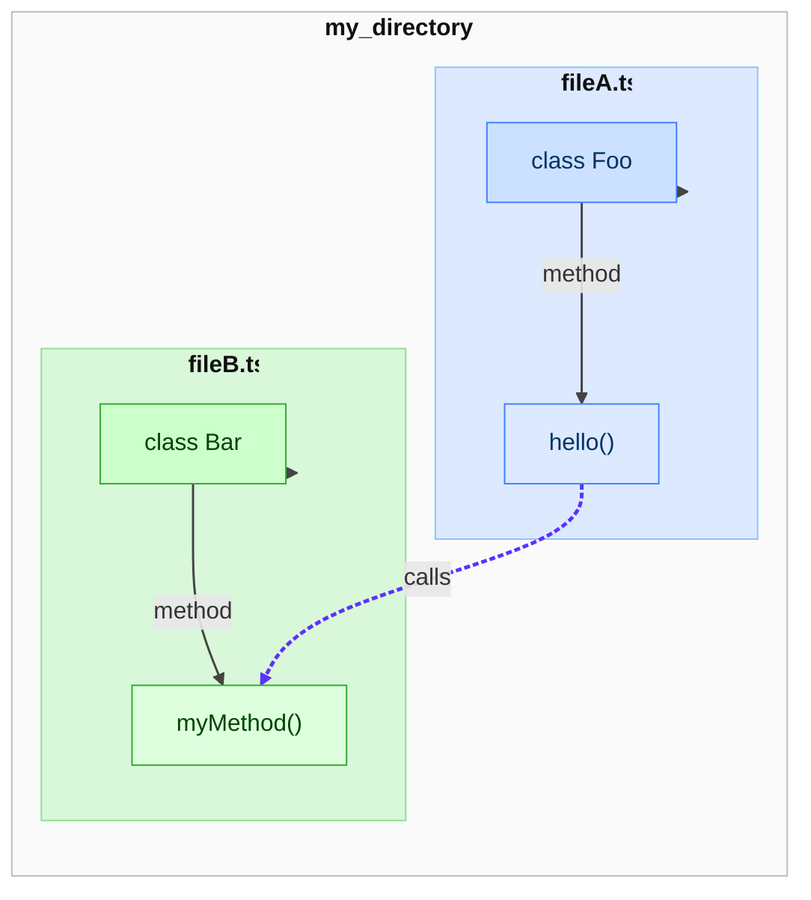
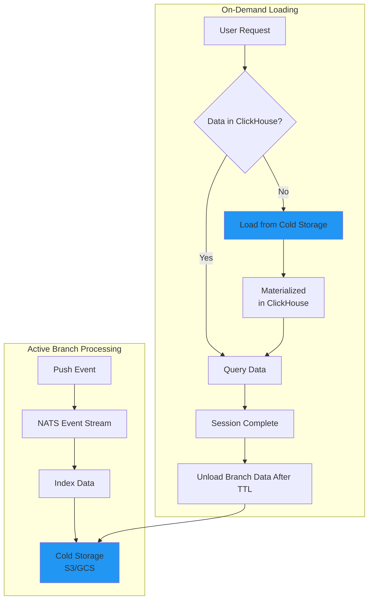

# Code indexing

## Code Indexing ETL

This document outlines the approach of building the ETL pipeline for the Code Indexing in the `gkg-indexer`. The difference between code and SDLC entities is that we have to take into account that code versions can exist in parallel to each other via different branches.

If we want the Knowledge Graph to be able to ask questions about code, it needs to be able to understand the relationships at any given branch and at different commits.

The ETL pipeline will be responsible for:

- Reading the code from the GitLab repositories using Gitaly RPC calls
- Transforming the code into the desired format, including the call graph and the filesystem hierarchy
- Writing the entities and relationships to the Knowledge Graph ClickHouse database

### What is a call graph?

Here is a simple example of a call graph between two files:

```typescript
// fileA.ts
export class Foo {
  hello() {
    const bar = new Bar();
    bar.myMethod();
  }
}
```

```typescript
// fileB.ts
export class Bar {
  myMethod() {
    console.log("Hello from Bar.myMethod()");
  }
}
```

**Explanation:**

- `fileA.ts` defines `class Foo` with a method `hello()`.
- Inside `hello()`, it creates an instance of `Bar` and calls `myMethod()`.
- `fileB.ts` defines `class Bar` with the `myMethod()` implementation.

We create a call graph between the two files, and the result looks like this:



### Core components

<!-- source: Cargo.toml — workspace members -->

| Component | Description |
|---|---|
| `code-parser` crate | Multi-language parser: AST parsing, definition/import/reference extraction |
| `code-graph` crate | Streaming indexing pipeline, graph data model, analysis service |
| `indexer` crate | NATS consumer, ETL engine, push event handler, Arrow conversion, ClickHouse writes |
| `gitaly-client` crate | Gitaly gRPC client for `GetArchive` RPC |
| `gkg-server` | HTTP/gRPC server, runs in Indexer mode for code indexing |
| NATS JetStream | Message broker with durable delivery between Siphon and GKG |
| NATS KV | Lightweight distributed lock store (prevents concurrent indexing of the same project) |
| ClickHouse | Columnar OLAP database storing both the datalake and the property graph |
| Gitaly | GitLab's Git storage service; code indexer uses `GetArchive` RPC |

For background on Siphon CDC, NATS, and ClickHouse architecture, see the
[SDLC indexing design document](sdlc_indexing.md).

### Data storage

The Knowledge Graph code data is going to be stored in separate ClickHouse database.

- For `.com` this will probably be in a separate instance.
- For small dedicated environments and self-hosted instances, this can be done in the same instance as the main ClickHouse database. This choice ultimately depends on what the operators think is best for their environment.

### Some numbers

As of November 2025, the [GitLab monolith](https://gitlab.com/gitlab-org/gitlab) has over 4000 branches considered "active" (committed to within the last 3 months) and even more that are considered "stale" (last committed more than 3 months ago).

Locally, with the limited support for Ruby. We currently index about 300,000 definitions and over 1,000,000 relationships.

For simplicity's sake, let's say we want to keep an active code index for branches that are considered "active". This would require us to index (300,000 definitions *4000 branches) = 1.2 billion definitions and (1,000,000 relationships* 4000 branches) = 4 billion relationships just for the GitLab monolith. This is simply not feasible if we extrapolate this to all the repositories in `.com`.

### Use cases

To come up with a solution for the scale issue it's probably best to outline some use cases where the Knowledge Graph can be used to answer questions about code.

- Does this merge request change the behavior of the existing code in unexpected ways?
- What is the impact of this merge request on the existing code?
- Perform code exploration to help understand the codebase and reveal architectural patterns.
- Provide guidance when a user wants to refactor the code or add a new feature.
- Identify the potential risks of a vulnerability in the codebase.
- Create queryable APIs for code exploration and analysis.
- Documentation generation for the codebase.

Of course, there are many more use cases that can be thought of, but these seem to be the most common ones. This raises the question: do we need to index all the code for **every active branch** for every repository? The answer is **probably not**.

### Indexing the main branch

Let's first focus on indexing the main branch for every repository. This should cover most of the use cases for the Knowledge Graph and then let's think of a strategy to index the active branches if the need arises.

#### Extract

The extract phase involves listening to events from NATS and leveraging ClickHouse as both the data store and the mechanism for deriving project hierarchies and full paths.

Push events from the GitLab PostgreSQL database are published to NATS JetStream subjects like:

- `gkg_siphon_stream.events`
- `gkg_siphon_stream.push_event_payloads`

The indexing service subscribes to these NATS subjects and correlates events across tables:

- Events table: Contains `event_id`, `project_id`, `author_id`, and push action.
- Push payloads table: Contains `event_id`, `ref` (branch name), `commit_to` (SHA) and ref type.

The indexer receives the events and confirms it's a push to the `main` branch before proceeding with the indexing process. Then, the service acquires a lock on the project + branch + ref combination. This is to prevent other workers or pods from indexing the same branch at the same time.

Example NATS KV:

- Key: `/gkg-indexer/indexing/{project_id}/{branch_name}/{ref_type}/lock`
- Value: `{ "worker_id": String, "started_at": Instant }`
- TTL: 1 hour (estimated based on the amount of resources)

Once the service acquires the lock, it will make a direct RPC call to Gitaly to download the files temporarily to disk. The service will query ClickHouse as needed to build the namespace hierarchy and gather additional metadata to enrich both the project's code graph and NATS locking.

#### Transform (Call Graph Construction)

##### Parser architecture (`code-parser`)

The `code-parser` crate handles multi-language AST parsing and extraction. Three
parser backends are dispatched based on language:

| Language | Extensions | Parser backend | References extracted? |
|---|---|---|---|
| Ruby | `rb`, `rbw`, `rake`, `gemspec` | `ruby_prism` (native Prism bindings) | Yes |
| TypeScript/JavaScript | `ts`, `js` (excludes `min.js`) | SWC (`swc_ecma_parser`) | Yes |
| Python | `py` | tree-sitter via `GenericParser` | Yes |
| Kotlin | `kt`, `kts` | tree-sitter via `GenericParser` | Yes |
| Java | `java` | tree-sitter via `GenericParser` | Yes |
| C# | `cs` | tree-sitter via `GenericParser` | No |
| Rust | `rs` | tree-sitter via `GenericParser` | No |

Language detection uses a static `FxHashMap` mapping file extensions to
`SupportedLanguage` variants, built at startup by the `define_languages!` macro
(12 supported extensions total). Files matching a language's `exclude_extensions`
list (currently only `min.js` for TypeScript) are skipped.

The parser extracts three categories of information from each file:

- **Definitions** (`DefinitionInfo`): Classes, modules, methods, functions, constants,
  interfaces, properties, constructors, enum entries, and lambdas. Each has a fully
  qualified name (FQN), a source range, and a language-specific definition type.
- **Imported symbols** (`ImportedSymbolInfo`): Import statements with their import path,
  identifier (name + optional alias), source range, and scope.
- **References** (`ReferenceInfo`): Call sites and property accesses. Each reference has
  a target that can be `Resolved` (single definition or import), `Ambiguous` (multiple
  candidates), or `Unresolved`.

Each language has a dedicated analyzer in `crates/code-parser/src/<language>/analyzer.rs`.
Both `code-parser` and `code-graph` define a `MINIMUM_STACK_REMAINING` constant of
128 KiB for stack safety during recursive AST traversal.

##### Streaming indexing pipeline (`code-graph`)

The `code-graph` crate runs a fully streaming pipeline. Files are processed as they
are discovered; there is no upfront collection step.

```text
DirectoryFileSource::stream_files()
        │
        │  mpsc channel (capacity 256)
        ▼
  filter by supported extensions
        │
        ▼
  async file read (buffer_unordered, IO concurrency)
        │
        ▼
  CPU-bound parsing on Rayon (tokio_rayon::spawn, semaphore-bounded)
        │
        ▼
  collect results → AnalysisService::analyze_results()
        │
        ▼
  GraphData
```

**Concurrency model:**

| Resource | Bound | Default |
|---|---|---|
| CPU workers (Rayon via `tokio_rayon::spawn`) | `Semaphore(worker_count)` | `max(num_cpus, 4)` |
| IO concurrency (async file reads) | `buffer_unordered(io_concurrency)` | `max(worker_count * 2, 8)` |
| Directory walker channel | `mpsc::channel(256)` | 256 |

`DirectoryFileSource` uses the `ignore` crate's `WalkBuilder` with parallel directory
traversal. It respects `.gitignore` rules, skips `.git` directories and nested git
repositories, and filters to supported file extensions.

`FileProcessor::process()` handles a single file: detect language from extension,
check exclusion list, parse via `ParserType::for_language()`, analyze with the
language-specific analyzer, and return a `FileProcessingResult`.

##### Graph data model

`AnalysisService::analyze_results()` groups file processing results by language and
builds a `GraphData` struct containing:

| Node type | Description |
|---|---|
| `DirectoryNode` | Directory in the repository tree |
| `FileNode` | Source file with path, language, extension |
| `DefinitionNode` | Code definition with FQN, type, source range, file path |
| `ImportedSymbolNode` | Import statement with path, type, identifier, source range |

##### Relationship types

The `RelationshipType` enum defines 49 fine-grained relationship types:

| Category | Examples | Count |
|---|---|---|
| Directory structure | `DirContainsDir`, `DirContainsFile` | 2 |
| File to entity | `FileDefines`, `FileImports` | 2 |
| Definition hierarchy | `ClassToMethod`, `ModuleToClass`, `FunctionToFunction`, `DefinesImportedSymbol`, etc. | 32 |
| Interface relationships | `InterfaceToMethod`, `InterfaceToProperty`, etc. | 6 |
| References | `Calls`, `AmbiguouslyCalls`, `PropertyReference` | 3 |
| Import resolution | `ImportedSymbolToDefinition`, `ImportedSymbolToFile`, `ImportedSymbolToImportedSymbol` | 3 |

These fine-grained types are mapped to four ontology edge labels during Arrow
conversion:

| Ontology label | Mapped from |
|---|---|
| `CONTAINS` | `DirContainsDir`, `DirContainsFile` |
| `DEFINES` | `FileDefines`, `DefinesImportedSymbol`, definition hierarchy types (31), interface types (6) |
| `IMPORTS` | `FileImports`, `ImportedSymbolTo*` |
| `CALLS` | `Calls`, `AmbiguouslyCalls`, `PropertyReference` |

#### Load

##### ETL engine and module system (`indexer` crate)

The indexer crate provides a general-purpose ETL engine that is not specific to code
indexing. Code and SDLC indexing are both implemented as modules plugged into this
engine. The core abstractions are:

- **`Handler`** (trait): Processes messages from a single NATS topic. For code indexing,
  the handler is `PushEventHandler`.
- **`Module`** (trait): Groups related handlers. For code indexing, `CodeModule`
  registers `PushEventHandler`.
- **`ModuleRegistry`**: Topic-to-handler routing.
- **`HandlerContext`**: Passed to every handler invocation with a `Destination` for
  writing data, `NatsServices` for publishing, and a `LockService` for distributed
  locking.
- **`Engine`**: Subscribes to topics, dispatches messages through the worker pool,
  manages ack/nack.
- **`WorkerPool`**: Global semaphore (default: 16 concurrent handlers) plus optional
  per-module semaphores to prevent starvation.

##### Pluggable storage (`Destination` / `BatchWriter`)

The engine does not write to ClickHouse directly. Handlers receive a `Destination`
through `HandlerContext` and create table-specific writers on demand. In production,
the `Destination` is backed by `clickhouse-client`'s `ArrowClickHouseClient`. In
tests, a `MockDestination` captures writes for assertion. This separation means
handlers never import ClickHouse-specific code.

##### Push event flow

The `PushEventHandler` subscribes to the `push_event_payloads` NATS subject. When a
push event arrives:

1. **Decode**: Deserialize Siphon protobuf `LogicalReplicationEvents`
2. **Extract**: Pull `event_id`, `project_id`, `ref_type`, `action`, `ref_name`,
   `revision_after` from the CDC columns
3. **Validate**: Skip non-branch pushes and non-push actions
4. **Default branch check**: Query Gitaly `FindDefaultBranch` RPC
5. **Project lookup**: Verify the project exists in ClickHouse datalake and retrieve
   its `traversal_path`
6. **Watermark check**: Skip if `last_event_id >= current event_id`
7. **Distributed lock**: Acquire a NATS KV lock keyed by `project_id:branch`
8. **Repository extraction**: Call Gitaly `GetArchive` RPC, extract tarball to a
   `TempDir`
9. **Indexing**: Run `RepositoryIndexer::index_files()` with `DirectoryFileSource`
10. **ID assignment**: `graph_data.assign_node_ids(project_id, branch)` generates
    deterministic node IDs
11. **Arrow conversion**: `ArrowConverter::convert_all()` produces 5 `RecordBatch`
    objects
12. **ClickHouse write**: Write batches to 5 tables
13. **Stale data cleanup**: Delete rows from previous indexing run
14. **Watermark update**: Record the new watermark
15. **Lock release**

##### Arrow conversion and ClickHouse tables

`ArrowConverter` transforms `GraphData` into Apache Arrow `RecordBatch` objects. Every
row includes base columns:

| Base column | Type | Description |
|---|---|---|
| `traversal_path` | `Utf8` | Namespace hierarchy path for authorization |
| `project_id` | `Int64` | GitLab project ID |
| `branch` | `Utf8` | Branch name |
| `_version` | `Timestamp(Microsecond, UTC)` | Indexing timestamp for stale data cleanup |

The converter produces five `RecordBatch` objects written to five ClickHouse tables:

| Table | Node type | Extra columns |
|---|---|---|
| `gl_directory` | Directories | `path`, `name` |
| `gl_file` | Files | `path`, `name`, `extension`, `language` |
| `gl_definition` | Definitions | `file_path`, `fqn`, `name`, `definition_type`, `start_line`, `end_line`, `start_byte`, `end_byte` |
| `gl_imported_symbol` | Imported symbols | `file_path`, `import_type`, `import_path`, `identifier_name`, `identifier_alias`, `start_line`, `end_line`, `start_byte`, `end_byte` |
| `gl_edge` | Relationships | `source_id`, `source_kind`, `relationship_kind`, `target_id`, `target_kind` (shared with SDLC edges) |

Arrow `RecordBatch` objects are serialized to Arrow IPC format and sent to ClickHouse
via `clickhouse-client`'s `ArrowClickHouseClient`.

#### Flow visual representation

```text
Siphon CDC (push_event_payloads)
        │
        ▼
  NATS JetStream
        │
        ▼
  gkg-server (Indexer mode)
        │
        ▼
  PushEventHandler
        │
        ├─ 1. Validate event (default branch only, not already indexed)
        ├─ 2. Acquire distributed lock via NATS KV
        ├─ 3. Fetch repository archive from Gitaly (GetArchive RPC)
        ├─ 4. Extract to temp directory
        ├─ 5. Run code-graph indexing pipeline
        │       ├─ File discovery (ignore crate, respects .gitignore)
        │       ├─ Async file read (bounded IO concurrency)
        │       ├─ CPU-bound parsing on Rayon pool (semaphore-bounded)
        │       └─ Analysis phase → GraphData
        ├─ 6. Convert GraphData → Arrow RecordBatches
        ├─ 7. Write batches to ClickHouse (5 tables)
        ├─ 8. Delete stale data from previous indexing run
        └─ 9. Update watermark, release lock
```

### Differences from the original local tool

The original Knowledge Graph (at `gitlab-org/rust/knowledge-graph`) was a local desktop
tool. Key architectural differences in the current service:

| Aspect | Original (local) | Current (service) |
|---|---|---|
| Graph database | lbug (embedded) | ClickHouse |
| Code access | Local filesystem | Gitaly `GetArchive` RPC |
| Event trigger | Filesystem watcher (`watchexec`) | Siphon CDC push events via NATS |
| Storage format | Parquet → lbug bulk import | Arrow IPC → ClickHouse |
| Multi-tenancy | Single user, single repo | Namespace-scoped via `traversal_path` |
| Authorization | None (local tool) | Rails gRPC delegation |
| Parser crate | External `parser-core` dependency | In-tree `code-parser` (forked and evolved) |
| Graph builder | External `indexer` crate | In-tree `code-graph` |
| Concurrency | Same streaming model | Same streaming model (preserved) |

The streaming concurrency model (Rayon + semaphore + `buffer_unordered`) was carried
over from the original tool and remains largely unchanged.

### Indexing the active branches

#### The problem

As discussed in the previous section, the main branch is the most common branch to index. However, it still feels relevant to document a strategy to index the active branches if the need arises. Let's also not forget that the Knowledge Graph includes a local version that customers can use to query code against their local repository at any version.

To reiterate, the issue with indexing active branches is the sheer volume of data that would need to be indexed. We're talking about billions of definitions and relationships for each GitLab-like repositories. This is a complex problem that takes effort away from releasing a first version of the Knowledge Graph service without providing clear value.

#### A future strategy

Once we deploy the initial version, if our metrics and customer feedback show that the ability to explore codebases at any version is valuable, we can then explore our options.

As stated above GitLab has the concept of a branch being "active" or "stale". An active branch is one that has been committed to within the last 3 months. A stale branch is one that has not been committed to in the last 3 months.

For the amount of data and un-even query distribution (some branches are never going to be queried), it's best we don't keep the data against the main branches in the same database since that would result in a lot of wasted storage and compute resources.

Ideally, we would re-use the same indexing strategy as the main branch where we can index the active branches by listening to push events from NATS, but instead of loading the data into ClickHouse, we would store the data in cold storage (like S3 or GCS).

On request, we would load the data into ClickHouse from cold storage in materialized tables. This would allow us to then query the data in ClickHouse during the current session and then unload the data from ClickHouse after the session is complete (based on a variable TTL).

#### Flow visual representation



#### Cleaning up

Once the branch either becomes stale or is deleted, we should clean up the data in our cold storage. This would be done by a separate job that would run periodically and clean up the data based on the latest state of the branches.

#### Alternative approach

An alternative approach if the time to first response is not critical is to index the active branches and then index the stale branches on demand. Depending on the indexing speed on the servers, this would allow us to save the temporary data in ClickHouse and then dispose of it after the session is complete or at a later time. This would eliminate the need to manage cold storage and the associated costs.

#### Indexing the stale branches

Stale branches are in most cases branches that have been abandoned by the original author. They are not actively being worked. If we were to index them, we could follow the same strategy as the [alternative approach](#alternative-approach) described for active branches.

#### Zero-Downtime Schema Changes

Code Indexing is going to follow the same schema migration strategy as the main branch as described in [Zero-Downtime Schema Changes](./sdlc_indexing.md#zero-downtime-schema-changes).

### How Code Querying Works Today

- **Purpose-built MCP tools**
  - The Knowledge Graph team originally built dedicated MCP tools, which include code-specific tools implemented under `crates/mcp/tools`. Each tool wraps a focused workflow on top of the indexed call graph. Reference documentation lives at [`docs/mcp/tools`](https://gitlab-org.gitlab.io/rust/knowledge-graph/docs/mcp/tools/).
- **What the tools currently do**
  - [`list_projects`](https://gitlab-org.gitlab.io/rust/knowledge-graph/docs/mcp/tools/#list_projects) enumerates indexed repositories for agent discovery.
  - [`search_codebase_definitions`](https://gitlab-org.gitlab.io/rust/knowledge-graph/docs/mcp/tools/#search_codebase_definitions) searches Definition nodes by name, FQN, or partial match and streams back signatures plus context.
  - [`get_definition`](https://gitlab-org.gitlab.io/rust/knowledge-graph/docs/mcp/tools/#get_definition) resolves a usage line to its Definition or ImportedSymbol node by leveraging call graph edges such as `CALLS` and `AMBIGUOUSLY_CALLS`.
  - [`get_references`](https://gitlab-org.gitlab.io/rust/knowledge-graph/docs/mcp/tools/#get_references) pivots the other way through relationships like `DEFINES_IMPORTED_SYMBOL` and `FILE_IMPORTS` to list every referencing definition with contextual snippets.
  - [`read_definitions`](https://gitlab-org.gitlab.io/rust/knowledge-graph/docs/mcp/tools/#read_definitions) batches definition bodies so agents can retrieve implementations efficiently.
  - [`repo_map`](https://gitlab-org.gitlab.io/rust/knowledge-graph/docs/mcp/tools/#repo_map) walks the directory nodes and summarizes contained definitions, using the graph to stay `.gitignore`-aware.
  - [`index_project`](https://gitlab-org.gitlab.io/rust/knowledge-graph/docs/mcp/tools/#index_project) invokes the repository indexer inside the MCP process, wiring the reindexing flow described earlier into an on-demand tool call.
- **How they execute queries**
  - Tools rely on `database::querying::QueryLibrary` (for example, `search_codebase_definitions` delegates to `QueryingService` via the shared query library) and on the same database connections managed by `crates/database`. This keeps query plans consistent with the schema imported during indexing.
  - Many tools supplement database hits with filesystem reads (see `file_reader_utils`) so responses include code snippets, respecting byte offsets captured in the graph.
- **Other consumers**
  - The HTTP/GQL surfaces continue to use the shared schema metadata published at [`docs/reference/schema`](https://gitlab-org.gitlab.io/rust/knowledge-graph/docs/reference/schema/); the MCP tools simply package the most common graph traversals for AI agents and IDE features while reusing the same underlying query service.

> **Important Note:** We intend to replace the above tools, where it makes sense, with our Graph Query Engine technology to enable agents and analytics to traverse the graph using tools that will be shared with SDLC querying. Agents will never write or execute raw queries themselves. They can only interact with the graph through these exposed, parameterized tools, which enforce security and access controls.
