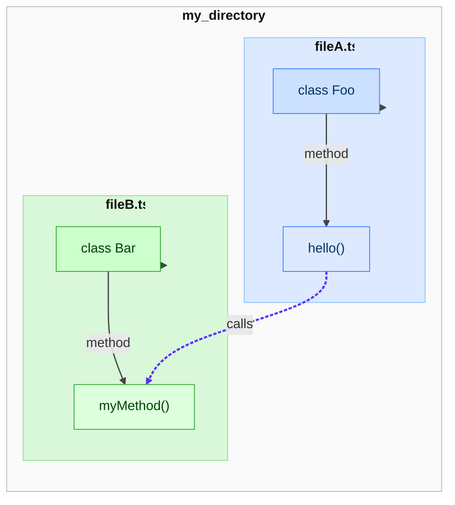
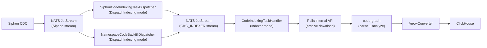
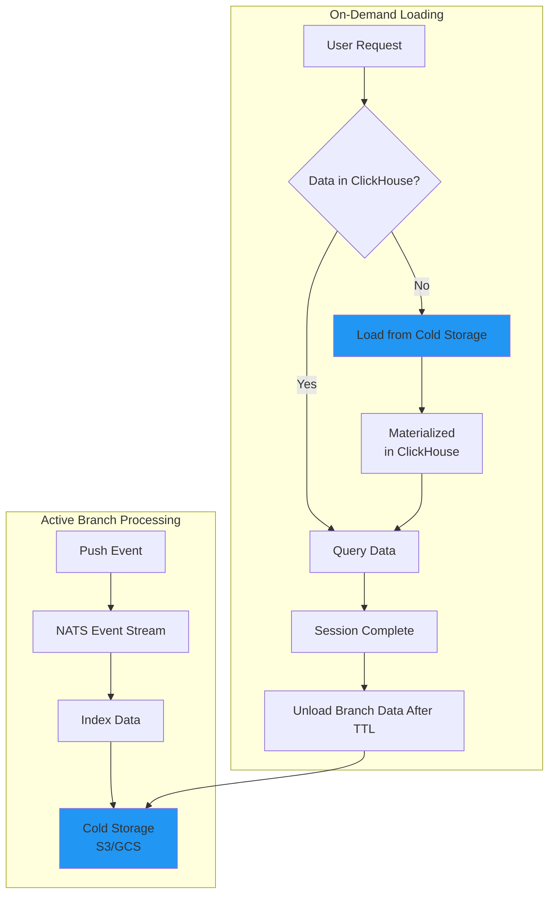

# Code indexing

## Code Indexing ETL

This document describes how the code indexing ETL pipeline works. Unlike SDLC entities, code versions can exist in parallel across branches, so the same file can look different on `main` vs. a feature branch.

If we want the Knowledge Graph to answer questions about code, it needs to understand relationships at any given branch and commit.

The ETL pipeline:

- Reads code from GitLab repositories through the Rails internal API
- Transforms it into a call graph and file system hierarchy
- Writes entities and relationships to ClickHouse

### What is a call graph?

Here is an example of a call graph between two files:

```typescript
// fileA.ts
export class Foo {
  hello() {
    const bar = new Bar();
    bar.myMethod();
  }
}
```

```typescript
// fileB.ts
export class Bar {
  myMethod() {
    console.log("Hello from Bar.myMethod()");
  }
}
```

**Explanation:**

- `fileA.ts` defines `class Foo` with a method `hello()`.
- Inside `hello()`, it creates an instance of `Bar` and calls `myMethod()`.
- `fileB.ts` defines `class Bar` with the `myMethod()` implementation.

We create a call graph between the two files, and the result looks like this:



### Architecture overview



### Components

| Component | Description |
|---|---|
| `code-graph` crate | Single crate containing the v2 pipeline stack in `src/v2/`, the preserved legacy parser/linker stack in `src/legacy/`, and shared code-indexing utilities |
| `treesitter-visit` crate | Tree-sitter wrapper crate kept separate for compile-time isolation and shared by the legacy and generic v2 language pipelines |
| `indexer` crate | NATS consumer, ETL engine, Siphon task dispatcher, namespace backfill dispatcher, code indexing task handler, Arrow conversion, ClickHouse writes |
| `gkg-server` | HTTP/gRPC server, runs in Indexer mode for code indexing |
| NATS JetStream | Message broker with durable delivery between Siphon and GKG |
| NATS KV | Distributed lock store to prevent concurrent indexing of the same project |
| ClickHouse | Columnar OLAP database storing the datalake and the property graph |
| Rails internal API | Proxies repository operations: project info lookups, archive downloads, and blob streaming for content resolution (length-delimited protobuf) |

For background on Siphon CDC, NATS, and ClickHouse architecture, see the
[SDLC indexing design document](sdlc_indexing.md).

### Data storage

The Knowledge Graph code data is stored in a separate ClickHouse database.

- For `.com` this is expected to run in a separate instance.
- For small dedicated environments and self-hosted instances, this can be done in the same instance as the main ClickHouse database. This choice ultimately depends on what the operators think is best for their environment.

### Some numbers

As of November 2025, the [GitLab monolith](https://gitlab.com/gitlab-org/gitlab) has over 4000 branches considered "active" (committed to within the last 3 months) and even more that are considered "stale" (last committed more than 3 months ago).

Locally, with the limited support for Ruby. We currently index about 300,000 definitions and over 1,000,000 relationships.

For simplicity's sake, let's say we want to keep an active code index for branches that are considered "active". This would require us to index (300,000 definitions *4000 branches) = 1.2 billion definitions and (1,000,000 relationships* 4000 branches) = 4 billion relationships just for the GitLab monolith. This is simply not feasible if we extrapolate this to all the repositories in `.com`.

### Use cases

The scale problem depends on what we actually need from the graph. The target use cases:

- Detect whether a merge request changes existing behavior in unexpected ways
- Assess the blast radius of a merge request on the rest of the codebase
- Help developers explore unfamiliar code and understand architectural patterns
- Guide refactoring and feature work by surfacing dependencies
- Trace how a vulnerability propagates through the call graph
- Expose queryable APIs for code exploration and analysis
- Generate documentation from the indexed codebase

None of these require indexing **every active branch** for every repository.

### Indexing the main branch

The first milestone is indexing the main branch for every repository. This covers the majority of the use cases listed above. A strategy for active branches is described in a [later section](#indexing-the-active-branches).

#### Extract

The extract phase uses a two-hop dispatch model to decouple Siphon CDC consumption from indexing.

Rails writes to a dedicated `p_knowledge_graph_code_indexing_tasks` table only when a push lands on the default branch of a namespace with Knowledge Graph indexing enabled. These rows are replicated via Siphon CDC to NATS JetStream:

- `gkg_siphon_stream.p_knowledge_graph_code_indexing_tasks`

Each task carries `project_id`, `ref`, `commit_sha`, and `traversal_path` directly, so the handler does not need to call Rails for default branch validation or query ClickHouse for the namespace hierarchy.

For the full rationale behind this approach and the alternatives that were considered, see [ADR 005: PostgreSQL task table for code indexing triggers](../decisions/005_code_indexing_task_table.md).

##### Dispatch

The `SiphonCodeIndexingTaskDispatcher` runs as a `ScheduledTask` in DispatchIndexing mode. On each run it batch-pulls pending Siphon CDC messages, decodes the protobuf `LogicalReplicationEvents`, and publishes a `CodeIndexingTaskRequest` (JSON) per event to the internal `GKG_INDEXER` NATS stream. The subject pattern `code.task.indexing.requested.<project_id>.<branch>` combined with `max_messages_per_subject: 1` deduplicates in-flight requests per project and branch.

This separation lets task dispatching be stopped independently from the indexer — the handler keeps draining whatever was already dispatched, but no new work enters the pipeline.

##### Namespace backfill dispatch

When a namespace first enables Knowledge Graph indexing, its existing projects need to be indexed even though no push events have occurred yet. The `NamespaceCodeBackfillDispatcher` handles this by consuming `knowledge_graph_enabled_namespaces` CDC events from Siphon. For each newly enabled namespace it:

1. Resolves the namespace's traversal path from `namespace_traversal_paths`
2. Queries `project_namespace_traversal_paths` to find all projects under that namespace
3. Publishes a `CodeIndexingTaskRequest` for each project to the `GKG_INDEXER` stream

These backfill requests omit `branch` and `commit_sha`. The handler resolves the default branch from the Rails internal API at processing time.

##### Handler

The `CodeIndexingTaskHandler` runs in Indexer mode and subscribes to `CodeIndexingTaskRequest` messages from the `GKG_INDEXER` stream. It deserializes the JSON request and, if no branch was provided (e.g. from a namespace backfill), resolves the default branch from the Rails internal API. It then acquires a lock on the project + branch combination to prevent other workers from indexing the same branch concurrently.

Example NATS KV:

- Key: `project.{project_id}.{base64_encoded_branch}`
- Value: `{ "worker_id": String, "started_at": Instant }`
- TTL: 60 seconds

After acquiring the lock, the service downloads the full repository archive from the Rails internal API. During archive extraction, the Gitaly archive root directory (`<slug>-<ref>/`) is stripped so that indexed paths are repo-relative and match the paths used by content resolution's `list_blobs` revisions. After indexing completes (or fails), the downloaded files are immediately deleted from disk to prevent unbounded storage growth across indexer pods.

The extractor records a repository file inventory from archive metadata before it applies byte-level filtering. That inventory drives `File` and `Directory` node creation, so files do not need to be unpacked or parsed to appear in the graph. After inventory recording, extraction uses an exclusion denylist (`code_graph::v2::config::is_excluded_from_indexing`) and the configured per-file size ceiling to avoid writing obvious binary/media/archive/document/datastore blobs or oversized blobs to disk.

Source files, manifests, lockfiles, dotfiles, unknown extensions, and resolver inputs are intentionally allowed through unless they exceed the size ceiling. Symlinks, hardlinks, and directories bypass the byte filter: symlinks cost negligible disk and may legitimately point at parsable files; directories are created lazily as files are unpacked.

The reason and byte volume of skipped entries are exposed via the `gkg.indexer.code.archive.entries.skipped` and `gkg.indexer.code.archive.bytes.skipped` counters so operators can quantify the disk savings per indexing run.

#### Transform (call graph construction)

##### Parser architecture

The `code-graph` crate now contains both the v2 pipeline stack under `src/v2/` and the preserved legacy stack under `src/legacy/`. Across those paths, code indexing currently uses several parser and analysis backends:

- **Ruby** uses native Prism bindings for high-fidelity AST parsing.
- **JavaScript and TypeScript** in the v2 custom JS pipeline use OXC for parsing and semantic analysis. The same pipeline uses parser-side SSA for local value flow and member-call resolution, treats JSX/TSX component opening elements as call sites while ignoring intrinsic tags, uses `oxc_resolver` for cross-file module resolution, honors `tsconfig.json` and `jsconfig.json` path mappings, statically evaluates explicit webpack alias modules and their local `require()` dependencies, skips minified files, and keeps ESM `import` resolution separate from CommonJS `require()` resolution so package export conditions are evaluated in the correct mode.
- **Vue** sources are handled by extracting script blocks into virtual JavaScript or TypeScript sources and routing them through the same OXC-based JS pipeline.
- **File-backed JS ecosystem imports** such as GraphQL, GQL, and JSON are indexed as module-like files with a synthetic primary export that resolves back to the file node. This keeps module resolution accurate for frontend repositories without pretending those assets contain parsed code definitions.
- **Webpack alias evaluation** is deliberately partial and bounded. It only evaluates explicit local config modules, enforces file-count, byte, statement, and recursion budgets, treats `process.env` as an empty object, and allows filesystem probes such as `fs.existsSync()` only for repo-contained paths that remain under the checkout root after normalization.
- **Rust** uses a rust-analyzer-backed custom v2 pipeline with a shell-free synthetic repo-local Cargo workspace model. The loader stays inside the checked-out tree, attaches a pinned embedded Rust `1.95.0` sysroot project plus baked server-side cfg/target data, disables proc macros and build-script execution, and layers parser-time SSA over rust-analyzer for local callable flow such as aliases, rebindings, destructuring, tuple/record field slots, and branch joins. rust-analyzer resolves callable semantics for functions, methods, macros, operators, `?`, and `await`.
- **Python, Kotlin, Java, and C#** use tree-sitter grammars.
- **Legacy JavaScript and TypeScript** parsing still exists under `src/legacy/` and continues to use SWC while the v2 JS pipeline work is integrated.

Automatic v2 language dispatch is extension-based. The JavaScript pipeline owns `.js`, `.jsx`, `.mjs`, `.cjs`, `.vue`, `.graphql`, `.gql`, and `.json`; the TypeScript pipeline owns `.ts`, `.tsx`, `.mts`, and `.cts`; the Rust pipeline owns `.rs`. Ruby, JavaScript/TypeScript, Python, Kotlin, and Java support full reference extraction. Rust emits `CALLS` edges from rust-analyzer semantic resolution and local SSA flow; it does not currently materialize arbitrary non-call reference edges. C# currently supports definitions and imports only.

For each file, the parser extracts three categories of information:

- **Definitions** such as classes, modules, methods, functions, constants, and interfaces. Each carries a fully qualified name (FQN), source range, and language-specific type.
- **Imported symbols** with their import path, identifier, optional alias, and scope.
- **References** including call sites and property accesses. A reference can be resolved to a single target, ambiguous across multiple candidates, or unresolved.

For JavaScript and TypeScript, phase 1 also populates the normal v2 `CodeGraph` and a JS-local module index together. Each source file synthesizes a top-level `Module` definition keyed by the repository-relative file path plus export-member definitions so namespace imports, primary exports, named exports, star re-exports, and module-level cross-file navigation can reuse the same nested and member resolution machinery as other v2 definitions without exposing a magic synthetic prefix as the user-facing identity.
A second OXC-driven pass records invocation sites, including React and Next.js JSX/TSX component usages, feeds local bindings through the shared SSA engine, resolves intrafile targets through the generic v2 `FileResolver`, and leaves JS-specific cross-file import and module resolution in the custom JS resolver layer. When an imported call cannot resolve to a repository-local definition, the graph preserves the call as a `Definition` to `ImportedSymbol` `CALLS` edge instead of dropping the call site.

##### Inventory-driven indexing pipeline

The indexing pipeline uses a repository inventory as the single file list. Pipeline callers must provide the inventory; the parser grouping, structural graph, and stats all derive from that same list. The stages are:

1. **Repository inventory** supplies the complete set of file entries from the Git tree. Server indexing reads this from Gitaly archive metadata for the indexed revision before extraction filters run; local CLI indexing reads present, non-ignored files from Gitalisk.
2. **Materialized-file checks** use the inventory paths to find files that were unpacked or are present on disk and can be read by parsers and resolvers. No second directory walk runs.
3. **Extension filtering** runs `parsable_language` over materialized files, then groups parseable files by language.
4. **Structural graph emission** creates `Directory`, `File`, and containment edges from the repository inventory. Non-parsable files use `language = "unknown"` and do not produce definitions or imports.
5. **Async file reads** load parseable file contents with bounded IO concurrency.
6. **CPU-bound parsing** runs on a thread pool with a semaphore to cap parallelism based on available cores.
7. **Analysis** groups parsed results by language and builds definition, import, call, and inheritance relationships that attach to the structural file nodes.

IO reads and CPU-bound parsing are bounded independently: file reads use a concurrency limit proportional to the worker thread count, while parsing uses a semaphore sized to the number of available CPU cores. This separation prevents IO-heavy repositories from starving the parser and vice versa. The pipeline outputs a graph structure consumed by the load phase. The defaults scale with the number of available cores.

##### Graph data model

After parsing, the analysis phase groups results by language and builds a graph containing:

| Node type | Description |
|---|---|
| Directory | Directory in the repository tree |
| File | Repository file with path, language, extension. Non-parsable files use `unknown` for language. |
| Definition | Code definition with FQN, type, source range, file path |
| Imported symbol | Import statement with path, type, identifier, source range |

##### Relationship types

The graph captures fine-grained relationships across several categories:

- **Containment** tracks which directories contain other directories or files.
- **Definitions** link files to the code entities they define, and capture the nesting hierarchy (e.g., a class containing methods, a module containing classes).
- **Imports** connect files and symbols to the definitions or files they import.
- **References** represent call sites, property accesses, and ambiguous calls where the target cannot be resolved to a single definition. Unresolved imported calls are retained as calls to imported symbols when the parser can associate the call with an import.

Internally the graph uses roughly 50 fine-grained relationship types spread across these categories, for example distinguishing a method call from a property access, or a re-export from a direct import. During the load phase, these fine-grained types are collapsed into five high-level ontology labels: **CONTAINS**, **DEFINES**, **IMPORTS**, **CALLS**, and **EXTENDS**. This simplification keeps the query layer consistent while the internal graph retains full detail for analysis.

#### Load

##### ETL engine and module system

The indexer provides a general-purpose ETL engine shared by both code and SDLC indexing. Each indexing pipeline is a module plugged into this engine.

The engine subscribes to NATS topics, routes messages to the appropriate module's handler, and manages acknowledgments. A global worker pool with optional per-module concurrency limits prevents any single module from starving others.

##### Pluggable storage

Handlers don't write to ClickHouse directly. They receive a trait-based storage abstraction and create table-specific writers on demand. The abstraction has two implementations: a production writer that serializes Arrow record batches and streams them to ClickHouse, and a mock that captures writes in memory for test assertions. Because handlers only depend on the trait, they are database-independent and can be tested without any external infrastructure.

##### Code indexing task flow

The code indexing handler subscribes to `CodeIndexingTaskRequest` messages from the internal `GKG_INDEXER` NATS stream. On each task the handler:

1. Checks the checkpoint to skip already-indexed commits
2. Acquires a distributed lock via NATS KV to prevent concurrent indexing of the same project and branch
3. Downloads the full repository archive via the Rails internal API
4. Runs the streaming indexing pipeline (parse, convert to Arrow, write to ClickHouse, clean up stale data)
5. Deletes the downloaded repository from disk
6. Updates the checkpoint and releases the lock

##### Storage in ClickHouse

The graph is converted to Apache Arrow record batches and written to six ClickHouse tables: one each for branches, directories, files, definitions, imported symbols, and the ontology-configured edge table (defaulting to `gl_edge`). Every row carries base columns for the namespace hierarchy path (used for authorization), project ID, branch, and a version timestamp used for stale data cleanup.

Record batches are serialized to Arrow IPC format and streamed to ClickHouse.

#### Checkpoint tracking

The `code_indexing_checkpoint` table records the last successfully indexed point per namespace, project, and branch (keyed on `traversal_path, project_id, branch`). The code indexing task handler checks it to skip already-indexed commits.

Projects whose Gitaly archive endpoint returns 404 (no refs) or 5xx (no repository storage) are checkpointed with no commit and treated as terminal "indexed empty". This prevents retries and DLQ churn for projects with no content. Once the project is populated, subsequent siphon tasks arrive with a larger `task_id` than the stored checkpoint and are re-processed normally. The `gkg.indexer.code.repository.empty` counter (labelled `reason=not_found|server_error`) tracks how often this short-circuit fires.

Tasks with no `branch` field resolve the default branch via `GET /api/v4/internal/orbit/project/:id/info`. When that endpoint returns 404 (project deleted in Rails but still referenced by the dispatcher's datalake view), the task is acked with the same `empty_repository{reason=not_found}` counter and no checkpoint is stored — the branch is unknown, so there is no key to write under. The ack avoids DLQ churn; the dispatcher stopping emission for deleted projects is tracked separately.

#### Flow visual representation

```plaintext
  Push events:                          Namespace enabled:
  Rails (p_knowledge_graph_code_        Rails (knowledge_graph_enabled_
         indexing_tasks)                       namespaces)
        |                                      |
        v                                      v
  Siphon CDC → NATS JetStream (Siphon stream, two subjects)
        |                                      |
        v                                      v
  SiphonCodeIndexingTask               NamespaceCodeBackfill
  Dispatcher                           Dispatcher
        |- Batch-pull messages                 |- Batch-pull messages
        |- Decode protobuf                     |- Resolve namespace traversal path
        \- Publish per task                    \- Publish per project in namespace
        |                                      |
        +------------------+-------------------+
                           |
                           v
                 NATS JetStream (GKG_INDEXER stream)
                           |
                           v
                 CodeIndexingTaskHandler (Indexer mode)
                           |
                           |- 1. Deserialize CodeIndexingTaskRequest
                           |- 2. Resolve default branch from Rails (if not provided)
                           |- 3. Check checkpoint (skip already-indexed commits)
                           |- 4. Acquire distributed lock via NATS KV
                           |- 5. Download full repository archive
                           |- 6. Run indexing pipeline
                           |       |- Repository file inventory
                           |       |- Parser file discovery
                           |       |- Async file reads
                           |       |- CPU-bound parsing (bounded parallelism)
                           |       |- Analysis phase -> graph
                           |       |- Convert graph to Arrow record batches
                           |       |- Write to ClickHouse (6 tables)
                           |       \- Clean up stale data
                           |- 7. Delete downloaded repository from disk
                           \- 8. Update checkpoint, release lock
```

### Differences from the original local tool

The original Knowledge Graph (at `gitlab-org/rust/knowledge-graph`) was a local desktop
tool. Here are the main architectural differences in the current service:

| Aspect | Original (local) | Current (service) |
|---|---|---|
| Graph database | lbug (embedded) | ClickHouse |
| Code access | Local filesystem | Rails internal API (full archive download, no disk cache) |
| Event trigger | Filesystem watcher (`watchexec`) | Siphon CDC → dispatcher → internal NATS stream |
| Storage format | Parquet -> lbug bulk import | Arrow IPC -> ClickHouse |
| Multi-tenancy | Single user, single repo | Namespace-scoped via `traversal_path` |
| Authorization | None (local tool) | Rails gRPC delegation |
| Parser crate | External `parser-core` dependency | In-tree `code-graph` crate, `src/legacy/parser/` (forked and evolved) |
| Graph builder | External `indexer` crate | In-tree `code-graph/src/legacy/linker/` |
| Concurrency | Streaming model (Rayon + semaphore) | Same streaming model (preserved) |

### Indexing the active branches

#### The problem

The main branch is the most common branch to index, but a strategy for active branches is worth documenting. The Knowledge Graph also includes a local version that customers can use to query code against their local repository at any version.

The core issue with indexing active branches is volume: billions of definitions and relationships for repositories the size of the GitLab monolith. The initial release focuses on main-branch indexing; branch-level and commit-level support are planned as follow-on work.

#### A future strategy

After the initial deployment, metrics and customer feedback will determine whether branch-level indexing is worth the storage and compute cost. The approach below outlines one viable path.

As stated above GitLab has the concept of a branch being "active" or "stale". An active branch is one that has been committed to within the last 3 months. A stale branch is one that has not been committed to in the last 3 months.

For the amount of data and uneven query distribution (some branches are never going to be queried), it's best we don't keep the data against the main branches in the same database since that would result in a lot of wasted storage and compute resources.

Ideally, we would re-use the same indexing strategy as the main branch where we can index the active branches by listening to code indexing tasks from NATS, but instead of loading the data into ClickHouse, we would store the data in cold storage (like S3 or GCS).

On request, we would load the data into ClickHouse from cold storage in materialized tables. This would allow us to then query the data in ClickHouse during the current session and then unload the data from ClickHouse after the session is complete (based on a variable TTL).

#### Flow visual representation



#### Cleaning up

Once the branch either becomes stale or is deleted, we should clean up the data in our cold storage. This would be done by a separate job that would run periodically and clean up the data based on the latest state of the branches.

#### Alternative approach

An alternative approach if the time to first response is not critical is to index the active branches and then index the stale branches on demand. Depending on the indexing speed on the servers, this would allow us to save the temporary data in ClickHouse and then dispose of it after the session is complete or at a later time. This would eliminate the need to manage cold storage and the associated costs.

#### Indexing the stale branches

Stale branches are in most cases branches that have been abandoned by the original author. They are not actively being worked. If we were to index them, we could follow the same strategy as the [alternative approach](#alternative-approach) described for active branches.

#### Zero-Downtime Schema Changes

Code Indexing is going to follow the same schema migration strategy as the main branch as described in [Zero-Downtime Schema Changes](./sdlc_indexing.md#zero-downtime-schema-changes).

### How code querying works today

The Knowledge Graph team originally built dedicated MCP tools for code querying. Each tool wraps a focused workflow on top of the indexed call graph. Reference documentation lives at [Knowledge Graph: tools](https://gitlab-org.gitlab.io/rust/knowledge-graph/mcp/tools/).

The available tools:

- [`list_projects`](https://gitlab-org.gitlab.io/rust/knowledge-graph/mcp/tools/#list_projects) enumerates indexed repositories for agent discovery.
- [`search_codebase_definitions`](https://gitlab-org.gitlab.io/rust/knowledge-graph/mcp/tools/#search_codebase_definitions) searches definition nodes by name, FQN, or partial match and returns signatures plus context.
- [`get_definition`](https://gitlab-org.gitlab.io/rust/knowledge-graph/mcp/tools/#get_definition) resolves a usage line to its definition or import by following call graph edges.
- [`get_references`](https://gitlab-org.gitlab.io/rust/knowledge-graph/mcp/tools/#get_references) walks the graph in the other direction to list every reference to a definition, with contextual snippets.
- [`read_definitions`](https://gitlab-org.gitlab.io/rust/knowledge-graph/mcp/tools/#read_definitions) batches definition bodies so agents can retrieve implementations efficiently.
- [`repo_map`](https://gitlab-org.gitlab.io/rust/knowledge-graph/mcp/tools/#repo_map) walks the directory nodes and summarizes contained definitions, using the graph to stay `.gitignore`-aware.
- [`index_project`](https://gitlab-org.gitlab.io/rust/knowledge-graph/mcp/tools/#index_project) triggers the repository indexer inside the MCP process for on-demand reindexing.

These tools use a shared query library and the same database connections used during indexing. Many also supplement database hits with filesystem reads to include code snippets based on byte offsets from the graph.

> **Important Note:** We intend to replace the above tools, where it makes sense, with our Graph Query Engine technology to enable agents and analytics to traverse the graph using tools that will be shared with SDLC querying. Agents will never write or execute raw queries themselves. They can only interact with the graph through these exposed, parameterized tools, which enforce security and access controls.
