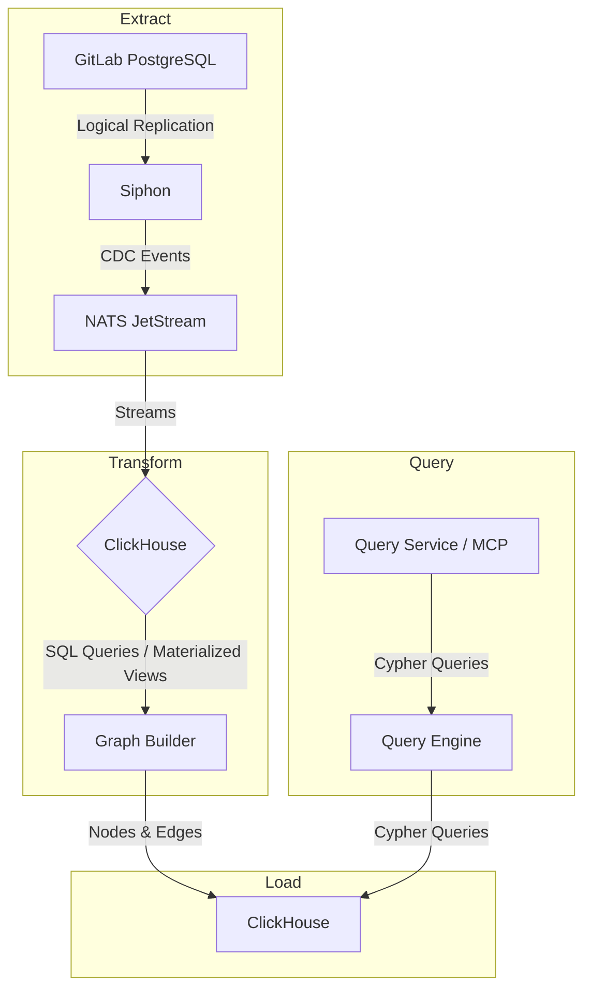
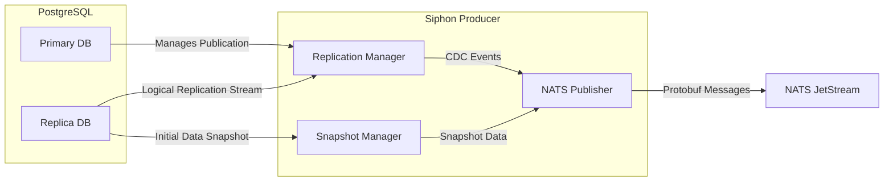

# SDLC indexing

## Overview

The SDLC (Software Development Lifecycle) Graph, also known as the Namespace Graph, provides a queryable view of the interconnected entities and events within a GitLab namespace. It captures the relationships between projects, issues, merge requests, CI/CD pipelines, vulnerabilities, and more.

This document outlines the architecture of the indexing process, which functions as a large-scale ETL (Extract, Transform, Load) pipeline. This pipeline is designed to process a continuous stream of events from the GitLab production environment and transform them into a graph structure that can be efficiently queried by AI agents and other services.

## The SDLC Indexing Service ETL Pipeline

The indexing process is fundamentally an ETL pipeline that takes data from the GitLab primary PostgreSQL database and loads it into our OLAP database (like ClickHouse) after processing and transformation in a data lake.



### 1. Extract: Capturing Change Data with Siphon

The pipeline begins with **Siphon**, the GitLab in-house Change Data Capture (CDC) service written in Go. Its sole responsibility is to reliably replicate data from a PostgreSQL database to a NATS JetStream topic.

#### Siphon's Architecture

Siphon operates on a producer/consumer model, but for the purpose of the Knowledge Graph's ETL pipeline, we are primarily concerned with the **Siphon Producer**.



- **Replication Manager**: This is the primary component that connects to a PostgreSQL logical replication slot. It uses the `pgoutput` plugin to decode the Write-Ahead Log (WAL) into a stream of logical changes (inserts, updates, deletes). It's responsible for managing the replication slot and acknowledging the WAL position to the database, ensuring that processed data is not sent again.

- **Snapshot Manager**: To bootstrap the data lake, Siphon must first perform an initial, full copy of the existing data. The Snapshot Manager handles this by running `COPY` commands against the tables to be replicated. To avoid impacting the primary database, this snapshot can be configured to run against a separate read-replica (`snapshot_database`). *This aspect is critical to Knowledge Graph to enable backfilling of the data lake in the event of schema migrations, data corruption, or other issues*.

- **NATS Publisher**: Both the live replication events and the initial snapshot data are converted into a standardized protobuf format (`LogicalReplicationEvents`) and published to NATS JetStream.

- **Configuration-driven**: Siphon is configured via a YAML file that specifies the database connections, replication slot names, and, most importantly, a `table_mapping`. This mapping defines which tables to watch and which NATS subject to publish their changes to. This allows for precise control over what data enters the pipeline.

  ```yaml
  table_mapping:
    - table: issues
      schema: public
      subject: issues
    - table: merge_requests
      schema: public
      subject: merge_requests
  ```

By using Siphon, the Knowledge Graph's indexing pipeline is cleanly decoupled from the production PostgreSQL database. It receives a reliable, real-time stream of data changes without imposing a significant load on the source system.

### 2. Transform: Shaping Data in the Lake

The CDC events from NATS are consumed and written into ClickHouse, which allows for batch processing, historical analysis, and schema evolution.

#### ClickHouse as the Data Lake

**ClickHouse** is the GitLab standard OLAP (Online Analytical Processing) database, chosen for its high performance on large-scale analytical queries.

- **Ingestion**: A dedicated consumer reads the NATS streams and writes the data into corresponding tables in ClickHouse. To handle the high volume of writes, events are batched before being inserted. This is crucial for ClickHouse's `MergeTree` engine family, which performs best with fewer, larger inserts rather than many small ones.
- **Streaming Data Handling**: The batching mechanism is key to handling the stream of events without overwhelming memory or the database. Data is accumulated in memory or a local buffer by the consumer, and flushed to ClickHouse periodically or when a certain batch size is reached.
- **Raw Data Tables**: The initial landing zone in ClickHouse consists of raw tables that mirror the structure of the PostgreSQL source tables. These raw tables store the CDC events in their original form.

#### Graph Schema Design

The data is transformed from ClickHouse to a graph-like format using the following table design:

- **Nodes**: A table schema is defined for each node type. For example, `namespaces`, `projects`, `issues`, `merge_requests`, `pipelines`, `runners`, `vulnerabilities`, etc. Each node table contains:
  - The tenant ID
  - A unique identifier (typically the primary key from the source table)
  - Core attributes relevant to that entity type
  - Metadata fields (created_at, updated_at, deleted_at for soft deletes)

- **Edges**: Edges are stored in ontology-configured edge tables (defaulting to `gl_edge`). Each edge YAML can set a `table:` field to route that relationship type to a dedicated table; `settings.edge_tables` in `schema.yaml` defines the available tables and their storage layout. Each edge table contains:
  - Traversal path (namespace scoping)
  - Source node identifier and kind
  - Relationship kind
  - Target node identifier and kind

#### Transformation and Loading Logic

The transformation from CDC data to the graph schema is handled by the ETL Indexer, a Rust-based pipeline that transforms data into the desired format efficiently.

##### Core components

- `gkg-indexer`: The ETL pipeline for GitLab SDLC data.
- `gkg-webserver`: The gRPC and HTTP interface to query the Knowledge Graph.
- `NATS JetStream`: The message broker for the Knowledge Graph.
- `NATS KV`: The key-value store for the Knowledge Graph.
- `ClickHouse`: The OLAP database for GitLab and the Knowledge Graph.
- `PostgreSQL`: The main OLTP database for GitLab.

##### Data storage

The Knowledge Graph data is stored in a separate ClickHouse database.

- On `.com` this runs in a separate instance.
- For small dedicated environments and self-hosted instances, this can run in the same instance as the main ClickHouse database. This choice depends on what the operators think is best for their environment.

##### Namespace Knowledge Graph access detection

The first step is to detect which top-level namespaces have access to the Knowledge Graph. Following a similar approach to Zoekt's `zoekt_enabled_namespaces` table, the `knowledge_graph_enabled_namespaces` table in the main PostgreSQL database stores the namespaces that are enabled for the Knowledge Graph and various metadata about the namespaces. Siphon replicates this table into ClickHouse for the Knowledge Graph.

```sql
-- PostgreSQL
CREATE TABLE knowledge_graph_enabled_namespaces (
    id UUID PRIMARY KEY,
    root_namespace_id UUID NOT NULL,
    created_at TIMESTAMP NOT NULL DEFAULT CURRENT_TIMESTAMP,
    updated_at TIMESTAMP NOT NULL DEFAULT CURRENT_TIMESTAMP,
    active BOOLEAN NOT NULL DEFAULT FALSE,
    ...
);

-- ClickHouse
CREATE TABLE knowledge_graph_enabled_namespaces (
    id UUID PRIMARY KEY,
    root_namespace_id UUID NOT NULL,
    created_at TIMESTAMP NOT NULL DEFAULT CURRENT_TIMESTAMP,
    active BOOLEAN NOT NULL DEFAULT FALSE,
    last_indexed_at TIMESTAMP NULL,
    _siphon_replicated_at TIMESTAMP NULL,
    _siphon_watermark TIMESTAMP NULL,
    _siphon_deleted BOOLEAN NOT NULL DEFAULT FALSE,
    ...
);
```

If the table is not present, the indexer assumes that no namespaces have access to the Knowledge Graph.

```sql
--- ClickHouse
SELECT * FROM knowledge_graph_enabled_namespaces;
```

##### NATS JetStream and KV orchestration

**Indexing job creation**

The `gkg-indexer` is responsible for getting the namespace data for the Knowledge Graph. A cron-based scheduler (`ScheduledTask`) periodically triggers the indexing process for namespaces that are due for indexing. If a namespace is due for indexing, the scheduler creates a job message and publishes it to the appropriate NATS JetStream subject.

It is important to differentiate between initial and incremental indexing when publishing the jobs. Workers have different priorities for each type of indexing. This prevents resource starvation by big initial indexing jobs and ensures that the indexing process remains efficient.

Example NATS JetStream stream: `GKG_INDEXER`

Example NATS JetStream subjects:

- `sdlc.global.indexing.requested`
- `sdlc.namespace.indexing.requested.<org>.<ns>`

**Dispatch deduplication**

The scheduler publishes indexing requests to parameterized subjects (e.g. `sdlc.namespace.indexing.requested.<org>.<ns>`). The `GKG_INDEXER` stream is configured with `max_messages_per_subject: 1`, `discard_new_per_subject: true`, and `WorkQueue` retention. This means:

- If a message already exists for that subject (a handler hasn't acked yet), NATS rejects the publish as a duplicate.
- When the handler acks, WorkQueue retention deletes the message, opening the slot for the next dispatch cycle.

This replaces the previous KV-lock-based deduplication with a simpler, infrastructure-level guarantee.

**Completing an indexing job**

When the handler acks the message, WorkQueue retention automatically removes it from the stream. The handler then updates the database to reflect the date of the last indexing alongside relevant metadata.

```sql
UPDATE knowledge_graph_enabled_namespaces
SET last_indexed_at = {started_at}, result = 'success | error', ...
WHERE id = '{namespace_id}';
```

**Planned:** A `knowledge_graph_indexing_job_events` table would record individual job lifecycle events (started, completed, error) in the Knowledge Graph ClickHouse database for observability. This is not yet implemented; job-level observability currently relies on structured logging and OpenTelemetry metrics. If implemented, the table may need periodic re-creation to remove bloat, triggered by a dedicated cron job.

**Handling errors**

If the worker encounters a recoverable error, it continues indexing the remaining data. The worker updates the database to reflect the error and the date of the last indexing alongside relevant metadata.

```sql
-- ClickHouse
UPDATE knowledge_graph_enabled_namespaces
SET last_indexed_at = NOW(), result = 'partial_success', ...
WHERE id = '{namespace_id}';
```

If the worker encounters a non-recoverable error, it updates the database to reflect the error and the date of the last indexing alongside relevant metadata.

```sql
-- ClickHouse
UPDATE knowledge_graph_enabled_namespaces
SET last_indexed_at = NOW(), result = 'error', ...
WHERE id = '{namespace_id}';
```

If the worker fails unexpectedly, the unacked message is redelivered by NATS to another worker. If the message exceeds `max_deliver`, the outcome depends on the subscription's `dead_letter_on_exhaustion` setting: subscriptions with `dead_letter_on_exhaustion: true` (e.g. Siphon CDC) publish the message to the `GKG_DEAD_LETTERS` stream for inspection and replay, while subscriptions with `dead_letter_on_exhaustion: false` (internal dispatch, the default) term-ack the message since the next dispatch cycle re-creates the request. This leverages eventual consistency which is acceptable since the system does not aim for real-time consistency.

##### ETL

**Ontology-driven plan building**

ETL plans come from the ontology YAML in `config/ontology/nodes/` and `config/ontology/edges/`. Each node entity with an `etl` config becomes a `Plan` with an extraction query and one or more transforms. FK edges defined on a node are folded into the parent node's plan so they share the same extracted batch instead of querying the datalake twice. Standalone edges get their own plans. Plans split by `EtlScope` into global (instance-wide entities like User) and namespaced (entities under a namespace like Project or Issue).

**Pipeline: extract, transform, write**

Each `EntityHandler` invocation runs its plan through a shared `Pipeline` struct. The loop works like this:

1. Load the last checkpoint from `checkpoint` to get the watermark and cursor position.
2. Build a parameterized extraction query against the datalake, filtered by watermark range and (for namespaced entities) traversal path.
3. Page through results with keyset pagination. Each page is bounded by `LIMIT` and ordered by composite sort keys (e.g., `ORDER BY traversal_path, id`). The cursor from the last row becomes the filter for the next page via a DNF predicate: `(c1 > v1) OR (c1 = v1 AND c2 > v2)`.
4. Read each page out of the datalake in full, buffering its Arrow blocks in memory.
   ClickHouse encodes Arrow `String` columns with 32-bit offsets, so an output block whose text column (e.g. a dense page of `description`/`note` text) exceeds ~2 GiB fails the read with error code 1002. `max_block_size` bounds the rows per output block, so a small enough block keeps every column under the cap.
   The happy path pays nothing for this; on a 1002 overflow the extract retry (`Pipeline::extract_batch`) drops `max_block_size` straight to the floor block size and re-reads the page — idempotent from the page's start cursor (point 7) — so no single block can exceed the cap.
5. Transform the whole page in-memory with DataFusion SQL (a row-wise projection: mapping source columns to graph columns, resolving FK edges, applying type discriminators), grouping the output rows by destination table. While the current page's writes are in flight, the next page's read is overlapped via `tokio::join!`, so the next page's query-open latency hides behind the writes; peak memory is roughly two pages.
6. Each destination table's transformed rows for a page are written as one bulk `INSERT` per page. The whole transformed page is resident at write time — the trade for throughput on high-latency backends like ClickHouse Cloud, where one large insert per page beats many smaller round-trips. `engine.handlers.entity_handler.stream_block_size` (rows per wire block on the read side) is tunable per deployment.
   Data-page write durability differs by mode (see **Write durability** below); both modes async-batch to coalesce the many small per-page inserts into fewer parts.
7. Save the cursor to the checkpoint store after each page completes. If the indexer crashes mid-pagination, the next run picks up from the last written page rather than replaying the entire watermark window. Re-running a page is idempotent: the graph tables are `ReplacingMergeTree`, so any rows re-inserted after a mid-page failure are de-duplicated.
8. When the final page comes back with fewer rows than the batch size, mark the plan completed: clear the cursor and advance the watermark.

```sql
--- Example extraction query with keyset pagination
SELECT
    id,
    organization_id,
    author_id,
    created_at,
    state,
    title,
    traversal_path,
    _siphon_watermark AS _version,
    _siphon_deleted AS _deleted
FROM sdlc.issues
WHERE _siphon_watermark > {last_watermark:String}
  AND _siphon_watermark <= {watermark:String}
  AND traversal_path LIKE {traversal_path:String}
  AND ((traversal_path > {cursor_0:String})
       OR (traversal_path = {cursor_0:String} AND id > {cursor_1:Int64}))
ORDER BY traversal_path, id
LIMIT 1000000
```

**Write durability**

A run touches three write targets, and each mode (`RunDurability::for_mode`) picks durability per target:

| Write target | Full load | Incremental |
|---|---|---|
| Data pages (graph tables) | fire-and-forget — configured `insert_settings` | durable — `async_insert=1, wait_for_async_insert=1` |
| Per-page progress checkpoint | fire-and-forget | fire-and-forget |
| Completion checkpoint | durable | fire-and-forget |

The inversion follows what a lost write costs. A full load re-pulls any lost data page from its watermark window, so pages favor throughput, but its completion must persist or the watermark never advances. An incremental advances the watermark with no NATS retry, so each data page must persist before the watermark moves; a lost completion just re-derives next dispatch. Progress checkpoints are always best-effort — a lost one only re-reads from the prior page (`save_progress` hardcodes fire-and-forget; it is not part of `RunDurability`).

`WriteDurability::FireAndForget` emits no setting overrides, so a fire-and-forget write inherits the deployment's configured `insert_settings` verbatim.

**Checkpoint store**

A single `checkpoint` table replaces the old per-entity watermark tables. Each row has a position key, a watermark, and optional cursor values:

```sql
CREATE TABLE IF NOT EXISTS checkpoint (
    key String,
    watermark DateTime64(6, 'UTC'),
    cursor_values String DEFAULT '',
    _version DateTime64(6, 'UTC') DEFAULT now64()
) ENGINE = ReplacingMergeTree(_version) ORDER BY (key);
```

Three states: no row means first run (start from epoch). Empty `cursor_values` means the plan finished its last run cleanly. Non-empty `cursor_values` means the plan was interrupted mid-pagination and should resume from that cursor.

Position keys encode scope and entity, e.g. `"global.User"` or `"ns.42.Project"` for namespace 42's Project plan.

**Data deletion**

Rows deleted in the source database have `_siphon_deleted` set to `true`. The extraction query pulls these rows alongside live data, and the `_deleted` flag carries through to the graph table. Downstream queries filter on the flag. Periodic cleanup jobs remove flagged rows from the graph tables.

**Stale FK-edge reconciliation**

Edge tables are `ReplacingMergeTree` keyed on `(traversal_path, relationship_kind, source_id, target_id, …)`. For an FK-derived edge whose FK column is *mutable* — a "latest"/"who did X last" pointer such as `HAS_LATEST_DIFF` (`latest_merge_request_diff_id`) — a changed FK value writes a new edge row with a different `target_id`. Because `target_id` is part of the dedup identity, the prior row keeps a distinct identity and is never replaced or tombstoned, so the owner accumulates one live edge per historical FK value. The before-image needed to tombstone the old edge at write time is unavailable (the datalake `siphon_*` tables are collapsed current-state), so this is reconciled out-of-band instead.

`StaleEdgeReconciliation` is a `ScheduledTask` in `DispatchIndexing` mode (default every 15 minutes). It runs one idempotent `INSERT … SELECT` per `(relationship_kind, FK-owner)` variant: a CTE selects the owner nodes changed since the last cursor (`_version >= cursor`, read `FINAL`), joins them to live edges of that kind, and tombstones (`_deleted = true`) any edge whose endpoint no longer equals the owner's current FK column.
A dual `IN` on `(traversal_path, owner-id)` prunes the edge scan to the changed set via the primary key, so cost tracks churn rather than table size; the cursor advances only on full success, and re-tombstoning an already-stale edge is a no-op.
The swept set is derived entirely from the ontology: an edge is reconciled iff its mapping is marked `mutable: true` (the FK can change, so the edge can orphan); immutable FKs (`project_id`, `author_id`) leave it unset and are never swept. The metadata for each variant (owner table, graph column, edge table, direction, endpoint kinds) is likewise derived from the ontology.
This runs directly in the dispatcher rather than dispatching to indexer workers — it is one cheap global sweep, not per-namespace fan-out, and keeps the load off the high-throughput insert path.

##### Zero-downtime schema changes

**Main PostgreSQL to Lake**

The Knowledge Graph `gkg-indexer` accounts for schema changes in the main ClickHouse database used as a data lake. The main ClickHouse database tables may change over time; new columns may be added, columns may be renamed or dropped, etc. If the `gkg-indexer` is not aware of the schema changes, it could lead to service interruptions in production due to queries failing.

The schema is explicitly defined in the ontology YAML (`config/ontology/nodes/` and `config/ontology/edges/`), specifying which tables and columns are needed for the Knowledge Graph. For some columns, additional metadata is exposed where needed, such as Integer-to-Enum mappings (for example: issue status).

A CI job (`ddl-freshness-check`) detects schema drift by comparing the committed `config/graph.sql` against the DDL regenerated from the ontology. This ensures that the schema is always in sync with the ontology definition.

The indexer uses the ontology to create the Knowledge Graph ClickHouse tables and build the indexing queries.

**Lake to Graph**

The Knowledge Graph schema is declared in `config/graph.sql` (generated from the ontology) and versioned via `config/SCHEMA_VERSION`. All graph tables are prefixed with `v<N>_` (e.g. `v58_gl_issue`) so that multiple schema versions can coexist during migration. Migrations are applied to the Knowledge Graph database by the dispatcher at boot via `schema::migration::run_if_needed()`.

The schema is backward compatible with the previous version until the schema migration is complete for every namespace. A migration is considered complete when `MigrationCompletionChecker` detects that all enabled namespaces have been re-indexed into new-prefix tables, then promotes the new version to `active` and retires the old one.

There are multiple types of schema changes the system accounts for:

**New node/relationship type**

To add a new entity type to the Knowledge Graph, the new type is defined in the ontology YAML, and the DDL is regenerated. The migration orchestrator creates the new table at dispatcher boot. The table is filled on the next indexing job for each namespace.

```sql
CREATE TABLE database_b.<table_name> (
    id UUID PRIMARY KEY,
    ...
);
```

**New/Drop column**

To add a new column to an existing entity type, the column is added to the ontology and the DDL is regenerated. The column is filled on the next indexing job for each namespace.

```sql
ALTER TABLE database_b.<table_name> ADD COLUMN <column_name> <column_type>;
ALTER TABLE database_b.<table_name> DROP COLUMN <column_name>;
```

**Major re-structure of an existing entity type**

For changes to a table that are not backward compatible or may cause downtime, the system uses a prefix-based multi-step migration process handled by the dispatcher.

The dispatcher creates new-prefix tables (e.g. `v59_gl_issue`) with the updated schema. The previous-prefix tables remain available to serve queries. The normal dispatch cycle re-indexes every namespace into the new-prefix tables. Once `MigrationCompletionChecker` confirms all namespaces are re-indexed, the new version is promoted to `active`, the old version is retired, and dead-version GC drops the obsolete tables.

**Initial schema creation**

The initial schema creation is handled by the dispatcher at boot. When no active schema version exists, `schema::migration::run_if_needed()` creates all graph tables with the current version prefix.

**Schema updates**

Schema updates are handled by the dispatcher at boot via `schema::migration::run_if_needed()`, which creates new-prefix tables and marks the new version as `migrating`. The indexer then backfills the data to the new schema on the next indexing job for each namespace.

**Schema update coordination**

When indexing requires a schema update, the `gkg-webserver` must detect the new version so it can serve queries from the correct tables. The `SchemaWatcher` in the webserver polls the `gkg_schema_version` control table in ClickHouse at a configurable interval. When the active version transitions (e.g. from pending to ready, or outdated), the webserver updates its internal state accordingly. If the active version exceeds the binary's embedded version, the watcher requests a graceful shutdown so the pod restarts with a newer binary.

The system does not perform any breaking action on the schema until all namespaces have been migrated to the latest version.

**Closing notes**

There is obviously a lot of complexity involved in writing the ETL pipeline in Rust. It requires significant code to be written and maintained, along with component orchestration to ensure robustness at scale.

However, we chose this approach instead of the SQL-based ETL because of the significant limitations identified with that method. The SQL approach offers limited control over data refreshing. Using a separate ClickHouse instance could cause performance bottlenecks on the main ClickHouse database due to table scans. Alternatively, using the same instance with a separate database would likely degrade insert performance due to materialized views.

In contrast, the Rust-based pipeline provides the necessary extensibility and control to support multiple data sources and efficient scaling, justifying the initial investment in complexity.

#### Data Integrity and Recovery

- **Idempotency**: All transformation and load operations are designed to be idempotent, allowing safe retries in case of failures.

- **Schema Evolution and Backfilling**: By keeping raw data separate from the transformed graph schema, we maintain flexibility to modify the graph structure without losing historical CDC data. If the graph schema changes, we can replay transformations from the raw data to backfill the entire graph from scratch.

- **Monitoring**: The indexer tracks metrics such as processing lag, batch sizes, error rates, and data freshness to ensure the graph database remains current and healthy.

Both strategies leverage ClickHouse's powerful query engine while maintaining the simplicity and debuggability of declarative data transformations. The resulting graph-structured data in ClickHouse serves as the optimized, queryable source for the Knowledge Graph's analysis and insight capabilities.
