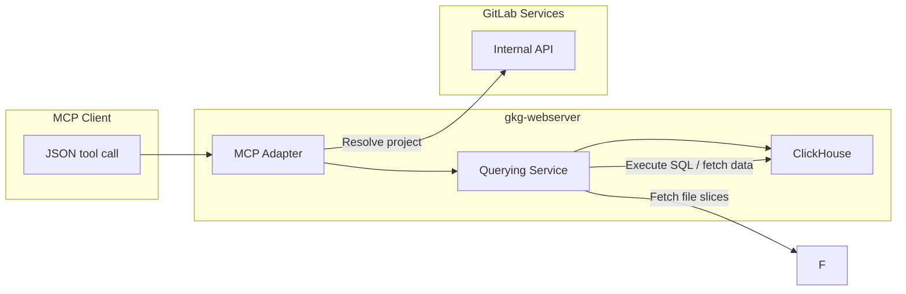

# Querying

## Overview

The deployed HTTP server (`gkg-webserver`) exposes a REST + MCP surface so agents can run graph queries without having to write Cypher or SQL directly. This server adds three major capabilities:

- A **dedicated web server** (`gkg-webserver`) that serves queries by connecting to ClickHouse and NATS to build the graph queries and serve the results.
- A **graph query engine** that compiles high‑level graph operations into ClickHouse SQL and executes them directly on adjacency‑ordered edge tables and typed node tables.
- An **intermediate query language** expressed as JSON schemas that LLMs or UI clients can fill in deterministically. These schemas translate into parameterized ClickHouse SQL executed by the graph query engine.

### Graph Query Engine

View the [Graph Query Engine](graph_engine.md) design document for more details on the graph query engine.

### Intermediate Query Language

View the [Intermediate Query Language](./intermediary_llm_query_language.md) design document for more details on the intermediate LLM query language.

### Unified Response Schema

All four query types (traversal, aggregation, path_finding, neighbors) return a unified JSON response in the shape `{ query_type, nodes, edges, columns?, pagination? }`. Deduplicated entity objects and instance-level edges replace the previous flat tabular rows, giving callers a single contract for rendering graphs, tables, or analytics views. Aggregation queries include a `columns` array describing each computed value. When the query includes a `cursor`, the response includes a `pagination` object with `has_more` and `total_rows`.

- **ADR**: [ADR 004 — Unified Response Schema](../decisions/004_unified_response_schema.md)

A `GraphFormatter` in the Rust query pipeline will handle the transformation from raw `QueryResult` rows into the unified payload. A JSON Schema defines the response contract shared between server and frontend.

## Web Server Architecture

The web server will expose endpoints for GitLab Rails to consume. This will power the following features:

- API endpoints for GitLab Rails to query the graph directly, for Knowledge Graph or Analytics products.
- MCP interface for LLMs and UI clients to query the graph.
- Software Architecture Map (UI) to visualize the graph.

### Request Routing and Query Execution

- **REST endpoints** under `/api/graph/*` and `/api/v1/*` serve code graph workflows (symbols, references, dependencies) and namespace graph analytics. Each handler resolves the target scope (tenant/namespace/project), constructs the appropriate query service, and executes parameterized SQL.
- **MCP interface** mounts under `/mcp`. The adapter shares the same query services, exposing the intermediate JSON language so agents receive both the generated SQL (for transparency) and the actual query results.
- **Web server process** (`gkg-webserver`) runs as the query front end in deployed environments. It connects to ClickHouse in read‑only mode, ensuring the query tier cannot mutate graph state while still serving low‑latency requests across multiple replicas.

## Additional Notes

- All query paths reuse the shared ontology and query infrastructure from `config/ontology/`, `config/schemas/graph_query.schema.json`, and the `query-engine/*` crates, so code and namespace graphs adhere to the same entity and relationship definitions.
- SQL generation is guard-railed: hop limits (max three for namespace traversals), explicit relationship lists, and schema-driven validation prevent runaway queries.
- The response format is defined by [ADR 004](../decisions/004_unified_response_schema.md). Every query returns a unified `{ format_version, query_type, nodes, edges, columns?, pagination? }` payload with deduplicated entity objects and instance-level edges. `format_version` is a semver string (`config/RAW_OUTPUT_FORMAT_VERSION`) so consumers can detect breaking changes. Aggregation queries include `columns` to describe computed values. Proto-level metadata (row count, generated SQL, pagination info, format name + version) travels alongside the JSON payload in `QueryMetadata`.
