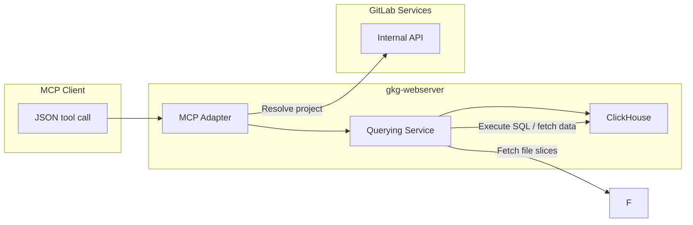

# Querying

## Overview

The deployed HTTP server (`gkg-webserver`) exposes a REST + MCP surface so agents can run graph queries without having to write Cypher or SQL directly. This server adds three major capabilities:

- A **dedicated web server** (`gkg-webserver`) that serves queries by connecting to ClickHouse and NATS to build the graph queries and serve the results.
- A **graph query engine** that compiles high‑level graph operations into ClickHouse SQL and executes them directly on adjacency‑ordered edge tables and typed node tables.
- An **intermediate query language** expressed as JSON schemas that LLMs or UI clients can fill in deterministically. These schemas translate into parameterized ClickHouse SQL executed by the graph query engine.

### Graph Query Engine

View the [Graph Query Engine](graph_engine.md) design document for more details on the graph query engine.

### Intermediate Query Language

View the [Intermediate Query Language](./intermediary_llm_query_language.md) design document for more details on the intermediate LLM query language.

### Unified Response Schema

All four query types (traversal, aggregation, path_finding, neighbors) return a unified JSON response in the shape `{ format_version, query_type, nodes, edges, columns?, group_columns?, rows?, pagination? }`. Deduplicated entity objects and instance-level edges replace the previous flat tabular rows, giving callers a single contract for rendering graphs, tables, or analytics views. Aggregation queries include a `columns` array describing each computed value, `group_columns` describing grouping keys, and tabular `rows` carrying group values plus metric values. Every response includes a `pagination` object with `has_more`, `truncated`, and (for cursor queries with more pages) `next_cursor`.

- **ADR**: [ADR 004 — Unified Response Schema](../decisions/004_unified_response_schema.md)

A `GraphFormatter` in the Rust query pipeline handles the transformation from raw `QueryResult` rows into the unified payload. A JSON Schema defines the response contract shared between server and frontend.

### Agent Command Discovery

Orbit agents discover graph capabilities through a command catalog instead of relying on long MCP tool descriptions. `ListAgentCommands` returns command names, short descriptions, and parameter schemas. `InvokeAgentCommand` executes commands that do not need Rails-specific context.

The initial catalog includes `query_graph`, `get_graph_schema`, `get_query_dsl`, and `get_response_format`. Rails intercepts `query_graph` because it needs Workhorse streaming and permission checks. GKG executes schema, DSL, and response-format discovery directly from in-memory metadata and checked-in JSON schemas.

Direct API consumers can call `GetQueryDsl` and `GetResponseFormat`; MCP agents should use the command catalog and `InvokeAgentCommand`. The query DSL version lives in `config/QUERY_DSL_VERSION` and is tied to the `graph_query` schema `$id` major version; the query response format version lives in `config/RAW_OUTPUT_FORMAT_VERSION`.

### Named Queries

Named queries are server-defined query templates for preset consumers (the Orbit dashboard) so clients invoke a stable name instead of authoring a Query DSL string that can drift from the server's grammar and ontology. Templates live as YAML under `config/named_queries/`, validated against `config/schemas/named_query.schema.json` and compiled against the ontology by `gkg-server`'s build script, so a template that no longer matches the DSL or ontology fails the build.

At runtime the same files are embedded into the binary (via the `named-queries` crate). A client executes one by sending `ExecuteQuery` with `query_type = QUERY_TYPE_NAMED` and the template name in the `query` field. The server renders `{ "$binding": ... }` placeholders from trusted request context — currently only `current_user_id`, taken from the caller's JWT claims — and runs the rendered query through the standard pipeline, so quota, security context, redaction, and response formatting behave exactly as for client-authored queries. Unknown names are rejected with a client-safe error listing the available queries. There is no client-supplied parameterization and no discovery RPC; clients reference names as stable identifiers.

Whether a given Duo agent actually receives these commands depends on routing decisions that live in GitLab Rails: which Duo surface invoked the prompt, which Orbit subsetting applies to the user, and which feature flags are on. See [Duo / Orbit prompt routing architecture](../duo_orbit_prompt_routing.md) for the full picture of when prompts reach the Orbit MCP server.

## Web Server Architecture

The web server will expose endpoints for GitLab Rails to consume. This will power the following features:

- API endpoints for GitLab Rails to query the graph directly, for Knowledge Graph or Analytics products.
- MCP interface for LLMs and UI clients to query the graph.
- Software Architecture Map (UI) to visualize the graph.

### Request Routing and Query Execution

- **REST endpoints** under `/api/graph/*` and `/api/v1/*` serve code graph workflows (symbols, references, dependencies) and namespace graph analytics. Each handler resolves the target scope (tenant/namespace/project), constructs the appropriate query service, and executes parameterized SQL.
- **MCP interface** mounts under `/mcp`. The adapter shares the same query services, exposing the intermediate JSON language so agents receive both the generated SQL (for transparency) and the actual query results.
- **Web server process** (`gkg-webserver`) runs as the query front end in deployed environments. It connects to ClickHouse in read‑only mode, ensuring the query tier cannot mutate graph state while still serving low‑latency requests across multiple replicas.

## Additional Notes

- All query paths reuse the shared ontology and query infrastructure from `config/ontology/`, `config/schemas/graph_query.schema.json`, and the `query-engine/*` crates, so code and namespace graphs adhere to the same entity and relationship definitions.
- SQL generation is guard-railed: hop limits (max three for namespace traversals), explicit relationship lists, and schema-driven validation prevent runaway queries.
- The response format is defined by [ADR 004](../decisions/004_unified_response_schema.md). Every query returns a unified `{ format_version, query_type, nodes, edges, columns?, group_columns?, rows?, pagination? }` payload with deduplicated entity objects and instance-level edges. `format_version` is a semver string (`config/RAW_OUTPUT_FORMAT_VERSION`) so consumers can detect breaking changes. Aggregation queries include `columns`, `group_columns`, and `rows` for table-shaped analytics output. Proto-level metadata (row count, generated SQL, pagination info, format name + version) travels alongside the JSON payload in `QueryMetadata`.
