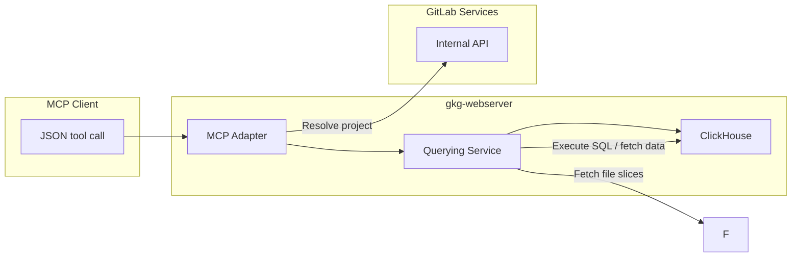

# Querying

## Overview

The deployed HTTP server (`gkg-webserver`) exposes a REST + MCP surface so agents can run graph queries without writing SQL directly. This server adds three major capabilities:

- A **dedicated web server** (`gkg-webserver`) that serves queries by connecting to ClickHouse and NATS to build the graph queries and serve the results.
- A **graph query engine** that compiles high‑level graph operations into ClickHouse SQL. It executes them directly on adjacency‑ordered edge tables and typed node tables.
- An **intermediate query language** expressed as JSON schemas that LLMs or UI clients can fill in deterministically. These schemas translate into parameterized ClickHouse SQL executed by the graph query engine.

### Graph Query Engine

View the [Graph Query Engine](graph_engine.md) design document for more details on the graph query engine.

### Intermediate Query Language

View the [Intermediate Query Language](./intermediary_llm_query_language.md) design document for more details on the intermediate LLM query language.

### Orbit query frontend

The [Orbit query frontend](orbit_query_frontend.md) is a compiler-level API for Orbit's read-only graph language. Pest pairs become a typed syntax tree that lowers into compiler Input. Rails selects it per user with the default-off `orbit_gql_queries` flag and sets the protobuf `QueryLanguage` enum. The JSON Query DSL remains the default; each user has one active mode.

### Unified Response Schema

All four query types (traversal, aggregation, path_finding, neighbors) return a unified JSON response in the shape `{ format_version, query_type, nodes, edges, columns?, group_columns?, rows?, pagination? }`. Deduplicated entity objects and instance-level edges replace the previous flat tabular rows, giving callers a single contract for rendering graphs, tables, or analytics views. Aggregation queries include a `columns` array describing each computed value, `group_columns` describing grouping keys, and tabular `rows` carrying group values plus metric values. Every response includes a `pagination` object with `has_more`, `truncated`, and (for cursor queries with more pages) `next_cursor`.

- **ADR**: [ADR 004: Unified Response Schema](../decisions/004_unified_response_schema.md)

A `GraphFormatter` in the Rust query pipeline handles the transformation from raw `QueryResult` rows into the unified payload. A JSON Schema defines the response contract shared between server and frontend.

### Agent Command Discovery

Orbit agents discover graph capabilities through a command catalog instead of relying on long MCP tool descriptions. `ListAgentCommands` returns command names, short descriptions, and parameter schemas. `InvokeAgentCommand` executes commands that do not need Rails-specific context.

The initial catalog includes `query_graph`, `get_graph_schema`, `get_query_dsl`, and `get_response_format`. When the request's `language` is `QUERY_LANGUAGE_GQL`, the catalog omits `get_query_dsl` and `query_graph` directs agents to `CALL db.schema()`. Rails intercepts `query_graph` because it needs Workhorse streaming and permission checks. GKG executes schema, DSL, and response-format discovery directly from in-memory metadata and checked-in JSON schemas.

Direct API consumers can call `GetQueryDsl` and `GetResponseFormat`; MCP agents should use the command catalog and `InvokeAgentCommand`. The query DSL version is the `query_dsl` pin in `config/versions.yaml`. It is tied to the `graph_query` schema `$id` major version. The query response format version is the `raw_output_format` pin in the same file.

### Agent Skill Source Trees

Orbit maintains two independently usable agent skill trees. `skills/orbit/` documents Orbit Remote, while `skills/orbit-cli/` documents the local capabilities embedded in the `orbit` binary. Local reference files use the `references/local/` namespace so the two trees can form a collision-free path union. With no arguments, the embedded-only `orbit skills` command prints the default `orbit-cli` skill. It appends a list of other available skills when that list is non-empty. `orbit skills get <name> [path]` prints a file from a named skill, and the path defaults to `SKILL.md`. The previous `orbit skills <name> [path]` form and path shorthand remain as hidden compatibility aliases. The singular `skill` spelling is also a hidden compatibility alias.

The remote manifest uses line-oriented HTML placeholders to show where the local manifest's sections belong. Both consumer build scripts call the shared validator in `orbit-prompts`. It requires every placeholder to have one matching local section and prevents duplicate paths across the combined trees. It also resolves relative Markdown links and checks documented remote commands against the clap command inventory. General Markdown checks remain responsible for prose, external URLs, and fragments.

### Named Queries

Named queries are server-defined queries for consumers such as the Orbit dashboard. Clients invoke a stable name instead of authoring query text. All 12 definitions live in YAML under `config/named_queries/`. Each `query` carries two spellings of the same graph shape: `json` (Query DSL object) and `gql` (query text), like the data-correctness scenarios. The request selects the spelling. `mise named-queries:validate` checks the metadata against `config/schemas/named_query.schema.json`. The server build compiles both rendered examples against the ontology with their frontends. Grammar or ontology drift fails the build.

The `named-queries` crate embeds the same files at runtime. Rails sends `ExecuteQuery` with `query_type = QUERY_TYPE_NAMED` and a separate `language` derived from the per-user `orbit_gql_queries` flag. Both languages use a JSON envelope in `query`: `{"name": ..., "parameters": {...}}`. `parameters` may be omitted for definitions that declare none. `QUERY_LANGUAGE_JSON` selects the JSON spelling and frontend; `QUERY_LANGUAGE_GQL` selects the GQL spelling and frontend. The public REST and MCP surfaces carry no language selector. The rendered query runs through the matching compiler frontend and the standard execution pipeline. Authentication, quota, security context, redaction, hydration, and response formatting are identical for both spellings.

The JSON spelling uses placeholders replaced by value: `{"$binding": "current_user_id"}` for the caller's ID from trusted JWT claims, `{"$param": "name"}` for a client value, and a `"$param:name"` object key for a string parameter used as a property name.

The GQL spelling uses MiniJinja lookup functions:

- `binding("current_user_id")` returns the caller's ID, separate from client parameters.
- `param("name")` encodes a client value as a GQL literal with JSON string escaping. It supports strings, Int64 integers, booleans, and arrays.
- `identifier("name")` accepts only ASCII identifiers matching `[A-Za-z_][A-Za-z0-9_]*` and emits a backtick-quoted identifier. Use it for dynamic entity and property names. The compiler checks ontology membership.
- `integer("name")` formats a non-negative decimal Int64 ID, including the existing string-valued definition IDs.

Templates are trusted, checked-in code, not client input. Authors must place GQL lookups at complete literal or identifier positions, outside quotes, backticks, and comments. Raw parameter values are not exposed to MiniJinja, and rendered values are not evaluated as template text. Each parameter keeps one JSON Schema and one build-time example shared by both spellings. Unknown names, missing or unknown parameters, schema violations, undeclared lookups, unused declarations in either spelling, and unknown server bindings are rejected.

`ListNamedQueries`, surfaced as `GET /api/v4/orbit/templates`, returns only parameterless definitions rendered in the mode selected by its `language`: `QUERY_LANGUAGE_JSON` or `QUERY_LANGUAGE_GQL`. Unknown languages reject. This discovery method has no source-kind field. Each entry contains only its name, description, and caller-rendered `raw_query`. The default query leads the catalog; the other entries retain name order. Rails supplies the editor mode in the page's bootstrap data, independently of catalog contents. Empty or failed catalogs cannot change the editor mode. An absent `language` field selects JSON for older Rails callers. Cached catalogs must not cross users or modes.

Active-schema snapshots validate both rendered examples with shared native shape, reference, and normalization checks. This check needs no caller security context. Definitions that do not fit the active ontology are hidden and rejected by name. Execution still uses the caller's security context and the snapshot's ontology.

Compiler parity tests in `crates/integration-tests/tests/compiler/named_queries.rs` compile both spellings of all 12 definitions and require identical SQL, parameters, result context, and hydration, including hostile strings, dynamic identifiers, ID lists, and binding spoofing. The corpus smoke test executes both spellings.

Whether a given Duo agent actually receives these commands depends on routing decisions that live in GitLab Rails. Three factors decide it: which Duo surface invoked the prompt, which Orbit subsetting applies to the user, and which feature flags are on. See [Duo / Orbit prompt routing architecture](../duo_orbit_prompt_routing.md) for the full picture of when prompts reach the Orbit MCP server.

## Web Server Architecture

The web server will expose endpoints for GitLab Rails to consume. This will power the following features:

- API endpoints for GitLab Rails to query the graph directly, for Orbit or Analytics products.
- MCP interface for LLMs and UI clients to query the graph.
- Software Architecture Map (UI) to visualize the graph.

### Request Routing and Query Execution

- **REST endpoints** under `/api/graph/*` and `/api/v1/*` serve code graph workflows (symbols, references, dependencies) and namespace graph analytics. Each handler resolves the target scope (tenant/namespace/project), constructs the appropriate query service, and executes parameterized SQL.
- **MCP interface** mounts under `/mcp`. The adapter shares the same query services. It exposes the intermediate JSON language. So agents receive both the generated SQL (for transparency) and the actual query results.
- **Web server process** (`gkg-webserver`) runs as the query front end in deployed environments. It connects to ClickHouse in read‑only mode. So the query tier cannot mutate graph state while still serving low‑latency requests across multiple replicas.

```mermaid
flowchart LR
    subgraph MCP Client
        A[JSON tool call]
    end

    subgraph gkg-webserver
        B[MCP Adapter]
        C[Querying Service]
        D[ClickHouse]
    end

    subgraph GitLab Services
        E[Internal API]
    end

    A --> B --> C
    C --> D
    C -->|Execute SQL / fetch data| D
    C -->|Fetch file slices| F
    B -->|Resolve project| E
```

## Additional Notes

- All query paths reuse the shared ontology and query infrastructure. That includes `config/ontology/`, `config/schemas/graph_query.schema.json`, and the `query-engine/*` crates. So code and namespace graphs adhere to the same entity and relationship definitions.
- SQL generation is guard-railed. Traversal shape limits and a maximum of three hops per relationship selector apply. A path-finding depth cap of three, explicit relationship lists, and schema-driven validation also prevent runaway queries.
- The response format is defined by [ADR 004](../decisions/004_unified_response_schema.md). Every query returns a unified `{ format_version, query_type, nodes, edges, columns?, group_columns?, rows?, pagination? }` payload with deduplicated entity objects and instance-level edges. `format_version` is a semver string (the `raw_output_format` pin in `config/versions.yaml`) so consumers can detect breaking changes. Aggregation queries include `columns`, `group_columns`, and `rows` for table-shaped analytics output. Proto-level metadata (row count, generated SQL, pagination info, format name + version) travels alongside the JSON payload in `QueryMetadata`.
