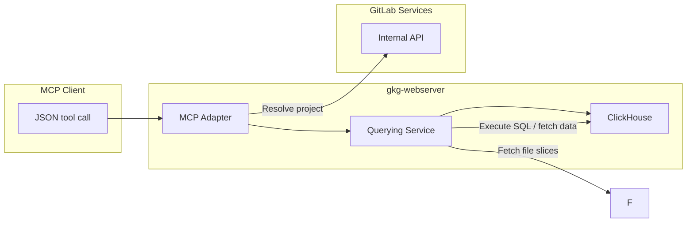

# Querying

## Overview

The deployed HTTP server (`gkg-webserver`) exposes a REST + MCP surface so agents can run graph queries without writing SQL directly. This server adds three major capabilities:

- A **dedicated web server** (`gkg-webserver`) that serves queries by connecting to ClickHouse and NATS to build the graph queries and serve the results.
- A **graph query engine** that compiles high‑level graph operations into ClickHouse SQL. It executes them directly on adjacency‑ordered edge tables and typed node tables.
- An **intermediate query language** expressed as JSON schemas that LLMs or UI clients can fill in deterministically. These schemas translate into parameterized ClickHouse SQL executed by the graph query engine.

### Graph Query Engine

View the [Graph Query Engine](graph_engine.md) design document for more details on the graph query engine.

### Intermediate Query Language

View the [Intermediate Query Language](./intermediary_llm_query_language.md) design document for more details on the intermediate LLM query language.

### Orbit query frontend

The [Orbit query frontend](orbit_query_frontend.md) is a compiler-level API for Orbit's read-only graph language. Pest pairs become a typed syntax tree that lowers into compiler Input. Rails selects it per user with the default-off `orbit_gql_queries` flag and sets the protobuf `QueryLanguage` enum. The JSON Query DSL remains the default; each user has one active mode.

### Unified Response Schema

All four query types (traversal, aggregation, path_finding, neighbors) return a unified JSON response in the shape `{ format_version, query_type, nodes, edges, columns?, group_columns?, rows?, pagination? }`. Deduplicated entity objects and instance-level edges replace the previous flat tabular rows, giving callers a single contract for rendering graphs, tables, or analytics views. Aggregation queries include a `columns` array describing each computed value, `group_columns` describing grouping keys, and tabular `rows` carrying group values plus metric values. Every response includes a `pagination` object with `has_more`, `truncated`, and (for cursor queries with more pages) `next_cursor`.

- **ADR**: [ADR 004: Unified Response Schema](../decisions/004_unified_response_schema.md)

A `GraphFormatter` in the Rust query pipeline handles the transformation from raw `QueryResult` rows into the unified payload. A JSON Schema defines the response contract shared between server and frontend.

### Agent Command Discovery

Orbit agents discover graph capabilities through a command catalog instead of relying on long MCP tool descriptions. `ListAgentCommands` returns command names, short descriptions, and parameter schemas. `InvokeAgentCommand` executes commands that do not need Rails-specific context.

The initial catalog includes `query_graph`, `get_graph_schema`, `get_query_dsl`, and `get_response_format`. When the request's `language` is `QUERY_LANGUAGE_GQL`, the catalog omits `get_query_dsl` and `query_graph` directs agents to `CALL db.schema()`. Rails intercepts `query_graph` because it needs Workhorse streaming and permission checks. GKG executes schema, DSL, and response-format discovery directly from in-memory metadata and checked-in JSON schemas.

Direct API consumers can call `GetQueryDsl` and `GetResponseFormat`; MCP agents should use the command catalog and `InvokeAgentCommand`. The query DSL version is the `query_dsl` pin in `config/versions.yaml`. It is tied to the `graph_query` schema `$id` major version. The query response format version is the `raw_output_format` pin in the same file.

### Agent Skill Source Trees

Orbit maintains two independently usable agent skill trees. `skills/orbit/` documents Orbit Remote, while `skills/orbit-cli/` documents the local capabilities embedded in the `orbit` binary. Local reference files use the `references/local/` namespace so the two trees form a collision-free path union. `orbit skills` lists the selected instance's deployed skills. `orbit skills get <name> [path]` conditionally downloads and validates the named whole tree, composes it in memory with local guidance, and prints `SKILL.md` by default. The previous `orbit skills <name> [path]` form and path shorthand remain as hidden compatibility aliases. The singular `skill` spelling is also a hidden compatibility alias.

The CLI uses only the complete `ORBIT_API_BASE_URL`, `ORBIT_AUTH_HEADER_NAME`, and `ORBIT_AUTH_HEADER_VALUE` tuple exported by glab for skill requests. An absent or incomplete tuple selects the embedded local tree without invoking a credential helper. A `404` or unreachable instance also falls back with a warning; authentication and authorization failures remain errors. A transient server failure can use the last validated tree for that instance, but remains an error when no cached tree exists.

Validated remote trees are cached below the operating system's user cache directory under `orbit/skills/<origin-hash>/<skill>/<version>/`. The origin hash includes the URL scheme, host, and port. Downloads verify normalized relative paths, every file SHA-256, the top-level `version` and `compatibility` frontmatter, and the item ETag (`"<version>"`, optionally weak). The CLI uses an OS advisory lock, then fsyncs and atomically renames a sibling staging directory; a killed process cannot strand the lock. If the cache is unwritable, the validated download still serves with a warning. The cache stores the byte-for-byte remote files and a validation manifest, never local files or composed output. Conditional requests use the cached version ETag; a new version refreshes the cache. Skill versions are identity, not content hashes: if a deployment reuses a version for different content, a `304` cannot detect the change. Pruning retains the two most recently validated versions per instance and skill.

The remote manifest uses line-oriented HTML placeholders to show where the local manifest's sections belong. Both consumer build scripts call the shared validator in `orbit-prompts`. It requires every placeholder to have one matching local section and prevents duplicate paths across the combined trees. The build-time validator also resolves relative Markdown links and checks documented remote commands against the clap command inventory. The runtime composer reuses the same marker parser but tolerates release skew: unmatched remote placeholders disappear and unmatched local sections are appended under `## Local CLI`. General Markdown checks remain responsible for prose, external URLs, and fragments.

### Named Queries

Named queries are server-defined queries for consumers such as the Orbit dashboard. Clients invoke a stable name instead of authoring query text. The 12 YAML definitions under `config/named_queries/` carry JSON Query DSL and GQL spellings of the same graph shape.

The `named-queries` crate validates and embeds both spellings. JSON templates use `$binding` for trusted caller values and `$param` for client values. GQL templates use `binding`, `param`, `identifier`, and `integer` lookup functions. Each parameter has one JSON Schema and one example shared by both spellings.

Rails sends `QUERY_TYPE_NAMED` with a separate language selected by the per-user `orbit_gql_queries` flag. Both languages use the same JSON envelope: `{"name": ..., "parameters": {...}}`. The server renders the selected spelling and compiles it with the matching frontend. Authentication, quota, redaction, and response formatting are the same for both modes.

The GQL `param` function encodes strings, signed or unsigned 64-bit integers, booleans, and arrays. `identifier` accepts ASCII identifiers up to 64 bytes. `integer` accepts non-negative signed 64-bit IDs, including string-valued IDs that preserve JavaScript precision.

Unknown names, missing values, and invalid parameters return client-safe errors. A JSON `"$param:name"` key lets a string parameter select a property. `ListNamedQueries`, surfaced as `GET /api/v4/orbit/templates`, lists parameterless queries with caller bindings resolved in the selected language.

The build and active-schema loader validate both spellings. Compiler parity tests require identical SQL, parameters, and query types. The corpus smoke test executes both spellings.

Whether a given Duo agent actually receives these commands depends on routing decisions that live in GitLab Rails. Three factors decide it: which Duo surface invoked the prompt, which Orbit subsetting applies to the user, and which feature flags are on. See [Duo / Orbit prompt routing architecture](../duo_orbit_prompt_routing.md) for the full picture of when prompts reach the Orbit MCP server.

## Web Server Architecture

The web server will expose endpoints for GitLab Rails to consume. This will power the following features:

- API endpoints for GitLab Rails to query the graph directly, for Orbit or Analytics products.
- MCP interface for LLMs and UI clients to query the graph.
- Software Architecture Map (UI) to visualize the graph.

### Request Routing and Query Execution

- **REST endpoints** under `/api/graph/*` and `/api/v1/*` serve code graph workflows (symbols, references, dependencies) and namespace graph analytics. Each handler resolves the target scope (tenant/namespace/project), constructs the appropriate query service, and executes parameterized SQL.
- **MCP interface** mounts under `/mcp`. The adapter shares the same query services. It exposes the intermediate JSON language. So agents receive both the generated SQL (for transparency) and the actual query results.
- **Web server process** (`gkg-webserver`) runs as the query front end in deployed environments. It connects to ClickHouse in read‑only mode. So the query tier cannot mutate graph state while still serving low‑latency requests across multiple replicas.

```mermaid
flowchart LR
    subgraph MCP Client
        A[JSON tool call]
    end

    subgraph gkg-webserver
        B[MCP Adapter]
        C[Querying Service]
        D[ClickHouse]
    end

    subgraph GitLab Services
        E[Internal API]
    end

    A --> B --> C
    C --> D
    C -->|Execute SQL / fetch data| D
    C -->|Fetch file slices| F
    B -->|Resolve project| E
```

## Additional Notes

- All query paths reuse the shared ontology and query infrastructure. That includes `config/ontology/`, `config/schemas/graph_query.schema.json`, and the `query-engine/*` crates. So code and namespace graphs adhere to the same entity and relationship definitions.
- SQL generation is guard-railed. Traversal shape limits and a maximum of three hops per relationship selector apply. A path-finding depth cap of three, explicit relationship lists, and schema-driven validation also prevent runaway queries.
- The response format is defined by [ADR 004](../decisions/004_unified_response_schema.md). Every query returns a unified `{ format_version, query_type, nodes, edges, columns?, group_columns?, rows?, pagination? }` payload with deduplicated entity objects and instance-level edges. `format_version` is a semver string (the `raw_output_format` pin in `config/versions.yaml`) so consumers can detect breaking changes. Aggregation queries include `columns`, `group_columns`, and `rows` for table-shaped analytics output. Proto-level metadata (row count, generated SQL, pagination info, format name + version) travels alongside the JSON payload in `QueryMetadata`.
