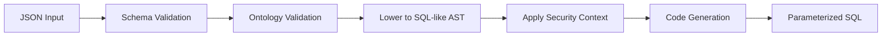
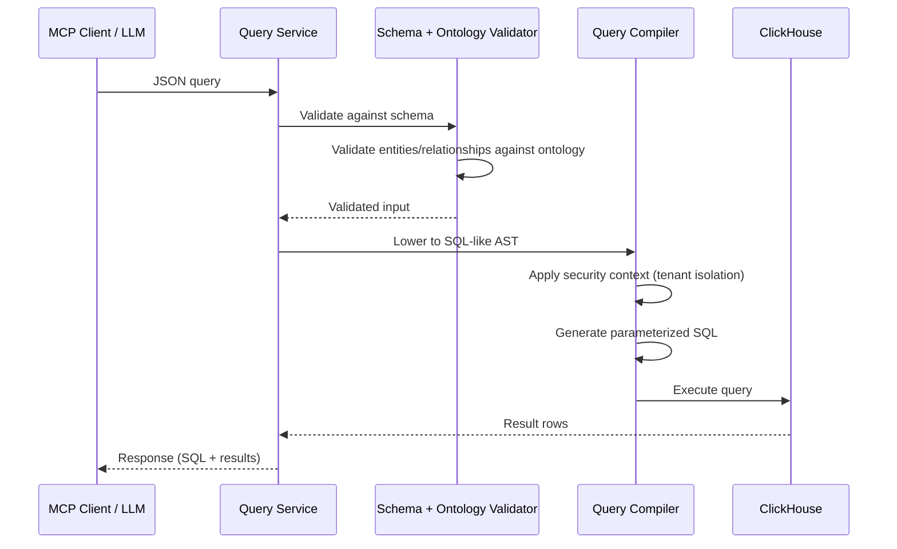

# Intermediary LLM query language

## Overview

The Knowledge Graph uses a JSON query DSL that compiles to ClickHouse SQL. Rather than exposing multiple specialized tools, we provide a single query schema that supports traversal (including single-entity lookups), aggregation, path finding, and neighborhood exploration. The graph ontology validates all queries at runtime.

The query engine follows this pipeline:



The JSON schema (`config/schemas/graph_query.schema.json`) defines the structure, while the ontology (`config/ontology/`) provides entity types, relationship types, and property definitions that are validated at runtime.



## Query Schema

The JSON query schema supports four query types through a single unified structure.

### Required Fields

| Field | Type | Description |
|-------|------|-------------|
| `query_type` | `string` | One of: `traversal`, `aggregation`, `path_finding`, `neighbors` |
| `nodes` | `array` | Node selectors to match (required for multi-node traversal, aggregation, path_finding) |
| `node` | `object` | Single node selector (required for `neighbors`, allowed for single-entity `traversal`) |

### Optional Fields

| Field | Type | Description |
|-------|------|-------------|
| `relationships` | `array` | Relationship traversals between nodes |
| `aggregations` | `array` | Aggregation specs (required when `query_type` is `aggregation`) |
| `path` | `object` | Path finding config (required when `query_type` is `path_finding`) |
| `neighbors` | `object` | Neighbors config (required when `query_type` is `neighbors`) |
| `limit` | `integer` | Max results (1-1000, default: 30) |
| `order_by` | `object` | Result ordering specification |
| `aggregation_sort` | `object` | Ordering for aggregation outputs |
| `cursor` | `object` | Agent-driven pagination cursor `{ offset, page_size }`. Slices the authorized (post-redaction) result set. |
| `options` | `object` | Consumer-level preferences that affect result presentation, not query semantics. See [Query Options](#query-options). |

## Node Selectors

Each node selector specifies which graph nodes to match. For `neighbors` queries and single-entity `traversal` lookups, use the `node` field (singular). For multi-node `traversal`, `aggregation`, and `path_finding` queries, use the `nodes` array. You cannot specify both.

```json
{
  "id": "u",
  "entity": "User",
  "columns": ["username", "email"],
  "filters": {
    "username": "admin"
  },
  "node_ids": [123, 456]
}
```

| Field | Type | Description |
|-------|------|-------------|
| `id` | `string` | Variable identifier (required). Used to reference this node in relationships and aggregations. |
| `entity` | `string` | Entity type (e.g., `User`, `Project`, `MergeRequest`). Validated against ontology. |
| `columns` | `string` or `array` | Columns to return. Use `"*"` for all columns, or an array of column names (e.g., `["username", "email"]`). If omitted, only `id` is returned. Columns are validated against the ontology. |
| `filters` | `object` | Property filters. Keys are property names. |
| `node_ids` | `array` | Specific node IDs to match. |
| `id_range` | `object` | ID range filter with `start` and `end` (inclusive). |
| `id_property` | `string` | Which property contains the ID (default: `id`). |

## Filter Operators

Filters support both simple equality and advanced operators.

**Simple equality:**

```json
{"filters": {"username": "admin", "state": "active"}}
```

**Advanced operators:**

```json
{
  "filters": {
    "created_at": {"op": "gte", "value": "2024-01-01"},
    "state": {"op": "in", "value": ["active", "blocked"]},
    "username": {"op": "contains", "value": "admin"}
  }
}
```

| Operator | Description | Example |
|----------|-------------|---------|
| `eq` | Equality | `{"op": "eq", "value": "admin"}` |
| `gt`, `lt`, `gte`, `lte` | Comparison | `{"op": "gte", "value": 100}` |
| `in` | Membership | `{"op": "in", "value": ["a", "b"]}` |
| `contains` | Substring match | `{"op": "contains", "value": "test"}` |
| `starts_with` | Prefix match | `{"op": "starts_with", "value": "gl_"}` |
| `ends_with` | Suffix match | `{"op": "ends_with", "value": "_bot"}` |
| `is_null` | Null check | `{"op": "is_null"}` |
| `is_not_null` | Not null check | `{"op": "is_not_null"}` |

## Relationship Selectors

Relationships connect nodes in the query:

```json
{
  "type": "AUTHORED",
  "from": "u",
  "to": "mr",
  "direction": "outgoing",
  "max_hops": 1
}
```

| Field | Type | Description |
|-------|------|-------------|
| `type` | `string` or `array` | Relationship type(s) to traverse. Use an array for multiple types. |
| `from` | `string` | Source node variable ID. |
| `to` | `string` | Target node variable ID. |
| `direction` | `string` | `outgoing` (default), `incoming`, or `both`. |
| `min_hops` | `integer` | Minimum hops (0-3, default: 1). |
| `max_hops` | `integer` | Maximum hops (1-3, default: 1). |
| `filters` | `object` | Filters on relationship properties. |

## Query Types

### Traversal Queries

Match nodes and relationships, return matching entities.

```json
{
  "query_type": "traversal",
  "nodes": [
    {"id": "u", "entity": "User"},
    {"id": "mr", "entity": "MergeRequest", "filters": {"state": "merged"}}
  ],
  "relationships": [
    {"type": "AUTHORED", "from": "u", "to": "mr"}
  ],
  "limit": 25,
  "order_by": {"node": "mr", "property": "merged_at", "direction": "DESC"}
}
```

### Aggregation Queries

Group and aggregate results.

```json
{
  "query_type": "aggregation",
  "nodes": [
    {"id": "mr", "entity": "MergeRequest"},
    {"id": "u", "entity": "User"}
  ],
  "relationships": [
    {"type": "AUTHORED", "from": "u", "to": "mr"}
  ],
  "aggregations": [
    {"function": "count", "target": "mr", "group_by": "u", "alias": "mr_count"}
  ],
  "limit": 10,
  "aggregation_sort": {"agg_index": 0, "direction": "DESC"}
}
```

| Aggregation Function | Description | Requires `property` |
|---------------------|-------------|---------------------|
| `count` | Count matching entities | No |
| `sum` | Sum of property values | Yes |
| `avg` | Average of property values | Yes |
| `min` | Minimum property value | Yes |
| `max` | Maximum property value | Yes |
| `collect` | Collect values into array | Yes |

### Path Finding Queries

Find paths between nodes using recursive CTEs.

```json
{
  "query_type": "path_finding",
  "nodes": [
    {"id": "start", "entity": "Project", "node_ids": [100]},
    {"id": "end", "entity": "Project", "node_ids": [200]}
  ],
  "path": {
    "type": "shortest",
    "from": "start",
    "to": "end",
    "max_depth": 3,
    "rel_types": ["CONTAINS", "DEPENDS_ON"]
  }
}
```

| Path Type | Description |
|-----------|-------------|
| `shortest` | Find the single shortest path |
| `all_shortest` | Find all paths of minimum length |
| `any` | Find any valid path |

### Single-entity Traversal (lookup)

Match a single entity type with optional filters — a `traversal` query with one node and no relationships. Use the `node` field (singular) instead of `nodes`.

```json
{
  "query_type": "traversal",
  "node": {
    "id": "u",
    "entity": "User",
    "columns": ["username", "email"],
    "filters": {
      "username": {"op": "starts_with", "value": "admin"}
    }
  },
  "limit": 10
}
```

### Neighbors Queries

Find all nodes connected to a given node. Neighbors queries use the `node` field (singular) and require a `neighbors` configuration.

```json
{
  "query_type": "neighbors",
  "node": {"id": "u", "entity": "User", "node_ids": [100]},
  "neighbors": {
    "node": "u",
    "direction": "both",
    "rel_types": ["AUTHORED", "MEMBER_OF"]
  },
  "limit": 20
}
```

| Field | Type | Description |
|-------|------|-------------|
| `node` | `string` | Node variable ID to find neighbors for (required). |
| `direction` | `string` | `outgoing`, `incoming`, or `both` (default: `both`). |
| `rel_types` | `array` | Relationship types to traverse. If omitted, all types are considered. |

The response includes the neighbor's ID, entity type, and the relationship that connects them.

## Query Options

The `options` object controls presentation behavior without changing query semantics. It is optional and all fields have sensible defaults.

```json
{
  "query_type": "path_finding",
  "nodes": [
    {"id": "start", "entity": "User", "node_ids": [1]},
    {"id": "end", "entity": "Project", "node_ids": [100]}
  ],
  "path": {"type": "shortest", "from": "start", "to": "end", "max_depth": 3},
  "options": {"dynamic_columns": "*"}
}
```

| Field | Type | Default | Description |
|-------|------|---------|-------------|
| `dynamic_columns` | `string` | `"default"` | Columns fetched for dynamically-discovered entities during PathFinding/Neighbors hydration. `"default"` returns the entity's `default_columns` from the ontology. `"*"` returns all columns. |
| `include_debug_sql` | `boolean` | `false` | When `true`, includes compiled ClickHouse SQL in response metadata. Only honored for authorized users (instance admins and direct GitLab org members with Reporter+ access). |

This is relevant for PathFinding and Neighbors queries where entity types are discovered at runtime. For Search and Traversal queries, column selection is controlled per-node via the `columns` field and this option has no effect.

## Ontology Integration

The query engine validates queries against the ontology at runtime. The ontology defines:

- **Entity types**: Valid node labels (e.g., `User`, `Project`, `MergeRequest`)
- **Relationship types**: Valid edge labels (e.g., `AUTHORED`, `CONTAINS`, `IN_PROJECT`)
- **Properties**: Available properties per entity with their data types

Entity and relationship type names in queries must match definitions in the ontology. Property filters are validated to ensure the property exists on the referenced entity.

### Schema Discovery

The `get_graph_schema` tool returns the ontology in a compact TOON format sized for LLM context windows. It does not expose the underlying ClickHouse or Postgres schema.

By default, the response lists node types grouped by domain and edge types with their source/target types. Pass `expand_nodes` to get property details and relationships for specific entity types.

**Parameters:**

```json
{
  "expand_nodes": ["User", "MergeRequest"]
}
```

| Field | Type | Description |
|-------|------|-------------|
| `expand_nodes` | `array` | Node types to expand with properties and relationships (optional). |

**Default response structure (compact):**

The response groups nodes by domain and lists edges with their valid source and target types:

```yaml
domains:
  - name: core
    nodes: [User, Group, Project, Note]
  - name: code_review
    nodes: [MergeRequest, MergeRequestDiff, MergeRequestDiffFile]
  - name: ci
    nodes: [Pipeline, Stage, Job]
  - name: security
    nodes: [Vulnerability, VulnerabilityOccurrence, Finding, ...]
  - name: plan
    nodes: [WorkItem, Milestone, Label]
  - name: source_code
    nodes: [Branch, Directory, File, Definition, ImportedSymbol]
edges:
  - name: AUTHORED
    from: [User]
    to: [Note, MergeRequest, Vulnerability, WorkItem]
  - name: CONTAINS
    from: [Group, User, WorkItem]
    to: [Group, Project, WorkItem]
  ...
```

**Expanded response (when `expand_nodes=["User"]`):**

Expanded nodes include their properties (with types and nullability) and their outgoing/incoming relationship types:

```yaml
- name: User
  props: [id:int64, username:string, email:string, is_admin:boolean, user_type:enum]
  out: [AUTHORED, CONTAINS, MEMBER_OF, OWNER, ...]
  in: [ASSIGNED, CONFIRMED_BY, CREATOR, DISMISSED_BY, ...]
```

## Compilation Security

From a security perspective, all JSON inputs are validated and sanitized based on their contents. This is a hard requirement for related MR reviews.

### Typed JSON → Internal AST → SQL

We never concatenate user/LLM strings into raw SQL:

1. JSON is deserialized into strongly-typed Rust structs matching the schema
2. Structs are validated against the ontology (entity types, relationship types, properties)
3. Validated input is lowered to an internal SQL AST
4. SQL generator only accepts this AST—it cannot take arbitrary strings

This prevents the LLM from "inventing" SQL fragments. The query builder only interpolates placeholders in the SQL and binds the actual values out-of-band via the driver, so there is no injection point.

### Parameterization

All user-supplied scalar values (node IDs, filter values like `state = 'opened'`, date ranges, etc.) are passed as bound parameters to ClickHouse. This applies equally whether the request comes directly from a user, an LLM, or another service.

```sql
SELECT u.id AS u_id, mr.id AS mr_id
FROM gl_users AS u
INNER JOIN gl_edges AS e0 ON (u.id = e0.source_id AND (e0.relationship_kind = {p0:String}))
INNER JOIN gl_merge_requests AS mr ON (e0.target_id = mr.id)
WHERE (u.username = {p1:String}) AND (mr.state = {p2:String})
LIMIT 25
```

With parameters:

```json
{
  "p0": "AUTHORED",
  "p1": "admin",
  "p2": "merged"
}
```

### Validation

**Identifier validation:**

- Node/relationship variable IDs: alphanumeric + underscore, 1-64 chars, must start with letter/underscore
- Safe SQL identifier pattern: `^[a-zA-Z_][a-zA-Z0-9_]{0,63}$`

**Ontology validation:**

All enum-like fields (entity types, relationship types, property names) are validated against strict allow-lists derived from the ontology:

- Entity types must be one of the known node types (e.g., `User`, `Project`, `MergeRequest`, `Issue`)
- Relationship types must be one of the known edge types (e.g., `AUTHORED`, `IN_PROJECT`, `CONTAINS`)
- Properties must exist on their referenced entity
- Aggregation targets/group_by must reference valid nodes
- Filter operators are limited to a small, explicit set (`eq`, `in`, `gte`, `lte`, etc.), represented as enums in the AST

If a value is not in the allow-list, we reject the request with a validation error rather than passing it through to SQL. This means the LLM cannot introduce new table names, join arbitrary system tables, or call random functions.

**Constraint enforcement:**

Each relationship step has a hard-coded `max_hops` cap, and the schema enforces the same bounds:

- `max_hops` limited to 3 to prevent resource exhaustion
- `limit` capped at 1000 results (default: 30)
- Path `max_depth` limited to 3
- `node_ids` capped at 500 per node selector
- `IN` filter values capped at 100 per filter
- `cursor.offset` capped at 999, `cursor.page_size` capped at 100
- `cursor.offset + cursor.page_size` must not exceed `limit`

> **Note:** These limits will be tuned as we collect usage data.

### Multi-Tenant Isolation

Security context is injected into all queries via `traversal_path` filtering:

- Single path: `startsWith(traversal_path, "{path}")`
- Multiple paths: Optimized with longest common prefix

This filtering is applied to node tables (not edge tables) and injected into the WHERE clause for short-circuit filtering. Tables whose visibility is determined through relationships rather than path hierarchy (e.g., `gl_users`) are excluded from path-based filtering. Permission predicates are injected based on the caller's JWT, so the resulting query is still subject to the GitLab authorization model.

### Read-Only Execution

Generated SQL is executed using a read-only database user that:

- Can only run `SELECT` (no `INSERT/UPDATE/DELETE/DDL`)
- Is restricted to Knowledge Graph tables
- Has permission predicates injected based on the caller's JWT

This makes it harder for an LLM-originated query to read cross-tenant data or modify storage.

### Resource Controls

Because the Query Engine is the **only** path from JSON into SQL, we have a single choke point for enforcing resource controls:

- Per-request timeouts and max result size
- Per-user and per-token rate limiting
- Logging/metrics on generated ASTs and compiled SQL, so we can audit or block abusive patterns

### Summary

The compilation step is a controlled JSON → AST → SQL translation. Free-form values are parameterized, enum-like inputs are validated against allow-lists, the database role is read-only and tenant-scoped, and traversal depth and result sizes are capped.

## Complete Example

**Input:**

```json
{
  "query_type": "traversal",
  "nodes": [
    {"id": "u", "entity": "User", "filters": {"username": "admin"}},
    {"id": "mr", "entity": "MergeRequest", "filters": {"state": "merged"}}
  ],
  "relationships": [
    {"type": "AUTHORED", "from": "u", "to": "mr"}
  ],
  "limit": 25
}
```

**Generated SQL:**

```sql
SELECT u.id AS u_id, mr.id AS mr_id
FROM gl_users AS u
INNER JOIN gl_edges AS e0 ON (u.id = e0.source_id AND (e0.relationship_kind = {p0:String}))
INNER JOIN gl_merge_requests AS mr ON (e0.target_id = mr.id)
WHERE startsWith(mr.traversal_path, {sec0:String})
  AND (u.username = {p1:String})
  AND (mr.state = {p2:String})
LIMIT 25
```

**Parameters:**

```json
{
  "p0": "AUTHORED",
  "sec0": "1/",
  "p1": "admin",
  "p2": "merged"
}
```
