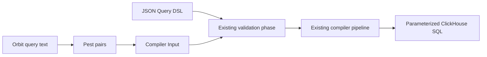

# Orbit query frontend

## Scope and terms

The Orbit query frontend accepts a read-only graph language based on openCypher 9 syntax.
It includes Orbit-specific restrictions and extensions and supports only the operations that Orbit's compiler can express.

The `orbit-query` crate provides a compiler-level API. The JSON Query DSL remains the default for remote requests.
This implementation does not change MCP tools, protocol messages, Rails, or glab.

A **Pest pair** is a matched grammar rule and its source span.
The compiler's **Input** contains node selectors, predicates, and the other logical query fields.

## Grammar source

`crates/query-engine/orbit-query/src/query.pest` adapts selected productions from the official openCypher 9 M23 EBNF grammar to Pest.
Retained rule names follow the source where practical. PEG alternatives put longer operators and more specific expressions first.

The crate's `LICENSE` contains the Apache-2.0 license and upstream attribution for the adapted grammar.
The new Rust implementation remains under the repository's license.

The grammar restricts identifiers and arrows to ASCII. Escaped identifiers must still pass the compiler's identifier rules.
Keywords are case insensitive; identifiers are case sensitive. Strings support M23 escape forms, and comments count as whitespace.

## Compiler boundary



Lowering walks Pest pairs directly into Input. It does not construct another query AST or serialize a JSON query.
Scalar values use the same value type as the compiler's filters.

`orbit_query::parse` takes query text and parameters and returns Input.
`orbit_query::compile` passes that Input to `compiler::compile_from_input`.
Both compiler entry points run the same ClickHouse pipeline in the same pass order.

The validation phase accepts exactly one input source. JSON retains its existing schema and ontology checks.
Typed input uses `input_validation` for shape, identifier, and ontology checks that JSON deserialization would otherwise provide.
The adapter reuses schema-defined scalar bounds. Both sources then run the existing reference and filter-type checks.

Normalization, restriction, security checks, hydration planning, and SQL generation remain shared.
Shared normalization makes equality explicit in virtual-column filters before building hydration plans.
The hydration-only `compile_input` entry point is not used for query text.

Filter maps become ordered predicate lists through one shared helper.
This makes SQL and parameter ordering stable without changing filter meaning.

## Supported statement

```plaintext
MATCH pattern [WHERE predicates]
RETURN projections
[ORDER BY key [ASC | DESC]]
[LIMIT value]
```

The pattern contains one node or one linear chain. Nodes need unique variables and one label.
The far endpoint of a neighbors query is the exception: it has a variable but no label or predicate.

The frontend infers the query type:

| Pattern or projection | Compiler query type |
|---|---|
| Named `shortestPath(...)` pattern | Path finding |
| One relationship to an unfiltered, unlabeled far endpoint | Neighbors |
| Aggregate in RETURN | Aggregation |
| Other supported patterns | Traversal |

Path finding supports outgoing paths from one hop to an explicit maximum.
Variable-length traversal accepts exact lengths and bounded ranges. Each range has the compiler's three-hop cap.
Relationship property filters, including inline maps, require a maximum of one hop.

```plaintext
MATCH (u:User {id: 1})-[:AUTHORED]->(mr:MergeRequest {state: 'merged'})
RETURN u.username, mr.title
LIMIT 10
```

RETURN controls the existing graph response, not a general-purpose table of arbitrary expressions.
Traversal properties select node columns. Whole nodes use ontology defaults; `properties(node)` selects all allowed columns.
Neighbors queries reject `properties(node)`, including projections of the center, because their hydration uses dynamic column specifications instead of per-node selections.
The compiler still includes graph identity and relationship metadata.

Aggregates support `count`, `sum`, `avg`, `min`, and `max`.
Non-aggregate return items become group keys. Property groups and metrics can have aliases.
An aggregated node projection must include `.id` so grouping preserves node identity.

```plaintext
MATCH (u:User)-[:AUTHORED]->(n:Note {id: 1})
RETURN u{.id, .username}, count(n) AS notes
ORDER BY notes DESC
LIMIT 10
```

The implementation adds node projections, `shortestPath` pattern syntax, `date_trunc`, and token predicates to the selected EBNF productions.
These are implementation extensions, not changes to the official grammar.

Predicates support AND, comparisons, IN, string matching, null checks, and the compiler's three token predicates.
A `$parameter` supplies a value, never an identifier or query fragment.

ID forms preserve the compiler's distinct selector and filter representations:

- An inline integer `{id: 1}` becomes `node_ids`.
- A standalone `node.id IN [...]` becomes `node_ids`.
- Paired lower and upper ID bounds become an inclusive `id_range`.
- `WHERE node.id = 1` remains a property filter.
- Additional predicates on an already pinned node remain filters; they do not replace its ID selector.

## Rejections and bounds

The frontend rejects mutations, multiple statements, comma-separated patterns, WITH, OPTIONAL MATCH, UNION, UNWIND, and subqueries.
It also rejects OR, general NOT, not-equal, DISTINCT, count(*), arbitrary expressions, and offset pagination.
Unsupported syntax or lowering returns a client-safe error rather than dropping the unsupported part.

Query text is limited to 32 KiB. A flat Pest scan checks nesting before recursive parsing, with a limit of 32 levels.
Parameters have bounded size and nesting, and every `$parameter` reference is charged against the same 32 KiB budget so repeated references cannot expand past it. Existing compiler limits still apply after lowering.

Cursor binding is not implemented for the typed entry point. It rejects cursor input rather than accepting an unbound cursor.
Cursor support, custom ID-property spellings, and presentation-option syntax remain outside this first frontend slice.

## Parity tests

Handwritten text queries sit beside JSON fixtures in `crates/integration-tests/tests/compiler/dialects/clickhouse.rs`.
The shared test helper compares SQL byte for byte, parameter names and typed values, query type, and hydration plans.
Existing SQL assertions remain in place. Other tests cover syntax rejection, literals, parameter binding, and authorization.

JSON syntax-error tests remain JSON-only.
The existing `valid_identifiers_produce_renderable_sql` fixture also remains JSON-only:
its relationship order reaches the planner's fallback join between unconnected aliases.
A linear text pattern cannot reproduce that SQL without changing its meaning. The frontend does not repair that separate planner issue.

These tests establish compiler parity for the paired cases, not full Query DSL coverage or agent evaluation results.
JSON removal still requires the remaining coverage and the token-cost and malformed-query measurements.

## References

- [Official openCypher 9 resources](https://opencypher.org/resources/)
- [M23 EBNF grammar](https://s3.amazonaws.com/artifacts.opencypher.org/M23/cypher.ebnf)
- [Existing Query DSL](intermediary_llm_query_language.md)
- [Graph query engine](graph_engine.md)
