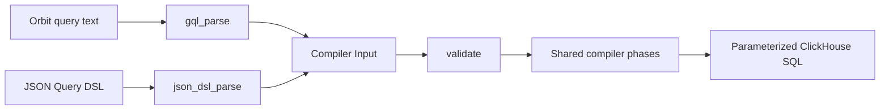

# Orbit query frontend

## Scope and terms

The Orbit query frontend accepts a read-only graph language based on openCypher 9 syntax.
It includes Orbit-specific restrictions and extensions and supports only the operations that Orbit's compiler can express.

The frontend is a compiler pipeline preset, `clickhouse_gql`. Remote requests select it with `language: gql` and a text query; the JSON Query DSL remains the default.
Unknown selectors and mismatched payload shapes reject rather than selecting a parser from the query's syntax.

A **Pest pair** is a matched grammar rule and its source span.
The compiler's **Input** contains node selectors, predicates, and the other logical query fields.

## Grammar source

`crates/query-engine/compiler/src/passes/frontend/gql/query.pest` adapts selected productions from the official openCypher 9 M23 EBNF grammar to Pest.
Retained rule names follow the source where practical. PEG alternatives put longer operators and more specific expressions first.

The module's `LICENSE` contains the Apache-2.0 license and upstream attribution for the adapted grammar.
The new Rust implementation remains under the repository's license.

The grammar restricts identifiers and arrows to ASCII. Escaped identifiers must still pass the compiler's identifier rules.
Keywords are case insensitive; identifiers are case sensitive. Strings support M23 escape forms, and comments count as whitespace.

## Compiler boundary



Each query language is one module under `crates/query-engine/compiler/src/passes/frontend/` and one phase in the pipeline declaration in `config.rs`.
`json_dsl_parse` runs the JSON schema check, the ontology-derived schema check, and cursor hashing, then deserializes.
`gql_parse` walks Pest pairs directly into Input; it does not construct another query AST or serialize a JSON query.
Scalar values use the same value type as the compiler's filters.

The `clickhouse_json_dsl` and `clickhouse_gql` presets differ only in that first phase. Both parse phases read the one `raw` state and write `Input`; `validate` and everything after it can reach only `Input`, so no shared phase can depend on the source language.

`compiler::compile` takes the raw text and a `Frontend` and runs that frontend's full preset.
The query pipeline carries the same `Frontend` into `validate_normalize` for path resolution and into full compilation, so both read the same parser.

`validate` runs the validator's shape check on every Input. It checks identifiers, limits, and ontology membership natively; it does not read the JSON schema.
Its limits are Rust constants in `schema_limits`, and the compiler's build script asserts that the schema still matches them.
JSON is therefore checked twice, once by schema and once natively; the redundancy is cheap and means every JSON test also exercises the shared validator.
Retiring the JSON DSL later deletes the `json_dsl` module, its phase, its `Frontend` variant, and the schema file; the shared phases do not change.

Normalization, restriction, security checks, hydration planning, and SQL generation remain shared.
Shared normalization makes equality explicit in virtual-column filters before building hydration plans.
The hydration-only `compile_input` entry point is not used for query text.

Filter maps become ordered predicate lists through one shared helper.
This makes SQL and parameter ordering stable without changing filter meaning.

## Remote transport

The gRPC `QueryType` enum is `JSON=0`, `NAMED=1`, `GQL=2`; unknown values reject.
REST and MCP `query_graph` accept `language: gql` with query text; omitted `language` keeps the JSON object.
Rails maps the selector onto the gRPC query type. The CLI sends `--language gql` text unchanged.
Rails rejects `language: gql` before the request reaches Workhorse unless the `orbit_gql_queries` feature flag is enabled for the user or for a root group where the user is Reporter or higher; GKG itself does not gate the frontend.
Path resolution, authorization, redaction, hydration, and response formatting are shared.
The base ClickHouse query's attribution payload records the language alongside the query text.

## Supported statement

```plaintext
MATCH pattern [WHERE predicates]
RETURN projections
[ORDER BY key [ASC | DESC]]
[LIMIT value]
```

The pattern contains one node or one linear chain. Nodes need unique variables and one label.
The far endpoint of a neighbors query is the exception: it has a variable but no label or predicate.

The frontend infers the query type:

| Pattern or projection | Compiler query type |
|---|---|
| Named `shortestPath(...)` pattern | Path finding |
| One relationship to an unfiltered, unlabeled far endpoint | Neighbors |
| Aggregate in RETURN | Aggregation |
| Other supported patterns | Traversal |

Path finding supports outgoing paths from one hop to an explicit maximum.
Variable-length traversal accepts exact lengths and bounded ranges. Traversal and path finding share the compiler's three-hop cap.
Undirected relationships are supported only for neighbors queries. Between labeled nodes, use `->` or `<-`.
Relationship property filters, including inline maps, require a maximum of one hop.

```plaintext
MATCH (u:User {id: 1})-[:AUTHORED]->(mr:MergeRequest {state: 'merged'})
RETURN u.username, mr.title
LIMIT 10
```

RETURN controls the existing graph response, not a general-purpose table of arbitrary expressions.
Traversal properties select node columns. Whole nodes use ontology defaults; `properties(node)` selects all allowed columns.
Neighbors queries reject `properties(node)`, including projections of the center, because their hydration uses dynamic column specifications instead of per-node selections.
The compiler still includes graph identity and relationship metadata.

Aggregates support `count`, `sum`, `avg`, `min`, and `max`.
Non-aggregate return items become group keys. Property groups and metrics can have aliases.
An aggregated node projection must include `.id` so grouping preserves node identity; every listed property, including `.id`, becomes a requested column.

```plaintext
MATCH (u:User)-[:AUTHORED]->(n:Note {id: 1})
RETURN u{.id, .username}, count(n) AS notes
ORDER BY notes DESC
LIMIT 10
```

The implementation adds node projections, `shortestPath` pattern syntax, `date_trunc`, and token predicates to the selected EBNF productions.
These are implementation extensions, not changes to the official grammar.

Predicates support AND, comparisons, IN, string matching, null checks, and the compiler's three token predicates.
Values are literals; the frontend has no parameter binding, so callers keep untrusted values out of the query text themselves.

ID forms preserve the compiler's distinct selector and filter representations:

- An inline integer `{id: 1}` becomes `node_ids`.
- A standalone `node.id IN [...]` becomes `node_ids`.
- Paired lower and upper ID bounds become an inclusive `id_range`.
- `WHERE node.id = 1` remains a property filter.
- Additional predicates on an already pinned node remain filters; they do not replace its ID selector.

## Rejections and bounds

The frontend rejects mutations, multiple statements, comma-separated patterns, WITH, OPTIONAL MATCH, UNION, UNWIND, and subqueries.
It also rejects OR, general NOT, not-equal, DISTINCT, count(*), arbitrary expressions, and offset pagination.
Unsupported syntax or lowering returns a client-safe error rather than dropping the unsupported part.
Syntax errors report line, column, and expected tokens without echoing query text; lowering errors name the offending identifier.

Query text is limited to 32 KiB. A flat Pest scan checks nesting before recursive parsing, with a limit of 32 levels.
Existing compiler limits still apply after lowering.
Explicit relationship-type lists are capped at 10 entries for traversal, path finding, and neighbors queries.

Cursor binding is not implemented for the typed entry point. It rejects cursor input rather than accepting an unbound cursor.
Cursor support, custom ID-property spellings, and presentation-option syntax remain outside this first frontend slice.

## Parity tests

Handwritten text queries sit beside JSON fixtures in `crates/integration-tests/tests/compiler/dialects/clickhouse.rs`.
The shared test helper compares SQL byte for byte, parameter names and typed values, query type, and hydration plans.
Existing SQL assertions remain in place. Other tests cover syntax rejection, literals, and authorization.

The YAML query scenarios under `crates/integration-tests/tests/server/data_correctness/scenarios/` run against ClickHouse in CI.
Each scenario declares its query once per frontend under `query:`, keyed `json` and `gql`, and every frontend present is checked against the same result expectations.
The runner parses each key into a `Frontend` and passes it to `compiler::compile`.
A scenario with no text spelling, such as cursor pagination, carries only the `json` key.

JSON syntax-error tests remain JSON-only.
The existing `valid_identifiers_produce_renderable_sql` fixture also remains JSON-only:
its relationship order reaches the planner's fallback join between unconnected aliases.
A linear text pattern cannot reproduce that SQL without changing its meaning. The frontend does not repair that separate planner issue.

These tests establish compiler parity for the paired cases, not full Query DSL coverage or agent evaluation results.
JSON removal still requires the remaining coverage and the token-cost and malformed-query measurements.

## References

- [Official openCypher 9 resources](https://opencypher.org/resources/)
- [M23 EBNF grammar](https://s3.amazonaws.com/artifacts.opencypher.org/M23/cypher.ebnf)
- [Existing Query DSL](intermediary_llm_query_language.md)
- [Graph query engine](graph_engine.md)
