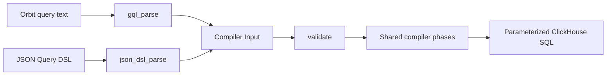

# Orbit query frontend

## Scope and terms

The Orbit query frontend accepts a read-only graph language based on openCypher 9 syntax.
It includes Orbit-specific restrictions and extensions and supports only the operations that Orbit's compiler can express.

The frontend is a compiler pipeline preset, `clickhouse_gql`. The JSON Query DSL remains the default for remote requests.
This implementation does not change MCP tools, protocol messages, Rails, or glab.

A **Pest pair** is a matched grammar rule and its source span.
The frontend's **syntax tree** is the typed Rust form of one statement, built from pairs by `pest_consume` in `syntax.rs` and declared in `ast.rs`.
The compiler's **Input** contains node selectors, predicates, and the other logical query fields.

## Grammar source

`crates/query-engine/compiler/src/passes/frontend/gql/query.pest` adapts selected productions from the official openCypher 9 M23 EBNF grammar to Pest.
Retained rule names follow the source where practical. PEG alternatives put longer operators and more specific expressions first.

The module's `LICENSE` contains the Apache-2.0 license and upstream attribution for the adapted grammar.
The new Rust implementation remains under the repository's license.

The grammar restricts identifiers and arrows to ASCII. Escaped identifiers must still pass the compiler's identifier rules.
Keywords are case insensitive; identifiers are case sensitive. Strings support M23 escape forms, and comments count as whitespace.
`PAGE`, `AFTER`, `DEBUG`, `ANY`, and `SHORTEST` are reserved in addition to the openCypher reserved words, so a variable with one of those names needs backticks.

## Compiler boundary



Each query language is one module under `crates/query-engine/compiler/src/passes/frontend/` and one phase in the pipeline declaration in `config.rs`.
`json_dsl_parse` runs the JSON schema check, the ontology-derived schema check, and cursor hashing, then deserializes.
`gql_parse` runs in two steps and never serializes a JSON query.
`syntax.rs` converts Pest pairs into the typed syntax tree with `pest_consume` methods.
Fixed child shapes use `match_nodes!`; optional query clauses and relationship fields are consumed by rule without enumerating their combinations.
The grammar enforces their order and cardinality, and the consumer rejects unexpected rules.
Lexical checks live here: identifier rules, string escapes, numeric ranges, `date_trunc` units, and duplicate map keys.
`lower/` then turns the syntax tree into Input and owns every check that needs query-wide context: variable uniqueness, ID promotion, query-type classification, projection rules, and ORDER BY resolution.
Syntax-tree errors carry the pair's line and column; a child shape the conversion has no arm for is a pipeline invariant, not a client error.
Scalar values use the same value type as the compiler's filters.

The `clickhouse_json_dsl` and `clickhouse_gql` presets differ only in that first phase. Both parse phases read the one `raw` state and write `Input`; `validate` and everything after it can reach only `Input`, so no shared phase can depend on the source language.

`compiler::compile` takes the raw text and a `Frontend` and runs that frontend's preset.

`validate` runs the validator's shape check on every Input. It checks identifiers, limits, and ontology membership natively; it does not read the JSON schema.
Its limits are Rust constants in `schema_limits`, and the compiler's build script asserts that the schema still matches them.
JSON is therefore checked twice, once by schema and once natively; the redundancy is cheap and means every JSON test also exercises the shared validator.
Retiring the JSON DSL later deletes the `json_dsl` module, its phase, its `Frontend` variant, and the schema file; the shared phases do not change.

Normalization, restriction, security checks, hydration planning, and SQL generation remain shared.
Shared normalization makes equality explicit in virtual-column filters before building hydration plans.
The hydration-only `compile_input` entry point is not used for query text.

Filter maps become ordered predicate lists through one shared helper.
This makes SQL and parameter ordering stable without changing filter meaning.

## Supported statement

```plaintext
MATCH pattern [WHERE predicates]
RETURN projections
[ORDER BY key [ASC | DESC]]
[LIMIT rows | PAGE rows [AFTER 'token']]
[DEBUG]
```

The pattern contains one node or one linear chain. Nodes need unique variables and one label.
The far endpoint of a neighbors query is the exception: it has a variable but no label or predicate.

The frontend infers the query type:

| Pattern or projection | Compiler query type |
|---|---|
| Named `ANY SHORTEST ...` pattern | Path finding |
| One relationship to an unfiltered, unlabeled far endpoint | Neighbors |
| Aggregate in RETURN | Aggregation |
| Other supported patterns | Traversal |

Path finding supports outgoing paths from one hop to an explicit maximum.
Aggregation over shortest paths is unsupported; shared validation rejects it for both JSON and GQL.
Variable-length traversal accepts exact lengths and bounded ranges. Traversal and path finding share the compiler's three-hop cap.
Undirected relationships are supported only for neighbors queries. Between labeled nodes, use `->` or `<-`.
Relationship property filters, including inline maps, require a maximum of one hop.

```plaintext
MATCH (u:User {id: 1})-[:AUTHORED]->(mr:MergeRequest {state: 'merged'})
RETURN u.username, mr.title
LIMIT 10
```

RETURN controls the existing graph response, not a general-purpose table of arbitrary expressions.
Traversal properties select node columns. Whole nodes use ontology defaults; `properties(node)` selects all allowed columns.
`properties(node)` on the far endpoint of a neighbors query or on a path variable sets the compiler's dynamic column mode to all columns, because those results are hydrated from dynamic column specifications instead of per-node selections.
Neighbors queries select center columns with `center.property` items and still reject `properties(center)`.
The compiler still includes graph identity and relationship metadata.

Aggregates support `count`, `sum`, `avg`, `min`, and `max`.
Non-aggregate return items become group keys. Property groups and metrics can have aliases.
An aggregated node projection must include `.id` so grouping preserves node identity; every listed property, including `.id`, becomes a requested column.

```plaintext
MATCH (u:User)-[:AUTHORED]->(n:Note {id: 1})
RETURN u{.id, .username}, count(n) AS notes
ORDER BY notes DESC
LIMIT 10
```

The implementation adds node projections, `date_trunc`, token predicates, `PAGE ... AFTER`, and `DEBUG` to the selected EBNF productions.
These are implementation extensions, not changes to the official grammar.
Shortest paths use the ISO GQL path search prefix, `p = ANY SHORTEST (a)-[*1..3]->(b)` or `p = SHORTEST 1 ...`, because openCypher 9 has no shortest-path syntax.
The other GQL selectors (`ALL SHORTEST`, `SHORTEST k` for k above one, `SHORTEST k GROUP`) are rejected: the compiler returns one path per endpoint pair.
`ANY` and `SHORTEST` are reserved.

Predicates support AND, comparisons, IN, string matching, null checks, and the compiler's three token predicates.
Values are literals; the frontend has no parameter binding, so callers keep untrusted values out of the query text themselves.

ID forms preserve the compiler's distinct selector and filter representations:

- An inline integer `{id: 1}` becomes `node_ids`.
- The first nonempty `node.id IN [...]` becomes `node_ids` unless the node already has an ID selector.
- When two ID predicates remain and form lower and upper bounds, they become an inclusive `id_range`.
- An ID list and range can appear together, in any predicate order.
- `WHERE node.id = 1` remains a property filter.
- Other ID predicates remain filters; they do not replace the ID selector.

## Rejections and bounds

The frontend rejects mutations, multiple statements, comma-separated patterns, WITH, OPTIONAL MATCH, UNION, UNWIND, and subqueries.
It also rejects OR, general NOT, not-equal, DISTINCT, count(*), arbitrary expressions, and offset pagination.
Unsupported syntax or lowering returns a client-safe error rather than dropping the unsupported part.

Query text is limited to 32 KiB. A flat Pest scan checks nesting before recursive parsing, with a limit of 32 levels.
Existing compiler limits still apply after lowering.
Explicit relationship-type lists are capped at 10 entries for traversal, path finding, and neighbors queries.

Custom ID-property spellings remain outside the frontend.

## Pagination and presentation

`PAGE rows` replaces `LIMIT` and requests keyset pagination: it lowers to the compiler's cursor with that page size, so the response carries `next_cursor` while more rows remain.
`PAGE rows AFTER 'token'` continues from the previous page's `next_cursor`. Both clauses reuse the JSON DSL's cursor and the shared validation, decoding, seek, and readback passes.

A cursor token binds to the statement's lexical tokens, excluding the whole `PAGE` clause, whitespace, and comments.
Changing the page size or formatting keeps the cursor valid, including changes to whitespace around `PAGE`.
String literals and escaped identifiers retain their exact text. Changes inside them, including whitespace, reject the cursor with the "issued for a different query" error.
Other token edits, such as keyword case changes, also reject the cursor. This is not the JSON DSL's structural comparison.
JSON and text tokens never validate against each other because their hash sources differ.

`DEBUG` sets the compiler's `include_debug_sql` presentation option and keeps its existing authorization rules.

## Parity tests

Handwritten text queries sit beside JSON fixtures in `crates/integration-tests/tests/compiler/dialects/clickhouse.rs`.
The shared test helper compares SQL byte for byte, parameter names and typed values, query type, and hydration plans.
Existing SQL assertions remain in place. Other tests cover syntax rejection, literals, and authorization.

The YAML query scenarios under `crates/integration-tests/tests/server/data_correctness/scenarios/` run against ClickHouse in CI.
Each scenario declares its query once per frontend under `query:`, keyed `json` and `gql`, and every frontend present is checked against the same result expectations.
The runner parses each key into a `Frontend` and passes it to `compiler::compile`.
A scenario whose query has no text spelling carries only the `json` key.
Paginated scenarios end their text query with the `PAGE` clause, and the runner appends `AFTER` with each `next_cursor`.

### GQL fuzzing

The `fuzz_gql_grammar` target in `crates/fuzz/` generates query text from `query.pest` through `orbit_fuzz::grammar::Grammar` and `pest_meta`.
Input bytes choose grammar productions, with repetition bounded to two.
Each derivation must be consumed by `syntax.rs`: a lowering error is acceptable, a syntax error or pipeline invariant is not.
The real parser decides whether a derivation is faithful: its pair tree for the generated text must equal the rules the walk produced, which discards derivations that PEG ordered choice or greedy repetition would read differently.

The `fuzz_gql` target sends arbitrary text through the compiler and checks that errors are client-safe.
Semantic checks remain in the JSON parity tests above, whose paired JSON and text queries must compile to matching SQL.

JSON syntax-error tests remain JSON-only.
The existing `valid_identifiers_produce_renderable_sql` fixture also remains JSON-only:
its relationship order reaches the planner's fallback join between unconnected aliases.
A linear text pattern cannot reproduce that SQL without changing its meaning. The frontend does not repair that separate planner issue.

These tests establish compiler parity for the paired cases, not full Query DSL coverage or agent evaluation results.
JSON removal still requires the remaining coverage and the token-cost and malformed-query measurements.

## References

- [Official openCypher 9 resources](https://opencypher.org/resources/)
- [M23 EBNF grammar](https://s3.amazonaws.com/artifacts.opencypher.org/M23/cypher.ebnf)
- [Existing Query DSL](intermediary_llm_query_language.md)
- [Graph query engine](graph_engine.md)
