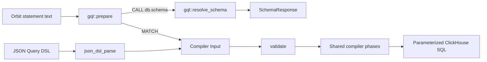

# Orbit query frontend

## Scope and terms

The Orbit query frontend accepts a read-only graph language based on openCypher 9 syntax.
It includes Orbit-specific query restrictions, extensions, and schema discovery.

Queries use the compiler pipeline preset `clickhouse_gql`; schema calls resolve metadata inside the GQL frontend.
Remote graph queries select GQL with `language: gql` and a text query. The JSON Query DSL remains the default.
Unknown selectors and mismatched payload shapes reject rather than selecting a parser from the query's syntax.

A **Pest pair** is a matched grammar rule and its source span.
A query's **syntax tree** is its typed Rust form, built from pairs by `pest_consume` in `syntax.rs` and declared in `ast.rs`.
The compiler's **Input** contains node selectors, predicates, and the other logical query fields.

## Grammar source

`crates/query-engine/compiler/src/passes/frontend/gql/query.pest` adapts selected productions from the official openCypher 9 M23 EBNF grammar to Pest.
Retained rule names follow the source where practical. PEG alternatives put longer operators and more specific expressions first.

The module's `LICENSE` contains the Apache-2.0 license and upstream attribution for the adapted grammar.
The new Rust implementation remains under the repository's license.

The grammar restricts identifiers and arrows to ASCII. Escaped identifiers must still pass the compiler's identifier rules.
Keywords are case insensitive; identifiers are case sensitive. Strings support M23 escape forms, and comments count as whitespace.
`PAGE`, `AFTER`, `DEBUG`, `ANY`, and `SHORTEST` are reserved in addition to the openCypher reserved words, so a variable with one of those names needs backticks.

## Compiler boundary



Each query language is one module under `crates/query-engine/compiler/src/passes/frontend/` and lowers graph queries to the language-neutral Input.
`json_dsl_parse` runs the JSON schema check, the ontology-derived schema check, and cursor hashing, then deserializes; JSON is query-only.
The GQL frontend uses one anchored `Statement` grammar root for queries and schema calls. Query lowering runs in two steps and never serializes a JSON query.
`syntax.rs` converts Pest pairs into the typed syntax tree with `pest_consume` methods.
Fixed child shapes use `match_nodes!`; optional query clauses and relationship fields are consumed by rule without enumerating their combinations.
The grammar enforces their order and cardinality, and the consumer rejects unexpected rules.
Lexical checks live here: identifier rules, string escapes, numeric ranges, `date_trunc` units, and duplicate map keys.
`lower/` then turns the syntax tree into Input. It owns every check that needs query-wide context: variable uniqueness, ID promotion, query-type classification, projection rules, and ORDER BY resolution.
Syntax-tree errors carry the pair's line and column; a child shape the conversion has no arm for is a pipeline invariant, not a client error.
Scalar values use the same value type as the compiler's filters.

The `clickhouse_json_dsl` and `clickhouse_gql` presets start with `json_dsl_parse` and `gql_parse`, then share the complete `validate` through `codegen` phases.
The `gql_parse` phase parses raw query text when supplied. Preparation supplies parsed Input instead, so the wrapper leaves it unchanged without parsing twice.
Schema preparation, result types, and resolution belong only to the GQL frontend. Shared compiler contexts have no schema request, response, or introspection scope.

`compiler::gql::route` parses once and returns lowered query Input or resolved schema metadata. `compiler::gql::prepare` uses that result to compile MATCH or return CALL metadata.
`compiler::compile` remains query-only for both frontends. Its GQL path runs `gql_parse`, which rejects schema calls before metadata resolution.

`validate` runs the validator's shape check on every Input. It checks identifiers, limits, and ontology membership natively; it does not read the JSON schema.
Its limits are Rust constants in `schema_limits`, and the compiler's build script asserts that the schema still matches them.
JSON is therefore checked twice, once by schema and once natively; the redundancy is cheap and means every JSON test also exercises the shared validator.
Retiring the JSON DSL later deletes the `json_dsl` module, its phase, its `Frontend` variant, and the schema file; the shared phases do not change.

Normalization, restriction, security checks, hydration planning, and SQL generation remain shared.
Shared normalization makes equality explicit in virtual-column filters before building hydration plans.
The hydration-only `compile_input` entry point is not used for query text.

Filter maps become ordered predicate lists through one shared helper.
This makes SQL and parameter ordering stable without changing filter meaning.

## Statement preparation API

Here, preparation means compiling a graph query or resolving schema metadata. It does not create a reusable database prepared statement.

`compiler::gql::prepare(raw, &ontology, &security_context, scope)` returns `gql::PreparedStatement::Query(Box<CompiledQueryContext>)` or `gql::PreparedStatement::Schema(SchemaResponse)`.
MATCH runs the complete graph compilation pipeline. CALL returns ontology metadata with named `domains` and `edges` fields, without SQL or data reads.
Zero arguments list all node and relationship types within the supplied `IntrospectionScope` (`All` or `Local`).
One string filters the response to that node: `domains` contains only its domain and expanded node, including properties and incoming/outgoing relationships.
The `edges` list contains only relationship types with a connection to that node within the selected scope. Other nodes and domains are omitted.
Scope filters schema metadata, not graph-query authorization. Existing schema tools keep their expansion behavior; this node filter applies only to GQL calls.

```plaintext
MATCH (n:User {id: 1}) RETURN n
CALL db.schema()
CALL db.schema('MergeRequest')
```

The `db.` prefix follows openCypher 9 procedure naming. `db.schema` is Orbit-defined, not an exact Neo4j builtin or an ISO catalog operation.
Only case-sensitive `db.schema` is allowed. `resolve_schema` rejects unknown or scope-hidden nodes and `'*'` against the supplied ontology. The grammar rejects extra arguments, parameters, YIELD, and query composition.
`compiler::compile` remains query-only.

## Remote transport

The gRPC `QueryType` enum is `JSON=0`, `NAMED=1`, `GQL=2`; unknown values reject.
REST and MCP `query_graph` accept `language: gql` with query text; omitted `language` keeps the JSON object.
Rails maps the selector onto the gRPC query type. The CLI sends `--language gql` text unchanged.
Rails checks the default-off `orbit_gql_queries` flag before it forwards GQL requests to Workhorse.
The flag can target a user or a root group.
The root-group gate requires the Developer role or higher in that group or one of its subgroups.
Orbit Remote does not check this flag.
Command discovery advertises GQL even when the flag is off.
The server routing stage parses GQL once and returns its result through `PipelineRunner`.
For MATCH, it carries the lowered Input into path resolution and compilation; the `gql_parse` wrapper leaves that Input unchanged.
For CALL, it returns schema metadata before security-context construction, path resolution, ClickHouse, row authorization, redaction, hydration, and graph formatting.
Request authentication and query quota checks happen before this dispatch. Schema calls return raw JSON or TOON in the existing result envelope and do not emit graph-query billing events.
Successful and failed schema calls each record one query outcome and its elapsed duration, without graph-stage or result-row metric samples.
The base ClickHouse query's attribution payload records the language alongside the query text.

## Supported query statement

```plaintext
MATCH pattern [WHERE predicates]
RETURN projections
[ORDER BY key [ASC | DESC]]
[LIMIT rows | PAGE rows [AFTER 'token']]
[DEBUG]
```

The pattern can contain a node, a chain, or comma-separated parts that form one connected tree.
Declare each node's label and inline properties on its first occurrence. Later parts can refer to that variable without declaring another node. A repeated label must match; repeated inline properties are rejected. Add further predicates with WHERE.
The first relationship establishes the tree. Each later relationship must attach one new node to it. Disconnected hops and cycles between pattern variables are rejected. Nodes can be declared before their relationships, but every declared node must belong to the final connected pattern.
The far endpoint of a neighbors query is the exception to the label requirement: it has a variable but no label or predicate.

The frontend infers the query type:

| Pattern or projection | Compiler query type |
|---|---|
| Named `ANY SHORTEST ...` pattern | Path finding |
| One relationship to an unfiltered, unlabeled far endpoint | Neighbors |
| Aggregate in RETURN | Aggregation |
| Other supported patterns | Traversal |

Path finding supports outgoing paths from one hop to an explicit maximum.
Aggregation over shortest paths is unsupported; shared validation rejects it for both JSON and GQL.
Variable-length traversal accepts exact lengths and bounded ranges. Traversal and path finding share the compiler's three-hop cap.
Undirected relationships are supported only for neighbors queries. Between labeled nodes, use `->` or `<-`.
Relationship property filters, including inline maps, require a maximum of one hop.

```plaintext
MATCH (u:User {id: 1})-[:AUTHORED]->(mr:MergeRequest {state: 'merged'})
RETURN u.username, mr.title
LIMIT 10
```

RETURN controls the existing graph response, not a general-purpose table of arbitrary expressions.
Traversal properties select node columns. Whole nodes use ontology defaults; `properties(node)` selects all allowed columns.
`properties(node)` on the far endpoint of a neighbors query or on a path variable sets the compiler's dynamic column mode to all columns. Those results are hydrated from dynamic column specifications instead of per-node selections.
Neighbors queries select center columns with `center.property` items and still reject `properties(center)`.
The compiler still includes graph identity and relationship metadata.

Aggregates support `count`, `sum`, `avg`, `min`, and `max`.
Non-aggregate return items become group keys. Property groups and metrics can have aliases.
An aggregated node projection selects the requested properties without requiring `.id`. The shared compiler still groups by node identity and returns its graph ID separately. Requesting `.id` also includes it as a property.
The same node can appear under distinct aggregation aliases if every occurrence requests the same properties. Conflicting projections are rejected.

```plaintext
MATCH (u:User)-[:AUTHORED]->(n:Note {id: 1})
RETURN u{.username}, count(n) AS notes
ORDER BY notes DESC
LIMIT 10
```

The implementation adds node projections, `date_trunc`, token predicates, `PAGE ... AFTER`, and `DEBUG` to the selected EBNF productions.
These are implementation extensions, not changes to the official grammar.
Shortest paths use the ISO GQL path search prefix, `p = ANY SHORTEST (a)-[*1..3]->(b)` or `p = SHORTEST 1 ...`, because openCypher 9 has no shortest-path syntax.
The other GQL selectors (`ALL SHORTEST`, `SHORTEST k` for k above one, `SHORTEST k GROUP`) are rejected: the compiler returns one path per endpoint pair.
`ANY` and `SHORTEST` are reserved.

Predicates support AND, comparisons, IN, string matching, null checks, and the compiler's three token predicates.
Values are literals; the frontend has no parameter binding, so callers keep untrusted values out of the query text themselves.

ID forms preserve the compiler's distinct selector and filter representations:

- An inline integer `{id: 1}` becomes `node_ids`.
- The first nonempty `node.id IN [...]` becomes `node_ids` unless the node already has an ID selector.
- When two ID predicates remain and form lower and upper bounds, they become an inclusive `id_range`.
- An ID list and range can appear together, in any predicate order.
- `WHERE node.id = 1` remains a property filter.
- Other ID predicates remain filters; they do not replace the ID selector.

## Rejections and bounds

The frontend rejects mutations, multiple statements, disconnected patterns, cycles between pattern variables, WITH, OPTIONAL MATCH, UNION, UNWIND, and subqueries.
It also rejects OR, general NOT, DISTINCT, count(*), arbitrary expressions, and offset pagination. Both `<>` and `!=` express not-equal.
Unsupported syntax or lowering returns a client-safe error rather than dropping the unsupported part.
Syntax errors report line, column, and expected tokens without echoing query text; lowering errors name the offending identifier.

Query text is limited to 32 KiB. A flat Pest scan checks nesting before recursive parsing, with a limit of 32 levels.
Existing compiler limits still apply after lowering.
Explicit relationship-type lists are capped at 10 entries for traversal, path finding, and neighbors queries.

Custom ID-property spellings remain outside the frontend.

## Pagination and presentation

`PAGE rows` replaces `LIMIT` and requests keyset pagination. It lowers to the compiler's cursor with that page size, so the response carries `next_cursor` while more rows remain.
`PAGE rows AFTER 'token'` continues from the previous page's `next_cursor`. Both clauses reuse the JSON DSL's cursor and the shared validation, decoding, seek, and readback passes.

A cursor token binds to the statement's lexical tokens, excluding the whole `PAGE` clause, whitespace, and comments.
Changing the page size or formatting keeps the cursor valid, including changes to whitespace around `PAGE`.
String literals and escaped identifiers retain their exact text. Changes inside them, including whitespace, reject the cursor with the "issued for a different query" error.
Other token edits, such as keyword case changes, also reject the cursor. This is not the JSON DSL's structural comparison.
JSON and text tokens never validate against each other because their hash sources differ.

`DEBUG` sets the compiler's `include_debug_sql` presentation option and keeps its existing authorization rules.

## Integration tests

YAML query scenarios under `crates/integration-tests/tests/server/data_correctness/scenarios/` are the canonical test surface for data correctness. Each scenario declares its query once per frontend under `query:`, keyed `json` and `gql`, and every frontend present is checked against the same result expectations. The runner parses each key into a `Frontend` and passes it to `compiler::compile`. A scenario whose query has no text spelling carries only the `json` key. Paginated scenarios end their text query with the `PAGE` clause, and the runner appends `AFTER` with each `next_cursor`. See the [integration-testkit README](../../../crates/integration-testkit/README.md) for the full `QueryScenario` format reference.

Handwritten text queries sit beside JSON fixtures in `crates/integration-tests/tests/compiler/dialects/clickhouse.rs` for compiler-level parity (SQL output, parameters, hydration plans). These are separate from the data correctness scenarios.

### GQL fuzzing

The `fuzz_gql_grammar` target in `crates/fuzz/` generates query text from `query.pest` through `orbit_fuzz::grammar::Grammar` and `pest_meta`.
Input bytes choose grammar productions, with repetition bounded to two.
Each derivation must be consumed by `syntax.rs`: a lowering error is acceptable, a syntax error or pipeline invariant is not.
The real parser decides whether a derivation is faithful. Its pair tree for the generated text must equal the rules the walk produced. This discards derivations that PEG ordered choice or greedy repetition would read differently.

The `fuzz_gql` target sends arbitrary text through the compiler and checks that errors are client-safe.
Semantic checks remain in the JSON parity tests above, whose paired JSON and text queries must compile to matching SQL.

JSON syntax-error tests remain JSON-only.
The existing `valid_identifiers_produce_renderable_sql` fixture also remains JSON-only:
its relationship order reaches the planner's fallback join between unconnected aliases.
GQL rejects that disconnected hop order. The frontend does not reproduce or repair the separate planner issue.

The data-correctness scenarios check both spellings against the same expected nodes, edges, groups, and values. Shared-node branches and repeated aggregation aliases have paired scenarios; GQL-only rejection scenarios cover ambiguous node declarations and invalid topology. SQL text need not be identical for results to be equivalent.
These tests do not establish full Query DSL coverage or agent evaluation results. JSON removal still requires the remaining coverage and the token-cost and malformed-query measurements.

## References

- [Official openCypher 9 resources](https://opencypher.org/resources/)
- [M23 EBNF grammar](https://s3.amazonaws.com/artifacts.opencypher.org/M23/cypher.ebnf)
- [Existing Query DSL](intermediary_llm_query_language.md)
- [Graph query engine](graph_engine.md)
