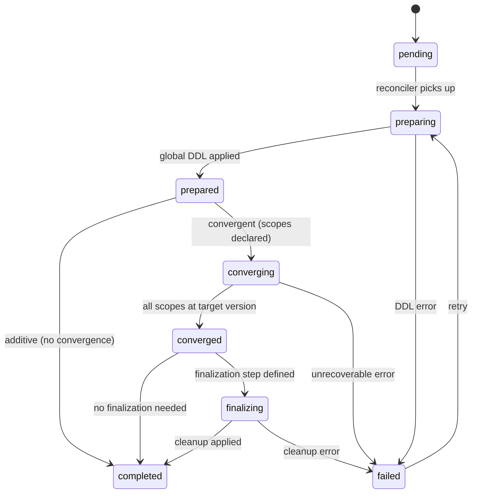

# Schema migration framework

## Status

Proposal

## Overview

GKG needs a migration framework that can evolve the ClickHouse graph schema, coordinate distributed data convergence, and integrate with the existing indexer architecture. This document proposes an **indexer-owned reconciliation model** rolled out in three phases:

| Phase | Scope | Summary |
|-------|-------|---------|
| [V1 — Migration registry](v1_migration_registry.md) | Additive DDL | Rust migration registry, ClickHouse-backed ledger, NATS KV lock, additive schema changes |
| [V2 — Distributed convergence](v2_distributed_convergence.md) | Backfill / reindex | Per-scope schema version tracking, scheduler-integrated reindex progression, compatibility-aware cutover |
| [V3 — Finalization](v3_finalization.md) | Cleanup | Delayed destructive migrations, automated or policy-driven safe finalization |

Cross-cutting concerns (failure handling, observability, deployment integration) are covered in [Operational model](operational_model.md).

### Related documents

- [Schema management](../schema_management.md) — earlier strategy document describing migration approaches and shadow column patterns
- [SDLC indexing](../indexing/sdlc_indexing.md) — indexing pipeline architecture
- [Code indexing](../indexing/code_indexing.md) — code indexing pipeline architecture

## Problem statement

Today, GKG graph schema changes are applied manually. The authoritative DDL lives in [`config/graph.sql`](../../../config/graph.sql) as `CREATE TABLE IF NOT EXISTS` statements. There is no versioning, no runtime migration tracking, and no integration with the deployment lifecycle.

This creates several problems:

1. **Manual intervention on every schema change.** Adding a column, creating a table, or adding a projection requires someone to manually apply DDL against ClickHouse during deployment.
2. **No version tracking.** There is no record of which migrations have been applied. The system cannot tell whether a given ClickHouse instance is current, behind, or in an inconsistent state.
3. **No distributed convergence.** Some schema changes require reindexing affected scopes (namespaces, projects, branches). There is no mechanism to track which scopes have been brought to the new schema version.
4. **No deployment integration.** Schema changes are decoupled from the application release cycle. Rolling deployments cannot reason about schema compatibility.

### Scope and ownership boundary

This framework applies to the **GKG-owned graph and control-plane schema** in ClickHouse — all tables defined in `config/graph.sql`: node tables (`gl_user`, `gl_group`, `gl_project`, etc.), the `gl_edge` relationship table, checkpoint tables, and any future control-plane tables.

It does **not** apply to:

- **Siphon datalake tables.** These are owned by Rails and managed through Rails ClickHouse migration mechanisms. GKG reads from them but does not own their schema lifecycle.
- **Ontology definitions.** The YAML in `config/ontology/` defines entity types, properties, and ETL mappings. Ontology changes may *trigger* migrations but are not themselves managed by this framework.

### Relationship between ontology and migrations

The ontology (`config/ontology/`) and the ClickHouse graph schema (`config/graph.sql`) are tightly coupled today — both are updated in the same MR when an entity type or property changes. The migration framework does not change this relationship; it adds a third artifact (the migration) that must also be updated in the same MR.

In practice, changes that touch the ontology fall into two categories:

1. **Ontology-only changes** (e.g., updating redaction metadata, ETL mappings, or query validation rules). These do not affect the ClickHouse schema and do not need a migration.
2. **Schema-affecting changes** (e.g., adding a new entity type, adding a property that needs a ClickHouse column, changing a column type). These need both an ontology update and a migration.

A future evolution could make this relationship more automatic — for example, the migration framework could diff the ontology's declared properties against the actual ClickHouse schema and generate migration steps. However, this is explicitly out of scope for V1/V2/V3 and would be a significant design effort in its own right. For now, the co-evolution is enforced by the [authoring contract](v1_migration_registry.md#authoring-contract): every schema-changing MR must update the ontology, `graph.sql`, and the migration registry together.

## Current state

### DDL management

All graph DDL is defined in `config/graph.sql` (585 lines, 23+ `CREATE TABLE IF NOT EXISTS` statements). It is applied:

- **In production**: externally during deployment, not by the service itself.
- **In integration tests**: `include_str!` of `config/graph.sql`, split by `;`, executed statement-by-statement against a testcontainer ClickHouse instance.
- **In the E2E pipeline**: copied into a ClickHouse pod and executed via `clickhouse-client --multiquery`.

There is no `ALTER TABLE` usage, no versioned migrations, and no automatic DDL application at service startup.

### NATS KV usage

A single NATS KV bucket is in use: `indexing_locks` (defined in `crates/indexer/src/locking.rs`).

| Key pattern | Purpose |
|---|---|
| `cadence.<task_name>` | Interval-based scheduling dedup (create-only with TTL) |
| `project.<project_id>.<branch>` | Code indexing concurrency lock per project+branch |

The `LockService` trait provides `try_acquire(key, ttl) -> bool` and `release(key)` using NATS KV create-only semantics with per-message TTL. This is the foundation we extend for migration lock coordination.

There is no schema cache bucket, no migration tracking bucket, and no version coordination bucket.

### Indexer scheduling

The `DispatchIndexing` mode runs as a **run-once-and-exit process** (designed for K8s CronJob invocation). It iterates over 6 `ScheduledTask` implementations sequentially, using the `LockService` for interval-based cadence control:

- `GlobalDispatcher`, `NamespaceDispatcher` — SDLC indexing
- `SiphonCodeIndexingTaskDispatcher`, `NamespaceCodeBackfillDispatcher` — code indexing
- `TableCleanup` — `OPTIMIZE TABLE ... FINAL CLEANUP`
- `NamespaceDeletionScheduler` — namespace deletion

The `Indexer` mode runs continuously, consuming messages from the `GKG_INDEXER` NATS JetStream stream via a `WorkerPool` with global and per-group concurrency semaphores.

### Health probes

The indexer health server provides `/live` (always OK) and `/ready` (checks NATS, ClickHouse, GitLab connectivity). Readiness is independent of schema state — this is correct and should remain so.

## Design principles

1. **Application-native.** Migrations are defined in Rust and compiled into the application binary. No external migration tooling.
2. **Reconciliation over one-shot execution.** The system continuously reconciles actual state toward desired state, rather than assuming a single DDL execution is sufficient.
3. **Durable truth in ClickHouse.** Migration state is persisted in ClickHouse control tables. NATS KV is used for coordination (locks, invalidation) only.
4. **Backward compatibility first.** Schema changes must support rolling upgrades and mixed-version windows. The expand/migrate/contract pattern is the default.
5. **Decoupled from startup.** Migration progression runs as a background reconciliation loop, not as a startup side-effect. Pod readiness is never blocked by migration state.
6. **Explicit multi-phase lifecycle.** The system distinguishes between: schema prepared, data converged, and old structures finalized.

## Architecture overview

### Why indexer-owned reconciliation

The migration framework is owned by the indexer because the indexer already owns:

- distributed work coordination (NATS JetStream consumers, worker pools)
- data convergence (namespace reindexing, code backfill)
- ClickHouse write access (graph tables, checkpoints)
- NATS KV locking (the `LockService` trait)

This makes the indexer the natural home for a reconciliation loop that advances schema state and coordinates distributed backfill. The webserver remains read-only and the DispatchIndexing scheduler remains a stateless dispatcher.

### Core components

```
┌─────────────────────────────────────────────────┐
│                Indexer process                   │
│                                                  │
│  ┌──────────────┐    ┌───────────────────────┐  │
│  │ Message       │    │ Migration reconciler  │  │
│  │ processing    │    │ (lock-holder only)    │  │
│  │ engine        │    │                       │  │
│  │               │    │ - Load registry       │  │
│  │ NATS ──►      │    │ - Read CH ledger      │  │
│  │ WorkerPool    │    │ - Advance phases      │  │
│  │ ──► CH        │    │ - Declare convergence │  │
│  └──────────────┘    └───────────────────────┘  │
│         │                      │                 │
│         ▼                      ▼                 │
│  ┌──────────────────────────────────────────┐   │
│  │           ClickHouse (graph DB)           │   │
│  │                                           │   │
│  │  graph tables    gkg_migrations           │   │
│  │  gl_edge         gkg_migration_scopes     │   │
│  │  checkpoint      (V2)                     │   │
│  └──────────────────────────────────────────┘   │
│         │                      │                 │
│         ▼                      ▼                 │
│  ┌──────────────────────────────────────────┐   │
│  │        NATS KV (indexing_locks)           │   │
│  │                                           │   │
│  │  cadence.*            (existing)          │   │
│  │  project.*            (existing)          │   │
│  │  migration.reconciler (new — V1)          │   │
│  │  migration.version    (new — V1)          │   │
│  └──────────────────────────────────────────┘   │
└─────────────────────────────────────────────────┘
```

### Migration lifecycle

Every migration moves through a well-defined set of phases:



| Transition | Trigger | Phase introduced |
|---|---|---|
| `pending → preparing` | Reconciler picks up next migration | V1 |
| `preparing → prepared` | Global DDL applied successfully | V1 |
| `prepared → completed` | Additive migration, no backfill needed | V1 |
| `prepared → converging` | Convergence targets declared | V2 |
| `converging → converged` | All scopes at target version | V2 |
| `converged → finalizing` | Finalization step begins | V3 |
| `finalizing → completed` | Cleanup DDL applied | V3 |

### Migration types

| Type | Example | Backfill? | Phases |
|---|---|---|---|
| Additive | New table, new nullable column, new projection | No | pending → preparing → prepared → completed |
| Convergent | Field type change, semantic rewrite, new required property | Yes | Full lifecycle through converging |
| Finalization | Drop deprecated column, stop dual-write | No | converged → finalizing → completed |

### Runtime behavior by component

| Component | Migration role |
|---|---|
| **Indexer** | Owns the reconciler loop. Applies global DDL. Schedules convergence work. Updates migration state. |
| **Webserver** | Read-only awareness. Refreshes in-memory caches on NATS KV notification. Remains query-compatible during mixed migration windows. |
| **DispatchIndexing** | Extended (V2) to check for stale convergence scopes when dispatching work. Does not apply migrations. |
| **HealthCheck** | Not migration-aware. Readiness checks remain infrastructure-level. |

## Prior art

This design is informed by existing GitLab systems:

- **Advanced Search** — versioned migration registry, durable migration state, runtime completion checks.
- **Active Context** — simpler DB-backed migration ledger reconciled from code-defined migrations.
- **Exact Code Search / Zoekt** — scoped schema-version convergence, where completion requires reindexing stale indexed units over time.

GKG combines these patterns because it needs both a migration control plane (like Advanced Search) and a convergence model (like Zoekt).

## Open questions

### Resolved in this proposal

The following questions from the original draft have been addressed based on review feedback:

- **Mutable state in ClickHouse** → Resolved: single-writer guarantee via NATS lock; `FINAL` for small ledger table; `argMax` projection available for larger scope table. See [V1 control-plane table semantics](v1_migration_registry.md#control-plane-table-semantics).
- **Runtime compatibility checks** → Resolved: per-migration `CompatibilityMode` enum consulted by writers and readers. See [V2 runtime compatibility contract](v2_distributed_convergence.md#runtime-compatibility-contract).
- **Finalization policy** → Resolved: standalone finalization migrations as the default; inline finalization available but discouraged. See [V3 reconciler finalization logic](v3_finalization.md#reconciler-finalization-logic).
- **Relationship to `config/graph.sql`** → Resolved: `graph.sql` stays as canonical full schema; migrations are deltas; CI enforces consistency. See [V1 authoring contract](v1_migration_registry.md#authoring-contract).

### Still open

1. **Convergence scope granularity and code vs SDLC differences.** Namespace-level for SDLC and project+branch for code is the working assumption. However, these two indexing paths have meaningful differences that affect migration design:
   - Code indexing tables (`gl_file`, `gl_definition`, `gl_directory`, `gl_imported_symbol`) use `ReplacingMergeTree(_version)` **without `_deleted`**, unlike SDLC tables which use `ReplacingMergeTree(_version, _deleted)`. Convergence backfill may need to account for this difference.
   - Code re-indexing requires downloading repository archives via the Rails internal API — it is significantly more expensive than SDLC re-indexing which reads from the ClickHouse datalake.
   - Code indexing uses `code_indexing_checkpoint` (keyed by `traversal_path, project_id, branch`), while SDLC uses the `checkpoint` table (keyed by handler name). The checkpoint models are different.
   - Are there migration types that do not fit either scope (e.g., table-specific, entity-specific, or global-but-batchable like `gl_edge` restructuring)?
2. **Reconciler scheduling.** Should the reconciler run continuously (loop with sleep) or be periodic (invoked by DispatchIndexing CronJob)? Continuous is simpler but uses a persistent background task; periodic aligns with the existing scheduling model.
3. **Self-managed deployments.** How does the migration framework behave for self-managed instances where the deployment lifecycle is different from `.com`? Are there constraints on migration timing or operator tooling?
4. **Scope discovery completeness.** The current design discovers scopes from checkpoint tables. Are there edge cases where graph data exists but checkpoint state is absent, partially deleted, or stale? Should scope discovery also scan graph tables directly?
5. **Intermediate binary compatibility.** During a multi-version rolling deployment (A → B → C), how do we prevent binary B from advancing a migration it only partially understands? Is registry/ledger comparison sufficient, or do we need explicit version compatibility metadata on each migration?
6. **Failure classification.** Should the framework distinguish between transient failures (retry automatically) and permanent failures (stop and alert) for convergence scopes? What heuristics determine the classification?
7. **`config/graph.sql` as migration version 0.** Should the initial `graph.sql` be represented as a migration in the registry (version 0) so that fresh installs and migration-replayed installs produce identical ledger state?

## Detailed phase documents

- **[V1 — Migration registry](v1_migration_registry.md)**: The minimal viable framework. Rust registry, ClickHouse ledger, NATS lock, additive DDL only.
- **[V2 — Distributed convergence](v2_distributed_convergence.md)**: Per-scope tracking, scheduler integration, compatibility-aware cutover.
- **[V3 — Finalization](v3_finalization.md)**: Cleanup phases, delayed destructive migrations.
- **[Operational model](operational_model.md)**: Failure handling, observability, deployment integration.
