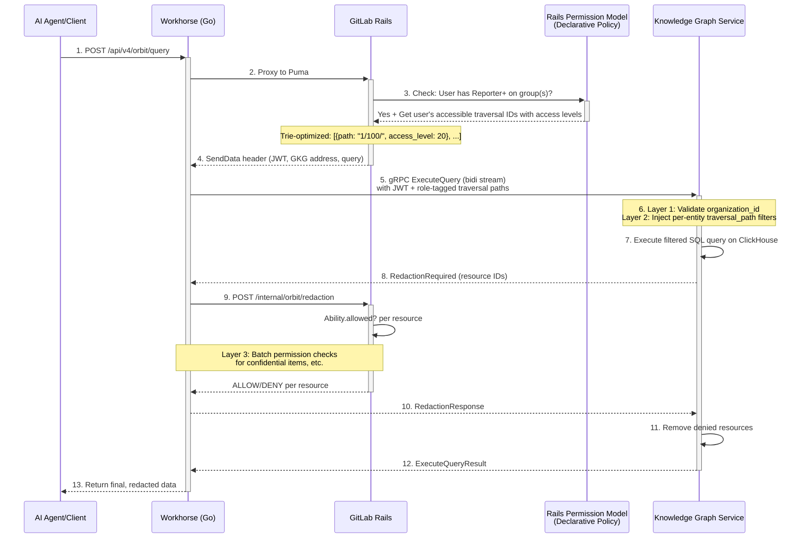
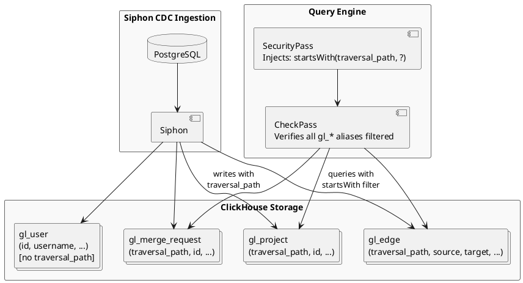
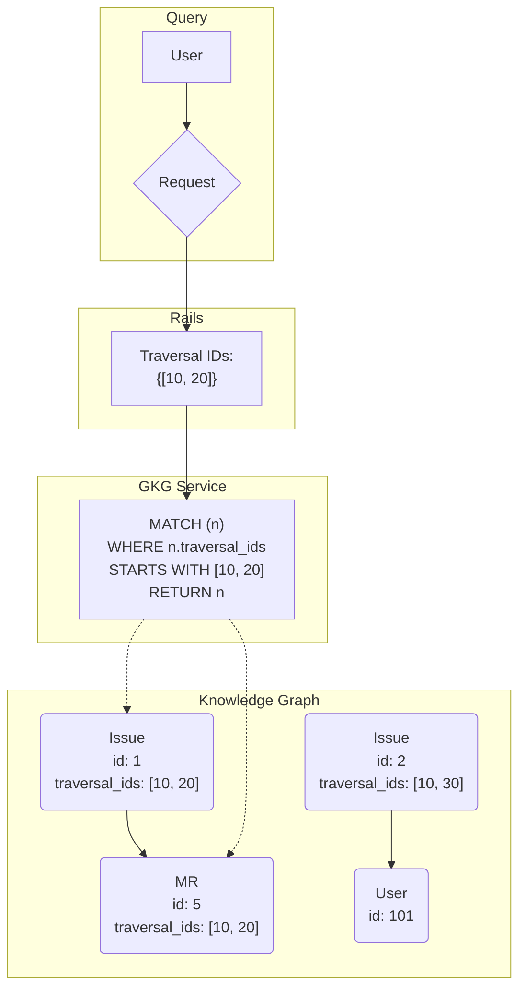
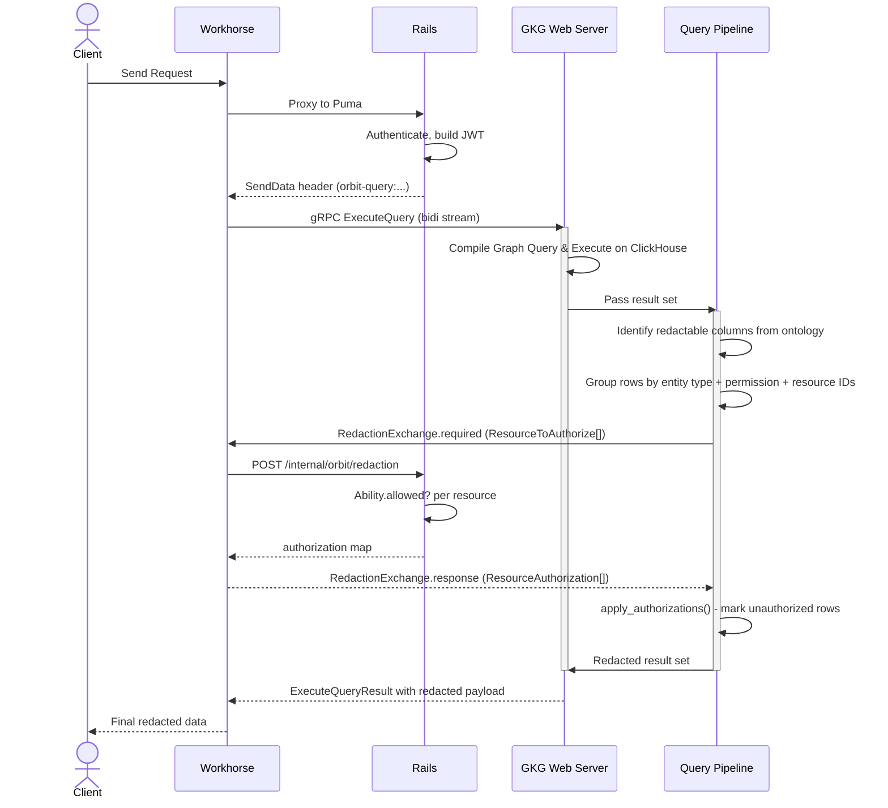

# Security

## Overview

The Knowledge Graph allows querying across an entire GitLab namespace. To prevent unauthorized data exposure, every query passes through three security layers:

- Logical tenant segregation at the storage layer via indexed columns.
- Query-time filtering using traversal IDs.
- Final redaction at the application layer via Rails authorization checks.

All access to the Knowledge Graph is proxied through GitLab Rails, which acts as the primary authentication and authorization gateway. This ensures no user or agent can bypass the existing GitLab permission model. As part of the broader Auth Architecture program, these controls will evolve to integrate with future GitLab auth services. Until we have a finalized auth service, Rails remains the enforcement point and source of truth.

## Access Model: Reporter+ Scope with Per-Entity Role Floors

The Knowledge Graph starts from a group-level Reporter+ scope and tightens that scope per entity when the ontology requires a higher role:

- **Group-level Reporter+ access required**: Users must have at least Reporter role on a group for that group's traversal path to be eligible at all.
- **Per-entity role floors**: Entities can declare `redaction.required_role`; security entities use `security_manager`, so Reporter-only paths are dropped for those aliases before SQL is emitted.
- **Hierarchical access**: The GitLab permission model is hierarchical. If you have Reporter+ access to a group, you automatically have access to all subgroups and projects beneath it in the namespace tree. The Knowledge Graph honors this hierarchy.
- **No sparse permissions in V1**: The first iteration does not support individual project-level access or item-level permissions (e.g., access to a single project without group access). This simplification aligns with the existing GitLab Analytics products, which require the same Reporter+ group-level access.
- **Incremental filtering still applies**: Even with an eligible traversal path, the system still filters by per-path role and performs final redaction checks to handle edge cases like confidential issues and runtime checks (like SAML/IP).

### Request Flow

With [Workhorse query acceleration](decisions/008_workhorse_query_acceleration.md), the gRPC stream runs in Workhorse rather than on a Puma thread.



## Layer 1: Logical Tenant Segregation by Organization

The first security boundary is logical tenant segregation enforced through the `traversal_path` column on every graph table. The `traversal_path` encodes the full namespace hierarchy as a `/`-delimited string where the first segment is the organization ID (e.g., `"42/100/1000/"`). Organization isolation is implicit: a user in org 42 receives a `SecurityContext` whose traversal paths all start with `42/`, and the `startsWith(traversal_path, '42/')` filter injected by the compiler cannot match rows from org 99.

This layer is primarily intended for .com customers to ensure that they can only query data within their own organization.

**Component**: Knowledge Graph Query Engine (`gkg-webserver`)

**How It's Enforced**:

- **At the ClickHouse Storage Layer**: The indexer writes each row with a `traversal_path` column encoding the full namespace hierarchy, starting with the organization ID as the first path segment.
- **Query-Level Enforcement**: The query compiler's `SecurityPass` injects `startsWith(traversal_path, ?)` predicates into every generated SQL query. The `CheckPass` then verifies every `gl_*` table alias has a valid `startsWith` predicate before codegen. The organization ID is extracted from the JWT token and validated against traversal paths at `SecurityContext` construction time.
- **Cross-Org Queries Blocked**: `SecurityContext::new()` validates that every traversal path's first segment matches the JWT's `organization_id`. A path starting with `"2/"` is rejected when `org_id=1`. Each query is scoped to exactly one organization.
- **Parameterization**: All traversal path values are bound as parameters, never concatenated into SQL strings.

**Code Review Requirements**:

- The compiler's `SecurityPass` runs on all query types (search, traversal, aggregation, path-finding, neighbors). The `CheckPass` rejects any query where a `gl_*` table alias lacks a valid `startsWith` filter.
- Unit tests verify that queries without traversal path filters are rejected by `CheckPass`.
- Integration tests verify cross-namespace isolation within an organization and cross-organization isolation with multi-org seed data.

**Global table exceptions**: Two entities are global (not namespace-scoped) and have no `traversal_path` column on their node tables: `User` (`gl_user`) and `Runner` (`gl_runner`). Both are listed in `skip_security_filter_for_entities` in the ontology and rely on Rails-side redaction (`Authz::RedactionService` with `read_user` and `read_runner` abilities respectively). They can only appear in query results through edge table joins, and the edge tables always carry the `traversal_path` filter, preventing cross-tenant leakage through global-node joins.



## Layer 2: Query-Time Filtering with Traversal IDs

While Layer 1 isolates top-level namespaces, Layer 2 provides fine-grained filtering within a namespace based on the user's group memberships. We leverage the GitLab hierarchical permission model using `traversal_ids`.

### Understanding Traversal IDs and Hierarchical Access

As documented in the [GitLab Namespace documentation](https://docs.gitlab.com/development/namespaces/#querying-namespaces), the `traversal_ids` array represents the full ancestor hierarchy for any given namespace. For example, a project namespace with ID `300` inside a subgroup with ID `200` under a top-level group with ID `100` would have `traversal_ids` of `[100, 200, 300]`.

**Hierarchical Access Model**: The GitLab permission system is hierarchical. If a user has Reporter+ access to a group, they automatically have access to all resources in that group and all nested subgroups and projects beneath it. The Knowledge Graph respects this hierarchy through traversal ID prefix matching.

For example:

- User has Reporter+ on group `[100]` → Can access all resources with traversal_ids starting with `[100]`, including `[100, 200]`, `[100, 200, 300]`, etc.
- User has Reporter+ on subgroup `[100, 200]` → Can access resources with traversal_ids starting with `[100, 200]`, but NOT resources under sibling group `[100, 300]`.

### How It Works

**Component**: GitLab Rails (computation) + Knowledge Graph Query Engine (enforcement)

During indexing, we enrich every entity (Issue, MR, Pipeline, etc.) with the `traversal_ids` of its parent project or group. When a user initiates a query:

1. **Rails computes accessible groups**: Rails queries the user's Reporter+ group memberships and group-share access, returning each traversal path with the highest effective access level on that path.
2. **Optimize with trie structure**: Rails buckets paths by role, compacts each bucket using a trie structure, and keeps the highest role if compacted buckets overlap.
3. **Pass to GKG**: This minimal set of `{path, access_level}` traversal prefixes is passed to the Knowledge Graph service (in the JWT payload, with JWT+MTLS for enhanced security).
4. **Inject filters**: The query engine generates ClickHouse SQL with prefix matching predicates over `traversal_path`, dropping any path whose `access_level` is below the target entity's `required_role`.

**Code Review Requirements**:

- Rails service must validate that only Reporter+ memberships are included.
- GKG query compiler must inject traversal_id filters for all entity queries (issues, MRs, pipelines, etc.).
- Unit and integration tests must verify that users cannot access resources outside their traversal_id scope.

**Detection and Monitoring**:

- **Metric**: `gkg.query.traversal_filter_applied` (counter) - increments on every query with traversal filtering.
- **Metric**: `gkg.rails.traversal_ids_computed` (histogram) - tracks the number of traversal IDs computed per user.
- **Audit Logging**: Log queries with the `traversal_ids` filter applied and the number of prefixes used.
- **Alert**: Trigger warning if a user has more than 100 distinct traversal ID prefixes (indicates potential permission explosion).

The query engine then uses this list to pre-filter the query, ensuring that only nodes belonging to accessible namespace hierarchies are considered.



This is an efficient first pass that reduces the result set, but it does not account for resource-specific permissions like confidential issues. That is why Layer 3 exists.

### Additional Query Safeguards

**Component**: Knowledge Graph Query Engine (`gkg-webserver`)

In addition to authorization filtering, the query engine implements further safeguards to protect against resource exhaustion:

**Controls**:

- **Depth Caps**: Traversals limited to max 3 hops. Enforced in query compiler; queries exceeding this are rejected with error.
- **Relationship Allow-Lists**: Only pre-defined relationship types are allowed. Unknown relationships trigger validation errors.
- **Row Limits**: Max 1000 rows per query (configurable). Enforced in SQL generation: `LIMIT 1000`.
- **Query Timeouts**: All ClickHouse queries have a 30-second timeout via `max_execution_time` setting.
- **Rate Limiting**: Per-user rate limiting enforced at the GKG web server level (e.g., 100 queries per minute).

**Detection and Monitoring**:

- **Metric**: `qe.threat.depth_exceeded` (counter) -queries rejected for exceeding traversal depth or hop cap.
- **Metric**: `qe.threat.limit_exceeded` (counter) -queries rejected for exceeding array cardinality caps (node_ids, IN filter values).
- **Metric**: `qe.threat.timeout` (counter) -queries that timed out.
- **Metric**: `qe.threat.rate_limited` (counter) -queries rejected due to rate limiting.
- **Alert**: Trigger warning if timeout rate exceeds 5% of total queries.

## Layer 3: Final Redaction Layer via Rails Authorization

The final and most authoritative security layer is executed by the Knowledge Graph service calling back to GitLab Rails for granular permission checks. After the query engine returns pre-filtered results (from Layers 1 and 2), the Knowledge Graph service performs a final authorization pass before returning data to the client.

### Why This Layer Is Necessary

While traversal IDs provide coarse-grained filtering at the group/project level, they cannot account for resource-specific permissions such as:

- Confidential issues (only visible to project members and issue participants)
- Runtime checks (such as SAML group links or IP restrictions)
- Custom roles or fine-grained permissions that may be added in the future

Layer 3 closes these gaps by consulting Rails' authoritative permission model for each returned resource.

### How It Works

The Knowledge Graph service uses the same permission check mechanism as the GitLab Search Service. The GitLab [SearchService](https://gitlab.com/gitlab-org/gitlab/-/blob/master/app/services/search_service.rb) implements a `redact_unauthorized_results` method that filters search results based on user permissions:

```ruby
def visible_result?(object)
  return true unless object.respond_to?(:to_ability_name) && DeclarativePolicy.has_policy?(object)

  Ability.allowed?(current_user, :"read_#{object.to_ability_name}", object)
end

def redact_unauthorized_results(results_collection)
  redacted_results = results_collection.reject { |object| visible_result?(object) }
  # ... removes unauthorized results from collection
end
```

The `Ability.allowed?` method is the single source of truth for resource-level permissions in GitLab. It evaluates all declarative policies, custom roles, and special cases including runtime checks (such as SAML group links or IP restrictions).

**Component**: Knowledge Graph Service (`gkg-webserver`) + Workhorse (gRPC client) + GitLab Rails (redaction callback)

See [ADR 001](decisions/001_grpc_communication.md) for the protocol design and [ADR 008](decisions/008_workhorse_query_acceleration.md) for the Workhorse acceleration architecture.

The redaction exchange occurs inside a bidirectional gRPC stream between Workhorse and the GKG server. Workhorse calls back to Rails for authorization checks via an internal HTTP endpoint. The flow is:

1. Rails authenticates the user, builds a JWT, and returns a SendData header to Workhorse.
2. Workhorse opens a bidirectional `ExecuteQuery` gRPC stream to GKG.
3. GKG runs the query on ClickHouse and identifies redactable columns from the ontology.
4. GKG sends a `RedactionExchange.required` message back through the stream with `ResourceToAuthorize[]` entries, grouped by entity type and ability (e.g., all issues that need `read_issue` checks).
5. Workhorse calls `POST /api/v4/internal/orbit/redaction` with the resource IDs and the user's forwarded auth headers. Rails calls `Ability.allowed?` for each resource and returns the authorization map.
6. Workhorse sends the `RedactionResponse` back on the gRPC stream.
7. GKG applies those authorizations, marks unauthorized rows, and drops them from the result set.
8. GKG returns the redacted results to Workhorse as an `ExecuteQueryResult`.

**Code Review Requirements**:

- GKG redaction module must be called for all non-aggregation queries before returning results.
- Rails redaction exchange handler must use `Ability.allowed?`, not custom permission checks.
- Integration tests must verify confidential issues are filtered out.
- Performance tests must verify batch sizes and latency for large result sets.

**Detection and Monitoring**:

- **Metric**: `gkg.redaction.checks_performed` (counter) - total authorization checks performed.
- **Metric**: `gkg.redaction.resources_denied` (counter) - resources filtered out by Layer 3.
- **Metric**: `gkg.redaction.batch_size` (histogram) - size of authorization batches sent to Rails.
- **Metric**: `gkg.redaction.latency` (histogram) - time taken for Rails authorization checks.
- **Audit Logging**: Log all denied resources with `{user_id, resource_type, resource_id, reason}`.
- **Alert**: Trigger warning if `gkg.redaction.resources_denied` rate exceeds 20% of total results (may indicate traversal_id filtering is ineffective).



This final check guarantees that:

- No matter what the graph query returns, users only see data they are explicitly authorized to view.
- Any bugs or gaps in traversal ID filtering are caught before data is exposed.
- Future permission model changes in Rails automatically apply to Knowledge Graph queries without service changes.
- Rails remains the single source of truth for all authorization decisions.

### Thread and connection model

With Workhorse query acceleration ([ADR 008](decisions/008_workhorse_query_acceleration.md)), the bidirectional gRPC stream runs in Workhorse (Go) rather than on a Puma thread. Puma handles two short calls: authentication and JWT construction (~10ms), and the redaction callback (~50ms). The gRPC stream, ClickHouse execution, and result hydration happen entirely in Workhorse goroutines.

Workhorse forwards the original client's auth headers (`Authorization`, `Private-Token`, `Cookie`) to the internal redaction endpoint at `POST /api/v4/internal/orbit/redaction`. This endpoint requires both Workhorse API signing and a valid user session, so Rails still authenticates the user for every redaction check.

The Go gRPC client enforces a configurable timeout (default 30s, max 120s) and a maximum of 10 stream messages per query. Connection health is monitored via keepalive (60s interval, 20s timeout), and stale connections in `Shutdown` or `TransientFailure` state are replaced automatically.

See [ADR 001](decisions/001_grpc_communication.md) for the original protocol design and [ADR 008](decisions/008_workhorse_query_acceleration.md) for the Workhorse acceleration architecture.

## Service-to-Service Authentication and Authorization

Communication between GitLab Rails and the Knowledge Graph service will use a defense-in-depth approach combining multiple security mechanisms:

### JWT for Request Authentication

**Component**: GitLab Rails (issuer) + Knowledge Graph Service (verifier)

JSON Web Tokens (JWTs) are used to authenticate requests from Rails to the Knowledge Graph service and carry user context:

- **Signing**: Rails signs each JWT with a shared secret key using HS256 algorithm (similar to the pattern used for Exact Code Search/Zoekt).
- **User Context**: The JWT payload includes: `{user_id, username, organization_id, traversal_ids, iat, exp}`.
- **Transport**: The JWT is passed in the `Authorization: Bearer <token>` header.
- **Verification**: The Knowledge Graph service verifies the JWT signature using the same shared secret before processing any request.
- **Token Expiry**: JWTs include short expiration times (5 minutes) to limit the window of potential token misuse.

**Detection and Monitoring**:

- **Metric**: `gkg.auth.jwt_verification_failed` (counter) - failed JWT verifications.
- **Metric**: `gkg.auth.jwt_expired` (counter) - expired tokens received.
- **Audit Logging**: Log all authentication failures with `{timestamp, source_ip, user_id, reason}`.
- **Alert**: Trigger warning if JWT verification failure rate exceeds 1% of requests.

### MTLS for Transport Security

**Component**: GitLab Rails + Knowledge Graph Service (both)

- **Infrastructure**: Kubernetes service mesh (Istio/Linkerd) or manual TLS configuration.
- **Configuration**: Certificate management via cert-manager or the existing GitLab certificate infrastructure.

In addition to JWT authentication, the system will use Mutual TLS (MTLS) to establish cryptographically verified connections between services:

- **Service Identity**: Both Rails and the Knowledge Graph service present certificates that prove their identity.
- **Encrypted Transport**: All traffic between services is encrypted, protecting sensitive data in transit.
- **Certificate Validation**: Each service validates the other's certificate before establishing a connection.

This dual approach provides zero-trust security:

- **MTLS** ensures we're talking to the right service at the network level.
- **JWT** ensures we're processing requests with the right user context and permissions.

### Database Access Controls

The Knowledge Graph service connects to ClickHouse with restricted privileges:

- **Read-Only Role**: The database user has SELECT-only permissions, preventing any writes or schema modifications.
- **Table-Level Restrictions**: Access is limited to Knowledge Graph tables only; the role cannot access system tables or other tenant data.
- **Connection Pooling**: Connections are pooled and rate-limited to prevent resource exhaustion.

## Handling Aggregations

Aggregation queries (counts, averages, ...) do not return individual resource rows, so Layer 3 (Rails redaction) cannot be applied after the fact. Earlier versions of the query engine therefore relied entirely on Layer 2 (traversal path filtering at the Reporter floor), which left an oracle: a Reporter user aggregating `count(Vulnerability) group_by Project` could observe vulnerability details through filter-driven counts even though they did not hold `read_vulnerability` on the target entity.

To close this, each ontology entity now declares a `required_role` in its redaction block (`config/ontology/nodes/**`). Rails publishes traversal paths tagged with the user's highest access level on the leaf group (`{path, access_level}` tuples in the JWT), and the compiler's `SecurityPass` drops any path whose tag falls below an entity's `required_role` before emitting the `startsWith(traversal_path, ...)` predicate for that entity's alias. If no path qualifies, the alias compiles to `Bool(false)` and the aggregation sees zero rows for that entity.

Controls:

- **Per-entity role floor**: `redaction.required_role` defaults to `reporter`. Security-domain entities (Vulnerability, Finding, VulnerabilityScanner, VulnerabilityIdentifier, VulnerabilityOccurrence, SecurityScan) declare `security_manager`, matching the minimum GitLab role designed for security team members.
- **Edge-only aggregation lowering is disabled for gated entities**: when `required_role` exceeds the default, `lower.rs` keeps the node table in the FROM clause so the security pass has an alias to filter. Without this the compiler would elide the scan and defeat the gate.
- **Pre-filtering stays in place**: Layers 1 and 2 (organization_id and traversal_id filtering) still run on every query. The per-entity role scope is an additional drop, never a relaxation.
- **Empty path set fails closed at compile time**: a `SecurityContext` with no traversal paths returns a compilation error rather than a `Bool(false)` everywhere, so misconfigured callers surface instead of silently returning empty results.

**Code Review Requirements**:

- Ontology entries declaring `required_role` above Reporter must be justified against `config/authz/roles/` in the monolith so the gate tracks real ability requirements.
- Compiler unit tests cover per-alias role filtering, empty-path-set compilation to `Bool(false)`, and schema-version-prefix resolution.
- Integration tests exercise the attack patterns (Reporter-only aggregations, filter-oracle variants, search on protected entities) and confirm zero rows come back.
