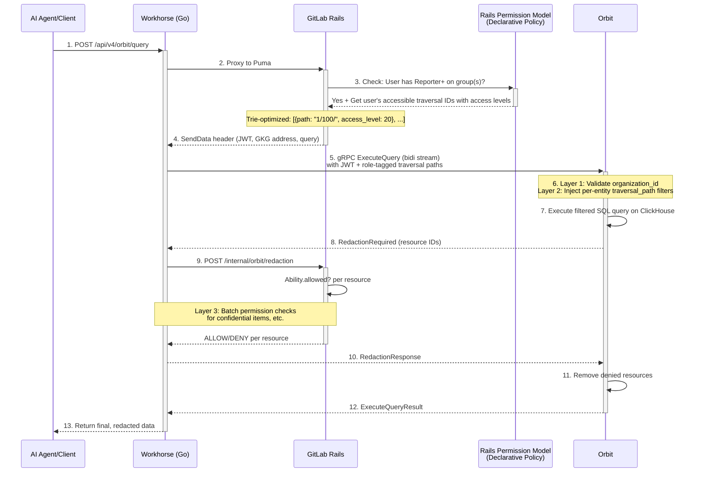
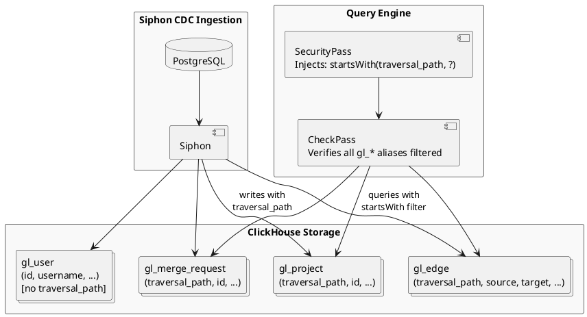
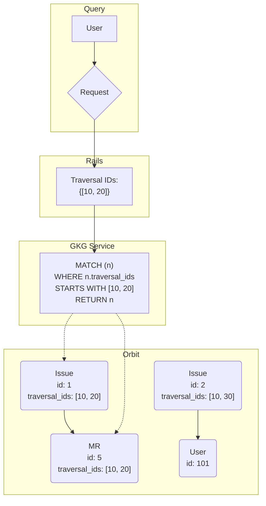
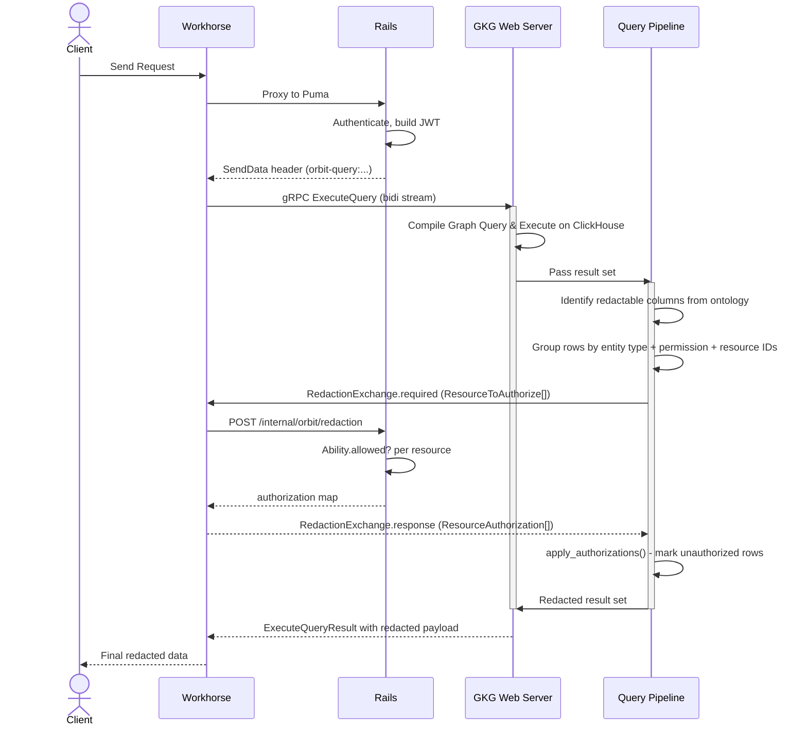

# Security

## Overview

Orbit allows querying across an entire GitLab namespace. To prevent unauthorized data exposure, every query passes through three security layers:

- Logical tenant segregation at the storage layer via indexed columns.
- Query-time filtering using traversal IDs.
- Final redaction at the application layer via Rails authorization checks.

All access to Orbit is proxied through GitLab Rails, which acts as the primary authentication and authorization gateway. This ensures no user or agent can bypass the existing GitLab permission model. As part of the broader Auth Architecture program, these controls will evolve to integrate with future GitLab auth services. Until we have a finalized auth service, Rails remains the enforcement point and source of truth.

The Duo-specific routing layer sits *upstream* of these authorization checks. It decides whether a Duo agent ever reaches the Orbit MCP server in the first place. For that layer, see [Duo / Orbit prompt routing architecture](duo_orbit_prompt_routing.md). The two systems compose: routing decides whether the request happens, and the layers below decide what data the request can see.

## Access Model: Reporter+ Scope with Per-Entity Role Floors

Orbit starts from a group-level Reporter+ scope and tightens that scope per entity when the ontology requires a higher role:

- **Group-level Reporter+ access required**: Users must have at least Reporter role on a group for that group's traversal path to be eligible at all.
- **Per-entity role floors**: Entities can declare `redaction.required_role`; security entities use `security_manager`, so Reporter-only paths are dropped for those aliases before SQL is emitted.
- **Hierarchical access**: The GitLab permission model is hierarchical. If you have Reporter+ access to a group, you automatically have access to all subgroups and projects beneath it in the namespace tree. Orbit honors this hierarchy.
- **No sparse permissions in V1**: the first iteration does not support individual project-level access or item-level permissions. An example is access to a single project without group access. This simplification aligns with the existing GitLab Analytics products, which require the same Reporter+ group-level access.
- **Incremental filtering still applies**: even with an eligible traversal path, the system still filters by per-path role and performs final redaction checks. These checks handle edge cases like confidential issues and runtime checks (like SAML/IP).

### Request Flow

With [Workhorse query acceleration](decisions/008_workhorse_query_acceleration.md), the gRPC stream runs in Workhorse rather than on a Puma thread.


```mermaid
sequenceDiagram
    participant Client as AI Agent/Client
    participant Workhorse as Workhorse (Go)
    participant Rails as GitLab Rails
    participant AuthZ as Rails Permission Model<br/>(Declarative Policy)
    participant GKG as Orbit

    Client->>+Workhorse: 1. POST /api/v4/orbit/query
    Workhorse->>+Rails: 2. Proxy to Puma
    Rails->>+AuthZ: 3. Check: User has Reporter+ on group(s)?
    AuthZ-->>-Rails: Yes + Get user's accessible traversal IDs with access levels
    Note over Rails: Trie-optimized: [{path: "1/100/", access_level: 20}, ...]
    Rails-->>-Workhorse: 4. SendData header (JWT, GKG address, query)

    Workhorse->>+GKG: 5. gRPC ExecuteQuery (bidi stream)<br/>with JWT + role-tagged traversal paths
    Note over GKG: 6. Layer 1: Validate organization_id<br/>Layer 2: Inject per-entity traversal_path filters
    GKG->>GKG: 7. Execute filtered SQL query on ClickHouse

    GKG-->>Workhorse: 8. RedactionRequired (resource IDs)
    Workhorse->>+Rails: 9. POST /internal/orbit/redaction
    Rails->>Rails: Ability.allowed? per resource
    Note over Workhorse, Rails: Layer 3: Batch permission checks<br/>for confidential items, etc.
    Rails-->>-Workhorse: ALLOW/DENY per resource
    Workhorse-->>GKG: 10. RedactionResponse

    GKG->>GKG: 11. Remove denied resources
    GKG-->>-Workhorse: 12. ExecuteQueryResult
    Workhorse-->>-Client: 13. Return final, redacted data
```

## Token Gateway: Fine-Grained Personal Access Tokens

Fine-grained personal access tokens follow the Global Search pattern. Rails runs one token check before the route. The check answers one question: may this token call this route for this container? After that check the token is not read again. Results follow the token owner's access through Layers 1 to 3.

- The Orbit **Read** permission (`read_orbit`) lists three scopes: project, group, and user. The Orbit MCP tool **Execute** permission lists only the user scope, the same as the GitLab MCP server permission.
- Each REST read route is mounted three times. `/orbit/*` checks the user boundary. `/groups/:id/orbit/*` checks the group in the path. `/projects/:id/orbit/*` checks the project in the path. This is the same shape as `/search`, `/groups/:id/search`, and `/projects/:id/search`.
- A user-scoped token calls the unscoped routes and gets `403` on the group and project routes, the same as search. A group- or project-scoped token must call the route for its container. A call to the unscoped route, or to a container outside the token scope, returns `403`. A container the owner cannot read returns `404`.
- MCP takes the container as an argument on the `invoke_command` tool. Rails runs the same read check for that container on each call. The MCP URL and OAuth registration stay fixed.
- When a request uses a group or project route, Rails keeps only the traversal paths inside that container before it signs the JWT. Layer 2 then filters to that subtree. Aggregations narrow the same way. This applies to every caller, not only fine-grained tokens. An admin who names a container gets the narrowed paths instead of the admin claim.
- Orbit does not read the other permissions on the token. A token without the Work item **Read** permission still gets work items from Orbit when the owner can read them in GitLab.
- Orbit adds no section or toggle of its own to the token UI, and does not parse queries for namespaces.

Prior art in Rails: the [Global Search manifest](https://gitlab.com/gitlab-org/gitlab/-/blob/master/config/authz/permission_groups/assignable_permissions/search/global_search/use.yml) and [routes](https://gitlab.com/gitlab-org/gitlab/-/blob/master/lib/api/search.rb), the [Markdown route](https://gitlab.com/gitlab-org/gitlab/-/blob/master/lib/api/markdown.rb) with a parameter boundary, and the [MCP tool re-dispatch](https://gitlab.com/gitlab-org/gitlab/-/blob/master/app/services/mcp/tools/base/api_tool.rb).

## Layer 1: Logical Tenant Segregation by Organization

The first security boundary is logical tenant segregation enforced through the `traversal_path` column on every graph table. The `traversal_path` encodes the full namespace hierarchy as a `/`-delimited string where the first segment is the organization ID (e.g., `"42/100/1000/"`). A user's `SecurityContext` carries the exact set of traversal paths that Rails authorized. The compiler injects `startsWith(traversal_path, ?)` predicates for each path, so queries are scoped to exactly those namespaces, regardless of which organization(s) the paths belong to.

This layer limits queries to data within the traversal paths that Rails authorized. A user's authorized paths can span more than one organization.

**Component**: Orbit Query Engine (`gkg-webserver`)

**How It's Enforced**:

- **At the ClickHouse Storage Layer**: the indexer writes each row with a `traversal_path` column. That column encodes the full namespace hierarchy, starting with the organization ID as the first path segment.
- **Query-Level Enforcement**: The query compiler's `SecurityPass` injects `startsWith(traversal_path, ?)` predicates into every generated SQL query. The `CheckPass` then verifies every `gl_*` table alias has a valid `startsWith` predicate before codegen. The `org_id` on `SecurityContext` is metadata (the user's home organization), not a security boundary. Access control comes from the traversal paths themselves.
- **User-Supplied Traversal Path Filters**: Queries may filter `traversal_path` with exact, `in`, or prefix predicates. Before SQL generation, `RestrictPass` verifies each requested path is a descendant of a JWT traversal path that meets the target entity's `required_role` floor. Relationship `traversal_path` filters use the Reporter floor. Unsupported substring/suffix/comparison predicates are rejected, so user input can only narrow the Rails-granted scope.
- **Cross-Org Queries Supported**: A user may hold traversal paths spanning multiple organizations (e.g., personal groups under a different org). `SecurityContext` accepts all paths that Rails authorizes, regardless of the user's home `organization_id`. Each query is scoped to exactly the set of paths granted by Rails.
- **Parameterization**: All traversal path values are bound as parameters, never concatenated into SQL strings.

**Code Review Requirements**:

- The compiler's `SecurityPass` runs on all query types (search, traversal, aggregation, path-finding, neighbors). The `CheckPass` rejects any query where a `gl_*` table alias lacks a valid `startsWith` filter.
- Tests that add `traversal_path` as a user-facing filter must cover node filters, relationship filters, out-of-scope paths, invalid path formats, and role floors above Reporter.
- Unit tests verify that queries without traversal path filters are rejected by `CheckPass`.
- Integration tests verify cross-namespace isolation within an organization and cross-organization isolation with multi-org seed data.

**Global table exceptions**: Nodes declare `global: true` in the ontology when their tables are not namespace-scoped.
The compiler's security and check passes use the ontology supplied for that compilation, including its schema-version table prefixes.
They do not use a cached list from the embedded ontology. This keeps archived or overlaid node classifications consistent with the query.
The current global nodes, `User` and `Runner`, rely on Rails-side redaction with `read_user` and `read_runner` abilities respectively.
Edge tables and other non-global `gl_*` tables still require traversal-path filters, including when joined to global nodes.


```plantuml
@startuml
skinparam rectangleBorderColor #666
skinparam rectangleBackgroundColor #f9f9f9

rectangle "Siphon CDC Ingestion" {
  database "PostgreSQL" as PG
  component "Siphon" as Siphon
  PG --> Siphon
}

rectangle "ClickHouse Storage" {
  collections "gl_project\n(traversal_path, id, ...)" as Projects
  collections "gl_merge_request\n(traversal_path, id, ...)" as MRs
  collections "gl_edge\n(traversal_path, source, target, ...)" as Edges
  collections "gl_user\n(id, username, ...)\n[no traversal_path]" as Users
}

rectangle "Query Engine" {
  component "SecurityPass\nInjects: startsWith(traversal_path, ?)" as Security
  component "CheckPass\nVerifies all gl_* aliases filtered" as Check
  Security --> Check
}

Siphon --> Projects : writes with\ntraversal_path
Siphon --> MRs
Siphon --> Edges
Siphon --> Users
Check --> Projects : queries with\nstartsWith filter
Check --> MRs
Check --> Edges
@enduml
```

## Layer 2: Query-Time Filtering with Traversal IDs

While Layer 1 isolates top-level namespaces, Layer 2 provides fine-grained filtering within a namespace based on the user's group memberships. We build on the GitLab hierarchical permission model using `traversal_ids`.

### Understanding Traversal IDs and Hierarchical Access

As documented in the [GitLab Namespace documentation](https://docs.gitlab.com/development/namespaces/#querying-namespaces), the `traversal_ids` array represents the full ancestor hierarchy for any given namespace. For example, take a project namespace with ID `300` inside a subgroup with ID `200` under a top-level group with ID `100`. It would have `traversal_ids` of `[100, 200, 300]`.

**Hierarchical Access Model**: The GitLab permission system is hierarchical. If a user has Reporter+ access to a group, they automatically have access to all resources in that group. This also covers all nested subgroups and projects beneath it. Orbit respects this hierarchy through traversal ID prefix matching.

For example:

- User has Reporter+ on group `[100]` → Can access all resources with traversal_ids starting with `[100]`, including `[100, 200]`, `[100, 200, 300]`, etc.
- User has Reporter+ on subgroup `[100, 200]` → Can access resources with traversal_ids starting with `[100, 200]`, but NOT resources under sibling group `[100, 300]`.

### How It Works

**Component**: GitLab Rails (computation) + Orbit Query Engine (enforcement)

During indexing, we enrich every entity (Issue, MR, Pipeline, etc.) with the `traversal_ids` of its parent project or group. When a user initiates a query:

1. **Rails computes accessible groups**: Rails queries the user's Reporter+ group memberships and group-share access. It returns each traversal path with the highest effective access level on that path.
2. **Optimize with trie structure**: Rails buckets paths by role, compacts each bucket using a trie structure, and keeps the highest role if compacted buckets overlap.
3. **Pass to GKG**: this minimal set of `{path, access_level}` traversal prefixes is passed to the Orbit service. It travels in the JWT payload, with JWT+MTLS for enhanced security.
4. **Inject filters**: The query engine generates ClickHouse SQL with prefix matching predicates over `traversal_path`, dropping any path whose `access_level` is below the target entity's `required_role`.

**Code Review Requirements**:

- Rails service must validate that only Reporter+ memberships are included.
- GKG query compiler must inject `traversal_id` filters for all entity queries (issues, MRs, pipelines, etc.).
- Unit and integration tests must verify that users cannot access resources outside their `traversal_id` scope.

**Detection and Monitoring**:

- **Metric**: `gkg.query.traversal_filter_applied` (counter) - increments on every query with traversal filtering.
- **Metric**: `gkg.rails.traversal_ids_computed` (histogram) - tracks the number of traversal IDs computed per user.
- **Audit Logging**: Log queries with the `traversal_ids` filter applied and the number of prefixes used.
- **Alert**: Trigger warning if a user has more than 100 distinct traversal ID prefixes (indicates potential permission explosion).

The query engine then uses this list to pre-filter the query. Only nodes belonging to accessible namespace hierarchies are considered.


```mermaid
graph TD
    subgraph Orbit
        A("Issue<br/>id: 1<br/>traversal_ids: [10, 20]")
        B("Issue<br/>id: 2<br/>traversal_ids: [10, 30]")
        C("MR<br/>id: 5<br/>traversal_ids: [10, 20]")
        D("User<br/>id: 101")
        A --> C
        B --> D
    end

    subgraph Query
        direction LR
        U[User] --> R{Request}
    end

    subgraph Rails
        TIDs["Traversal IDs:<br/>{[10, 20]}"]
    end

    subgraph GKG_Service ["GKG Service"]
        Q["MATCH (n)<br/>WHERE n.traversal_ids<br/>STARTS WITH [10, 20]<br/>RETURN n"]
    end

    R --> TIDs
    TIDs --> Q
    Q -.-> A
    Q -.-> C
```

This is an efficient first pass that reduces the result set, but it does not account for resource-specific permissions like confidential issues. That is why Layer 3 exists.

### Additional Query Safeguards

**Component**: Orbit Query Engine (`gkg-webserver`)

In addition to authorization filtering, the query engine implements further safeguards to protect against resource exhaustion:

**Controls**:

- **Traversal Shape Caps**: A traversal accepts at most five node selectors and therefore at most four relationship selectors in its chain. Each relationship selector's inclusive `hops` range has a maximum of 3, while a path-finding query independently caps `path.max_depth` at 3. The schema and compiler reject requests that exceed these limits.
- **Relationship Allow-Lists**: Only pre-defined relationship types are allowed. Unknown relationships trigger validation errors.
- **Row Limits**: Max 1000 rows per query (configurable). Enforced in SQL generation: `LIMIT 1000`.
- **Query Timeouts**: All ClickHouse queries have a 30-second timeout via `max_execution_time` setting.
- **Rate Limiting**: Per-user rate limiting enforced at the GKG web server level (e.g., 100 queries per minute).

**Detection and Monitoring**:

- **Metric**: `qe.threat.depth_exceeded` (counter) -queries rejected for exceeding traversal depth or hop cap.
- **Metric**: `qe.threat.limit_exceeded` (counter) -queries rejected for exceeding array cardinality caps (node_ids, IN filter values).
- **Metric**: `qe.threat.timeout` (counter) -queries that timed out.
- **Metric**: `qe.threat.rate_limited` (counter) -queries rejected due to rate limiting.
- **Alert**: Trigger warning if timeout rate exceeds 5% of total queries.

## Layer 3: Final Redaction Layer via Rails Authorization

The final and most authoritative security layer is executed by the Orbit service calling back to GitLab Rails for granular permission checks. After the query engine returns pre-filtered results (from Layers 1 and 2), the Orbit service performs a final authorization pass. This pass runs before returning data to the client.

### Why This Layer Is Necessary

While traversal IDs provide coarse-grained filtering at the group/project level, they cannot account for resource-specific permissions such as:

- Confidential issues (only visible to project members and issue participants)
- Runtime checks (such as SAML group links or IP restrictions)
- Custom roles or fine-grained permissions that may be added in the future

Layer 3 closes these gaps by consulting Rails' authoritative permission model for each returned resource.

### How It Works

The Orbit service uses the same permission check mechanism as the GitLab Search Service. The GitLab [SearchService](https://gitlab.com/gitlab-org/gitlab/-/blob/master/app/services/search_service.rb) implements a `redact_unauthorized_results` method that filters search results based on user permissions:

```ruby
def visible_result?(object)
  return true unless object.respond_to?(:to_ability_name) && DeclarativePolicy.has_policy?(object)

  Ability.allowed?(current_user, :"read_#{object.to_ability_name}", object)
end

def redact_unauthorized_results(results_collection)
  redacted_results = results_collection.reject { |object| visible_result?(object) }
  # ... removes unauthorized results from collection
end
```

The `Ability.allowed?` method is the single source of truth for resource-level permissions in GitLab. It evaluates all declarative policies, custom roles, and special cases including runtime checks (such as SAML group links or IP restrictions).

**Component**: Orbit (`gkg-webserver`) + Workhorse (gRPC client) + GitLab Rails (redaction callback)

See [ADR 001](decisions/001_grpc_communication.md) for the protocol design and [ADR 008](decisions/008_workhorse_query_acceleration.md) for the Workhorse acceleration architecture.

The redaction exchange occurs inside a bidirectional gRPC stream between Workhorse and the GKG server. Workhorse calls back to Rails for authorization checks via an internal HTTP endpoint. The flow is:

1. Rails authenticates the user, builds a JWT, and returns a SendData header to Workhorse.
2. Workhorse opens a bidirectional `ExecuteQuery` gRPC stream to GKG.
3. GKG runs the query on ClickHouse and identifies redactable columns from the ontology.
4. GKG sends a `RedactionExchange.required` message back through the stream with `ResourceToAuthorize[]` entries, grouped by entity type and ability (e.g., all issues that need `read_issue` checks).
5. Workhorse calls `POST /api/v4/internal/orbit/redaction` with the resource IDs and the user's forwarded auth headers. Rails calls `Ability.allowed?` for each resource and returns the authorization map.
6. Workhorse sends the `RedactionResponse` back on the gRPC stream.
7. GKG applies those authorizations, marks unauthorized rows, and drops them from the result set.
8. GKG returns the redacted results to Workhorse as an `ExecuteQueryResult`.

**Code Review Requirements**:

- GKG redaction module must be called for all non-aggregation queries before returning results.
- Rails redaction exchange handler must use `Ability.allowed?`, not custom permission checks.
- Integration tests must verify confidential issues are filtered out.
- Performance tests must verify batch sizes and latency for large result sets.

**Detection and Monitoring**:

- **Metric**: `gkg.redaction.checks_performed` (counter) - total authorization checks performed.
- **Metric**: `gkg.redaction.resources_denied` (counter) - resources filtered out by Layer 3.
- **Metric**: `gkg.redaction.batch_size` (histogram) - size of authorization batches sent to Rails.
- **Metric**: `gkg.redaction.latency` (histogram) - time taken for Rails authorization checks.
- **Audit Logging**: Log all denied resources with `{user_id, resource_type, resource_id, reason}`.
- **Alert**: Trigger warning if `gkg.redaction.resources_denied` rate exceeds 20% of total results (may indicate `traversal_id` filtering is ineffective).


```mermaid
sequenceDiagram
    actor Client
    participant Workhorse
    participant Rails
    participant WebServer as GKG Web Server
    participant AuthEngine as Query Pipeline

    Client->>Workhorse: Send Request
    Workhorse->>Rails: Proxy to Puma
    Rails->>Rails: Authenticate, build JWT
    Rails-->>Workhorse: SendData header (orbit-query:...)

    Workhorse->>WebServer: gRPC ExecuteQuery (bidi stream)
    activate WebServer
    WebServer->>WebServer: Compile Graph Query & Execute on ClickHouse
    WebServer->>AuthEngine: Pass result set
    activate AuthEngine

    AuthEngine->>AuthEngine: Identify redactable columns from ontology
    AuthEngine->>AuthEngine: Group rows by entity type + permission + resource IDs

    AuthEngine->>Workhorse: RedactionExchange.required (ResourceToAuthorize[])
    Workhorse->>Rails: POST /internal/orbit/redaction
    Rails->>Rails: Ability.allowed? per resource
    Rails-->>Workhorse: authorization map
    Workhorse-->>AuthEngine: RedactionExchange.response (ResourceAuthorization[])

    AuthEngine->>AuthEngine: apply_authorizations() - mark unauthorized rows
    AuthEngine->>WebServer: Redacted result set
    deactivate AuthEngine
    deactivate WebServer

    WebServer-->>Workhorse: ExecuteQueryResult with redacted payload
    Workhorse-->>Client: Final redacted data
```

This final check guarantees that:

- No matter what the graph query returns, users only see data they are explicitly authorized to view.
- Any bugs or gaps in traversal ID filtering are caught before data is exposed.
- Future permission model changes in Rails automatically apply to Orbit queries without service changes.
- Rails remains the single source of truth for all authorization decisions.

### Thread and connection model

With Workhorse query acceleration ([ADR 008](decisions/008_workhorse_query_acceleration.md)), the bidirectional gRPC stream runs in Workhorse (Go) rather than on a Puma thread. Puma handles two short calls: authentication and JWT construction (~10ms), and the redaction callback (~50ms). The gRPC stream, ClickHouse execution, and result hydration happen entirely in Workhorse goroutines.

Workhorse forwards the original client's auth headers (`Authorization`, `Private-Token`, `Cookie`) to the internal redaction endpoint at `POST /api/v4/internal/orbit/redaction`. This endpoint requires both Workhorse API signing and a valid user session, so Rails still authenticates the user for every redaction check.

The Go gRPC client enforces a configurable timeout (default 30s, max 120s) and a maximum of 10 stream messages per query. Connection health is monitored via keepalive (60s interval, 20s timeout), and stale connections in `Shutdown` or `TransientFailure` state are replaced automatically.

See [ADR 001](decisions/001_grpc_communication.md) for the original protocol design and [ADR 008](decisions/008_workhorse_query_acceleration.md) for the Workhorse acceleration architecture.

## Service-to-Service Authentication and Authorization

Communication between GitLab Rails and the Orbit service will use a defense-in-depth approach combining multiple security mechanisms:

### JWT for Request Authentication

**Component**: GitLab Rails (issuer) + Orbit (verifier)

JSON Web Tokens (JWTs) are used to authenticate requests from Rails to the Orbit service and carry user context:

- **Signing**: Rails signs each JWT with a shared secret key using HS256 algorithm (similar to the pattern used for Exact Code Search/Zoekt).
- **User Context**: The JWT payload includes: `{user_id, username, organization_id, traversal_ids, iat, exp}`.
- **Transport**: The JWT is passed in the `Authorization: Bearer <token>` header.
- **Verification**: The Orbit service verifies the JWT signature using the same shared secret before processing any request.
- **Token Expiry**: JWTs include short expiration times (5 minutes) to limit the window of potential token misuse.

**Detection and Monitoring**:

- **Metric**: `gkg.auth.jwt_verification_failed` (counter) - failed JWT verifications.
- **Metric**: `gkg.auth.jwt_expired` (counter) - expired tokens received.
- **Audit Logging**: Log all authentication failures with `{timestamp, source_ip, user_id, reason}`.
- **Alert**: Trigger warning if JWT verification failure rate exceeds 1% of requests.

### MTLS for Transport Security

**Component**: GitLab Rails + Orbit (both)

- **Infrastructure**: Kubernetes service mesh (Istio/Linkerd) or manual TLS configuration.
- **Configuration**: Certificate management via cert-manager or the existing GitLab certificate infrastructure.

In addition to JWT authentication, the system will use Mutual TLS (MTLS) to establish cryptographically verified connections between services:

- **Service Identity**: Both Rails and the Orbit service present certificates that prove their identity.
- **Encrypted Transport**: All traffic between services is encrypted, protecting sensitive data in transit.
- **Certificate Validation**: Each service validates the other's certificate before establishing a connection.

This dual approach provides zero-trust security:

- **MTLS** ensures we're talking to the right service at the network level.
- **JWT** ensures we're processing requests with the right user context and permissions.

### Listener TLS

FedRAMP SC-8 covers pod-to-pod traffic, so the internal listeners can serve TLS, not only the
Rails-facing gRPC port.

| Listener | Config group | Served by |
|---|---|---|
| gRPC (Rails) | `tls.cert_path` / `tls.key_path` | tonic |
| Probe server: `/-/liveness`, `/-/readiness`, `/-/metrics` | `tls.internal` | labkit probe server |
| Health-check `/health` `/queue-depth` | `tls.internal` | `labkit::server::serve` |

`tls.internal` is off by default. When enabled it inherits the shared identity unless it names
its own certificate. The externally pinned gRPC certificate and an internal one can then rotate
on different cycles. `crates/orbit-server/src/tls.rs` resolves the group once at startup, after the
FIPS provider is installed, so every listener negotiates inside the same validated module.
Rotation needs a pod restart.

The legacy `/live` and `/ready` listeners on the webserver HTTP port and the indexer and
dispatcher health ports stay plaintext. They exist for charts that still probe them and go away
once the chart probes the probe server.

Kubelet probes over HTTPS do not verify the server certificate. That is a property of the
Kubernetes probe implementation and is recorded as such in the SSP. The webserver to
health-check hop does verify, against the OS trust store.

### Cryptographic Module

Every server binary links the AWS-LC FIPS module; there is no separate FIPS build variant.

- **Provider**: `orbit-server` enables the `rustls` `fips` feature and installs the FIPS-restricted `aws-lc-rs` provider as the process default before any client or listener exists (`crates/orbit-server/src/fips.rs`). Every rustls consumer in the binary (tonic, ClickHouse, reqwest, kube, async-nats) resolves to that provider. So the cipher suites and key exchange groups offered on every hop are the FIPS-approved subset.
- **JWT**: `jsonwebtoken` is compiled with only its `aws-lc-rs` backend, so HS256 verification runs inside the same module.
- **Startup guard**: the binary refuses to start unless the linked module reports FIPS mode and the provider reports FIPS. The `starting` log line carries the linked AWS-LC version.
- **No second backend**: `async-nats`, `kube`, and `reqwest` are compiled without `ring`. `scripts/check-fips-graph.sh` fails when `ring` re-enters the server graph or when `aws-lc-fips-sys` reaches the `orbit` CLI. `scripts/check-fips-binary.sh` fails an image build whose binary lacks `aws_lc_fips_*` symbols, carries `ring_core_*` symbols, or carries the non-FIPS `aws_lc_<version>_*` symbols.
- **Module generation**: the build is declared against AWS-LC-FIPS 4 (`aws-lc-fips-sys` 0.14.x), which has completed lab testing and is in process at CMVP. AWS-LC-FIPS 3.1.0 holds certificates #5298 and #5314. But it requires `aws-lc-rs` below 1.18, which `rustls` 0.23.44 and later no longer accept. `rustls` 0.23.45 carries the fix for GHSA-2mjx-qc3c-rqvc. So the validated generation would mean shipping a known TLS 1.3 defect. Patch releases inside a generation are the module's update stream and are taken as they arrive. A unit test pins the linked generation to the declared one. So a dependency bump crossing generations fails CI and forces this section to be revisited.
- **Out of scope**: the `orbit` CLI targets Windows and macOS, where the static FIPS module does not build; it stays on the non-FIPS `aws-lc-rs` provider. Content fingerprints (ontology and DDL hashes) are checksums, not security functions, and use the `sha2` crate.

### Database Access Controls

The Orbit service connects to ClickHouse with restricted privileges:

- **Read-Only Role**: The database user has SELECT-only permissions, preventing any writes or schema modifications.
- **Table-Level Restrictions**: The reader needs SELECT on its Orbit graph tables and visibility of their metadata in `system.tables` for readiness checks. It must not have SELECT on other tenants' data.
- **Connection Pooling**: Connections are pooled and rate-limited to prevent resource exhaustion.

## Release Artifact Integrity

### Image Signing

Every `gkg` image digest that a manifest job publishes from the canonical project is signed with keyless [Sigstore](https://www.sigstore.dev/) cosign. The multi-arch tag and its aliases move only after every signature has been verified. The per-arch tags are pushed by the build jobs and are visible unsigned until the manifest job signs them.

- **Flow**: each per-arch build job stores the digest buildx pushed as a file artifact. `scripts/publish-manifest.sh` runs in the `docker-manifest` job for development images on `main` and in the `release-manifest` job for release tags. It composes the multi-arch index from those digests, never from tags, and publishes it under a `-candidate` tag. It signs the index digest and both per-arch digests with `scripts/sign-image.sh` and verifies each signature. Only then does it move the final tags to the verified digest. A registry tag repointed between build and publish is never included and never signed. The `-candidate` tag is a permanent, mutable staging alias, not a consumer tag.
- **Identity**: the job exchanges a GitLab OIDC token (`id_tokens` with audience `sigstore`) for a Fulcio certificate that lives for ten minutes. The identity is `https://gitlab.com/gitlab-org/orbit/knowledge-graph//.gitlab-ci.yml@<ref>`, with `<ref>` equal to `refs/tags/vX.Y.Z` on a release and `refs/heads/<branch>` otherwise, and the issuer is `https://gitlab.com`. There is no long-lived signing key. Consumers that admit only releases must match the exact tag identity or a pattern anchored at both ends. A branch identity proves nothing about review. Any Developer can obtain one through a fork merge request that runs in this project, so verify releases only. Merge-request images are not signed.
- **What it proves**: a job of the canonical project signed the digest at the recorded time. That job ran the committed CI configuration at the recorded commit on the named ref. A `refs/tags/vX.Y.Z` identity means a Maintainer or the release bot created that tag; it does not mean the commit was reviewed. The annotations (pipeline URL, job URL, commit, tag) are claims made by that job, not verified by Fulcio. The signature does not prove that any tag points at the digest now. It says nothing about the source contents, the dependency set, base images, or the build caches, which Developers can write to. Registry tags stay mutable and no tag protection rule exists yet. A consumer that neither verifies the signature nor pins the digest has no guarantee.
- **Coverage**: the multi-arch tag, whose `latest` and `dev` aliases share its digest, and the per-arch `-amd64` and `-arm64` digests, which buildx pushes as single-platform indexes. Platform manifests inside an index carry no separate signature; pulled directly by digest they verify as unsigned. The buildx provenance attestations inside each index are covered by the index signature and are not verified separately. Build-cache images, the e2e robot image, merge-request images, and every other repository under the project are not signed.
- **Canonical only**: `scripts/sign-image.sh` reads the project ID from the signed OIDC token and compares it with the canonical project ID. That ID is a literal in the script, and neither value can be changed through CI variables. Signing is skipped anywhere else. Do not sign in forks, including private forks: keyless signing publishes the whole Fulcio certificate to the public Rekor log, readable without GitLab credentials. The certificate carries the project path and numeric ID, the namespace path and numeric ID, the ref, and the commit. It also carries the pipeline source, the job URL, the runner environment, and whether the project is private.
- **Format**: each signature is a Sigstore bundle (`application/vnd.dev.sigstore.bundle.v0.3+json`) stored as an OCI referring artifact. cosign 2.5 and earlier report no signatures. cosign 2.6.0 to 2.6.2 verify only with `--new-bundle-format`. cosign 2.6.3 and later verify but return the annotations as null. Use cosign 3. Kyverno verifies with `type: SigstoreBundle` (1.13 or later) or an `ImageValidatingPolicy` (v1 from 1.17). Dedicated's `container-loader` builds on the cosign 3 library and can read the format, but has no rule for Orbit images yet.
- **Tool pin**: the cosign version and its `linux-amd64` SHA-256 are literals in `scripts/sign-image.sh`. The job downloads that binary into a job-private directory and checks it before anything is signed. Keep the pin at 3.1.0 or later: earlier releases write fallback-index descriptors that Kyverno's `SigstoreBundle` verifier ignores.

Verification, mirroring, registry retention, and failure handling are in the [image signing runbook](../dev/runbooks/image_signing.md).

## Handling Aggregations

Aggregation queries (counts, averages, ...) do not return individual resource rows, so Layer 3 (Rails redaction) cannot be applied after the fact. Earlier versions of the query engine therefore relied entirely on Layer 2 (traversal path filtering at the Reporter floor). This left an oracle. A Reporter user aggregating `count(Vulnerability) group_by Project` could observe vulnerability details through filter-driven counts. This held even though they did not hold `read_vulnerability` on the target entity.

To close this, each ontology entity now declares a `required_role` in its redaction block (`config/ontology/nodes/**`). Rails publishes traversal paths tagged with the user's highest access level on the leaf group (`{path, access_level}` tuples in the JWT). The compiler's `SecurityPass` drops any path whose tag falls below an entity's `required_role`. It drops the path before emitting the `startsWith(traversal_path, ...)` predicate for that entity's alias. If no path qualifies, the alias compiles to `Bool(false)` and the aggregation sees zero rows for that entity.

Controls:

- **Per-entity role floor**: `redaction.required_role` defaults to `reporter`. Security-domain entities (Vulnerability, Finding, VulnerabilityScanner, VulnerabilityIdentifier, VulnerabilityOccurrence, SecurityScan) declare `security_manager`, matching the minimum GitLab role designed for security team members.
- **Edge-only aggregation lowering is disabled for gated entities**: when `required_role` exceeds the default, `lower.rs` keeps the node table in the FROM clause. This gives the security pass an alias to filter. Without this the compiler would elide the scan and defeat the gate.
- **Property grouping keeps protected aliases in SQL**: a top-level `group_by` entry with `{"kind": "property"}` groups by a property on a node alias. The lowerer keeps that alias table-backed, so the same role-scoped `SecurityPass` predicate applies before aggregation. A Reporter-only user cannot get `Vulnerability.severity` or `SecurityScan.scan_type` buckets from paths that require Security Manager access.
- **Traversal path filters cannot raise aggregation access**: an aggregation query may supply a `traversal_path` filter on a gated entity. Then `RestrictPass` checks that path against the same role-filtered JWT path set used by `SecurityPass`. A Reporter path cannot satisfy a SecurityManager entity filter, even if the filter names a namespace under the Reporter path.
- **Pre-filtering stays in place**: Layers 1 and 2 (`organization_id` and `traversal_id` filtering) still run on every query. The per-entity role scope is an additional drop, never a relaxation.
- **Empty path set fails closed at compile time**: a `SecurityContext` with no traversal paths returns a compilation error rather than a `Bool(false)` everywhere. So misconfigured callers surface instead of silently returning empty results.

**Code Review Requirements**:

- Ontology entries declaring `required_role` above Reporter must be justified against `config/authz/roles/` in the monolith so the gate tracks real ability requirements.
- Compiler unit tests cover per-alias role filtering, empty-path-set compilation to `Bool(false)`, and schema-version-prefix resolution.
- Integration tests exercise the attack patterns (Reporter-only aggregations, filter-oracle variants, search on protected entities) and confirm zero rows come back.
