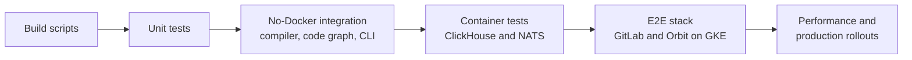
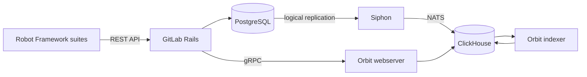

# Testing

## Overview

Orbit has tests at every layer of the stack. Each layer answers a different question, and each one is cheaper than the layer above it.

1. Build scripts check the configuration before any test runs.
2. Unit tests check one function or module.
3. Compiler, code-graph, and CLI tests run real Orbit code with no external services.
4. Container tests run Orbit against real ClickHouse and NATS.
5. End-to-end (e2e) tests deploy GitLab and every Orbit component on Kubernetes. Then they drive the stack the way a user does.
6. Performance tests and production rollouts measure speed and scale.

Most coverage is data, not Rust. A contributor adds a YAML file, and the harness turns it into a test. This keeps tests short and lets one harness check many cases.

This document describes each layer, what it proves, how to run it, and where it runs in CI. Then it gives the rules for where a new test goes and lists the known gaps. For the e2e runbook, see [E2E testing harness](../dev/e2e-testing.md).

This document covers this repository. The Rails side of Orbit has its own tests in [`gitlab-org/gitlab`](https://gitlab.com/gitlab-org/gitlab). All counts in this document are from commit [`bd442f6c8`](https://gitlab.com/gitlab-org/orbit/knowledge-graph/-/tree/bd442f6c8) (2026-10-10).

## Terms

- A **test layer** is one level of the stack in the list above. Most layers have their own harness and CI job.
- A **YAML suite** is a data file that a harness turns into one or more tests. Code-graph suites, query scenarios, indexer scenarios, plan-shape fixtures, and the query corpus are all YAML suites.
- A **query scenario** is a YAML suite that runs a query through the full query pipeline and checks the response.
- An **indexer scenario** is a YAML suite that seeds source rows, runs indexer handlers, and checks the nodes, edges, or messages that come out.
- A **testcontainer** is a Docker container that a test starts and stops. Orbit uses ClickHouse and NATS testcontainers.
- A **lane** is one CI job that runs a part of the containers test binary. The three lanes together run every container test once.
- The **e2e stack** is one deployment of GitLab, PostgreSQL, Redis, Siphon, NATS, ClickHouse, and Orbit on the shared GKE cluster.
- **SDLC data** is the software development lifecycle data that Orbit indexes from GitLab, such as issues, merge requests, and pipelines.

## The layers at a glance



| Layer | Tests | CI job | Runs on | Local command |
| --- | --- | --- | --- | --- |
| Build scripts | 9 build scripts that check inputs | every build | MR and main | `mise build` |
| Unit tests | 2,737 | `unit-test` | MR and main | `mise test:fast` |
| Compiler integration | 225, and one of them runs 70 plan-shape fixtures | `compiler-integration-test` | MR and main | `mise test:local` |
| Code-graph suites | 542 tests from YAML suites, plus 5 Rust tests | `integration-tests-codegraph` | MR and main | `mise test:integration:codegraph` |
| CLI integration | 50 | `cli-integration-test` | MR and main | `mise test:cli` |
| Billing boundary | 1 | `billing-boundary-check` | MR and main | `cargo nextest run -p integration-tests --test billing_boundary` |
| Container tests | 186, which run 331 query scenarios, 104 indexer scenarios, and 488 corpus cases | `integration-test`, `integration-test-data-correctness`, `corpus-smoke-test` | MR and main | `mise test:integration` |
| E2E | 51 Robot Framework cases in 13 suites | `e2e`, `e2e-ha` | `e2e`: main and the pin-bump MR, manual on other MRs. `e2e-ha`: daily schedule, manual on MRs | `e2e/scripts/setup.sh`, then `e2e/scripts/test.sh` |
| Performance | 23 benchmark repositories in CI, synthetic query load | `code-indexing-benchmark-*`, `orbit-perf` | Benchmarks: MRs that change indexing crates. `orbit-perf`: main, and MRs that change the query path | `mise query:profile` |
| Fuzzing | 12 Bolero targets | none | local only | `mise fuzz:<target>` |

The eight Rust test jobs run on every MR and every main commit, and none of them is allowed to fail. The last 100 successful MR pipelines had a median duration of 12.4 minutes and a p90 of 18.2 minutes (2026-10-06 to 2026-10-10).

## Build scripts

Some checks run when Cargo compiles a crate. These checks cannot be skipped, because a failed check stops `cargo build` on a laptop and in CI.

| Crate | What the build script checks |
| --- | --- |
| `orbit-server` | Every named query compiles in JSON and GQL against the ontology. The migration ledger and the schema fingerprint agree with the `schema` pin. The ontology archive for the current version exists. Authored ETL SQL, prompts, and skills are valid. |
| `orbit-cli` | Prompts and skills are valid. |
| `query-engine/compiler` | The public JSON schema agrees with the limit constants in Rust. |
| `orbit-analytics` | The six vendored Iglu analytics schemas agree with their paths and pins. |
| `indexer` | The vendored Rails system-note actions are not empty and have no duplicates. |
| `duckdb-client` | The DuckDB version in `Cargo.lock` agrees with the pin, and each DuckDB extension matches its pinned SHA-256. |
| `orbit-billing` | `ORBIT_BILLING_ENFORCED` is `true` or `false`. |
| `xtask` | The [crate map](../dev/agents-crate-map.md) lists every workspace member. |
| `integration-tests-codegraph` | Generates one test for each YAML suite and fails on duplicate names. |

## Unit tests

Unit tests live in `#[cfg(test)]` modules next to the code they test. They need no Docker and no external services.

`mise test:fast` runs them through cargo-nextest. The script is [`scripts/run-unit-tests.sh`](../../scripts/run-unit-tests.sh). It runs `--lib` targets and the `xtask` and `orbit` binaries for the whole workspace. It excludes four crates: `integration-tests` and `integration-tests-codegraph` have their own jobs, and `orbit-fuzz` and `query-profiler` run in no job.

In CI the same script uses the `ci` profile in [`.config/nextest.toml`](../../.config/nextest.toml). This profile runs every test even after a failure and retries a failed test up to 3 times. It also flags tests slower than 90 seconds and publishes JUnit results.

| Crate | Tests | Crate | Tests |
| --- | --- | --- | --- |
| `indexer` | 440 | `orbit-utils` | 161 |
| `query-engine/compiler` | 353 | `xtask` | 145 |
| `code-graph` and `treesitter-visit` | 320 | `integration-testkit` | 135 |
| `ontology` | 230 | `orbit-server-config` | 109 |
| `orbit-server` | 225 | `orbit-billing` | 84 |
| `orbit-cli` | 195 | all other crates | 340 |

## Compiler integration tests

The `local` test binary in `crates/integration-tests` checks the query compiler with no Docker. The `compiler-integration-test` job runs it, and `mise test:local` runs it on a laptop. It has 225 tests in these areas:

- SQL generation for the ClickHouse and DuckDB dialects.
- Ontology loading and validation.
- Virtual columns and named queries.
- File content and merge request diffs from Gitaly, with a mock HTTP server in place of the GitLab internal API.
- A parse check for every query scenario file, so a broken YAML file fails in a job that needs no Docker.

### Plan-shape fixtures

The [plan-shape harness](../../crates/integration-tests/tests/compiler/plan_shape/README.md) checks the plan that the compiler picks, not the rows that the query returns. Each of the 70 YAML fixtures in [`plan_shape/fixtures`](../../crates/integration-tests/tests/compiler/plan_shape/fixtures) gives a query and the expected plan. Examples are which edge table the plan scans, where it narrows, and how it hydrates. Run them with `mise test:plan-shape`.

Plan-shape fixtures do not measure latency, and they do not replace query scenarios. A plan can be correct and still return the wrong rows.

## Code-graph suites

The code-graph engine turns source code into definitions, references, and edges. YAML suites in [`crates/integration-tests-codegraph`](../../crates/integration-tests-codegraph) check it. Each suite works like this:

1. The suite declares a few source files inline.
2. The harness writes them to a temporary directory and runs the real indexing pipeline. Most languages use tree-sitter, JavaScript and TypeScript use OXC, and Rust uses rust-analyzer.
3. The harness loads the result into an in-memory DuckDB database that uses the local graph schema.
4. Each check is an OpenCypher-like query. Orbit's own GQL compiler turns it into SQL, and the harness compares the rows with the expected values.
5. The suite fails if the pipeline writes an edge that the ontology does not declare.

There are 247 suites in `fixtures/`, with 1,625 test cases. They cover 20 languages and 3 frameworks (Next.js, React, and Vue), plus cross-language and JVM cases. Fifteen `v1_*` suites keep the results of the previous engine, so a rewrite cannot change them without a failing test.

Another 295 suites in `fixtures_incremental/` run the same kind of checks through the `code-graph-incremental` engine. They can also add, change, and remove files in steps.

The build script generates one Rust test for each YAML file, so a new file needs no registration. Run all suites with `mise test:integration:codegraph`. For one language, run `cargo nextest run -p integration-tests-codegraph -E 'test(/^<lang>_/)'`.

## CLI tests

The CLI tests start the compiled `orbit` binary as a subprocess. They run it against temporary Git repositories and DuckDB databases. The 50 tests cover:

- concurrent readers and writers on one graph.
- indexing the same repository twice.
- Git worktrees on different branches, and repositories nested in other repositories.
- files that the parser cannot read, such as binaries and deleted or ignored files.
- the MCP server, with a full JSON-RPC handshake and tool calls over stdin and stdout.
- the bundled skill content and the repository map, which has its own YAML fixture.
- setup outside a repository.

Run them with `mise test:cli`. The release jobs also install the Linux release archives (glibc and musl) on Oracle Linux 8 and run a smoke test (`local-cli-smoke-linux-*`).

## Container tests

Container tests run real Orbit code against real infrastructure. The shared harness, [`integration-testkit`](../../crates/integration-testkit), does this setup:

1. It starts a ClickHouse 26.2 testcontainer.
2. It creates the graph schema from the ontology. Tests always use the same tables that the indexer writes.
3. It loads seed data from `config/seeds/`.
4. It runs `OPTIMIZE TABLE ... FINAL` on every table, so reads are deterministic.

Tests that only read data share one database. Tests that write data get their own copy of it. Mocks replace two systems that Orbit does not own: Rails authorization and Gitaly.

The mise tasks use the Docker socket of the Colima `gkg` profile. On macOS, start that profile, then pick a task. On Linux with native Docker, run `cargo nextest run --all-features --test containers`.

```shell
colima start gkg --memory 12
mise test:integration
```

| Task | What it runs |
| --- | --- |
| `mise test:integration` | All 186 container tests |
| `mise test:integration:data` | Query scenarios and data correctness |
| `mise test:integration:server` | Data correctness, hydration, redaction, and graph formatting |
| `mise test:integration:indexer` | All indexer tests |
| `mise test:integration:indexer:sdlc:scenario <filter>` | SDLC indexer scenarios whose path contains the filter |
| `mise test:integration:corpus` | The query corpus and the executable docs |
| `mise test:integration:overlay <name>` | Data correctness with an ontology overlay |

CI splits the container tests into three lanes that run in parallel. `integration-test` runs most tests. `integration-test-data-correctness` runs the four data-driven tests: SDLC indexer scenarios, query scenarios, data correctness, and performance queries. `corpus-smoke-test` runs the corpus. The `integration-test-lane-coverage-check` job fails if a test is in no lane or in two lanes.

### Query scenarios

Query scenarios are the main test surface for query correctness. The 331 files in [`data_correctness/scenarios`](../../crates/integration-tests/tests/server/data_correctness/scenarios) are in 12 categories. The largest are security, search, traversal, and edge cases.

Each scenario runs the full query pipeline: compile, execute, redact, hydrate, paginate, and format. Then it checks the response. A scenario can also check the generated SQL and the skip indexes that ClickHouse uses. All but one scenario give the same query in JSON and in GQL, so both frontends must return the same result.

The format reference is in the [`integration-testkit` README](../../crates/integration-testkit/README.md).

### Indexer scenarios

Most indexer coverage is also YAML. Each of the 104 files in [`indexer/scenarios`](../../crates/integration-tests/tests/indexer/scenarios) gives the source rows to seed, the handlers to run, and the nodes, edges, or messages to expect. There are 96 SDLC scenarios, 7 dispatch scenarios, and 1 degraded-dispatch scenario.

The `indexer-scenario-schema-validate` job checks every file against [`indexer_scenario.schema.json`](../../config/schemas/indexer_scenario.schema.json). To add indexer coverage, you usually add one YAML file.

### NATS

The indexer depends on NATS JetStream behavior. Container tests check this behavior against a real NATS 2.11 container:

- acknowledgements, redelivery after a negative acknowledgement, and keep-alives for long work.
- work-queue rules that allow one task in progress for each subject.
- delivery limits, the reconciler that clears stuck messages, and the dead-letter queue.
- key-value buckets for locks.
- stream names, versions, and clean-up across releases.
- mTLS: a suite makes a certificate authority at run time and proves that the server rejects a client with no certificate or the wrong CA.

Handler logic uses an in-memory mock broker, so most handler tests need no NATS server.

### Analytics events

Orbit sends analytics and usage billing events through [labkit-rs](https://gitlab.com/gitlab-org/rust/labkit-rs). A container test sends a `gkg_query_executed` event to a snowplow-micro container. Then it checks that snowplow-micro accepts the event into `/micro/good`, with both Orbit contexts and their key fields. The `orbit-analytics` build script checks the vendored Iglu schemas, and the `iglu-schema-check` job compares them with the public registry on each MR.

### Query corpus and executable docs

The `corpus-smoke-test` job runs 488 queries through the production query stages against seeded ClickHouse. A stub replaces the authorization stage, and a mock serves Gitaly content.

| Family | Cases |
| --- | --- |
| Curated corpus in [`fixtures/queries/corpus`](../../fixtures/queries/corpus), 10 files | 371 |
| Named queries in `config/named_queries`, each in JSON and GQL | 24 |
| Code blocks marked `json orbit-query` or `gql orbit-query` in the docs and the Orbit skill | 93 |

The third family keeps the documentation correct. The test runs every marked query example in the root Markdown files, `docs/source`, `docs/design-documents`, `skills/orbit`, and `crates/integration-testkit`. It also fails on a query in an unmarked `json` or shell block. It fails on an unclosed `json`, `gql`, or shell block too. If a schema change breaks a published example, CI fails.

Other jobs check the docs prose. On MRs, `check_docs_markdown` runs Vale and an offline link check on `docs/source`, and markdownlint on the root, `docs/dev`, and `docs/source`. `lint:prose` checks sentence length and wording in prompts, skills, agent guides, `docs/dev`, and `docs/design-documents`. `query-language-docs-check` regenerates the table of text-indexed properties in the query-language reference and fails if it differs.

## End-to-end tests

The e2e layer deploys the full GitLab stack and every Orbit component on a shared GKE cluster. Each run gets its own namespaces, named for the commit SHA.

Helmfile deploys the stack in three phases:

1. Namespaces and secrets.
2. Infrastructure: GitLab, PostgreSQL, Redis, NATS, and ClickHouse.
3. The data pipeline: the PostgreSQL publication, [Siphon](https://gitlab.com/gitlab-org/analytics-section/siphon) CDC, and Orbit in four modes (webserver, indexer, dispatcher, and health check).

The diagram leaves out the dispatcher and the health check.



[`e2e/config/versions.yaml`](../../e2e/config/versions.yaml) pins the GitLab and Siphon versions and the Orbit chart version. On an MR, the job builds the Orbit image from the branch while the stack deploys. On main, it uses the image from `docker-build-amd64`.

When the stack is up, [Robot Framework suites](../../e2e/tests) use it the way a user does. They create groups, projects, issues, and notes through the GitLab API, and they push fixture repositories. Then they send GQL to `POST /api/v4/orbit/query` until the expected nodes and edges appear. A passing run proves the full chain: a PostgreSQL row goes through Siphon, NATS, ClickHouse, and the indexer, and comes back through the API.

The first suite makes an administrator bot, turns on the `orbit_gql_queries` feature flag, and indexes a shared namespace and a canary project. Then [pabot](https://pabot.org/) runs the other 12 suites in 12 parallel processes. Each suite makes its own administrator account and token, because the Orbit query rate limit applies to each user.

| Suite | Cases | Suite | Cases |
| --- | --- | --- | --- |
| 01 setup and smoke | 5 | 08 private redaction | 1 |
| 02 indexing | 3 | 09 API surface | 6 |
| 03 code indexing | 7 | 10 query shapes | 4 |
| 04 code backfill | 2 | 11 security graph | 1 |
| 05 role-scoped authorization | 7 | 12 membership graph | 2 |
| 06 incremental update | 1 | 13 cross-namespace traversal | 10 |
| 07 namespace lifecycle | 2 | **Total** | **51** |

The `e2e` job runs on every main commit and is manual on MRs. It times out after 60 minutes, saves diagnostics when it fails, and always removes the stack. Across the last 100 successful main runs (2026-09-23 to 2026-10-10), the median duration was 10.8 minutes and the p90 was 13.9 minutes.

Two more jobs use the same suites:

- `e2e-ha` runs the suites on a ClickHouse cluster with three replicas. It kills one replica after setup and a second one during the run. It runs every day on a schedule and is manual on MRs.
- `e2e-pin-bump` runs every day. It moves the pins in `versions.yaml` to their latest versions and updates one MR. On that MR, `e2e` runs automatically and must pass before the MR can merge.

For setup, debugging, and the list of key files, see [E2E testing harness](../dev/e2e-testing.md).

## Performance tests

### Indexing benchmarks

[`code-indexing-benchmark.yaml`](../../code-indexing-benchmark.yaml) lists 29 real repositories in 14 language groups. Examples are the GitLab, Gitaly, and Elasticsearch repositories. When an MR changes an indexing crate, CI uses [`gitlab-xtasks`](https://gitlab.com/gitlab-org/rust/gitlab-xtasks) and hyperfine to time `orbit index`. It runs on the 23 repositories in the 10 language groups that the CI matrix covers. Then it posts the results as an MR comment.

### Synthetic query load

The `orbit-perf` job deploys GitLab and Orbit, then loads a synthetic graph that `xtask` generates from [`simulator_medium.yaml`](../../crates/xtask/simulator_medium.yaml). Then `xtask loadtest` sends the 13 performance scenarios in `server/performance/scenarios` over gRPC, in 10 rounds with 20 concurrent requests. A container test also compiles each scenario, so a scenario that does not compile fails CI.

The job runs on every main commit. On an MR, the `orbit-perf:mr` job runs automatically when the query path changes and posts the report as a comment. Otherwise it is manual. It is allowed to fail, so it reports a change but does not block it.

### Profiling tools

- `mise query:profile` compiles a query the way production does. It reports rows and bytes read, time per stage, and the query plan. `mise query:diff` compares two runs.
- `mise perf:gtime` and `mise perf:rss` record the time and memory of `orbit index` for before and after comparisons.
- The [RA bench harness](../../bench/README.md) deploys Orbit on a new GKE cluster and replays a GitLab.com datalake dump. It checks whether a hardware size meets the service level objectives. It does not run in CI.

### Production rollouts as load tests

A schema change that rebuilds the graph re-indexes every eligible project in production. So each such rollout is also a load test on the real workload. Each rollout uses the same measurements:

- migration start and end from dispatcher logs.
- re-index windows from the indexing completion rate in Prometheus.
- write throughput from the rows-written counter.
- time to coverage from the checkpoint timestamps of each repository in ClickHouse.

In April 2026, a backfill of one namespace ran at about 135 projects per minute. The Gitaly canary host kept 100% Apdex at about 257 operations per second ([report](https://gitlab.com/gitlab-com/gl-infra/production/-/work_items/21860#note_3287183134)). In May, a tuning campaign cut the full code re-index time. Versions v45 to v47 took 3.3 to 4.8 hours, and v48 took about 33 minutes. The v48 run covered about 157,000 projects ([report](https://gitlab.com/gitlab-org/orbit/knowledge-graph/-/work_items/787#note_3399845301)).

The [v79 rollout report](https://gitlab.com/gitlab-com/gl-infra/production/-/work_items/21860#note_3522511267) (2026-07-03) has the latest full-corpus numbers:

| Metric | v79 |
| --- | --- |
| Repositories re-indexed | about 550,000 across about 1,350 namespaces |
| Rows written | about 44 billion (5.4 TiB) in about 230,000 batch inserts |
| Graph at rest | about 21 billion edge rows and 7.6 billion node rows (560 GiB compressed) |
| Code indexing progress | 50% at 30 minutes, 90% at 53, 99% at 60, all done at 64 |
| Throughput | 10,000 to 13,000 repositories per minute at peak; 8,700 on average in the first hour |
| SDLC backfill | about 36 billion rows in about 2.5 hours |
| ClickHouse errors | zero scheduling or concurrent-query rejections; query p95 under one second |

Some failures only occur at production scale. Examples are evictions on the temporary volume, ClickHouse merge backpressure, JOIN memory limits, and NATS lock and queue growth. A rollout report found each one, the team fixed it, and the next migration checked the fix.

## Fuzzing

The [`orbit-fuzz`](../../crates/fuzz) crate has 12 Bolero targets:

- four for the query frontends: JSON text, generated JSON queries, GQL text, and GQL from the grammar.
- seven for the language parsers: Ruby, Python, TypeScript, Java, Kotlin, C#, and Rust.
- one for indexer message deserialization.

Each target has a `mise fuzz:<target>` task and needs a nightly Rust toolchain. CI compiles the targets with Clippy but does not run them.

## Gates around the tests

### CI checks

CI declares 91 jobs. Next to the tests, the checks include:

- Clippy with all features and warnings as errors, rustfmt, `cargo shear`, `cargo audit`, and `cargo deny`.
- SAST and secret detection, which report findings but do not block, and a blocking FIPS check.
- conventional-commit MR titles, toolchain sync, and identical `AGENTS.md` and `CLAUDE.md` files.
- JSON schema checks for the ontology, named queries, the migration ledger, indexer scenarios, `config/versions.yaml`, and setup files.
- freshness checks for generated files: the config schema, DDL, Grafana dashboards, the metrics catalog, and the query-language reference.
- version bump checks for the query DSL, response formats, skills, and prompts.
- the migration ledger check described in [Schema management](schema_management.md#ci-and-local-enforcement).

Clippy, rustfmt, and the checks that compare an MR with its target branch run only on MRs.

### Local hooks

[`lefthook.yml`](../../lefthook.yml) runs commitlint on each commit message and Clippy before each push. It also runs 14 pre-commit checks, including a Gitleaks secret scan. Most of them mirror a CI check. CI turns lefthook off, so CI stays the final check.

### Review automation

- Five [GitLab Duo review agents](../../.gitlab/duo/mr-review-instructions.yml) review the Rust changes in each MR. They check Rust security, Rust performance, logging security, and the SOX billing boundary (two agents).
- The `ai-review-bot` component and three manual `ai:*` jobs review performance, security, and docs on request.
- A daily job marks stale MRs and closes them after 3 more days.

### Billing boundary

Usage billing is in scope for SOX. The `billing-boundary-check` job fails if any crate other than `orbit-server` depends on `orbit-billing`. CODEOWNERS sends changes to the billing surface to the Orbit team for approval. The rules are in [SOX billing boundary](../dev/sox-billing-boundary.md).

## Releases and rollouts

semantic-release cuts a release from main. A schedule runs it Monday to Thursday at 13:00 UTC, and a maintainer can also start it by hand. Then the `release-deploy-mr` job opens an MR in [gl-infra/argocd/apps](https://gitlab.com/gitlab-com/gl-infra/argocd/apps). That MR changes the image for staging (`orbit-stg`) and production (`orbit-prd`). The MR description says if the schema version changed. A change with no new version is an image swap that takes minutes. A new version starts a migration.

The [migration ledger](schema_management.md#ledger-scopes) tells each migration what to rebuild. Some versions rebuild nothing, some rebuild only SDLC or code data, and some rebuild all data. During a migration, every webserver serves the active version, and new pods load its ontology from the archive. After promotion, every webserver changes to the new version. See [Webserver readiness gate](schema_management.md#webserver-readiness-gate).

Each rollout is watched for the same signals:

| Milestone | Signal |
| --- | --- |
| New pods are up | pod status and a restart count of 0 |
| New webserver serves the active version | `/ready` returns 200 |
| Migration starts | the dispatcher logs `marking schema version as migrating` |
| Backfill progresses | the indexing completion rate in Prometheus and the `gkg.schema.indexed_units` metric |
| Promotion gate | the `migration completion status` log, with indexed and enabled namespace counts |
| Migration is active | the dispatcher logs `marking migrating version as active`, the `gkg_schema_version` table shows the new version, and `orbit remote status` succeeds |

## Where to add a test

Use the cheapest layer that can prove the behavior. Every bug fix gets a test that fails before the fix.

| You changed | Add |
| --- | --- |
| Query results, filters, redaction, or pagination | a query scenario in `crates/integration-tests/tests/server/data_correctness/scenarios/<category>/` |
| The plan that the compiler picks | a plan-shape fixture in `crates/integration-tests/tests/compiler/plan_shape/fixtures/` |
| SQL text for one dialect | a test in `crates/integration-tests/tests/compiler/dialects/` |
| How the indexer maps rows to nodes and edges | an indexer scenario in `crates/integration-tests/tests/indexer/scenarios/sdlc/<domain>/` |
| A language parser or resolver | a YAML suite in `crates/integration-tests-codegraph/fixtures/<language>/` and `fixtures_incremental/<language>/`, a `code-indexing-benchmark.yaml` entry for a new language, and fixture repositories in `fixtures/code/` |
| CLI behavior | a test in `crates/integration-tests/tests/cli.rs`, not in `remote_cli.rs` or `skills_remote.rs`, which CI does not run |
| Schema migrations or ledger scopes | a test in `crates/integration-tests/tests/indexer/schema/` |
| NATS or indexing engine behavior | a test in `crates/integration-tests/tests/indexer/nats.rs` or `engine.rs` |
| A query example in the docs | mark it `json orbit-query` or `gql orbit-query` |
| A flow across Rails and Orbit | a Robot Framework suite in `e2e/tests/` |

Follow these rules:

- Write new correctness tests as YAML suites, not as Rust modules.
- Do not delete a Rust test until a YAML suite checks every one of its assertions.
- In a test that gates CI, measure performance with deterministic numbers, such as rows or bytes read, not wall-clock time.
- Do not add a test that depends on another test's state. E2E suites after suite 01 must not depend on each other.

## Known gaps

- **No pre-production environment at production scale.** GitLab staging does not have enough data to load-test indexing or queries. A [staging load test](https://gitlab.com/gitlab-org/orbit/knowledge-graph/-/work_items/320) confirmed this limit. So scale testing uses production rollouts, and `orbit-perf` uses a synthetic graph. Work with the Performance Enablement team is in [#623](https://gitlab.com/gitlab-org/orbit/knowledge-graph/-/issues/623).
- **Staging and production change in one MR.** The deploy MR moves both environments in one commit. The argocd/apps review rule asks for staging first, but it does not block the merge.
- **E2E does not block MRs.** On main it runs after the merge. On MRs it is manual and allowed to fail. Only the pin-bump MR waits for it.
- **85 Rust tests run in no CI job.** `unit-test` runs only `--lib` targets and two binaries, and no other job selects these test files:
  - `orbit-cli/tests/remote_cli.rs` and `orbit-cli/tests/skills_remote.rs` (30 tests).
  - `code-graph-incremental/tests` (32).
  - the GOON formatter tests in `query-engine/formatters/tests` (12).
  - `xtask/tests` (6).
  - `nats-client/tests` (4).
  - `query-profiler` (1).
- **Fuzzing does not run in CI.** The targets need a nightly toolchain that mise does not install.
- **Six benchmark repositories do not run in CI.** The CI matrix covers 10 of the 14 language groups.
- **No blue-green deployment.** [Clone-based migrations](decisions/017_clone_based_non_blocking_migrations.md) let a version rebuild only the data that changed. Full blue-green deployment is still open in [`gitlab-org/orbit#7`](https://gitlab.com/groups/gitlab-org/orbit/-/work_items/7).
- **No production check of migration row counts.** Migration completion uses checkpoints, not row counts. Container tests check row counts after a clone on small fixtures. No check compares row counts between the old and new version in production.
- **No Rails version check.** Orbit does not check the version of the Rails instance that calls it. Compatibility between versions depends on review.
- **Security scans do not block.** SAST and secret detection report findings, but they do not fail the pipeline.
- **CI does not run markdownlint or the link check on the design documents.** A broken link in this document does not fail CI.
- **Clippy and rustfmt do not run on main.** They run only on MRs.
- **Local e2e runs use the latest main image.** `e2e/scripts/lib.sh` sets the Orbit image tag to `dev` unless you set `E2E_GKG_TAG`. The Orbit image pin in `versions.yaml` has no effect.
- **One lefthook check never runs.** The `ontology-schema` hook watches `fixtures/ontology/`, which does not exist.
- **No coverage measurement.** CI does not measure line or branch coverage.
- **Retries can hide flaky tests.** The `ci` nextest profile retries a failed test up to 3 times. Nothing tracks the tests that pass only on a retry.
- **Skipped cases.** The code-graph YAML suites mark 69 cases `skip: true`, and 3 Rust tests are `#[ignore]`.
- **No CLI smoke test on macOS or Windows.** Only the Linux release archives get a smoke test.
- **Benchmarks report but do not gate.** A slower benchmark posts a comment, but it does not fail the MR.
- **Single-node testcontainers.** Container tests use one ClickHouse node, so they cannot test `ON CLUSTER` behavior. `e2e-ha` covers replica loss but not every cluster command.

## References

- [E2E testing harness](../dev/e2e-testing.md).
- [`crates/integration-tests` README](../../crates/integration-tests/README.md).
- [`crates/integration-testkit` README](../../crates/integration-testkit/README.md).
- [`crates/integration-tests-codegraph` README](../../crates/integration-tests-codegraph/README.md).
- [Graph engine: plan-shape harness](querying/graph_engine.md).
- [Orbit query frontend: integration tests](querying/orbit_query_frontend.md#integration-tests).
- [Schema management](schema_management.md).
- [Security](security.md).
- [SOX billing boundary](../dev/sox-billing-boundary.md).
- [Production rollout reports, production#21860](https://gitlab.com/gitlab-com/gl-infra/production/-/work_items/21860).
- [Code indexing performance, #787](https://gitlab.com/gitlab-org/orbit/knowledge-graph/-/work_items/787).
- [labkit-rs](https://gitlab.com/gitlab-org/rust/labkit-rs).
