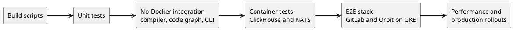
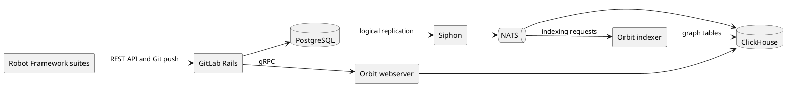

# Testing

## Overview

Orbit has tests at every layer of the stack.

1. Build scripts check the configuration before any test runs.
2. Unit tests check one function or module.
3. Compiler, code-graph, and CLI tests run real Orbit code with no external services.
4. Container tests run Orbit against real ClickHouse and NATS.
5. End-to-end (e2e) tests deploy GitLab and every Orbit component on Kubernetes. Then they drive the stack the way a user does.
6. Performance tests and production rollouts measure speed and scale.

The Rails side of Orbit has its own tests in [`gitlab-org/gitlab`](https://gitlab.com/gitlab-org/gitlab).

## Testing principles

- Prefer integration, YAML, and e2e tests over unit tests. Use a unit test for pure logic that a higher-level test cannot reach.
- Write new correctness tests as YAML suites, not as Rust modules. Query scenarios, indexer scenarios, code-graph suites, and plan-shape fixtures cover most changes. If a case does not fit, extend the harness.
- Every bug fix gets a test that fails before the fix. Write it at the level where a user can see the bug.
- Test against real infrastructure for behavior that Orbit owns. Mock only the systems that Orbit does not own, such as Rails authorization and Gitaly.
- Do not delete a Rust test until a YAML suite checks every one of its assertions.
- Keep tests deterministic. In a test that gates CI, measure performance with deterministic numbers, such as rows or bytes read, not wall-clock time.
- Do not add a test that depends on another test's state.
- Mark every query example in the docs as `json orbit-query` or `gql orbit-query`, so CI runs it.
- Put a new test in a target that a CI job runs. A file under a crate's `tests/` directory does not run in CI unless a job selects it.

## Terms

- A **test layer** is one level of the stack in the list above. Most layers have their own harness and CI job.
- A **YAML suite** is a data file that a harness turns into one or more tests. Code-graph suites, query scenarios, indexer scenarios, plan-shape fixtures, and the query corpus are all YAML suites.
- A **query scenario** is a YAML suite that runs a query through the full query pipeline and checks the response.
- An **indexer scenario** is a YAML suite that seeds source rows, runs indexer handlers, and checks the nodes, edges, or messages that come out.
- A **testcontainer** is a Docker container that a test starts and stops. Orbit uses ClickHouse and NATS testcontainers.
- A **lane** is one CI job that runs a part of the containers test binary. The lanes together run every container test once.
- The **e2e stack** is one deployment of GitLab, PostgreSQL, Redis, Siphon, NATS, ClickHouse, and Orbit on a shared GKE cluster.
- **SDLC data** is the software development lifecycle data that Orbit indexes from GitLab, such as issues, merge requests, and pipelines.

## The layers at a glance



| Layer | Where it lives | Local command |
| --- | --- | --- |
| Build scripts | `build.rs` in each crate | `mise build` |
| Unit tests | `#[cfg(test)]` modules next to the code | `mise test:fast` |
| Compiler integration | `crates/integration-tests/tests/compiler/` | `mise test:local` |
| Code-graph suites | `crates/integration-tests-codegraph/` | `mise test:integration:codegraph` |
| CLI integration | `crates/integration-tests/tests/cli.rs` | `mise test:cli` |
| Container tests | `crates/integration-tests/tests/` | `mise test:integration` |
| E2E | `e2e/` | `e2e/scripts/setup.sh`, then `e2e/scripts/test.sh` |
| Performance | `code-indexing-benchmark.yaml`, `crates/query-engine/profiler/` | `mise query:profile` |
| Fuzzing | `crates/fuzz/` | `mise fuzz:<target>` |

The Rust test jobs run on every MR and every main commit, and none of them is allowed to fail.

## Build scripts

Some checks run when Cargo compiles a crate. These checks cannot be skipped, because a failed check stops `cargo build` on a laptop and in CI.

Build scripts check the inputs that the code depends on but that Rust cannot type-check:

- Named queries compile against the ontology.
- The migration ledger and the schema fingerprint agree with the `schema` pin.
- Vendored files, such as analytics schemas and Rails system-note actions, are valid and agree with their pins.
- The public query JSON schema agrees with the limit constants in Rust.
- Prompts, skills, and docs that list workspace members are complete.

To find a check, read the `build.rs` file of the crate that owns the input.

## Unit tests

Unit tests live in `#[cfg(test)]` modules next to the code they test. They need no Docker and no external services. Use them for pure logic, such as parsing and name mapping, and test behavior at a higher layer.

`mise test:fast` runs them through cargo-nextest. The script is [`scripts/run-unit-tests.sh`](../../scripts/run-unit-tests.sh). It runs the library targets of the workspace and skips the crates that have their own jobs.

In CI the same script uses the `ci` profile in [`.config/nextest.toml`](../../.config/nextest.toml). This profile runs every test even after a failure and retries a failed test. It also flags slow tests and publishes JUnit results.

## Compiler integration tests

The `local` test binary in `crates/integration-tests` checks the query compiler with no Docker. The `compiler-integration-test` job runs it, and `mise test:local` runs it on a laptop. It covers these areas:

- SQL generation for the ClickHouse and DuckDB dialects.
- Ontology loading and validation.
- Virtual columns and named queries.
- File content and merge request diffs from Gitaly, with a mock HTTP server in place of the GitLab internal API.
- A parse check for every query scenario file, so a broken YAML file fails in a job that needs no Docker.

### Plan-shape fixtures

The [plan-shape harness](../../crates/integration-tests/tests/compiler/plan_shape/README.md) checks the plan that the compiler picks, not the rows that the query returns. Each YAML fixture in `plan_shape/fixtures/` gives a query and the expected plan. Examples are which edge table the plan scans, where it narrows, and how it hydrates. Run them with `mise test:plan-shape`.

Plan-shape fixtures do not measure latency, and they do not replace query scenarios.

## Code-graph suites

The code-graph engine turns source code into definitions, references, and edges. YAML suites in [`crates/integration-tests-codegraph`](../../crates/integration-tests-codegraph/README.md) check it. Each suite works like this:

1. The suite declares a few source files inline.
2. The harness writes them to a temporary directory and runs the real indexing pipeline.
3. The harness loads the result into an in-memory DuckDB database that uses the local graph schema.
4. Each check is an OpenCypher-like query. Orbit's own GQL compiler turns it into SQL, and the harness compares the rows with the expected values.
5. The suite fails if the pipeline writes an edge that the ontology does not declare.

There is one directory of suites for each language and framework. Suites in `fixtures/` run through the main engine, and suites in `fixtures_incremental/` run through the incremental engine. Incremental suites can also add, change, and remove files in steps. Some suites keep the results of the previous engine, so a rewrite cannot change them without a failing test.

The build script generates one Rust test for each YAML file, so a new file needs no registration. Run all suites with `mise test:integration:codegraph`. For one language, run `cargo nextest run -p integration-tests-codegraph -E 'test(/^<lang>_/)'`.

## CLI tests

The CLI tests start the compiled `orbit` binary as a subprocess. They run it against temporary Git repositories and DuckDB databases. They cover:

- Concurrent readers and writers on one graph.
- Indexing the same repository twice.
- Git worktrees on different branches, and repositories nested in other repositories.
- Files that the parser cannot read, such as binaries and deleted or ignored files.
- The MCP server, with a full JSON-RPC handshake and tool calls over stdin and stdout.
- The bundled skill content and the repository map, which has its own YAML fixture.
- Setup outside a repository.

Run them with `mise test:cli`. The release jobs also install the Linux release archives and run a smoke test.

## Container tests

Container tests run real Orbit code against real infrastructure. The shared harness, [`integration-testkit`](../../crates/integration-testkit/README.md), does this setup:

1. It starts a ClickHouse testcontainer.
2. It creates the graph schema from the ontology. Tests always use the same tables that the indexer writes.
3. It loads seed data from `config/seeds/`.
4. It runs `OPTIMIZE TABLE ... FINAL` on every table, so reads are deterministic.

Tests that only read data share one database. Tests that write data get their own copy of it. Mocks replace two systems that Orbit does not own: Rails authorization and Gitaly.

The mise tasks use the Docker socket of the Colima `gkg` profile. On macOS, start that profile, then pick a task. On Linux with native Docker, run `cargo nextest run --all-features --test containers`.

```shell
colima start gkg --memory 12
mise test:integration
```

| Task | What it runs |
| --- | --- |
| `mise test:integration` | All container tests |
| `mise test:integration:data` | Query scenarios and data correctness |
| `mise test:integration:server` | Data correctness, hydration, redaction, and graph formatting |
| `mise test:integration:indexer` | All indexer tests |
| `mise test:integration:indexer:sdlc:scenario <filter>` | SDLC indexer scenarios whose path contains the filter |
| `mise test:integration:corpus` | The query corpus and the executable docs |
| `mise test:integration:overlay <name>` | Data correctness with an ontology overlay |

CI splits the container tests into lanes that run in parallel. One lane runs most tests, one runs the data-driven tests, and one runs the query corpus. The `integration-test-lane-coverage-check` job fails if a test is in no lane or in two lanes.

### Query scenarios

Query scenarios are the main test surface for query correctness. They live in [`data_correctness/scenarios`](../../crates/integration-tests/tests/server/data_correctness/scenarios), in one directory for each category, such as security, search, and traversal.

Each scenario runs the full query pipeline: compile, execute, redact, hydrate, paginate, and format. Then it checks the response. A scenario can also check the generated SQL and the skip indexes that ClickHouse uses. Scenarios give the same query in JSON and in GQL, so both frontends must return the same result.

The format reference is in the [`integration-testkit` README](../../crates/integration-testkit/README.md).

### Indexer scenarios

Each file in [`indexer/scenarios`](../../crates/integration-tests/tests/indexer/scenarios) gives the source rows to seed, the handlers to run, and the nodes, edges, or messages to expect. There are scenarios for SDLC indexing and for dispatch.

The `indexer-scenario-schema-validate` job checks every file against [`indexer_scenario.schema.json`](../../config/schemas/indexer_scenario.schema.json).

### NATS

The indexer depends on NATS JetStream behavior. Container tests check this behavior against a real NATS container:

- Acknowledgements, redelivery after a negative acknowledgement, and keep-alives for long work.
- Work-queue rules that allow one task in progress for each subject.
- Delivery limits, the reconciler that clears stuck messages, and the dead-letter queue.
- Key-value buckets for locks.
- Stream names, versions, and clean-up across releases.
- mTLS: a suite makes a certificate authority at run time and proves that the server rejects a client with no certificate or the wrong CA.

Handler logic uses an in-memory mock broker, so most handler tests need no NATS server.

### Analytics events

Orbit sends analytics and usage billing events through [labkit-rs](https://gitlab.com/gitlab-org/rust/labkit-rs). A container test sends a query event to a snowplow-micro container. Then it checks that snowplow-micro accepts the event, with the Orbit contexts and their key fields. A build script checks the vendored Iglu schemas, and the `iglu-schema-check` job compares them with the public registry on each MR.

### Query corpus and executable docs

The `corpus-smoke-test` job runs a large set of queries through the production query stages against seeded ClickHouse. A stub replaces the authorization stage, and a mock serves Gitaly content. The queries come from three places:

- The curated corpus in [`fixtures/queries/corpus`](../../fixtures/queries/corpus).
- The named queries in `config/named_queries`, each in JSON and GQL.
- Code blocks marked `json orbit-query` or `gql orbit-query` in the docs and the Orbit skill.

The test runs every marked query example in the root Markdown files, `docs/source`, `docs/design-documents`, `skills/orbit`, and `crates/integration-testkit`. It also fails on a query in an unmarked `json` or shell block. It fails on an unclosed `json`, `gql`, or shell block too.

Other jobs check the docs prose. `check_docs_markdown` runs Vale, markdownlint, and a link check on MRs. `lint:prose` checks sentence length and wording in prompts, skills, agent guides, `docs/dev`, and `docs/design-documents`. `query-language-docs-check` regenerates the generated parts of the query-language reference and fails if they differ.

## End-to-end tests

The e2e layer deploys the full GitLab stack and every Orbit component on a shared GKE cluster. Each run gets its own namespaces, named for the commit SHA.

Helmfile deploys the stack in three phases:

1. Namespaces and secrets.
2. Infrastructure: GitLab, PostgreSQL, Redis, NATS, and ClickHouse.
3. The data pipeline: the PostgreSQL publication, [Siphon](https://gitlab.com/gitlab-org/analytics-section/siphon) CDC, and Orbit in all of its modes.



[`e2e/config/versions.yaml`](../../e2e/config/versions.yaml) pins the versions of the components. On an MR, the job builds the Orbit image from the branch while the stack deploys. On main, it uses the image that the build stage made.

When the stack is up, [Robot Framework suites](../../e2e/tests) use it the way a user does. They create groups, projects, issues, and notes through the GitLab API, and they push fixture repositories. Then they send GQL to `POST /api/v4/orbit/query` until the expected nodes and edges appear. A passing run proves the full chain: a PostgreSQL row goes through Siphon, NATS, ClickHouse, and the indexer, and comes back through the API.

The first suite makes an administrator bot, turns on feature flags, and indexes a shared namespace and a canary project. Then [pabot](https://pabot.org/) runs the other suites in parallel. Each suite makes its own administrator account and token, because the Orbit query rate limit applies to each user. The suites cover indexing, code indexing and backfill, role-based authorization, redaction, incremental updates, namespace lifecycle, the API surface, query shapes, and cross-namespace traversal.

The `e2e` job runs on every main commit and is manual on MRs. It saves diagnostics when it fails and always removes the stack. Two more jobs use the same suites:

- `e2e-ha` runs the suites on a ClickHouse cluster with replicas, and kills replicas during the run. It runs on a daily schedule and is manual on MRs.
- `e2e-pin-bump` runs on a daily schedule. It moves the pins in `versions.yaml` to their latest versions and updates one MR. On that MR, `e2e` runs automatically and must pass before the MR can merge.

For setup, debugging, and the list of key files, see [E2E testing harness](../dev/e2e-testing.md).

## Performance tests

### Indexing benchmarks

[`code-indexing-benchmark.yaml`](../../code-indexing-benchmark.yaml) lists real repositories, grouped by language. When an MR changes an indexing crate, CI uses [`gitlab-xtasks`](https://gitlab.com/gitlab-org/rust/gitlab-xtasks) and hyperfine to time `orbit index` on them. Then it posts the results as an MR comment. A slower result does not fail the MR.

### Synthetic query load

The `orbit-perf` job deploys GitLab and Orbit, then loads a synthetic graph that `xtask` generates from a simulator configuration. Then `xtask loadtest` sends the performance scenarios in `server/performance/scenarios` over gRPC, with many concurrent requests. A container test also compiles each scenario, so a scenario that does not compile fails CI.

The job runs on every main commit. On an MR, the `orbit-perf:mr` job runs automatically when the query path changes and posts the report as a comment. Otherwise it is manual. It is allowed to fail.

### Profiling tools

- `mise query:profile` compiles a query the way production does. It reports rows and bytes read, time per stage, and the query plan. `mise query:diff` compares two runs.
- `mise perf:gtime` and `mise perf:rss` record the time and memory of `orbit index` for before and after comparisons.
- The [RA bench harness](../../bench/README.md) deploys Orbit on a new GKE cluster and replays a GitLab.com datalake dump. It checks whether a hardware size meets the service level objectives. It does not run in CI.

### Production rollouts as load tests

A schema change that rebuilds the graph re-indexes every eligible project in production. So each such rollout is also a load test on the real workload. Each rollout uses the same measurements:

- Migration start and end from dispatcher logs.
- Re-index windows from the indexing completion rate in Prometheus.
- Write throughput from the rows-written counter.
- Time to coverage from the checkpoint timestamps of each repository in ClickHouse.

The rollout reports in the [production rollout issue](https://gitlab.com/gitlab-com/gl-infra/production/-/work_items/21860) record these measurements for each migration. Compare a new rollout with the last report to find a regression.

Some failures only occur at production scale. Examples are evictions on the temporary volume, ClickHouse merge backpressure, JOIN memory limits, and NATS lock and queue growth.

## Fuzzing

The [`orbit-fuzz`](../../crates/fuzz/README.md) crate has Bolero targets for the query frontends (JSON and GQL), the language parsers, and indexer message deserialization. Each target has a `mise fuzz:<target>` task and needs a nightly Rust toolchain. Fuzzing runs locally. CI compiles the targets but does not run them.

## Gates around the tests

### CI checks

Next to the tests, CI runs checks on each MR:

- Clippy with all features and warnings as errors, rustfmt, `cargo shear`, `cargo audit`, and `cargo deny`.
- SAST and secret detection, which report findings, and a blocking FIPS check.
- Conventional-commit MR titles, toolchain sync, and identical `AGENTS.md` and `CLAUDE.md` files.
- JSON schema checks for the ontology, named queries, the migration ledger, indexer scenarios, and other configuration files.
- Freshness checks for generated files, such as the config schema, DDL, Grafana dashboards, the metrics catalog, and the query-language reference.
- Version bump checks for the query DSL, response formats, skills, and prompts.
- The migration ledger check described in [Schema management](schema_management.md#ci-and-local-enforcement).

### Local hooks

[`lefthook.yml`](../../lefthook.yml) runs commitlint on each commit message and Clippy before each push. It also runs pre-commit checks, including a Gitleaks secret scan. CI turns lefthook off.

### Review automation

- [GitLab Duo review agents](../../.gitlab/duo/mr-review-instructions.yml) review the Rust changes in each MR. They check Rust security, Rust performance, logging security, and the SOX billing boundary.
- The `ai-review-bot` component and the manual `ai:*` jobs review performance, security, and docs on request.
- A daily job marks stale MRs and later closes them.

### Billing boundary

Usage billing is in scope for SOX. The `billing-boundary-check` job fails if any crate other than `orbit-server` depends on `orbit-billing`. CODEOWNERS sends changes to the billing surface to the Orbit team for approval. The rules are in [SOX billing boundary](../dev/sox-billing-boundary.md).
