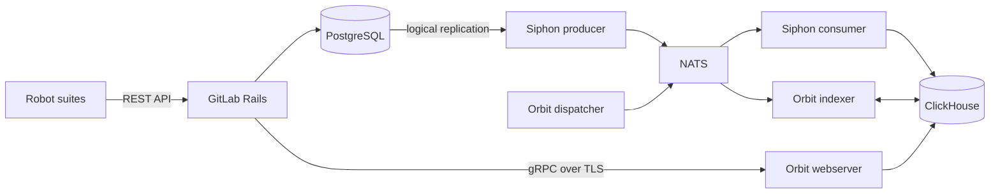

# E2E Testing Harness

The e2e harness deploys the full GitLab stack and every Orbit component on a shared GKE cluster. Then it runs Robot Framework suites against the stack.
For the purpose and scope of e2e tests, see [Testing strategy](../design-documents/testing.md#end-to-end-tests).

## Architecture

Each run gets five namespaces: `e2e-<sha>-{gkg,nats,clickhouse,gitlab,siphon}`.
The `e2e-ha` job adds `-ha` to the SHA.

`e2e/helmfile.yaml.gotmpl` deploys these releases:

- `bootstrap` (local chart `e2e-bootstrap`): the namespaces and the per-run secrets.
- `gitlab`: GitLab from the devel chart. The migrations include the ClickHouse migrations.
- `postgresql` and `redis`: standalone Bitnami releases in the GitLab namespace.
- `nats`: the NATS JetStream broker.
- `clickhouse` (local chart): the datalake and graph database. Helmfile skips it when you set `E2E_CH_HOST`.
- `pg-cdc-setup` (local chart): the PostgreSQL publication and the Siphon roles.
- `siphon`: the Siphon CDC producer, consumer, and reconciler.
- `orbit`: Orbit in four modes (webserver, indexer, dispatcher, and health check) and the ClickHouse schema setup job.



The Robot suites call the GitLab REST API and push over Git HTTP. Rails calls the Orbit webserver over gRPC with TLS.

## Cluster

- **GKE**: `gke_gl-knowledgegraph-prj-f2eec59d_us-central1-a_e2e-harness`
- **Harness config**: [`gitlab-org/orbit/orbit-e2e-harness`](https://gitlab.com/gitlab-org/orbit/orbit-e2e-harness): cluster bootstrap (cert-manager, GitLab Agent)
- **CI access**: GitLab Agent `e2e-harness-agent`

## Running

The scripts key the namespaces on `E2E_SHA`. The default is the short SHA of your local `HEAD`.

```shell
E2E_SHA=abc1234 e2e/scripts/setup.sh
E2E_SHA=abc1234 e2e/scripts/test.sh
e2e/scripts/teardown.sh --sha=abc1234 -y
```

**Warning**: Always give `--sha` to `teardown.sh`. Without it, the script deletes every `e2e-*` namespace on the shared cluster.
This includes CI runs and the runs of other engineers. The `-y` flag skips the confirmation prompt.

Local runs deploy the `gkg:dev` image, which is the latest `main` build. `lib.sh` sets `E2E_GKG_TAG=dev` when you do not set it.
Local runs do not deploy your local branch or the `gkg.image.tag` pin in `versions.yaml`.
To deploy a different image, set `E2E_GKG_TAG`. To use a different registry repository, also set `E2E_GKG_IMAGE`:

```shell
E2E_GKG_TAG=<tag> e2e/scripts/setup.sh
E2E_GKG_IMAGE=<repository> E2E_GKG_TAG=<tag> e2e/scripts/setup.sh
```

## CI

The `e2e` job has a 60-minute timeout. Its rules are:

| Pipeline | When | Blocks the merge |
|---|---|---|
| `main` | Automatic, after the merge | No |
| MR | Manual, `allow_failure: true` | No |
| MR from `automation/e2e-pin-bump` | Automatic | Yes |

On `main`, the job deploys the `-amd64` dev image from `docker-build-amd64`. The e2e cluster is amd64-only, so the job does not wait for `docker-manifest`.
On an MR, `build-orbit-image.sh` builds a debug image from the branch and pushes it as `gkg-e2e:<sha>`. The build runs while the stack deploys.
A job retry uses the image again if it exists.

On failure, `after_script` runs `dump-diagnostics.sh` before teardown. Green runs skip the dump. Then `after_script` runs `teardown.sh --sha=<sha> -y`.

### HA variant

The `e2e-ha` job extends `e2e` and runs the same suites on a ClickHouse cluster with three replicas.

- `ch-chaos.sh backfill` kills `clickhouse-1` at the end of setup.
- `ch-chaos.sh indexing` kills `clickhouse-2` 60 seconds after suite 01 passes.
- `E2E_INDEXING_BUDGET_MULTIPLIER=5` gives the polls more time, because quorum inserts are slower.
- A daily schedule runs the job. On MRs it is manual with `allow_failure: true`. It does not run on `main` pushes.
- The timeout is 90 minutes.

### Pin bump

The `e2e-pin-bump` job runs on a daily schedule. It runs these scripts:

- `bump-gitlab-pins.sh`: the newest devel chart, the `gitlab-org/gitlab` ref, and the four CNG image digests.
- `bump-siphon-pins.sh`: the newest Siphon chart in the `stable` channel and the newest `0.0.N-beta` image.
- `bump-orbit-pins.sh`: the latest Orbit release tag. You change the chart pin manually.

Then `scripts/ci/open-e2e-bump-mr.sh` pushes `automation/e2e-pin-bump` and opens or refreshes one rolling MR.

## Test suites

| Suite | What it tests |
|---|---|
| `01_setup_and_smoke.robot` | Bootstrap e2e-bot, enable `orbit_gql_queries`, provision the shared namespace, smoke-test the pipeline |
| `02_indexing.robot` | Create projects, issues, notes, epics; assert SDLC nodes and edges land in Orbit |
| `03_code_indexing.robot` | Push fixture repos; assert File/Definition/IMPORTS/DEFINES via Orbit |
| `04_code_backfill.robot` | Enable KG on a populated namespace and verify backfill dispatches code indexing |
| `05_role_scoped_authz.robot` | Issue #347: aggregation queries enforce per-entity authz on the target node. Seeds a victim user with Reporter/Security Manager/Developer/Maintainer/nested-subgroup memberships and replays the original oracle matrix per role. Requires Ultimate (`bootstrap-instance.sh` activates it during setup) and a GitLab image past `gitlab-org/gitlab@7e57f842dada` (publishes role-tagged traversal IDs). |
| `06_incremental_update.robot` | Rails-side note delete propagates; Orbit stops returning the tombstoned node |
| `07_namespace_lifecycle.robot` | Disable retains indexed data (30-day grace); re-enable resumes indexing |
| `08_private_redaction.robot` | Private project/issue redacted from a non-member, visible to admin |
| `09_api_surface.robot` | Read-only Orbit endpoints: schema, `CALL db.schema()`, schema/format, graph_status, tools, commands |
| `10_query_shapes.robot` | neighbors, path_finding, llm (TOON) response format, and a truncated date group key that serializes as an ISO date string |
| `11_security_graph.robot` | Vulnerability node plus IN_PROJECT/AUTHORED/OCCURRENCE_OF edges |
| `12_membership_graph.robot` | MEMBER_OF (User→Group) and CREATOR (User→Project) edges |
| `13_cross_namespace_traversal.robot` | Scoped-query traversal-path pruning must not drop cross-namespace related entities |

## Query language

Every suite sends GQL text to `POST /api/v4/orbit/query`. Suite 01 turns on the
`orbit_gql_queries` feature flag for the instance, so Rails selects the GQL
frontend for every user. With the flag on, Orbit rejects JSON DSL queries. See
[Orbit query frontend](../design-documents/querying/orbit_query_frontend.md).

## Parallel execution

The robot-runner job executes suites with [pabot](https://pabot.org/). Suite
`01_setup_and_smoke` runs alone first. It bootstraps credentials, provisions
the shared namespace, and proves the pipeline reached steady state. Then every
other suite runs in a parallel worker pool.

- `e2e/tests/ordering.txt` defines the barrier: suites listed before `#WAIT`
  run first; everything else is auto-discovered. A new `NN_name.robot` file
  needs no registration. It joins the parallel pool automatically.
- Suite 01 publishes the shared namespace through PabotLib parallel keys.
  Downstream suites adopt it via the `Attach To Shared Fixture` suite setup
  (`gitlab.resource`). That setup also mints a per-suite admin bot user. The Rails
  `orbit_query` rate limit (60 req/min) is scoped per user, so suites must not
  poll through one shared PAT. A new suite that needs credentials or the
  shared namespace must declare that setup (copy the header of any existing
  suite).
- Suites must not depend on state created by other downstream suites, and
  instance-global mutations (feature flags, license) belong in 01 before the
  barrier.
- Plain `robot` runs still work for local debugging: PabotLib degrades to an
  in-process value store, so `robot tests/` executes the suites sequentially
  with identical semantics.
- In CI the runner pod uses the prebaked `e2e-robot` image. The
  `e2e-robot-image` job builds it from `e2e/Dockerfile.robot` whenever that file
  changes, tagged by its content hash. Local runs default to
  `python:3.14-slim` and install Robot Framework at pod startup.

## Setup phases

`setup.sh` runs these steps in sequence:

| Phase | Step | What it does |
|---|---|---|
| 1 | cleanup + secrets | `cleanup-stale-namespaces.sh` deletes `e2e-*` namespaces older than 2 hours. Then the script removes orphaned cluster-scoped objects, generates per-run secrets, and extracts the cert-manager root CA |
| 2 | `sync-cdc-tables.sh` | Regenerate the Siphon CDC config for the pinned `gitlab.ref` (see [CDC tables](#cdc-tables)) |
| 3 | background pollers | `bootstrap-instance.sh` (license + root PAT, gated on the migrations Job) and `patch-ch-dicts.sh` (DIRECT-layout dictionaries) start early and overlap the deploy |
| 4 | `helmfile sync` | Deploy every release. GitLab gates `pg-cdc-setup` and `siphon`. `orbit` needs only NATS and ClickHouse, so it overlaps the GitLab boot |
| 5 | `patch-ch-siphon-watermark.sh` | Add the watermark column, then join the background pollers. This step runs after the sync because it reads the tables that the Siphon consumer creates |
| 6 | `ch-chaos.sh backfill` | Kill one ClickHouse replica and wait for it to catch up. This step does nothing unless `E2E_CH_REPLICAS` is more than 1 |

## CDC tables

`gitlab-org/gitlab` defines the CDC tables in `db/siphon/tables` at the pinned `gitlab.ref`.
`bump-gitlab-pins.sh` runs `publish-siphon-tables.sh`, which publishes these definitions as the `siphon-ssot-tables` package.
`sync-cdc-tables.sh` downloads that package, keeps the `database: main` tables, and generates the Siphon producer, consumer, and reconciler values.

`e2e/config/siphon-layout.yaml` holds only the layout: the stream name, the producer, consumer, and reconciler identifiers, and the refresh mode.
It does not list tables. `pg-cdc-setup` creates an empty publication, and Siphon adds the tables to it.

## Key files

- `e2e/config/versions.yaml`: chart versions, image tags, the CNG image digests, and the `gitlab.ref`
- `e2e/config/siphon-layout.yaml`: Siphon stream, producer, consumer, and reconciler layout
- `e2e/helmfile.yaml.gotmpl`: all Helm releases
- `e2e/values/`: per-component Helm values (`.gotmpl` for templated ones)
- `e2e/charts/`: local charts (`e2e-bootstrap`, `pg-cdc-setup`, `clickhouse`, `robot-runner`)
- `e2e/scripts/setup.sh`, `test.sh`, `teardown.sh`: deploy, test, and remove a run
- `e2e/scripts/ch-chaos.sh`: ClickHouse replica kills for `e2e-ha`
- `e2e/scripts/dump-diagnostics.sh`: diagnostics dump on CI failure
- `e2e/scripts/bump-gitlab-pins.sh`, `bump-siphon-pins.sh`, `bump-orbit-pins.sh`: pin updates for the pin-bump job
- `e2e/tests/`: Robot Framework suites, resources, and `ordering.txt`
- `e2e/fixtures/`: the `weather-app` repositories that suites 03 and 04 push
