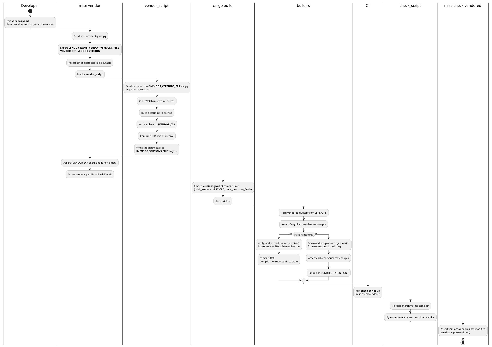

# Vendored dependencies

Vendored dependencies are upstream artifacts committed to the repository so
that builds succeed without network access. Each dependency declares its
pins, artifact location, and vendor/check scripts in a single place:
`config/versions.yaml` under the `vendored:` section.

## Lifecycle



## YAML structure

Each entry under `vendored:` follows this contract:

| Field | Required | Description |
|---|---|---|
| `version` | No | Primary version pin (tag, SHA, semver). |
| `vendor_dir` | No | Repository-relative path where vendored artifacts live. |
| `vendor_script` | No | Script that regenerates artifacts. Must comply with the vendor contract. |
| `check_script` | No | Script that validates artifacts match pins. Must comply with the check contract. |
| `extensions` | No | Named sub-dependencies with optional `source_revision`, `source_archive_sha256`, and `binaries` (platform to SHA-256 map). |
| `pins` | No | Flat key-value sub-pins (e.g. Iglu schema name to version). |

Examples:

```yaml
vendored:
  duckdb:
    version: v1.5.5
    vendor_dir: crates/duckdb-client/third_party
    vendor_script: scripts/vendored/duckdb/fts-vendor.sh
    check_script: scripts/vendored/duckdb/check-duckdb-fts-sources-sync.sh
    extensions:
      fts:
        source_revision: 6814ec9a7d5fd63500176507262b0dbf7cea0095
        source_archive_sha256: 2aad18...
        binaries:
          linux_amd64: 90d6f049...

  gitlab_system_note_actions:
    version: ea52f8c3adc...
    vendor_dir: config/vendored
    check_script: scripts/vendored/gitlab_system_note_actions/check.sh

  iglu:
    vendor_dir: config/schemas/iglu
    vendor_script: scripts/vendored/iglu/bump.sh
    check_script: scripts/vendored/iglu/check.sh
    pins:
      orbit_query: 2-2-0
      orbit_common: 1-0-3
```

## Script contract

A generic runner (`scripts/vendored/run.sh`) parses the YAML entry and
invokes the script with standardized environment variables.

### Environment variables

| Variable | Description |
|---|---|
| `VENDOR_NAME` | Key under `vendored:` (e.g. `duckdb`). |
| `VENDOR_VERSIONS_FILE` | Absolute path to `config/versions.yaml`. |
| `VENDOR_DIR` | Absolute path resolved from `vendor_dir`. |
| `VENDOR_VERSION` | Value of `version` (empty string if absent). |

### vendor_script

- **Input:** Pins from `$VENDOR_VERSIONS_FILE` (via env vars and `yq`).
- **Output:** Artifacts written to `$VENDOR_DIR`.
- **Side-effect:** Writes computed checksums back into `$VENDOR_VERSIONS_FILE` via `yq -i`.
- **Exit:** 0 on success, non-zero on failure.

### check_script

- **Input:** Pins from `$VENDOR_VERSIONS_FILE` and artifacts from `$VENDOR_DIR`.
- **Output:** Human-readable pass/fail to stdout.
- **Side-effect:** None. Must not modify any files.
- **Exit:** 0 if artifacts match pins, non-zero on drift.

## Validation layers

1. **Schema validation.** `config/schemas/versions.schema.json` enforces key
   patterns, hex lengths, path restrictions, script prefix, and structural
   constraints. Validated in CI (`versions-schema-validate`) and locally
   (`mise versions:validate`).
2. **Compile time.** `orbit_versions::Versions` deserializes with
   `deny_unknown_fields`, catching structural drift.
3. **Build time.** `crates/duckdb-client/build.rs` asserts Cargo.lock matches
   the version pin, verifies archive checksums, and checks platform coverage.
4. **Runner time.** `scripts/vendored/run.sh` validates preconditions (script
   exists, YAML parses) and postconditions (vendor_dir non-empty, YAML still
   valid, check_script did not modify the file).
5. **CI time.** The `duckdb-fts-sources-sync-check` job re-vendors the archive
   from upstream and byte-compares it against the committed artifact.

## Operator workflows

### Bump DuckDB version

1. Edit `vendored.duckdb.version` in `config/versions.yaml`.
2. Update `extensions.fts.source_revision` to the new duckdb-fts commit.
3. Run `mise vendor -- duckdb`. The script regenerates the archive and writes
   `source_archive_sha256` back.
4. Update `Cargo.toml` duckdb crate version to match.
5. Run `cargo build` to verify.

### Add a new DuckDB extension

1. Add a block under `vendored.duckdb.extensions` with `binaries:` checksums
   (and optionally `source_revision` and `source_archive_sha256` for static
   linking).
2. `build.rs` picks it up automatically: the download loop iterates all
   extensions, and `verify_and_extract_source_archive` is reusable for any
   extension with a source archive.
3. For static linking, add a `compile_<name>` function in `build.rs` with the
   extension-specific C++ source list and build flags.

### Bump an Iglu schema version

1. Edit the pin under `vendored.iglu.pins` in `config/versions.yaml`
   (e.g. change `orbit_query: 2-2-0` to `orbit_query: 2-3-0`).
2. Run `mise vendor -- iglu`. The script fetches the schema JSON for every
   pin from the upstream Iglu registry and writes it to `vendor_dir`.
3. Run `cargo build` to verify (the `orbit-analytics` build script reads
   the pins at compile time and validates the schema's `self` block).

### Add a new vendored dependency

1. Add an entry under `vendored:` in `config/versions.yaml` with `version`,
   `vendor_dir`, and optionally `vendor_script` and `check_script`.
2. The `orbit_versions::VendoredDependency` type deserializes it with no Rust
   changes needed.
3. `mise vendor -- <name>` and `mise check:vendored -- <name>` work
   immediately via the generic runner.
