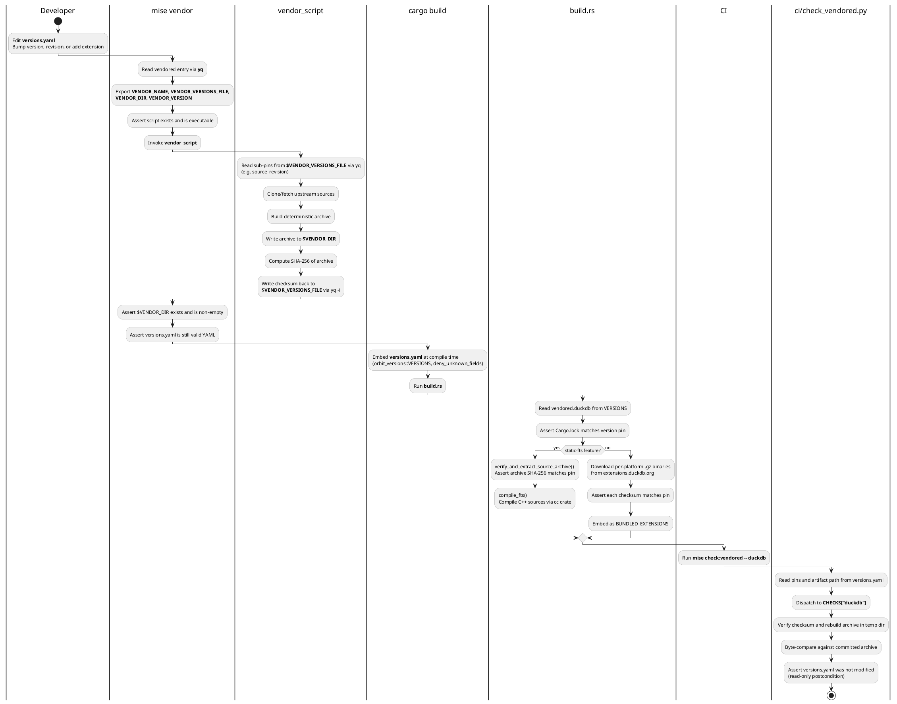

# Vendored dependencies

Vendored dependencies are upstream artifacts committed to the repository so
that builds succeed without network access. Each dependency declares its
pins, artifact location, and scripts in
`config/versions.yaml` under the `vendored:` section.
`scripts/vendored/run.sh` regenerates artifacts. `ci/check_vendored.py` checks them
through its `CHECKS` registry.

## Lifecycle


```plantuml
@startuml
skinparam backgroundColor white
skinparam activityBackgroundColor #F0F0F0
skinparam activityBorderColor #999999

|Developer|
start
:Edit **versions.yaml**\nBump version, revision, or add extension;

|mise vendor|
:Read vendored entry via **yq**;
:Export **VENDOR_NAME**, **VENDOR_VERSIONS_FILE**,\n**VENDOR_DIR**, **VENDOR_VERSION**;
:Assert script exists and is executable;
:Invoke **vendor_script**;

|vendor_script|
:Read sub-pins from **$VENDOR_VERSIONS_FILE** via yq\n(e.g. source_revision);
:Clone/fetch upstream sources;
:Build deterministic archive;
:Write archive to **$VENDOR_DIR**;
:Compute SHA-256 of archive;
:Write checksum back to\n**$VENDOR_VERSIONS_FILE** via yq -i;

|mise vendor|
:Assert $VENDOR_DIR exists and is non-empty;
:Assert versions.yaml is still valid YAML;

|cargo build|
:Embed **versions.yaml** at compile time\n(orbit_versions::VERSIONS, deny_unknown_fields);
:Run **build.rs**;

|build.rs|
:Read vendored.duckdb from VERSIONS;
:Assert Cargo.lock matches version pin;

if (static-fts feature?) then (yes)
  :verify_and_extract_source_archive()\nAssert archive SHA-256 matches pin;
  :compile_fts()\nCompile C++ sources via cc crate;
else (no)
  :Download per-platform .gz binaries\nfrom extensions.duckdb.org;
  :Assert each checksum matches pin;
  :Embed as BUNDLED_EXTENSIONS;
endif

|CI|
:Run **mise check:vendored -- duckdb**;

|ci/check_vendored.py|
:Read pins and artifact path from versions.yaml;
:Dispatch to **CHECKS["duckdb"]**;
:Verify checksum and rebuild archive in temp dir;
:Byte-compare against committed archive;
:Assert versions.yaml was not modified\n(read-only postcondition);
stop
@enduml
```

## YAML structure

Each entry under `vendored:` follows this contract:

| Field | Required | Description |
|---|---|---|
| `version` | No | Primary version pin (tag, SHA, semver). |
| `vendor_dir` | No | Repository-relative path where vendored artifacts live. |
| `vendor_script` | No | Executable shell script under `scripts/vendored/` that regenerates artifacts. |
| `check_script` | No | Literal `ci/check_vendored.py`; requires an entry in its `CHECKS` registry. |
| `extensions` | No | Named sub-dependencies with optional `source_revision`, `source_archive_sha256`, and `binaries` (platform to SHA-256 map). |
| `pins` | No | Flat key-value sub-pins (e.g. Iglu schema name to version). |

Examples:

```yaml
vendored:
  duckdb:
    version: v1.5.5
    vendor_dir: crates/duckdb-client/third_party
    vendor_script: scripts/vendored/duckdb/fts-vendor.sh
    check_script: ci/check_vendored.py
    extensions:
      fts:
        source_revision: 6814ec9a7d5fd63500176507262b0dbf7cea0095
        source_archive_sha256: 2aad18...
        binaries:
          linux_amd64: 90d6f049...

  gitlab_system_note_actions:
    version: ea52f8c3adc...
    vendor_dir: config/vendored
    check_script: ci/check_vendored.py

  iglu:
    vendor_dir: config/schemas/iglu
    vendor_script: scripts/vendored/iglu/bump.sh
    check_script: ci/check_vendored.py
    pins:
      orbit_query: 2-2-0
      orbit_common: 1-0-4
```

## Script contract

`mise vendor -- <name>` calls `scripts/vendored/run.sh vendor <name>`.
The runner reads the YAML entry and invokes `vendor_script` with these environment
variables. It accepts only vendor mode.

### Environment variables

| Variable | Description |
|---|---|
| `VENDOR_NAME` | Key under `vendored:` (e.g. `duckdb`). |
| `VENDOR_VERSIONS_FILE` | Absolute path to `config/versions.yaml`. |
| `VENDOR_DIR` | Absolute path resolved from `vendor_dir`. |
| `VENDOR_VERSION` | Value of `version` (empty string if absent). |

### vendor_script

The script reads pins from `$VENDOR_VERSIONS_FILE` and writes artifacts to
`$VENDOR_DIR`. It can write computed checksums back with `yq -i`.
It exits with 0 on success and non-zero on failure.

### check_script

`mise check:vendored -- <name>` calls Python directly. The checker reads
`config/versions.yaml` and passes the entry and artifact path to `CHECKS[name]`.
It uses temporary files and leaves committed files unchanged.
It reports every selected failure and exits non-zero on drift or invalid input.
`mise check:vendored:all` selects entries with `check_script`.

DuckDB checks the archive checksum and byte-compares a rebuilt archive.
Iglu compares parsed JSON with upstream schemas. System-note actions compares
the committed list with Rails constants; fetch failures are warnings.

## Validation layers

1. **Schema validation.** `config/schemas/versions.schema.json` constrains keys,
   pins, paths, and the literal `check_script` value. Run `mise versions:validate`;
   CI runs it in `repository-checks`.
2. **Compile time.** `orbit_versions::Versions` deserializes with
   `deny_unknown_fields`, catching structural drift.
3. **Build time.** `crates/duckdb-client/build.rs` asserts Cargo.lock matches
   the version pin, verifies archive checksums, and checks platform coverage.
4. **Vendor time.** `scripts/vendored/run.sh` requires an executable script.
   After it runs, the artifact directory must contain files and the YAML must parse.
5. **Check time.** The `vendored-check` job runs the Python registry checks.
   The checker rejects changes to `config/versions.yaml` after each check.

## Operator workflows

### Bump DuckDB version

1. Edit `vendored.duckdb.version` in `config/versions.yaml`.
2. Update `extensions.fts.source_revision` to the new duckdb-fts commit.
3. Run `mise vendor -- duckdb`. The script regenerates the archive and writes
   `source_archive_sha256` back.
4. Update `Cargo.toml` duckdb crate version to match.
5. Run `mise check:vendored -- duckdb`, then `mise build` to verify.

### Add a new DuckDB extension

1. Add a block under `vendored.duckdb.extensions` with `binaries:` checksums
   (and optionally `source_revision` and `source_archive_sha256` for static
   linking).
2. `build.rs` picks it up automatically: the download loop iterates all
   extensions, and `verify_and_extract_source_archive` is reusable for any
   extension with a source archive.
3. For static linking, add a `compile_<name>` function in `build.rs` with the
   extension-specific C++ source list and build flags.

### Bump an Iglu schema version

1. Edit the pin under `vendored.iglu.pins` in `config/versions.yaml`
   (e.g. change `orbit_query: 2-2-0` to `orbit_query: 2-3-0`).
2. Run `mise vendor -- iglu`. The script fetches the schema JSON for every
   pin from the upstream Iglu registry and writes it to `vendor_dir`.
3. Run `mise check:vendored -- iglu`, then `mise build`.
   The `orbit-analytics` build script validates the schema's `self` block against the pins.

### Add a new vendored dependency

1. Add an entry under `vendored:` in `config/versions.yaml` with `vendor_dir`
   and the required pins.
2. To regenerate artifacts, add an executable `vendor_script` under
   `scripts/vendored/` that follows the vendor contract.
3. To check artifacts, set `check_script: ci/check_vendored.py`.
   Implement the checker in that module and register the dependency name in `CHECKS`.
4. Add CLI coverage in `ci/tests/vendored_checks_test.py`.
   Run `mise versions:validate`, the dependency's vendor and check tasks, and `mise ci:test`.
