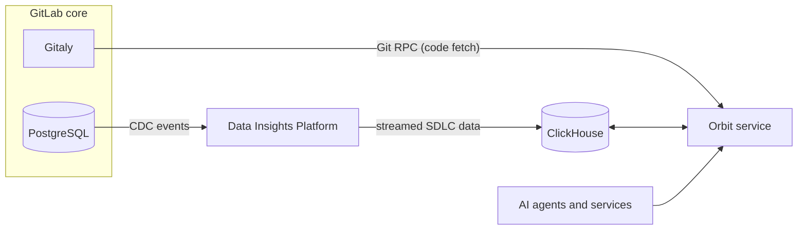



- Tier: Ultimate
- Offering: GitLab.com





- [Introduced](https://gitlab.com/gitlab-org/gitlab/-/work_items/583676) in GitLab 18.10 [with a feature flag](../administration/feature_flags.md) named `knowledge_graph`. Disabled by default.
- Enabled on GitLab.com in GitLab 18.XX.





The availability of this feature is controlled by a feature flag.
For more information, see the history.



Orbit is a service that indexes your groups, projects, and repositories.
Then, it analyzes the relationships between the indexed objects to build a knowledge graph from your instance.
The knowledge graph is a structured, queryable map of your entire software development lifecycle,
so you can understand how your work is organized and how its parts relate to each other.

Orbit exposes the knowledge graph through a unified context API for human users and MCP-enabled AI systems.
Explore the graph in the GitLab UI, or query it with the GitLab Duo Agent Platform to bring full workspace context into your agentic AI sessions.

You can use Orbit to get answers to questions like:

- Based on past reviews and file ownership, Who should review this change?
- Have any vulnerabilities been found in this project, and and are any unresolved?
- Which projects depend on this module or library?
- What work items are assigned to this user across all projects?

## Enable or disable Orbit

Enable Orbit for a top-level group to add its data to the knowledge graph.
Disable it to stop indexing and remove the group's data.

Prerequisites:

- You must have the Owner role for the group.

To enable or disable Orbit for a top-level group:

1. On the left sidebar, select **Search or go to** > **Your work**.
1. Select **Orbit** > **Configuration**.
1. Next to the group, turn **Enable** on or off.

Orbit indexes your data in seconds.

To get get started, do ...

## Data sources

Orbit ingests two categories of data:

1. GitLab data includes the objects that make up your instance:

   - Groups and projects
   - Users
   - Work items
   - Merge requests
   - Pipelines
   - Vulnerabilities and security findings

   GitLab data is streamed from PostgreSQL through the GitLab Data Insights Platform into ClickHouse,
   where Orbit reads it using change data capture (CDC) events. CDC events track every addition, update, and deletion in the database,
   so the knowledge graph stays current automatically.

1. Code data includes the content of your repositories:

   - Files and directories
   - Function, class, and module definitions
   - Imports and cross-file references
   - Call graphs and data flows

   Code data is fetched directly from Gitaly using Git RPC calls. Orbit ingests code from only the default branch.

For a full list of indexed object types and relationships, see the [knowledge graph schema](schema.md).

### Supported languages

Orbit supports code indexing for the following languages:

| Language | Definitions and imports | Intra-file references | Cross-file references |
|---|---|---|---|
| Ruby |  |  |  |
| Java |  |  |  |
| Kotlin |  |  |  |
| Python |  |  |  |
| TypeScript |  |  |  |
| JavaScript |  |  |  |

## Feedback

Your feedback is valuable in helping us improve this feature. Share your experiences, suggestions, or issues in [issue 160](https://gitlab.com/gitlab-org/rust/knowledge-graph/-/issues/160).
